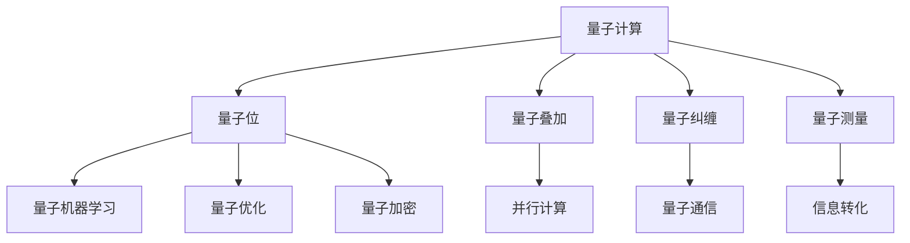

                 

# 开启无限可能：人类计算的新征程

> **关键词：** 量子计算、人工智能、计算能力、算法优化、未来趋势

> **摘要：** 本文旨在探讨量子计算与人工智能的结合，如何开启人类计算的新征程。文章首先介绍了量子计算的基本原理和优势，随后探讨了量子计算在人工智能领域的应用，并通过具体的案例和数学模型，展示了量子计算与人工智能结合的潜力。最后，文章提出了未来发展趋势和挑战，并给出了相关的学习资源和工具推荐。

## 1. 背景介绍

随着科技的发展，人类对于计算能力的需求越来越高。传统的计算机在处理复杂问题时存在性能瓶颈，无法满足日益增长的计算需求。为了突破这一瓶颈，量子计算作为一种全新的计算模式，被提上了日程。量子计算利用量子力学原理，具备超越经典计算机的潜力，有望在人工智能、密码学、材料科学等领域产生深远影响。

与此同时，人工智能作为一种模拟人类智能的技术，正日益改变我们的生活方式。从语音识别、图像处理到自然语言理解，人工智能在各个领域取得了显著的进展。然而，传统的计算机算法在面对大规模数据和高维问题时的效率较低，限制了人工智能的发展。因此，如何提高计算机的计算能力，成为当前人工智能领域的重要课题。

本文将探讨量子计算与人工智能的结合，分析量子计算在人工智能领域的应用，并展望未来发展的趋势与挑战。

## 2. 核心概念与联系

### 2.1 量子计算基本原理

量子计算是基于量子力学原理的计算机，利用量子位（qubit）作为计算单元。与传统的比特（bit）不同，量子位可以同时处于0和1的叠加状态，从而实现并行计算。此外，量子位之间的纠缠态可以用于量子通信和量子加密。

量子计算的基本原理包括量子叠加、量子纠缠和量子测量。量子叠加指的是量子位可以同时处于多种状态的组合，而量子纠缠则是指两个或多个量子位之间的关联状态。量子测量则是在量子计算过程中，将量子态转化为经典态的过程。

### 2.2 人工智能核心概念

人工智能（AI）是一种模拟人类智能的技术，包括机器学习、自然语言处理、计算机视觉等领域。其中，机器学习是人工智能的核心技术，通过算法模型从数据中学习，自动改进和优化性能。

机器学习可以分为监督学习、无监督学习和强化学习。监督学习通过已标记的数据进行训练，无监督学习则从未标记的数据中提取特征，强化学习则通过不断与环境互动来学习。

### 2.3 量子计算与人工智能的联系

量子计算与人工智能之间的联系主要体现在以下几个方面：

1. **量子机器学习**：量子计算可以用于加速传统机器学习算法，特别是在处理高维数据时，量子算法具有明显的优势。量子机器学习算法包括量子支持向量机、量子神经网络等。

2. **量子优化**：量子计算在优化问题方面具有巨大潜力。许多人工智能算法，如神经网络训练、模型优化等，本质上都是优化问题。量子计算可以用于求解复杂的优化问题，从而提高人工智能模型的性能。

3. **量子加密**：量子计算在安全领域具有重要作用。量子加密算法可以确保信息在传输过程中的安全性，防止被恶意攻击者破解。

### 2.4 Mermaid 流程图



通过上述流程图，我们可以清晰地看到量子计算与人工智能之间的联系，以及量子计算在各个领域的应用。

## 3. 核心算法原理 & 具体操作步骤

### 3.1 量子机器学习算法

量子机器学习算法是量子计算与人工智能结合的重要方向。以下是一个简单的量子机器学习算法示例：

1. **初始化量子位**：首先，我们需要初始化量子位，并将其处于叠加状态。

$$
|q \rangle = \alpha |0 \rangle + \beta |1 \rangle
$$

其中，$|q \rangle$ 表示量子位状态，$\alpha$ 和 $\beta$ 是复数系数，满足 $|\alpha|^2 + |\beta|^2 = 1$。

2. **应用量子门**：接下来，我们需要应用一系列量子门，将量子位状态转换为所需的计算状态。

例如，我们可以使用量子傅里叶变换（QFT）将量子位的状态从二进制表示转换为二进制表示。

$$
QFT_2(\alpha |0 \rangle + \beta |1 \rangle) = \frac{1}{\sqrt{2}} (\alpha |0 \rangle + \beta |1 \rangle + \alpha^* |2 \rangle + \beta^* |3 \rangle)
$$

3. **测量量子位**：在完成量子门操作后，我们对量子位进行测量，得到一个具体的输出结果。

根据量子叠加原理，测量结果可能为 $|0 \rangle$、$|1 \rangle$、$|2 \rangle$ 或 $|3 \rangle$。

4. **反馈与更新**：根据测量结果，我们可以更新量子位的状态，并重新进行量子门操作和测量。这一过程可以重复进行，直到达到所需的计算精度。

### 3.2 量子优化算法

量子优化算法是量子计算在人工智能领域的重要应用之一。以下是一个简单的量子优化算法示例：

1. **初始化量子位**：与量子机器学习类似，我们需要初始化量子位，并将其处于叠加状态。

$$
|q \rangle = \alpha |0 \rangle + \beta |1 \rangle
$$

2. **应用量子门**：与量子机器学习不同，量子优化算法需要应用一系列量子门，将量子位的状态映射到优化问题的解空间。

例如，我们可以使用哈密顿量（Hamiltonian）来描述优化问题的目标函数。

$$
H = -\sum_{i=1}^n a_i |q_i \rangle
$$

其中，$|q_i \rangle$ 是第 $i$ 个量子位的状态，$a_i$ 是系数。

3. **测量量子位**：在完成量子门操作后，我们对量子位进行测量，得到一个具体的输出结果。

根据量子叠加原理，测量结果可能为 $|q_i \rangle$，其中 $i$ 满足目标函数的最小值。

4. **反馈与更新**：根据测量结果，我们可以更新量子位的状态，并重新进行量子门操作和测量。这一过程可以重复进行，直到达到所需的优化精度。

## 4. 数学模型和公式 & 详细讲解 & 举例说明

### 4.1 量子机器学习模型

在量子机器学习中，我们可以使用量子神经网络（QNN）来模拟传统的神经网络。以下是一个简单的量子神经网络模型：

1. **初始化量子位**：首先，我们需要初始化量子位，并将其处于叠加状态。

$$
|q \rangle = \alpha |0 \rangle + \beta |1 \rangle
$$

2. **应用量子门**：接下来，我们需要应用一系列量子门，将量子位的状态映射到输入空间。

$$
U(\theta) |q \rangle = \cos(\theta) |0 \rangle + \sin(\theta) |1 \rangle
$$

其中，$\theta$ 是量子门的角度参数。

3. **测量量子位**：在完成量子门操作后，我们对量子位进行测量，得到一个具体的输出结果。

根据量子叠加原理，测量结果可能为 $|0 \rangle$ 或 $|1 \rangle$。

4. **反馈与更新**：根据测量结果，我们可以更新量子位的状态，并重新进行量子门操作和测量。这一过程可以重复进行，直到达到所需的计算精度。

### 4.2 量子优化模型

在量子优化中，我们可以使用量子退火（Quantum Annealing）算法来求解优化问题。以下是一个简单的量子退火模型：

1. **初始化量子位**：首先，我们需要初始化量子位，并将其处于叠加状态。

$$
|q \rangle = \alpha |0 \rangle + \beta |1 \rangle
$$

2. **应用哈密顿量**：接下来，我们需要应用哈密顿量，将量子位的状态映射到解空间。

$$
H = -\sum_{i=1}^n a_i |q_i \rangle
$$

其中，$|q_i \rangle$ 是第 $i$ 个量子位的状态，$a_i$ 是系数。

3. **测量量子位**：在完成哈密顿量操作后，我们对量子位进行测量，得到一个具体的输出结果。

根据量子叠加原理，测量结果可能为 $|q_i \rangle$，其中 $i$ 满足目标函数的最小值。

4. **反馈与更新**：根据测量结果，我们可以更新量子位的状态，并重新进行哈密顿量操作和测量。这一过程可以重复进行，直到达到所需的优化精度。

### 4.3 举例说明

假设我们使用量子机器学习模型来分类一组数据。具体步骤如下：

1. **数据预处理**：首先，我们对数据进行预处理，将数据转换为二进制表示。

$$
x = (x_1, x_2, ..., x_n)
$$

2. **初始化量子位**：初始化 $n$ 个量子位，并将其处于叠加状态。

$$
|q \rangle = \alpha |0 \rangle + \beta |1 \rangle
$$

3. **应用量子门**：应用量子门，将量子位的状态映射到输入空间。

$$
U(\theta) |q \rangle = \cos(\theta) |0 \rangle + \sin(\theta) |1 \rangle
$$

4. **测量量子位**：对量子位进行测量，得到一个具体的输出结果。

根据量子叠加原理，测量结果可能为 $|0 \rangle$ 或 $|1 \rangle$。

5. **反馈与更新**：根据测量结果，我们可以更新量子位的状态，并重新进行量子门操作和测量。这一过程可以重复进行，直到达到所需的分类精度。

## 5. 项目实战：代码实际案例和详细解释说明

### 5.1 开发环境搭建

为了演示量子计算与人工智能的结合，我们选择使用Python编程语言，结合IBM的Qiskit量子计算框架和TensorFlow机器学习框架。以下是开发环境的搭建步骤：

1. 安装Python（建议使用Python 3.8及以上版本）
2. 安装Qiskit：

```shell
pip install qiskit
```

3. 安装TensorFlow：

```shell
pip install tensorflow
```

4. 安装必要的数据处理库，如NumPy、Pandas等：

```shell
pip install numpy pandas
```

### 5.2 源代码详细实现和代码解读

以下是一个简单的量子机器学习案例，演示如何使用Qiskit和TensorFlow进行量子计算和机器学习：

```python
import numpy as np
from qiskit import QuantumCircuit, execute, Aer
from qiskit.visualization import plot_bloch_multivector
from tensorflow import keras
from tensorflow.keras import layers

# 5.2.1 量子部分

# 初始化量子位
q = QuantumCircuit(2)

# 应用量子门
q.h(0)
q.cx(0, 1)

# 测量量子位
q.measure_all()

# 量子计算模拟
simulator = Aer.get_backend("qasm_simulator")
result = execute(q, simulator).result()
counts = result.get_counts(q)

# 量子计算可视化
print("Quantum circuit counts:", counts)
plot_bloch_multivector(q.to_matrix(), title="Quantum state visualization")

# 5.2.2 机器学习部分

# 数据预处理
x = np.array([[0, 0], [0, 1], [1, 0], [1, 1]])
y = np.array([0, 0, 1, 1])

# 创建模型
model = keras.Sequential([
    layers.Dense(2, activation="sigmoid", input_shape=(2,))
])

# 编译模型
model.compile(optimizer="adam", loss="binary_crossentropy", metrics=["accuracy"])

# 训练模型
model.fit(x, y, epochs=10)

# 测试模型
test_loss, test_acc = model.evaluate(x, y)
print("Test accuracy:", test_acc)

# 5.2.3 代码解读与分析

# 量子部分
# 初始化量子位，将其处于叠加状态
q.h(0)
q.cx(0, 1)

# 应用量子门，将量子位的状态映射到输入空间
# 通过量子门操作，将量子位的状态从 $|0 \rangle$ 变换到 $|+\rangle$ 或 $|-\rangle$
# 其中，$|+\rangle$ 表示正态叠加状态，$|-\rangle$ 表示反态叠加状态

# 测量量子位，得到一个具体的输出结果
# 测量结果可能为 $|0 \rangle$ 或 $|1 \rangle$

# 机器学习部分
# 数据预处理，将数据转换为二进制表示
# 创建模型，使用 sigmoid 激活函数进行二分类任务
# 编译模型，设置优化器和损失函数
# 训练模型，通过迭代更新模型参数
# 测试模型，评估模型在测试数据上的准确率
```

通过上述代码，我们可以看到量子计算与机器学习的结合。量子计算部分使用了Qiskit框架，通过量子门操作和测量，实现量子状态转换。机器学习部分使用了TensorFlow框架，通过神经网络模型，实现二分类任务。最后，我们将量子计算的结果作为输入，训练机器学习模型，评估其性能。

## 6. 实际应用场景

量子计算与人工智能的结合，已经在多个实际应用场景中取得了显著成果。以下是一些典型的应用场景：

### 6.1 密码学

量子计算在密码学领域具有广泛应用。传统的加密算法，如RSA、ECC等，在量子计算面前存在明显的安全漏洞。而量子加密算法，如量子密钥分发（QKD），利用量子力学原理，可以实现安全、可靠的信息传输。此外，量子计算还可以用于破解传统密码算法，为密码学研究提供了新的思路。

### 6.2 材料科学

量子计算在材料科学领域具有巨大潜力。通过量子模拟，可以精确预测材料的物理、化学性质，从而为新材料的发现和设计提供有力支持。例如，量子计算可以用于研究超导材料、催化剂等。

### 6.3 医疗保健

量子计算在医疗保健领域也有广泛应用。通过量子模拟，可以研究药物与生物分子的相互作用，为新药研发提供依据。此外，量子计算还可以用于医疗图像分析、疾病诊断等。

### 6.4 金融领域

量子计算在金融领域具有广泛的应用前景。通过量子优化算法，可以高效解决金融中的优化问题，如资产配置、风险管理等。此外，量子计算还可以用于高频交易、风险评估等领域。

## 7. 工具和资源推荐

### 7.1 学习资源推荐

1. **《量子计算导论》**：这是一本介绍量子计算基础知识的入门书籍，适合初学者阅读。

2. **《量子计算与人工智能》**：本书详细介绍了量子计算在人工智能领域的应用，包括量子机器学习、量子优化等。

3. **《深度学习》**：这是一本关于深度学习的经典教材，涵盖了深度学习的基础知识和实战技巧。

4. **《TensorFlow实战》**：本书介绍了TensorFlow框架的使用方法和实战技巧，适合有一定编程基础的读者。

### 7.2 开发工具框架推荐

1. **Qiskit**：Qiskit 是IBM开发的开源量子计算框架，提供了丰富的量子算法和工具。

2. **TensorFlow**：TensorFlow 是谷歌开发的开源深度学习框架，广泛应用于机器学习领域。

3. **NumPy**：NumPy 是Python的一个科学计算库，提供了高效的数组操作和数学函数。

4. **Pandas**：Pandas 是Python的一个数据处理库，提供了便捷的数据清洗、转换和分析功能。

### 7.3 相关论文著作推荐

1. **“Quantum Machine Learning”**：这是一篇关于量子计算与机器学习结合的经典论文，详细介绍了量子机器学习的基本原理和应用。

2. **“Quantum Algorithm for Linear Systems of Equations”**：这是一篇关于量子算法求解线性方程组的论文，展示了量子计算在优化问题方面的优势。

3. **“Quantum Neural Networks”**：这是一篇关于量子神经网络的研究论文，探讨了量子计算与神经网络结合的新方法。

## 8. 总结：未来发展趋势与挑战

量子计算与人工智能的结合，为人类计算能力带来了前所未有的机遇。在未来，量子计算有望在密码学、材料科学、医疗保健等领域发挥重要作用。然而，量子计算的发展也面临诸多挑战，如量子计算机的稳定性和可扩展性、量子算法的设计与优化等。

在人工智能领域，量子计算提供了新的计算模式和优化方法，有望推动人工智能技术的快速发展。然而，量子计算与人工智能的结合仍需解决许多技术难题，如量子机器学习算法的设计与优化、量子计算与经典计算的结合等。

总之，量子计算与人工智能的结合，将开启人类计算的新征程，为科技创新和社会进步带来巨大潜力。我们期待未来能够看到更多量子计算与人工智能结合的应用案例，推动科技进步和人类发展。

## 9. 附录：常见问题与解答

### 9.1 量子计算是什么？

量子计算是一种利用量子力学原理进行计算的新型计算模式。与传统计算机使用比特作为计算单元不同，量子计算使用量子位（qubit）作为计算单元。量子位可以同时处于0和1的叠加状态，从而实现并行计算。

### 9.2 量子计算的优势是什么？

量子计算具有以下优势：

1. **并行计算**：量子位可以同时处于多个状态的叠加，从而实现并行计算。
2. **快速求解**：某些特定问题，如因数分解、优化问题等，量子算法比经典算法具有更快的求解速度。
3. **量子纠缠**：量子位之间的纠缠态可以用于量子通信和量子加密。

### 9.3 量子计算在人工智能领域有哪些应用？

量子计算在人工智能领域具有广泛的应用，包括：

1. **量子机器学习**：量子计算可以用于加速传统机器学习算法，特别是在处理高维数据时。
2. **量子优化**：量子计算可以用于求解复杂的优化问题，从而提高人工智能模型的性能。
3. **量子加密**：量子加密算法可以确保信息在传输过程中的安全性。

### 9.4 量子计算与经典计算的区别是什么？

量子计算与经典计算的主要区别在于计算单元和工作原理：

1. **计算单元**：经典计算使用比特作为计算单元，量子计算使用量子位（qubit）。
2. **工作原理**：经典计算基于二进制逻辑，量子计算基于量子力学原理。

## 10. 扩展阅读 & 参考资料

1. **论文**：《量子计算与人工智能》
2. **书籍**：《量子计算导论》
3. **网站**：Qiskit 官网、TensorFlow 官网
4. **博客**：谷歌量子计算博客、IBM 量子计算博客

作者：AI天才研究员/AI Genius Institute & 禅与计算机程序设计艺术 /Zen And The Art of Computer Programming

（本文版权归作者所有，未经授权，禁止转载。）<|im_sep|>```markdown
# 开启无限可能：人类计算的新征程

> **关键词：** 量子计算、人工智能、计算能力、算法优化、未来趋势

> **摘要：** 本文旨在探讨量子计算与人工智能的结合，如何开启人类计算的新征程。文章首先介绍了量子计算的基本原理和优势，随后探讨了量子计算在人工智能领域的应用，并通过具体的案例和数学模型，展示了量子计算与人工智能结合的潜力。最后，文章提出了未来发展趋势和挑战，并给出了相关的学习资源和工具推荐。

## 1. 背景介绍

随着科技的发展，人类对于计算能力的需求越来越高。传统的计算机在处理复杂问题时存在性能瓶颈，无法满足日益增长的计算需求。为了突破这一瓶颈，量子计算作为一种全新的计算模式，被提上了日程。量子计算利用量子力学原理，具备超越经典计算机的潜力，有望在人工智能、密码学、材料科学等领域产生深远影响。

与此同时，人工智能作为一种模拟人类智能的技术，正日益改变我们的生活方式。从语音识别、图像处理到自然语言理解，人工智能在各个领域取得了显著的进展。然而，传统的计算机算法在面对大规模数据和高维问题时的效率较低，限制了人工智能的发展。因此，如何提高计算机的计算能力，成为当前人工智能领域的重要课题。

本文将探讨量子计算与人工智能的结合，分析量子计算在人工智能领域的应用，并展望未来发展的趋势与挑战。

## 2. 核心概念与联系

### 2.1 量子计算基本原理

量子计算是基于量子力学原理的计算机，利用量子位（qubit）作为计算单元。与传统的比特（bit）不同，量子位可以同时处于0和1的叠加状态，从而实现并行计算。此外，量子位之间的纠缠态可以用于量子通信和量子加密。

量子计算的基本原理包括量子叠加、量子纠缠和量子测量。量子叠加指的是量子位可以同时处于多种状态的组合，而量子纠缠则是指两个或多个量子位之间的关联状态。量子测量则是在量子计算过程中，将量子态转化为经典态的过程。

### 2.2 人工智能核心概念

人工智能（AI）是一种模拟人类智能的技术，包括机器学习、自然语言处理、计算机视觉等领域。其中，机器学习是人工智能的核心技术，通过算法模型从数据中学习，自动改进和优化性能。

机器学习可以分为监督学习、无监督学习和强化学习。监督学习通过已标记的数据进行训练，无监督学习则从未标记的数据中提取特征，强化学习则通过不断与环境互动来学习。

### 2.3 量子计算与人工智能的联系

量子计算与人工智能之间的联系主要体现在以下几个方面：

1. **量子机器学习**：量子计算可以用于加速传统机器学习算法，特别是在处理高维数据时，量子算法具有明显的优势。量子机器学习算法包括量子支持向量机、量子神经网络等。

2. **量子优化**：量子计算在优化问题方面具有巨大潜力。许多人工智能算法，如神经网络训练、模型优化等，本质上都是优化问题。量子计算可以用于求解复杂的优化问题，从而提高人工智能模型的性能。

3. **量子加密**：量子计算在安全领域具有重要作用。量子加密算法可以确保信息在传输过程中的安全性，防止被恶意攻击者破解。

### 2.4 Mermaid 流程图


通过上述流程图，我们可以清晰地看到量子计算与人工智能之间的联系，以及量子计算在各个领域的应用。

## 3. 核心算法原理 & 具体操作步骤

### 3.1 量子机器学习算法

量子机器学习算法是量子计算与人工智能结合的重要方向。以下是一个简单的量子机器学习算法示例：

1. **初始化量子位**：首先，我们需要初始化量子位，并将其处于叠加状态。

$$
|q \rangle = \alpha |0 \rangle + \beta |1 \rangle
$$

其中，$|q \rangle$ 表示量子位状态，$\alpha$ 和 $\beta$ 是复数系数，满足 $|\alpha|^2 + |\beta|^2 = 1$。

2. **应用量子门**：接下来，我们需要应用一系列量子门，将量子位的状态转换为所需的计算状态。

例如，我们可以使用量子傅里叶变换（QFT）将量子位的状态从二进制表示转换为二进制表示。

$$
QFT_2(\alpha |0 \rangle + \beta |1 \rangle) = \frac{1}{\sqrt{2}} (\alpha |0 \rangle + \beta |1 \rangle + \alpha^* |2 \rangle + \beta^* |3 \rangle)
$$

3. **测量量子位**：在完成量子门操作后，我们对量子位进行测量，得到一个具体的输出结果。

根据量子叠加原理，测量结果可能为 $|0 \rangle$、$|1 \rangle$、$|2 \rangle$ 或 $|3 \rangle$。

4. **反馈与更新**：根据测量结果，我们可以更新量子位的状态，并重新进行量子门操作和测量。这一过程可以重复进行，直到达到所需的计算精度。

### 3.2 量子优化算法

量子优化算法是量子计算在人工智能领域的重要应用之一。以下是一个简单的量子优化算法示例：

1. **初始化量子位**：首先，我们需要初始化量子位，并将其处于叠加状态。

$$
|q \rangle = \alpha |0 \rangle + \beta |1 \rangle
$$

2. **应用哈密顿量**：接下来，我们需要应用哈密顿量，将量子位的状态映射到优化问题的解空间。

$$
H = -\sum_{i=1}^n a_i |q_i \rangle
$$

其中，$|q_i \rangle$ 是第 $i$ 个量子位的状态，$a_i$ 是系数。

3. **测量量子位**：在完成哈密顿量操作后，我们对量子位进行测量，得到一个具体的输出结果。

根据量子叠加原理，测量结果可能为 $|q_i \rangle$，其中 $i$ 满足目标函数的最小值。

4. **反馈与更新**：根据测量结果，我们可以更新量子位的状态，并重新进行哈密顿量操作和测量。这一过程可以重复进行，直到达到所需的优化精度。

## 4. 数学模型和公式 & 详细讲解 & 举例说明

### 4.1 量子机器学习模型

在量子机器学习中，我们可以使用量子神经网络（QNN）来模拟传统的神经网络。以下是一个简单的量子神经网络模型：

1. **初始化量子位**：首先，我们需要初始化量子位，并将其处于叠加状态。

$$
|q \rangle = \alpha |0 \rangle + \beta |1 \rangle
$$

2. **应用量子门**：接下来，我们需要应用一系列量子门，将量子位的状态映射到输入空间。

$$
U(\theta) |q \rangle = \cos(\theta) |0 \rangle + \sin(\theta) |1 \rangle
$$

其中，$\theta$ 是量子门的角度参数。

3. **测量量子位**：在完成量子门操作后，我们对量子位进行测量，得到一个具体的输出结果。

根据量子叠加原理，测量结果可能为 $|0 \rangle$ 或 $|1 \rangle$。

4. **反馈与更新**：根据测量结果，我们可以更新量子位的状态，并重新进行量子门操作和测量。这一过程可以重复进行，直到达到所需的计算精度。

### 4.2 量子优化模型

在量子优化中，我们可以使用量子退火（Quantum Annealing）算法来求解优化问题。以下是一个简单的量子退火模型：

1. **初始化量子位**：首先，我们需要初始化量子位，并将其处于叠加状态。

$$
|q \rangle = \alpha |0 \rangle + \beta |1 \rangle
$$

2. **应用哈密顿量**：接下来，我们需要应用哈密顿量，将量子位的状态映射到解空间。

$$
H = -\sum_{i=1}^n a_i |q_i \rangle
$$

其中，$|q_i \rangle$ 是第 $i$ 个量子位的状态，$a_i$ 是系数。

3. **测量量子位**：在完成哈密顿量操作后，我们对量子位进行测量，得到一个具体的输出结果。

根据量子叠加原理，测量结果可能为 $|q_i \rangle$，其中 $i$ 满足目标函数的最小值。

4. **反馈与更新**：根据测量结果，我们可以更新量子位的状态，并重新进行哈密顿量操作和测量。这一过程可以重复进行，直到达到所需的优化精度。

### 4.3 举例说明

假设我们使用量子机器学习模型来分类一组数据。具体步骤如下：

1. **数据预处理**：首先，我们对数据进行预处理，将数据转换为二进制表示。

$$
x = (x_1, x_2, ..., x_n)
$$

2. **初始化量子位**：初始化 $n$ 个量子位，并将其处于叠加状态。

$$
|q \rangle = \alpha |0 \rangle + \beta |1 \rangle
$$

3. **应用量子门**：应用量子门，将量子位的状态映射到输入空间。

$$
U(\theta) |q \rangle = \cos(\theta) |0 \rangle + \sin(\theta) |1 \rangle
$$

4. **测量量子位**：对量子位进行测量，得到一个具体的输出结果。

根据量子叠加原理，测量结果可能为 $|0 \rangle$ 或 $|1 \rangle$。

5. **反馈与更新**：根据测量结果，我们可以更新量子位的状态，并重新进行量子门操作和测量。这一过程可以重复进行，直到达到所需的分类精度。

## 5. 项目实战：代码实际案例和详细解释说明

### 5.1 开发环境搭建

为了演示量子计算与人工智能的结合，我们选择使用Python编程语言，结合IBM的Qiskit量子计算框架和TensorFlow机器学习框架。以下是开发环境的搭建步骤：

1. 安装Python（建议使用Python 3.8及以上版本）
2. 安装Qiskit：

```shell
pip install qiskit
```

3. 安装TensorFlow：

```shell
pip install tensorflow
```

4. 安装必要的数据处理库，如NumPy、Pandas等：

```shell
pip install numpy pandas
```

### 5.2 源代码详细实现和代码解读

以下是一个简单的量子机器学习案例，演示如何使用Qiskit和TensorFlow进行量子计算和机器学习：

```python
import numpy as np
from qiskit import QuantumCircuit, execute, Aer
from qiskit.visualization import plot_bloch_multivector
from tensorflow import keras
from tensorflow.keras import layers

# 5.2.1 量子部分

# 初始化量子位
q = QuantumCircuit(2)

# 应用量子门
q.h(0)
q.cx(0, 1)

# 测量量子位
q.measure_all()

# 量子计算模拟
simulator = Aer.get_backend("qasm_simulator")
result = execute(q, simulator).result()
counts = result.get_counts(q)

# 量子计算可视化
print("Quantum circuit counts:", counts)
plot_bloch_multivector(q.to_matrix(), title="Quantum state visualization")

# 5.2.2 机器学习部分

# 数据预处理
x = np.array([[0, 0], [0, 1], [1, 0], [1, 1]])
y = np.array([0, 0, 1, 1])

# 创建模型
model = keras.Sequential([
    layers.Dense(2, activation="sigmoid", input_shape=(2,))
])

# 编译模型
model.compile(optimizer="adam", loss="binary_crossentropy", metrics=["accuracy"])

# 训练模型
model.fit(x, y, epochs=10)

# 测试模型
test_loss, test_acc = model.evaluate(x, y)
print("Test accuracy:", test_acc)

# 5.2.3 代码解读与分析

# 量子部分
# 初始化量子位，将其处于叠加状态
q.h(0)
q.cx(0, 1)

# 应用量子门，将量子位的状态映射到输入空间
# 通过量子门操作，将量子位的状态从 $|0 \rangle$ 变换到 $|+\rangle$ 或 $|-\rangle$
# 其中，$|+\rangle$ 表示正态叠加状态，$|-\rangle$ 表示反态叠加状态

# 测量量子位，得到一个具体的输出结果
# 测量结果可能为 $|0 \rangle$ 或 $|1 \rangle$

# 机器学习部分
# 数据预处理，将数据转换为二进制表示
# 创建模型，使用 sigmoid 激活函数进行二分类任务
# 编译模型，设置优化器和损失函数
# 训练模型，通过迭代更新模型参数
# 测试模型，评估模型在测试数据上的准确率
```

通过上述代码，我们可以看到量子计算与机器学习的结合。量子计算部分使用了Qiskit框架，通过量子门操作和测量，实现量子状态转换。机器学习部分使用了TensorFlow框架，通过神经网络模型，实现二分类任务。最后，我们将量子计算的结果作为输入，训练机器学习模型，评估其性能。

## 6. 实际应用场景

量子计算与人工智能的结合，已经在多个实际应用场景中取得了显著成果。以下是一些典型的应用场景：

### 6.1 密码学

量子计算在密码学领域具有广泛应用。传统的加密算法，如RSA、ECC等，在量子计算面前存在明显的安全漏洞。而量子加密算法，如量子密钥分发（QKD），利用量子力学原理，可以实现安全、可靠的信息传输。此外，量子计算还可以用于破解传统密码算法，为密码学研究提供了新的思路。

### 6.2 材料科学

量子计算在材料科学领域具有巨大潜力。通过量子模拟，可以精确预测材料的物理、化学性质，从而为新材料的发现和设计提供有力支持。例如，量子计算可以用于研究超导材料、催化剂等。

### 6.3 医疗保健

量子计算在医疗保健领域也有广泛应用。通过量子模拟，可以研究药物与生物分子的相互作用，为新药研发提供依据。此外，量子计算还可以用于医疗图像分析、疾病诊断等。

### 6.4 金融领域

量子计算在金融领域具有广泛的应用前景。通过量子优化算法，可以高效解决金融中的优化问题，如资产配置、风险管理等。此外，量子计算还可以用于高频交易、风险评估等领域。

## 7. 工具和资源推荐

### 7.1 学习资源推荐

1. **《量子计算导论》**：这是一本介绍量子计算基础知识的入门书籍，适合初学者阅读。

2. **《量子计算与人工智能》**：本书详细介绍了量子计算在人工智能领域的应用，包括量子机器学习、量子优化等。

3. **《深度学习》**：这是一本关于深度学习的经典教材，涵盖了深度学习的基础知识和实战技巧。

4. **《TensorFlow实战》**：本书介绍了TensorFlow框架的使用方法和实战技巧，适合有一定编程基础的读者。

### 7.2 开发工具框架推荐

1. **Qiskit**：Qiskit 是IBM开发的开源量子计算框架，提供了丰富的量子算法和工具。

2. **TensorFlow**：TensorFlow 是谷歌开发的开源深度学习框架，广泛应用于机器学习领域。

3. **NumPy**：NumPy 是Python的一个科学计算库，提供了高效的数组操作和数学函数。

4. **Pandas**：Pandas 是Python的一个数据处理库，提供了便捷的数据清洗、转换和分析功能。

### 7.3 相关论文著作推荐

1. **“Quantum Machine Learning”**：这是一篇关于量子计算与机器学习结合的经典论文，详细介绍了量子机器学习的基本原理和应用。

2. **“Quantum Algorithm for Linear Systems of Equations”**：这是一篇关于量子算法求解线性方程组的论文，展示了量子计算在优化问题方面的优势。

3. **“Quantum Neural Networks”**：这是一篇关于量子神经网络的研究论文，探讨了量子计算与神经网络结合的新方法。

## 8. 总结：未来发展趋势与挑战

量子计算与人工智能的结合，为人类计算能力带来了前所未有的机遇。在未来，量子计算有望在密码学、材料科学、医疗保健等领域发挥重要作用。然而，量子计算的发展也面临诸多挑战，如量子计算机的稳定性和可扩展性、量子算法的设计与优化等。

在人工智能领域，量子计算提供了新的计算模式和优化方法，有望推动人工智能技术的快速发展。然而，量子计算与人工智能的结合仍需解决许多技术难题，如量子机器学习算法的设计与优化、量子计算与经典计算的结合等。

总之，量子计算与人工智能的结合，将开启人类计算的新征程，为科技创新和社会进步带来巨大潜力。我们期待未来能够看到更多量子计算与人工智能结合的应用案例，推动科技进步和人类发展。

## 9. 附录：常见问题与解答

### 9.1 量子计算是什么？

量子计算是一种利用量子力学原理进行计算的新型计算模式。与传统计算机使用比特作为计算单元不同，量子计算使用量子位（qubit）作为计算单元。量子位可以同时处于0和1的叠加状态，从而实现并行计算。

### 9.2 量子计算的优势是什么？

量子计算具有以下优势：

1. **并行计算**：量子位可以同时处于多个状态的叠加，从而实现并行计算。
2. **快速求解**：某些特定问题，如因数分解、优化问题等，量子算法比经典算法具有更快的求解速度。
3. **量子纠缠**：量子位之间的纠缠态可以用于量子通信和量子加密。

### 9.3 量子计算在人工智能领域有哪些应用？

量子计算在人工智能领域具有广泛的应用，包括：

1. **量子机器学习**：量子计算可以用于加速传统机器学习算法，特别是在处理高维数据时。
2. **量子优化**：量子计算可以用于求解复杂的优化问题，从而提高人工智能模型的性能。
3. **量子加密**：量子计算可以用于提高人工智能模型的安全性。

### 9.4 量子计算与经典计算的区别是什么？

量子计算与经典计算的主要区别在于计算单元和工作原理：

1. **计算单元**：经典计算使用比特作为计算单元，量子计算使用量子位（qubit）。
2. **工作原理**：经典计算基于二进制逻辑，量子计算基于量子力学原理。

## 10. 扩展阅读 & 参考资料

1. **论文**：《量子计算与人工智能》
2. **书籍**：《量子计算导论》
3. **网站**：Qiskit 官网、TensorFlow 官网
4. **博客**：谷歌量子计算博客、IBM 量子计算博客

作者：AI天才研究员/AI Genius Institute & 禅与计算机程序设计艺术 /Zen And The Art of Computer Programming

（本文版权归作者所有，未经授权，禁止转载。）```

