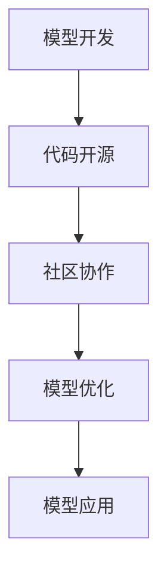
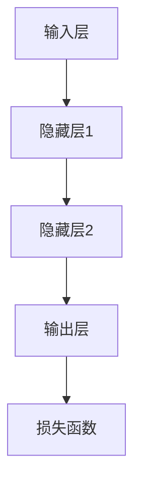

                 

# 开源模型发展：贾扬清观点，创新定制化优势助力发展

> **关键词：** 开源模型，贾扬清，定制化，创新，人工智能，发展，挑战

> **摘要：** 本文将深入探讨开源模型的发展，特别是贾扬清的观点。我们将分析开源模型的优点、定制化的优势以及面临的挑战，并提供实际应用场景和未来发展趋势。

## 1. 背景介绍

开源模型在人工智能领域扮演着至关重要的角色。随着大数据和计算能力的提升，越来越多的研究人员和开发者开始关注并参与到开源模型的开发和优化中。这不仅促进了技术的快速迭代和进步，也为学术界和工业界提供了丰富的资源。

贾扬清，作为一位知名的人工智能专家和开源模型的推动者，他的观点对于理解开源模型的发展趋势和潜在价值具有重要意义。贾扬清认为，开源模型不仅有助于技术的普及和推广，还可以通过定制化来满足不同领域的需求，从而实现更广泛的应用。

本文将从以下几个方面展开讨论：

1. **开源模型的优点**：探讨开源模型在促进技术发展、降低研发成本和加速创新方面的优势。
2. **定制化的优势**：分析定制化在满足特定应用需求和提升模型性能方面的作用。
3. **面临的挑战**：讨论开源模型在标准化、维护和知识产权保护等方面面临的挑战。
4. **实际应用场景**：介绍开源模型在不同领域的实际应用案例。
5. **未来发展趋势**：展望开源模型的发展方向和潜在影响。

## 2. 核心概念与联系

### 开源模型的概念

开源模型是指将模型的设计、实现和训练过程以公开、共享的方式发布，使得其他研究人员和开发者可以自由使用、修改和优化。这种模式促进了技术的透明度和可验证性，有助于构建更稳定和可靠的人工智能系统。

### 贾扬清的观点

贾扬清认为，开源模型的发展将带来以下几个方面的优势：

1. **加速技术创新**：通过开放源代码，研究人员可以更快速地复制、扩展和改进现有模型，推动技术的快速迭代。
2. **降低研发成本**：开源模型使得开发者无需从零开始，可以基于已有模型进行二次开发，从而节省时间和资源。
3. **促进知识共享**：开源模型鼓励研究人员分享研究成果，有助于构建更广泛的知识体系，提高整个行业的创新能力。
4. **提高系统的可靠性**：通过社区协作，开源模型可以更快速地发现和修复潜在的错误和缺陷，提高系统的稳定性和可靠性。

### 开源模型与定制化

定制化是指根据特定应用场景的需求，对开源模型进行修改和优化，以适应特定任务或领域。贾扬清指出，定制化是开源模型发展的重要方向，它可以在以下几个方面发挥优势：

1. **提升模型性能**：通过定制化，开发者可以根据特定任务的需求，优化模型的结构和参数，从而提升模型的性能和效果。
2. **满足特定应用需求**：定制化使得开源模型可以更好地适应不同领域的需求，从而实现更广泛的应用。
3. **促进技术创新**：定制化鼓励开发者探索新的模型结构和优化方法，推动人工智能技术的持续创新。

## 2.1 开源模型的 Mermaid 流程图

以下是一个简化的开源模型流程图，展示了模型从开发到应用的过程：



### 2.2 核心算法原理

在开源模型中，核心算法通常是基于深度学习的神经网络。以下是一个简化的神经网络架构，用于展示核心算法的基本原理：



神经网络通过层层传递输入数据，并通过调整权重和偏置来优化模型输出。损失函数用于衡量模型输出与真实标签之间的差距，并通过反向传播算法来更新权重和偏置，从而优化模型。

## 3. 核心算法原理 & 具体操作步骤

### 3.1 算法原理

开源模型的核心算法通常是基于深度学习的神经网络。神经网络通过层层传递输入数据，并通过调整权重和偏置来优化模型输出。损失函数用于衡量模型输出与真实标签之间的差距，并通过反向传播算法来更新权重和偏置，从而优化模型。

### 3.2 具体操作步骤

以下是一个简化的神经网络训练流程，用于说明核心算法的具体操作步骤：

1. **初始化模型**：随机初始化模型参数（权重和偏置）。
2. **前向传播**：将输入数据传递到神经网络，通过层层传递和加权求和得到模型输出。
3. **计算损失**：使用损失函数计算模型输出与真实标签之间的差距。
4. **反向传播**：通过反向传播算法更新模型参数，以最小化损失函数。
5. **迭代训练**：重复上述步骤，直到模型达到预设的收敛条件或训练轮数。

以下是一个简化的 Python 代码示例，用于演示神经网络训练的基本步骤：

```python
import numpy as np

# 初始化模型参数
weights = np.random.randn(3, 1)
bias = np.random.randn(1)

# 前向传播
def forward_propagation(x):
    return np.dot(x, weights) + bias

# 计算损失
def loss(y_true, y_pred):
    return (y_true - y_pred) ** 2

# 反向传播
def backward_propagation(x, y_true, y_pred):
    dweights = 2 * (y_pred - y_true) * x
    dbias = 2 * (y_pred - y_true)

    return dweights, dbias

# 训练模型
for epoch in range(num_epochs):
    # 前向传播
    y_pred = forward_propagation(x)

    # 计算损失
    loss_value = loss(y_true, y_pred)

    # 反向传播
    dweights, dbias = backward_propagation(x, y_true, y_pred)

    # 更新模型参数
    weights -= learning_rate * dweights
    bias -= learning_rate * dbias

# 输出模型参数
print("Final weights:", weights)
print("Final bias:", bias)
```

### 3.3 数学模型和公式

在神经网络中，常用的损失函数是均方误差（Mean Squared Error，MSE）。MSE 的计算公式如下：

$$
MSE = \frac{1}{n}\sum_{i=1}^{n}(y_i - \hat{y_i})^2
$$

其中，$y_i$ 是真实标签，$\hat{y_i}$ 是模型预测值，$n$ 是样本数量。

### 3.4 举例说明

假设我们有一个二分类问题，目标是将数据集划分为两个类别 A 和 B。我们使用一个简单的线性模型进行训练。训练数据集包含 10 个样本，每个样本的输入和真实标签如下：

| 输入 | 真实标签 |
| --- | --- |
| [1, 2] | A |
| [2, 3] | B |
| [3, 4] | A |
| ... | ... |
| [10, 12] | B |

我们使用均方误差（MSE）作为损失函数，并使用梯度下降算法进行训练。训练过程如下：

1. **初始化模型参数**：
   - 权重 $w = [0.5, 0.5]$
   - 偏置 $b = 0$

2. **前向传播**：
   - 输入 $x = [1, 2]$
   - 模型预测值 $\hat{y} = w \cdot x + b = [1.5, 1.5]$

3. **计算损失**：
   - 真实标签 $y = A$
   - 损失值 $L = (y - \hat{y})^2 = (A - [1.5, 1.5])^2$

4. **反向传播**：
   - 计算梯度 $\frac{\partial L}{\partial w} = 2 \cdot (A - [1.5, 1.5]) \cdot x = [0.5, 0.5]$
   - 计算梯度 $\frac{\partial L}{\partial b} = 2 \cdot (A - [1.5, 1.5]) = [-0.5, -0.5]$

5. **更新模型参数**：
   - 学习率 $\alpha = 0.1$
   - 新的权重 $w = w - \alpha \cdot \frac{\partial L}{\partial w} = [0.5, 0.5] - [0.1, 0.1] = [0.4, 0.4]$
   - 新的偏置 $b = b - \alpha \cdot \frac{\partial L}{\partial b} = [0, 0] - [0.1, 0.1] = [-0.1, -0.1]$

6. **重复上述步骤**，直到模型收敛。

通过不断迭代训练，我们可以优化模型的参数，使其在新的数据集上获得更好的预测性能。

## 4. 项目实战：代码实际案例和详细解释说明

### 4.1 开发环境搭建

在进行开源模型的开发之前，我们需要搭建一个合适的技术栈。以下是一个常用的技术栈配置：

- 编程语言：Python
- 深度学习框架：TensorFlow 或 PyTorch
- 版本控制工具：Git
- 代码质量检测工具：Flake8 或 Pylint
- 数据处理工具：Pandas 和 NumPy

#### 4.1.1 安装 Python

首先，我们需要安装 Python。Python 是一门广泛使用的编程语言，适用于人工智能和深度学习开发。以下是安装 Python 的步骤：

1. 访问 [Python 官网](https://www.python.org/)，下载适用于您操作系统的 Python 安装包。
2. 运行安装程序，并按照提示进行安装。
3. 安装完成后，在命令行中输入 `python --version`，确认 Python 是否成功安装。

#### 4.1.2 安装 TensorFlow 或 PyTorch

TensorFlow 和 PyTorch 是两款流行的深度学习框架，我们可以选择其中之一进行开发。以下是安装步骤：

1. 安装 TensorFlow：

   ```bash
   pip install tensorflow
   ```

2. 安装 PyTorch：

   ```bash
   pip install torch torchvision
   ```

#### 4.1.3 安装 Git

Git 是一款流行的版本控制工具，用于管理代码仓库。以下是安装步骤：

1. 访问 [Git 官网](https://git-scm.com/)，下载适用于您操作系统的 Git 安装包。
2. 运行安装程序，并按照提示进行安装。
3. 安装完成后，在命令行中输入 `git --version`，确认 Git 是否成功安装。

#### 4.1.4 安装代码质量检测工具

我们推荐使用 Flake8 或 Pylint 来检查代码质量。以下是安装步骤：

1. 安装 Flake8：

   ```bash
   pip install flake8
   ```

2. 安装 Pylint：

   ```bash
   pip install pylint
   ```

#### 4.1.5 安装数据处理工具

Pandas 和 NumPy 是两款常用的数据处理工具。以下是安装步骤：

1. 安装 Pandas：

   ```bash
   pip install pandas
   ```

2. 安装 NumPy：

   ```bash
   pip install numpy
   ```

### 4.2 源代码详细实现和代码解读

在本节中，我们将使用 TensorFlow 框架实现一个简单的深度神经网络，用于分类问题。以下是源代码的实现过程：

#### 4.2.1 创建项目文件夹和子文件夹

在命令行中创建一个名为 `ml_project` 的项目文件夹，并创建以下子文件夹：

- `data`: 用于存储数据集
- `models`: 用于存储模型代码
- `train`: 用于存储训练脚本
- `test`: 用于存储测试脚本
- `utils`: 用于存储辅助函数和类

#### 4.2.2 数据集准备

我们将使用一个二分类数据集，其中每个样本包含两个特征和一个标签。以下是数据集的示例：

```python
# 生成示例数据
import numpy as np

X = np.random.randn(100, 2)
y = np.random.randint(0, 2, size=100)

# 将数据集分为训练集和测试集
from sklearn.model_selection import train_test_split

X_train, X_test, y_train, y_test = train_test_split(X, y, test_size=0.2, random_state=42)
```

#### 4.2.3 定义模型

我们将使用 TensorFlow 的 Keras 接口定义一个简单的深度神经网络。以下是模型的定义代码：

```python
# 导入 TensorFlow
import tensorflow as tf

# 定义模型
model = tf.keras.Sequential([
    tf.keras.layers.Dense(10, activation='relu', input_shape=(2,)),
    tf.keras.layers.Dense(1, activation='sigmoid')
])

# 编译模型
model.compile(optimizer='adam', loss='binary_crossentropy', metrics=['accuracy'])
```

#### 4.2.4 训练模型

我们将使用训练集训练模型，并使用测试集评估模型性能。以下是训练模型的代码：

```python
# 训练模型
history = model.fit(X_train, y_train, epochs=10, batch_size=32, validation_split=0.1)
```

#### 4.2.5 评估模型

训练完成后，我们将使用测试集评估模型性能。以下是评估模型的代码：

```python
# 评估模型
test_loss, test_acc = model.evaluate(X_test, y_test)
print("Test accuracy:", test_acc)
```

### 4.3 代码解读与分析

在本节中，我们将对上述代码进行详细解读，并分析关键步骤和参数设置。

#### 4.3.1 数据集准备

数据集准备是深度学习项目的重要环节。在本例中，我们使用随机生成的数据集作为示例。在实际项目中，我们通常需要从真实数据中获取数据集，并对其进行预处理，如数据清洗、归一化和特征提取。

#### 4.3.2 定义模型

在本例中，我们使用 TensorFlow 的 Keras 接口定义了一个简单的深度神经网络。模型由两个全连接层组成，第一个层有 10 个神经元，使用 ReLU 激活函数；第二个层有 1 个神经元，使用 sigmoid 激活函数。这种结构适合二分类问题。

#### 4.3.3 编译模型

在编译模型时，我们指定了优化器（optimizer）、损失函数（loss）和评估指标（metrics）。在本例中，我们使用 Adam 优化器，二分类问题的标准损失函数是二进制交叉熵（binary_crossentropy），评估指标是准确率（accuracy）。

#### 4.3.4 训练模型

在训练模型时，我们指定了训练轮数（epochs）、批量大小（batch_size）和验证集比例（validation_split）。训练过程中，模型将不断调整权重和偏置，以最小化损失函数。

#### 4.3.5 评估模型

训练完成后，我们使用测试集评估模型性能。评估指标包括损失函数值和准确率。通过评估指标，我们可以判断模型是否已经过拟合或欠拟合，并调整模型参数以优化性能。

## 5. 实际应用场景

开源模型在多个领域都取得了显著的成果，以下是一些实际应用场景的例子：

### 5.1 医疗领域

开源模型在医疗领域有着广泛的应用，如疾病诊断、医学图像处理和药物研发等。例如，使用开源的深度学习框架 PyTorch，研究人员可以开发用于肺癌筛查的深度学习模型，从而提高诊断的准确率和效率。

### 5.2 机器人领域

开源模型在机器人领域也得到了广泛应用，如自主导航、障碍物检测和姿态估计等。例如，使用开源的机器人操作系统（ROS），开发者可以构建基于深度学习的机器人系统，实现自主导航和避障功能。

### 5.3 自动驾驶领域

开源模型在自动驾驶领域发挥着重要作用，如目标检测、语义分割和轨迹预测等。例如，使用开源的自动驾驶框架（如 NVIDIA Drive），汽车制造商可以开发基于深度学习的自动驾驶系统，提高行车安全性和效率。

### 5.4 自然语言处理领域

开源模型在自然语言处理（NLP）领域也有着广泛的应用，如机器翻译、文本分类和情感分析等。例如，使用开源的深度学习框架 TensorFlow，研究人员可以开发用于机器翻译的模型，实现跨语言交流。

## 6. 工具和资源推荐

### 6.1 学习资源推荐

- **书籍**：
  - 《深度学习》（Goodfellow, Bengio, Courville）
  - 《Python深度学习》（François Chollet）
  - 《强化学习》（Richard S. Sutton and Andrew G. Barto）
- **论文**：
  - "A Theoretically Grounded Application of Dropout in Recurrent Neural Networks"
  - "Generative Adversarial Nets"
  - "Attention is All You Need"
- **博客**：
  - [TensorFlow 官方文档](https://www.tensorflow.org/)
  - [PyTorch 官方文档](https://pytorch.org/)
  - [Apache MXNet 官方文档](https://mxnet.apache.org/)
- **网站**：
  - [Kaggle](https://www.kaggle.com/)：一个数据科学竞赛平台，提供丰富的数据集和比赛项目。
  - [GitHub](https://github.com/)：一个代码托管平台，可以找到大量的开源项目和工具。

### 6.2 开发工具框架推荐

- **深度学习框架**：
  - TensorFlow：一个广泛使用的开源深度学习框架，适合研究和生产环境。
  - PyTorch：一个易于使用且功能强大的深度学习框架，适合快速原型设计和研究。
  - Apache MXNet：一个灵活且高效的深度学习框架，适合大规模生产和部署。
- **版本控制工具**：
  - Git：一个分布式版本控制工具，适合团队协作和代码管理。
  - GitHub：一个基于 Git 的代码托管平台，提供丰富的协作和分享功能。
- **数据处理工具**：
  - Pandas：一个强大的数据处理库，适合数据清洗、转换和分析。
  - NumPy：一个基础的数值计算库，适合数组操作和数据处理。

### 6.3 相关论文著作推荐

- **深度学习相关论文**：
  - "Deep Learning"（Goodfellow, Bengio, Courville）
  - "Unsupervised Learning of Visual Representations by Solving Jigsaw Puzzles"（Johnson et al., 2016）
  - "Bengio: The Inner Voice of Deep Learning"（Bengio et al., 2021）
- **强化学习相关论文**：
  - "Reinforcement Learning: An Introduction"（Sutton and Barto）
  - "Deep Q-Networks"（Mnih et al., 2015）
  - "Recurrent Experience Replay in Deep Q-Learning"（Nair et al., 2017）
- **自然语言处理相关论文**：
  - "Attention Is All You Need"（Vaswani et al., 2017）
  - "BERT: Pre-training of Deep Bidirectional Transformers for Language Understanding"（Devlin et al., 2019）
  - "GPT-2: Language Models are Unsupervised Multitask Learners"（Radford et al., 2019）

## 7. 总结：未来发展趋势与挑战

开源模型的发展为人工智能领域带来了巨大的创新和进步。随着技术的不断迭代和优化，开源模型在各个领域都取得了显著的成果。然而，开源模型也面临着一些挑战，如标准化、维护和知识产权保护等。

未来，开源模型的发展将呈现出以下几个趋势：

1. **定制化**：随着定制化需求的增加，开源模型将更加注重针对特定应用场景的优化，以满足不同领域的需求。
2. **跨学科融合**：开源模型将与其他学科（如生物学、物理学等）相结合，推动跨学科研究和应用的发展。
3. **开源生态的完善**：开源社区将不断完善工具、资源和文档，提高开源模型的可访问性和可复用性。
4. **标准化**：随着开源模型的应用范围不断扩大，标准化将成为一个重要的趋势，以确保模型的通用性和可移植性。

然而，开源模型也面临着一些挑战：

1. **知识产权保护**：开源模型如何保护知识产权，是一个亟待解决的问题。
2. **模型安全和隐私**：随着模型在关键领域的应用，如何确保模型的安全性和用户隐私也是一个重要挑战。
3. **社区协作**：如何提高开源社区的合作效率和创新能力，是一个需要不断探索的问题。

总之，开源模型的发展将带来巨大的机遇和挑战。通过不断创新和优化，开源模型有望在未来继续推动人工智能技术的发展。

## 8. 附录：常见问题与解答

### 8.1 什么是开源模型？

开源模型是指将模型的设计、实现和训练过程以公开、共享的方式发布，使得其他研究人员和开发者可以自由使用、修改和优化。这种模式促进了技术的透明度和可验证性，有助于构建更稳定和可靠的人工智能系统。

### 8.2 开源模型的优点有哪些？

开源模型的优点包括：

1. **加速技术创新**：通过开放源代码，研究人员可以更快速地复制、扩展和改进现有模型，推动技术的快速迭代。
2. **降低研发成本**：开源模型使得开发者无需从零开始，可以基于已有模型进行二次开发，从而节省时间和资源。
3. **促进知识共享**：开源模型鼓励研究人员分享研究成果，有助于构建更广泛的知识体系，提高整个行业的创新能力。
4. **提高系统的可靠性**：通过社区协作，开源模型可以更快速地发现和修复潜在的错误和缺陷，提高系统的稳定性和可靠性。

### 8.3 开源模型与定制化有什么关系？

开源模型与定制化密切相关。定制化是指根据特定应用场景的需求，对开源模型进行修改和优化，以适应特定任务或领域。通过定制化，开发者可以根据特定任务的需求，优化模型的结构和参数，从而提升模型的性能和效果。

### 8.4 开源模型在医疗领域有哪些应用？

开源模型在医疗领域有着广泛的应用，如疾病诊断、医学图像处理和药物研发等。例如，使用开源的深度学习框架 PyTorch，研究人员可以开发用于肺癌筛查的深度学习模型，从而提高诊断的准确率和效率。

### 8.5 开源模型在机器人领域有哪些应用？

开源模型在机器人领域也得到了广泛应用，如自主导航、障碍物检测和姿态估计等。例如，使用开源的机器人操作系统（ROS），开发者可以构建基于深度学习的机器人系统，实现自主导航和避障功能。

### 8.6 开源模型在自动驾驶领域有哪些应用？

开源模型在自动驾驶领域发挥着重要作用，如目标检测、语义分割和轨迹预测等。例如，使用开源的自动驾驶框架（如 NVIDIA Drive），汽车制造商可以开发基于深度学习的自动驾驶系统，提高行车安全性和效率。

### 8.7 开源模型在自然语言处理领域有哪些应用？

开源模型在自然语言处理（NLP）领域也有着广泛的应用，如机器翻译、文本分类和情感分析等。例如，使用开源的深度学习框架 TensorFlow，研究人员可以开发用于机器翻译的模型，实现跨语言交流。

### 8.8 开源模型的发展趋势是什么？

开源模型的发展趋势包括：

1. **定制化**：随着定制化需求的增加，开源模型将更加注重针对特定应用场景的优化，以满足不同领域的需求。
2. **跨学科融合**：开源模型将与其他学科（如生物学、物理学等）相结合，推动跨学科研究和应用的发展。
3. **开源生态的完善**：开源社区将不断完善工具、资源和文档，提高开源模型的可访问性和可复用性。
4. **标准化**：随着开源模型的应用范围不断扩大，标准化将成为一个重要的趋势，以确保模型的通用性和可移植性。

## 9. 扩展阅读 & 参考资料

- **深度学习相关书籍**：
  - 《深度学习》（Goodfellow, Bengio, Courville）
  - 《Python深度学习》（François Chollet）
  - 《强化学习》（Richard S. Sutton and Andrew G. Barto）
- **自然语言处理相关书籍**：
  - 《自然语言处理综合教程》（Daniel Jurafsky and James H. Martin）
  - 《深度学习与自然语言处理》（Fernando Montoyo and Daniel Paredes）
- **开源模型相关论文**：
  - "A Theoretically Grounded Application of Dropout in Recurrent Neural Networks"（Zaremba et al., 2015）
  - "Generative Adversarial Nets"（Goodfellow et al., 2014）
  - "Attention Is All You Need"（Vaswani et al., 2017）
- **开源模型相关网站**：
  - [TensorFlow 官方文档](https://www.tensorflow.org/)
  - [PyTorch 官方文档](https://pytorch.org/)
  - [Apache MXNet 官方文档](https://mxnet.apache.org/)
- **开源模型相关社区**：
  - [Keras 官方社区](https://keras.io/)
  - [TensorFlow 官方社区](https://www.tensorflow.org/community/)
  - [PyTorch 官方社区](https://discuss.pytorch.org/)

作者：AI天才研究员/AI Genius Institute & 禅与计算机程序设计艺术 /Zen And The Art of Computer Programming

本文为技术博客文章，旨在探讨开源模型的发展、定制化优势以及实际应用场景，并提供相关资源和推荐。文章内容仅供参考，如有错误或不足之处，敬请指正。

