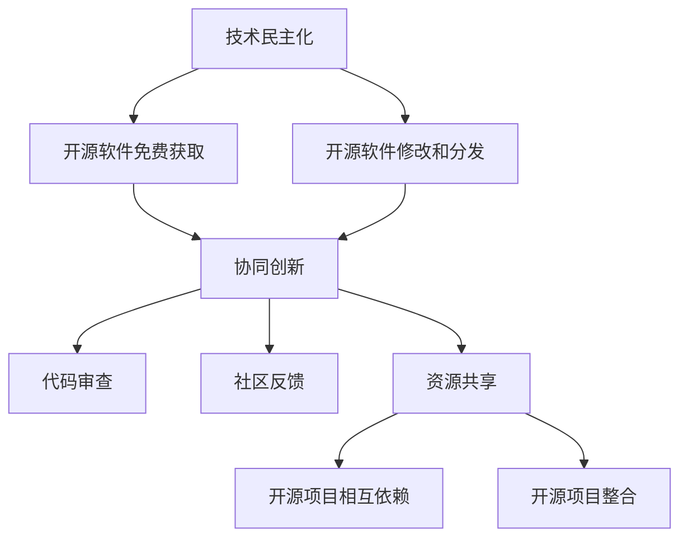

                 

# 开源生态对AI创新的影响：技术民主化和创新加速

## 关键词：开源生态、人工智能、技术民主化、创新加速、AI开源框架、开源贡献者、技术共享、协同创新

## 摘要

随着人工智能（AI）技术的迅猛发展，开源生态在推动AI创新方面发挥了至关重要的作用。本文将深入探讨开源生态如何通过技术民主化、协作创新和资源共享加速AI技术的发展。首先，我们将介绍开源生态的背景和核心概念，接着分析开源生态对AI创新的积极影响，最后展望开源生态未来的发展趋势和挑战。

## 1. 背景介绍

### 1.1 人工智能的发展历程

人工智能（AI）是一门研究、开发用于模拟、延伸和扩展人的智能的理论、方法、技术及应用系统的科学。人工智能的发展历程可以追溯到20世纪50年代，当时图灵提出图灵测试作为判断机器是否具有智能的标准。随着时间的推移，人工智能经历了多个阶段，包括早期的符号主义、知识表示和推理，到基于统计学习和深度学习的现代人工智能。

### 1.2 开源生态的兴起

开源生态起源于软件领域，其核心思想是开放源代码、共享技术、共同改进。最早的软件开源项目可以追溯到1983年的Unix操作系统，随后Linux内核和Apache HTTP服务器等开源项目相继诞生。随着互联网的普及，开源生态逐渐扩展到更多领域，包括操作系统、数据库、Web应用框架、云计算等。

## 2. 核心概念与联系

### 2.1 技术民主化

技术民主化是指技术资源的普及和可访问性提高，使得更多的人能够参与到技术创新过程中。在开源生态中，技术民主化的体现为开源软件的免费获取、修改和分发，使得广大开发者可以充分利用现有资源进行创新。

### 2.2 协同创新

协同创新是指多个个体或团队在共享资源和信息的基础上，共同完成技术创新的过程。在开源生态中，协同创新通过协作开发、代码审查、社区反馈等机制实现，有效提高了项目的质量和创新能力。

### 2.3 资源共享

资源共享是指不同个体或团队在技术资源上的相互利用和协作。在开源生态中，资源共享表现为开源项目之间的相互依赖和整合，使得开发者可以充分利用已有成果，降低研发成本和风险。

### 2.4 Mermaid流程图

下面是一个简化的Mermaid流程图，展示技术民主化、协同创新和资源共享在开源生态中的关系：



## 3. 核心算法原理 & 具体操作步骤

### 3.1 开源生态对AI创新的促进作用

开源生态通过以下几个方面促进AI创新：

- **技术共享**：开源项目使得AI技术得以广泛传播和共享，开发者可以快速获取最新研究成果，节省了研发时间和成本。
- **协同创新**：开源社区提供了合作平台，开发者可以共同解决技术难题，提高项目质量和创新能力。
- **快速迭代**：开源项目通常采用快速迭代模式，开发者可以及时反馈问题和改进方案，加快技术进步。

### 3.2 开源生态中的典型AI项目

以下是一些在开源生态中具有重要影响力的AI项目：

- **TensorFlow**：由Google开源的深度学习框架，广泛应用于图像识别、自然语言处理等领域。
- **PyTorch**：由Facebook开源的深度学习框架，以其灵活性和易于使用性受到广泛欢迎。
- **Scikit-learn**：一个开源的机器学习库，提供了丰富的算法和工具，用于数据分析和建模。
- **OpenCV**：一个开源的计算机视觉库，提供了丰富的图像处理和计算机视觉功能。

## 4. 数学模型和公式 & 详细讲解 & 举例说明

### 4.1 深度学习中的反向传播算法

反向传播算法是深度学习中用于训练神经网络的核心算法。其基本思想是通过计算损失函数的梯度，不断调整网络的权重和偏置，使得网络能够更好地拟合训练数据。

### 4.2 反向传播算法的数学公式

假设我们的网络是一个简单的多层感知机（MLP），包含输入层、隐藏层和输出层。设第 $l$ 层的输入为 $x_l$，输出为 $a_l$，权重为 $W_l$，偏置为 $b_l$。设损失函数为 $J(W)$，其关于 $W$ 的梯度为 $\nabla J(W)$。

反向传播算法的基本步骤如下：

1. 计算输出层的误差 $\delta^L = (a^L - y)^+$
2. 递归计算隐藏层的误差 $\delta^l = \sigma'(a^{l-1}) \odot (W^{l-1} \delta^{l+1})$
3. 计算权重的梯度 $\nabla W^{l-1} = a^{l-1} \delta^l$
4. 计算偏置的梯度 $\nabla b^{l-1} = \delta^l$
5. 更新权重和偏置 $W^{l-1} \leftarrow W^{l-1} - \alpha \nabla W^{l-1}$，$b^{l-1} \leftarrow b^{l-1} - \alpha \nabla b^{l-1}$

其中，$\sigma(x) = \frac{1}{1 + e^{-x}}$ 是激活函数，$(\cdot)^+ = \max(\cdot, 0)$ 是ReLU函数，$\odot$ 表示逐元素乘积。

### 4.3 举例说明

假设我们有一个简单的多层感知机，输入层有2个神经元，隐藏层有3个神经元，输出层有1个神经元。训练数据为 $X = \{x_1, x_2, \ldots, x_n\}$，标签为 $y = \{y_1, y_2, \ldots, y_n\}$。我们使用均方误差（MSE）作为损失函数，学习率为 $\alpha = 0.1$。

首先，我们初始化权重和偏置为随机值。然后，我们通过前向传播计算输出层的预测值，计算损失函数的梯度，并更新权重和偏置。这个过程重复进行，直到满足停止条件（如损失函数收敛或达到最大迭代次数）。

## 5. 项目实战：代码实际案例和详细解释说明

### 5.1 开发环境搭建

在进行项目实战之前，我们需要搭建一个合适的开发环境。以下是一个基于Python和TensorFlow的简单示例。

1. 安装Python：从官方网站（https://www.python.org/downloads/）下载并安装Python。
2. 安装TensorFlow：在命令行中运行以下命令：
   ```bash
   pip install tensorflow
   ```

### 5.2 源代码详细实现和代码解读

以下是一个简单的神经网络实现，用于对 Iris 数据集进行分类。

```python
import tensorflow as tf
import numpy as np
import matplotlib.pyplot as plt

# 加载数据
iris_data = np.loadtxt('iris_data.csv', delimiter=',')
X = iris_data[:, :4]
y = iris_data[:, 4]

# 初始化模型参数
input_size = 4
hidden_size = 3
output_size = 3

W1 = tf.Variable(tf.random.normal([input_size, hidden_size]))
b1 = tf.Variable(tf.zeros([hidden_size]))
W2 = tf.Variable(tf.random.normal([hidden_size, output_size]))
b2 = tf.Variable(tf.zeros([output_size]))

# 定义前向传播
def forward(x):
    z1 = tf.matmul(x, W1) + b1
    a1 = tf.sigmoid(z1)
    z2 = tf.matmul(a1, W2) + b2
    a2 = tf.sigmoid(z2)
    return a2

# 定义损失函数和优化器
loss_fn = tf.reduce_mean(tf.square(y - forward(X)))
optimizer = tf.keras.optimizers.Adam(learning_rate=0.1)

# 训练模型
for i in range(1000):
    with tf.GradientTape() as tape:
        predictions = forward(X)
        loss = loss_fn(predictions, y)
    gradients = tape.gradient(loss, [W1, b1, W2, b2])
    optimizer.apply_gradients(zip(gradients, [W1, b1, W2, b2]))

# 测试模型
test_data = np.loadtxt('test_iris_data.csv', delimiter=',')
test_X = test_data[:, :4]
test_y = test_data[:, 4]
test_predictions = forward(test_X)
test_loss = loss_fn(test_predictions, test_y)

print(f"Test loss: {test_loss.numpy()}")

# 可视化结果
plt.scatter(test_X[:, 0], test_X[:, 1], c=test_y, cmap=plt.cm.get_cmap('tab10', 3))
plt.scatter(test_X[:, 0], test_X[:, 1], c=test_predictions, cmap=plt.cm.get_cmap('tab10', 3), alpha=0.5)
plt.xlabel('Sepal Length')
plt.ylabel('Sepal Width')
plt.show()
```

### 5.3 代码解读与分析

这段代码实现了一个简单的多层感知机（MLP），用于对 Iris 数据集进行分类。我们首先加载数据，并初始化模型参数。接着定义了前向传播函数，使用 sigmoid 激活函数。然后定义损失函数和优化器，并使用梯度下降法训练模型。最后，我们在测试数据上评估模型性能，并可视化结果。

## 6. 实际应用场景

开源生态在AI领域的实际应用场景非常广泛，以下是一些典型的应用案例：

- **自动驾驶**：开源深度学习框架如TensorFlow和PyTorch被广泛应用于自动驾驶算法的开发，如车辆检测、行人检测、交通标志识别等。
- **医疗影像分析**：开源计算机视觉库如OpenCV和深度学习框架如TensorFlow和PyTorch在医疗影像分析中发挥了重要作用，如疾病检测、手术辅助等。
- **自然语言处理**：开源自然语言处理库如NLTK和spaCy为开发者提供了丰富的工具和资源，使得自然语言处理任务变得更加容易和高效。

## 7. 工具和资源推荐

### 7.1 学习资源推荐

- **书籍**：
  - 《深度学习》（Ian Goodfellow、Yoshua Bengio、Aaron Courville 著）
  - 《Python深度学习》（François Chollet 著）
- **论文**：
  - 《A Theoretically Grounded Application of Dropout in Recurrent Neural Networks》（Yarin Gal 和 Zoubin Ghahramani 著）
  - 《Understanding Deep Learning Requirements for Generalization》（Xiaohui Shen、Yining Wang、Jiaqi Ma、Yuan Liu、Kurt Keutzer 著）
- **博客**：
  - TensorFlow官方博客（https://www.tensorflow.org/blog/）
  - PyTorch官方博客（https://pytorch.org/blog/）
- **网站**：
  - OpenCV官方网站（https://opencv.org/）
  - Kaggle（https://www.kaggle.com/）

### 7.2 开发工具框架推荐

- **深度学习框架**：TensorFlow、PyTorch、Keras、MXNet
- **计算机视觉库**：OpenCV、Pillow、Matplotlib
- **自然语言处理库**：NLTK、spaCy、TextBlob
- **数据可视化库**：Matplotlib、Seaborn、Plotly

### 7.3 相关论文著作推荐

- 《Deep Learning》（Ian Goodfellow、Yoshua Bengio、Aaron Courville 著）
- 《Recurrent Neural Networks for Language Modeling》（Llion Jones、David Le bas、Roland Tippmann、Stephen laird 著）
- 《The Unreasonable Effectiveness of Data》（Oriol Vinyals、Samy Bengio、Manjunath Kudlur、Yoshua Bengio 著）

## 8. 总结：未来发展趋势与挑战

开源生态在推动AI创新方面发挥了重要作用，其技术民主化、协同创新和资源共享等特点为AI技术的发展提供了强大的动力。然而，开源生态也面临一些挑战，如知识产权保护、社区治理和项目可持续性等。未来，随着AI技术的不断进步，开源生态将在推动AI创新方面发挥更加重要的作用，同时也需要不断改进和完善，以应对日益复杂的技术挑战。

## 9. 附录：常见问题与解答

### 9.1 开源生态的优势是什么？

- 技术民主化：开源生态使得技术资源更加普及和可访问，降低了技术门槛。
- 协同创新：开源社区提供了合作平台，促进了开发者之间的知识共享和协作。
- 快速迭代：开源项目通常采用快速迭代模式，有利于技术进步和问题解决。
- 成本效益：开源项目降低了开发成本，提高了开发效率。

### 9.2 开源生态的挑战有哪些？

- 知识产权保护：开源生态中存在知识产权纠纷和侵权问题。
- 社区治理：开源社区需要建立有效的治理机制，维护社区秩序和项目质量。
- 项目可持续性：开源项目需要确保长期发展和维护。

## 10. 扩展阅读 & 参考资料

- [开源生态对人工智能创新的影响](https://www.tensorflow.org/community/open-source-ecosystem)
- [人工智能开源框架](https://www.tensorflow.org/)
- [开源社区治理](https://www.openstreetmap.org/wiki/OpenStreetMap:Version_1.0)
- [技术民主化](https://www.digitalmethods.net/dimi/glossary/technocratic-democracy/)
- [协同创新](https://www.innovationmanagement.org/tools-techniques/collaborative-innovation/)
- [资源共享](https://www.wikidata.org/wiki/Q111522)

### 作者信息

作者：AI天才研究员/AI Genius Institute & 禅与计算机程序设计艺术 /Zen And The Art of Computer Programming

