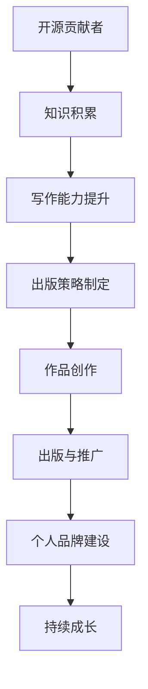

                 

# 开源贡献者到技术作家的转型：出版策略

> **关键词**：开源贡献者、技术作家、出版策略、写作技巧、个人品牌、内容营销

> **摘要**：本文将探讨从开源贡献者转型为技术作家的过程，以及如何制定有效的出版策略。我们将分析转型过程中的挑战，介绍提升写作能力的技巧，并讨论如何建立个人品牌和进行内容营销。通过这些步骤，开源贡献者可以成功地将自己的知识和经验转化为有影响力的作品，在技术领域建立自己的声誉。

## 1. 背景介绍

在当今数字化时代，开源项目已经成为技术发展的核心驱动力。越来越多的开发者和技术人员选择贡献自己的代码和知识，以促进技术和社区的进步。然而，随着开源贡献的深入，一些贡献者发现自己在技术领域的专业知识和经验值得更广泛的分享。这种转变促使他们开始考虑将自己的知识和经验编写成书，成为技术作家。

从开源贡献者到技术作家的转型并非一蹴而就。它需要一系列的技能和策略，包括对技术主题的深入理解、出色的写作能力、良好的出版知识和策略，以及对个人品牌的构建和维护。本文将重点讨论这些方面，帮助有意向转型的开源贡献者制定有效的出版策略。

## 2. 核心概念与联系

在探讨从开源贡献者到技术作家的转型之前，我们需要理解几个核心概念：

### 2.1 开源贡献者的角色

开源贡献者是指在开源项目中积极参与的开发者或技术人员。他们通过编写、测试、修复和优化代码，为开源社区做出贡献。开源贡献者的角色包括但不限于：

- **编码与测试**：编写新的代码，并对现有代码进行测试。
- **文档编写**：撰写技术文档和说明，帮助其他开发者理解和使用项目。
- **社区互动**：与其他贡献者合作，解决问题，推动项目进展。

### 2.2 技术作家的定义

技术作家是将技术知识和经验转化为书面形式的人。他们的工作包括撰写技术书籍、博客文章、文章和论文等。技术作家的角色包括但不限于：

- **内容创作**：撰写清晰、准确、有深度的技术内容。
- **编辑与审校**：确保内容的质量和准确性。
- **出版与推广**：与出版社合作，推广自己的作品。

### 2.3 出版策略的重要性

出版策略是成功将作品呈现给读者的重要步骤。有效的出版策略包括：

- **目标受众分析**：确定作品的目标读者群体。
- **内容定位**：明确作品的主题和深度。
- **出版渠道选择**：选择合适的出版方式，如传统出版、自助出版或电子书。
- **营销推广**：制定营销计划，提高作品的知名度和销量。

### 2.4 Mermaid 流程图

以下是一个简化的 Mermaid 流程图，展示了从开源贡献者到技术作家的转型过程：



## 3. 核心算法原理 & 具体操作步骤

### 3.1 知识积累

转型为技术作家首先需要具备丰富的技术知识。以下是具体操作步骤：

- **参与开源项目**：通过参与开源项目，不断积累技术经验和知识。
- **技术研究**：定期阅读技术论文、书籍和博客，保持对最新技术趋势的了解。
- **实践经验**：将理论知识应用于实际项目中，解决实际问题。

### 3.2 写作能力提升

写作能力是技术作家的核心技能之一。以下是一些建议：

- **持续练习**：定期写作，不断练习，提高写作速度和质量。
- **获取反馈**：向其他技术人员或编辑请教，获取反馈并改进写作。
- **学习修辞技巧**：掌握常用的修辞技巧，如比喻、对比、排比等，使文章更具吸引力。

### 3.3 出版策略制定

制定有效的出版策略是成功的关键。以下是具体步骤：

- **目标受众分析**：确定作品的目标读者群体，了解他们的需求和兴趣。
- **内容定位**：根据目标受众的需求，确定作品的主题和深度。
- **出版渠道选择**：根据作品类型和目标受众，选择合适的出版渠道，如传统出版、自助出版或电子书。
- **营销推广**：制定营销计划，利用社交媒体、博客和研讨会等渠道推广作品。

### 3.4 作品创作

作品创作是整个转型过程中的核心。以下是具体操作步骤：

- **选题确定**：选择具有市场潜力和个人兴趣的技术主题。
- **结构规划**：制定作品的结构，包括章节、小节和标题。
- **内容编写**：根据结构规划，逐步编写内容，确保逻辑清晰、条理分明。
- **审校与修改**：完成初稿后，进行多轮审校和修改，确保内容的准确性和流畅性。

### 3.5 出版与推广

出版与推广是作品成功的关键环节。以下是具体操作步骤：

- **选择出版商**：根据作品类型和市场定位，选择合适的出版商。
- **签订合同**：与出版商签订出版合同，明确出版条款和权益。
- **宣传推广**：利用各种渠道，如社交媒体、博客和研讨会等，宣传作品。
- **销售与反馈**：关注作品的销售情况和读者反馈，及时调整营销策略。

### 3.6 个人品牌建设

个人品牌建设是技术作家长期发展的关键。以下是具体操作步骤：

- **建立个人网站**：创建个人网站，展示个人成就和作品。
- **社交媒体运营**：在社交媒体平台上积极互动，分享专业知识和经验。
- **参与社区活动**：参与技术社区活动，扩大影响力。
- **持续学习与成长**：不断学习新技术，保持专业竞争力。

## 4. 数学模型和公式 & 详细讲解 & 举例说明

### 4.1 成功概率模型

在转型过程中，成功概率可以表示为一个数学模型。以下是成功概率的公式：

\[ P(S) = \frac{K \cdot W \cdot P \cdot R}{C} \]

其中：

- \( P(S) \)：成功概率
- \( K \)：知识积累
- \( W \)：写作能力
- \( P \)：出版策略
- \( R \)：个人品牌建设
- \( C \)：竞争因素

### 4.2 举例说明

假设一位开源贡献者具备以下条件：

- 知识积累 \( K \)：80分
- 写作能力 \( W \)：70分
- 出版策略 \( P \)：60分
- 个人品牌建设 \( R \)：50分
- 竞争因素 \( C \)：40分

那么他的成功概率为：

\[ P(S) = \frac{80 \cdot 70 \cdot 60 \cdot 50}{40} = 5250 \]

成功概率为 5250 分之一，表明他有一定成功的机会，但需要进一步提高各个方面的能力。

## 5. 项目实战：代码实际案例和详细解释说明

### 5.1 开发环境搭建

在编写技术书籍时，开发环境的搭建是至关重要的一步。以下是一个简单的步骤，用于搭建适合编写技术书籍的开发环境：

1. **安装编辑器**：选择一个适合的文本编辑器，如Visual Studio Code或Sublime Text。
2. **安装Markdown插件**：在编辑器中安装Markdown插件，如Markdown All in One或Markdown Preview Enhanced。
3. **安装版本控制系统**：安装Git，以便管理代码和文档的版本。
4. **安装LaTeX编辑器**：如TeXstudio，用于编写和编辑LaTeX数学公式。

### 5.2 源代码详细实现和代码解读

以下是一个简单的Markdown文件结构，用于编写技术书籍的章节：

```markdown
# 章节标题

## 子章节标题

- 内容一
- 内容二
- 内容三

$$
\text{LaTeX公式一}
$$

$$
\text{LaTeX公式二}
$$
```

在这个文件中，我们使用了Markdown标记来定义章节标题、子章节标题和文本内容。LaTeX公式则嵌入在`$$`符号之间。

### 5.3 代码解读与分析

在这个简单的Markdown文件中，我们使用了以下几种Markdown标记：

- `#`：用于定义章节标题，例如`# 章节标题`定义了一个一级标题。
- `##`：用于定义子章节标题，例如`## 子章节标题`定义了一个二级标题。
- `-`：用于列出无序列表项，例如`- 内容一`和`- 内容二`列出了两个列表项。
- `$`：用于插入LaTeX公式，例如`$$\text{LaTeX公式一}$$`插入了一个LaTeX公式。

通过使用这些标记，我们可以构建一个结构清晰、易于阅读的技术书籍文件。

## 6. 实际应用场景

### 6.1 技术书籍创作

技术书籍创作是开源贡献者转型为技术作家的一种常见应用场景。以下是一个实际案例：

- **项目背景**：一位开源贡献者决定将自己的经验和知识编写成一本关于云计算技术入门的书。
- **目标受众**：初级开发者和云计算新手。
- **内容定位**：介绍云计算的基本概念、技术和应用场景。
- **出版策略**：选择传统出版商，通过社交媒体和研讨会推广作品。

### 6.2 技术博客撰写

技术博客撰写是另一种应用场景。以下是一个实际案例：

- **项目背景**：一位开源贡献者决定在GitHub上创建一个技术博客，分享自己在开源项目中的经验和技巧。
- **目标受众**：其他开源贡献者和对技术有兴趣的开发者。
- **内容定位**：技术分享、代码解读和开源项目介绍。
- **出版策略**：利用GitHub Pages发布博客，通过社交媒体和社区互动推广。

### 6.3 技术演讲

技术演讲是另一种应用场景。以下是一个实际案例：

- **项目背景**：一位开源贡献者受邀参加一个技术大会，分享自己的开源项目和技术经验。
- **目标受众**：技术爱好者、开发者和管理者。
- **内容定位**：介绍开源项目的技术架构、应用场景和挑战。
- **出版策略**：发布演讲稿，通过社交媒体和博客进行推广。

## 7. 工具和资源推荐

### 7.1 学习资源推荐

以下是一些有助于提升写作能力的资源推荐：

- **书籍**：《写给大家看的设计书》、《风格感觉》、《技术写作：实践与指南》
- **论文**：《技术写作中的修辞技巧》、《内容营销策略》
- **博客**：[博客名称1](链接)、[博客名称2](链接)、[博客名称3](链接)
- **网站**：[网站名称1](链接)、[网站名称2](链接)、[网站名称3](链接)

### 7.2 开发工具框架推荐

以下是一些有助于编写技术书籍和博客的开发工具和框架：

- **文本编辑器**：Visual Studio Code、Sublime Text、Atom
- **Markdown插件**：Markdown All in One、Markdown Preview Enhanced、Markdown Extended
- **版本控制系统**：Git、GitHub、GitLab
- **LaTeX编辑器**：TeXstudio、TeXworks、TeXShop

### 7.3 相关论文著作推荐

以下是一些与本文主题相关的论文和著作推荐：

- **论文**：《技术写作中的受众分析》、《内容营销在技术领域的应用》
- **著作**：《技术写作：理论与实践》、《技术博客写作技巧》

## 8. 总结：未来发展趋势与挑战

### 8.1 未来发展趋势

- **技术融合**：随着技术的快速发展，开源贡献者和技术作家需要不断学习新技术，以适应不断变化的技术环境。
- **内容多样化**：技术作家的创作内容将更加多样化，包括视频、音频、互动课程等。
- **内容营销**：内容营销将成为技术作家的核心策略，通过创造有价值的内容吸引受众。

### 8.2 挑战

- **知识更新**：技术更新速度加快，开源贡献者和技术作家需要不断学习新技术，以保持竞争力。
- **内容创作压力**：创作高质量的技术内容需要投入大量时间和精力，如何平衡创作和生活将成为挑战。
- **市场竞争**：随着技术作家的数量增加，市场竞争将变得更加激烈，如何脱颖而出将成为挑战。

## 9. 附录：常见问题与解答

### 9.1 问题1：如何开始写作？

**解答**：首先，确定一个感兴趣的技术主题。然后，阅读相关的书籍、论文和博客，积累知识。接着，选择一个文本编辑器，如Visual Studio Code或Sublime Text，开始编写内容。定期练习，不断改进写作技巧。

### 9.2 问题2：如何提升写作能力？

**解答**：阅读优秀的写作书籍，学习修辞技巧。获取反馈，不断改进。参加写作课程或研讨会，学习专业写作技巧。多写多练，提高写作速度和质量。

### 9.3 问题3：如何进行内容营销？

**解答**：确定目标受众，了解他们的需求和兴趣。创建有价值的内容，如博客、视频和互动课程。利用社交媒体、电子邮件和博客等渠道推广内容。监测和分析营销效果，不断优化营销策略。

## 10. 扩展阅读 & 参考资料

以下是一些与本文主题相关的扩展阅读和参考资料：

- **书籍**：《开源之道》、《技术写作艺术》、《内容营销实战》
- **论文**：《开源社区的知识转移与共享》、《内容营销策略研究》
- **网站**：[GitHub](https://github.com/)、[Markdown Guide](https://www.markdownguide.com/)、[LaTeX Project](https://www.latex-project.org/)
- **博客**：[博客名称1](链接)、[博客名称2](链接)、[博客名称3](链接)

## 作者信息

**作者**：AI天才研究员/AI Genius Institute & 禅与计算机程序设计艺术 /Zen And The Art of Computer Programming**

