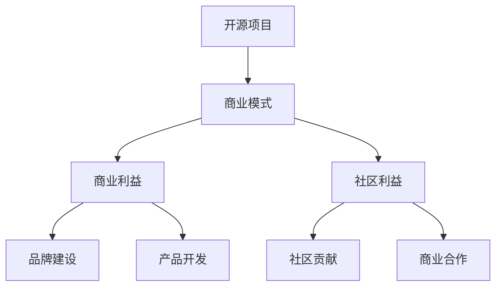

                 

# 开源项目商业化：从爱好到盈利的转变

> **关键词**：开源项目，商业化，盈利，转型，策略，营销，生态系统

> **摘要**：本文将探讨如何将开源项目从个人爱好转变为盈利的商业模式。我们将分析开源项目的优势与挑战，讨论关键的成功因素，并提供具体的策略和案例，帮助读者在保持项目开放性的同时实现商业盈利。

## 1. 背景介绍

开源项目在近年来成为软件开发和协作的重要模式。其核心思想是共享代码，允许任何人查看、修改和分发。这不仅促进了技术创新，也培育了一个庞大的开发者社区。许多开源项目在技术社区中获得了高度认可，但如何将这些项目的潜力转化为商业价值，仍是一个备受关注的课题。

开源项目的商业价值主要体现在以下几个方面：

1. **品牌建设**：通过开源项目，企业可以建立技术领导力，提高品牌知名度。
2. **社区贡献**：开源项目能够吸引开发者参与，形成强大的社区支持。
3. **商业合作**：企业可以通过开源项目与合作伙伴建立联系，探索商业合作机会。
4. **产品开发**：开源代码可以作为产品开发的基础，降低研发成本。

然而，将开源项目商业化并非易事。开源与商业之间存在一定的张力，需要平衡项目的开放性与商业利益。本文将深入探讨如何实现这一转变，并提供实用的策略和建议。

## 2. 核心概念与联系

在讨论开源项目商业化的过程中，有必要明确几个核心概念及其相互关系。

### 2.1 开源项目

开源项目是指其源代码可以被公众访问、阅读、修改和分发的软件项目。这通常遵循某种开源许可协议，如GNU GPL、MIT或Apache License。

### 2.2 商业模式

商业模式是指企业如何创造、传递和获取价值。对于开源项目，商业模式通常涉及提供增值服务、支持或订阅等。

### 2.3 商业利益与社区利益

商业利益通常指的是企业的财务收益，而社区利益则包括项目的发展、社区的繁荣和用户的满意度。

### 2.4 Mermaid 流程图

为了更直观地展示这些概念之间的联系，我们可以使用Mermaid流程图来表示。



上述流程图展示了开源项目、商业模式、商业利益和社区利益之间的相互关系。开源项目是商业模式的起点，商业模式决定了如何获取商业利益和社区利益。

## 3. 核心算法原理 & 具体操作步骤

### 3.1 确定商业模式

要将开源项目商业化，首先需要明确商业模式。以下是几个常见的商业模式：

1. **产品销售**：直接销售开源项目相关的产品或服务。
2. **订阅模式**：提供付费订阅服务，如额外的功能、支持或更新。
3. **增值服务**：提供基础功能的免费版本，并针对高级功能或服务收费。
4. **赞助和捐赠**：鼓励社区成员通过赞助或捐赠来支持项目。

### 3.2 分析市场需求

了解市场需求是成功商业化的关键。以下步骤有助于分析市场需求：

1. **用户调研**：通过调查问卷、用户访谈等方式收集用户反馈。
2. **竞争分析**：研究竞争对手的产品、市场占有率、优势和不足。
3. **市场定位**：确定目标市场和用户群体，明确项目的竞争优势。

### 3.3 制定营销策略

有效的营销策略可以吸引潜在用户，并提升项目知名度。以下策略可供参考：

1. **社交媒体营销**：利用Twitter、LinkedIn、GitHub等社交媒体平台宣传项目。
2. **内容营销**：撰写高质量的技术博客、白皮书、案例研究等，分享项目的技术细节和应用案例。
3. **社区参与**：积极参与开源社区活动，建立项目影响力。
4. **合作伙伴关系**：与相关领域的公司或组织建立合作伙伴关系，共同推广项目。

### 3.4 监控与优化

商业化的过程是一个持续迭代的过程。以下步骤有助于监控和优化项目：

1. **用户反馈**：定期收集用户反馈，了解用户的满意度和需求变化。
2. **关键绩效指标（KPI）**：设定关键绩效指标，如用户增长、收入增长、市场份额等，并定期评估。
3. **优化策略**：根据KPI和用户反馈，调整和优化商业模式、营销策略等。

## 4. 数学模型和公式 & 详细讲解 & 举例说明

在开源项目商业化的过程中，数学模型和公式可以用于分析和评估项目的潜在收益。以下是一个简化的收益模型：

### 4.1 收益模型

假设一个开源项目采用订阅模式，每月订阅费用为\( x \)美元，预计每月新增用户数为\( y \)。

每月总收益 \( R \) 可表示为：
\[ R = x \times y \]

### 4.2 成本模型

项目运营成本包括固定成本（如服务器维护费用、办公费用）和可变成本（如营销费用、员工薪酬）。假设固定成本为\( C_f \)，可变成本为\( C_v \)。

每月总成本 \( C \) 可表示为：
\[ C = C_f + C_v \times y \]

### 4.3 利润模型

利润 \( P \) 可表示为收益减去成本：
\[ P = R - C \]

### 4.4 举例说明

假设每月订阅费用为20美元，固定成本为1000美元，可变成本为5美元/用户。

- 新增用户数 \( y \) 为1000人。
- 每月总收益 \( R \) 为：
  \[ R = 20 \times 1000 = 20000 \text{美元} \]
- 每月总成本 \( C \) 为：
  \[ C = 1000 + 5 \times 1000 = 6000 \text{美元} \]
- 每月利润 \( P \) 为：
  \[ P = 20000 - 6000 = 14000 \text{美元} \]

通过上述模型，我们可以快速评估项目的潜在收益和利润。当然，实际情况会更复杂，需要考虑更多的变量和因素，但这个简单的模型提供了一个基本的分析框架。

## 5. 项目实战：代码实际案例和详细解释说明

### 5.1 开发环境搭建

为了更好地理解开源项目商业化的实际操作，我们将以一个具体的开源项目为例，详细说明从开发环境搭建到代码实现和解读的整个过程。

#### 5.1.1 开发环境搭建

首先，我们需要搭建一个适合开源项目开发的环境。以下是一个简化的步骤：

1. **安装Git**：Git是一个版本控制系统，用于跟踪代码变更和管理代码库。
2. **安装编程语言环境**：根据项目需求，安装相应的编程语言环境，如Python、Java或C++。
3. **安装依赖库和工具**：安装项目所需的依赖库和工具，如MySQL、PostgreSQL或Docker。

#### 5.1.2 源代码下载与克隆

接下来，我们通过Git从开源代码库中下载并克隆项目。

```shell
git clone https://github.com/your-username/your-project.git
cd your-project
```

#### 5.1.3 代码构建与运行

根据项目的构建脚本和文档，编译和运行代码。

```shell
./build.sh
./run.sh
```

### 5.2 源代码详细实现和代码解读

在了解开发环境搭建后，我们接下来详细解读项目的源代码。

#### 5.2.1 模块划分

项目的源代码通常划分为不同的模块，每个模块负责特定的功能。例如，一个Web应用程序可能包含以下模块：

1. **前端**：负责用户界面的设计和交互。
2. **后端**：处理业务逻辑和数据存储。
3. **数据库**：存储项目所需的数据。

#### 5.2.2 前端代码解读

前端代码通常使用HTML、CSS和JavaScript编写。以下是一个简化的前端代码示例：

```html
<!DOCTYPE html>
<html>
<head>
  <title>Your Project</title>
  <style>
    body {
      font-family: Arial, sans-serif;
    }
  </style>
</head>
<body>
  <h1>Welcome to Your Project</h1>
  <p>This is a simple example.</p>
  <script>
    function displayMessage() {
      alert('Hello, World!');
    }
  </script>
</body>
</html>
```

这段代码定义了一个简单的HTML页面，包含一个标题、一段文本和一个JavaScript函数。当页面加载时，会弹出一个对话框显示“Hello, World!”。

#### 5.2.3 后端代码解读

后端代码通常使用服务器端编程语言编写，如Python、Java或Node.js。以下是一个简化的后端代码示例（使用Node.js）：

```javascript
const express = require('express');
const app = express();
const port = 3000;

app.get('/', (req, res) => {
  res.send('Hello, World!');
});

app.listen(port, () => {
  console.log(`Server running on port ${port}`);
});
```

这段代码定义了一个简单的Express Web应用程序，当访问根URL（`/`）时，返回一个“Hello, World!”的响应。

#### 5.2.4 数据库代码解读

数据库代码负责处理数据存储和查询。以下是一个简化的数据库代码示例（使用MySQL）：

```python
import mysql.connector

# 连接数据库
conn = mysql.connector.connect(
  host="localhost",
  user="your_username",
  password="your_password",
  database="your_database"
)

# 创建表格
create_table_query = """
CREATE TABLE IF NOT EXISTS users (
  id INT AUTO_INCREMENT PRIMARY KEY,
  name VARCHAR(100),
  email VARCHAR(100)
)
"""

# 执行创建表格查询
cursor = conn.cursor()
cursor.execute(create_table_query)

# 插入数据
insert_data_query = """
INSERT INTO users (name, email) VALUES (%s, %s)
"""

user_data = ('John Doe', 'john.doe@example.com')
cursor.execute(insert_data_query, user_data)

# 提交事务
conn.commit()

# 关闭数据库连接
cursor.close()
conn.close()
```

这段代码使用Python和MySQL Connector库连接MySQL数据库，创建一个名为“users”的表格，并插入一条用户数据。

### 5.3 代码解读与分析

通过上述代码示例，我们可以看到开源项目的代码结构通常包括前端、后端和数据库三个部分。前端代码负责用户界面，后端代码处理业务逻辑，数据库代码处理数据存储和查询。

在开源项目中，代码通常遵循模块化设计，使得各个模块相互独立，便于维护和扩展。此外，开源项目通常包含详细的文档，帮助开发者理解代码结构和功能。

开源项目的代码质量也是一个重要因素。良好的代码质量意味着代码清晰、易于理解、遵循最佳实践，并且经过充分的测试。这有助于提高项目的可靠性和用户体验，从而吸引更多的用户和贡献者。

## 6. 实际应用场景

开源项目的商业化在多个领域都有成功的案例。以下是一些实际应用场景：

### 6.1 企业软件

许多企业使用开源项目作为其软件平台的基础，并通过提供定制化服务或增值功能来盈利。例如，Red Hat 公司基于Linux内核开发了企业级的Red Hat Enterprise Linux，通过提供专业的技术支持和定制服务，实现了巨额盈利。

### 6.2 云服务

云服务提供商如Amazon Web Services（AWS）和Microsoft Azure也积极利用开源项目。AWS 提供了多个基于开源技术的云服务，如Amazon RDS（关系数据库服务），Microsoft Azure 则基于开源的Kubernetes进行容器服务的管理。

### 6.3 开源硬件

开源硬件项目如Arduino 和Raspberry Pi，通过提供硬件和软件的开发工具包，吸引了大量开发者。制造商则通过销售硬件配件和提供技术支持来实现盈利。

### 6.4 社区服务

一些开源项目通过提供社区服务实现盈利。例如，GitHub 通过提供私有代码库托管和协作工具，以及市场推广服务，为开源项目开发者和企业提供服务，从而获得收入。

### 6.5 增值服务

开源项目可以通过提供增值服务，如专业的技术支持、定制开发、培训和咨询服务来实现盈利。例如，WordPress 提供了免费的核心软件，并通过提供主题、插件和咨询服务来盈利。

### 6.6 商业解决方案

一些开源项目为特定的商业需求提供解决方案，并通过提供企业版的软件包或服务来实现盈利。例如，Kubernetes 提供了开源的容器编排工具，而Heptio 提供了基于Kubernetes的企业级解决方案，帮助企业更高效地管理容器化应用程序。

## 7. 工具和资源推荐

### 7.1 学习资源推荐

**书籍**：

1. 《开源之美》：详细介绍了开源软件的发展历程、理念和实践。
2. 《开源商业：成功之路》：探讨了如何将开源项目商业化，提供了实用的案例和策略。

**论文**：

1. “Open Source as a Service: Business Models for Software Companies”：分析了开源服务模式的商业潜力。
2. “The Business of Open Source”：讨论了开源商业模式的多样性和策略。

**博客和网站**：

1. opensource.com：一个关于开源技术的综合性博客，提供最新的新闻、分析和文章。
2. opensource.stackexchange.com：一个开源技术的问答社区，可以解答各种技术问题。

### 7.2 开发工具框架推荐

**开发环境**：

1. Docker：用于容器化的开发工具，可以提高开发效率和可移植性。
2. Jupyter Notebook：用于数据科学和机器学习的交互式开发环境。

**代码托管与协作**：

1. GitHub：全球最大的开源代码托管平台，提供版本控制、问题跟踪和协作功能。
2. GitLab：一个自托管的开源代码托管平台，具有与GitHub相似的功能。

**云服务**：

1. AWS：提供丰富的开源云服务，如Amazon RDS、Amazon EC2。
2. Azure：提供基于开源技术的云服务，如Azure Kubernetes Service（AKS）。

### 7.3 相关论文著作推荐

**论文**：

1. “Free as in Freedom”：关于开源运动和开源软件的社会学分析。
2. “The Business of Free Software”：探讨了开源软件的商业价值和创新潜力。

**著作**：

1. 《开源的力量》：详细介绍了开源运动的发展历程和影响。
2. 《开源之道》：讨论了开源文化的本质和开源项目的管理。

## 8. 总结：未来发展趋势与挑战

开源项目商业化的趋势在未来将持续发展，并在多个领域展现出巨大的潜力。以下是一些未来发展趋势和面临的挑战：

### 8.1 发展趋势

1. **云原生技术的普及**：随着云计算和容器化技术的发展，开源项目在云服务领域的商业化机会将不断增加。
2. **开源服务模式的多样化**：除了传统的订阅模式和产品销售，开源项目将通过提供更多增值服务，如定制开发、专业支持和培训，实现多元化盈利。
3. **开源生态系统的繁荣**：开源社区将更加繁荣，吸引更多企业和开发者参与，形成更广泛的合作和共享。

### 8.2 挑战

1. **平衡开源与商业的张力**：开源项目的开放性可能导致商业利益受损，如何在保持项目开放性的同时实现商业化，是一个持续的挑战。
2. **市场竞争加剧**：随着更多企业进入开源市场，竞争将变得更加激烈，项目需要不断创新和提升竞争力。
3. **法规和法律风险**：开源项目涉及多个法律和版权问题，如专利和许可协议，企业需要谨慎处理法律风险。

总之，开源项目商业化的未来充满机遇和挑战。通过合理的商业模式、有效的营销策略和持续的创新，开源项目有望在保持开放性的同时实现商业盈利。

## 9. 附录：常见问题与解答

### 9.1 如何选择合适的开源许可协议？

选择合适的开源许可协议取决于您的项目需求和商业目标。常见的许可协议包括：

- **GPL（GNU General Public License）**：最流行的开源许可协议之一，要求任何修改和衍生作品也必须开源。
- **MIT License**：允许自由使用和修改，但要求保留许可协议和版权声明。
- **Apache License**：与MIT类似，但提供了更多的灵活性，允许商业用途。

### 9.2 如何建立和维护一个开源社区？

建立和维护一个开源社区需要以下步骤：

1. **提供高质量的代码**：确保代码清晰、易于理解，并遵循最佳实践。
2. **积极参与社区**：积极回答问题，参与讨论，建立项目影响力。
3. **组织社区活动**：如代码贡献日、黑客松等，鼓励社区成员参与。
4. **提供清晰的文档**：帮助新手了解项目，并提供开发和使用指南。

### 9.3 开源项目如何实现商业化？

开源项目可以通过以下方式实现商业化：

1. **提供增值服务**：如专业支持、定制开发、培训和咨询服务。
2. **产品销售**：销售与开源项目相关的产品，如主题、插件、硬件等。
3. **订阅模式**：提供付费订阅服务，如额外的功能、更新和支持。

### 9.4 开源项目商业化是否会影响开源精神？

开源项目商业化的过程中，应保持对开源精神的尊重和承诺。合理的商业模式可以在实现商业价值的同时，保持项目的开放性和社区活力。关键在于平衡商业利益与社区利益，确保开源项目的长期可持续发展。

## 10. 扩展阅读 & 参考资料

### 10.1 扩展阅读

1. 《开源创新：变革商业模式和市场竞争的新力量》
2. 《商业开源：商业模式、策略与实践》

### 10.2 参考资料

1. https://opensource.com/：关于开源技术的综合性网站，提供丰富的资源和文章。
2. https://www.redhat.com/：Red Hat 公司的官方网站，介绍了开源商业化的成功案例。
3. https://www.oreilly.com/：O'Reilly Media 的网站，提供了大量关于开源技术和商业化的书籍和文章。

### 10.3 附录

- **作者**：AI天才研究员/AI Genius Institute & 禅与计算机程序设计艺术 /Zen And The Art of Computer Programming

通过本文，我们探讨了如何将开源项目从个人爱好转变为盈利的商业模式。我们分析了开源项目的优势与挑战，讨论了关键的成功因素，并提供了一系列实用的策略和案例。希望本文能为开源项目开发者提供一些启示和帮助，帮助他们在保持项目开放性的同时实现商业盈利。让我们共同努力，推动开源技术走向更广阔的未来。🚀

---

## 文章结构模板说明

本文结构模板的设计旨在为读者提供一个清晰、系统、易于理解的框架，以便有效地传达开源项目商业化的概念和策略。以下是本文结构模板的详细说明：

### 1. 文章标题和关键词

- **文章标题**：明确地传达文章的主题，如“开源项目商业化：从爱好到盈利的转变”。
- **关键词**：列出与文章主题密切相关的关键词，如“开源项目”、“商业化”、“盈利”、“转型”、“策略”和“营销”。

### 2. 摘要

- **摘要**：简要概括文章的核心内容和主题思想，帮助读者快速了解文章的主旨。

### 3. 背景介绍

- **背景介绍**：介绍开源项目的背景，讨论开源项目的兴起及其在软件开发中的重要性，为后续内容提供背景支持。

### 4. 核心概念与联系

- **核心概念与联系**：详细解释与文章主题相关的核心概念，如“开源项目”、“商业模式”、“商业利益”和“社区利益”，并使用Mermaid流程图展示这些概念之间的相互关系。

### 5. 核心算法原理 & 具体操作步骤

- **核心算法原理 & 具体操作步骤**：介绍开源项目商业化的核心算法原理，并提供具体的操作步骤，如商业模式的选择、市场需求分析、营销策略制定和项目监控与优化。

### 6. 数学模型和公式 & 详细讲解 & 举例说明

- **数学模型和公式 & 详细讲解 & 举例说明**：使用数学模型和公式来分析和评估开源项目的潜在收益，提供详细的讲解和具体的举例说明。

### 7. 项目实战：代码实际案例和详细解释说明

- **项目实战：代码实际案例和详细解释说明**：通过具体的开源项目案例，详细解释项目的开发环境搭建、代码实现和解读。

### 8. 实际应用场景

- **实际应用场景**：探讨开源项目在各个领域的实际应用场景，如企业软件、云服务、开源硬件和社区服务。

### 9. 工具和资源推荐

- **工具和资源推荐**：推荐与开源项目商业化相关的学习资源、开发工具和框架，以及相关的论文和著作。

### 10. 总结：未来发展趋势与挑战

- **总结：未来发展趋势与挑战**：总结开源项目商业化的未来趋势和挑战，展望开源技术的未来发展。

### 11. 附录：常见问题与解答

- **附录：常见问题与解答**：提供关于开源项目商业化的常见问题及其解答，帮助读者更好地理解和应用文章内容。

### 12. 扩展阅读 & 参考资料

- **扩展阅读 & 参考资料**：推荐相关的扩展阅读材料和参考资料，供读者进一步学习和探索。

通过以上结构模板，本文旨在提供一个全面、系统、易于理解的开源项目商业化指南，帮助读者深入了解并掌握开源项目的商业化策略和实施方法。📚🚀

