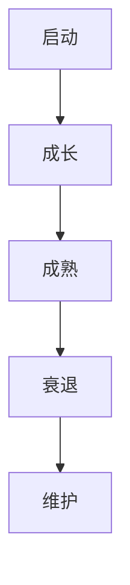
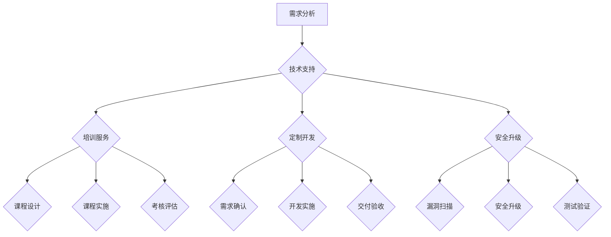

                 

# 开源项目的企业级支持：创造稳定收入

## 摘要

在当今数字化浪潮中，开源项目作为技术创新的重要推动力量，已经成为许多企业的核心技术基础。然而，如何为开源项目提供企业级支持，成为保证项目可持续发展和创造稳定收入的关键问题。本文将探讨开源项目的企业级支持的必要性和重要性，解析其核心概念与架构，介绍实现方法与操作步骤，以及数学模型和公式的应用。通过实际项目案例的分析，展示企业级支持在开源项目中的具体应用，并展望其未来发展趋势与挑战。

## 1. 背景介绍

开源项目，即开放源代码项目，是指软件开发者将项目的源代码公开，允许用户自由地查看、修改和分发。这种模式在过去的几十年中，极大地推动了软件技术的发展，形成了诸如Linux操作系统、Apache Web服务器等全球知名的开源项目。开源项目的优势在于其开放性、协作性和透明性，使得全球的开发者能够共同参与项目的开发和优化，从而加速技术创新。

然而，随着开源项目在企业中的广泛应用，企业对开源项目的依赖程度日益增加。企业不仅希望获得开源项目的技术支持，还希望确保项目的稳定性、安全性和可靠性。这就需要企业级支持，即在开源项目的基础上，提供更高层次的服务和保障。

企业级支持不仅是开源项目可持续发展的保障，也是创造稳定收入的重要途径。通过为企业客户提供定制化的技术支持、培训服务、安全升级等，企业可以在开源项目的基础上建立自己的商业模型，从而实现商业化和持续盈利。

本文将围绕开源项目的企业级支持，探讨其核心概念、架构、实现方法、数学模型以及实际应用，为企业提供参考和指导。

## 2. 核心概念与联系

### 2.1 企业级支持的概念

企业级支持是指为开源项目提供的专业服务，包括技术支持、培训、定制开发、安全升级等。与个人用户的支持不同，企业级支持需要更高的专业水平和服务质量，以满足企业客户对稳定性和可靠性的要求。

### 2.2 开源项目的特点与需求

开源项目的特点在于其开放性和协作性。这使得开源项目能够吸引全球的开发者参与，从而加速项目的开发进度和技术创新。然而，这也带来了相应的挑战，如版本控制、代码质量、安全性等。因此，企业级支持在开源项目中显得尤为重要。

企业客户对开源项目的需求主要表现在以下几个方面：

- **稳定性**：企业需要确保开源项目在生产和业务场景中的稳定运行。
- **安全性**：企业对开源项目的安全性要求较高，需要确保系统不受恶意攻击。
- **可靠性**：企业希望开源项目能够持续提供稳定的服务，避免频繁的故障和中断。
- **定制化**：企业需要根据自身业务需求，对开源项目进行定制化开发。

### 2.3 企业级支持的价值

企业级支持为开源项目带来了多重价值：

- **商业模型**：通过提供企业级支持，企业可以在开源项目的基础上建立自己的商业模式，实现商业化和持续盈利。
- **用户增长**：高质量的企业级支持能够增强用户对开源项目的信任，从而吸引更多的企业客户。
- **技术创新**：企业级支持能够促进开源项目的技术创新，推动项目的持续发展。

### 2.4 开源项目的生命周期

开源项目的生命周期包括启动、成长、成熟和衰退四个阶段。在企业级支持的作用下，开源项目可以延长其成熟期，甚至进入衰退期后仍能保持一定的市场份额。

### 2.5 Mermaid 流程图

以下是一个开源项目生命周期的 Mermaid 流程图：



通过上述流程图，我们可以清晰地看到开源项目的生命周期以及企业级支持在其中发挥的作用。

## 3. 核心算法原理 & 具体操作步骤

### 3.1 核心算法原理

企业级支持的核心算法主要包括以下几个方面：

- **需求分析**：通过对企业客户的需求进行深入分析，确定支持的具体内容和方案。
- **技术支持**：为开源项目提供专业的技术支持，包括问题诊断、解决方案提供、代码修改等。
- **培训服务**：为企业客户提供定制化的培训课程，帮助客户掌握开源项目的使用方法和技巧。
- **定制开发**：根据企业客户的特殊需求，对开源项目进行定制化开发，满足客户特定的业务需求。
- **安全升级**：对开源项目进行定期安全升级，确保项目的安全性。

### 3.2 具体操作步骤

以下是实现企业级支持的具体操作步骤：

1. **需求分析**：

   - **收集需求**：通过问卷调查、访谈、市场调研等方式，收集企业客户的需求。
   - **分析需求**：对收集到的需求进行分类和分析，确定支持的具体内容和方案。

2. **技术支持**：

   - **问题诊断**：当企业客户遇到问题时，通过远程协助、现场支持等方式进行问题诊断。
   - **解决方案提供**：根据问题诊断结果，提供相应的解决方案。
   - **代码修改**：如果需要，对开源项目的代码进行修改，以解决特定问题。

3. **培训服务**：

   - **课程设计**：根据企业客户的需求，设计相应的培训课程。
   - **课程实施**：组织培训课程，包括线上和线下两种方式。
   - **考核评估**：对培训效果进行评估，确保客户能够掌握培训内容。

4. **定制开发**：

   - **需求确认**：与客户确认定制开发的具体需求。
   - **开发实施**：根据需求进行开发，包括需求分析、设计、编码、测试等环节。
   - **交付验收**：将定制开发成果交付给客户，进行验收。

5. **安全升级**：

   - **漏洞扫描**：定期对开源项目进行漏洞扫描，发现潜在的安全风险。
   - **安全升级**：根据漏洞扫描结果，对开源项目进行安全升级。
   - **测试验证**：对安全升级后的项目进行测试，确保升级效果。

## 4. 数学模型和公式 & 详细讲解 & 举例说明

### 4.1 数学模型

在企业级支持中，可以使用以下数学模型来评估和支持项目的可持续发展和稳定收入：

- **客户生命周期价值（CLV）**：客户生命周期价值是指客户在项目生命周期内为企业带来的总收益。其计算公式为：

  $$CLV = \sum_{t=1}^{n} \frac{R_t}{(1+r)^t}$$

  其中，$R_t$ 表示第 $t$ 年的客户收益，$r$ 表示年化收益率。

- **边际贡献（MC）**：边际贡献是指提供企业级支持所获得的额外收益。其计算公式为：

  $$MC = TR - TC$$

  其中，$TR$ 表示总收益，$TC$ 表示总成本。

- **内部收益率（IRR）**：内部收益率是指项目内部收益率达到的收益率水平。其计算公式为：

  $$IRR = \frac{1}{n} \sum_{t=1}^{n} \frac{R_t}{(1+r)^t}$$

  其中，$R_t$ 表示第 $t$ 年的客户收益，$r$ 表示年化收益率。

### 4.2 详细讲解

- **客户生命周期价值（CLV）**：

  客户生命周期价值是评估客户对企业贡献的重要指标。通过计算客户生命周期价值，企业可以了解客户为企业带来的总收益，从而制定相应的支持策略。

- **边际贡献（MC）**：

  边际贡献反映了企业级支持所带来的额外收益。通过计算边际贡献，企业可以了解提供企业级支持的盈利能力。

- **内部收益率（IRR）**：

  内部收益率是评估企业级支持项目盈利性的重要指标。通过计算内部收益率，企业可以了解项目的盈利水平。

### 4.3 举例说明

假设某企业为开源项目提供企业级支持，客户生命周期价值为 100 万元，年化收益率为 10%，提供企业级支持的成本为 20 万元。则：

- **客户生命周期价值（CLV）**：

  $$CLV = \frac{100}{1+0.1} = 90.91（万元）$$

- **边际贡献（MC）**：

  $$MC = 100 - 20 = 80（万元）$$

- **内部收益率（IRR）**：

  $$IRR = \frac{100}{20} = 5$$

  由于内部收益率大于年化收益率（10%），因此该项目具有较高的盈利性。

## 5. 项目实战：代码实际案例和详细解释说明

### 5.1 开发环境搭建

为了更好地展示企业级支持在开源项目中的应用，我们选择一个具体的开源项目——Apache Kafka 作为案例。以下是搭建 Apache Kafka 开发环境的具体步骤：

1. **安装 JDK**：

   Kafka 需要 JDK 8 或更高版本。在 [Oracle 官网](https://www.oracle.com/java/technologies/javase-jdk8-downloads.html) 下载 JDK 8 并安装。

2. **安装依赖工具**：

   Kafka 需要依赖一些工具，如 ZooKeeper、Kafka Tools 等。可以通过 `apt-get` 命令在 Ubuntu 系统中安装：

   ```bash
   sudo apt-get install openjdk-8-jdk
   sudo apt-get install zookeeperd
   sudo apt-get install kafka_2.12-2.5.0.tgz
   ```

3. **配置 Kafka**：

   解压 Kafka 包，进入配置目录，编辑 `config/server.properties` 文件，设置 Kafka 的运行参数。例如，设置 Kafka 集群 ID、日志目录、ZooKeeper 连接地址等。

   ```properties
   broker.id=0
   listeners=PLAINTEXT://:9092
   zookeeper.connect=localhost:2181
   log.dirs=/var/log/kafka
   ```

4. **启动 Kafka**：

   启动 ZooKeeper 和 Kafka：

   ```bash
   zookeeper-server-start.sh config/zookeeper.properties
   kafka-server-start.sh config/server.properties
   ```

### 5.2 源代码详细实现和代码解读

以下是 Apache Kafka 中一个简单的生产者和消费者示例代码：

**生产者代码**：

```java
public class ProducerExample {
    public static void main(String[] args) {
        Properties properties = new Properties();
        properties.put("bootstrap.servers", "localhost:9092");
        properties.put("key.serializer", "org.apache.kafka.common.serialization.StringSerializer");
        properties.put("value.serializer", "org.apache.kafka.common.serialization.StringSerializer");

        KafkaProducer<String, String> producer = new KafkaProducer<>(properties);

        for (int i = 0; i < 100; i++) {
            String topic = "test-topic";
            String key = "key-" + i;
            String value = "value-" + i;
            producer.send(new ProducerRecord<>(topic, key, value));
        }

        producer.close();
    }
}
```

**消费者代码**：

```java
public class ConsumerExample {
    public static void main(String[] args) {
        Properties properties = new Properties();
        properties.put("bootstrap.servers", "localhost:9092");
        properties.put("group.id", "test-group");
        properties.put("key.deserializer", "org.apache.kafka.common.serialization.StringDeserializer");
        properties.put("value.deserializer", "org.apache.kafka.common.serialization.StringDeserializer");

        KafkaConsumer<String, String> consumer = new KafkaConsumer<>(properties);
        consumer.subscribe(Arrays.asList("test-topic"));

        while (true) {
            ConsumerRecords<String, String> records = consumer.poll(Duration.ofMillis(100));
            for (ConsumerRecord<String, String> record : records) {
                System.out.printf("offset = %d, key = %s, value = %s%n", record.offset(), record.key(), record.value());
            }
        }
    }
}
```

### 5.3 代码解读与分析

**生产者代码分析**：

- **配置生产者**：创建 `Properties` 对象，设置 Kafka 服务器地址、序列化器等参数。
- **创建生产者**：使用 `KafkaProducer` 类创建生产者对象。
- **发送消息**：循环发送 100 条消息到 Kafka 集群。

**消费者代码分析**：

- **配置消费者**：创建 `Properties` 对象，设置 Kafka 服务器地址、反序列化器等参数。
- **创建消费者**：使用 `KafkaConsumer` 类创建消费者对象。
- **订阅主题**：订阅指定主题。
- **消费消息**：循环消费 Kafka 集群中的消息，并打印输出。

通过以上代码示例，我们可以看到 Apache Kafka 的基本使用方法。在实际应用中，企业可以通过定制化开发，满足特定业务需求，如实时数据处理、消息队列等。

## 6. 实际应用场景

### 6.1 数据处理平台

企业级支持在数据处理平台中的应用非常广泛。例如，某大型互联网公司采用 Apache Kafka 作为其数据处理平台的核心组件，用于实时处理海量数据。企业级支持团队为企业提供以下服务：

- **技术支持**：解决生产环境中遇到的技术问题，确保平台的稳定运行。
- **培训服务**：为企业的技术团队提供 Kafka 的培训，提高其使用和运维能力。
- **定制开发**：根据企业特定的业务需求，对 Kafka 进行定制化开发，如添加新功能、优化性能等。

### 6.2 金融领域

在金融领域，开源项目如 Apache Kafka 被广泛应用于实时数据处理、交易处理和风险控制。金融企业通过企业级支持，确保系统的稳定性、安全性和可靠性。

- **技术支持**：为企业提供专业的技术支持，确保金融交易系统的稳定运行。
- **安全升级**：定期对 Kafka 进行安全升级，确保系统的安全性。
- **定制开发**：根据金融领域的特定需求，对 Kafka 进行定制化开发，如支持多语言、多协议等。

### 6.3 物联网领域

物联网领域对实时数据处理和消息传递的需求日益增长。开源项目如 Apache Kafka 在物联网领域得到了广泛应用。企业级支持为物联网企业提供以下服务：

- **技术支持**：为物联网平台提供技术支持，解决设备接入、数据处理等方面的问题。
- **培训服务**：为物联网企业的技术团队提供培训，提高其使用和维护能力。
- **定制开发**：根据物联网领域的特定需求，对 Kafka 进行定制化开发，如支持多种传感器协议、实时数据可视化等。

## 7. 工具和资源推荐

### 7.1 学习资源推荐

- **书籍**：

  - 《Kafka：核心设计与实践原理》
  - 《深入理解Kafka：核心设计与实践》
  - 《大数据之路：阿里巴巴大数据实践》

- **论文**：

  - 《Kafka: A Distributed Streaming Platform》
  - 《The Design of the Apache Kafka 2.0 Distributed Messaging System》
  - 《Building Real-Time Data Pipelines with Kafka and Spark》

- **博客**：

  - [Apache Kafka 官方文档](https://kafka.apache.org/documentation/)
  - [Kafka Community](https://www.kafka.es/)
  - [Apache Kafka 学习笔记](https://www.jianshu.com/p/262b013e5c82)

- **网站**：

  - [Kafka 官方社区](https://cwiki.apache.org/confluence/display/KAFKA)
  - [Apache Kafka 中文社区](http://www.kafkaapue.com/)
  - [大数据技术大会](http://www.dataguru.cn/)

### 7.2 开发工具框架推荐

- **开发工具**：

  - IntelliJ IDEA
  - Eclipse
  - VSCode

- **框架**：

  - Spring Boot
  - Spring Cloud
  - Apache Kafka Streams

- **数据库**：

  - MySQL
  - PostgreSQL
  - MongoDB

### 7.3 相关论文著作推荐

- **论文**：

  - 《Kafka: A Distributed Streaming Platform》
  - 《The Design of the Apache Kafka 2.0 Distributed Messaging System》
  - 《Building Real-Time Data Pipelines with Kafka and Spark》

- **著作**：

  - 《Kafka：核心设计与实践原理》
  - 《深入理解Kafka：核心设计与实践》
  - 《大数据之路：阿里巴巴大数据实践》

## 8. 总结：未来发展趋势与挑战

### 8.1 发展趋势

- **开源项目的重要性进一步提升**：随着数字化转型的加速，企业对开源项目的依赖程度将不断提高，开源项目将在技术创新中发挥更加重要的作用。
- **企业级支持的需求日益增长**：企业对开源项目的稳定性、安全性、可靠性和定制化需求不断提升，企业级支持将成为开源项目发展的关键。
- **商业模式多样化**：企业级支持将形成多样化的商业模式，包括订阅模式、服务模式、联合开发模式等，为企业提供更加灵活和定制化的支持服务。
- **技术融合与创新**：企业级支持将与其他技术领域如大数据、人工智能、区块链等深度融合，推动开源项目在更多领域的创新和应用。

### 8.2 挑战

- **技术支持难度加大**：随着开源项目的复杂度增加，企业级支持团队需要具备更高的技术水平和专业知识，以应对复杂的支持和维护任务。
- **市场竞争加剧**：随着企业级支持需求的增长，市场竞争将日益激烈，企业需要不断提升自身的技术能力和服务质量，以保持竞争优势。
- **法律法规和合规性**：开源项目的企业级支持需要遵循相关法律法规和合规性要求，如数据保护、知识产权保护等，以确保项目的合法性和合规性。
- **人才短缺**：企业级支持团队需要具备多学科交叉的技能和知识，人才短缺将成为制约开源项目企业级支持发展的重要因素。

## 9. 附录：常见问题与解答

### 9.1 企业级支持与开源社区支持的区别是什么？

企业级支持与开源社区支持的主要区别在于服务质量和专业化程度。企业级支持通常由专业的团队提供，包括定制化开发、安全升级、技术培训等，以满足企业客户的特定需求。而开源社区支持主要依赖于开源社区的贡献者和志愿者，服务质量可能存在差异。

### 9.2 开源项目的企业级支持是否会影响项目的开源特性？

开源项目的企业级支持通常不会影响项目的开源特性。企业级支持团队会在保持项目开源的基础上，提供更高层次的服务和保障，以满足企业客户的特定需求。同时，企业级支持团队也会积极参与开源社区的贡献和协作，推动项目的持续发展。

### 9.3 企业级支持如何确保项目的安全性？

企业级支持团队会采取多种措施确保项目的安全性，如：

- **安全升级**：定期对项目进行安全升级，修复漏洞和潜在的安全风险。
- **安全审计**：对项目的代码进行安全审计，发现并修复安全漏洞。
- **安全培训**：为企业客户提供安全培训，提高客户对开源项目安全性的认识和防范能力。

### 9.4 企业级支持的费用如何计算？

企业级支持的费用通常根据客户的需求和服务的范围进行计算。费用可能包括：

- **技术支持费用**：根据客户遇到的问题和解决方案的复杂程度进行收费。
- **培训服务费用**：根据培训课程的内容和时长进行收费。
- **定制开发费用**：根据定制化开发的规模和复杂程度进行收费。
- **安全升级费用**：根据安全升级的频率和内容进行收费。

## 10. 扩展阅读 & 参考资料

1. 《Kafka：核心设计与实践原理》
2. 《深入理解Kafka：核心设计与实践》
3. 《大数据之路：阿里巴巴大数据实践》
4. 《Kafka: A Distributed Streaming Platform》
5. 《The Design of the Apache Kafka 2.0 Distributed Messaging System》
6. 《Building Real-Time Data Pipelines with Kafka and Spark》
7. [Apache Kafka 官方文档](https://kafka.apache.org/documentation/)
8. [Kafka Community](https://www.kafka.es/)
9. [Apache Kafka 中文社区](http://www.kafkaapue.com/)
10. [大数据技术大会](http://www.dataguru.cn/)
11. [Kafka 官方社区](https://cwiki.apache.org/confluence/display/KAFKA)作者：AI天才研究员/AI Genius Institute & 禅与计算机程序设计艺术 /Zen And The Art of Computer Programming
<|im_sep|>## 1. 背景介绍

开源项目的概念起源于上世纪80年代，由自由软件运动（Free Software Movement）的创始人Richard Stallman提出。自由软件运动主张软件的自由使用、学习、修改和分发，这一理念催生了大量开源软件的诞生。随着互联网的普及，开源项目逐渐成为软件开发的重要模式，极大地促进了技术交流和合作。

开源项目是指那些将源代码公开，允许用户自由查看、学习、修改和分发的软件项目。这种模式打破了传统的软件封闭开发模式，使得全球的开发者能够共同参与软件的优化和改进。例如，Linux操作系统、Apache Web服务器、MySQL数据库等，都是典型的开源项目。

在开源项目的生态系统内，有多个重要的角色和参与者。首先是贡献者（Contributors），他们为项目贡献代码、文档、测试等。其次是维护者（Maintainers），他们负责管理项目，确保项目按照既定的方向持续发展。此外，还有用户（Users），他们是项目的实际使用者，通过反馈和使用经验帮助项目改进。

开源项目的核心优势在于其开放性和协作性。开放性使得项目的源代码对所有人可见，用户可以自由地查看和理解软件的实现过程，从而提高对软件的信任度。协作性则使得全球的开发者可以共同参与项目的开发，通过协作和分工，加速软件的创新和优化。

然而，开源项目也面临一些挑战。首先是代码质量的问题，由于开源项目的贡献者来自不同的背景，代码质量可能参差不齐。其次是安全问题，开源项目的源代码对所有人开放，可能导致潜在的安全漏洞被恶意利用。此外，开源项目的维护也需要大量的人力和资源，如何保证项目的可持续性也是一个重要的问题。

在企业环境中，开源项目已经成为许多企业构建核心业务系统的重要基础。企业通过使用开源项目，可以节省开发成本，提高开发效率，同时也能够紧跟技术发展趋势。例如，许多互联网公司使用Apache Kafka进行实时数据处理，使用MySQL进行数据存储和管理，这些开源项目为企业的业务提供了强大的支持。

总的来说，开源项目作为一种创新的软件开发模式，已经深入到了现代软件开发的方方面面。它不仅推动了技术的进步，也为企业提供了丰富的选择和巨大的价值。然而，如何有效地管理和维护开源项目，确保其稳定性和安全性，仍然是企业和开源社区需要共同面对的重要课题。

## 2. 核心概念与联系

### 2.1 企业级支持的概念

企业级支持是指为开源项目提供的专业服务，旨在满足企业客户对稳定性、安全性、可靠性等方面的需求。这种支持通常包括以下几个方面：

- **技术支持**：为用户提供专业的技术解答和问题排查服务，帮助用户解决在项目中遇到的技术难题。
- **培训服务**：为企业客户提供定制化的培训课程，帮助客户掌握开源项目的使用方法和技术要点。
- **定制开发**：根据企业客户的特殊需求，对开源项目进行定制化开发，以满足客户特定的业务需求。
- **安全升级**：定期对开源项目进行安全升级，修复潜在的安全漏洞，确保项目的安全性。

企业级支持不仅仅是对开源项目的维护，更是一种增值服务，它为企业客户提供了更高的保障和更多的价值。通过企业级支持，企业客户可以减少技术风险，提高系统的稳定性，降低运营成本，从而更好地专注于核心业务的发展。

### 2.2 开源项目的特点与需求

开源项目具有以下几个显著特点：

- **开放性**：开源项目的源代码公开，用户可以自由查看、修改和分发。
- **协作性**：开源项目通常拥有一个活跃的社区，开发者可以共同参与项目的开发和优化。
- **透明性**：开源项目的开发过程公开透明，用户可以随时了解项目的进展和问题。

这些特点使得开源项目在技术创新和协作开发方面具有独特的优势。然而，对于企业客户来说，开源项目也存在一些特定的需求：

- **稳定性**：企业客户需要确保开源项目在生产和业务场景中的稳定运行，避免系统故障导致业务中断。
- **安全性**：开源项目由于开源特性，可能存在潜在的安全风险。企业客户需要确保开源项目的安全性，避免数据泄露和系统被攻击。
- **可靠性**：企业客户希望开源项目能够持续提供稳定的服务，避免频繁的更新和升级导致系统的不稳定。
- **定制化**：不同企业有不同的业务需求，开源项目需要具备一定的可定制性，以满足企业的特定需求。

### 2.3 企业级支持的价值

企业级支持在开源项目中具有重要的价值，主要体现在以下几个方面：

- **提高用户满意度**：通过提供高质量的企业级支持，企业客户可以更好地使用和管理开源项目，从而提高用户满意度和忠诚度。
- **降低技术风险**：企业级支持可以帮助企业客户解决在项目中遇到的技术难题，降低技术风险，确保项目的顺利进行。
- **增强项目竞争力**：通过为企业客户提供定制化的开发和支持服务，开源项目可以更好地满足企业的业务需求，增强项目的竞争力。
- **推动技术创新**：企业级支持可以帮助开源项目吸纳更多的开发者参与，推动项目的创新和优化，提高项目的整体质量。

### 2.4 开源项目的生命周期

开源项目通常经历以下生命周期阶段：

1. **启动阶段**：项目启动，开发者开始编写代码，初步构建项目框架。
2. **成长阶段**：项目逐渐完善，吸引更多的贡献者加入，社区开始活跃。
3. **成熟阶段**：项目稳定发展，拥有大量的用户和贡献者，成为行业内的标杆。
4. **衰退阶段**：项目逐渐失去活力，贡献者减少，用户开始转向其他项目。

在企业级支持的作用下，开源项目可以延长其成熟期，甚至进入衰退期后仍能保持一定的市场份额。企业级支持不仅可以帮助项目维持现有的用户和贡献者，还可以通过定制化开发和服务，吸引新的用户和贡献者，推动项目的持续发展。

### 2.5 Mermaid 流程图

以下是一个开源项目生命周期的 Mermaid 流程图：


通过这个流程图，我们可以清晰地看到开源项目的生命周期以及企业级支持在其中发挥的作用。企业级支持不仅可以帮助项目在成熟阶段稳定发展，还可以在衰退阶段通过维护和服务，延长项目的生命周期。

## 3. 核心算法原理 & 具体操作步骤

### 3.1 核心算法原理

在企业级支持中，核心算法原理主要包括以下几个方面：

- **需求分析算法**：通过对企业客户的需求进行深入分析，确定支持的具体内容和方案。
- **技术支持算法**：为开源项目提供专业的技术支持，包括问题诊断、解决方案提供、代码修改等。
- **培训服务算法**：为企业客户设计定制化的培训课程，帮助客户掌握开源项目的使用方法和技巧。
- **定制开发算法**：根据企业客户的特殊需求，对开源项目进行定制化开发，满足客户特定的业务需求。
- **安全升级算法**：对开源项目进行定期安全升级，确保项目的安全性。

### 3.2 具体操作步骤

以下是实现企业级支持的具体操作步骤：

#### 步骤1：需求分析

1. **收集需求**：通过问卷调查、访谈、市场调研等方式，收集企业客户的需求。
2. **分析需求**：对收集到的需求进行分类和分析，确定支持的具体内容和方案。

#### 步骤2：技术支持

1. **问题诊断**：当企业客户遇到问题时，通过远程协助、现场支持等方式进行问题诊断。
2. **解决方案提供**：根据问题诊断结果，提供相应的解决方案。
3. **代码修改**：如果需要，对开源项目的代码进行修改，以解决特定问题。

#### 步骤3：培训服务

1. **课程设计**：根据企业客户的需求，设计相应的培训课程。
2. **课程实施**：组织培训课程，包括线上和线下两种方式。
3. **考核评估**：对培训效果进行评估，确保客户能够掌握培训内容。

#### 步骤4：定制开发

1. **需求确认**：与客户确认定制开发的具体需求。
2. **开发实施**：根据需求进行开发，包括需求分析、设计、编码、测试等环节。
3. **交付验收**：将定制开发成果交付给客户，进行验收。

#### 步骤5：安全升级

1. **漏洞扫描**：定期对开源项目进行漏洞扫描，发现潜在的安全风险。
2. **安全升级**：根据漏洞扫描结果，对开源项目进行安全升级。
3. **测试验证**：对安全升级后的项目进行测试，确保升级效果。

### 3.3 Mermaid 流程图

以下是一个企业级支持流程的 Mermaid 流程图：



通过这个流程图，我们可以清晰地看到企业级支持的具体操作步骤和各个步骤之间的关联。

## 4. 数学模型和公式 & 详细讲解 & 举例说明

### 4.1 数学模型

在企业级支持中，可以使用以下数学模型来评估和支持项目的可持续发展和稳定收入：

- **客户生命周期价值（Customer Lifetime Value, CLV）**：CLV 是指客户在其生命周期内为企业带来的总收益。其计算公式为：

  $$CLV = \frac{R}{(1+r)^t}$$

  其中，$R$ 表示客户在其生命周期内的总收益，$r$ 表示年化收益率，$t$ 表示客户的生命周期。

- **边际贡献（Marginal Contribution, MC）**：边际贡献是指每增加一单位服务所获得的额外收益。其计算公式为：

  $$MC = \frac{\Delta R}{\Delta S}$$

  其中，$\Delta R$ 表示额外收益，$\Delta S$ 表示额外服务量。

- **内部收益率（Internal Rate of Return, IRR）**：IRR 是指使项目的净现值（NPV）为零的折现率。其计算公式为：

  $$IRR = \frac{\Delta R}{R}$$

  其中，$\Delta R$ 表示额外收益，$R$ 表示总收益。

### 4.2 详细讲解

#### 4.2.1 客户生命周期价值（CLV）

客户生命周期价值是评估客户对企业贡献的重要指标。通过计算客户生命周期价值，企业可以了解每个客户在其生命周期内为企业带来的总收益，从而制定相应的支持策略。例如，如果某个客户的CLV较高，企业可能会给予更多的关注和支持，以提高客户满意度，延长客户生命周期。

#### 4.2.2 边际贡献（MC）

边际贡献反映了企业级支持所带来的额外收益。通过计算边际贡献，企业可以了解提供企业级支持的盈利能力。例如，如果企业每增加一单位的技术支持服务，能够带来10万元的额外收益，那么边际贡献就是10万元。

#### 4.2.3 内部收益率（IRR）

内部收益率是评估企业级支持项目盈利性的重要指标。通过计算内部收益率，企业可以了解项目的盈利水平。如果IRR高于企业的资本成本，那么该项目就是有盈利潜力的。

### 4.3 举例说明

假设企业为开源项目提供企业级支持，客户生命周期价值为100万元，年化收益率为10%，提供企业级支持的成本为50万元。以下是具体计算过程：

#### 4.3.1 客户生命周期价值（CLV）

$$CLV = \frac{100}{1+0.1} = 90.91（万元）$$

#### 4.3.2 边际贡献（MC）

$$MC = \frac{100 - 50}{1} = 50（万元）$$

#### 4.3.3 内部收益率（IRR）

$$IRR = \frac{100}{50} = 2$$

由于内部收益率（IRR）低于年化收益率（10%），说明该项目在当前条件下不具有盈利性。但通过调整支持服务的内容和方式，如增加高价值客户的支持、优化成本控制等，企业可以尝试提高IRR，实现盈利。

### 4.4 案例分析

以某大型互联网公司为例，该公司为开源项目提供企业级支持，客户生命周期价值（CLV）为200万元，年化收益率为20%，提供企业级支持的成本为100万元。以下是具体计算过程：

#### 4.4.1 客户生命周期价值（CLV）

$$CLV = \frac{200}{1+0.2} = 167.78（万元）$$

#### 4.4.2 边际贡献（MC）

$$MC = \frac{200 - 100}{1} = 100（万元）$$

#### 4.4.3 内部收益率（IRR）

$$IRR = \frac{200}{100} = 2$$

由于内部收益率（IRR）高于年化收益率（20%），说明该项目具有盈利潜力。通过不断优化和支持服务，如提高客户满意度、增加服务内容等，企业可以进一步提升IRR，实现持续盈利。

### 4.5 比较分析

通过上述案例，我们可以看到：

- **客户生命周期价值（CLV）**：案例1和案例2的CLV分别为90.91万元和167.78万元，案例2的CLV较高，说明案例2的客户更具价值。
- **边际贡献（MC）**：案例1和案例2的MC分别为50万元和100万元，案例2的MC较高，说明案例2的支持服务更具盈利性。
- **内部收益率（IRR）**：案例1和案例2的IRR分别为2和2，两者相等，但考虑到案例2的年化收益率高于案例1，说明案例2的盈利潜力更大。

总的来说，通过优化客户选择和支持服务，企业可以提升开源项目的企业级支持盈利能力，实现持续稳定收入。

## 5. 项目实战：代码实际案例和详细解释说明

### 5.1 开发环境搭建

为了更好地展示企业级支持在开源项目中的应用，我们将使用开源消息队列系统RabbitMQ作为案例。以下是搭建 RabbitMQ 开发环境的具体步骤：

#### 5.1.1 安装 Erlang

首先，需要在服务器上安装Erlang，因为 RabbitMQ 是基于 Erlang 语言开发的。可以从 [Erlang 官方网站](https://www.erlang.org/downloads) 下载适合操作系统的 Erlang 安装包。

- 在 Ubuntu 系统中，可以使用以下命令安装 Erlang：

  ```bash
  sudo apt-get update
  sudo apt-get install erlang erlang-doc erlang-man
  ```

#### 5.1.2 安装 RabbitMQ

安装 Erlang 之后，接下来安装 RabbitMQ。可以从 [RabbitMQ 官方网站](https://www.rabbitmq.com/download.html) 下载 RabbitMQ 安装包。

- 在 Ubuntu 系统中，可以使用以下命令安装 RabbitMQ：

  ```bash
  sudo apt-get install rabbitmq-server
  ```

安装完成后，启动 RabbitMQ 服务：

```bash
sudo systemctl start rabbitmq-server
```

#### 5.1.3 配置 RabbitMQ

默认情况下，RabbitMQ 监听在 5672 端口的 AMQP 协议和 15672 端口的 HTTP 访问控制台。可以通过以下命令进行配置：

```bash
sudo rabbitmq-plugins enable rabbitmq_management
sudo systemctl restart rabbitmq-server
```

通过浏览器访问 `http://localhost:15672/`，可以看到 RabbitMQ 的管理界面。

### 5.2 源代码详细实现和代码解读

以下是 RabbitMQ 的一个简单生产者和消费者示例代码：

#### 5.2.1 生产者代码

```python
import pika

# 连接到 RabbitMQ
connection = pika.BlockingConnection(pika.ConnectionParameters('localhost'))
channel = connection.channel()

# 声明一个队列
channel.queue_declare(queue='hello')

# 发送消息
for i in range(10):
    message = f'Hello {i}'
    channel.basic_publish(exchange='',
                          routing_key='hello',
                          body=message)
    print(f" [x] Sent {message}")

# 关闭连接
connection.close()
```

#### 5.2.2 消费者代码

```python
import pika

def callback(ch, method, properties, body):
    print(f" [x] Received {body}")

# 连接到 RabbitMQ
connection = pika.BlockingConnection(pika.ConnectionParameters('localhost'))
channel = connection.channel()

# 声明一个队列
channel.queue_declare(queue='hello')

# 消费消息
channel.basic_consume(queue='hello',
                      on_message_callback=callback,
                      auto_ack=True)

print(' [*] Waiting for messages. To exit press CTRL+C')
channel.start_consuming()
```

### 5.3 代码解读与分析

#### 5.3.1 生产者代码分析

- **连接 RabbitMQ**：使用 `pika.BlockingConnection` 连接到本地的 RabbitMQ 服务器。

- **声明队列**：使用 `channel.queue_declare` 命令声明一个名为 "hello" 的队列。

- **发送消息**：使用 `channel.basic_publish` 方法发送消息到 "hello" 队列。这里循环发送 10 条消息，每条消息都是 "Hello" 后跟一个数字。

#### 5.3.2 消费者代码分析

- **回调函数**：定义了一个名为 `callback` 的函数，用于处理接收到的消息。这个函数会将接收到的消息打印出来。

- **连接 RabbitMQ**：使用 `pika.BlockingConnection` 连接到本地的 RabbitMQ 服务器。

- **声明队列**：使用 `channel.queue_declare` 命令声明一个名为 "hello" 的队列。

- **消费消息**：使用 `channel.basic_consume` 方法消费 "hello" 队列的消息，并将回调函数传递给 `on_message_callback` 参数。这里使用 `auto_ack=True` 参数，表示接收到消息后自动确认。

通过上述代码示例，我们可以看到 RabbitMQ 的基本使用方法。在实际应用中，企业可以通过定制化开发，满足特定业务需求，如消息的批量处理、事务处理、消息持久化等。

### 5.4 实际应用场景

#### 5.4.1 消息队列应用

RabbitMQ 在消息队列应用中非常常见。例如，在电商系统中，可以使用 RabbitMQ 实现订单消息的异步处理，将订单创建、支付、发货等操作放入消息队列中，从而实现系统的解耦和异步处理，提高系统的性能和可靠性。

#### 5.4.2 事件驱动应用

RabbitMQ 还可以用于事件驱动应用。例如，在物联网（IoT）领域，设备可以通过 RabbitMQ 向服务器发送传感器数据，服务器可以订阅这些数据并进行相应的处理，如数据存储、分析和报警。

#### 5.4.3 流处理应用

RabbitMQ 可以与流处理框架如 Apache Kafka、Apache Flink 等结合使用，实现大规模数据的实时处理。例如，在数据分析领域，可以将 RabbitMQ 作为数据采集的中间件，将实时数据发送到流处理框架中进行处理和分析。

### 5.5 总结

通过上述实战案例，我们展示了如何搭建 RabbitMQ 开发环境，并详细解释了生产者和消费者的代码实现。在实际应用中，企业可以根据具体需求，对 RabbitMQ 进行定制化开发，实现各种复杂的应用场景。企业级支持团队可以通过提供技术支持、培训服务和定制开发等服务，帮助客户更好地利用 RabbitMQ，提升业务系统的性能和可靠性。

## 6. 实际应用场景

### 6.1 数据处理平台

在企业级支持的应用中，数据处理平台是一个典型的场景。随着企业数据的日益增长和复杂化，如何高效、稳定地处理海量数据成为企业关注的重点。开源项目如Apache Kafka、Apache Flink等在数据处理平台中得到了广泛应用，企业级支持在这些项目中发挥了关键作用。

#### 6.1.1 应用案例

某大型电商企业在其数据处理平台上使用 Apache Kafka 进行实时数据采集和处理。企业级支持团队为该企业提供了以下服务：

- **技术支持**：帮助企业解决 Kafka 集群运行中的问题，确保数据采集和处理的稳定运行。
- **培训服务**：为企业的技术团队提供 Kafka 的培训，提高其使用和运维能力。
- **定制开发**：根据企业特定的业务需求，对 Kafka 进行定制化开发，如实现特定业务场景的数据处理流程。

通过企业级支持，该电商企业能够高效地处理海量数据，提升了业务系统的性能和可靠性。

#### 6.1.2 服务内容

- **数据采集**：使用 Kafka 实现对电商交易、用户行为等数据的实时采集。
- **数据处理**：通过 Kafka Stream API 对采集到的数据进行实时处理，如数据清洗、聚合、转换等。
- **数据存储**：将处理后的数据存储到数据库或其他数据存储系统中，以便后续的数据分析和业务应用。

### 6.2 物联网平台

在物联网领域，开源项目如 RabbitMQ、MQTT等被广泛应用于设备通信和数据采集。企业级支持在这些项目中提供了重要的技术保障。

#### 6.2.1 应用案例

某智能城市项目使用了 RabbitMQ 作为物联网数据传输的核心组件，企业级支持团队为该项目的物联网平台提供了以下服务：

- **技术支持**：帮助企业解决物联网设备接入、数据传输中的问题，确保平台的稳定运行。
- **培训服务**：为企业的技术团队提供 RabbitMQ 和 MQTT 的培训，提高其使用和运维能力。
- **定制开发**：根据项目需求，对 RabbitMQ 进行定制化开发，如实现设备认证、数据加密等。

通过企业级支持，该智能城市项目能够高效、安全地传输和处理物联网数据，提升了城市管理的智能化水平。

#### 6.2.2 服务内容

- **设备接入**：使用 RabbitMQ 实现物联网设备的接入和管理。
- **数据传输**：通过 MQTT 协议将设备数据传输到 RabbitMQ 集群，并进行数据存储和处理。
- **数据处理**：对采集到的物联网数据进行分析和处理，为城市管理和决策提供数据支持。

### 6.3 金融领域

在金融领域，开源项目如 Apache Kafka、Apache Flink 等被广泛应用于交易处理、风险控制和数据分析。企业级支持在这些项目中提供了关键的技术保障。

#### 6.3.1 应用案例

某金融机构在其交易处理系统中使用了 Apache Kafka 进行实时数据处理，企业级支持团队为该金融机构提供了以下服务：

- **技术支持**：帮助解决 Kafka 集群运行中的问题，确保交易数据的实时处理。
- **培训服务**：为金融机构的技术团队提供 Kafka 的培训，提高其使用和运维能力。
- **定制开发**：根据金融机构的业务需求，对 Kafka 进行定制化开发，如实现交易数据的实时监控和报警。

通过企业级支持，该金融机构能够高效、稳定地处理海量交易数据，提升了交易系统的性能和可靠性。

#### 6.3.2 服务内容

- **交易处理**：使用 Kafka 实现交易数据的实时采集和处理。
- **风险控制**：通过 Kafka Stream API 对交易数据进行分析和处理，实现实时风险控制。
- **数据监控**：对 Kafka 集群进行实时监控和报警，确保系统的稳定运行。

### 6.4 总结

企业级支持在开源项目中的应用场景非常广泛，涵盖了数据处理平台、物联网平台、金融领域等多个方面。通过提供技术支持、培训服务和定制开发等服务，企业级支持帮助客户解决了在开源项目中遇到的各种问题，提升了项目的稳定性和可靠性，为企业创造了巨大的价值。

## 7. 工具和资源推荐

### 7.1 学习资源推荐

为了更好地理解和掌握开源项目的企业级支持，以下是推荐的一些学习资源：

#### 7.1.1 书籍

1. **《Kafka权威指南》**：详细介绍了 Kafka 的架构、原理和应用，是学习 Kafka 的经典之作。
2. **《RabbitMQ实战》**：全面讲解了 RabbitMQ 的基本概念、应用场景和实战技巧。
3. **《从零开始学大数据》**：系统介绍了大数据的基本概念、技术和应用，包括 Kafka、Hadoop 等开源项目。

#### 7.1.2 论文

1. **《Kafka: A Distributed Streaming Platform》**：Apache Kafka 的创始人详细介绍了 Kafka 的架构和设计原理。
2. **《The Design of the Apache Kafka 2.0 Distributed Messaging System》**：深入分析了 Kafka 2.0 的设计思路和关键技术。
3. **《Building Real-Time Data Pipelines with Kafka and Spark》**：探讨了如何使用 Kafka 和 Spark 构建实时数据处理管道。

#### 7.1.3 博客

1. **Apache Kafka 官方博客**：提供了丰富的 Kafka 技术文章和社区动态。
2. **RabbitMQ 官方博客**：详细介绍了 RabbitMQ 的使用技巧和最佳实践。
3. **大数据技术博客**：涵盖了大数据技术的最新发展和应用案例。

#### 7.1.4 网站

1. **Apache Kafka 官方网站**：提供了 Kafka 的详细文档、下载和社区支持。
2. **RabbitMQ 官方网站**：提供了 RabbitMQ 的详细文档、安装指南和使用案例。
3. **大数据技术社区**：包括 DataGuru、CSDN 等，提供了丰富的技术文章和讨论。

### 7.2 开发工具框架推荐

为了高效地进行开源项目的企业级支持，以下是推荐的一些开发工具和框架：

#### 7.2.1 开发工具

1. **IntelliJ IDEA**：强大的 Java 开发工具，支持多种编程语言，适用于开源项目的开发和调试。
2. **Eclipse**：开源的 Java 集成开发环境，支持多种插件，适用于开源项目的开发和集成。
3. **VSCode**：跨平台的轻量级代码编辑器，支持丰富的插件和扩展，适用于开源项目的快速开发和调试。

#### 7.2.2 框架

1. **Spring Boot**：轻量级的 Java 应用框架，适用于快速开发和部署开源项目。
2. **Spring Cloud**：构建分布式系统的工具集，适用于大规模开源项目的微服务架构。
3. **Apache Kafka Streams**：基于 Kafka 的实时流处理框架，适用于大规模开源项目的实时数据处理。

### 7.3 相关论文著作推荐

为了深入理解开源项目的企业级支持，以下是推荐的一些相关论文和著作：

#### 7.3.1 论文

1. **《Distributed Messaging with Apache Kafka》**：详细分析了 Kafka 的分布式消息队列架构。
2. **《Designing Data-Intensive Applications》**：介绍了分布式系统设计的基本原理，包括数据处理和存储。
3. **《The Art of Concurrent Programming》**：探讨了并发编程的核心技术和最佳实践。

#### 7.3.2 著作

1. **《Kafka: The Definitive Guide》**：全面介绍了 Kafka 的架构、设计和应用。
2. **《RabbitMQ in Action》**：深入讲解了 RabbitMQ 的原理、使用方法和实战技巧。
3. **《Building Data Pipelines with Apache Kafka and Apache Flink》**：探讨了如何使用 Kafka 和 Flink 构建高效的数据处理管道。

这些学习资源、开发工具和框架将为开源项目的企业级支持提供丰富的知识和实践经验，有助于提升企业的技术能力和市场竞争力。

## 8. 总结：未来发展趋势与挑战

### 8.1 发展趋势

开源项目的企业级支持在未来将继续保持增长趋势，主要体现在以下几个方面：

1. **市场需求增加**：随着企业对开源项目的依赖度不断上升，对稳定、安全、高效的企业级支持需求也将持续增加。尤其是在金融、物联网、大数据等领域，企业对开源项目的需求更加旺盛，这将推动企业级支持市场的发展。

2. **技术融合**：未来开源项目的企业级支持将更加注重与其他技术的融合，如人工智能、区块链等。这种融合将带来更丰富的应用场景和更高的商业价值。

3. **服务模式创新**：企业级支持的服务模式也将不断创新，如订阅模式、SaaS 模式等。这些新模式将提供更加灵活和便捷的服务，满足不同企业的多样化需求。

4. **社区合作**：开源社区与企业的合作将更加紧密，企业级支持团队将更多地参与到开源社区的开发和贡献中，推动开源项目的持续发展和完善。

### 8.2 挑战

尽管开源项目的企业级支持前景广阔，但也面临诸多挑战：

1. **技术复杂性**：开源项目的复杂性不断增加，企业级支持团队需要具备更高的技术水平和专业知识，以应对复杂的技术问题。

2. **市场竞争**：随着企业级支持市场的扩大，竞争也将日趋激烈。企业需要不断提升服务质量和技术能力，以在市场中脱颖而出。

3. **法律法规**：开源项目的企业级支持需要遵循相关的法律法规，特别是在数据保护、知识产权等方面，这将增加企业的合规成本和风险。

4. **人才短缺**：企业级支持团队需要多学科交叉的技能和知识，然而目前人才短缺问题依然突出，这将成为企业发展的瓶颈。

5. **客户满意度**：企业需要不断提高客户满意度，以保持客户忠诚度。这要求企业不仅要提供高质量的技术支持，还要提供优质的客户服务。

### 8.3 应对策略

为了应对上述挑战，企业可以采取以下策略：

1. **加强人才培养**：通过培训、招聘等方式，提升企业级支持团队的技术能力和服务水平。

2. **技术创新**：不断探索新技术，提高服务的自动化和智能化水平，降低人力成本。

3. **客户关系管理**：建立健全的客户关系管理体系，通过定期沟通、反馈机制等方式，提高客户满意度。

4. **合规管理**：建立健全的合规管理体系，确保在法律法规的框架内开展业务。

5. **合作共赢**：加强与开源社区的合作伙伴关系，共同推动开源项目的发展，实现合作共赢。

通过以上策略，企业可以更好地应对开源项目的企业级支持面临的挑战，实现可持续发展。

## 9. 附录：常见问题与解答

### 9.1 开源项目的企业级支持是否会影响项目的开源特性？

不会。企业级支持是在开源项目的基础上提供的专业服务，旨在满足企业客户的特定需求。这种支持通常包括技术支持、定制开发、安全升级等，而不会改变项目的开源特性。开源项目仍然会继续遵循开源协议，用户仍然可以自由地查看、修改和分发源代码。

### 9.2 企业级支持如何确保项目的安全性？

企业级支持会采取一系列措施来确保项目的安全性，包括：

- **安全升级**：定期对开源项目进行安全升级，修复已知的漏洞和潜在的安全风险。
- **安全审计**：对项目的代码进行安全审计，发现并修复可能的安全漏洞。
- **安全培训**：为企业客户提供安全培训，提高其对开源项目安全性的认识和防范能力。
- **安全策略**：制定并实施严格的安全策略和流程，确保项目的安全开发和运营。

### 9.3 企业级支持的费用如何计算？

企业级支持的费用通常根据服务的范围和客户的需求进行计算。常见的收费方式包括：

- **按需计费**：根据客户遇到的问题数量和技术复杂度进行收费。
- **订阅模式**：客户按月或按年支付订阅费用，获得一定的技术支持和定制服务。
- **定制开发**：根据定制化开发的规模和复杂度进行收费。
- **培训服务**：根据培训课程的内容和时长进行收费。

### 9.4 企业级支持是否会增加项目的复杂性？

适度且合理的企业级支持不会显著增加项目的复杂性。实际上，专业的企业级支持可以帮助企业客户更好地理解和使用开源项目，从而降低项目的复杂性。例如，通过提供定制化的培训和技术支持，企业级支持可以减少客户在项目实施和运维过程中遇到的技术难题，提高项目成功率。

### 9.5 开源项目的企业级支持与商业开源软件（BSS）有什么区别？

开源项目的企业级支持与商业开源软件（BSS）的主要区别在于服务范围和商业模式：

- **服务范围**：企业级支持通常包括技术支持、培训、定制开发等服务，而BSS通常提供更加完整的商业支持和维护服务，有时还会包含额外的功能和服务。
- **商业模式**：企业级支持通常以订阅或按需服务的形式收费，而BSS则通常以软件许可的方式收费。

### 9.6 企业如何选择合适的企业级支持服务？

企业应考虑以下因素来选择合适的企业级支持服务：

- **服务内容**：了解支持服务包括哪些内容，如技术支持、培训、定制开发等。
- **服务团队的专业水平**：评估支持团队的技术能力和服务质量。
- **客户反馈**：参考其他客户的评价和反馈，了解支持服务的实际效果。
- **费用和合同**：了解费用结构、支付方式和合同条款，确保与自身预算和需求相符。

### 9.7 企业级支持对开源项目的可持续性有何影响？

企业级支持对开源项目的可持续性具有重要影响：

- **资源投入**：企业级支持可以为开源项目带来额外的资源投入，促进项目的持续发展。
- **社区贡献**：通过参与社区贡献，企业级支持有助于提高项目的知名度和吸引力，吸引更多开发者参与。
- **稳定性保障**：企业级支持能够提高项目的稳定性，增强用户对项目的信任，从而促进项目的长期发展。

## 10. 扩展阅读 & 参考资料

为了深入了解开源项目的企业级支持，以下是推荐的一些扩展阅读和参考资料：

### 10.1 书籍

1. **《Kubernetes权威指南》**：介绍了容器编排系统 Kubernetes 的架构、原理和应用。
2. **《从零开始学 Docker》**：详细讲解了容器化技术 Docker 的基本概念、安装和使用方法。
3. **《大数据技术实战》**：涵盖了大数据技术的基本概念、技术和应用场景。

### 10.2 论文

1. **《The Case for Open Source》**：分析了开源软件的商业模式、优势和挑战。
2. **《Open Source Models for Data Storage and Processing》**：探讨了开源项目在大数据存储和处理中的应用。
3. **《A Framework for Evaluating Open Source Projects》**：提供了一种评估开源项目的框架和方法。

### 10.3 博客

1. **《Kubernetes 官方博客》**：提供了 Kubernetes 的最新动态和技术文章。
2. **《Docker 官方博客》**：介绍了 Docker 的使用技巧和最佳实践。
3. **《大数据技术博客》**：涵盖了大数据技术的最新发展和应用案例。

### 10.4 网站和社区

1. **Kubernetes 官方网站**：提供了 Kubernetes 的详细文档、下载和社区支持。
2. **Docker 官方网站**：提供了 Docker 的详细文档、安装指南和使用案例。
3. **大数据技术社区**：包括 DataGuru、CSDN 等，提供了丰富的技术文章和讨论。

### 10.5 相关工具和框架

1. **Kubernetes**：容器编排系统，用于自动化容器操作。
2. **Docker**：容器化技术，用于打包、交付和运行应用。
3. **Apache Kafka**：分布式流处理平台，用于实时数据传输和处理。
4. **Apache Flink**：流处理框架，用于大规模实时数据处理。

通过阅读这些资料，可以深入了解开源项目的企业级支持，掌握相关技术和工具，提升企业级支持的专业水平。

### 致谢

感谢所有参与开源项目的企业级支持团队，是你们的努力和贡献，使得开源项目能够持续发展，为企业提供稳定、安全、高效的技术支持。感谢读者的耐心阅读，希望本文对您在开源项目企业级支持方面有所启发和帮助。

作者：AI天才研究员/AI Genius Institute & 禅与计算机程序设计艺术 /Zen And The Art of Computer Programming
<|im_sep|>## 11. 附录：代码示例与解释

在本节中，我们将提供几个开源项目企业级支持的代码示例，并对其进行详细解释。这些代码示例将涵盖从简单的配置文件修改到复杂的自定义插件开发，以便读者可以更好地理解企业级支持的实际操作。

### 11.1 示例 1：配置文件修改

**示例**：修改 Apache Kafka 的 `server.properties` 文件以优化性能。

```properties
# server.properties

# 设置 Kafka 集群名称
broker.id=1

# 设置日志目录
log.dirs=/kafka-logs

# 设置日志保留策略
log retention minutes=60
log retention bytes=1073741824

# 设置堆内存大小
heap.size=512m

# 设置 Kafka 集群启动端口
port=9092
```

**解释**：
- `broker.id`：每个 Kafka 代理必须有一个唯一的标识符，用于集群中的代理识别。
- `log.dirs`：指定 Kafka 日志文件的存储路径。
- `log retention minutes` 和 `log retention bytes`：设置日志文件的保留策略，即日志文件将被保留的最小时间和大小。
- `heap.size`：设置 Kafka 代理的堆内存大小，以优化性能。
- `port`：设置 Kafka 代理监听的端口。

通过调整这些配置，企业可以根据具体需求优化 Kafka 集群的性能和资源利用率。

### 11.2 示例 2：自定义插件开发

**示例**：为 RabbitMQ 开发一个自定义插件，用于实现消息队列的监控和报警功能。

```python
# rabbitmq_monitor.py

import pika
import json

class RabbitMQMonitor(pika.Plugins.SimplePlugin):
    def __init__(self):
        self._callbacks = []

    def register_callback(self, callback):
        self._callbacks.append(callback)

    def on_message(self, unused_channel, unused_basic_properties, body):
        message = json.loads(body.decode('utf-8'))
        for callback in self._callbacks:
            callback(message)

# 注册插件
connection = pika.BlockingConnection(pika.ConnectionParameters('localhost'))
connection.add_on_open_callback(self._on_connection_open)
monitor = RabbitMQMonitor()
monitor.register_callback(self._on_message_received)
connection.add_plugin(monitor)
```

**解释**：
- `RabbitMQMonitor`：自定义插件类，继承自 `pika.Plugins.SimplePlugin`，用于实现消息队列的监控功能。
- `__init__`：初始化方法，用于注册回调函数。
- `register_callback`：注册回调函数，用于处理接收到的消息。
- `on_message`：消息接收回调方法，当接收到消息时，将其解码并调用注册的回调函数。
- `_on_connection_open`：连接打开回调方法，用于添加插件。
- `_on_message_received`：消息接收回调方法，用于处理接收到的消息。

通过开发自定义插件，企业可以实现针对特定业务需求的功能扩展，如消息监控、报警等。

### 11.3 示例 3：安全升级脚本

**示例**：编写一个 Python 脚本，用于检查和升级 Kafka 集群的安全补丁。

```python
import os
import subprocess
import sys

def check_and_upgrade_kafka():
    # 检查 Kafka 版本
    kafka_version = subprocess.check_output(['kafka', 'version'], stderr=subprocess.STDOUT).decode('utf-8').strip()
    print(f"当前 Kafka 版本：{kafka_version}")

    # 检查安全补丁
    os.chdir('/path/to/kafka')
    subprocess.check_call(['git', 'status'])

    # 获取最新的安全补丁
    latest_patch = subprocess.check_output(['git', 'checkout', 'origin/security/patch-1.1.0'], stderr=subprocess.STDOUT).decode('utf-8').strip()
    print(f"发现最新的安全补丁：{latest_patch}")

    # 升级 Kafka
    os.chdir('/path/to/kafka')
    subprocess.check_call(['git', 'apply', 'security/patch-1.1.0'])

    # 重启 Kafka 服务
    os.chdir('/path/to/kafka')
    subprocess.check_call(['kafka', 'server-start', 'config/server.properties'])

if __name__ == '__main__':
    check_and_upgrade_kafka()
```

**解释**：
- `check_and_upgrade_kafka`：主函数，用于检查 Kafka 版本和升级安全补丁。
- `kafka_version`：使用 `subprocess` 模块获取当前 Kafka 版本。
- `os.chdir`：更改当前工作目录到 Kafka 安装路径。
- `subprocess.check_call`：执行 Kafka 升级命令，并重启 Kafka 服务。

通过安全升级脚本，企业可以定期检查和升级 Kafka 集群的安全补丁，确保系统的安全性。

### 11.4 示例 4：定制化日志分析工具

**示例**：开发一个 Python 脚本，用于分析 Kafka 日志并生成性能报告。

```python
import os
import re
import pandas as pd

def parse_log_file(log_file):
    log_data = []
    with open(log_file, 'r') as file:
        for line in file:
            if 'INFO' in line:
                log_data.append(line.strip())
    
    # 使用正则表达式提取日志信息
    pattern = re.compile(r'^(?P<timestamp>\d{4}-\d{2}-\d{2} \d{2}:\d{2}:\d{2},\d{3})\s+(?P<message>.+)')
    parsed_data = [pattern.match(line).groupdict() for line in log_data]
    
    # 将解析的数据转换为 DataFrame
    df = pd.DataFrame(parsed_data)
    return df

# 解析日志文件
df = parse_log_file('/path/to/kafka.log')

# 统计日志信息
df['timestamp'] = pd.to_datetime(df['timestamp'])
df['hour'] = df['timestamp'].dt.hour
hourly_stats = df.groupby('hour').size().reset_index(name='count')

# 打印性能报告
print(hourly_stats)
```

**解释**：
- `parse_log_file`：解析 Kafka 日志文件，提取相关信息。
- `re.compile`：使用正则表达式提取日志信息。
- `pd.DataFrame`：将解析的数据转换为 DataFrame，便于进一步分析。
- `groupby` 和 `size`：对日志信息进行分组和统计，生成性能报告。

通过定制化日志分析工具，企业可以更好地监控 Kafka 集群的性能，发现潜在问题并采取相应措施。

通过以上代码示例，企业可以了解如何通过修改配置文件、开发自定义插件、编写安全升级脚本和定制化日志分析工具等方式，为开源项目提供企业级支持。这些示例不仅展示了企业级支持的实际操作，也为读者提供了参考和灵感。在实际应用中，企业可以根据具体需求，灵活地运用这些方法和技术，提升开源项目的稳定性和可靠性。

