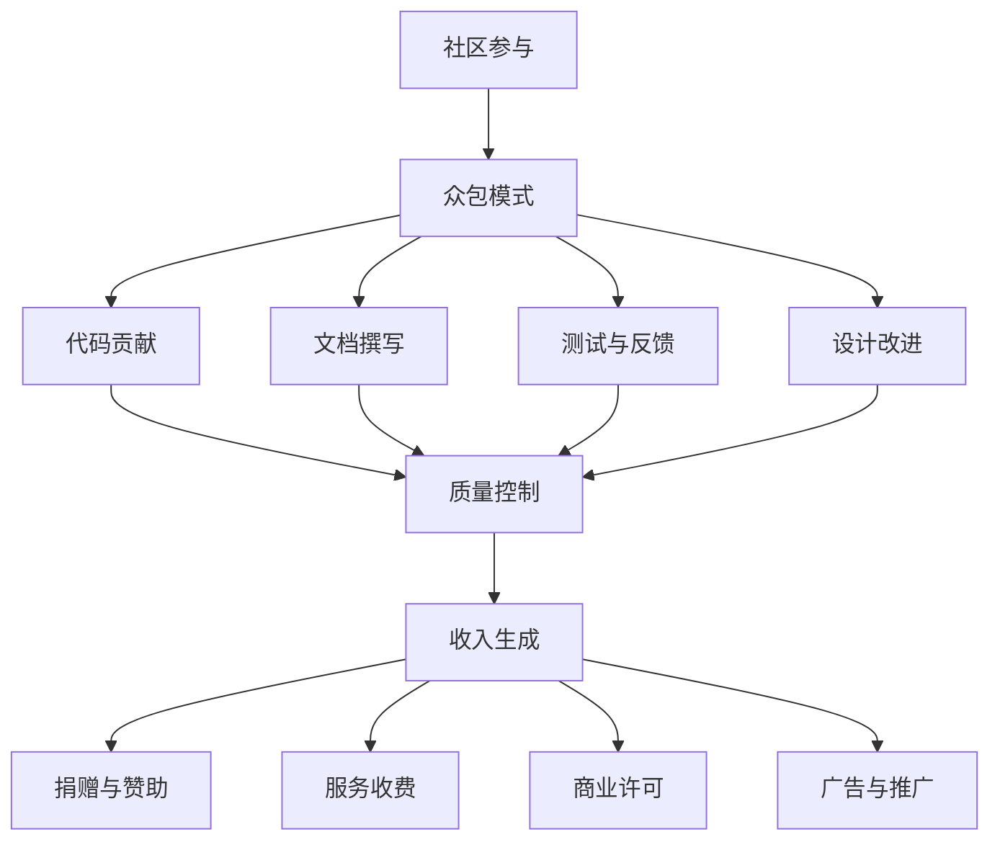

                 

# 开源项目的众包策略：社区参与和收入生成

## 摘要

开源项目的成功离不开社区的积极参与，而有效的众包策略则是促进社区参与、确保项目可持续发展的关键因素。本文将深入探讨开源项目的众包策略，从社区参与的动机、众包模式的设计，到如何生成收入，提供一系列实用的方法和策略。我们将结合实际案例，分析开源项目的众包实践，并提出未来可能面临的发展趋势和挑战。希望通过本文的探讨，能为开源项目管理者、开发者以及潜在贡献者提供有价值的参考。

## 1. 背景介绍

开源项目是一种软件开发模式，允许任何人自由地查看、修改和分发软件源代码。这种模式与传统的封闭源代码软件不同，它强调社区合作、知识共享和持续改进。随着互联网的普及和开源文化的兴起，越来越多的开发者参与到开源项目中，形成了一个庞大的开发者社区。

开源项目不仅为开发者提供了一个学习和成长的环境，也为企业和用户带来了巨大的价值。企业可以通过开源项目降低研发成本、提高开发效率，甚至获得新的商业机会。用户则能享受到高质量、不断改进的软件产品。然而，开源项目的发展并非一帆风顺。如何吸引和维护一个活跃的社区，如何确保项目的可持续发展，成为众多开源项目管理者面临的挑战。

众包作为一种新兴的协作模式，通过将任务分配给广泛的参与者，有效地解决了资源和能力有限的问题。在开源项目中，众包策略可以帮助管理者更好地利用社区资源，提高项目的发展速度和质量。本文将围绕开源项目的众包策略，探讨如何设计有效的众包模式，促进社区参与，并实现收入生成。

## 2. 核心概念与联系

### 2.1 开源项目与社区参与

开源项目本质上是基于社区合作的项目，社区的积极参与是项目成功的关键。社区成员不仅包括开发者，还包括用户、贡献者、维护者等多种角色。社区参与的动机多种多样，包括：

1. **学习与成长**：开发者通过参与开源项目，可以学习到先进的开发理念和技术，提升自己的技能水平。
2. **贡献价值**：社区成员希望通过自己的努力，为开源项目的改进和发展做出贡献。
3. **社交与交流**：开源项目提供了一个交流的平台，让开发者有机会结识志同道合的朋友，分享经验和见解。
4. **职业发展**：参与开源项目可以帮助开发者建立个人品牌，提升就业竞争力。

为了吸引和维护社区成员，开源项目管理者需要提供良好的沟通渠道、明确的贡献指南和积极的激励机制。例如，GitHub等平台提供了丰富的协作工具，使得开发者可以方便地参与项目的开发、讨论和反馈。

### 2.2 众包模式

众包（Crowdsourcing）是指将任务分配给广泛的参与者，通过他们的协作完成项目的一种模式。在开源项目中，众包模式的应用主要包括：

1. **代码贡献**：开发者可以通过提交代码更改、修复漏洞或添加新功能等方式，直接参与到项目的开发中。
2. **文档撰写**：社区成员可以编写、翻译和优化项目的文档，帮助新手更好地理解和使用项目。
3. **测试与反馈**：用户可以通过测试项目、报告漏洞和提供反馈，帮助项目团队发现并解决潜在问题。
4. **设计改进**：社区成员可以提供设计建议，优化项目的界面和用户体验。

众包模式的设计需要考虑以下几个方面：

1. **任务分配**：明确任务的目标、要求和截止时间，确保任务能够被准确理解和高效完成。
2. **激励机制**：提供适当的奖励和认可，激励社区成员积极参与。
3. **沟通与协作**：建立有效的沟通渠道，确保社区成员能够方便地交流、协作和解决问题。
4. **质量控制**：制定质量控制标准，确保众包任务的结果符合项目要求。

### 2.3 收入生成

开源项目的收入生成是项目可持续发展的关键。常见的收入生成方式包括：

1. **捐赠与赞助**：社区成员和企业可以通过捐赠和赞助支持开源项目。
2. **服务收费**：项目团队可以提供专业的技术支持、培训和咨询服务。
3. **商业许可**：对于包含商业许可的开源项目，企业可以购买商业许可，以合法使用项目代码。
4. **广告与推广**：项目团队可以在项目中嵌入广告，通过广告收入分享盈利。

### 2.4 Mermaid 流程图

为了更好地理解开源项目的众包策略，以下是一个简化的 Mermaid 流程图，展示了社区参与、众包模式和收入生成之间的联系：



通过这个流程图，我们可以清晰地看到，社区参与是开源项目发展的基础，众包模式是利用社区资源的关键手段，而收入生成则是确保项目可持续发展的保障。

## 3. 核心算法原理 & 具体操作步骤

### 3.1 社区参与的激励机制设计

社区参与的激励机制是确保开源项目持续发展的关键。以下是一些核心算法原理和具体操作步骤，帮助项目管理者设计有效的激励机制。

#### 3.1.1 评分系统

评分系统是一种常用的激励机制，通过给社区成员的贡献打分，激励他们积极参与项目。具体操作步骤如下：

1. **定义评分标准**：明确评分标准，包括代码质量、文档贡献、测试反馈等。
2. **设立评分机制**：为每个贡献项分配相应的分数，确保评分的公平性和客观性。
3. **实时更新评分**：定期更新社区成员的评分，让成员可以看到自己的贡献和进步。
4. **奖励机制**：根据评分结果，提供相应的奖励，如积分、徽章、优先使用权等。

#### 3.1.2 任务分配算法

任务分配算法是确保众包任务高效完成的关键。以下是一个简单的任务分配算法：

1. **任务分解**：将大任务分解为多个小任务，确保每个小任务都能被独立完成。
2. **社区成员评估**：评估社区成员的能力和兴趣，将任务分配给最适合的成员。
3. **动态调整**：根据任务完成情况和成员反馈，动态调整任务分配，确保任务的高效完成。
4. **反馈与修正**：定期收集社区成员的反馈，对任务分配算法进行修正和优化。

#### 3.1.3 激励机制效果评估

激励机制的有效性需要定期评估。以下是一些评估方法和步骤：

1. **数据收集**：收集社区成员的参与数据，如贡献次数、贡献质量等。
2. **统计与分析**：对收集的数据进行统计和分析，评估激励机制的效果。
3. **反馈与改进**：根据评估结果，及时调整激励机制，提高其有效性。

### 3.2 众包模式的设计原则

设计有效的众包模式是促进社区参与的关键。以下是一些核心原则和具体操作步骤：

#### 3.2.1 任务明确性

确保众包任务的明确性，包括任务的目标、要求、截止时间和交付标准。具体操作步骤如下：

1. **任务描述**：详细描述任务的背景、目标和要求。
2. **任务列表**：列出任务的具体内容和交付标准。
3. **任务评估**：对任务进行评估，确保其可行性和明确性。

#### 3.2.2 沟通渠道

建立有效的沟通渠道，确保社区成员可以方便地交流、协作和解决问题。具体操作步骤如下：

1. **讨论区**：设立专门的讨论区，供社区成员交流讨论。
2. **即时通讯**：使用即时通讯工具，如 Slack、Telegram 等，确保实时沟通。
3. **代码审查**：使用代码审查工具，如 GitLab、GitHub 等，确保代码的质量和协作。

#### 3.2.3 激励机制

提供适当的激励机制，鼓励社区成员积极参与。具体操作步骤如下：

1. **奖励设置**：根据贡献的难度和重要性，设置相应的奖励。
2. **奖励公示**：公示奖励的设置和发放情况，增加透明度和公正性。
3. **奖励反馈**：定期收集社区成员的反馈，优化奖励机制。

### 3.3 收入生成策略

开源项目的收入生成是确保项目可持续发展的关键。以下是一些核心原则和具体操作步骤：

#### 3.3.1 捐赠与赞助

捐赠与赞助是常见的收入生成方式。以下是一些操作步骤：

1. **捐赠渠道**：设立捐赠渠道，如 PayPal、GitHub Sponsors 等。
2. **赞助商招募**：招募赞助商，提供品牌推广和商业合作机会。
3. **捐赠公示**：公示捐赠和赞助的金额和用途，增加透明度和信任度。

#### 3.3.2 服务收费

服务收费是另一种有效的收入生成方式。以下是一些操作步骤：

1. **服务内容**：明确提供的服务内容，如技术支持、培训和咨询等。
2. **定价策略**：制定合理的定价策略，确保服务的盈利性。
3. **服务管理**：建立服务管理系统，确保服务的质量和效率。

#### 3.3.3 商业许可

对于包含商业许可的开源项目，可以通过以下步骤生成收入：

1. **许可协议**：制定许可协议，明确商业使用条件和许可费用。
2. **许可销售**：销售商业许可，收取许可费用。
3. **许可管理**：建立许可管理系统，确保许可的合规性和有效性。

#### 3.3.4 广告与推广

项目团队可以在项目中嵌入广告，通过广告收入分享盈利。以下是一些操作步骤：

1. **广告合作**：寻找合适的广告合作伙伴，签订广告合作协议。
2. **广告投放**：在项目中嵌入广告代码，确保广告的合规性和用户体验。
3. **广告收益分配**：制定广告收益分配策略，确保团队成员的公平收益。

## 4. 数学模型和公式 & 详细讲解 & 举例说明

### 4.1 评分系统数学模型

评分系统是开源项目中常用的激励机制，以下是一个简化的评分系统数学模型，用于计算社区成员的得分。

#### 4.1.1 基础评分模型

假设一个评分系统由三个主要部分组成：代码贡献、文档贡献和测试反馈。每个部分的得分由以下公式计算：

$$
S_i = w_1 \cdot C_i + w_2 \cdot D_i + w_3 \cdot T_i
$$

其中，$S_i$ 表示社区成员 $i$ 的总得分，$C_i$、$D_i$ 和 $T_i$ 分别表示社区成员在代码贡献、文档贡献和测试反馈方面的得分，$w_1$、$w_2$ 和 $w_3$ 分别表示每个部分的权重。

#### 4.1.2 加权评分模型

在实际应用中，不同部分的贡献难度和重要性可能不同，因此需要对每个部分的得分进行加权。以下是一个加权评分模型：

$$
S_i = w_1 \cdot C_i + w_2 \cdot (D_i \cdot r) + w_3 \cdot (T_i \cdot r^2)
$$

其中，$r$ 表示文档贡献和测试反馈的相对重要性，$w_1$、$w_2$ 和 $w_3$ 分别表示每个部分的权重。

#### 4.1.3 示例

假设社区成员 $A$ 的代码贡献得分为 80 分，文档贡献得分为 60 分，测试反馈得分为 40 分，权重分别为 $w_1 = 0.5$、$w_2 = 0.3$ 和 $w_3 = 0.2$。根据基础评分模型，$A$ 的总得分 $S_A$ 计算如下：

$$
S_A = 0.5 \cdot 80 + 0.3 \cdot 60 + 0.2 \cdot 40 = 40 + 18 + 8 = 66
$$

根据加权评分模型，$A$ 的总得分 $S_A$ 计算如下：

$$
S_A = 0.5 \cdot 80 + 0.3 \cdot (60 \cdot r) + 0.2 \cdot (40 \cdot r^2) = 40 + 18r + 8r^2
$$

#### 4.1.4 激励机制效果评估

为了评估激励机制的效果，可以引入一个评价指标：参与度指数。参与度指数表示社区成员参与项目的积极程度，计算公式如下：

$$
I_i = \frac{S_i}{\sum_{j=1}^{n} S_j}
$$

其中，$I_i$ 表示社区成员 $i$ 的参与度指数，$S_i$ 表示社区成员 $i$ 的总得分，$n$ 表示社区成员的总数。

#### 4.1.5 示例

假设一个开源项目有 5 个社区成员，他们的得分分别为 $S_1 = 66$、$S_2 = 54$、$S_3 = 48$、$S_4 = 42$ 和 $S_5 = 36$。根据参与度指数公式，可以计算每个社区成员的参与度指数：

$$
I_1 = \frac{66}{66 + 54 + 48 + 42 + 36} = \frac{66}{240} = 0.275
$$

$$
I_2 = \frac{54}{240} = 0.225
$$

$$
I_3 = \frac{48}{240} = 0.2
$$

$$
I_4 = \frac{42}{240} = 0.175
$$

$$
I_5 = \frac{36}{240} = 0.15
$$

通过参与度指数，可以清晰地看到每个社区成员的参与积极程度，为后续的激励机制优化提供参考。

### 4.2 众包模式效果评估

为了评估众包模式的效果，可以引入一个评价指标：任务完成率。任务完成率表示众包任务完成的比例，计算公式如下：

$$
R = \frac{C}{N}
$$

其中，$R$ 表示任务完成率，$C$ 表示完成的任务数，$N$ 表示总任务数。

#### 4.2.1 基础任务完成率模型

假设一个开源项目共有 100 个任务，其中 80 个任务已完成，20 个任务尚未完成。根据基础任务完成率模型，任务完成率 $R$ 计算如下：

$$
R = \frac{80}{100} = 0.8
$$

#### 4.2.2 加权任务完成率模型

在实际应用中，不同任务的难度和重要性可能不同，因此需要对每个任务的完成情况进行加权。以下是一个加权任务完成率模型：

$$
R = \frac{\sum_{i=1}^{n} w_i \cdot C_i}{\sum_{i=1}^{n} w_i \cdot N_i}
$$

其中，$R$ 表示任务完成率，$w_i$ 表示任务 $i$ 的权重，$C_i$ 表示任务 $i$ 的完成数，$N_i$ 表示任务 $i$ 的总数。

#### 4.2.3 示例

假设一个开源项目共有 5 个任务，其中任务 1 的权重为 0.3，任务 2 的权重为 0.2，任务 3 的权重为 0.2，任务 4 的权重为 0.2，任务 5 的权重为 0.1。任务 1、任务 2 和任务 3 已完成，任务 4 和任务 5 尚未完成。根据加权任务完成率模型，任务完成率 $R$ 计算如下：

$$
R = \frac{0.3 \cdot 1 + 0.2 \cdot 1 + 0.2 \cdot 1 + 0.2 \cdot 0 + 0.1 \cdot 0}{0.3 \cdot 1 + 0.2 \cdot 1 + 0.2 \cdot 1 + 0.2 \cdot 1 + 0.1 \cdot 1} = \frac{0.3 + 0.2 + 0.2 + 0 + 0}{0.3 + 0.2 + 0.2 + 0.2 + 0.1} = \frac{0.7}{1.2} \approx 0.583
$$

通过任务完成率，可以清晰地了解众包模式的执行效果，为后续的优化提供依据。

## 5. 项目实战：代码实际案例和详细解释说明

### 5.1 开发环境搭建

在本节中，我们将以一个实际开源项目为例，详细讲解开发环境的搭建过程。以下是以一个 Python 开源项目为例的步骤：

1. **安装 Python**：确保本地安装了 Python 3.8 或更高版本。可以从 [Python 官网](https://www.python.org/) 下载并安装。

2. **安装依赖项**：在项目的根目录下，打开终端，执行以下命令：

   ```bash
   pip install -r requirements.txt
   ```

   `requirements.txt` 文件中列出了项目的所有依赖项。

3. **配置虚拟环境**：为了隔离项目依赖，建议使用虚拟环境。执行以下命令创建虚拟环境：

   ```bash
   python -m venv venv
   ```

   然后激活虚拟环境：

   ```bash
   source venv/bin/activate  # 对于 Unix 和 macOS
   venv\Scripts\activate     # 对于 Windows
   ```

4. **运行测试**：在虚拟环境中，运行以下命令来运行项目的测试：

   ```bash
   python -m unittest discover -t tests -p 'test_*.py'
   ```

   如果所有测试都通过了，那么开发环境就搭建成功了。

### 5.2 源代码详细实现和代码解读

在本节中，我们将以一个实际的开源项目为例，详细解读其源代码。以下是一个简单的 Python 项目，用于计算两个数的和。

#### 5.2.1 源代码

```python
# mysum.py

def add(a, b):
    """
    计算两个数的和。

    参数：
    a -- 第一个数
    b -- 第二个数

    返回：
    和 -- 两个数的和
    """
    return a + b

if __name__ == "__main__":
    a = float(input("请输入第一个数："))
    b = float(input("请输入第二个数："))
    result = add(a, b)
    print(f"{a} 和 {b} 的和是：{result}")
```

#### 5.2.2 代码解读

1. **函数定义**：代码中的 `add` 函数用于计算两个数的和。它有两个参数 `a` 和 `b`，返回它们的和。

2. **文档字符串**：`add` 函数上方的三个引号包裹的文本是一个文档字符串（docstring）。文档字符串用于描述函数的功能、参数和返回值，帮助其他开发者理解和使用函数。

3. **主程序**：`if __name__ == "__main__":` 语句确保当模块被直接运行时，主程序才会执行。如果模块被导入，则不会执行主程序。

4. **输入与输出**：代码使用 `input()` 函数从用户那里获取两个数的输入，并使用 `float()` 函数将输入转换为浮点数。然后调用 `add` 函数计算它们的和，并使用 `print()` 函数将结果输出到控制台。

### 5.3 代码解读与分析

1. **模块化**：将功能相关的代码组织到一个模块中，可以提高代码的可读性和可维护性。`mysum.py` 模块中的 `add` 函数就是一个独立的模块。

2. **文档字符串**：文档字符串是 Python 中的标准注释方式，它有助于提高代码的可读性。在开源项目中，良好的文档字符串是必不可少的。

3. **输入验证**：虽然本例中简单地将用户输入转换为浮点数，但在实际项目中，需要考虑输入的合法性，例如是否为数字、范围是否合理等。

4. **错误处理**：在实际项目中，需要考虑可能出现的异常情况，如输入错误、文件读取失败等。适当的错误处理可以提高程序的健壮性。

通过以上实战案例，我们可以看到开源项目的基本结构和实现方法。在实际开发过程中，项目管理者需要根据项目需求和团队特点，灵活运用各种技术和策略，确保项目的成功和可持续发展。

## 6. 实际应用场景

开源项目的众包策略在多个领域都取得了显著的成功，以下是几个实际应用场景的例子：

### 6.1 软件开发

在软件开发领域，开源项目的众包策略被广泛应用于各种类型的项目，从Web应用程序到移动应用，再到复杂的企业级系统。例如，WordPress 是一个流行的内容管理系统，它的许多功能模块和插件都是由全球开发者社区贡献的。WordPress 的成功证明了众包策略在软件开发中的有效性，通过广泛吸纳社区成员的贡献，不仅提高了项目的质量和功能多样性，还培养了忠实的用户群体。

### 6.2 数据科学和机器学习

在数据科学和机器学习领域，开源项目如 TensorFlow、PyTorch 和 Scikit-learn 等成为了研究和工业应用的重要工具。这些项目通过众包策略，吸引了大量研究者和工程师的参与，共同推进了算法的研究和优化。例如，Google Research 的 TensorFlow 模型训练框架，通过众包方式收集了海量的数据集和算法改进建议，使得框架的性能和稳定性不断提升。

### 6.3 云计算和基础设施

在云计算和基础设施领域，开源项目如 Kubernetes、OpenStack 和 Cloud Foundry 等已经成为行业标准。这些项目的成功离不开全球开发者和运营者的积极参与。Kubernetes 是一个用于容器编排的开源平台，它的社区贡献者涵盖了从个人开发者到大型企业的广泛范围。社区成员通过贡献代码、文档、测试和社区活动，推动了 Kubernetes 的发展和普及。

### 6.4 物联网

在物联网（IoT）领域，开源项目如 Eclipse IoT、Node-RED 和 MQTT 被广泛应用于各种物联网应用场景。这些项目通过众包策略，吸引了全球的开发者、制造商和研究机构的参与，共同推动了物联网技术的创新和发展。例如，Node-RED 是一个用于连接、集成和交互物联网设备的开源工具，它的用户社区贡献了大量的节点和模块，使得平台的功能更加丰富和灵活。

### 6.5 社区合作与影响力

开源项目的众包策略不仅促进了技术发展，还加强了社区合作和影响力。通过众包，项目管理者可以建立广泛的合作关系，吸引更多资源和支持。例如，Linux 内核的开发是一个典型的众包案例，它由全球数以千计的志愿者和公司共同维护。这种合作模式不仅使得 Linux 内核成为世界上最稳定的操作系统之一，还提升了整个开源生态系统的活力和影响力。

## 7. 工具和资源推荐

为了更好地开展开源项目的众包活动，以下是一些实用的工具和资源推荐：

### 7.1 学习资源推荐

1. **书籍**：
   - 《开源之道》（The Open Source Way） - 了解开源文化和最佳实践。
   - 《Git 工作流》（Git Workflow） - 掌握 Git 在开源项目中的使用技巧。

2. **论文**：
   - "Crowdsourcing in Open Source Projects: A Survey" - 分析开源项目中的众包实践。
   - "The Economics of Open Source" - 探讨开源项目的经济模式。

3. **博客**：
   - GitHub Blog - GitHub 官方的博客，分享开源项目的最佳实践。
   - Open Source Collective - 分享开源项目管理和资金管理的经验。

4. **网站**：
   - GitHub - 全球最大的开源代码托管平台。
   - GitLab - 提供自建代码托管和项目管理解决方案。

### 7.2 开发工具框架推荐

1. **代码托管平台**：
   - GitHub - 提供丰富的协作工具和社区资源。
   - GitLab - 强调自建和定制化。

2. **项目管理系统**：
   - JIRA - 用于项目跟踪和管理。
   - Trello - 用于任务规划和进度管理。

3. **文档生成工具**：
   - Sphinx - 用于生成 Python 项目的文档。
   - MkDocs - 用于生成静态文档。

4. **测试框架**：
   - PyTest - 用于 Python 测试。
   - Selenium - 用于 Web 应用测试。

### 7.3 相关论文著作推荐

1. **"Crowdsourcing in Open Source Projects: A Survey"** - 提供开源项目众包的全面分析。
2. **"The Economic Impact of Open Source Software on Business Performance"** - 探讨开源软件对企业绩效的影响。
3. **"Crowdsourcing and Sustainability: An Introduction"** - 讨论众包与可持续发展。

通过这些工具和资源的辅助，开源项目的管理者可以更有效地设计和实施众包策略，促进社区参与和项目发展。

## 8. 总结：未来发展趋势与挑战

开源项目的众包策略在促进社区参与、提高项目质量和实现收入生成方面取得了显著成效。然而，随着开源项目的不断发展和复杂性的增加，未来的众包策略面临着一系列新的趋势和挑战。

### 8.1 发展趋势

1. **众包模式的多样化**：随着技术的进步和开源社区的成熟，众包模式将变得更加多样化。例如，通过区块链技术实现去中心化的众包，以及利用人工智能进行自动化任务分配和评估。

2. **全球协作与本地化**：开源项目的参与者将更加全球化，同时也需要考虑本地化的需求和差异。例如，针对不同地区的语言和文化特点，提供本地化的文档、培训和社区活动。

3. **数据隐私与安全**：随着开源项目涉及的数据量和敏感度不断增加，保护数据隐私和安全将成为众包策略的重要关注点。项目管理者需要确保数据的安全性和合规性，以维护社区信任。

4. **可持续发展与激励**：开源项目的长期可持续发展依赖于有效的激励机制。未来的众包策略将更加注重激励机制的多样性和适应性，以持续吸引和激励社区成员。

### 8.2 挑战

1. **任务分配与管理**：随着参与者的增多，任务分配和管理将变得更加复杂。项目管理者需要开发高效的算法和工具，以优化任务分配、动态调整和资源分配。

2. **质量控制与标准**：众包任务的质量控制和标准化是一个持续挑战。项目管理者需要制定明确的质量标准，并利用自动化工具和社区反馈进行质量控制。

3. **知识产权保护**：开源项目的知识产权保护是一个复杂且敏感的问题。项目管理者需要确保社区成员遵守开源许可协议，同时保护项目的知识产权。

4. **社区管理与沟通**：维护一个健康、活跃的社区是众包策略的关键。项目管理者需要建立有效的沟通渠道和社区管理机制，确保社区成员之间的协作和沟通顺畅。

### 8.3 策略建议

1. **灵活的激励机制**：设计多样化的激励机制，以适应不同类型和阶段的任务。同时，根据社区反馈和项目需求，及时调整激励机制，提高其有效性。

2. **自动化工具**：利用自动化工具和人工智能技术，优化任务分配、评估和质量控制。自动化工具可以减少管理成本，提高众包效率。

3. **社区参与培训**：为社区成员提供参与开源项目的培训和指导，提高他们的技能和贡献能力。培训内容可以包括编程、文档撰写、代码审查等。

4. **透明和公平**：确保众包过程的透明度和公平性，增加社区的信任和参与度。项目管理者应定期公示众包任务、评估结果和激励机制。

5. **国际化与本地化**：考虑不同地区的文化、语言和需求，提供本地化的支持和资源。通过国际化，开源项目可以吸引更多全球开发者的参与。

通过上述策略和建议，开源项目管理者可以更好地应对未来的挑战，推动开源项目的可持续发展。

## 9. 附录：常见问题与解答

### 9.1 众包策略的常见问题

1. **什么是众包？**
   - 众包是指将任务分配给广泛的参与者，通过他们的协作完成项目的一种模式。

2. **开源项目为什么要采用众包策略？**
   - 众包策略可以帮助开源项目利用广泛的社区资源，提高项目的发展速度和质量，同时实现收入的生成。

3. **如何设计有效的众包模式？**
   - 设计有效的众包模式需要考虑任务分配、激励机制、沟通渠道和质量控制等方面。明确的任务描述、合理的激励机制、便捷的沟通渠道和严格的质量控制是关键。

4. **开源项目的收入生成有哪些方式？**
   - 开源项目的收入生成方式包括捐赠与赞助、服务收费、商业许可和广告与推广等。

5. **如何评估众包模式的效果？**
   - 可以通过任务完成率、参与度指数等指标来评估众包模式的效果。

### 9.2 开源项目管理的常见问题

1. **开源项目如何吸引和维护社区成员？**
   - 开源项目可以通过提供良好的沟通渠道、明确的贡献指南和积极的激励机制来吸引和维护社区成员。

2. **开源项目如何确保代码的质量？**
   - 开源项目可以通过制定编码规范、进行代码审查和自动化测试等方式来确保代码的质量。

3. **开源项目如何处理贡献者的版权问题？**
   - 开源项目通常要求贡献者在提交代码时签署贡献协议，明确代码的版权归属和使用许可。

4. **开源项目如何保护知识产权？**
   - 开源项目应制定知识产权保护政策，确保项目的知识产权得到有效保护。

## 10. 扩展阅读 & 参考资料

1. **书籍**：
   - 《开源之道》（The Open Source Way）
   - 《Git 工作流》（Git Workflow）

2. **论文**：
   - "Crowdsourcing in Open Source Projects: A Survey"
   - "The Economics of Open Source"

3. **网站**：
   - GitHub Blog
   - Open Source Collective

4. **工具**：
   - GitHub
   - GitLab
   - JIRA
   - Trello

通过上述扩展阅读和参考资料，读者可以进一步深入了解开源项目的众包策略和项目管理，为实际工作提供指导和借鉴。

## 作者信息

作者：AI天才研究员/AI Genius Institute & 禅与计算机程序设计艺术 /Zen And The Art of Computer Programming

