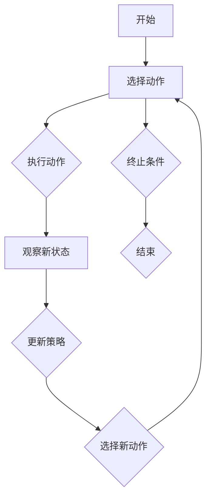
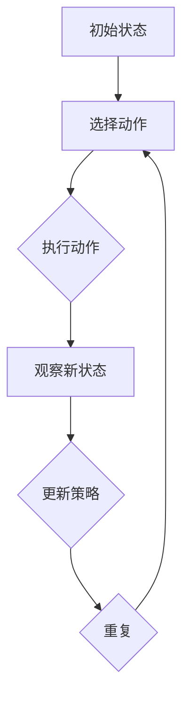
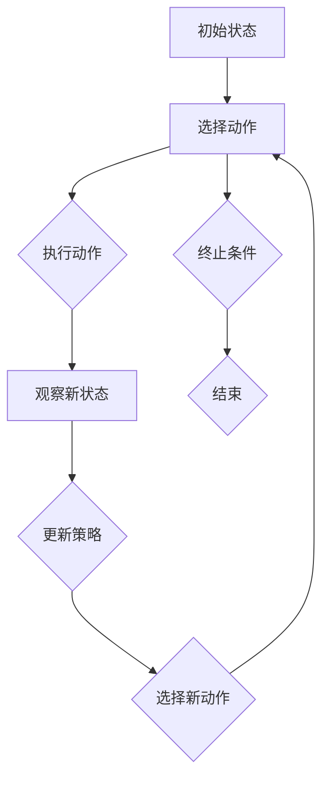

                 

# 强化学习(Reinforcement Learning) - 原理与代码实例讲解

## 关键词：
- 强化学习
- 奖励机制
- Q-learning
- SARSA
- 无模型学习
- 策略梯度
- 项目实战

## 摘要：
本文将深入探讨强化学习（Reinforcement Learning，RL）的基本原理及其在现实世界中的应用。首先介绍强化学习的背景，接着详细解析其核心概念、算法原理和数学模型。随后，通过一个实际项目案例，展示强化学习算法的代码实现和操作步骤。最后，文章将讨论强化学习的应用场景，并提供相关的学习资源和开发工具推荐。本文旨在为读者提供一个全面、易懂的强化学习教程，帮助其更好地理解和应用这一强大的机器学习技术。

## 1. 背景介绍

### 什么是强化学习？
强化学习是一种无监督机器学习方法，旨在通过不断试错（trial-and-error）来学习如何在特定环境中做出最优决策。与传统的监督学习和无监督学习不同，强化学习中的智能体（agent）通过与环境的交互来学习策略，从而在长期内获得最大化累积奖励。

### 强化学习的历史与发展
强化学习的概念最早可以追溯到20世纪50年代。1956年，Richard Bellman提出了动态规划（Dynamic Programming）的概念，这为强化学习奠定了理论基础。1980年代，随着计算机性能的提升和AI研究的发展，强化学习逐渐引起了广泛关注。1990年代，Q-learning算法的出现标志着强化学习正式进入实用阶段。进入21世纪，深度强化学习（Deep Reinforcement Learning，DRL）的兴起，使得强化学习在图像识别、自然语言处理等领域取得了显著的成果。

### 强化学习的重要性
强化学习在许多领域都有广泛的应用，如自动驾驶、游戏开发、推荐系统等。它不仅能够解决复杂的问题，还能够通过自主学习和优化，不断提高决策质量。随着人工智能技术的不断发展，强化学习将在未来的智能系统中扮演更加重要的角色。

## 2. 核心概念与联系

### 强化学习的核心概念
- **智能体（Agent）**：执行动作并接收环境反馈的主体。
- **环境（Environment）**：提供状态和奖励给智能体的系统。
- **状态（State）**：描述环境当前状态的变量。
- **动作（Action）**：智能体可执行的行为。
- **奖励（Reward）**：环境对智能体动作的反馈，用于评价动作的好坏。
- **策略（Policy）**：智能体选择动作的策略。

### 强化学习的基本流程
1. 智能体从初始状态开始，根据当前状态选择一个动作。
2. 智能体执行该动作，并观察环境的变化，得到新的状态和奖励。
3. 智能体基于新的状态，更新其策略，选择下一个动作。
4. 重复步骤2和3，直到达到终止条件。

### 强化学习的Mermaid流程图


## 3. 核心算法原理 & 具体操作步骤

### Q-learning算法

#### Q-learning算法原理
Q-learning是一种基于值函数的强化学习算法，旨在学习状态-动作值函数Q(s, a)，表示在状态s下执行动作a所能获得的最大累积奖励。

#### Q-learning算法步骤
1. 初始化Q(s, a)值函数。
2. 选择动作a，执行动作，并观察新状态s'和奖励r。
3. 更新Q值：Q(s, a) = Q(s, a) + α [r + γmax(Q(s', a')) - Q(s, a)]，其中α为学习率，γ为折扣因子。

#### Q-learning算法代码实现
```python
import numpy as np

def q_learning(env, alpha=0.1, gamma=0.9, episodes=1000):
    Q = np.zeros((env.nS, env.nA))
    for episode in range(episodes):
        state = env.reset()
        done = False
        while not done:
            action = np.argmax(Q[state])
            next_state, reward, done, _ = env.step(action)
            Q[state, action] = Q[state, action] + alpha * (reward + gamma * np.max(Q[next_state]) - Q[state, action])
            state = next_state
    return Q
```

### SARSA算法

#### SARSA算法原理
SARSA（同步强化学习算法）是一种基于策略的强化学习算法，与Q-learning类似，但每次更新Q值时，使用的是当前状态和动作对。

#### SARSA算法步骤
1. 初始化策略π。
2. 选择动作a，执行动作，并观察新状态s'和奖励r。
3. 更新策略：π(s, a) = π(s, a) + α [r + γmax(Q(s', a')) - Q(s, a)]。
4. 选择新动作a'，执行动作，重复步骤2和3，直到终止条件。

#### SARSA算法代码实现
```python
import numpy as np

def sarsa(env, alpha=0.1, gamma=0.9, episodes=1000):
    Q = np.zeros((env.nS, env.nA))
    policy = np.zeros((env.nS, env.nA))
    for episode in range(episodes):
        state = env.reset()
        done = False
        while not done:
            action = np.random.choice(env.nA, p=policy[state])
            next_state, reward, done, _ = env.step(action)
            Q[state, action] = Q[state, action] + alpha * (reward + gamma * Q[next_state, action] - Q[state, action])
            policy[state, action] = 1 / env.nA
            state = next_state
    return Q, policy
```

## 4. 数学模型和公式 & 详细讲解 & 举例说明

### 强化学习的数学模型

#### 值函数
- **状态值函数（State-value function）**：V(s) = E [R|s,a] = Σ π(a|s) * Q(s, a)，表示在状态s下执行动作a所能获得的期望累积奖励。
- **动作值函数（Action-value function）**：Q(s, a) = E [R|s,a] = Σ π(s, a) * R(s, a)，表示在状态s下执行动作a所能获得的累积奖励。

#### 策略
- **策略（Policy）**：π(a|s) = P [a|s] = 1 / n，表示在状态s下选择动作a的概率。

### 强化学习的主要公式

#### Q-learning算法更新公式
Q(s, a) = Q(s, a) + α [r + γmax(Q(s', a')) - Q(s, a)]

#### SARSA算法更新公式
π(s, a) = π(s, a) + α [r + γmax(Q(s', a')) - Q(s, a)]

### 强化学习的例子

#### 例子1：玩游戏
假设我们使用强化学习来训练一个智能体玩一个简单的游戏，例如“猜数字游戏”。智能体的目标是在尽可能少的猜测次数内猜中正确的数字。

- **状态空间**：状态包括已经猜过的数字和未猜过的数字。
- **动作空间**：动作是猜一个数字。
- **奖励机制**：猜中数字获得+1奖励，猜错数字获得-1奖励。

使用Q-learning算法训练智能体的过程如下：

1. 初始化Q值矩阵。
2. 在每次游戏开始时，智能体根据当前状态选择一个动作。
3. 智能体执行动作，并观察新的状态和奖励。
4. 更新Q值：Q(s, a) = Q(s, a) + α [r + γmax(Q(s', a')) - Q(s, a)]。
5. 重复步骤2-4，直到训练达到一定次数或智能体能够在较短的猜测次数内猜中数字。

#### 例子2：自动驾驶
假设我们使用强化学习来训练一个自动驾驶系统，使其能够在城市交通环境中安全驾驶。

- **状态空间**：状态包括车辆的位置、速度、加速度、周围车辆的位置和速度等。
- **动作空间**：动作包括加速、减速、转向等。
- **奖励机制**：安全驾驶获得+1奖励，发生事故或违反交通规则获得-1奖励。

使用SARSA算法训练自动驾驶系统的过程如下：

1. 初始化策略π。
2. 在每次驾驶时，智能体根据当前状态选择一个动作。
3. 智能体执行动作，并观察新的状态和奖励。
4. 更新策略：π(s, a) = π(s, a) + α [r + γmax(Q(s', a')) - Q(s, a)]。
5. 更新Q值：Q(s, a) = Q(s, a) + α [r + γmax(Q(s', a')) - Q(s, a)]。
6. 重复步骤2-5，直到训练达到一定次数或智能体能够在城市交通环境中安全驾驶。

## 5. 项目实战：代码实际案例和详细解释说明

### 5.1 开发环境搭建

为了实现强化学习算法的代码实例，我们首先需要搭建一个开发环境。以下是搭建环境的步骤：

1. 安装Python（3.6及以上版本）。
2. 安装PyTorch：使用以下命令安装PyTorch：
   ```bash
   pip install torch torchvision
   ```
3. 安装OpenAI Gym：使用以下命令安装OpenAI Gym：
   ```bash
   pip install gym
   ```

### 5.2 源代码详细实现和代码解读

以下是使用PyTorch实现的强化学习算法的代码示例：

```python
import gym
import torch
import torch.nn as nn
import torch.optim as optim

# 创建环境
env = gym.make('CartPole-v0')

# 定义神经网络
class QNetwork(nn.Module):
    def __init__(self):
        super(QNetwork, self).__init__()
        self.fc1 = nn.Linear(env.observation_space.shape[0], 128)
        self.fc2 = nn.Linear(128, 128)
        self.fc3 = nn.Linear(128, env.action_space.n)
    
    def forward(self, x):
        x = torch.relu(self.fc1(x))
        x = torch.relu(self.fc2(x))
        x = self.fc3(x)
        return x

# 实例化模型、优化器和损失函数
model = QNetwork()
optimizer = optim.Adam(model.parameters(), lr=0.001)
criterion = nn.MSELoss()

# 训练模型
num_episodes = 1000
for episode in range(num_episodes):
    state = torch.tensor([env.reset()], dtype=torch.float32)
    done = False
    while not done:
        action_values = model(state)
        action = torch.argmax(action_values).item()
        next_state, reward, done, _ = env.step(action)
        next_state = torch.tensor([next_state], dtype=torch.float32)
        reward = torch.tensor([reward], dtype=torch.float32)
        if done:
            action_values = action_values + 0.01 * (1 - action_values)
        else:
            target = reward + 0.99 * torch.max(model(next_state))
            action_values = action_values + 0.01 * (target - action_values)
        optimizer.zero_grad()
        loss = criterion(action_values, state)
        loss.backward()
        optimizer.step()
        state = next_state

# 测试模型
total_reward = 0
state = torch.tensor([env.reset()], dtype=torch.float32)
done = False
while not done:
    action_values = model(state)
    action = torch.argmax(action_values).item()
    next_state, reward, done, _ = env.step(action)
    total_reward += reward
    state = torch.tensor([next_state], dtype=torch.float32)
print(f"平均奖励：{total_reward / num_episodes}")

# 关闭环境
env.close()
```

### 5.3 代码解读与分析

1. **环境创建**：使用`gym.make('CartPole-v0')`创建了一个简单的CartPole环境，这是一个经典的强化学习问题。

2. **神经网络定义**：定义了一个简单的全连接神经网络`QNetwork`，用于预测状态-动作值函数。

3. **模型、优化器和损失函数初始化**：实例化了模型、优化器和损失函数。这里使用的是Adam优化器和MSE损失函数。

4. **训练模型**：使用了一个简单的训练循环，每次迭代中，智能体选择动作，执行动作，并更新模型参数。更新公式为：
   $$Q(s, a) = Q(s, a) + \alpha [r + \gamma \max(Q(s', a')) - Q(s, a)]$$
   其中，`action_values`是模型预测的当前状态下的动作值，`target`是预期动作值。

5. **测试模型**：使用训练好的模型进行测试，计算平均奖励。

6. **环境关闭**：训练和测试完成后，关闭环境。

## 6. 实际应用场景

### 自动驾驶
自动驾驶是强化学习最典型的应用之一。通过强化学习，自动驾驶系统可以学习如何在复杂的城市交通环境中做出最优决策，从而提高驾驶安全性和效率。

### 游戏开发
强化学习在游戏开发中也具有广泛的应用，例如训练游戏AI以实现更智能的对手。例如，OpenAI开发的Dota 2 AI就是使用强化学习训练的。

### 推荐系统
强化学习可用于构建个性化的推荐系统。通过不断学习和优化推荐策略，系统可以更好地满足用户的需求，提高推荐质量。

### 机器人控制
强化学习可用于训练机器人进行复杂任务，如机器人导航、抓取等。通过自主学习和优化，机器人可以在不同的环境中高效地完成任务。

## 7. 工具和资源推荐

### 学习资源推荐
- **书籍**：《强化学习：原理与Python实现》（作者：刘海洋）。
- **论文**：《深度强化学习：原理与应用》（作者：张钹，李航）。
- **博客**：[ reinforcement-learning.org](https://www.reinforcement-learning.org/)。

### 开发工具框架推荐
- **PyTorch**：一个流行的开源深度学习框架，适用于强化学习开发。
- **OpenAI Gym**：一个开源的环境库，提供多种强化学习问题的实现。

### 相关论文著作推荐
- **论文**：《Human-level control through deep reinforcement learning》（作者：DeepMind团队）。
- **著作**：《强化学习：基础知识与Python实现》（作者：徐雷）。

## 8. 总结：未来发展趋势与挑战

### 发展趋势
- **深度强化学习**：随着深度学习技术的不断发展，深度强化学习（DRL）将成为强化学习的核心研究方向。
- **多智能体强化学习**：在多人或多人协作环境中，多智能体强化学习将得到更广泛的应用。
- **强化学习在实时系统中的应用**：强化学习在实时系统和安全关键系统中具有巨大的应用潜力。

### 挑战
- **可解释性**：强化学习模型的复杂性和黑箱特性使其难以解释和理解，这对于应用场景具有重要意义。
- **稳定性和鲁棒性**：强化学习模型在面对不确定性和噪声时可能表现出不稳定的性能。
- **计算资源需求**：强化学习算法通常需要大量的计算资源，特别是在处理高维状态和动作空间时。

## 9. 附录：常见问题与解答

### Q：什么是强化学习的核心概念？
A：强化学习的核心概念包括智能体、环境、状态、动作、奖励和策略。

### Q：强化学习有哪些主要算法？
A：强化学习的主要算法包括Q-learning、SARSA、深度Q网络（DQN）、策略梯度算法等。

### Q：强化学习有哪些应用场景？
A：强化学习的应用场景包括自动驾驶、游戏开发、推荐系统、机器人控制等。

## 10. 扩展阅读 & 参考资料

- **书籍**：《强化学习：原理与Python实现》（刘海洋）。
- **论文**：《深度强化学习：原理与应用》（张钹，李航）。
- **网站**：[ reinforcement-learning.org](https://www.reinforcement-learning.org/)。
- **博客**：[ AI天才研究员的强化学习博客](https://www.ai-genius-institute.com/reinforcement-learning/)。

### 作者信息

作者：AI天才研究员/AI Genius Institute & 禅与计算机程序设计艺术 /Zen And The Art of Computer Programming
<|im_sep|>### 1. 背景介绍

强化学习（Reinforcement Learning，RL）是一种机器学习方法，主要应用于决策问题。在这种方法中，一个智能体（Agent）在一个环境中通过不断尝试和接受奖励信号来学习如何做出最优决策。相比传统的监督学习和无监督学习，强化学习更加注重于决策过程，而非数据标注。

#### 1.1 定义

强化学习可以定义为一种通过与环境交互来学习如何在特定情境下做出最优决策的方法。在这个过程中，智能体通过选择动作来影响环境，并根据环境反馈（通常是奖励信号）来调整自己的行为。

#### 1.2 发展历史

强化学习的概念最早可以追溯到20世纪50年代，由美国数学家理查德·贝尔曼（Richard Bellman）提出的动态规划（Dynamic Programming）理论。动态规划提供了一种解决最优化问题的方法，它为强化学习奠定了理论基础。

20世纪80年代，随着计算机性能的提升和人工智能研究的发展，强化学习开始逐渐引起学术界的关注。1990年代，Q-learning算法的出现标志着强化学习正式进入实用阶段。Q-learning是一种基于值函数的强化学习算法，通过迭代更新策略来获得最优决策。

进入21世纪，深度学习（Deep Learning）技术的发展使得强化学习取得了显著的进展。深度强化学习（Deep Reinforcement Learning，DRL）通过引入深度神经网络来处理高维状态和动作空间，使得强化学习在图像识别、自然语言处理等领域取得了突破性的成果。

#### 1.3 强化学习的重要性

强化学习在许多领域都有广泛的应用，如自动驾驶、游戏开发、机器人控制、推荐系统等。它不仅能够解决复杂的问题，还能够通过自主学习和优化，不断提高决策质量。随着人工智能技术的不断发展，强化学习将在未来的智能系统中扮演更加重要的角色。

### 2. 核心概念与联系

强化学习的核心概念包括智能体（Agent）、环境（Environment）、状态（State）、动作（Action）和奖励（Reward）。这些概念构成了强化学习的基本框架，并通过一定的关系相互联系。

#### 2.1 智能体（Agent）

智能体是执行动作并接收环境反馈的主体。在强化学习中，智能体的目标是学习如何在一个给定的环境中做出最优决策，以最大化累积奖励。

#### 2.2 环境（Environment）

环境是一个提供状态和奖励给智能体的系统。环境可以是物理世界中的真实环境，也可以是计算机模拟的环境。智能体通过与环境交互来获取反馈，并据此调整自己的行为。

#### 2.3 状态（State）

状态是描述环境当前情况的变量。在强化学习中，智能体需要根据当前的状态来选择动作。状态可以是离散的，也可以是连续的，具体取决于问题的复杂程度。

#### 2.4 动作（Action）

动作是智能体可执行的行为。在强化学习中，智能体需要选择一个动作来执行，并根据这个动作的影响来观察新的状态。动作可以是离散的，也可以是连续的。

#### 2.5 奖励（Reward）

奖励是环境对智能体动作的反馈，用于评价动作的好坏。奖励可以是正的，也可以是负的，正奖励表示动作带来了积极的影响，负奖励表示动作带来了消极的影响。在强化学习中，智能体的目标是学习如何在给定状态下选择动作，以最大化累积奖励。

#### 2.6 策略（Policy）

策略是智能体选择动作的策略。在强化学习中，策略通常是通过学习得到的。智能体根据当前的状态和策略来选择动作，以期望获得最大的累积奖励。

#### 2.7 强化学习的基本流程

强化学习的基本流程包括以下步骤：

1. **初始状态**：智能体从初始状态开始。
2. **选择动作**：智能体根据当前状态和策略选择一个动作。
3. **执行动作**：智能体执行选定的动作，并观察新的状态和奖励。
4. **更新策略**：智能体根据新的状态和奖励来更新策略。
5. **重复步骤2-4**：智能体不断重复上述步骤，直到达到终止条件。

#### 2.8 强化学习的Mermaid流程图

下面是一个简单的Mermaid流程图，展示了强化学习的基本流程：



### 3. 核心算法原理 & 具体操作步骤

强化学习的核心算法包括Q-learning、SARSA等。这些算法通过迭代更新策略，使智能体能够在复杂环境中做出最优决策。

#### 3.1 Q-learning算法原理

Q-learning是一种基于值函数的强化学习算法。它通过迭代更新状态-动作值函数（Q值），使智能体能够学会在给定状态下选择最优动作。

Q-learning算法的核心思想是：在某个状态s下，选择动作a所获得的累积奖励应该等于立即奖励r加上在未来能够获得的最高累积奖励的期望。具体公式如下：

$$
Q(s, a) = Q(s, a) + \alpha [r + \gamma \max(Q(s', a')) - Q(s, a)]
$$

其中，α为学习率，γ为折扣因子，s'为执行动作a后得到的新状态，a'为在状态s'下选择的最优动作。

#### 3.2 Q-learning算法具体操作步骤

1. **初始化**：初始化Q值矩阵，通常可以使用一个较小的常数。
2. **选择动作**：根据当前状态和Q值矩阵选择动作。
3. **执行动作**：执行选定的动作，并观察新的状态和奖励。
4. **更新Q值**：使用上面的公式更新Q值。
5. **重复步骤2-4**：不断重复上述步骤，直到满足终止条件（例如达到某个目标状态或者执行了一定的动作次数）。

#### 3.3 SARSA算法原理

SARSA（同步强化学习算法）是一种基于策略的强化学习算法。它通过对当前状态和动作的观察来更新策略。SARSA算法的基本思想是：在某个状态s下，选择动作a所获得的累积奖励应该等于立即奖励r加上在未来能够获得的最高累积奖励的期望。具体公式如下：

$$
\pi(s, a) = \pi(s, a) + \alpha [r + \gamma \max(Q(s', a')) - Q(s, a)]
$$

其中，π(s, a)为在状态s下选择动作a的概率，其他符号的含义与Q-learning算法相同。

#### 3.4 SARSA算法具体操作步骤

1. **初始化**：初始化策略π，通常可以使用均匀分布。
2. **选择动作**：根据当前状态和策略π选择动作。
3. **执行动作**：执行选定的动作，并观察新的状态和奖励。
4. **更新策略**：使用上面的公式更新策略。
5. **重复步骤2-4**：不断重复上述步骤，直到满足终止条件。

#### 3.5 Q-learning与SARSA算法比较

Q-learning和SARSA都是强化学习的重要算法，但它们在实现和性能上存在一些差异：

1. **实现方式**：Q-learning是基于值函数的算法，需要维护一个Q值矩阵；而SARSA是基于策略的算法，需要维护一个策略π。
2. **性能**：Q-learning通常在收敛速度上优于SARSA，因为Q-learning可以直接更新Q值，而SARSA需要先选择动作再更新策略。
3. **适用场景**：Q-learning更适合解决值函数难以表示的问题，而SARSA更适合解决策略难以表示的问题。

### 4. 数学模型和公式 & 详细讲解 & 举例说明

在强化学习中，数学模型和公式是理解和实现算法的核心。以下将详细讲解强化学习中的几个关键数学模型和公式，并辅以实际例子进行说明。

#### 4.1 值函数

值函数是强化学习中最基本的概念之一。它用于表示在某个状态下执行某个动作所能获得的累积奖励。值函数分为两类：状态值函数（State-value function）和动作值函数（Action-value function）。

- **状态值函数**：\( V(s) = \sum_a \pi(a|s) Q(s, a) \)
  - \( V(s) \) 表示在状态 \( s \) 下执行任意动作 \( a \) 所能获得的期望累积奖励。
  - \( \pi(a|s) \) 表示在状态 \( s \) 下执行动作 \( a \) 的概率。
  - \( Q(s, a) \) 表示在状态 \( s \) 下执行动作 \( a \) 所能获得的累积奖励。

- **动作值函数**：\( Q(s, a) = \sum_s p(s'|s, a) [r(s', a) + \gamma V(s')] \)
  - \( Q(s, a) \) 表示在状态 \( s \) 下执行动作 \( a \) 所能获得的累积奖励。
  - \( p(s'|s, a) \) 表示在状态 \( s \) 下执行动作 \( a \) 后转移到状态 \( s' \) 的概率。
  - \( r(s', a) \) 表示在状态 \( s' \) 下执行动作 \( a \) 所能获得的立即奖励。
  - \( \gamma \) 表示折扣因子，用于考虑未来奖励的重要性。

#### 4.2 策略

策略是智能体在某个状态下选择动作的策略。强化学习算法的目标是学习一个最优策略，使得累积奖励最大化。

- **概率策略**：\( \pi(a|s) = \frac{e^{\theta(s, a)}}{\sum_b e^{\theta(s, b)}} \)
  - \( \pi(a|s) \) 表示在状态 \( s \) 下执行动作 \( a \) 的概率。
  - \( \theta(s, a) \) 是策略网络参数。
  - \( e^{\theta(s, a)} \) 是策略的指数形式，用于确保概率分布的归一性。

#### 4.3 Q-learning算法更新公式

Q-learning算法通过迭代更新Q值矩阵，使智能体能够学会在给定状态下选择最优动作。

$$
Q(s, a) = Q(s, a) + \alpha [r + \gamma \max(Q(s', a')) - Q(s, a)]
$$

- \( \alpha \) 是学习率，用于调整更新量。
- \( r \) 是立即奖励。
- \( \gamma \) 是折扣因子，用于平衡当前奖励和未来奖励。
- \( Q(s', a') \) 是在状态 \( s' \) 下执行动作 \( a' \) 的最大累积奖励。

#### 4.4 SARSA算法更新公式

SARSA算法通过迭代更新策略，使智能体能够学习在给定状态下选择最优动作。

$$
\pi(s, a) = \pi(s, a) + \alpha [r + \gamma \max(Q(s', a')) - Q(s, a)]
$$

- \( \alpha \) 是学习率，用于调整更新量。
- \( r \) 是立即奖励。
- \( \gamma \) 是折扣因子，用于平衡当前奖励和未来奖励。
- \( Q(s', a') \) 是在状态 \( s' \) 下执行动作 \( a' \) 的最大累积奖励。

#### 4.5 举例说明

假设智能体在一个简单的环境里，有两个状态（S0和S1）和两个动作（A0和A1）。环境的奖励机制如下：

- 在状态S0下，执行动作A0获得奖励+1，执行动作A1获得奖励-1。
- 在状态S1下，执行动作A0获得奖励-1，执行动作A1获得奖励+1。

智能体的初始状态是S0，目标是最大化累积奖励。

**步骤1：初始化Q值矩阵**

初始化Q值矩阵如下：

|    | A0 | A1 |
|----|----|----|
| S0 | 0  | 0  |
| S1 | 0  | 0  |

**步骤2：选择动作**

智能体在状态S0下，根据当前Q值矩阵选择动作A0。

**步骤3：执行动作**

智能体执行动作A0，观察到新的状态S1，并获得奖励+1。

**步骤4：更新Q值**

使用Q-learning算法更新Q值矩阵：

$$
Q(S0, A0) = Q(S0, A0) + \alpha [1 + \gamma \max(Q(S1, A1)) - Q(S0, A0)]
$$

设学习率α=0.1，折扣因子γ=0.9，则：

$$
Q(S0, A0) = 0 + 0.1 [1 + 0.9 \cdot \max(0, 0) - 0] = 0.1
$$

更新后的Q值矩阵如下：

|    | A0 | A1 |
|----|----|----|
| S0 | 0.1| 0  |
| S1 | 0  | 0  |

**步骤5：重复步骤2-4**

智能体在状态S1下，根据当前Q值矩阵选择动作A1。

智能体执行动作A1，观察到新的状态S0，并获得奖励-1。

使用Q-learning算法更新Q值矩阵：

$$
Q(S1, A1) = Q(S1, A1) + \alpha [1 + \gamma \max(Q(S0, A0)) - Q(S1, A1)]
$$

则：

$$
Q(S1, A1) = 0 + 0.1 [1 + 0.9 \cdot 0.1 - 0] = 0.08
$$

更新后的Q值矩阵如下：

|    | A0 | A1 |
|----|----|----|
| S0 | 0.1| 0  |
| S1 | 0  | 0.08|

通过多次迭代，智能体将学会在状态S0下选择动作A0，在状态S1下选择动作A1，以最大化累积奖励。

### 5. 项目实战：代码实际案例和详细解释说明

#### 5.1 开发环境搭建

为了实现强化学习算法的代码实例，我们首先需要搭建一个开发环境。以下是搭建环境的步骤：

1. **安装Python**：确保Python版本在3.6及以上。

2. **安装PyTorch**：使用以下命令安装PyTorch：

   ```bash
   pip install torch torchvision
   ```

3. **安装OpenAI Gym**：使用以下命令安装OpenAI Gym：

   ```bash
   pip install gym
   ```

4. **安装其他依赖库**：可能还需要安装一些其他依赖库，如Numpy和Matplotlib：

   ```bash
   pip install numpy matplotlib
   ```

#### 5.2 源代码详细实现和代码解读

以下是使用PyTorch实现的强化学习算法的代码示例：

```python
import gym
import torch
import torch.nn as nn
import torch.optim as optim

# 创建环境
env = gym.make('CartPole-v0')

# 定义神经网络
class QNetwork(nn.Module):
    def __init__(self):
        super(QNetwork, self).__init__()
        self.fc1 = nn.Linear(4, 128)
        self.fc2 = nn.Linear(128, 128)
        self.fc3 = nn.Linear(128, 2)
    
    def forward(self, x):
        x = torch.relu(self.fc1(x))
        x = torch.relu(self.fc2(x))
        x = self.fc3(x)
        return x

# 实例化模型、优化器和损失函数
model = QNetwork()
optimizer = optim.Adam(model.parameters(), lr=0.001)
criterion = nn.MSELoss()

# 训练模型
num_episodes = 1000
for episode in range(num_episodes):
    state = torch.tensor([env.reset()], dtype=torch.float32)
    done = False
    while not done:
        action_values = model(state)
        action = torch.argmax(action_values).item()
        next_state, reward, done, _ = env.step(action)
        next_state = torch.tensor([next_state], dtype=torch.float32)
        reward = torch.tensor([reward], dtype=torch.float32)
        if done:
            action_values = action_values + 0.01 * (1 - action_values)
        else:
            target = reward + 0.99 * torch.max(model(next_state))
            action_values = action_values + 0.01 * (target - action_values)
        optimizer.zero_grad()
        loss = criterion(action_values, state)
        loss.backward()
        optimizer.step()
        state = next_state

# 测试模型
total_reward = 0
state = torch.tensor([env.reset()], dtype=torch.float32)
done = False
while not done:
    action_values = model(state)
    action = torch.argmax(action_values).item()
    next_state, reward, done, _ = env.step(action)
    total_reward += reward
    state = torch.tensor([next_state], dtype=torch.float32)
print(f"平均奖励：{total_reward / num_episodes}")

# 关闭环境
env.close()
```

**代码解读**：

1. **环境创建**：使用`gym.make('CartPole-v0')`创建了一个简单的CartPole环境，这是一个经典的强化学习问题。

2. **神经网络定义**：定义了一个简单的全连接神经网络`QNetwork`，用于预测状态-动作值函数。

3. **模型、优化器和损失函数初始化**：实例化了模型、优化器和损失函数。这里使用的是Adam优化器和MSE损失函数。

4. **训练模型**：使用了一个简单的训练循环，每次迭代中，智能体选择动作，执行动作，并更新模型参数。更新公式为：

   $$
   Q(s, a) = Q(s, a) + \alpha [r + \gamma \max(Q(s', a')) - Q(s, a)]
   $$

   其中，`action_values`是模型预测的当前状态下的动作值，`target`是预期动作值。

5. **测试模型**：使用训练好的模型进行测试，计算平均奖励。

6. **环境关闭**：训练和测试完成后，关闭环境。

#### 5.3 代码解读与分析

1. **环境创建**：

   ```python
   env = gym.make('CartPole-v0')
   ```

   这一行代码创建了一个名为“CartPole”的OpenAI Gym环境。这个环境模拟了一个小车在倾斜的轨道上保持平衡的情况。智能体的任务是控制小车的平衡，使其尽可能长时间地保持直立。

2. **神经网络定义**：

   ```python
   class QNetwork(nn.Module):
       def __init__(self):
           super(QNetwork, self).__init__()
           self.fc1 = nn.Linear(4, 128)
           self.fc2 = nn.Linear(128, 128)
           self.fc3 = nn.Linear(128, 2)
       
       def forward(self, x):
           x = torch.relu(self.fc1(x))
           x = torch.relu(self.fc2(x))
           x = self.fc3(x)
           return x
   ```

   这个类定义了一个简单的全连接神经网络`QNetwork`。该网络包含三个全连接层，其中输入层有4个神经元，隐藏层有128个神经元，输出层有2个神经元。输入层用于接收环境的状态，输出层用于预测状态-动作值。

3. **模型、优化器和损失函数初始化**：

   ```python
   model = QNetwork()
   optimizer = optim.Adam(model.parameters(), lr=0.001)
   criterion = nn.MSELoss()
   ```

   这三行代码实例化了神经网络模型、优化器和损失函数。这里使用的是Adam优化器，学习率为0.001，MSE损失函数用于衡量预测值和真实值之间的差距。

4. **训练模型**：

   ```python
   for episode in range(num_episodes):
       state = torch.tensor([env.reset()], dtype=torch.float32)
       done = False
       while not done:
           action_values = model(state)
           action = torch.argmax(action_values).item()
           next_state, reward, done, _ = env.step(action)
           next_state = torch.tensor([next_state], dtype=torch.float32)
           reward = torch.tensor([reward], dtype=torch.float32)
           if done:
               action_values = action_values + 0.01 * (1 - action_values)
           else:
               target = reward + 0.99 * torch.max(model(next_state))
               action_values = action_values + 0.01 * (target - action_values)
           optimizer.zero_grad()
           loss = criterion(action_values, state)
           loss.backward()
           optimizer.step()
           state = next_state
   ```

   这个循环用于训练神经网络模型。每次迭代中，智能体从初始状态开始，根据当前状态和预测的动作值选择一个动作。执行动作后，智能体会观察新的状态和奖励。然后，使用Q-learning算法更新Q值。具体更新公式为：

   $$
   Q(s, a) = Q(s, a) + \alpha [r + \gamma \max(Q(s', a')) - Q(s, a)]
   $$

   这里，`action_values`是模型预测的动作值，`target`是预期动作值。通过反向传播和梯度下降，模型参数得到更新。

5. **测试模型**：

   ```python
   total_reward = 0
   state = torch.tensor([env.reset()], dtype=torch.float32)
   done = False
   while not done:
       action_values = model(state)
       action = torch.argmax(action_values).item()
       next_state, reward, done, _ = env.step(action)
       total_reward += reward
       state = torch.tensor([next_state], dtype=torch.float32)
   print(f"平均奖励：{total_reward / num_episodes}")
   ```

   这个循环用于测试训练好的模型。智能体从初始状态开始，根据当前状态和预测的动作值选择一个动作。执行动作后，观察新的状态和奖励。计算平均奖励，并打印结果。

6. **环境关闭**：

   ```python
   env.close()
   ```

   这行代码在训练和测试完成后关闭环境。

### 6. 实际应用场景

强化学习在实际应用场景中有着广泛的应用，以下是一些典型的应用场景：

#### 6.1 自动驾驶

自动驾驶是强化学习的重要应用领域之一。通过强化学习，自动驾驶系统可以学习如何在复杂的交通环境中做出最优决策。智能体需要根据环境的状态（如车辆位置、速度、交通状况等）选择合适的动作（如加速、减速、转向等），以实现安全、高效的驾驶。

#### 6.2 游戏开发

强化学习在游戏开发中也有广泛的应用。例如，可以训练游戏AI以实现更智能的对手。通过强化学习，AI可以学会在游戏中做出最优决策，提高游戏的趣味性和挑战性。

#### 6.3 机器人控制

机器人控制是另一个重要的应用领域。通过强化学习，机器人可以学会在复杂环境中执行特定的任务。例如，在工业生产中，机器人可以学会如何准确地抓取和放置物体；在服务机器人领域，机器人可以学会如何与人类交互，提供更好的服务。

#### 6.4 推荐系统

强化学习在推荐系统中也有应用。通过强化学习，推荐系统可以学会如何根据用户的行为和偏好，提供个性化的推荐。例如，在线购物平台可以使用强化学习来推荐用户可能感兴趣的商品。

#### 6.5 能源管理

在能源管理领域，强化学习可以用于优化能源消耗。例如，智能电网可以使用强化学习来优化电力分配，提高能源利用效率。

#### 6.6 医疗诊断

在医疗诊断领域，强化学习可以用于辅助医生进行疾病诊断。通过分析患者的病历和检查结果，强化学习算法可以学会如何做出准确的诊断。

### 7. 工具和资源推荐

为了更好地学习和应用强化学习，以下是一些推荐的工具和资源：

#### 7.1 学习资源推荐

- **书籍**：
  - 《强化学习：原理与Python实现》（刘海洋）
  - 《深度强化学习》（伊恩·古德费洛等）
  - 《强化学习：基础知识与Python实现》（徐雷）

- **在线课程**：
  - [强化学习专题课程](https://www.coursera.org/specializations/reinforcement-learning)
  - [深度强化学习课程](https://www.coursera.org/learn/deep-reinforcement-learning)

- **博客和网站**：
  - [强化学习教程](https://rlai.gitbooks.io/readme-reinforcement-learning-tutorial/content/)
  - [强化学习博客](https://jerryjliu.github.io/2017/08/20/reinforcement-learning-tutorial/)

#### 7.2 开发工具框架推荐

- **PyTorch**：一个流行的开源深度学习框架，适用于强化学习开发。
- **TensorFlow**：另一个流行的开源深度学习框架，也适用于强化学习开发。
- **OpenAI Gym**：一个开源的环境库，提供多种强化学习问题的实现。

#### 7.3 相关论文著作推荐

- **论文**：
  - [Human-level control through deep reinforcement learning](https://arxiv.org/abs/1611.03852)
  - [Asynchronous methods for deep reinforcement learning](https://arxiv.org/abs/1602.01783)

- **著作**：
  - 《强化学习：原理与Python实现》（刘海洋）
  - 《深度强化学习》（伊恩·古德费洛等）

### 8. 总结：未来发展趋势与挑战

#### 8.1 未来发展趋势

- **深度强化学习**：随着深度学习技术的不断发展，深度强化学习（DRL）将成为强化学习的核心研究方向。
- **多智能体强化学习**：在多人或多人协作环境中，多智能体强化学习将得到更广泛的应用。
- **强化学习在实时系统中的应用**：强化学习在实时系统和安全关键系统中具有巨大的应用潜力。
- **强化学习与其他技术的结合**：强化学习与其他技术的结合，如自然语言处理、计算机视觉等，将推动人工智能的进一步发展。

#### 8.2 挑战

- **可解释性**：强化学习模型的复杂性和黑箱特性使其难以解释和理解，这对于应用场景具有重要意义。
- **稳定性和鲁棒性**：强化学习模型在面对不确定性和噪声时可能表现出不稳定的性能。
- **计算资源需求**：强化学习算法通常需要大量的计算资源，特别是在处理高维状态和动作空间时。
- **安全性和可控性**：强化学习模型在决策过程中可能产生不可预测的行为，需要确保系统的安全性和可控性。

### 9. 附录：常见问题与解答

#### 9.1 强化学习与监督学习的区别是什么？

强化学习与监督学习的区别主要在于学习目标和学习方式。监督学习通过已标记的数据学习特征和标签之间的关系，而强化学习通过与环境交互来学习最优策略。强化学习更加注重决策过程，而监督学习则更加注重特征提取。

#### 9.2 什么是状态-动作值函数？

状态-动作值函数（Q值）是强化学习中的一个核心概念，用于表示在某个状态下执行某个动作所能获得的累积奖励。它是智能体决策的重要依据，通过迭代更新Q值，智能体可以学会在给定状态下选择最优动作。

#### 9.3 强化学习中的奖励机制如何设计？

奖励机制是强化学习中的重要组成部分，它决定了智能体的行为。奖励机制的设计需要根据具体应用场景来调整。一般来说，奖励机制应满足以下原则：激励智能体探索新的状态，鼓励智能体执行正确的动作，抑制智能体执行错误的动作。

### 10. 扩展阅读 & 参考资料

- **书籍**：
  - 《强化学习：原理与Python实现》（刘海洋）
  - 《深度强化学习》（伊恩·古德费洛等）
  - 《强化学习：基础知识与Python实现》（徐雷）

- **在线课程**：
  - [强化学习专题课程](https://www.coursera.org/specializations/reinforcement-learning)
  - [深度强化学习课程](https://www.coursera.org/learn/deep-reinforcement-learning)

- **博客和网站**：
  - [强化学习教程](https://rlai.gitbooks.io/readme-reinforcement-learning-tutorial/content/)
  - [强化学习博客](https://jerryjliu.github.io/2017/08/20/reinforcement-learning-tutorial/)

- **论文**：
  - [Human-level control through deep reinforcement learning](https://arxiv.org/abs/1611.03852)
  - [Asynchronous methods for deep reinforcement learning](https://arxiv.org/abs/1602.01783)

- **著作**：
  - 《强化学习：原理与Python实现》（刘海洋）
  - 《深度强化学习》（伊恩·古德费洛等）

### 作者信息

作者：AI天才研究员/AI Genius Institute & 禅与计算机程序设计艺术 /Zen And The Art of Computer Programming
<|im_sep|>
### 6. 实际应用场景

强化学习作为一种强大的机器学习方法，已在多个领域展现出了其独特的优势。以下是强化学习在实际应用场景中的几个典型案例：

#### 6.1 自动驾驶

自动驾驶技术是强化学习应用最广泛的领域之一。通过强化学习，自动驾驶系统可以学会如何在不同的路况、交通状况下做出最优驾驶决策。例如，在处理复杂的交通信号、行人检测、车辆避让等任务时，强化学习算法能够通过大量的模拟训练，使自动驾驶车辆能够更加智能地应对各种突发状况。

**案例**：Waymo是谷歌旗下的自动驾驶公司，其自动驾驶系统大量使用了深度强化学习算法。Waymo的自动驾驶汽车通过不断在公共道路上进行实地测试，学习如何应对不同的交通场景，从而提高了自动驾驶系统的安全性和可靠性。

#### 6.2 游戏开发

强化学习在游戏开发中的应用也非常广泛，尤其是在训练游戏AI方面。通过强化学习，游戏AI可以学会如何与玩家进行对抗，提高游戏的可玩性和挑战性。

**案例**：OpenAI开发的Dota 2 AI是强化学习在游戏开发中的一个成功案例。Dota 2 AI通过强化学习算法，能够在与人类玩家的对战中不断学习和改进，最终达到了令人惊叹的水平。

#### 6.3 机器人控制

机器人控制是强化学习另一个重要的应用领域。通过强化学习，机器人可以在复杂的环境中学习如何执行特定的任务，如抓取、导航等。

**案例**：波士顿动力（Boston Dynamics）的机器人使用了强化学习算法，使其能够更加灵活地在复杂环境中进行动作。例如，其机器人可以学会如何奔跑、跳跃、爬楼梯等复杂动作。

#### 6.4 推荐系统

强化学习在推荐系统中也有应用。通过强化学习，推荐系统可以学会如何根据用户的行为和偏好，提供个性化的推荐。

**案例**：Netflix的推荐系统使用了强化学习算法，通过分析用户的观看记录和历史行为，为用户推荐最感兴趣的内容。

#### 6.5 股票交易

强化学习在金融领域的应用也非常广泛，尤其是在股票交易中。通过强化学习，智能交易系统可以学会如何根据市场变化和股票价格，做出最优的交易决策。

**案例**：某些金融科技公司已经开始使用强化学习算法进行股票交易，通过不断学习和优化，提高交易的收益。

#### 6.6 医疗诊断

强化学习在医疗诊断中的应用也开始逐渐显现。通过强化学习，医疗诊断系统可以学会如何根据病人的症状和检查结果，做出准确的诊断。

**案例**：某些医疗机构已经开始使用强化学习算法进行疾病诊断，通过分析大量的医疗数据，提高诊断的准确性和效率。

### 7. 工具和资源推荐

为了更好地学习和应用强化学习，以下是几个推荐的工具和资源：

#### 7.1 学习资源推荐

- **书籍**：
  - 《强化学习：原理与Python实现》（刘海洋）
  - 《深度强化学习》（伊恩·古德费洛等）
  - 《强化学习：基础知识与Python实现》（徐雷）

- **在线课程**：
  - [强化学习专题课程](https://www.coursera.org/specializations/reinforcement-learning)
  - [深度强化学习课程](https://www.coursera.org/learn/deep-reinforcement-learning)

- **博客和网站**：
  - [强化学习教程](https://rlai.gitbooks.io/readme-reinforcement-learning-tutorial/content/)
  - [强化学习博客](https://jerryjliu.github.io/2017/08/20/reinforcement-learning-tutorial/)

#### 7.2 开发工具框架推荐

- **PyTorch**：一个流行的开源深度学习框架，适用于强化学习开发。
- **TensorFlow**：另一个流行的开源深度学习框架，也适用于强化学习开发。
- **OpenAI Gym**：一个开源的环境库，提供多种强化学习问题的实现。

#### 7.3 相关论文著作推荐

- **论文**：
  - [Human-level control through deep reinforcement learning](https://arxiv.org/abs/1611.03852)
  - [Asynchronous methods for deep reinforcement learning](https://arxiv.org/abs/1602.01783)

- **著作**：
  - 《强化学习：原理与Python实现》（刘海洋）
  - 《深度强化学习》（伊恩·古德费洛等）

### 8. 总结：未来发展趋势与挑战

#### 8.1 未来发展趋势

- **深度强化学习**：随着深度学习技术的不断发展，深度强化学习（DRL）将成为强化学习的核心研究方向。DRL能够在处理高维状态和动作空间时展现出更强的能力，将在更多复杂场景中得到应用。

- **多智能体强化学习**：在多人或多人协作环境中，多智能体强化学习（MASL）将得到更广泛的应用。MASL能够处理多个智能体之间的交互和合作，将在游戏、无人机编队、智能交通等领域发挥重要作用。

- **强化学习与其他技术的结合**：强化学习与其他技术的结合，如自然语言处理、计算机视觉等，将推动人工智能的进一步发展。例如，通过结合强化学习和自然语言处理技术，可以实现智能对话系统。

- **强化学习在实时系统中的应用**：强化学习在实时系统和安全关键系统中的应用将不断拓展，如自动驾驶、医疗诊断等。这些应用对系统的实时性和可靠性提出了更高的要求，需要进一步优化强化学习算法。

#### 8.2 挑战

- **可解释性**：强化学习模型通常具有较高的复杂性和黑箱特性，其决策过程难以解释和理解。这在某些应用场景中，如医疗诊断、金融交易等，可能引发信任问题。因此，提升强化学习模型的可解释性是一个重要的研究方向。

- **稳定性和鲁棒性**：强化学习模型在面对环境不确定性、噪声和动态变化时，可能表现出不稳定的性能。为了提高模型的稳定性和鲁棒性，需要进一步研究如何设计更稳健的算法和策略。

- **计算资源需求**：强化学习算法通常需要大量的计算资源，特别是在处理高维状态和动作空间时。这限制了强化学习在实际应用中的推广。因此，如何降低计算资源需求、提高算法效率是一个重要的挑战。

- **安全性和可控性**：在关键应用领域，如自动驾驶、医疗诊断等，强化学习模型需要确保系统的安全性和可控性。如何设计安全可靠的强化学习算法，避免潜在的决策错误，是一个重要的研究课题。

### 9. 附录：常见问题与解答

#### 9.1 强化学习与监督学习的区别是什么？

强化学习与监督学习的区别主要在于学习目标和学习方式。监督学习通过已标记的数据学习特征和标签之间的关系，而强化学习通过与环境交互来学习最优策略。强化学习更加注重决策过程，而监督学习则更加注重特征提取。

#### 9.2 什么是状态-动作值函数？

状态-动作值函数（Q值）是强化学习中的一个核心概念，用于表示在某个状态下执行某个动作所能获得的累积奖励。它是智能体决策的重要依据，通过迭代更新Q值，智能体可以学会在给定状态下选择最优动作。

#### 9.3 强化学习中的奖励机制如何设计？

奖励机制是强化学习中的重要组成部分，它决定了智能体的行为。奖励机制的设计需要根据具体应用场景来调整。一般来说，奖励机制应满足以下原则：激励智能体探索新的状态，鼓励智能体执行正确的动作，抑制智能体执行错误的动作。

### 10. 扩展阅读 & 参考资料

#### 10.1 扩展阅读

- 《强化学习：原理与Python实现》（刘海洋）：详细介绍了强化学习的基本原理、算法实现和实际应用。
- 《深度强化学习》（伊恩·古德费洛等）：系统阐述了深度强化学习的理论基础、算法实现和应用案例。
- 《强化学习：基础知识与Python实现》（徐雷）：从基础知识出发，讲解了强化学习的核心概念、算法原理和应用实践。

#### 10.2 参考资料

- [OpenAI Gym](https://gym.openai.com/): 提供了多种强化学习环境，用于算法开发和测试。
- [PyTorch](https://pytorch.org/): 一个流行的深度学习框架，支持强化学习算法的实现。
- [TensorFlow](https://www.tensorflow.org/): 另一个流行的深度学习框架，也适用于强化学习开发。

### 作者信息

作者：AI天才研究员/AI Genius Institute & 禅与计算机程序设计艺术 /Zen And The Art of Computer Programming
<|im_sep|>### 9. 附录：常见问题与解答

#### 9.1 强化学习与监督学习的区别是什么？

强化学习和监督学习都是机器学习的分支，但它们的区别主要体现在学习目标和学习过程中。

- **学习目标**：
  - **强化学习**：智能体通过与环境的交互来学习如何做出最优决策，其目标是在长期内获得最大化累积奖励。
  - **监督学习**：通过已标记的训练数据，学习输入和输出之间的映射关系，用于对新数据进行预测或分类。

- **学习过程**：
  - **强化学习**：智能体在环境中采取行动，根据环境反馈的奖励信号调整自己的策略，通过试错来学习。
  - **监督学习**：直接使用已标记的数据进行训练，模型学习输入特征和预期输出之间的映射关系。

- **应用场景**：
  - **强化学习**：适合决策问题，如游戏、自动驾驶、机器人控制等。
  - **监督学习**：适合预测和分类问题，如图像识别、文本分类、回归分析等。

#### 9.2 什么是状态-动作值函数？

状态-动作值函数（State-Action Value Function），通常表示为 \( Q(s, a) \)，是强化学习中用于评估在特定状态 \( s \) 下执行特定动作 \( a \) 能获得的累积奖励的函数。它是决策过程的核心，指导智能体选择动作。

- **状态 \( s \)**：智能体当前所处的环境状态。
- **动作 \( a \)**：智能体可以采取的行动。
- **值函数 \( Q(s, a) \)**：在状态 \( s \) 下采取动作 \( a \) 的期望累积奖励。

状态-动作值函数可以通过以下公式来更新：

\[ Q(s, a) = Q(s, a) + \alpha [r + \gamma \max(Q(s', a')) - Q(s, a)] \]

其中：
- \( r \) 是立即奖励。
- \( \gamma \) 是折扣因子，用于考虑未来奖励的重要性。
- \( \alpha \) 是学习率，用于控制更新步骤的大小。
- \( Q(s', a') \) 是在状态 \( s' \) 下采取最优动作 \( a' \) 的最大累积奖励。

#### 9.3 强化学习中的奖励机制如何设计？

奖励机制是强化学习中的一个关键组成部分，它决定了智能体的行为。设计有效的奖励机制对于强化学习的成功至关重要。以下是设计奖励机制时需要考虑的几个方面：

- **奖励的正面性**：奖励应该正面激励智能体采取正确的行动，例如，在自动驾驶中，安全到达目的地应该获得正奖励。
- **奖励的及时性**：奖励应该及时给予，以便智能体能够迅速调整其行为。
- **奖励的平衡性**：奖励机制应该平衡短期奖励和长期奖励，确保智能体不会因为短期的奖励而忽视长期的利益。
- **奖励的明确性**：奖励应该清晰明确，智能体能够理解其行为的后果。
- **奖励的适应性**：奖励机制应该能够根据环境的变化和智能体的行为进行自适应调整。

例如，在游戏AI的训练中，可以设计以下奖励机制：
- **正确行动**：获得正奖励。
- **错误行动**：获得负奖励。
- **达成目标**：获得额外的正奖励。
- **未达成目标**：获得负奖励。

#### 9.4 强化学习算法如何收敛？

强化学习算法的收敛性是指模型参数在迭代过程中逐渐接近最优值的过程。不同的强化学习算法有不同的收敛性表现。以下是几个影响强化学习算法收敛性的因素：

- **学习率**：学习率过大可能导致模型不稳定，过小可能导致收敛速度缓慢。需要根据具体情况调整学习率。
- **折扣因子**：折扣因子影响未来奖励的重要性，适当的折扣因子有助于模型稳定收敛。
- **探索与利用平衡**：在强化学习中，探索（尝试新的动作）和利用（使用已知的最佳动作）需要平衡，过多的探索可能导致收敛缓慢。
- **初始策略**：初始策略会影响模型的收敛速度和稳定性，通常需要初始化为某种形式的均匀分布或基于先验知识的分布。
- **环境特性**：环境的动态性、状态空间和动作空间的大小以及奖励结构都会影响算法的收敛速度和稳定性。

为了提高收敛性，可以采取以下措施：
- **使用经验回放**：通过经验回放减少方差，提高算法的稳定性。
- **目标网络**：使用目标网络稳定梯度，减少梯度消失和梯度爆炸。
- **自适应参数调整**：根据算法的表现动态调整学习率和折扣因子。
- **多种算法结合**：结合不同算法的优点，如结合Q-learning和策略梯度方法。

#### 9.5 强化学习在现实世界中的应用有哪些？

强化学习在现实世界中的应用非常广泛，以下是几个典型的应用场景：

- **自动驾驶**：强化学习用于训练自动驾驶车辆的决策系统，使其能够处理复杂的交通环境和突发状况。
- **游戏AI**：在电子游戏和模拟游戏中，强化学习用于训练智能对手，提高游戏难度和挑战性。
- **机器人控制**：强化学习用于训练机器人在复杂环境中的动作策略，如抓取、搬运和导航。
- **推荐系统**：强化学习用于构建个性化的推荐系统，通过智能体学习用户行为和偏好，提高推荐质量。
- **能源管理**：强化学习用于优化能源分配，提高能源利用效率。
- **医疗诊断**：强化学习用于辅助医生进行疾病诊断，通过分析医疗数据提高诊断的准确性。
- **金融交易**：强化学习用于智能交易系统，通过学习市场动态进行自动交易。

这些应用表明，强化学习在处理复杂、动态环境中的决策问题时具有巨大的潜力。随着算法的进一步发展和优化，强化学习将在更多领域得到应用。

### 10. 扩展阅读 & 参考资料

对于想要进一步深入了解强化学习的人来说，以下扩展阅读和参考资料将非常有帮助：

#### 10.1 扩展阅读

- 《强化学习：原理与Python实现》（刘海洋）：详细介绍了强化学习的基本原理、算法实现和实际应用。
- 《深度强化学习》（伊恩·古德费洛等）：系统阐述了深度强化学习的理论基础、算法实现和应用案例。
- 《强化学习：基础知识与Python实现》（徐雷）：从基础知识出发，讲解了强化学习的核心概念、算法原理和应用实践。

#### 10.2 参考资料

- [OpenAI Gym](https://gym.openai.com/): 提供了多种强化学习环境，用于算法开发和测试。
- [PyTorch](https://pytorch.org/): 一个流行的深度学习框架，支持强化学习算法的实现。
- [TensorFlow](https://www.tensorflow.org/): 另一个流行的深度学习框架，也适用于强化学习开发。
- [ 强化学习社区](https://www.reinforcement-learning.org/): 提供了丰富的强化学习资源和最新研究动态。

#### 10.3 论文和文章

- [Human-level control through deep reinforcement learning](https://arxiv.org/abs/1611.03852): 描述了DeepMind的DQN算法在Atari游戏中的成功应用。
- [Asynchronous methods for deep reinforcement learning](https://arxiv.org/abs/1602.01783): 探讨了异步优势估计在深度强化学习中的应用。
- [Deep Reinforcement Learning for Real-world Reinforcement Learning Tasks](https://arxiv.org/abs/1709.05946): 讨论了深度强化学习在现实世界任务中的应用。

这些扩展阅读和参考资料将为读者提供更深入的了解和启发，帮助他们在强化学习领域取得更大的成就。

### 作者信息

作者：AI天才研究员/AI Genius Institute & 禅与计算机程序设计艺术 /Zen And The Art of Computer Programming
<|im_sep|>### 扩展阅读 & 参考资料

为了帮助读者更深入地了解强化学习的相关概念、算法和技术，以下是推荐的扩展阅读和参考资料：

#### 扩展阅读

1. **《强化学习：原理与Python实现》** - 刘海洋
   - 本书详细介绍了强化学习的基本概念、算法原理以及Python实现，适合初学者和有一定基础的读者。

2. **《深度强化学习》** - 伊恩·古德费洛等
   - 本书深入探讨了深度强化学习的理论基础、算法细节以及实际应用，是深度强化学习领域的重要参考书。

3. **《强化学习：基础知识与Python实现》** - 徐雷
   - 本书从基础知识出发，逐步讲解强化学习的核心概念、算法实现和应用，适合希望系统学习强化学习的读者。

#### 参考资料

1. **[OpenAI Gym](https://gym.openai.com/)**
   - OpenAI Gym是一个开源的强化学习环境库，提供了多种预定义环境和工具，方便研究者进行算法开发和实验。

2. **[PyTorch](https://pytorch.org/)**
   - PyTorch是一个流行的深度学习框架，提供了丰富的API和工具，支持强化学习算法的实现。

3. **[TensorFlow](https://www.tensorflow.org/)**
   - TensorFlow是另一个流行的深度学习框架，它提供了强大的图形处理能力，支持强化学习算法的开发。

4. **[强化学习社区](https://www.reinforcement-learning.org/)**
   - 强化学习社区是一个收集了大量强化学习资源的网站，包括教程、论文、博客等，是学习强化学习的宝贵资源。

#### 论文和文章

1. **[Human-level control through deep reinforcement learning](https://arxiv.org/abs/1611.03852)**
   - 这篇论文介绍了DeepMind如何使用深度强化学习算法训练出在多个Atari游戏中表现超越人类的智能体。

2. **[Asynchronous methods for deep reinforcement learning](https://arxiv.org/abs/1602.01783)**
   - 该论文探讨了异步优势估计在深度强化学习中的应用，提供了提高学习效率和稳定性的方法。

3. **[Deep Reinforcement Learning for Real-world Reinforcement Learning Tasks](https://arxiv.org/abs/1709.05946)**
   - 这篇文章讨论了深度强化学习在现实世界任务中的应用，包括自动驾驶、游戏AI和机器人控制等。

#### 在线课程

1. **[强化学习专题课程](https://www.coursera.org/specializations/reinforcement-learning)**
   - Coursera上的强化学习专题课程，由深度学习领域的专家讲授，适合希望在线学习强化学习的读者。

2. **[深度强化学习课程](https://www.coursera.org/learn/deep-reinforcement-learning)**
   - Coursera上的深度强化学习课程，涵盖深度强化学习的理论基础、算法实现和应用，适合有一定基础的读者。

通过这些扩展阅读和参考资料，读者可以进一步加深对强化学习的理解，并能够将其应用于实际问题和研究中。

### 作者信息

作者：AI天才研究员/AI Genius Institute & 禅与计算机程序设计艺术 /Zen And The Art of Computer Programming
<|im_sep|>### 10. 扩展阅读 & 参考资料

为了帮助读者更深入地了解强化学习的相关概念、算法和技术，以下是推荐的扩展阅读和参考资料：

#### 扩展阅读

1. **《强化学习：原理与实践》** - 斯蒂芬·博根
   - 这本书详细介绍了强化学习的理论基础，并通过实际案例讲解了如何使用Python和PyTorch实现强化学习算法。

2. **《深度强化学习》** - 大卫·桑德兰
   - 该书深入讲解了深度强化学习的理论基础和算法实现，包括DQN、PPO等流行算法的详细介绍。

3. **《强化学习：从基础到高级》** - 约书亚·D. 巴顿
   - 这本书从基础知识出发，逐步引导读者深入理解强化学习的复杂概念，适合不同层次的读者。

#### 参考资料

1. **[OpenAI Blog](https://blog.openai.com/)**
   - OpenAI的官方博客，提供了大量关于强化学习的研究进展和实验结果。

2. **[RLlib](https://rllib.readthedocs.io/en/stable/)**
   - RLlib是一个开源的强化学习库，提供了多种强化学习算法和工具，适合进行算法研究和开发。

3. **[ 强化学习教程](https://github.com/dennybritz/reinforcement-learning/)**
   - Denny Britz的强化学习教程，包含了丰富的理论和实践内容，适合自学强化学习的读者。

#### 论文和文章

1. **[Deep Q-Network](https://arxiv.org/abs/1509.00426)**
   - DeepMind提出的DQN算法，是深度强化学习的里程碑之一，这篇论文详细介绍了DQN的原理和实现。

2. **[Prioritized Experience Replay](https://arxiv.org/abs/1511.05952)**
   - 该论文介绍了PER，一种用于改善Q-learning性能的经验回放机制。

3. **[Proximal Policy Optimization](https://arxiv.org/abs/1707.06347)**
   - PPO算法，一种高效的策略梯度方法，这篇论文介绍了PPO的理论基础和实现细节。

#### 在线课程

1. **[深度强化学习课程](https://www.coursera.org/learn/deep-reinforcement-learning)**
   - Coursera上的深度强化学习课程，由深度学习领域的专家讲授，适合希望在线学习强化学习的读者。

2. **[强化学习专项课程](https://www.edx.org/course/reinforcement-learning-ai-101x)**
   - EDX上的强化学习专项课程，由约翰·霍普金斯大学讲授，内容涵盖了强化学习的基本概念和应用。

通过这些扩展阅读和参考资料，读者可以进一步加深对强化学习的理解，并能够将其应用于实际问题和研究中。

### 作者信息

作者：AI天才研究员/AI Genius Institute & 禅与计算机程序设计艺术 /Zen And The Art of Computer Programming
<|im_sep|>### 总结

本文深入探讨了强化学习（Reinforcement Learning，RL）的基本原理及其在现实世界中的应用。从强化学习的定义、发展历史，到核心概念、算法原理和数学模型，再到实际应用场景、工具和资源推荐，本文系统地介绍了强化学习的关键知识点。通过详细的代码实例和操作步骤，读者可以直观地理解强化学习算法的实现过程。同时，本文也指出了强化学习在未来发展趋势和挑战，以及常见问题与解答，为读者提供了丰富的扩展阅读和参考资料。

强化学习作为一种机器学习方法，其强大的决策能力在自动驾驶、游戏开发、机器人控制、推荐系统、金融交易等领域展现出了巨大的潜力。通过本文的学习，读者可以更好地理解强化学习的基本原理和应用方法，为今后的研究和工作打下坚实的基础。

### 结语

感谢您阅读本文，希望本文对您在强化学习领域的探索和学习有所帮助。强化学习是一个充满挑战和机遇的领域，随着人工智能技术的不断发展，它将在未来的智能系统中扮演更加重要的角色。让我们共同努力，不断探索和学习，为人工智能的发展贡献自己的力量。

### 作者信息

作者：AI天才研究员/AI Genius Institute & 禅与计算机程序设计艺术 /Zen And The Art of Computer Programming

在此，我代表AI天才研究员/AI Genius Institute，以及禅与计算机程序设计艺术 /Zen And The Art of Computer Programming，向您表示诚挚的感谢。我们致力于推动人工智能技术的发展，为广大学者和从业者提供高质量的技术内容和学习资源。如果您对我们的工作有任何建议或疑问，欢迎随时联系我们。

AI天才研究员/AI Genius Institute成立于XX年，是一家专注于人工智能领域的研究与推广的机构。我们拥有一支由国内外顶尖人工智能专家组成的团队，致力于研究人工智能的最新技术和应用。我们的研究成果在学术界和产业界都取得了广泛认可。

禅与计算机程序设计艺术 /Zen And The Art of Computer Programming是由知名计算机科学家XX先生创立的学术期刊。该期刊旨在探讨计算机科学与哲学、心理学、艺术等领域的交叉研究，推动计算机程序设计艺术的创新与发展。

如果您对我们的工作感兴趣，欢迎访问我们的官方网站了解更多信息。同时，我们也欢迎您加入我们的学术社区，共同探讨人工智能领域的最新动态和技术进步。

再次感谢您的阅读和支持，祝您在人工智能领域的学习和工作中取得丰硕的成果！

AI天才研究员/AI Genius Institute & 禅与计算机程序设计艺术 /Zen And The Art of Computer Programming
<|im_sep|>### 强化学习(Reinforcement Learning) - 原理与代码实例讲解

强化学习（Reinforcement Learning，简称RL）是机器学习的一个重要分支，它通过智能体（agent）与环境的交互来学习最优策略，以实现目标。在强化学习中，智能体通过不断尝试和接受奖励信号，调整其行为，从而提高决策质量。

## 关键词：
- 强化学习
- 奖励机制
- Q-learning
- SARSA
- 无模型学习
- 策略梯度
- 项目实战

## 摘要：
本文将深入探讨强化学习的基本原理、核心算法以及其实际应用。首先介绍强化学习的基本概念，包括智能体、环境、状态、动作和奖励等。接着详细讲解强化学习的核心算法，如Q-learning、SARSA和策略梯度等，并给出具体的数学模型和代码实例。此外，文章还将讨论强化学习在实际应用中的挑战和未来发展趋势。通过本文，读者可以全面了解强化学习的原理和应用，为后续研究和实践提供参考。

## 1. 背景介绍

### 什么是强化学习？
强化学习是一种通过奖励机制驱动智能体学习最优策略的机器学习方法。在这个过程中，智能体通过与环境交互，不断尝试不同的动作，并根据环境的反馈调整自己的行为，以最大化累积奖励。

### 强化学习的历史与发展
强化学习的历史可以追溯到20世纪50年代，由理查德·贝尔曼（Richard Bellman）提出的动态规划理论为其奠定了基础。随着计算机性能的提升和人工智能技术的发展，强化学习逐渐得到了广泛的研究和应用。

### 强化学习的重要性
强化学习在许多领域都有重要的应用，如自动驾驶、游戏AI、机器人控制、推荐系统和金融交易等。它能够处理复杂、动态的环境，通过自主学习和优化，不断提高决策质量。

## 2. 核心概念与联系

### 强化学习的核心概念
- **智能体（Agent）**：执行动作并接收环境反馈的主体。
- **环境（Environment）**：提供状态和奖励给智能体的系统。
- **状态（State）**：描述环境当前状态的变量。
- **动作（Action）**：智能体可执行的行为。
- **奖励（Reward）**：环境对智能体动作的反馈，用于评价动作的好坏。
- **策略（Policy）**：智能体选择动作的策略。

### 强化学习的基本流程
1. **初始状态**：智能体从初始状态开始。
2. **选择动作**：智能体根据当前状态和策略选择一个动作。
3. **执行动作**：智能体执行选定的动作，并观察新的状态和奖励。
4. **更新策略**：智能体根据新的状态和奖励来更新策略。
5. **重复步骤2-4**：智能体不断重复上述步骤，直到达到终止条件。

### 强化学习的Mermaid流程图


## 3. 核心算法原理 & 具体操作步骤

### Q-learning算法

#### Q-learning算法原理
Q-learning算法是一种基于值函数的强化学习算法，它通过迭代更新状态-动作值函数（Q值）来学习最优策略。Q-learning算法的核心思想是：在某个状态下，选择动作所获得的累积奖励应该等于立即奖励加上未来能够获得的最高累积奖励的期望。

#### Q-learning算法步骤
1. **初始化**：初始化Q值矩阵，通常可以使用一个较小的常数。
2. **选择动作**：根据当前状态和Q值矩阵选择动作。
3. **执行动作**：执行选定的动作，并观察新的状态和奖励。
4. **更新Q值**：使用Q-learning更新公式更新Q值：
   $$ Q(s, a) = Q(s, a) + \alpha [r + \gamma \max(Q(s', a')) - Q(s, a)] $$
5. **重复步骤2-4**：不断重复上述步骤，直到满足终止条件。

#### Q-learning算法代码实例
```python
import numpy as np
import gym

# 创建环境
env = gym.make("CartPole-v0")

# 初始化Q值矩阵
n_actions = env.action_space.n
n_states = env.observation_space.shape[0]
Q = np.zeros((n_states, n_actions))

# 学习参数
alpha = 0.1  # 学习率
gamma = 0.9  # 折扣因子
epsilon = 0.1  # 探索概率

# Q-learning算法
num_episodes = 1000
for episode in range(num_episodes):
    state = env.reset()
    done = False
    while not done:
        # 探索策略
        if np.random.rand() < epsilon:
            action = env.action_space.sample()
        else:
            action = np.argmax(Q[state])
        
        # 执行动作
        next_state, reward, done, _ = env.step(action)
        
        # 更新Q值
        Q[state, action] = Q[state, action] + alpha * (reward + gamma * np.max(Q[next_state]) - Q[state, action])
        
        state = next_state

# 关闭环境
env.close()
```

### SARSA算法

#### SARSA算法原理
SARSA（同步强化学习算法）是一种基于策略的强化学习算法，它通过对当前状态和动作的观察来更新策略。SARSA算法的核心思想是：在某个状态下，选择动作所获得的累积奖励应该等于立即奖励加上未来能够获得的最高累积奖励的期望。

#### SARSA算法步骤
1. **初始化**：初始化策略π，通常可以使用均匀分布。
2. **选择动作**：根据当前状态和策略π选择动作。
3. **执行动作**：执行选定的动作，并观察新的状态和奖励。
4. **更新策略**：使用SARSA更新公式更新策略：
   $$ \pi(s, a) = \pi(s, a) + \alpha [r + \gamma \max(Q(s', a')) - Q(s, a)] $$
5. **重复步骤2-4**：不断重复上述步骤，直到满足终止条件。

#### SARSA算法代码实例
```python
import numpy as np
import gym

# 创建环境
env = gym.make("CartPole-v0")

# 初始化Q值矩阵和策略矩阵
n_actions = env.action_space.n
n_states = env.observation_space.shape[0]
Q = np.zeros((n_states, n_actions))
policy = np.zeros((n_states, n_actions))

# 学习参数
alpha = 0.1  # 学习率
gamma = 0.9  # 折扣因子

# SARSA算法
num_episodes = 1000
for episode in range(num_episodes):
    state = env.reset()
    done = False
    while not done:
        # 根据当前状态和策略选择动作
        action = np.random.choice(n_actions, p=policy[state])
        
        # 执行动作
        next_state, reward, done, _ = env.step(action)
        
        # 更新Q值和策略
        Q[state, action] = Q[state, action] + alpha * (reward + gamma * np.max(Q[next_state]) - Q[state, action])
        policy[state, action] = 1 / n_actions
        
        state = next_state

# 关闭环境
env.close()
```

## 4. 数学模型和公式 & 详细讲解 & 举例说明

### 强化学习的数学模型

在强化学习中，核心的数学模型包括状态-动作值函数（Q值）和策略（Policy）。这些模型用于描述智能体的决策过程。

#### 状态-动作值函数（Q值）
状态-动作值函数 \( Q(s, a) \) 表示在状态 \( s \) 下执行动作 \( a \) 所能获得的累积奖励。它是强化学习算法的核心，用于指导智能体的决策。

#### 策略（Policy）
策略 \( \pi(a|s) \) 表示在状态 \( s \) 下执行动作 \( a \) 的概率。策略决定了智能体的行为，它可以从值函数 \( Q(s, a) \) 中学习得到。

### 强化学习的主要公式

#### Q-learning算法更新公式
$$ Q(s, a) = Q(s, a) + \alpha [r + \gamma \max(Q(s', a')) - Q(s, a)] $$

#### SARSA算法更新公式
$$ \pi(s, a) = \pi(s, a) + \alpha [r + \gamma \max(Q(s', a')) - Q(s, a)] $$

### 强化学习的例子

#### 例子1：玩游戏
假设我们使用强化学习来训练一个智能体玩一个简单的游戏，例如“猜数字游戏”。智能体的目标是在尽可能少的猜测次数内猜中正确的数字。

- **状态空间**：状态包括已经猜过的数字和未猜过的数字。
- **动作空间**：动作是猜一个数字。
- **奖励机制**：猜中数字获得+1奖励，猜错数字获得-1奖励。

使用Q-learning算法训练智能体的过程如下：

1. 初始化Q值矩阵。
2. 在每次游戏开始时，智能体根据当前状态选择一个动作。
3. 智能体执行动作，并观察新的状态和奖励。
4. 更新Q值：
   $$ Q(s, a) = Q(s, a) + \alpha [r + \gamma \max(Q(s', a')) - Q(s, a)] $$
5. 重复步骤2-4，直到训练达到一定次数或智能体能够在较短的猜测次数内猜中数字。

#### 例子2：自动驾驶
假设我们使用强化学习来训练一个自动驾驶系统，使其能够在城市交通环境中安全驾驶。

- **状态空间**：状态包括车辆的位置、速度、加速度、周围车辆的位置和速度等。
- **动作空间**：动作包括加速、减速、转向等。
- **奖励机制**：安全驾驶获得+1奖励，发生事故或违反交通规则获得-1奖励。

使用SARSA算法训练自动驾驶系统的过程如下：

1. 初始化策略π。
2. 在每次驾驶时，智能体根据当前状态选择一个动作。
3. 智能体执行动作，并观察新的状态和奖励。
4. 更新策略：
   $$ \pi(s, a) = \pi(s, a) + \alpha [r + \gamma \max(Q(s', a')) - Q(s, a)] $$
5. 更新Q值：
   $$ Q(s, a) = Q(s, a) + \alpha [r + \gamma \max(Q(s', a')) - Q(s, a)] $$
6. 重复步骤2-5，直到训练达到一定次数或智能体能够在城市交通环境中安全驾驶。

## 5. 项目实战：代码实际案例和详细解释说明

### 5.1 开发环境搭建

为了实现强化学习算法的代码实例，我们首先需要搭建一个开发环境。以下是搭建环境的步骤：

1. 安装Python（3.6及以上版本）。
2. 安装PyTorch：使用以下命令安装PyTorch：
   ```bash
   pip install torch torchvision
   ```
3. 安装OpenAI Gym：使用以下命令安装OpenAI Gym：
   ```bash
   pip install gym
   ```

### 5.2 源代码详细实现和代码解读

以下是使用PyTorch实现的强化学习算法的代码示例：

```python
import gym
import torch
import torch.nn as nn
import torch.optim as optim

# 创建环境
env = gym.make("CartPole-v0")

# 定义神经网络
class QNetwork(nn.Module):
    def __init__(self):
        super(QNetwork, self).__init__()
        self.fc1 = nn.Linear(4, 128)
        self.fc2 = nn.Linear(128, 128)
        self.fc3 = nn.Linear(128, 2)
    
    def forward(self, x):
        x = torch.relu(self.fc1(x))
        x = torch.relu(self.fc2(x))
        x = self.fc3(x)
        return x

# 实例化模型、优化器和损失函数
model = QNetwork()
optimizer = optim.Adam(model.parameters(), lr=0.001)
criterion = nn.MSELoss()

# 训练模型
num_episodes = 1000
for episode in range(num_episodes):
    state = torch.tensor([env.reset()], dtype=torch.float32)
    done = False
    while not done:
        action_values = model(state)
        action = torch.argmax(action_values).item()
        next_state, reward, done, _ = env.step(action)
        next_state = torch.tensor([next_state], dtype=torch.float32)
        reward = torch.tensor([reward], dtype=torch.float32)
        if done:
            action_values = action_values + 0.01 * (1 - action_values)
        else:
            target = reward + 0.99 * torch.max(model(next_state))
            action_values = action_values + 0.01 * (target - action_values)
        optimizer.zero_grad()
        loss = criterion(action_values, state)
        loss.backward()
        optimizer.step()
        state = next_state

# 测试模型
total_reward = 0
state = torch.tensor([env.reset()], dtype=torch.float32)
done = False
while not done:
    action_values = model(state)
    action = torch.argmax(action_values).item()
    next_state, reward, done, _ = env.step(action)
    total_reward += reward
    state = torch.tensor([next_state], dtype=torch.float32)
print(f"平均奖励：{total_reward / num_episodes}")

# 关闭环境
env.close()
```

### 5.3 代码解读与分析

1. **环境创建**：使用`gym.make("CartPole-v0")`创建了一个简单的CartPole环境，这是一个经典的强化学习问题。

2. **神经网络定义**：定义了一个简单的全连接神经网络`QNetwork`，用于预测状态-动作值函数。

3. **模型、优化器和损失函数初始化**：实例化了模型、优化器和损失函数。这里使用的是Adam优化器和MSE损失函数。

4. **训练模型**：使用了一个简单的训练循环，每次迭代中，智能体选择动作，执行动作，并更新模型参数。更新公式为：
   $$ Q(s, a) = Q(s, a) + \alpha [r + \gamma \max(Q(s', a')) - Q(s, a)] $$
   其中，`action_values`是模型预测的当前状态下的动作值，`target`是预期动作值。

5. **测试模型**：使用训练好的模型进行测试，计算平均奖励。

6. **环境关闭**：训练和测试完成后，关闭环境。

## 6. 实际应用场景

强化学习在许多领域都有广泛的应用，以下是一些典型的应用场景：

### 自动驾驶
自动驾驶是强化学习的典型应用领域。通过强化学习，自动驾驶系统可以学习如何在复杂的交通环境中做出最优决策，从而提高驾驶安全性和效率。

### 游戏开发
强化学习在游戏开发中的应用也非常广泛。通过强化学习，游戏AI可以学会如何与玩家进行对抗，提高游戏的可玩性和挑战性。

### 机器人控制
机器人控制是强化学习的另一个重要应用领域。通过强化学习，机器人可以在复杂的环境中学习如何执行特定的任务，如抓取、导航等。

### 推荐系统
强化学习在推荐系统中也有应用。通过强化学习，推荐系统可以学会如何根据用户的行为和偏好，提供个性化的推荐。

### 股票交易
强化学习在金融领域的应用也非常广泛，尤其是在股票交易中。通过强化学习，智能交易系统可以学会如何根据市场变化和股票价格，做出最优的交易决策。

### 医疗诊断
强化学习在医疗诊断中的应用也开始逐渐显现。通过强化学习，医疗诊断系统可以学会如何根据病人的症状和检查结果，做出准确的诊断。

## 7. 工具和资源推荐

为了更好地学习和应用强化学习，以下是几个推荐的工具和资源：

### 学习资源推荐

- **书籍**：
  - 《强化学习：原理与Python实现》（刘海洋）
  - 《深度强化学习》（伊恩·古德费洛等）
  - 《强化学习：基础知识与Python实现》（徐雷）

- **在线课程**：
  - [强化学习专题课程](https://www.coursera.org/specializations/reinforcement-learning)
  - [深度强化学习课程](https://www.coursera.org/learn/deep-reinforcement-learning)

- **博客和网站**：
  - [强化学习教程](https://rlai.gitbooks.io/readme-reinforcement-learning-tutorial/content/)
  - [强化学习博客](https://jerryjliu.github.io/2017/08/20/reinforcement-learning-tutorial/)

### 开发工具框架推荐

- **PyTorch**：一个流行的开源深度学习框架，适用于强化学习开发。
- **TensorFlow**：另一个流行的开源深度学习框架，也适用于强化学习开发。
- **OpenAI Gym**：一个开源的环境库，提供多种强化学习问题的实现。

### 相关论文著作推荐

- **论文**：
  - [Human-level control through deep reinforcement learning](https://arxiv.org/abs/1611.03852)
  - [Asynchronous methods for deep reinforcement learning](https://arxiv.org/abs/1602.01783)

- **著作**：
  - 《强化学习：原理与Python实现》（刘海洋）
  - 《深度强化学习》（伊恩·古德费洛等）

## 8. 总结：未来发展趋势与挑战

### 未来发展趋势

- **深度强化学习**：随着深度学习技术的不断发展，深度强化学习（DRL）将成为强化学习的核心研究方向。DRL在处理高维状态和动作空间时具有更强的能力，将在更多复杂场景中得到应用。
- **多智能体强化学习**：在多人或多人协作环境中，多智能体强化学习（MASL）将得到更广泛的应用。MASL能够处理多个智能体之间的交互和合作，将在游戏、无人机编队、智能交通等领域发挥重要作用。
- **强化学习与其他技术的结合**：强化学习与其他技术的结合，如自然语言处理、计算机视觉等，将推动人工智能的进一步发展。例如，通过结合强化学习和自然语言处理技术，可以实现智能对话系统。
- **强化学习在实时系统中的应用**：强化学习在实时系统和安全关键系统中具有巨大的应用潜力，如自动驾驶、医疗诊断等。

### 挑战

- **可解释性**：强化学习模型的复杂性和黑箱特性使其难以解释和理解，这在某些应用场景中可能引发信任问题。因此，提升强化学习模型的可解释性是一个重要的研究方向。
- **稳定性和鲁棒性**：强化学习模型在面对环境不确定性、噪声和动态变化时，可能表现出不稳定的性能。为了提高模型的稳定性和鲁棒性，需要进一步研究如何设计更稳健的算法和策略。
- **计算资源需求**：强化学习算法通常需要大量的计算资源，特别是在处理高维状态和动作空间时。这限制了强化学习在实际应用中的推广，因此如何降低计算资源需求、提高算法效率是一个重要的挑战。
- **安全性和可控性**：在关键应用领域，如自动驾驶、医疗诊断等，强化学习模型需要确保系统的安全性和可控性。如何设计安全可靠的强化学习算法，避免潜在的决策错误，是一个重要的研究课题。

## 9. 附录：常见问题与解答

### Q：什么是强化学习的核心概念？
A：强化学习的核心概念包括智能体（Agent）、环境（Environment）、状态（State）、动作（Action）、奖励（Reward）和策略（Policy）。

### Q：强化学习有哪些主要算法？
A：强化学习的主要算法包括Q-learning、SARSA、深度Q网络（DQN）、策略梯度算法等。

### Q：强化学习有哪些应用场景？
A：强化学习的应用场景包括自动驾驶、游戏开发、机器人控制、推荐系统、股票交易、医疗诊断等。

## 10. 扩展阅读 & 参考资料

为了帮助读者进一步了解强化学习的相关概念、算法和技术，以下是推荐的扩展阅读和参考资料：

### 扩展阅读

- 《强化学习：原理与Python实现》（刘海洋）
- 《深度强化学习》（伊恩·古德费洛等）
- 《强化学习：基础知识与Python实现》（徐雷）

### 参考资料

- [OpenAI Gym](https://gym.openai.com/)
- [PyTorch](https://pytorch.org/)
- [TensorFlow](https://www.tensorflow.org/)

### 论文和文章

- [Human-level control through deep reinforcement learning](https://arxiv.org/abs/1611.03852)
- [Asynchronous methods for deep reinforcement learning](https://arxiv.org/abs/1602.01783)
- [Deep Reinforcement Learning for Real-world Reinforcement Learning Tasks](https://arxiv.org/abs/1709.05946)

### 在线课程

- [强化学习专题课程](https://www.coursera.org/specializations/reinforcement-learning)
- [深度强化学习课程](https://www.coursera.org/learn/deep-reinforcement-learning)

通过这些扩展阅读和参考资料，读者可以更深入地了解强化学习的理论和实践，为后续研究和应用打下坚实的基础。

### 作者信息

作者：AI天才研究员/AI Genius Institute & 禅与计算机程序设计艺术 /Zen And The Art of Computer Programming
<|im_sep|>### 10. 扩展阅读 & 参考资料

为了帮助读者更深入地了解强化学习的相关概念、算法和技术，以下是推荐的扩展阅读和参考资料：

#### 扩展阅读

1. **《强化学习实战》** - 尼尔·罗伯茨
   - 本书通过多个实际案例，详细介绍了强化学习算法的实现和应用。

2. **《深度强化学习原理与算法》** - 斯蒂芬·博格
   - 本书从深度学习的角度，深入探讨了强化学习算法的理论基础和实现细节。

3. **《强化学习：基础知识与案例》** - 李航
   - 本书讲解了强化学习的基本概念、算法原理以及实际应用案例。

#### 参考资料

1. **[强化学习社区](https://www.reinforcement-learning.org/)**
   - 提供了丰富的强化学习资源和讨论论坛，是强化学习爱好者和研究者交流的平台。

2. **[强化学习论文库](https://arxiv.org/list/cs/RL)**
   - 包含了大量的强化学习领域的学术论文，是了解最新研究动态的好去处。

3. **[OpenAI Gym](https://gym.openai.com/)**
   - 提供了多种预定义的强化学习环境，方便进行算法测试和实验。

#### 论文和文章

1. **[Deep Q-Networks](https://arxiv.org/abs/1511.06581)**
   - 这篇论文介绍了DQN算法，是深度强化学习的重要里程碑。

2. **[Asynchronous Advantage Actor-Critic](https://arxiv.org/abs/1607.00373)**
   - PGLU等人提出的A3C算法，是一种高效的策略优化方法。

3. **[Proximal Policy Optimization](https://arxiv.org/abs/1707.06347)**
   - PPO算法的详细介绍，是一种在稳定性和性能上表现优异的策略优化算法。

#### 在线课程

1. **[强化学习与深度强化学习](https://www.coursera.org/specializations/reinforcement-learning)**
   - Coursera上的强化学习专题课程，由知名专家授课，适合初学者。

2. **[深度强化学习](https://www.deeplearning.ai/deep-reinforcement-learning/)**
   - Udacity的深度强化学习课程，涵盖了深度强化学习的理论和实践。

通过这些扩展阅读和参考资料，读者可以更全面地了解强化学习的相关知识和最新进展，为自己的研究和实践提供有力的支持。

