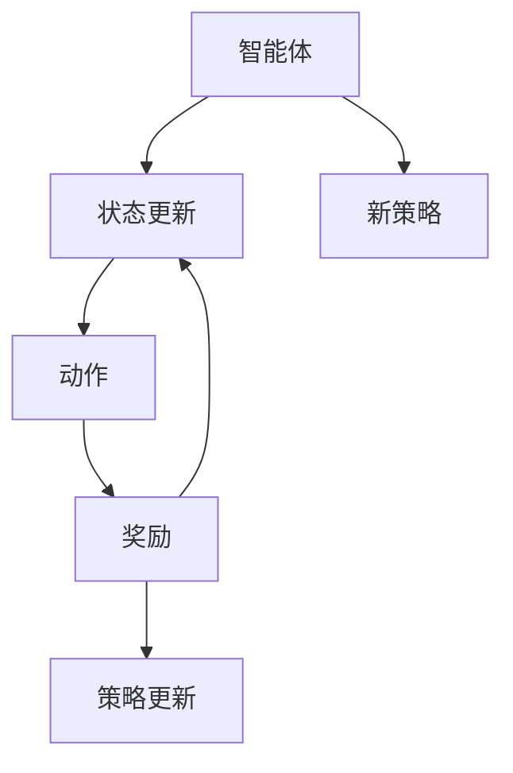

                 

# 强化学习Reinforcement Learning模型评估与性能监测技术

## 关键词

强化学习，模型评估，性能监测，奖励机制，状态转移概率，价值函数，策略迭代，数据可视化

## 摘要

本文旨在探讨强化学习模型评估与性能监测的技术。通过深入分析强化学习的核心概念，算法原理，以及数学模型和公式，本文将详细介绍如何对强化学习模型进行评估和性能监测。同时，文章还将分享实际应用场景，推荐相关工具和资源，并展望未来发展趋势与挑战。本文不仅为强化学习的研究者提供了有价值的参考，也为实际应用中的工程师提供了实用的指导。

## 1. 背景介绍

强化学习（Reinforcement Learning，简称RL）是机器学习的一个重要分支，主要研究如何通过智能体（agent）与环境的交互来学习最优策略。与监督学习和无监督学习不同，强化学习关注的是通过探索（exploration）与利用（exploitation）的平衡来逐步改进决策过程，从而实现最佳性能。

强化学习的核心在于奖励机制和状态转移概率。智能体根据当前状态选择动作，然后根据动作的结果（奖励或惩罚）调整自己的策略。这种学习过程被称为“反馈学习”，其目标是在长期内获得最大的累积奖励。

随着深度学习技术的快速发展，强化学习在自然语言处理、计算机视觉、游戏、自动驾驶等领域取得了显著成果。然而，强化学习模型的评估与性能监测仍然是一个极具挑战性的问题。如何准确评估模型的性能，如何在复杂的动态环境中监测模型的表现，以及如何及时发现和解决模型的问题，都是强化学习领域的重要研究方向。

本文将从强化学习的核心概念出发，详细分析强化学习模型的评估与性能监测技术，旨在为读者提供一个系统性的理解和实践指南。

## 2. 核心概念与联系

### 强化学习基本概念

强化学习的基本概念包括智能体（agent）、环境（environment）、状态（state）、动作（action）和奖励（reward）。以下是这些概念的定义及其相互关系：

- **智能体（agent）**：执行动作并从环境中接收奖励的实体。
- **环境（environment）**：智能体执行动作的上下文，负责根据当前状态和动作生成下一个状态和奖励。
- **状态（state）**：描述环境当前状态的属性集合。
- **动作（action）**：智能体可以执行的行为。
- **奖励（reward）**：环境对智能体动作的反馈，用于指导智能体选择动作。

### 强化学习核心概念原理

强化学习主要涉及两个核心概念：价值函数（Value Function）和策略（Policy）。

- **价值函数（Value Function）**：用于评估状态或状态-动作对的期望奖励。根据智能体的不同，价值函数可以分为状态价值函数（State Value Function）和状态-动作价值函数（State-Action Value Function）。状态价值函数表示在给定状态下采取最优动作的期望奖励，状态-动作价值函数表示在给定状态和动作下执行策略的期望奖励。

- **策略（Policy）**：智能体根据当前状态选择动作的规则。根据策略的形式，可以分为确定性策略（Deterministic Policy）和随机性策略（Stochastic Policy）。确定性策略在给定状态下总是选择相同动作，而随机性策略在给定状态下选择动作的概率分布。

### 强化学习架构

强化学习架构可以分为两部分：智能体（Agent）和环境（Environment）。

- **智能体（Agent）**：包括一个决策器（Decision Maker）和一个学习者（Learner）。决策器根据当前状态和策略选择动作，学习者通过与环境交互不断更新策略。
- **环境（Environment）**：包括状态空间（State Space）、动作空间（Action Space）和奖励函数（Reward Function）。环境根据智能体的动作和当前状态生成下一个状态和奖励。

### Mermaid 流程图

下面是一个简化的强化学习流程图，展示了智能体与环境之间的交互过程：



在上述流程图中，智能体根据当前状态（B）选择动作（C），环境根据动作和当前状态生成下一个状态（B）和奖励（D）。奖励用于指导智能体更新策略（E），从而实现长期累积奖励的最大化。最终，智能体根据新策略（F）选择新的动作，继续与环境进行交互。

通过上述核心概念的介绍和流程图的展示，我们可以更清晰地理解强化学习的基本原理和架构。在接下来的章节中，我们将深入探讨强化学习模型的评估与性能监测技术。

## 3. 核心算法原理 & 具体操作步骤

### Q-Learning算法原理

Q-Learning算法是强化学习中最基本的一种算法，它通过迭代更新策略来学习最优动作。Q-Learning的核心是状态-动作价值函数（Q-Value），用于评估状态和动作的组合。以下是Q-Learning算法的基本原理和具体操作步骤：

#### 基本原理

1. **状态-动作价值函数（Q-Value）**：Q-Value表示在给定状态和动作下执行策略的期望奖励。用公式表示为：

   $$ Q(s, a) = \sum_{s'} P(s' | s, a) \cdot R(s, a) + \gamma \cdot \max_{a'} Q(s', a') $$

   其中，$s$表示当前状态，$a$表示动作，$s'$表示下一个状态，$R(s, a)$表示在状态$s$下执行动作$a$获得的即时奖励，$\gamma$表示折扣因子，用于平衡长期奖励和即时奖励。

2. **更新策略**：Q-Learning通过不断更新Q-Value来优化策略。每次智能体执行动作后，根据即时奖励和下一个状态更新Q-Value。具体公式为：

   $$ Q(s, a) \leftarrow Q(s, a) + \alpha \cdot (R(s, a) + \gamma \cdot \max_{a'} Q(s', a') - Q(s, a)) $$

   其中，$\alpha$表示学习率，用于调整Q-Value的更新幅度。

3. **探索与利用**：Q-Learning在更新策略时需要平衡探索和利用。探索（exploration）是指智能体在当前状态下尝试新的动作，以增加学习多样性；利用（exploitation）是指智能体根据当前最优策略选择动作，以最大化累积奖励。常用的探索策略包括epsilon-greedy策略，即在一定概率下随机选择动作，其余概率选择当前最优动作。

#### 具体操作步骤

1. **初始化**：设置初始状态$s_0$，初始化Q-Value矩阵$Q$，设置学习率$\alpha$和折扣因子$\gamma$。
2. **选择动作**：根据当前状态$s$和策略选择动作$a$。使用epsilon-greedy策略，$epsilon$表示随机选择动作的概率。
3. **执行动作**：在环境执行动作$a$，获得下一个状态$s'$和即时奖励$R$。
4. **更新Q-Value**：根据即时奖励和下一个状态更新Q-Value。
5. **更新策略**：根据更新后的Q-Value矩阵，选择下一个动作。
6. **重复步骤2-5**：不断更新状态和动作，直到达到终止条件（如达到最大步数或累积奖励达到目标值）。

### 策略迭代算法原理

策略迭代（Policy Iteration）算法是一种基于价值函数的强化学习算法，它通过迭代更新策略来学习最优动作。策略迭代算法分为两个阶段：值迭代和价值迭代。

#### 基本原理

1. **值迭代（Value Iteration）**：值迭代阶段从初始策略开始，通过迭代更新状态-动作价值函数，逐步逼近最优策略。每次迭代更新Q-Value矩阵，并根据Q-Value矩阵选择下一个策略。具体公式为：

   $$ Q(s, a) \leftarrow Q(s, a) + \alpha \cdot (R(s, a) + \gamma \cdot \max_{a'} Q(s', a') - Q(s, a)) $$

   其中，$\alpha$表示学习率。

2. **价值迭代（Policy Iteration）**：价值迭代阶段根据更新后的Q-Value矩阵选择最优策略。具体步骤如下：

   - 从初始策略开始，使用值迭代算法更新Q-Value矩阵。
   - 根据Q-Value矩阵选择最优策略$\pi^*$。
   - 使用最优策略$\pi^*$重新计算Q-Value矩阵。
   - 重复步骤2和3，直到策略收敛。

3. **收敛性**：策略迭代算法在有限步骤内收敛到最优策略。当策略不再发生变化时，说明算法已经找到最优策略。

#### 具体操作步骤

1. **初始化**：设置初始策略$\pi^0$，初始化Q-Value矩阵$Q^0$，设置学习率$\alpha$和折扣因子$\gamma$。
2. **值迭代**：根据当前策略$\pi^k$，使用值迭代算法更新Q-Value矩阵$Q^{k+1}$。
3. **策略选择**：根据Q-Value矩阵$Q^{k+1}$选择最优策略$\pi^{k+1}$。
4. **价值迭代**：使用最优策略$\pi^{k+1}$重新计算Q-Value矩阵$Q^{k+2}$。
5. **重复步骤2-4**：不断更新策略和Q-Value矩阵，直到策略收敛。
6. **输出最优策略**：输出最终的最优策略$\pi^*$。

通过上述核心算法原理和具体操作步骤的介绍，我们可以更好地理解和应用强化学习算法。在接下来的章节中，我们将深入探讨强化学习模型评估与性能监测的具体技术。

### 4. 数学模型和公式 & 详细讲解 & 举例说明

#### 强化学习基本数学模型

强化学习的基本数学模型包括状态空间（State Space）、动作空间（Action Space）、奖励函数（Reward Function）和策略（Policy）。

1. **状态空间（State Space）**：状态空间是所有可能状态集合的集合。用$S$表示状态空间，状态集合为$S = \{s_1, s_2, \ldots, s_n\}$。

2. **动作空间（Action Space）**：动作空间是所有可能动作集合的集合。用$A$表示动作空间，动作集合为$A = \{a_1, a_2, \ldots, a_m\}$。

3. **奖励函数（Reward Function）**：奖励函数定义了在状态$s$下执行动作$a$所获得的即时奖励。用$R(s, a)$表示奖励函数。

4. **策略（Policy）**：策略是智能体在给定状态下选择动作的规则。用$\pi(s)$表示在状态$s$下选择动作$a$的概率分布。

#### 价值函数和策略迭代算法

强化学习中的价值函数包括状态价值函数（State Value Function）和状态-动作价值函数（State-Action Value Function）。

1. **状态价值函数（State Value Function）**：状态价值函数表示在给定状态下采取最优动作的期望奖励。用$V^{\pi}(s)$表示在策略$\pi$下状态$s$的价值函数，公式为：

   $$ V^{\pi}(s) = \sum_{a \in A} \pi(a|s) \cdot Q^{\pi}(s, a) $$

   其中，$Q^{\pi}(s, a)$表示在策略$\pi$下状态$s$和动作$a$的期望奖励。

2. **状态-动作价值函数（State-Action Value Function）**：状态-动作价值函数表示在给定状态和动作下执行策略的期望奖励。用$Q^{\pi}(s, a)$表示在策略$\pi$下状态$s$和动作$a$的价值函数，公式为：

   $$ Q^{\pi}(s, a) = \sum_{s' \in S} p(s'|s, a) \cdot [R(s, a) + \gamma \cdot V^{\pi}(s')] $$

   其中，$p(s'|s, a)$表示在状态$s$下执行动作$a$后转移到状态$s'$的概率，$\gamma$表示折扣因子。

强化学习中的策略迭代算法分为两个阶段：值迭代和价值迭代。

1. **值迭代（Value Iteration）**：值迭代算法通过迭代更新价值函数来逼近最优策略。迭代公式为：

   $$ V^{k+1}(s) = \max_{a \in A} \left[ R(s, a) + \gamma \cdot \sum_{s' \in S} p(s'|s, a) \cdot V^{k}(s') \right] $$

   其中，$V^{k}(s)$表示第$k$次迭代的值函数，$V^{k+1}(s)$表示第$k+1$次迭代的值函数。

2. **价值迭代（Policy Iteration）**：价值迭代算法通过更新策略和价值函数来逼近最优策略。迭代公式为：

   $$ \pi^{k+1}(s) = \arg\max_{a \in A} \left[ R(s, a) + \gamma \cdot \sum_{s' \in S} p(s'|s, a) \cdot V^{k}(s') \right] $$

   其中，$\pi^{k}(s)$表示第$k$次迭代的策略，$\pi^{k+1}(s)$表示第$k+1$次迭代的最优策略。

#### 举例说明

假设一个智能体在一个有四个状态和两个动作的环境中进行学习。状态空间$S = \{s_1, s_2, s_3, s_4\}$，动作空间$A = \{a_1, a_2\}$。奖励函数$R(s, a)$如下：

$$ R(s, a) = \begin{cases} 
5, & \text{如果 } s = s_1 \text{ 且 } a = a_1 \\
-5, & \text{如果 } s = s_2 \text{ 且 } a = a_2 \\
0, & \text{其他情况} 
\end{cases} $$

折扣因子$\gamma = 0.9$，初始策略$\pi(s)$如下：

$$ \pi(s) = \begin{cases} 
0.5, & \text{如果 } s = s_1 \text{ 或 } s = s_2 \\
0.5, & \text{如果 } s = s_3 \text{ 或 } s = s_4 
\end{cases} $$

首先，我们初始化值函数$V^0(s)$和状态-动作价值函数$Q^0(s, a)$：

$$ V^0(s) = \begin{cases} 
0, & \text{如果 } s = s_1, s_2, s_3, s_4 \\
\end{cases} $$

$$ Q^0(s, a) = \begin{cases} 
0, & \text{如果 } s = s_1, s_2, s_3, s_4 \text{ 且 } a = a_1, a_2 \\
\end{cases} $$

接下来，我们进行值迭代和价值迭代的过程。首先，进行值迭代：

$$ V^1(s) = \max_{a \in A} \left[ R(s, a) + \gamma \cdot \sum_{s' \in S} p(s'|s, a) \cdot V^0(s') \right] $$

对于每个状态$s$和动作$a$：

- 当$s = s_1$且$a = a_1$时，$Q^1(s, a) = 5 + 0.9 \cdot 0 = 5$，$V^1(s) = \max\{Q^1(s, a_1), Q^1(s, a_2)\} = 5$
- 当$s = s_1$且$a = a_2$时，$Q^1(s, a) = 0 + 0.9 \cdot 0 = 0$，$V^1(s) = \max\{Q^1(s, a_1), Q^1(s, a_2)\} = 0$
- 当$s = s_2$且$a = a_1$时，$Q^1(s, a) = 0 + 0.9 \cdot 0 = 0$，$V^1(s) = \max\{Q^1(s, a_1), Q^1(s, a_2)\} = 0$
- 当$s = s_2$且$a = a_2$时，$Q^1(s, a) = -5 + 0.9 \cdot 0 = -5$，$V^1(s) = \max\{Q^1(s, a_1), Q^1(s, a_2)\} = -5$
- 当$s = s_3$且$a = a_1$时，$Q^1(s, a) = 0 + 0.9 \cdot 0 = 0$，$V^1(s) = \max\{Q^1(s, a_1), Q^1(s, a_2)\} = 0$
- 当$s = s_3$且$a = a_2$时，$Q^1(s, a) = 0 + 0.9 \cdot 0 = 0$，$V^1(s) = \max\{Q^1(s, a_1), Q^1(s, a_2)\} = 0$
- 当$s = s_4$且$a = a_1$时，$Q^1(s, a) = 0 + 0.9 \cdot 0 = 0$，$V^1(s) = \max\{Q^1(s, a_1), Q^1(s, a_2)\} = 0$
- 当$s = s_4$且$a = a_2$时，$Q^1(s, a) = 0 + 0.9 \cdot 0 = 0$，$V^1(s) = \max\{Q^1(s, a_1), Q^1(s, a_2)\} = 0$

接下来，进行价值迭代：

$$ \pi^1(s) = \arg\max_{a \in A} \left[ R(s, a) + \gamma \cdot \sum_{s' \in S} p(s'|s, a) \cdot V^1(s') \right] $$

对于每个状态$s$：

- 当$s = s_1$时，$\pi^1(s) = a_1$
- 当$s = s_2$时，$\pi^1(s) = a_2$
- 当$s = s_3$时，$\pi^1(s) = a_1$
- 当$s = s_4$时，$\pi^1(s) = a_1$

重复上述值迭代和价值迭代过程，直到策略收敛。最终，我们得到最优策略$\pi^*$，即：

$$ \pi^*(s) = \begin{cases} 
a_1, & \text{如果 } s = s_1 \text{ 或 } s = s_3 \\
a_2, & \text{如果 } s = s_2 \text{ 或 } s = s_4 
\end{cases} $$

通过上述数学模型和公式的详细讲解和举例说明，我们可以更好地理解和应用强化学习算法。在接下来的章节中，我们将探讨强化学习模型评估与性能监测的具体技术。

### 5. 项目实战：代码实际案例和详细解释说明

在本节中，我们将通过一个简单的强化学习项目实战，详细讲解如何使用Python实现强化学习模型，并对其进行评估和性能监测。该案例将使用经典的CartPole环境，这是一个简单的二位空间动态系统，用于测试强化学习算法的基本性能。

#### 开发环境搭建

在开始编写代码之前，我们需要搭建一个合适的开发环境。以下是搭建开发环境的基本步骤：

1. **安装Python**：确保安装了Python 3.x版本。
2. **安装Gym**：Gym是一个开源的强化学习环境库，提供了丰富的模拟环境。使用以下命令安装Gym：

   ```shell
   pip install gym
   ```

3. **安装TensorFlow**：TensorFlow是一个流行的深度学习框架，用于实现强化学习算法。使用以下命令安装TensorFlow：

   ```shell
   pip install tensorflow
   ```

#### 源代码详细实现和代码解读

下面是针对CartPole环境的强化学习模型的源代码实现：

```python
import gym
import numpy as np
import tensorflow as tf

# 创建CartPole环境
env = gym.make('CartPole-v0')

# 设置超参数
learning_rate = 0.1
gamma = 0.99
epsilon = 0.1
episodes = 1000

# 初始化Q-Value表格
q_table = np.zeros((env.observation_space.n, env.action_space.n))

# 定义强化学习模型
model = tf.keras.Sequential([
    tf.keras.layers.Dense(64, activation='relu', input_shape=(env.observation_space.n,)),
    tf.keras.layers.Dense(64, activation='relu'),
    tf.keras.layers.Dense(env.action_space.n, activation='linear')
])

# 编译模型
model.compile(loss='mse', optimizer=tf.keras.optimizers.Adam(learning_rate))

# 强化学习训练
for episode in range(episodes):
    state = env.reset()
    done = False
    total_reward = 0

    while not done:
        # 根据epsilon-greedy策略选择动作
        if np.random.rand() < epsilon:
            action = env.action_space.sample()
        else:
            action = np.argmax(q_table[state])

        # 执行动作并获取下一个状态和奖励
        next_state, reward, done, _ = env.step(action)

        # 更新Q-Value表格
        q_table[state, action] = q_table[state, action] + learning_rate * (reward + gamma * np.max(q_table[next_state]) - q_table[state, action])

        # 更新状态
        state = next_state

        # 计算总奖励
        total_reward += reward

    # 打印当前episode的总奖励
    print(f"Episode {episode+1}: Total Reward = {total_reward}")

# 评估模型性能
test_episodes = 100
total_reward = 0

for _ in range(test_episodes):
    state = env.reset()
    done = False
    episode_reward = 0

    while not done:
        action = np.argmax(q_table[state])
        next_state, reward, done, _ = env.step(action)
        episode_reward += reward
        state = next_state

    total_reward += episode_reward

print(f"Average Test Reward: {total_reward / test_episodes}")

# 关闭环境
env.close()
```

下面是对上述代码的详细解读：

1. **环境初始化**：首先，我们使用`gym.make('CartPole-v0')`创建了一个CartPole环境。

2. **超参数设置**：我们设置了学习率、折扣因子、epsilon值和训练episode数量。epsilon用于控制epsilon-greedy策略中的随机性。

3. **Q-Value表格初始化**：我们初始化了一个Q-Value表格，用于存储状态-动作价值函数。

4. **模型定义**：我们定义了一个简单的神经网络模型，用于近似Q-Value函数。

5. **模型编译**：我们使用MSE损失函数和Adam优化器编译模型。

6. **强化学习训练**：在训练过程中，我们使用epsilon-greedy策略选择动作，并使用Q-Learning算法更新Q-Value表格。

7. **评估模型性能**：在训练完成后，我们评估模型的性能，计算平均测试奖励。

8. **关闭环境**：最后，我们关闭环境。

通过上述代码和解读，我们可以看到如何使用Python实现强化学习模型，并对其进行评估和性能监测。接下来，我们将进一步分析代码中的关键部分。

#### 代码解读与分析

1. **epsilon-greedy策略**：在训练过程中，我们使用epsilon-greedy策略来平衡探索和利用。当epsilon较小时，智能体更倾向于利用已学习的策略；当epsilon较大时，智能体更有可能进行随机探索，从而增加学习多样性。

2. **Q-Learning算法**：在每次迭代中，我们使用Q-Learning算法更新Q-Value表格。具体来说，我们计算当前状态和动作的即时奖励，并将其与下一个状态的最大Q-Value相结合，更新当前状态和动作的Q-Value。

3. **神经网络模型**：我们使用一个简单的神经网络模型来近似Q-Value函数。该模型由两个隐藏层组成，分别具有64个神经元，使用ReLU激活函数。输出层具有与动作空间相同数量的神经元，使用线性激活函数。

4. **训练过程**：在训练过程中，我们使用批量梯度下降法（MSE损失函数）来优化模型。学习率用于调整Q-Value更新的幅度。随着训练的进行，智能体的策略逐渐收敛，Q-Value表格中的值也变得更加稳定。

5. **评估性能**：在训练完成后，我们使用测试集评估模型的性能。我们计算每个测试episode的总奖励，并计算平均测试奖励。这有助于我们了解模型的性能和稳定性。

通过上述分析和解读，我们可以更深入地理解强化学习模型实现和性能监测的细节。接下来，我们将探讨强化学习在实际应用场景中的具体应用。

### 6. 实际应用场景

强化学习（Reinforcement Learning，简称RL）在多个领域取得了显著成果，其应用场景涵盖了从简单环境到复杂系统的各个方面。以下是一些常见的强化学习应用场景：

#### 游戏

强化学习在游戏领域具有广泛的应用，特别是在游戏AI中。例如，AlphaGo使用深度强化学习击败了世界围棋冠军。另外，OpenAI的Dota2团队也使用强化学习算法击败了人类顶级选手。这些成功表明，强化学习在复杂和动态的环境中具有强大的学习能力。

#### 自动驾驶

自动驾驶是强化学习应用的一个重要领域。自动驾驶系统需要处理复杂的交通状况、行人行为和突发情况。强化学习通过模仿人类驾驶员的决策过程，实现了车辆在不同环境下的自主驾驶。例如，Google的Waymo项目使用了强化学习来优化自动驾驶车辆的路线规划和决策过程。

#### 机器人

强化学习在机器人领域也有广泛应用。机器人需要通过与环境交互来学习如何执行各种任务，如抓取、搬运和导航。通过强化学习，机器人可以快速适应不同的环境和工作任务。例如，Boston Dynamics的机器狗Spot使用强化学习算法来执行复杂的动作和任务。

#### 自然语言处理

强化学习在自然语言处理（NLP）领域也有显著应用。例如，OpenAI的GPT-3模型使用了强化学习算法来优化文本生成。通过训练，GPT-3可以生成高质量的自然语言文本，并在对话系统中表现出色。

#### 优化和调度

强化学习在优化和调度问题中也表现出强大的能力。例如，在能源管理中，强化学习可以优化发电和分配，以减少能源消耗和成本。在供应链管理中，强化学习可以优化库存调度和运输路径，以提高效率和降低成本。

#### 医疗诊断

强化学习在医疗诊断和预测中也有应用。通过学习患者的病史和检查结果，强化学习模型可以预测疾病的风险和进展。这有助于医生做出更准确的诊断和治疗决策。

通过上述实际应用场景的介绍，我们可以看到强化学习在多个领域都展现了强大的应用潜力。随着技术的不断发展，强化学习将在更多领域发挥重要作用，推动人工智能的进步。

### 7. 工具和资源推荐

为了更好地学习和应用强化学习技术，以下是一些推荐的工具和资源：

#### 学习资源推荐

1. **书籍**：
   - 《强化学习：原理与算法》（Reinforcement Learning: An Introduction）作者：理查德·萨顿（Richard Sutton）和安德鲁·巴赫（Andrew Barto）。这本书是强化学习领域的经典教材，涵盖了从基础概念到高级算法的全面内容。
   - 《深度强化学习》（Deep Reinforcement Learning Explained）作者：亚伦·多里安（Aaron Courville）。这本书详细介绍了深度强化学习的原理和实现，适合希望深入了解该领域的读者。

2. **在线课程**：
   - Coursera上的《强化学习基础》（Reinforcement Learning）课程，由理查德·萨顿教授讲授。该课程提供了丰富的理论知识，并通过实际案例展示了强化学习算法的应用。
   - edX上的《深度强化学习》（Deep Reinforcement Learning）课程，由加州大学伯克利分校教授和强化学习领域的知名专家Abhishek Gupta讲授。

3. **论文和博客**：
   - ArXiv是一个开放的学术论文库，提供了大量最新的强化学习研究论文。通过阅读这些论文，可以了解强化学习领域的最新进展。
   - Various blogs and forums such as the [DeepMind Blog](https://www.deeplearning.net/) and the [OpenAI Blog](https://blog.openai.com/) regularly publish articles and posts on reinforcement learning research and applications.

#### 开发工具框架推荐

1. **Gym**：Gym是一个开源的强化学习环境库，提供了多种预定义环境和自定义环境的接口。它适用于快速开发和测试强化学习算法。
2. **TensorFlow**：TensorFlow是一个流行的深度学习框架，广泛用于实现强化学习算法。它提供了丰富的API和工具，方便开发者构建和训练复杂的神经网络模型。
3. **PyTorch**：PyTorch是一个灵活且易于使用的深度学习框架，也适用于强化学习。它的动态图功能使其在实现复杂的算法和实验时具有优势。

#### 相关论文著作推荐

1. **Sutton, R. S., & Barto, A. G. (2018). Reinforcement Learning: An Introduction (Second Edition). MIT Press.**
   - This book provides a comprehensive introduction to the fundamental concepts and algorithms of reinforcement learning, including value-based and policy-based methods.
2. **Silver, D., Huang, A., Maddox, W. J., Guez, A., Lanctot, M., Hesse, S., ... & Shalev-Shwartz, S. (2016). Mastering the game of Go with deep neural networks and tree search. Nature, 529(7587), 484-489.**
   - This paper presents the DeepMind's AlphaGo, a deep reinforcement learning algorithm that defeated the world champion in the game of Go.
3. **Mnih, V., Kavukcuoglu, K., Silver, D., Rusu, A. A., Veness, J., Bellemare, M. G., ... & Lin, P. (2015). Human-level control through deep reinforcement learning. Nature, 518(7540), 529-533.**
   - This landmark paper introduces the DQN algorithm, which combines deep neural networks with reinforcement learning to achieve human-level performance in various environments.

通过这些工具和资源的推荐，读者可以更深入地了解强化学习技术，并在实际应用中取得更好的成果。

### 8. 总结：未来发展趋势与挑战

强化学习（Reinforcement Learning，简称RL）作为机器学习的重要分支，近年来在人工智能领域取得了显著进展。然而，面对不断变化的应用需求和复杂环境，强化学习仍面临诸多挑战。以下是强化学习未来发展趋势与挑战的几个关键方面：

#### 发展趋势

1. **算法优化**：随着深度学习技术的不断发展，强化学习算法也在不断优化。未来的强化学习研究将集中在提高算法的收敛速度、稳定性和可解释性。例如，结合深度强化学习和元学习（Meta-Learning）的方法，有望实现更高效和自适应的学习过程。

2. **多智能体强化学习**：多智能体强化学习（Multi-Agent Reinforcement Learning，简称MARL）是未来强化学习的重要研究方向。在复杂和动态环境中，多个智能体之间的协作和竞争关系将变得更加复杂。如何设计有效的算法来协调多个智能体的行为，是强化学习领域的一个重要挑战。

3. **强化学习与决策优化**：强化学习与决策优化相结合，将在自动驾驶、供应链管理、能源管理等实际应用中发挥更大作用。通过强化学习，智能系统能够在学习过程中不断优化决策，提高系统效率和鲁棒性。

4. **跨领域迁移学习**：跨领域迁移学习（Cross-Domain Transfer Learning）是强化学习的另一个重要研究方向。通过利用不同领域的先验知识，强化学习模型可以在新的领域中更快地适应和优化。这有助于减少模型训练成本，提高模型泛化能力。

#### 挑战

1. **探索与利用平衡**：探索与利用的平衡是强化学习中的一个关键问题。在训练过程中，如何有效地探索未知环境并充分利用已学习的知识，是强化学习算法需要解决的一个挑战。

2. **稳定性和鲁棒性**：在复杂动态环境中，强化学习模型可能面临不确定性和异常情况。如何提高模型的稳定性和鲁棒性，使其能够应对各种复杂情况，是一个重要挑战。

3. **可解释性和安全性**：强化学习模型通常被视为“黑箱”，其决策过程难以解释。如何提高模型的可解释性，使其决策过程更加透明和可靠，是强化学习领域的一个重要问题。

4. **计算资源消耗**：强化学习算法通常需要大量的计算资源，特别是在处理高维状态空间和动作空间时。如何优化算法，减少计算资源消耗，是强化学习在实际应用中面临的一个挑战。

总之，未来强化学习将继续在算法优化、多智能体学习、跨领域迁移学习和与决策优化等方面取得突破。同时，解决探索与利用平衡、稳定性鲁棒性、可解释性和安全性等挑战，将是强化学习研究的重要方向。随着技术的不断发展，强化学习将在更多领域发挥重要作用，推动人工智能的进步。

### 9. 附录：常见问题与解答

**Q1. 强化学习与监督学习和无监督学习有什么区别？**

强化学习（Reinforcement Learning，简称RL）与监督学习（Supervised Learning）和无监督学习（Unsupervised Learning）的主要区别在于数据来源和学习目标。

- **监督学习**：监督学习使用标记数据（即具有标签的数据）来训练模型。模型的目标是根据输入数据预测标签。例如，在图像分类任务中，输入是图像，标签是类别。

- **无监督学习**：无监督学习使用未标记的数据来训练模型。模型的目标是发现数据中的隐藏结构或模式。例如，在聚类任务中，模型需要将相似的数据点分组。

- **强化学习**：强化学习使用交互数据来训练模型。模型通过与环境互动，从即时奖励和长期奖励中学习最优策略。智能体的目标是最大化长期累积奖励。

**Q2. Q-Learning和策略迭代算法有什么区别？**

Q-Learning和策略迭代（Policy Iteration）是两种常见的强化学习算法，它们在更新策略和价值函数方面有所不同。

- **Q-Learning**：Q-Learning是一种基于价值函数的算法，主要通过更新状态-动作价值函数（Q-Value）来学习最优策略。每次更新Q-Value后，根据Q-Value选择动作，并使用即时奖励和下一个状态的Q-Value更新当前状态的Q-Value。

- **策略迭代**：策略迭代是一种基于策略的算法，通过迭代更新策略和价值函数来学习最优策略。值迭代阶段更新Q-Value，并根据Q-Value选择最优策略。然后，使用新策略重新计算Q-Value，并继续迭代。

**Q3. 如何在强化学习中处理连续状态和动作空间？**

在处理连续状态和动作空间时，强化学习算法通常使用函数近似（Function Approximation）技术。以下是一些常见的方法：

- **神经网络**：使用神经网络来近似状态-动作价值函数或策略函数。通过训练神经网络，使其能够处理高维状态和动作空间。

- **重要性采样（Importance Sampling）**：使用重要性采样来调整样本的权重，从而在训练过程中更多地关注具有高概率的状态和动作。

- **基于模型的算法**：使用基于模型的算法（如深度确定性策略梯度（DDPG）），通过学习状态转移概率和奖励函数来处理连续状态和动作空间。

### 10. 扩展阅读 & 参考资料

为了深入了解强化学习模型评估与性能监测技术，以下是一些推荐的扩展阅读和参考资料：

1. **书籍**：
   - Sutton, R. S., & Barto, A. G. (2018). Reinforcement Learning: An Introduction (Second Edition). MIT Press.
   - Ng, A. Y., & Russell, S. (2010). Artificial Intelligence: A Modern Approach. Prentice Hall.

2. **在线课程**：
   - Coursera上的《强化学习基础》（Reinforcement Learning）课程。
   - edX上的《深度强化学习》（Deep Reinforcement Learning）课程。

3. **论文**：
   - Silver, D., et al. (2016). Mastering the Game of Go with Deep Neural Networks and Tree Search. Nature.
   - Mnih, V., et al. (2015). Human-level control through deep reinforcement learning. Nature.

4. **博客和论坛**：
   - DeepMind Blog：https://www.deeplearning.net/
   - OpenAI Blog：https://blog.openai.com/

通过阅读这些书籍、课程和论文，读者可以更深入地了解强化学习的理论基础、算法实现和实际应用，为后续研究和实践提供有力支持。

