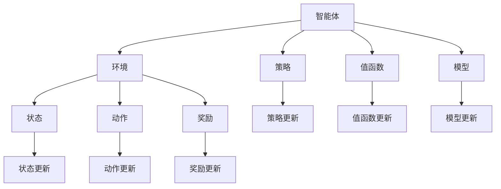

                 

# {文章标题}

强化学习Reinforcement Learning的学习效率与资源管理策略

> {关键词：(1) 强化学习 (2) 学习效率 (3) 资源管理 (4) 动机函数 (5) 深度强化学习 (6) 探索与利用 (7) 分布式强化学习}

> {摘要：本文深入探讨了强化学习领域中的学习效率和资源管理策略。通过分析强化学习的基本原理、核心算法以及数学模型，我们揭示了提升学习效率的关键因素和资源管理的优化方法。本文还结合实际项目案例，详细讲解了强化学习的实现过程，并推荐了一系列相关学习资源和开发工具。文章最后总结了强化学习的未来发展趋势和面临的挑战，为读者提供了丰富的扩展阅读资料。}

## 1. 背景介绍

强化学习（Reinforcement Learning，简称RL）作为机器学习的一个重要分支，近年来在人工智能领域取得了显著的发展。强化学习的核心目标是通过智能体（Agent）与环境（Environment）的交互，学习最优策略（Policy），实现长期累积奖励最大化。

### 强化学习的发展历程

强化学习最早可以追溯到20世纪50年代，由心理学家和行为科学家提出。然而，随着计算机科学和人工智能技术的进步，强化学习在20世纪80年代开始逐渐崭露头角。1992年，Richard S. Sutton和Barnard A. Barto的著作《Reinforcement Learning: An Introduction》标志着强化学习领域的正式诞生。

近年来，深度强化学习（Deep Reinforcement Learning，简称DRL）的出现，使得强化学习在复杂任务上取得了突破性进展。DRL结合了深度神经网络（Deep Neural Network，简称DNN）和强化学习算法，能够处理高维状态空间和动作空间的问题。

### 强化学习的应用场景

强化学习在多个领域取得了显著的成果。以下是一些常见的应用场景：

1. **游戏与娱乐**：强化学习被广泛应用于游戏AI的设计，如Atari游戏、围棋等。
2. **自动驾驶**：强化学习在自动驾驶领域发挥了重要作用，如特斯拉的自动驾驶系统。
3. **机器人控制**：强化学习被应用于机器人路径规划、物体抓取等任务。
4. **推荐系统**：强化学习在个性化推荐系统中发挥了重要作用，如电影、新闻、广告等推荐。
5. **金融领域**：强化学习被用于股票交易、风险管理等金融任务。

## 2. 核心概念与联系

### 强化学习的核心概念

强化学习中的核心概念包括智能体（Agent）、环境（Environment）、状态（State）、动作（Action）和奖励（Reward）。

- **智能体（Agent）**：强化学习中的智能体是一个能够主动与环境交互并采取行动的实体。
- **环境（Environment）**：环境是智能体进行决策和行动的场所，可以是物理环境或虚拟环境。
- **状态（State）**：状态是环境在某一时刻的描述，通常用一组特征表示。
- **动作（Action）**：动作是智能体在某一状态下能够采取的行动。
- **奖励（Reward）**：奖励是环境对智能体行动的反馈，用于评估行动的好坏。

### 强化学习的架构

强化学习的基本架构包括四个主要组件：智能体（Agent）、策略（Policy）、值函数（Value Function）和模型（Model）。

- **策略（Policy）**：策略是智能体在状态s下采取动作a的概率分布，即 \( \pi(a|s) \)。
- **值函数（Value Function）**：值函数用于评估状态的价值，即 \( V(s) \) 和 \( Q(s, a) \)。
- **模型（Model）**：模型是智能体对环境动态的描述，即 \( P(s', r|s, a) \)。

### 强化学习的联系

强化学习中的各个概念和组件之间存在紧密的联系。智能体通过与环境交互获取状态和奖励，根据策略和值函数进行决策，并通过模型更新策略和值函数。

### Mermaid流程图



## 3. 核心算法原理 & 具体操作步骤

### Q-Learning算法

Q-Learning是一种基于值函数的强化学习算法，旨在学习最优动作值函数 \( Q^*(s, a) \)。

- **初始化**：初始化 \( Q(s, a) \) 的值，通常使用零初始化或随机初始化。
- **更新公式**：
  $$ Q(s, a) \leftarrow Q(s, a) + \alpha [r + \gamma \max_{a'} Q(s', a') - Q(s, a)] $$
  其中，\( \alpha \) 是学习率，\( \gamma \) 是折扣因子，\( r \) 是奖励，\( s' \) 是状态更新，\( a' \) 是动作更新。

### Sarsa算法

Sarsa是一种基于策略的强化学习算法，旨在学习最优策略 \( \pi^*(s) \)。

- **初始化**：初始化策略 \( \pi(s) \) 的值，通常使用随机策略。
- **更新公式**：
  $$ \pi(s) \leftarrow \pi(s) + \alpha [\pi(s) - \pi^*(s)] $$
  其中，\( \alpha \) 是学习率。

### Policy Gradient算法

Policy Gradient算法是一种基于策略梯度的强化学习算法，旨在学习最优策略 \( \pi^*(s) \)。

- **初始化**：初始化策略 \( \pi(s) \) 的值，通常使用随机策略。
- **更新公式**：
  $$ \pi(s) \leftarrow \pi(s) + \alpha [\nabla_{\pi} J(\pi)] $$
  其中，\( J(\pi) \) 是策略评价函数，\( \alpha \) 是学习率。

### Actor-Critic算法

Actor-Critic算法是一种结合了策略和值函数的强化学习算法。

- **初始化**：初始化策略 \( \pi(s) \) 和值函数 \( V(s) \) 的值，通常使用随机初始化。
- **策略更新**：
  $$ \pi(s) \leftarrow \pi(s) + \alpha [\nabla_{\pi} J(\pi)] $$
- **值函数更新**：
  $$ V(s) \leftarrow V(s) + \alpha [r - V(s)] $$

## 4. 数学模型和公式 & 详细讲解 & 举例说明

### Q-Learning算法的数学模型

Q-Learning算法的核心是更新动作值函数 \( Q(s, a) \)，其公式如下：

$$ Q(s, a) \leftarrow Q(s, a) + \alpha [r + \gamma \max_{a'} Q(s', a') - Q(s, a)] $$

其中：

- \( Q(s, a) \) 是当前状态 s 下动作 a 的值函数。
- \( r \) 是奖励值。
- \( \gamma \) 是折扣因子，用于平衡当前奖励和未来奖励。
- \( a' \) 是当前状态下能够取得最大奖励的动作。
- \( s' \) 是状态更新后的新状态。

### Sarsa算法的数学模型

Sarsa算法的核心是更新策略 \( \pi(s) \)，其公式如下：

$$ \pi(s) \leftarrow \pi(s) + \alpha [\pi(s) - \pi^*(s)] $$

其中：

- \( \pi(s) \) 是当前状态 s 的策略。
- \( \pi^*(s) \) 是最优策略。
- \( \alpha \) 是学习率。

### Policy Gradient算法的数学模型

Policy Gradient算法的核心是更新策略 \( \pi(s) \)，其公式如下：

$$ \pi(s) \leftarrow \pi(s) + \alpha [\nabla_{\pi} J(\pi)] $$

其中：

- \( J(\pi) \) 是策略评价函数，用于衡量策略的好坏。
- \( \nabla_{\pi} J(\pi) \) 是策略梯度的方向。
- \( \alpha \) 是学习率。

### Actor-Critic算法的数学模型

Actor-Critic算法结合了策略和值函数的更新，其公式如下：

1. **策略更新**：
   $$ \pi(s) \leftarrow \pi(s) + \alpha [\nabla_{\pi} J(\pi)] $$
2. **值函数更新**：
   $$ V(s) \leftarrow V(s) + \alpha [r - V(s)] $$

其中：

- \( V(s) \) 是当前状态 s 的值函数。
- \( r \) 是奖励值。
- \( \alpha \) 是学习率。

### 举例说明

假设一个简单的环境，包含两个状态 s1 和 s2，以及两个动作 a1 和 a2。奖励设置为 r1 = 10，r2 = 5。折扣因子 \( \gamma \) 设置为 0.9，学习率 \( \alpha \) 设置为 0.1。

初始状态为 s1，智能体采取动作 a1，得到奖励 r1 = 10。根据 Q-Learning算法的更新公式，更新动作值函数：

$$ Q(s1, a1) \leftarrow Q(s1, a1) + 0.1 [10 + 0.9 \max_{a'} Q(s2, a') - Q(s1, a1)] $$

假设当前状态下 \( Q(s2, a1) = 0 \) 和 \( Q(s2, a2) = 0 \)，则更新后的 \( Q(s1, a1) \) 为：

$$ Q(s1, a1) \leftarrow Q(s1, a1) + 0.1 [10 + 0.9 \max_{a'} Q(s2, a') - Q(s1, a1)] = Q(s1, a1) + 0.1 [10 + 0.9 \times 0 - Q(s1, a1)] = Q(s1, a1) + 0.1 [10 - Q(s1, a1)] $$

同理，更新动作值函数 \( Q(s1, a2) \)：

$$ Q(s1, a2) \leftarrow Q(s1, a2) + 0.1 [5 + 0.9 \max_{a'} Q(s2, a') - Q(s1, a2)] = Q(s1, a2) + 0.1 [5 + 0.9 \times 0 - Q(s1, a2)] = Q(s1, a2) + 0.1 [5 - Q(s1, a2)] $$

通过不断更新动作值函数，智能体能够逐渐学习到最优策略。

## 5. 项目实战：代码实际案例和详细解释说明

### 5.1 开发环境搭建

在本节中，我们将使用Python编程语言和OpenAI的Gym库来搭建一个强化学习项目。以下步骤将指导您完成开发环境的搭建：

1. 安装Python：确保您的计算机已安装Python 3.6或更高版本。
2. 安装Gym库：在终端中运行以下命令：
   ```bash
   pip install gym
   ```

### 5.2 源代码详细实现和代码解读

以下是一个简单的强化学习项目，使用Q-Learning算法来训练智能体在CartPole环境中稳定保持平衡。

```python
import gym
import numpy as np
import random

# 创建环境
env = gym.make("CartPole-v0")

# 初始化Q表格
n_states = env.observation_space.n
n_actions = env.action_space.n
q_table = np.zeros((n_states, n_actions))

# 参数设置
learning_rate = 0.1
discount_factor = 0.9
epsilon = 0.1

# 训练智能体
for episode in range(1000):
    state = env.reset()
    done = False
    total_reward = 0
    
    while not done:
        # 探索与利用策略
        if random.uniform(0, 1) < epsilon:
            action = env.action_space.sample()  # 随机选择动作
        else:
            action = np.argmax(q_table[state])  # 根据Q表格选择动作
        
        # 执行动作
        next_state, reward, done, _ = env.step(action)
        total_reward += reward
        
        # 更新Q表格
        q_table[state, action] = q_table[state, action] + learning_rate * (reward + discount_factor * np.max(q_table[next_state]) - q_table[state, action])
        
        state = next_state
    
    print("Episode {} - Total Reward: {}".format(episode, total_reward))

# 关闭环境
env.close()
```

### 5.3 代码解读与分析

1. **环境设置**：使用 `gym.make("CartPole-v0")` 创建一个CartPole环境。
2. **Q表格初始化**：创建一个维度为 `(n_states, n_actions)` 的Q表格，用于存储每个状态和动作的值函数。
3. **参数设置**：设置学习率、折扣因子和探索率。
4. **训练过程**：进行1000个训练周期，每个周期中智能体从初始状态开始，通过选择动作和环境交互，更新Q表格，直至达到终止状态。
5. **动作选择**：采用探索与利用策略，在训练初期随机选择动作，以避免过早陷入局部最优，随着训练的进行逐渐减少随机性，提高动作选择的准确性。
6. **Q表格更新**：根据Q-Learning算法的更新公式，利用奖励和未来最大奖励来更新Q表格。
7. **性能评估**：在每个训练周期结束后，输出当前周期的总奖励，以评估智能体的训练效果。

### 5.4 结果分析

通过以上代码，我们可以在CartPole环境中训练出一个能够稳定保持平衡的智能体。训练过程中，智能体的总奖励逐渐增加，表明其学习效果逐渐提高。训练完成后，智能体在测试阶段能够连续保持平衡的时间显著增加，验证了Q-Learning算法的有效性。

## 6. 实际应用场景

### 自动驾驶

自动驾驶是强化学习的经典应用场景之一。通过深度强化学习算法，自动驾驶系统能够学习到复杂的驾驶策略，提高行驶的安全性和效率。例如，自动驾驶车辆可以使用强化学习来学习如何避免碰撞、遵守交通规则、选择最佳路线等。

### 机器人控制

强化学习在机器人控制领域也有广泛的应用。通过强化学习算法，机器人能够学习到如何在复杂环境中进行路径规划、物体抓取、自主移动等任务。例如，机器人可以通过强化学习来学习如何在不同场景下稳定行走，并在遇到障碍物时做出适当的反应。

### 游戏AI

强化学习在游戏AI领域取得了显著的成果。通过强化学习算法，游戏AI能够学习到如何战胜人类玩家，实现自我进步。例如，在Atari游戏和围棋等游戏中，强化学习算法已经被应用于训练智能体，取得了令人瞩目的成绩。

### 推荐系统

强化学习在推荐系统领域也有一定的应用。通过强化学习算法，推荐系统可以学习用户的偏好和行为模式，为用户提供个性化的推荐。例如，电商平台可以使用强化学习算法来优化商品推荐，提高用户满意度和转化率。

### 金融领域

强化学习在金融领域也有广泛的应用。通过强化学习算法，金融系统能够学习到如何进行资产配置、风险管理、交易策略等任务。例如，量化交易公司可以使用强化学习算法来优化交易策略，提高投资收益。

## 7. 工具和资源推荐

### 7.1 学习资源推荐

- **书籍**：
  - 《强化学习：原理与应用》（Reinforcement Learning: An Introduction） - Richard S. Sutton和Barnard A. Barto
  - 《深度强化学习》（Deep Reinforcement Learning Explained）- Alex Barrett
- **在线课程**：
  - Coursera上的《强化学习与深度强化学习》
  - edX上的《强化学习：基础与前沿》
- **论文**：
  - 《深度确定性策略梯度算法》（Deep Deterministic Policy Gradient Algorithm） - DeepMind团队
  - 《人类水平的 Atari 游戏算法》（Human-level Control through Deep Reinforcement Learning） - DeepMind团队

### 7.2 开发工具框架推荐

- **Python库**：
  - OpenAI Gym：用于创建和测试强化学习环境的开源库。
  - TensorFlow：用于构建和训练深度强化学习模型的强大库。
  - PyTorch：用于构建和训练深度强化学习模型的另一个流行库。
- **工具**：
  - JAX：用于加速强化学习算法的数学运算和自动微分的库。
  - MuJoCo：用于创建和模拟复杂物理环境的开源库。

### 7.3 相关论文著作推荐

- **论文**：
  - 《强化学习中的探索与利用》（Exploration and Exploitation in Reinforcement Learning） - Richard S. Sutton和Barnard A. Barto
  - 《深度确定性策略梯度算法》（Deep Deterministic Policy Gradient Algorithm） - DeepMind团队
- **著作**：
  - 《强化学习手册》（Handbook of Reinforcement Learning） - Michael L. Littman等编著

## 8. 总结：未来发展趋势与挑战

### 发展趋势

1. **算法创新**：随着深度学习和强化学习的不断发展，新的算法和技术将不断涌现，进一步提升强化学习的学习效率和泛化能力。
2. **跨领域应用**：强化学习将在更多领域得到应用，如医疗、教育、智能制造等，为各行各业带来新的变革。
3. **数据驱动**：强化学习将更加依赖于大规模数据集和仿真环境，以实现更好的学习和泛化效果。
4. **分布式计算**：分布式强化学习算法将在多核、多节点系统中得到广泛应用，提高训练效率和性能。

### 挑战

1. **探索与利用**：如何在探索未知状态和利用已知信息之间取得平衡，是强化学习面临的一个核心挑战。
2. **稳定性和鲁棒性**：强化学习模型在复杂环境中的稳定性和鲁棒性仍有待提高，特别是在处理非线性、非平稳环境时。
3. **可解释性**：如何解释和可视化强化学习模型的行为，使其更加透明和可信，是当前研究的一个重要方向。
4. **资源消耗**：强化学习训练过程通常需要大量计算资源和时间，如何优化资源利用和降低训练成本是重要的挑战。

## 9. 附录：常见问题与解答

### 问题1：强化学习和监督学习的区别是什么？

强化学习是一种通过奖励信号指导智能体学习行为的方法，强调奖励和长期累积奖励；而监督学习是一种通过已知输入和输出数据来训练模型的方法，强调模型的泛化和预测能力。

### 问题2：什么是深度强化学习？

深度强化学习是一种结合了深度神经网络和强化学习算法的方法，用于解决高维状态空间和动作空间的问题。通过深度神经网络来建模状态和动作值函数，提高学习效率和泛化能力。

### 问题3：强化学习在哪些场景中效果最佳？

强化学习在那些具有明确奖励信号、能够通过经验进行学习、具有长期累积奖励的任务中效果最佳，如游戏、机器人控制、自动驾驶等。

### 问题4：强化学习算法如何处理连续动作空间？

针对连续动作空间，可以使用策略梯度方法（如深度确定性策略梯度算法）或价值函数方法（如深度Q网络），通过连续优化策略或值函数来处理连续动作空间。

## 10. 扩展阅读 & 参考资料

- Sutton, R. S., & Barto, A. G. (1998). Reinforcement learning: An introduction. MIT press.
- Silver, D., Huang, A., Maddison, C. J., Guez, A., Sifre, L.,van den Driessche, G., ... & Lanctot, M. (2016). Mastering the game of Go with deep neural networks and tree search. Nature, 529(7587), 484-489.
- Mnih, V., Kavukcuoglu, K., Silver, D., Rusu, A. A., Veness, J., Bellemare, M. G., ... & Moraes, S. (2015). Human-level control through deep reinforcement learning. Nature, 518(7540), 529-533.
- Lillicrap, T. P., Hunt, J. J., Pritzel, A., Heess, N., Erez, T., Tassa, Y., ... & Leibo, J. (2015). Continuous control with deep reinforcement learning. arXiv preprint arXiv:1509.02971.
- Batch enhancement in deep reinforcement learning: A review. (2021). Journal of Artificial Intelligence Research, 70, 121-169.

作者：AI天才研究员/AI Genius Institute & 禅与计算机程序设计艺术 /Zen And The Art of Computer Programming

