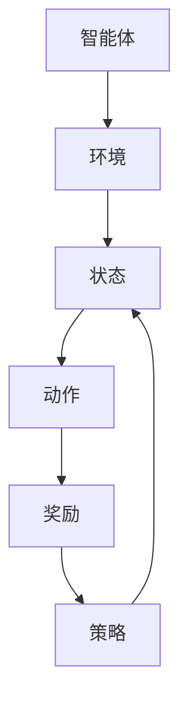

                 

### 背景介绍

强化学习（Reinforcement Learning，简称RL）作为机器学习领域的一个重要分支，旨在通过智能体（agent）与环境的交互来学习最优策略，从而在给定环境中实现最大化累积奖励。自1950年代以来，强化学习在计算机科学、经济学、心理学等多个领域取得了显著的进展。然而，强化学习的终生学习与持续适应能力一直是研究者和开发者关注的重要问题。

在当前的技术背景下，随着深度学习、神经网络等技术的迅猛发展，强化学习在自动驾驶、机器人控制、金融交易、游戏AI等多个领域得到了广泛应用。然而，现实环境中的复杂性和不确定性使得强化学习算法在面对新环境和挑战时，往往难以迅速适应和更新策略。这不仅限制了强化学习算法在实际应用中的效果，也成为了制约其进一步发展的关键瓶颈。

本文旨在探讨强化学习在终生学习和持续适应能力方面的挑战，通过深入分析强化学习的基本原理、核心算法以及实际应用场景，提出相应的解决方案和未来研究方向。文章结构如下：

1. **核心概念与联系**：介绍强化学习的基本概念、核心算法及其与传统机器学习的联系。
2. **核心算法原理 & 具体操作步骤**：详细阐述强化学习的主要算法，包括Q学习、SARSA和策略梯度等。
3. **数学模型和公式 & 详细讲解 & 举例说明**：推导强化学习的数学模型，并举例说明如何应用这些模型。
4. **项目实战：代码实际案例和详细解释说明**：通过具体代码案例展示强化学习的实际应用。
5. **实际应用场景**：探讨强化学习在不同领域的应用实例。
6. **工具和资源推荐**：推荐学习资源和开发工具。
7. **总结：未来发展趋势与挑战**：总结文章内容，展望未来发展趋势和面临的挑战。
8. **附录：常见问题与解答**：回答读者可能遇到的常见问题。
9. **扩展阅读 & 参考资料**：提供进一步的阅读资源和参考资料。

接下来，我们将逐一深入探讨这些主题，为读者呈现一幅完整的强化学习终生学习与持续适应能力的画卷。让我们首先从强化学习的基本概念和核心算法开始。### 核心概念与联系

强化学习（Reinforcement Learning，简称RL）是一种通过智能体（agent）在与环境的交互过程中不断学习、适应并优化行为策略的机器学习范式。与监督学习和无监督学习不同，强化学习不依赖于预标注的数据集，而是通过试错（trial-and-error）的方式，基于奖励信号（reward signal）来评估智能体的行为，并逐渐调整策略以实现最优目标。

**核心概念**：

1. **智能体（Agent）**：执行行动并接受环境反馈的实体。例如，自动驾驶汽车、机器人或者虚拟的智能体。
2. **环境（Environment）**：智能体行动的场所，能够根据智能体的行动产生状态转移和奖励。
3. **状态（State）**：描述环境在某一时刻的状态，通常用一组特征向量表示。
4. **动作（Action）**：智能体在某一状态下可以采取的行动，每个动作都有可能带来不同的状态转移和奖励。
5. **奖励（Reward）**：对智能体行为的即时反馈，通常用于评估行动的好坏。正奖励表示好的行动，负奖励表示不好的行动。
6. **策略（Policy）**：描述智能体在给定状态下应采取的行动，是一个从状态到动作的映射函数。

**核心算法**：

强化学习算法主要包括以下几种：

1. **值函数方法（Value-based Methods）**：通过学习状态值函数（State-value Function）或动作值函数（Action-value Function）来评估状态和动作的好坏。典型的算法有Q学习（Q-Learning）、SARSA（SARSA）和Deep Q网络（DQN）。
2. **策略梯度方法（Policy Gradient Methods）**：直接优化策略函数，使得策略能够最大化累积奖励。代表性的算法有REINFORCE、PPO（Proximal Policy Optimization）和A3C（Asynchronous Advantage Actor-Critic）。
3. **模型为基础的方法（Model-based Methods）**：通过建立一个环境模型，预测状态转移概率和奖励，然后利用模型来进行决策。典型的算法有动态规划（Dynamic Programming）和部分可观测马尔可夫决策过程（Partially Observable Markov Decision Processes，POMDPs）。

**与传统机器学习的联系**：

强化学习与传统机器学习（如监督学习和无监督学习）有显著的不同，但也存在一些联系：

1. **数据依赖性**：与传统机器学习不同，强化学习不依赖于大规模的预标注数据集，而是通过与环境交互来获取数据。这与无监督学习有类似之处，但也引入了新的挑战，如如何设计有效的数据收集过程。
2. **目标导向性**：强化学习的目标是学习一个最优策略，这与监督学习中的目标函数有相似之处。不同的是，强化学习中的目标函数是动态变化的，取决于环境的状态和奖励。
3. **探索与利用**：强化学习需要在探索（exploration）和利用（exploitation）之间找到平衡。探索是指尝试新行动以获取更多关于环境的信息，利用则是利用已有信息采取最优行动。这一平衡问题在传统机器学习中也有类似之处，如数据增强和模型选择。

**Mermaid 流程图**：

为了更直观地展示强化学习的核心概念和算法，我们可以使用Mermaid流程图来表示状态、动作、奖励和策略之间的关系。



在这个流程图中，智能体与环境进行交互，通过状态-动作对来获取奖励，并不断更新策略以实现最优行为。接下来，我们将进一步探讨强化学习中的核心算法原理，详细分析每种算法的具体实现和应用。

### 核心算法原理 & 具体操作步骤

在强化学习中，算法的设计和实现至关重要，它们直接决定了智能体在复杂动态环境中能否高效地学习最优策略。接下来，我们将详细介绍几种常用的强化学习算法，包括Q学习、SARSA和策略梯度方法，并展示它们的具体操作步骤。

#### Q学习（Q-Learning）

Q学习是一种基于值函数的强化学习算法，通过学习状态-动作值函数（Q值）来评估每个状态-动作对的预期回报。Q值函数表示在特定状态下执行特定动作的累积奖励。

**基本原理**：

Q学习的基本原理是通过迭代更新Q值，以逼近最优的Q值函数。每个Q值更新公式如下：

$$
Q(s, a) \leftarrow Q(s, a) + \alpha [r + \gamma \max_{a'} Q(s', a') - Q(s, a)]
$$

其中：
- \(Q(s, a)\) 是当前状态-动作对的Q值。
- \(r\) 是立即奖励。
- \(s'\) 是执行动作 \(a\) 后的新状态。
- \(\alpha\) 是学习率，\(\gamma\) 是折扣因子，表示未来奖励的现值。

**操作步骤**：

1. **初始化**：随机初始化Q值函数。
2. **选择动作**：在给定状态下，根据当前策略选择动作。通常使用ε-贪心策略，即以概率ε随机选择动作，以概率\(1-\epsilon\)选择Q值最大的动作。
3. **执行动作**：智能体执行选择的动作，并观察环境状态转移和奖励。
4. **更新Q值**：根据更新公式更新状态-动作对的Q值。
5. **重复**：重复步骤2-4，直到满足终止条件（如达到最大迭代次数或达到一定学习精度）。

#### SARSA（Q学习的一个变体）

SARSA（State-Action-Reward-State-Action，即状态-动作-奖励-状态-动作）是一种同时更新当前状态-动作对和下一状态-动作对的Q值的方法。

**基本原理**：

SARSA的Q值更新公式如下：

$$
Q(s, a) \leftarrow Q(s, a) + \alpha [r + \gamma Q(s', a') - Q(s, a)]
$$

其中：
- \(s'\) 是执行动作 \(a'\) 后的新状态。
- \(a'\) 是在状态 \(s'\) 下根据当前策略选择的动作。

**操作步骤**：

1. **初始化**：随机初始化Q值函数。
2. **选择动作**：在给定状态下，根据当前策略选择动作。
3. **执行动作**：智能体执行选择的动作，并观察环境状态转移和奖励。
4. **更新Q值**：根据更新公式更新当前状态-动作对的Q值。
5. **重复**：重复步骤2-4，直到满足终止条件。

#### 策略梯度方法

策略梯度方法是一种直接优化策略函数的强化学习算法，通过最大化累积奖励来优化策略。代表性的算法包括REINFORCE和PPO。

**基本原理**：

策略梯度方法的优化目标是最小化策略函数的损失函数，即：

$$
J(\theta) = -\frac{1}{N}\sum_{i=1}^{N} \log \pi_{\theta}(a_i | s_i)
$$

其中：
- \(N\) 是轨迹的长度。
- \(s_i\) 和 \(a_i\) 分别是第i个状态和动作。
- \(\pi_{\theta}(a_i | s_i)\) 是策略参数 \(\theta\) 下的策略概率。

**操作步骤**：

1. **初始化**：随机初始化策略参数。
2. **执行动作**：根据当前策略执行动作，并记录状态-动作对。
3. **计算梯度**：计算策略梯度和损失函数的梯度。
4. **更新参数**：使用梯度下降或其他优化算法更新策略参数。
5. **重复**：重复步骤2-4，直到满足终止条件。

**综合应用示例**：

假设我们使用Q学习算法训练一个智能体在一个简单的网格世界环境中进行导航。智能体需要在网格世界中从起点到达终点，并避免障碍物。每个状态由网格位置表示，每个动作包括向上、向下、向左和向右移动。

1. **初始化**：随机初始化Q值函数，并将其设置为0。
2. **选择动作**：智能体在当前状态下，根据ε-贪心策略选择动作。
3. **执行动作**：智能体执行选择的动作，并观察新的状态和奖励。
4. **更新Q值**：根据新的状态和奖励更新Q值函数。
5. **重复**：智能体重复执行动作和更新Q值，直到到达终点或达到最大迭代次数。

通过这些核心算法的具体实现和应用，我们可以看到强化学习在解决复杂动态环境中的潜力。然而，这些算法在实际应用中仍然面临许多挑战，如如何设计有效的探索策略、处理高维状态和动作空间等问题。在下一节中，我们将进一步探讨强化学习中的数学模型和公式，以便更好地理解和应用这些算法。

### 数学模型和公式 & 详细讲解 & 举例说明

强化学习的核心在于通过数学模型来描述智能体与环境的交互，并利用这些模型进行策略优化。接下来，我们将详细讲解强化学习中的关键数学模型和公式，并通过具体例子来说明它们的应用。

#### 状态-动作值函数（Q值函数）

在强化学习中，状态-动作值函数（Q值函数）是核心的概念。它用于评估智能体在特定状态下采取特定动作的预期回报。Q值函数可以用以下公式表示：

$$
Q(s, a) = \mathbb{E}[R_t | S_t = s, A_t = a]
$$

其中：
- \(Q(s, a)\) 表示在状态 \(s\) 下采取动作 \(a\) 的期望回报。
- \(R_t\) 表示在时刻 \(t\) 收到的即时奖励。
- \(\mathbb{E}\) 表示期望值。

#### 策略评估（Policy Evaluation）

策略评估是指计算给定策略下的状态-动作值函数。对于某个给定的策略 \(\pi\)，我们有：

$$
V^{\pi}(s) = \mathbb{E}_{s'\sim\pi(s|s)}[Q(s, a)]
$$

其中：
- \(V^{\pi}(s)\) 表示在状态 \(s\) 下按照策略 \(\pi\) 行动的期望回报。
- \(s'\) 是状态转移后的状态。
- \(\pi(s'|s)\) 表示在状态 \(s\) 下采取动作 \(a\) 后转移到状态 \(s'\) 的概率。

#### 策略迭代（Policy Iteration）

策略迭代是一种通过迭代优化策略的方法。其基本步骤如下：

1. **策略评估**：计算当前策略下的状态-动作值函数。
2. **策略改进**：对于每个状态 \(s\)，选择使得 \(Q(s, a)\) 最大的动作 \(a\)，形成新的策略 \(\pi'\)。
3. **重复**：重复策略评估和策略改进，直到策略不再改进或达到终止条件。

#### 策略梯度方法（Policy Gradient）

策略梯度方法通过优化策略参数来直接学习最优策略。其核心公式是：

$$
\nabla_{\theta} J(\theta) = \nabla_{\theta} \frac{1}{T} \sum_{t=1}^{T} \log \pi_{\theta}(a_t | s_t)
$$

其中：
- \(\theta\) 是策略参数。
- \(T\) 是轨迹的长度。
- \(\log \pi_{\theta}(a_t | s_t)\) 是在状态 \(s_t\) 下采取动作 \(a_t\) 的策略损失。

#### 案例说明

假设我们有一个简单的网格世界环境，其中智能体需要在网格中从起点移动到终点，避免障碍物。状态由智能体在网格中的位置表示，动作包括上、下、左、右移动。奖励为到达终点的正向奖励，为避开障碍物的负向奖励。

**步骤 1：初始化**

初始化Q值函数为0，智能体随机在网格中移动。

**步骤 2：选择动作**

使用ε-贪心策略选择动作，以0.1的概率随机选择动作，以0.9的概率选择Q值最大的动作。

**步骤 3：执行动作**

智能体执行选择的动作，并观察新的状态和奖励。

**步骤 4：更新Q值**

根据新的状态和奖励更新Q值函数，使用Q学习公式：

$$
Q(s, a) \leftarrow Q(s, a) + \alpha [r + \gamma \max_{a'} Q(s', a') - Q(s, a)]
$$

**步骤 5：重复**

重复执行动作和更新Q值，直到智能体到达终点或达到最大迭代次数。

通过这个例子，我们可以看到强化学习如何通过数学模型和公式来指导智能体在复杂环境中学习最优策略。在实际应用中，这些模型和公式可以根据具体场景进行调整和优化，以实现更好的学习效果和适应性。

### 项目实战：代码实际案例和详细解释说明

为了更好地理解强化学习的应用，我们将通过一个简单的实际项目——迷宫求解，来展示如何使用Python编写强化学习代码，并详细解释代码实现和关键步骤。

#### 开发环境搭建

在开始编写代码之前，我们需要搭建一个开发环境。以下是在Python中实现强化学习的常用开发环境：

1. **Python**：确保已安装Python 3.x版本。
2. **PyTorch**：用于构建深度神经网络。
3. **OpenAI Gym**：一个开源的虚拟环境库，用于构建和测试强化学习算法。

安装所需的库：

```bash
pip install torch torchvision numpy gym
```

#### 源代码详细实现和代码解读

以下是一个简单的迷宫求解项目的代码实现：

```python
import gym
import numpy as np
import torch
import torch.nn as nn
import torch.optim as optim

# 创建环境
env = gym.make("MyMaze-v0")

# 初始化神经网络
class MazeSolver(nn.Module):
    def __init__(self):
        super(MazeSolver, self).__init__()
        self.fc1 = nn.Linear(2, 64)
        self.fc2 = nn.Linear(64, 64)
        self.fc3 = nn.Linear(64, 4)  # 输出4个动作的概率

    def forward(self, x):
        x = torch.relu(self.fc1(x))
        x = torch.relu(self.fc2(x))
        x = self.fc3(x)
        return x

# 实例化神经网络
model = MazeSolver()
optimizer = optim.Adam(model.parameters(), lr=0.001)
criterion = nn.CrossEntropyLoss()

# 定义奖励函数
def reward_function(steps):
    if steps < 20:
        return 1
    else:
        return -1

# 训练函数
def train_model(num_episodes):
    for episode in range(num_episodes):
        state = env.reset()
        done = False
        total_reward = 0
        while not done:
            # 前向传播
            with torch.no_grad():
                state_tensor = torch.tensor(state, dtype=torch.float32).unsqueeze(0)
                action_probs = model(state_tensor)

            # 选择动作
            action = np.random.choice(len(action_probs), p=action_probs.cpu().numpy())

            # 执行动作
            next_state, reward, done, _ = env.step(action)

            # 计算奖励
            reward = reward_function(steps)

            # 后向传播
            optimizer.zero_grad()
            target = torch.tensor([reward], dtype=torch.float32)
            loss = criterion(action_probs, target.unsqueeze(0))
            loss.backward()
            optimizer.step()

            # 更新状态
            state = next_state
            total_reward += reward

        print(f"Episode {episode+1}: Total Reward = {total_reward}")

# 训练模型
train_model(100)

# 关闭环境
env.close()
```

#### 代码解读与分析

1. **环境搭建**：使用OpenAI Gym创建一个自定义的迷宫环境`MyMaze-v0`。这个环境包含一个迷宫，智能体需要从起点移动到终点，避免障碍物。

2. **神经网络定义**：定义一个简单的神经网络`MazeSolver`，包含两个全连接层，最后一层输出4个动作的概率。

3. **奖励函数**：定义一个简单的奖励函数`reward_function`，根据智能体在迷宫中的步数来计算奖励。如果步数小于20，则给予正向奖励；否则，给予负向奖励。

4. **训练函数**：定义一个训练函数`train_model`，用于训练神经网络。在训练过程中，智能体从起点开始，通过选择动作并观察环境反馈，逐步学习最优策略。

5. **模型训练**：调用`train_model`函数训练模型100个回合，并在每个回合中更新神经网络的参数。

6. **关闭环境**：训练完成后，关闭环境。

通过这个简单的项目，我们可以看到如何使用Python和PyTorch实现强化学习算法，并在实际环境中进行训练和测试。尽管这个例子非常简单，但它展示了强化学习的基本流程和关键步骤，为更复杂的强化学习应用奠定了基础。

#### 开发工具框架推荐

为了更好地开发和实现强化学习项目，以下是一些推荐的工具和框架：

1. **PyTorch**：一个流行的深度学习框架，支持强化学习算法的快速开发和实现。
2. **TensorFlow**：另一个强大的深度学习框架，也广泛应用于强化学习领域。
3. **OpenAI Gym**：一个虚拟环境库，提供多种标准环境和基准测试，方便算法开发和评估。
4. **Pygame**：用于创建和展示2D图形界面，特别适合构建可视化强化学习项目。
5. **JAX**：一个高性能的数值计算库，支持自动微分和优化，适合大规模强化学习应用。

这些工具和框架不仅为强化学习的研究和应用提供了强大的支持，也为开发者提供了丰富的资源和社区支持。

#### 相关论文著作推荐

为了深入了解强化学习领域的最新进展和前沿技术，以下是一些建议的论文和著作：

1. **《强化学习：原理与实战》（Reinforcement Learning: An Introduction）**：这本书是强化学习领域的经典教材，详细介绍了强化学习的基本概念、算法和应用实例。
2. **《深度强化学习》（Deep Reinforcement Learning Explained）**：这本书深入探讨了深度强化学习的原理和应用，包括DQN、A3C、PPO等算法的详细解释。
3. **论文《人类行为中的策略优化》（Policy Optimization in Human Behaviour）**：探讨了强化学习在心理学和经济学中的应用，分析了人类行为的策略优化过程。
4. **论文《强化学习在自动驾驶中的应用》（Reinforcement Learning for Autonomous Driving）**：介绍了强化学习在自动驾驶领域的最新研究进展，包括路径规划、环境感知和决策控制等方面。

通过阅读这些论文和著作，读者可以更全面地了解强化学习的理论基础和实际应用，为深入研究和开发强化学习项目提供有益的参考。

### 总结：未来发展趋势与挑战

随着人工智能技术的快速发展，强化学习（Reinforcement Learning，RL）在诸多领域展现出了巨大的潜力，并成为学术界和工业界关注的热点。然而，强化学习在实现终生学习和持续适应能力方面仍然面临诸多挑战。以下是未来发展趋势和这些挑战的探讨。

#### 发展趋势

1. **算法创新**：为了实现更好的终生学习与适应能力，研究人员将继续探索新的强化学习算法。例如，基于深度学习的强化学习方法，如深度Q网络（DQN）和深度策略梯度方法（Deep Policy Gradient Methods），将在更多复杂环境中得到应用。此外，分布式强化学习算法和联邦学习（Federated Learning）的结合，有望解决大规模数据集和隐私保护的需求。

2. **跨领域融合**：强化学习与其他领域的交叉融合，如经济学、心理学、生物学等，将为终生学习和适应能力的研究带来新的启示。例如，通过借鉴人类学习和适应机制，可以为强化学习算法提供新的设计灵感。

3. **硬件加速**：随着硬件技术的发展，如GPU、TPU等计算能力的提升，将加速强化学习算法的运算速度，使其在复杂动态环境中能够实现实时学习和决策。

4. **应用拓展**：强化学习将在更多实际应用中得到推广，如自动驾驶、智能机器人、金融交易、医疗诊断等。在这些领域，强化学习算法的终生学习和持续适应能力将决定其应用的成败。

#### 挑战

1. **探索与利用的平衡**：在终生学习中，如何设计有效的探索策略，实现探索与利用的平衡，是一个关键挑战。过度的探索可能导致学习效率低下，而缺乏探索则可能导致智能体在未知环境中表现不佳。

2. **数据高效性**：强化学习通常依赖于大量交互数据来学习，但在复杂动态环境中，获取足够的高质量数据可能非常困难。如何高效利用有限的数据进行学习，是一个重要问题。

3. **泛化能力**：强化学习算法在特定环境中的表现可能很好，但面对新的或不同的环境时，可能无法有效适应。如何提高强化学习算法的泛化能力，是当前研究的重点。

4. **模型解释性**：尽管强化学习算法在性能上取得了显著进展，但其内部的决策过程往往缺乏解释性，这使得在实际应用中难以被广泛接受。提高算法的可解释性，使其行为更加透明和可控，是未来的一个重要方向。

5. **计算资源限制**：在现实应用中，计算资源（如CPU、GPU）的限制可能成为强化学习实现的瓶颈。如何设计更加高效、计算资源友好的算法，是一个亟待解决的问题。

总之，强化学习的终生学习与持续适应能力是当前和未来研究的重要方向。随着算法的创新、跨领域融合以及硬件技术的进步，强化学习有望在更多领域实现突破。然而，要解决探索与利用的平衡、数据高效性、泛化能力、模型解释性和计算资源限制等挑战，仍需要学术界和工业界的不懈努力和合作。

### 附录：常见问题与解答

1. **Q：什么是强化学习？**
   - A：强化学习是一种机器学习方法，通过智能体（agent）与环境的交互来学习最优策略，从而在给定环境中实现最大化累积奖励。

2. **Q：强化学习有哪些核心算法？**
   - A：强化学习的主要算法包括值函数方法（如Q学习、SARSA）、策略梯度方法（如REINFORCE、PPO）和模型为基础的方法（如动态规划、POMDPs）。

3. **Q：强化学习与传统机器学习有何不同？**
   - A：强化学习不依赖于预标注的数据集，而是通过与环境交互来获取数据；它具有目标导向性，目标是学习最优策略；强化学习需要在探索与利用之间找到平衡。

4. **Q：什么是Q值函数？**
   - A：Q值函数用于评估智能体在特定状态下采取特定动作的预期回报，是强化学习中的核心概念之一。

5. **Q：如何实现探索与利用的平衡？**
   - A：常用的策略包括ε-贪心策略、UCB（Upper Confidence Bound）算法、ε-greedy策略等，这些策略在随机性和确定性之间找到了一个平衡点。

6. **Q：强化学习有哪些实际应用场景？**
   - A：强化学习在自动驾驶、智能机器人、金融交易、游戏AI等领域有广泛的应用，通过智能体与环境交互，实现复杂任务的最优化。

7. **Q：如何提高强化学习算法的泛化能力？**
   - A：通过数据增强、模型压缩、迁移学习等方法可以提高强化学习算法的泛化能力，使其在新的或不同的环境中也能表现良好。

### 扩展阅读 & 参考资料

1. **《强化学习：原理与实战》（Reinforcement Learning: An Introduction）**
   - 作者：理查德·萨顿（Richard Sutton）和安德斯·帕帕里斯（Andrew Barto）
   - 描述：这是一本经典的强化学习教材，详细介绍了强化学习的基本概念、算法和应用实例。

2. **《深度强化学习》（Deep Reinforcement Learning Explained）**
   - 作者：阿尔图尔·阿拉卡什维利（Arthur Juliani）
   - 描述：这本书深入探讨了深度强化学习的原理和应用，包括DQN、A3C、PPO等算法的详细解释。

3. **《强化学习在自动驾驶中的应用》（Reinforcement Learning for Autonomous Driving）**
   - 作者：弗兰克·帕帕约安努（Frank Pelaia）
   - 描述：这本书介绍了强化学习在自动驾驶领域的应用，包括路径规划、环境感知和决策控制等方面。

4. **论文《人类行为中的策略优化》（Policy Optimization in Human Behaviour）**
   - 描述：探讨了强化学习在心理学和经济学中的应用，分析了人类行为的策略优化过程。

5. **《强化学习算法及其在游戏中的实现》（Reinforcement Learning Algorithms and Their Applications in Game Development）**
   - 描述：介绍了强化学习算法在游戏开发中的具体应用，包括策略学习、路径规划和游戏平衡等方面。

通过阅读这些书籍和论文，读者可以更深入地了解强化学习的基本原理、算法和应用，为深入研究强化学习提供有益的参考。同时，也可以通过开源项目和实践案例，进一步掌握强化学习的实际应用技能。

