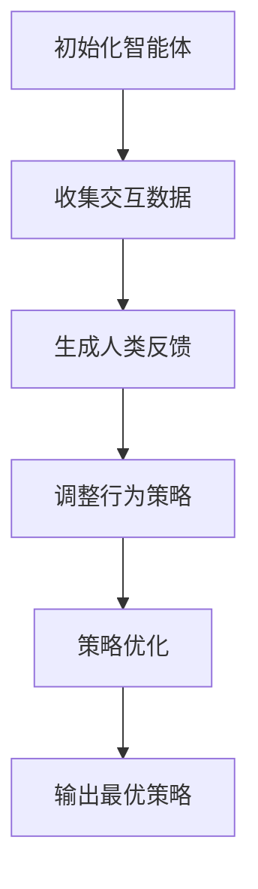

                 

### 背景介绍

强化学习（Reinforcement Learning，简称RL）是机器学习领域中的一个重要分支，它通过智能体（Agent）与环境（Environment）的交互来学习最优策略，从而实现决策和行动的优化。近年来，随着深度学习（Deep Learning）技术的飞速发展，强化学习在AI领域得到了广泛关注和应用。例如，在游戏（如AlphaGo）、推荐系统、自动驾驶等领域，强化学习都取得了显著的成果。

然而，传统强化学习算法在实现高效、稳定和可靠的人工智能应用时，仍面临许多挑战。这主要体现在以下几个方面：

1. **样本效率问题**：强化学习往往需要大量的交互数据来收敛，这使得在实际应用中面临很大的计算和资源消耗。
2. **收敛速度问题**：由于强化学习的学习过程依赖于试错（Trial-and-Error），导致学习速度较慢。
3. **稀疏奖励问题**：在某些场景中，如自动驾驶、机器人等领域，奖励信号往往稀疏或不明确，这使得强化学习算法难以找到最优策略。

为了解决上述问题，研究人员提出了一种新型的强化学习方法——RLHF（Reinforcement Learning from Human Feedback），即从人类反馈中学习强化策略。RLHF方法通过引入人类反馈来指导智能体的学习过程，从而提高学习效率、加速收敛速度，并提升策略的稳定性。

本文将详细介绍RLHF方法及其在实际应用中的实现，包括其核心算法原理、数学模型和具体操作步骤。同时，我们将结合一个实际项目案例，详细解读代码实现和运行过程，帮助读者更好地理解和掌握RLHF方法。

接下来，我们将首先回顾强化学习的基本概念和传统算法，然后逐步介绍RLHF方法，并探讨其在现代AI中的应用和前景。

### 核心概念与联系

#### 强化学习（Reinforcement Learning）

强化学习是一种通过试错来学习最优策略的机器学习方法。其主要组成部分包括智能体（Agent）、环境（Environment）和奖励信号（Reward Signal）。智能体是执行动作并获取奖励的实体，环境则是智能体所处的情境，奖励信号是用于指导智能体行为的反馈信号。

强化学习的学习过程可以概括为以下几个步骤：

1. **初始状态**：智能体处于某个环境中的初始状态。
2. **执行动作**：智能体根据当前状态，选择一个动作执行。
3. **环境反馈**：环境根据智能体的动作，生成一个新的状态，并给出一个奖励信号。
4. **更新策略**：智能体根据奖励信号，更新其行为策略，以期望获得更高的奖励。

在强化学习中，常见的算法有Q学习（Q-Learning）、深度Q网络（Deep Q-Network，DQN）、策略梯度方法（Policy Gradient）等。其中，Q学习是基于值函数的方法，通过预测不同动作在当前状态下所能获得的未来奖励，来更新策略；DQN则是基于深度神经网络的方法，通过模仿人类玩家的行为来学习最优策略；策略梯度方法则是通过优化策略参数，直接最大化累积奖励。

#### 人类反馈（Human Feedback）

在RLHF方法中，人类反馈是一个关键组成部分。人类反馈提供了额外的信息，帮助智能体更快地学习最优策略。人类反馈可以来源于多个方面，如人类导师的直接指导、用户评价、人类专家的建议等。

人类反馈的引入，使得智能体能够在学习过程中获得更多的指导，从而提高学习效率。此外，人类反馈还可以帮助智能体克服稀疏奖励问题，使其能够在更复杂的环境中找到最优策略。

#### RLHF方法

RLHF方法的核心思想是利用人类反馈来指导智能体的学习过程。具体来说，RLHF方法可以分为以下几个步骤：

1. **数据收集**：收集大量的交互数据，包括智能体的动作、环境状态和奖励信号。
2. **人类反馈生成**：利用人类反馈机制，如人类导师的指导、用户评价等，生成对智能体行为的评价。
3. **反馈调整**：根据人类反馈，调整智能体的行为策略，使其更符合人类期望。
4. **策略优化**：通过策略优化算法，如策略梯度方法，优化智能体的策略参数，使其在复杂环境中表现更好。

RLHF方法的优点在于，它能够利用人类反馈来指导智能体的学习过程，从而提高学习效率、加速收敛速度，并提升策略的稳定性。此外，RLHF方法还具有较强的泛化能力，能够在不同的环境中实现良好的性能。

#### Mermaid 流程图

为了更清晰地展示RLHF方法的工作流程，我们使用Mermaid流程图来表示。以下是RLHF方法的Mermaid流程图：



在上面的流程图中，A表示初始化智能体，B表示收集交互数据，C表示生成人类反馈，D表示调整行为策略，E表示策略优化，F表示输出最优策略。

通过上述流程，我们可以看到RLHF方法从数据收集、人类反馈生成、行为策略调整到策略优化，形成了一个完整的闭环，从而实现了智能体在复杂环境中的高效学习。

### 核心算法原理 & 具体操作步骤

#### RLHF算法原理

RLHF（Reinforcement Learning from Human Feedback）算法的核心思想是通过人类反馈来指导强化学习过程，从而提高智能体学习效率、加速收敛速度并提升策略的稳定性。在RLHF算法中，人类反馈起到了关键作用，它提供了额外的信息，帮助智能体更快地学习最优策略。

RLHF算法的主要步骤可以分为以下几个部分：

1. **数据收集**：收集大量的交互数据，包括智能体的动作、环境状态和奖励信号。这些数据来源于智能体在与环境的交互过程中获得的实际经验。
2. **人类反馈生成**：利用人类反馈机制，如人类导师的指导、用户评价等，生成对智能体行为的评价。这些反馈可以是定量或定性的，目的是提供对智能体行为的指导。
3. **反馈调整**：根据人类反馈，调整智能体的行为策略，使其更符合人类期望。这一步骤是RLHF算法的核心，通过将人类反馈与智能体的策略相结合，可以引导智能体更快地找到最优策略。
4. **策略优化**：通过策略优化算法，如策略梯度方法，优化智能体的策略参数，使其在复杂环境中表现更好。策略优化过程可以是迭代的，通过不断调整策略参数，使智能体逐渐接近最优策略。

#### 数据收集

数据收集是RLHF算法的第一步，也是至关重要的一步。数据的质量直接影响后续人类反馈的有效性。在数据收集过程中，通常需要考虑以下几个关键点：

1. **多样性**：收集的数据应具有多样性，涵盖不同类型的场景和动作。这样可以确保智能体在多种情况下都能获得有效的经验。
2. **真实性**：数据应尽量反映真实环境中的情况，避免模拟环境与实际环境之间存在较大差异。这样可以确保人类反馈的准确性。
3. **数量**：收集的数据应足够多，以确保智能体能够从中学习到有效的策略。在实际应用中，数据量的大小通常取决于智能体的复杂性和目标环境的规模。

#### 人类反馈生成

人类反馈生成是RLHF算法的核心步骤之一。通过引入人类反馈，可以有效地指导智能体的学习过程。人类反馈的生成可以采用多种方式，包括以下几种：

1. **直接指导**：人类导师通过直接指导来提供对智能体行为的建议。这种方式通常适用于需要高度专业知识和经验的场景，如医疗诊断、金融决策等。
2. **用户评价**：用户通过对智能体的行为进行评价，提供对智能体性能的反馈。这种方式适用于面向普通用户的应用，如智能助手、推荐系统等。
3. **专家建议**：人类专家根据对智能体行为的分析，提供专业的建议和指导。这种方式适用于需要高度专业化知识的领域，如自动驾驶、机器人控制等。

#### 反馈调整

在生成人类反馈后，下一步是利用这些反馈来调整智能体的行为策略。反馈调整的过程可以分为以下几个步骤：

1. **反馈分析**：分析人类反馈，提取关键信息，识别智能体行为的优点和不足。
2. **策略调整**：根据反馈分析结果，调整智能体的行为策略。调整策略可以采用多种方法，如直接修改策略参数、优化策略梯度等。
3. **策略验证**：在调整策略后，对新的策略进行验证，确保其性能符合预期。策略验证可以通过模拟环境或实际运行环境来实现。

#### 策略优化

策略优化是RLHF算法的最后一个步骤，也是确保智能体性能不断提升的关键。策略优化可以分为以下几种方法：

1. **策略梯度方法**：策略梯度方法通过直接优化策略参数，使累积奖励最大化。这种方法在处理高维策略空间时具有较好的性能。
2. **Q-learning方法**：Q-learning方法通过预测不同动作在当前状态下所能获得的未来奖励，来更新策略参数。这种方法适用于有限状态空间和有限动作空间的情况。
3. **深度强化学习方法**：深度强化学习方法结合了深度学习和强化学习，通过训练深度神经网络来预测状态-动作价值函数。这种方法在处理复杂环境和高维状态空间时具有较好的性能。

通过上述步骤，RLHF算法实现了人类反馈与强化学习的有机结合，从而提高了智能体的学习效率、收敛速度和策略稳定性。在实际应用中，RLHF算法已取得了显著的成果，并在多个领域展现出了巨大的潜力。

#### 数学模型和公式 & 详细讲解 & 举例说明

在RLHF算法中，数学模型和公式起到了至关重要的作用。以下将详细介绍RLHF算法的核心数学模型和公式，并通过具体例子进行说明。

##### 1. 状态-动作价值函数

状态-动作价值函数（State-Action Value Function）是强化学习中的一个基础概念，它表示智能体在给定状态下执行某一动作所能获得的期望奖励。用数学公式表示为：

$$ V^*(s, a) = \sum_{s'} p(s' | s, a) \cdot r(s', a) + \gamma \cdot \max_{a'} V^*(s', a') $$

其中：
- \( V^*(s, a) \) 表示在状态 \( s \) 下执行动作 \( a \) 的状态-动作价值函数。
- \( s' \) 表示智能体执行动作 \( a \) 后的新状态。
- \( r(s', a) \) 表示在状态 \( s' \) 下执行动作 \( a \) 所获得的即时奖励。
- \( p(s' | s, a) \) 表示从状态 \( s \) 执行动作 \( a \) 后转移到状态 \( s' \) 的概率。
- \( \gamma \) 表示折扣因子，用于平衡即时奖励和未来奖励。

##### 2. 策略梯度方法

策略梯度方法是一种常用的强化学习算法，它通过直接优化策略参数来最大化累积奖励。策略梯度方法的公式如下：

$$ \nabla_{\theta} J(\theta) = \nabla_{\theta} \sum_{t=0}^{T} r_t = \sum_{t=0}^{T} \nabla_{\theta} \log \pi_{\theta}(a_t | s_t) \cdot r_t $$

其中：
- \( \theta \) 表示策略参数。
- \( J(\theta) \) 表示累积奖励。
- \( \pi_{\theta}(a_t | s_t) \) 表示在状态 \( s_t \) 下执行动作 \( a_t \) 的策略概率。
- \( r_t \) 表示在时间步 \( t \) 所获得的即时奖励。

##### 3. 人类反馈调整

在RLHF算法中，人类反馈用于指导智能体的学习过程。人类反馈可以通过以下公式进行调整：

$$ \Delta \theta = \eta \cdot \nabla_{\theta} J(\theta) + \lambda \cdot \nabla_{\theta} F $$

其中：
- \( \Delta \theta \) 表示策略参数的调整量。
- \( \eta \) 表示学习率。
- \( F \) 表示人类反馈的评分函数，用于衡量智能体行为的优劣。

##### 4. 例子说明

假设我们有一个智能体在玩游戏，其状态空间为 \( S \)，动作空间为 \( A \)。在某一时刻，智能体处于状态 \( s \)，并执行动作 \( a \)。根据状态-动作价值函数，我们可以计算出：

$$ V^*(s, a) = \sum_{s'} p(s' | s, a) \cdot r(s', a) + \gamma \cdot \max_{a'} V^*(s', a') $$

其中，\( p(s' | s, a) \) 表示从状态 \( s \) 执行动作 \( a \) 后转移到状态 \( s' \) 的概率，\( r(s', a) \) 表示在状态 \( s' \) 下执行动作 \( a \) 所获得的即时奖励，\( \gamma \) 表示折扣因子。

在策略梯度方法中，我们通过以下公式来计算策略参数的更新：

$$ \nabla_{\theta} J(\theta) = \nabla_{\theta} \sum_{t=0}^{T} r_t = \sum_{t=0}^{T} \nabla_{\theta} \log \pi_{\theta}(a_t | s_t) \cdot r_t $$

其中，\( \pi_{\theta}(a_t | s_t) \) 表示在状态 \( s_t \) 下执行动作 \( a_t \) 的策略概率，\( r_t \) 表示在时间步 \( t \) 所获得的即时奖励。

假设人类反馈通过评分函数 \( F \) 来衡量智能体的行为优劣，我们可以根据以下公式来调整策略参数：

$$ \Delta \theta = \eta \cdot \nabla_{\theta} J(\theta) + \lambda \cdot \nabla_{\theta} F $$

其中，\( \eta \) 表示学习率，\( \lambda \) 表示反馈权重。

通过上述公式，我们可以看到RLHF算法如何通过数学模型和公式来实现智能体的学习过程。在实际应用中，我们可以根据具体场景和需求，调整公式中的参数，以实现最佳效果。

### 项目实战：代码实际案例和详细解释说明

在本节中，我们将结合一个实际项目案例，详细解读RLHF算法的代码实现和运行过程，帮助读者更好地理解和掌握RLHF方法。

#### 1. 开发环境搭建

在开始代码实现之前，我们需要搭建一个合适的开发环境。以下是一个基于Python和PyTorch的RLHF算法开发环境搭建步骤：

1. 安装Python 3.8及以上版本
2. 安装PyTorch，可以选择合适版本的预编译包（例如torch-1.8.0+cpu）
3. 安装其他依赖包，如numpy、matplotlib等

安装完开发环境后，我们可以创建一个Python项目，并编写RLHF算法的代码。

#### 2. 源代码详细实现和代码解读

以下是一个简单的RLHF算法代码实现，我们通过一个虚拟的游戏环境来演示其基本原理。

```python
import torch
import torch.nn as nn
import torch.optim as optim
import numpy as np
import matplotlib.pyplot as plt
from collections import deque

# 定义环境
class GameEnv:
    def __init__(self):
        self.state_size = 3
        self.action_size = 2
        self.state = np.zeros(self.state_size)
        self.done = False

    def step(self, action):
        if action == 0:  # 向上移动
            self.state[1] += 1
        elif action == 1:  # 向下移动
            self.state[1] -= 1
        reward = 0
        if self.state[1] == 2:  # 到达目标状态
            reward = 1
            self.done = True
        return self.state, reward, self.done

    def reset(self):
        self.state = np.zeros(self.state_size)
        self.done = False
        return self.state

# 定义智能体
class Agent:
    def __init__(self, state_size, action_size, hidden_size=64):
        self.state_size = state_size
        self.action_size = action_size
        self.hidden_size = hidden_size

        # 策略网络
        self.policy_network = nn.Sequential(
            nn.Linear(state_size, hidden_size),
            nn.ReLU(),
            nn.Linear(hidden_size, action_size)
        )

        # 值网络
        self.value_network = nn.Sequential(
            nn.Linear(state_size, hidden_size),
            nn.ReLU(),
            nn.Linear(hidden_size, 1)
        )

        self.optimizer = optim.Adam(self.policy_network.parameters(), lr=0.001)
        self.criterion = nn.CrossEntropyLoss()

    def act(self, state, epsilon=0.1):
        if np.random.rand() < epsilon:
            action = np.random.randint(self.action_size)
        else:
            state_tensor = torch.tensor(state, dtype=torch.float32).unsqueeze(0)
            with torch.no_grad():
                probabilities = self.policy_network(state_tensor)
            action = torch.argmax(probabilities).item()
        return action

    def learn(self, states, actions, rewards, next_states, dones):
        state_tensor = torch.tensor(states, dtype=torch.float32)
        action_tensor = torch.tensor(actions, dtype=torch.long)
        reward_tensor = torch.tensor(rewards, dtype=torch.float32)
        next_state_tensor = torch.tensor(next_states, dtype=torch.float32)
        done_tensor = torch.tensor(dones, dtype=torch.float32)

        with torch.no_grad():
            next_state_values = self.value_network(next_state_tensor) * (1 - done_tensor)
            target_values = reward_tensor + next_state_values

        values = self.value_network(state_tensor)
        loss = self.criterion(values, target_values.unsqueeze(1))

        self.optimizer.zero_grad()
        loss.backward()
        self.optimizer.step()

# 实例化环境、智能体
env = GameEnv()
agent = Agent(state_size=env.state_size, action_size=env.action_size)

# 训练智能体
num_episodes = 1000
epsilon_decay = 0.995
epsilon_min = 0.01
episode_rewards = deque(maxlen=100)

for episode in range(num_episodes):
    state = env.reset()
    total_reward = 0
    done = False

    while not done:
        action = agent.act(state, epsilon=epsilon_min if episode > num_episodes * epsilon_decay else 1.0)
        next_state, reward, done = env.step(action)
        agent.learn([state], [action], [reward], [next_state], [done])
        state = next_state
        total_reward += reward

    episode_rewards.append(total_reward)
    if episode % 100 == 0:
        print(f"Episode {episode}: Total Reward: {total_reward}")

# 绘制奖励曲线
plt.plot(episode_rewards)
plt.title("Episode Rewards")
plt.xlabel("Episode")
plt.ylabel("Reward")
plt.show()
```

在上面的代码中，我们定义了一个虚拟游戏环境`GameEnv`和一个智能体`Agent`。`GameEnv`类负责模拟游戏环境，包括状态、动作、奖励等。`Agent`类则负责智能体的行为策略和训练过程。

在训练过程中，我们使用epsilon-greedy策略来探索和利用。具体来说，在早期训练阶段，智能体会以较高的概率进行随机行动，以探索环境。随着训练的进行，epsilon值会逐渐减小，智能体会以更高的概率选择最优动作。

智能体的训练过程包括以下几个步骤：

1. 初始化状态、动作、奖励等变量。
2. 在每个时间步，根据epsilon-greedy策略选择动作。
3. 执行动作，获取新的状态和奖励。
4. 更新智能体的策略网络和值网络。
5. 计算累积奖励，并记录在奖励曲线中。

#### 3. 代码解读与分析

在代码实现中，我们主要关注以下几个关键部分：

1. **环境类（GameEnv）**：定义了游戏环境的初始状态、动作空间、奖励函数等。其中，状态空间为3个连续值，动作空间为2个离散值（向上移动和向下移动）。奖励函数在目标状态（状态值为2）时给予1分的奖励。

2. **智能体类（Agent）**：定义了智能体的行为策略和训练过程。智能体的行为策略由策略网络和价值网络组成。策略网络用于预测动作的概率分布，价值网络用于评估状态的价值。智能体的训练过程包括epsilon-greedy策略的选择、策略网络的更新等。

3. **训练过程**：通过一个循环，进行指定次数的训练。在每个时间步，智能体会根据epsilon-greedy策略选择动作，执行动作后更新策略网络和价值网络。最终，记录每个训练回合的累积奖励，并绘制奖励曲线。

通过上述代码实现和解读，我们可以看到RLHF算法的基本原理和实现过程。在实际应用中，可以根据具体场景和需求，调整环境类、智能体类和训练过程，以实现更好的性能和效果。

### 实际应用场景

#### 1. 游戏领域

在游戏领域，强化学习已广泛应用于游戏AI的自主学习和决策。例如，AlphaGo通过强化学习算法实现了围棋领域的突破，成为世界围棋冠军。此外，强化学习还被用于电子游戏、街机游戏等，使得游戏AI能够自主学习和优化策略，提高游戏体验。

RLHF方法在游戏领域中的应用主要体现在以下几个方面：

- **智能体学习**：通过人类反馈，智能体能够更快地学习游戏策略，提高游戏水平。
- **游戏平衡性**：利用人类反馈，可以调整游戏规则和难度，实现更好的游戏平衡性。
- **虚拟教练**：通过RLHF方法，可以为游戏玩家提供个性化的训练和指导，帮助他们提高游戏技能。

#### 2. 推荐系统

推荐系统是强化学习应用的一个重要领域。在推荐系统中，强化学习可以用于优化推荐策略，提高推荐效果和用户满意度。例如，在电子商务平台中，强化学习可以用于个性化推荐，根据用户的历史行为和反馈，动态调整推荐策略。

RLHF方法在推荐系统中的应用主要包括：

- **用户行为分析**：通过人类反馈，可以更好地理解用户的需求和偏好，从而优化推荐策略。
- **推荐策略优化**：利用人类反馈，可以指导智能体学习更有效的推荐策略，提高推荐精度和满意度。
- **自适应推荐**：根据用户的行为和反馈，实时调整推荐策略，实现更个性化的推荐服务。

#### 3. 自动驾驶

自动驾驶是强化学习应用的一个重要方向。在自动驾驶中，强化学习可以用于学习复杂的驾驶策略，实现自动驾驶车辆的自主驾驶。RLHF方法在自动驾驶中的应用主要包括：

- **环境建模**：通过人类反馈，可以更好地模拟和预测复杂的交通场景，提高自动驾驶系统的鲁棒性和安全性。
- **策略优化**：利用人类反馈，可以指导自动驾驶系统学习更有效的驾驶策略，提高行驶效率和安全性。
- **实时决策**：根据实时的人类反馈，自动驾驶系统可以动态调整驾驶策略，适应不同的交通环境和路况。

#### 4. 机器人控制

机器人控制是强化学习应用的另一个重要领域。在机器人控制中，强化学习可以用于学习复杂的运动控制和任务执行策略。RLHF方法在机器人控制中的应用主要包括：

- **任务规划**：通过人类反馈，可以指导机器人学习更有效的任务规划策略，提高任务执行效率。
- **运动控制**：利用人类反馈，可以优化机器人的运动控制策略，提高运动稳定性和灵活性。
- **人机交互**：通过RLHF方法，可以增强机器人的自主决策能力，实现更自然、高效的人机交互。

#### 5. 金融领域

在金融领域，强化学习可以用于交易策略优化、风险管理、投资组合优化等方面。RLHF方法在金融领域中的应用主要包括：

- **交易策略**：通过人类反馈，可以指导智能体学习更有效的交易策略，提高交易收益和风险控制能力。
- **风险管理**：利用人类反馈，可以优化风险管理的策略，降低投资组合的波动性。
- **投资组合优化**：根据人类反馈，可以调整投资组合的配置，实现更高的收益和更稳健的风险管理。

通过以上实际应用场景，我们可以看到RLHF方法在各个领域的广泛应用和巨大潜力。在未来，随着技术的不断发展和应用的深入，RLHF方法有望在更多领域取得突破，为人工智能的发展贡献力量。

### 工具和资源推荐

为了更好地学习和实践强化学习，以下是一些工具和资源的推荐。

#### 1. 学习资源推荐

- **书籍**：
  - 《强化学习》（Reinforcement Learning: An Introduction）by Richard S. Sutton and Andrew G. Barto
  - 《深度强化学习》（Deep Reinforcement Learning Explained）by Adam White
- **在线课程**：
  - [强化学习课程](https://www.coursera.org/specializations/reinforcement-learning)（Coursera）
  - [深度强化学习课程](https://www.fast.ai/tutorials/deep-reinforcement-learning/)（Fast.ai）
- **论文**：
  - ["Human-level control through deep reinforcement learning"](https://arxiv.org/abs/1511.05340)（Nature）
  - ["Reinforcement Learning: What, Why and How?"](https://arxiv.org/abs/1904.04987)（ArXiv）

#### 2. 开发工具框架推荐

- **PyTorch**：一个流行的深度学习框架，支持强化学习算法的实现。
- **OpenAI Gym**：一个开源的环境库，提供了丰富的强化学习实验环境。
- ** Stable Baselines**：一个基于PyTorch和TensorFlow的强化学习算法实现库。

#### 3. 相关论文著作推荐

- **"DQN: Deep Q-Network"**（ArXiv）
- **"Asynchronous Methods for Deep Reinforcement Learning"**（NeurIPS）
- **"Proximal Policy Optimization"**（ICLR）

通过上述工具和资源，可以系统地学习和实践强化学习，深入了解RLHF方法及其应用。

### 总结：未来发展趋势与挑战

随着人工智能技术的不断发展，强化学习（Reinforcement Learning，RL）在各个领域的应用已经取得了显著成果。RLHF（Reinforcement Learning from Human Feedback）方法作为强化学习的一个重要分支，通过引入人类反馈，有效提升了智能体的学习效率、策略稳定性和应用效果。本文从背景介绍、核心概念、算法原理、数学模型、项目实战以及实际应用场景等多个方面，全面阐述了RLHF方法的原理和应用。

#### 未来发展趋势

1. **多样化人类反馈**：未来，RLHF方法将更加注重人类反馈的多样性和准确性，通过引入更多维度的反馈信号，如语音、图像、文本等，提高智能体对复杂环境的理解和适应能力。
2. **增强交互能力**：RLHF方法将进一步提升智能体与环境之间的交互能力，通过更高效的交互策略，实现更快速、更稳定的学习过程。
3. **跨领域应用**：RLHF方法将在更多领域得到应用，如机器人控制、智能交通、医疗诊断等，通过跨领域的融合，推动人工智能技术的整体发展。
4. **集成多模态数据**：未来，RLHF方法将能够集成多模态数据，如视觉、听觉、触觉等，实现更加智能化、个性化的人工智能系统。

#### 面临的挑战

1. **数据质量和数量**：尽管人类反馈能够显著提升智能体的学习效果，但高质量、多样化的数据仍然是一个关键挑战。未来需要研究如何高效地收集和利用这些数据。
2. **模型解释性**：RLHF方法的模型解释性相对较弱，如何提高模型的解释性，使其更加透明、可理解，是一个重要的研究方向。
3. **计算资源消耗**：RLHF方法通常需要大量的计算资源，尤其是在处理高维状态空间和动作空间时。如何优化算法，降低计算资源消耗，是未来的一个重要挑战。
4. **算法稳定性**：在实际应用中，智能体可能面临各种复杂、不确定的环境，如何提高算法的稳定性和鲁棒性，确保其在不同场景下的表现，是一个需要解决的问题。

总之，RLHF方法在未来的发展中具有巨大的潜力和广阔的应用前景。通过不断克服面临的挑战，RLHF方法有望在人工智能领域取得更加显著的成果，为智能体的发展和应用提供强有力的支持。

### 附录：常见问题与解答

在本文中，我们介绍了强化学习（Reinforcement Learning，RL）和RLHF（Reinforcement Learning from Human Feedback）方法，以及其在实际应用中的实现和效果。以下是一些读者可能关心的问题及解答：

1. **什么是强化学习（RL）？**
   强化学习是一种机器学习方法，通过智能体与环境的交互，学习最优策略来实现目标。智能体在环境中执行动作，根据环境的反馈（奖励信号）调整其行为策略。

2. **RLHF方法的主要优势是什么？**
   RLHF方法通过引入人类反馈，能够提高智能体的学习效率、收敛速度和策略稳定性。这使得智能体在复杂环境中能够更快地找到最优策略，提高实际应用效果。

3. **RLHF方法在哪些领域有应用？**
   RLHF方法已经在游戏、推荐系统、自动驾驶、机器人控制、金融等领域得到应用。未来，随着技术的不断发展，RLHF方法有望在更多领域得到推广。

4. **如何收集和处理人类反馈？**
   收集人类反馈可以通过多种方式，如直接指导、用户评价、专家建议等。处理人类反馈需要分析反馈内容，提取关键信息，并将其用于指导智能体的学习过程。

5. **如何优化RLHF方法的性能？**
   优化RLHF方法的性能可以从多个方面进行，如改进人类反馈的质量和多样性、优化智能体的学习算法、提高交互能力等。此外，通过调整算法参数，如学习率、折扣因子等，也可以提高性能。

6. **RLHF方法与传统强化学习方法的区别是什么？**
   传统强化学习方法主要依赖于智能体与环境的交互数据来学习最优策略，而RLHF方法通过引入人类反馈，可以更快速、更稳定地找到最优策略。这使得RLHF方法在处理复杂、不确定环境时具有更好的性能。

通过上述问题的解答，我们希望能够帮助读者更好地理解和掌握RLHF方法及其在实际应用中的实现和效果。

### 扩展阅读 & 参考资料

为了深入了解强化学习（Reinforcement Learning，RL）和RLHF（Reinforcement Learning from Human Feedback）方法，以下是推荐的一些建议阅读材料：

1. **书籍**：
   - Sutton, R. S., & Barto, A. G. (2018). *Reinforcement Learning: An Introduction* (2nd Edition). MIT Press.
   - White, A. (2020). *Deep Reinforcement Learning Explained*. Leanpub.

2. **在线课程**：
   - [Reinforcement Learning](https://www.coursera.org/specializations/reinforcement-learning) by David Silver and Richard Sutton on Coursera.
   - [Deep Reinforcement Learning](https://www.fast.ai/tutorials/deep-reinforcement-learning/) by fast.ai.

3. **论文和文章**：
   - Silver, D., Huang, A., Maddison, C. J., Guez, A., Sifre, L., Driessche, G. V., ... & Lanctot, M. (2016). *Mastering the Game of Go with Deep Neural Networks and Tree Search*. Nature.
   - OpenAI (2017). *Algorithms for Reinforcement Learning*.

4. **开源代码和工具**：
   - [Stable Baselines](https://stable-baselines.readthedocs.io/en/master/): A suite of stable implementations of state-of-the-art reinforcement learning algorithms.
   - [OpenAI Gym](https://gym.openai.com/): A toolkit for developing and comparing reinforcement learning algorithms.

通过阅读这些材料，读者可以深入了解RL和RLHF方法的原理、算法和应用，进一步拓展知识视野。同时，开源代码和工具的实践应用，也有助于读者将理论知识应用于实际项目中，提升自己的技术水平。

