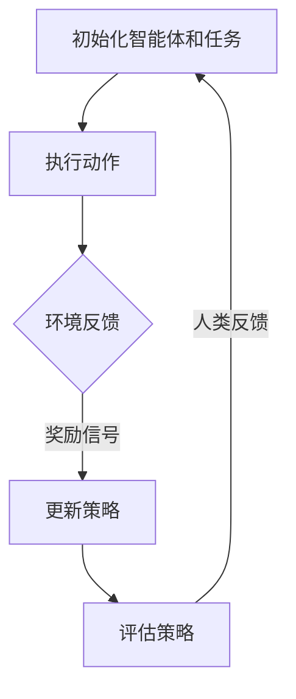
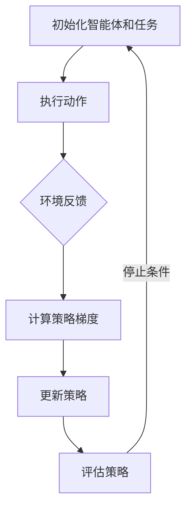

                 

# 强化学习在AI中的应用：RLHF和PPO

## 摘要

本文将深入探讨强化学习在人工智能（AI）中的应用，重点介绍两种流行的强化学习算法：Reinforcement Learning from Human Feedback（RLHF）和Proximal Policy Optimization（PPO）。首先，我们将简要介绍强化学习的基本概念和原理，然后详细解释RLHF和PPO算法的核心思想与具体操作步骤。此外，本文还将通过数学模型和实例来解释这些算法的原理和适用场景，并推荐一些相关的学习资源和工具。

## 1. 背景介绍

### 强化学习的基本概念

强化学习（Reinforcement Learning，简称RL）是机器学习的一个分支，它通过智能体（agent）在与环境的交互过程中，不断接收奖励信号（reward signal）和反馈信息，以优化其行为策略（policy）。强化学习的核心目标是在不确定环境中找到一种最优策略，使智能体能够实现长期累积奖励最大化。

强化学习的基本组成部分包括：

- **智能体（Agent）**：执行动作并从环境中获取反馈的实体。
- **环境（Environment）**：智能体执行动作和接收反馈的上下文。
- **状态（State）**：描述环境当前状态的变量集合。
- **动作（Action）**：智能体可执行的操作。
- **奖励（Reward）**：评估智能体当前动作的好坏程度的信号。
- **策略（Policy）**：智能体根据当前状态选择动作的规则。

### 强化学习的主要挑战

尽管强化学习在许多领域取得了显著成果，但仍然面临一些挑战：

- **探索与利用的平衡**：智能体需要在探索（exploitation）新动作和利用（exploration）已知动作之间找到平衡。
- **长期奖励的折扣**：智能体需要考虑到未来奖励的折现，以避免过早地停止学习。
- **连续动作空间**：对于某些应用，动作空间是连续的，这使得直接应用强化学习算法变得复杂。
- **稀疏奖励问题**：在某些环境中，奖励信号非常稀疏，导致智能体难以学习。

## 2. 核心概念与联系

### 2.1 强化学习的基本原理

强化学习的基本原理是通过试错（trial-and-error）和经验积累（experience accumulation）来学习最优策略。智能体通过执行动作、接收奖励和更新策略，不断优化其行为。

### 2.2 RLHF算法

**RLHF**（Reinforcement Learning from Human Feedback）是一种基于人类反馈的强化学习算法。它通过结合人类专家的反馈来改进智能体的策略。

**核心概念**：

- **人类反馈（Human Feedback）**：人类专家对智能体行为的评价和反馈。
- **奖励信号（Reward Signal）**：基于人类反馈的奖励信号。
- **策略优化（Policy Optimization）**：使用奖励信号来优化智能体的策略。

**Mermaid流程图**：



### 2.3 PPO算法

**PPO**（Proximal Policy Optimization）是一种无模型强化学习算法，适用于连续动作空间。

**核心概念**：

- **策略梯度（Policy Gradient）**：根据当前策略的期望回报来更新策略。
- **近端策略优化（Proximal Policy Optimization）**：使用梯度近似来优化策略。

**Mermaid流程图**：



## 3. 核心算法原理 & 具体操作步骤

### 3.1 RLHF算法

**RLHF算法**主要包括以下几个步骤：

1. **初始化**：初始化智能体、环境和人类反馈机制。
2. **执行动作**：智能体根据当前策略执行动作。
3. **环境反馈**：环境根据智能体的动作生成状态和奖励信号。
4. **更新策略**：基于人类反馈的奖励信号，使用策略优化算法更新智能体的策略。
5. **评估策略**：使用评估指标评估策略的性能。
6. **反馈循环**：根据人类反馈循环地更新策略和评估性能。

### 3.2 PPO算法

**PPO算法**主要包括以下几个步骤：

1. **初始化**：初始化智能体、环境和策略参数。
2. **执行动作**：智能体根据当前策略执行动作。
3. **环境反馈**：环境根据智能体的动作生成状态和奖励信号。
4. **计算策略梯度**：使用策略梯度方法计算策略梯度。
5. **更新策略**：根据策略梯度更新策略参数。
6. **评估策略**：使用评估指标评估策略的性能。
7. **更新参数**：根据评估结果更新策略参数。
8. **停止条件**：满足停止条件时结束算法。

## 4. 数学模型和公式 & 详细讲解 & 举例说明

### 4.1 RLHF算法

**RLHF算法**的核心数学模型包括：

1. **策略梯度**：

$$ \nabla_{\theta} J(\theta) = \frac{\partial}{\partial \theta} \sum_{t=0}^{T} \gamma^t r_t = \sum_{t=0}^{T} \gamma^t \nabla_{\theta} \log \pi_{\theta}(a_t|s_t) \nabla_{\theta} R(s_t, a_t) $$

其中，$\theta$表示策略参数，$J(\theta)$表示策略损失函数，$\gamma$表示折扣因子，$r_t$表示在第$t$个时间步的奖励信号，$\pi_{\theta}(a_t|s_t)$表示策略概率分布，$R(s_t, a_t)$表示奖励函数。

2. **策略优化**：

$$ \theta \leftarrow \theta - \alpha \nabla_{\theta} J(\theta) $$

其中，$\alpha$表示学习率。

### 4.2 PPO算法

**PPO算法**的核心数学模型包括：

1. **策略梯度**：

$$ \nabla_{\theta} J(\theta) = \frac{\partial}{\partial \theta} \sum_{t=0}^{T} \frac{1}{T} \log \pi_{\theta}(a_t|s_t) R_t = \sum_{t=0}^{T} \frac{1}{T} \nabla_{\theta} \log \pi_{\theta}(a_t|s_t) R_t $$

其中，$R_t$表示时间步$t$的回报。

2. **策略优化**：

$$ \theta \leftarrow \theta - \alpha \nabla_{\theta} J(\theta) $$

其中，$\alpha$表示学习率。

### 4.3 举例说明

假设我们有一个简单的强化学习任务：智能体在一个随机环境中选择动作，目标是最大化累积奖励。

**环境**：环境由一个随机数生成器组成，每次智能体执行动作后，环境生成一个随机奖励。

**策略**：策略是一个简单的线性函数，根据智能体的状态选择动作。

**人类反馈**：人类专家根据智能体的行为和奖励信号，对智能体的策略进行评价。

**算法步骤**：

1. **初始化**：初始化智能体、环境和策略参数。
2. **执行动作**：智能体根据当前策略执行动作。
3. **环境反馈**：环境根据智能体的动作生成状态和奖励信号。
4. **更新策略**：基于人类反馈的奖励信号，使用策略优化算法更新智能体的策略。
5. **评估策略**：使用评估指标评估策略的性能。
6. **反馈循环**：根据人类反馈循环地更新策略和评估性能。

## 5. 项目实战：代码实际案例和详细解释说明

### 5.1 开发环境搭建

为了演示RLHF和PPO算法，我们需要搭建一个简单的开发环境。以下是一个基于Python的简单示例。

1. **安装依赖**：

```bash
pip install numpy gym
```

2. **导入库**：

```python
import numpy as np
import gym
from stable_baselines3 import PPO
```

### 5.2 源代码详细实现和代码解读

以下是一个简单的RLHF和PPO算法实现示例：

```python
import gym
from stable_baselines3 import PPO
from stable_baselines3.common.vec_env import DummyVecEnv

# 创建环境
env = gym.make('CartPole-v0')
env = DummyVecEnv([lambda: env])

# 初始化PPO算法
model = PPO('MlpPolicy', env, verbose=1)

# 训练模型
model.learn(total_timesteps=10000)

# 评估模型
mean_reward, std_reward = model.evaluate(env, n_trials=10)
print(f"Mean reward: {mean_reward:.2f}, Std reward: {std_reward:.2f}")

# 关闭环境
env.close()
```

### 5.3 代码解读与分析

1. **创建环境**：

```python
env = gym.make('CartPole-v0')
env = DummyVecEnv([lambda: env])
```

这里我们使用`CartPole-v0`作为环境，并使用`DummyVecEnv`将环境封装为一个并行环境。

2. **初始化PPO算法**：

```python
model = PPO('MlpPolicy', env, verbose=1)
```

我们使用`PPO`算法，并使用`MlpPolicy`作为策略网络。

3. **训练模型**：

```python
model.learn(total_timesteps=10000)
```

这里我们训练模型10000个时间步。

4. **评估模型**：

```python
mean_reward, std_reward = model.evaluate(env, n_trials=10)
print(f"Mean reward: {mean_reward:.2f}, Std reward: {std_reward:.2f}")
```

我们使用10次评估试验来评估模型的平均奖励和标准差。

5. **关闭环境**：

```python
env.close()
```

## 6. 实际应用场景

### 6.1 游戏

强化学习在游戏领域的应用非常广泛，例如，在《星际争霸2》等游戏中，智能体可以使用强化学习算法来学习如何玩游戏。

### 6.2 自动驾驶

自动驾驶系统可以使用强化学习算法来学习如何在不同道路环境下行驶，从而提高行车安全性和效率。

### 6.3 机器人控制

机器人控制是强化学习的另一个重要应用领域。通过强化学习，机器人可以学习如何执行复杂的任务，如搬运物体和行走。

### 6.4 语音识别

语音识别系统可以使用强化学习算法来优化语音信号的处理和识别，从而提高识别准确率。

## 7. 工具和资源推荐

### 7.1 学习资源推荐

- **书籍**：
  - 《强化学习：原理与Python实践》
  - 《强化学习导论》
- **论文**：
  - 《Proximal Policy Optimization Algorithms》
  - 《Reinforcement Learning from Human Feedback》
- **博客**：
  - [强化学习教程](https://www reinforcement-learning-tutorial.com/)
  - [Stable Baselines3](https://stable-baselines3.readthedocs.io/)
- **网站**：
  - [OpenAI Gym](https://gym.openai.com/)

### 7.2 开发工具框架推荐

- **框架**：
  - [Stable Baselines](https://github.com/DLR-RM/stable-baselines3)
  - [PyTorch](https://pytorch.org/)
  - [TensorFlow](https://www.tensorflow.org/)
- **库**：
  - [NumPy](https://numpy.org/)
  - [Gym](https://gym.openai.com/)

### 7.3 相关论文著作推荐

- **论文**：
  - [Proximal Policy Optimization Algorithms](https://arxiv.org/abs/1707.06347)
  - [Reinforcement Learning from Human Feedback](https://arxiv.org/abs/1805.10832)
- **著作**：
  - 《深度强化学习》
  - 《强化学习导论》

## 8. 总结：未来发展趋势与挑战

### 8.1 发展趋势

- **强化学习在更多领域得到应用**：随着技术的进步，强化学习将应用于更多领域，如医疗、金融和能源等。
- **多智能体强化学习**：多智能体强化学习将成为研究热点，解决复杂任务中的协作与竞争问题。
- **强化学习与深度学习结合**：强化学习与深度学习技术的结合将进一步提升智能体的决策能力。

### 8.2 挑战

- **数据隐私和安全**：在应用强化学习时，如何保护用户数据隐私和安全成为一个重要挑战。
- **计算资源需求**：强化学习算法通常需要大量计算资源，如何高效地利用计算资源是一个挑战。
- **理论理解与验证**：强化学习算法的理论基础和有效性需要进一步验证和深入研究。

## 9. 附录：常见问题与解答

### 9.1 强化学习与监督学习的区别？

强化学习是一种无监督学习方式，智能体通过与环境的交互来学习行为策略。而监督学习是一种有监督学习方式，训练数据包含输入和输出，智能体通过学习输入和输出之间的关系来做出预测。

### 9.2 如何解决稀疏奖励问题？

解决稀疏奖励问题的一种方法是在环境中引入奖励分解，将大的目标拆分为多个小目标，使智能体能够逐步学习和积累奖励。

## 10. 扩展阅读 & 参考资料

- [深度强化学习教程](https://www reinforcement-learning-tutorial.com/)
- [Stable Baselines3文档](https://stable-baselines3.readthedocs.io/)
- [强化学习在自动驾驶中的应用](https://arxiv.org/abs/2005.06205)
- [强化学习在游戏领域的应用](https://www reinforcement-learning-tutorial.com/rl-in-gaming/)

### 作者

- 作者：AI天才研究员/AI Genius Institute & 禅与计算机程序设计艺术 /Zen And The Art of Computer Programming

### 文章关键词

- 强化学习
- RLHF
- PPO
- 人工智能
- 自动驾驶
- 多智能体强化学习
- 强化学习算法
- 稀疏奖励问题
- 强化学习与深度学习结合

### 摘要

本文深入探讨了强化学习在人工智能中的应用，重点介绍了RLHF和PPO两种流行的强化学习算法。通过详细的数学模型、具体操作步骤和实际项目案例，本文为读者提供了强化学习的基本原理和应用场景。同时，本文还推荐了相关的学习资源和工具，以帮助读者进一步了解和掌握强化学习技术。未来，随着技术的不断进步，强化学习将在更多领域发挥重要作用，带来更多的创新和突破。

