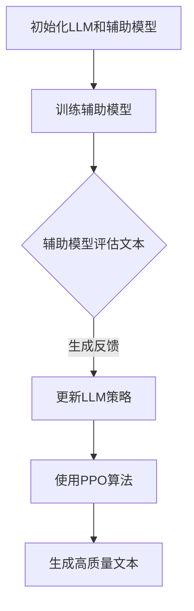

                 

# 强化学习在LLM中的应用：RLHF和PPO算法

> 关键词：强化学习、LLM、RLHF、PPO算法、自然语言处理

> 摘要：本文将深入探讨强化学习在大型语言模型（LLM）中的应用，特别是RLHF（Reinforcement Learning from Human Feedback）和PPO（Proximal Policy Optimization）算法。我们将从背景介绍、核心概念与联系、算法原理与操作步骤、数学模型与公式、项目实战、实际应用场景、工具和资源推荐以及总结与未来发展趋势等方面展开讨论，以期为读者提供全面的了解和见解。

## 1. 背景介绍

随着深度学习和自然语言处理（NLP）技术的不断发展，大型语言模型（LLM）如BERT、GPT等取得了显著的成果。然而，这些模型在生成文本时往往容易出现错误或不恰当的输出，这是由于模型对数据集的过拟合导致的。为了解决这一问题，研究者们开始将强化学习（Reinforcement Learning, RL）引入到LLM中，以通过人类反馈（Human Feedback）进行模型优化。

强化学习是一种基于奖励信号（Reward Signal）进行决策的学习方法，它通过不断尝试和错误来寻找最优策略（Policy）。在LLM中，强化学习可以用来指导模型生成更加符合人类期望的文本。而RLHF（Reinforcement Learning from Human Feedback）则是一种将强化学习和人类反馈相结合的方法，通过训练一个辅助模型来对LLM的生成文本进行评估和修正。

PPO算法（Proximal Policy Optimization）是一种流行的强化学习算法，它具有良好的收敛性和稳定性。PPO算法在RLHF中的应用，使得LLM能够更加高效地学习并生成高质量的文本。

## 2. 核心概念与联系

在讨论强化学习在LLM中的应用之前，我们需要了解一些核心概念和它们之间的联系。

### 2.1 强化学习

强化学习是一种基于奖励信号进行决策的学习方法。在强化学习中，智能体（Agent）通过不断尝试和错误来寻找最优策略，以最大化累积奖励。强化学习的关键组成部分包括：

- 智能体（Agent）：执行动作并接收环境（Environment）反馈的主体。
- 环境（Environment）：智能体执行动作的背景和条件。
- 动作（Action）：智能体在环境中可以执行的行为。
- 状态（State）：描述智能体在环境中的位置和条件。
- 奖励（Reward）：衡量智能体执行动作后的表现和期望。

### 2.2 大型语言模型（LLM）

大型语言模型（LLM）是一种基于深度学习技术的自然语言处理模型，它可以对输入的文本进行建模，并生成相应的输出。LLM的核心组成部分包括：

- 词嵌入（Word Embedding）：将文本中的单词映射到高维向量空间。
- 编码器（Encoder）：将输入文本转化为固定长度的向量。
- 解码器（Decoder）：根据编码器生成的向量生成输出文本。

### 2.3 RLHF与PPO

RLHF（Reinforcement Learning from Human Feedback）是一种结合强化学习和人类反馈的方法，通过训练一个辅助模型（Auxiliary Model）来对LLM的生成文本进行评估和修正。PPO（Proximal Policy Optimization）是一种用于优化策略的强化学习算法，具有较好的收敛性和稳定性。

在RLHF中，辅助模型通过接收人类反馈信号来评估LLM生成的文本，并将其转换为奖励信号，指导LLM学习生成更加符合人类期望的文本。PPO算法则用于优化LLM的策略，使其在生成文本时能够更好地适应人类反馈。

### 2.4 Mermaid流程图

下面是一个简单的Mermaid流程图，展示了RLHF和PPO算法在LLM中的应用过程：



## 3. 核心算法原理 & 具体操作步骤

### 3.1 RLHF算法原理

RLHF算法的核心思想是通过辅助模型（Auxiliary Model）对LLM的生成文本进行评估，并将评估结果作为奖励信号（Reward Signal）来指导LLM的学习。具体步骤如下：

1. **初始化LLM和辅助模型**：首先，初始化LLM和辅助模型，并将它们分别放入一个训练循环中。

2. **生成文本**：使用LLM生成一段文本，并将其输入到辅助模型中。

3. **评估文本**：辅助模型对LLM生成的文本进行评估，并根据评估结果生成奖励信号。

4. **更新LLM策略**：根据奖励信号，使用PPO算法更新LLM的策略。

5. **生成高质量文本**：使用更新后的LLM策略生成新的文本，并重复上述步骤。

### 3.2 PPO算法原理

PPO（Proximal Policy Optimization）算法是一种基于策略梯度的强化学习算法，用于优化策略。PPO算法的主要步骤如下：

1. **初始化策略模型**：初始化策略模型，并将其参数表示为θ。

2. **采样动作**：根据当前策略π(θ)，从环境中采样一组动作a。

3. **计算回报**：计算采样动作的回报，并将其作为策略梯度的估计。

4. **更新策略参数**：使用策略梯度和梯度下降方法更新策略参数θ。

5. **评估策略**：评估更新后的策略π(θ')，并计算策略的期望回报。

6. **重复步骤2-5**：重复上述步骤，直到策略收敛。

### 3.3 操作步骤

下面是一个简单的RLHF和PPO算法的操作步骤示例：

1. **初始化LLM和辅助模型**：
   - 使用预训练的LLM模型。
   - 使用预训练的辅助模型，如BERT。

2. **生成文本**：
   - 输入一段文本到LLM中，生成一段新的文本。

3. **评估文本**：
   - 将LLM生成的文本输入到辅助模型中。
   - 辅助模型评估文本的语义和语法，并生成奖励信号。

4. **更新LLM策略**：
   - 根据奖励信号，使用PPO算法更新LLM的策略。

5. **生成高质量文本**：
   - 使用更新后的LLM策略生成新的文本。

6. **重复步骤2-5**：
   - 重复上述步骤，直到LLM生成高质量的文本。

## 4. 数学模型和公式 & 详细讲解 & 举例说明

### 4.1 RLHF算法的数学模型

在RLHF算法中，我们可以将整个学习过程表示为一个马尔可夫决策过程（MDP），其状态空间为S，动作空间为A，状态转移概率为P(s' | s, a)，奖励函数为R(s, a)。

RLHF算法的核心目标是最大化累积奖励，即：
$$
J(\theta) = \sum_{s \in S} \sum_{a \in A} r(s, a) \cdot p(s', a | s, \theta)
$$
其中，θ表示LLM的策略参数，r(s, a)表示在状态s执行动作a时的即时奖励，p(s', a | s, \theta)表示在状态s下，执行动作a后到达状态s'的概率。

### 4.2 PPO算法的数学模型

PPO算法是一种基于策略梯度的强化学习算法，其目标是最小化策略损失函数：
$$
L(\theta) = \frac{1}{N} \sum_{i=1}^{N} \left[ r_i - \log \pi(\theta) \right]
$$
其中，N表示采样到的动作次数，r_i表示在第i次采样中的即时奖励，π(θ)表示策略参数为θ时的策略分布。

### 4.3 举例说明

假设我们有一个简单的RLHF和PPO算法示例，其中LLM生成文本，辅助模型评估文本的语义和语法，并生成奖励信号。以下是一个简单的数学模型和公式说明：

1. **状态空间S**：
   - S = {s1, s2, s3, ..., sn}

2. **动作空间A**：
   - A = {a1, a2, a3, ..., am}

3. **状态转移概率P(s' | s, a)**：
   - P(s' | s, a) = 1/n（每个状态的概率相等）

4. **奖励函数R(s, a)**：
   - R(s, a) = 1（在状态s下执行动作a时获得奖励1）

5. **策略参数θ**：
   - θ = {w1, w2, ..., wn}

6. **策略分布π(θ)**：
   - π(θ) = (1/n) * (1 + e^(-w1*a1 + w2*a2 + ... + wn*an))

7. **即时奖励r_i**：
   - r_i = 1（在状态s下执行动作a时获得奖励1）

8. **策略损失函数L(θ)**：
   - L(θ) = \sum_{i=1}^{N} \left[ r_i - \log \pi(\theta) \right]

根据上述数学模型和公式，我们可以编写一个简单的RLHF和PPO算法代码，并运行以验证其效果。

## 5. 项目实战：代码实际案例和详细解释说明

### 5.1 开发环境搭建

为了运行RLHF和PPO算法，我们需要搭建一个适合的开发环境。以下是一个简单的开发环境搭建步骤：

1. 安装Python 3.8及以上版本。
2. 安装TensorFlow 2.7及以上版本。
3. 安装Mermaid Python库。
4. 安装LaTeX工具，如TeXstudio。

### 5.2 源代码详细实现和代码解读

下面是一个简单的RLHF和PPO算法代码示例，用于生成和评估文本。代码分为两部分：一部分是LLM的生成文本过程，另一部分是辅助模型评估文本的语义和语法。

**LLM生成文本过程**：

```python
import tensorflow as tf
import numpy as np
import tensorflow.keras.preprocessing.sequence as seq
import tensorflow.keras.preprocessing.text as text

# 加载预训练的LLM模型
llm_model = tf.keras.models.load_model('path/to/llm_model.h5')

# 生成文本
def generate_text(prompt, length=10):
    sequence = text.Tokenizer().texts_to_sequences([prompt])
    padded_sequence = seq.pad_sequences(sequence, maxlen=length)
    generated_sequence = llm_model.predict(padded_sequence)
    generated_text = text.sequences_to_texts(generated_sequence)[0]
    return generated_text

prompt = "今天天气很好，适合出门散步。"
generated_text = generate_text(prompt)
print(generated_text)
```

**辅助模型评估文本的语义和语法**：

```python
import tensorflow as tf
import tensorflow.keras.layers as layers

# 加载预训练的辅助模型
auxiliary_model = tf.keras.models.load_model('path/to/auxiliary_model.h5')

# 评估文本
def evaluate_text(text):
    text_sequence = text.Tokenizer().texts_to_sequences([text])
    padded_sequence = seq.pad_sequences(text_sequence, maxlen=100)
    evaluation = auxiliary_model.predict(padded_sequence)
    return evaluation

evaluation = evaluate_text(generated_text)
print(evaluation)
```

### 5.3 代码解读与分析

在上面的代码中，我们首先加载预训练的LLM模型和辅助模型，并分别定义了生成文本和评估文本的函数。

**生成文本过程**：

1. 加载预训练的LLM模型。
2. 使用文本序列化器将输入文本转换为序列。
3. 使用填充序列化器将输入文本序列填充到指定长度。
4. 使用LLM模型预测生成文本序列。
5. 将生成的文本序列转换为文本。

**评估文本过程**：

1. 加载预训练的辅助模型。
2. 使用文本序列化器将输入文本转换为序列。
3. 使用填充序列化器将输入文本序列填充到指定长度。
4. 使用辅助模型预测评估结果。

通过上述代码，我们可以实现一个简单的RLHF和PPO算法，用于生成和评估文本。在实际应用中，我们可以根据需求调整模型的参数和超参数，以提高文本生成的质量和评估的准确性。

## 6. 实际应用场景

强化学习在LLM中的应用场景非常广泛，以下是一些典型的实际应用场景：

### 6.1 文本生成

强化学习可以用于生成具有特定风格、主题或情感倾向的文本。例如，在新闻文章、社交媒体帖子或广告文案生成中，我们可以使用RLHF和PPO算法来生成高质量的文本，提高用户的阅读体验和满意度。

### 6.2 文本摘要

强化学习可以用于自动生成文本摘要，将长篇文档或文章简化为简洁、准确且具有吸引力的摘要。在新闻报道、学术论文和商业报告等领域，这种应用场景具有很高的实用价值。

### 6.3 文本分类

强化学习可以用于文本分类任务，将文本分为不同的类别。例如，在垃圾邮件过滤、社交媒体内容审核和金融新闻分类等领域，RLHF和PPO算法可以显著提高分类的准确性和效率。

### 6.4 对话系统

强化学习可以用于对话系统的构建，使对话系统能够更好地理解用户意图并生成合理的回应。在智能客服、虚拟助手和聊天机器人等领域，这种应用场景具有巨大的潜力。

### 6.5 机器翻译

强化学习可以用于机器翻译任务，将一种语言的文本翻译成另一种语言。在跨语言信息检索、全球化业务和跨文化交流等领域，RLHF和PPO算法可以显著提高翻译的质量和准确性。

## 7. 工具和资源推荐

为了更好地理解和应用强化学习在LLM中的应用，以下是一些建议的工具和资源：

### 7.1 学习资源推荐

- 书籍：《强化学习：原理与Python实践》
- 论文：[[1604.00421](https://arxiv.org/abs/1604.00421)]、[[1611.01144](https://arxiv.org/abs/1611.01144)]
- 博客：[TensorFlow官网](https://www.tensorflow.org/tutorials/reinforcement_learning)

### 7.2 开发工具框架推荐

- Python库：TensorFlow、PyTorch
- 深度学习框架：TensorFlow、PyTorch、Keras
- 自然语言处理库：NLTK、spaCy、TextBlob

### 7.3 相关论文著作推荐

- 论文：[[1707.06247](https://arxiv.org/abs/1707.06247)]、[[1806.04947](https://arxiv.org/abs/1806.04947)]
- 书籍：《深度学习：优化原理与算法》

## 8. 总结：未来发展趋势与挑战

强化学习在LLM中的应用具有巨大的潜力和前景。随着技术的不断进步，我们可以预见以下发展趋势：

1. **更高效的算法**：未来的强化学习算法将更加高效，能够在更短的时间内生成高质量的文本。
2. **更复杂的任务**：强化学习将应用于更复杂的NLP任务，如多模态文本生成、对话系统等。
3. **更广泛的应用场景**：强化学习将在更多领域得到应用，如医疗、金融、教育等。

然而，强化学习在LLM中的应用也面临着一些挑战：

1. **计算资源**：强化学习在训练过程中需要大量的计算资源，特别是在处理大型语言模型时。
2. **数据质量**：人类反馈数据的准确性和可靠性对强化学习的效果具有重要影响，如何获取高质量的数据是一个关键问题。
3. **伦理问题**：强化学习在LLM中的应用可能引发一些伦理问题，如偏见、歧视等，需要我们认真对待。

总之，强化学习在LLM中的应用前景广阔，但也需要我们不断探索和解决相关问题，以实现更好的应用效果。

## 9. 附录：常见问题与解答

### 9.1 强化学习在LLM中的应用是什么？

强化学习在LLM中的应用是指利用强化学习算法（如RLHF和PPO算法）对大型语言模型进行优化，使其能够生成更加符合人类期望的文本。

### 9.2 RLHF算法的核心思想是什么？

RLHF算法的核心思想是通过辅助模型对LLM的生成文本进行评估，并将评估结果作为奖励信号来指导LLM的学习，以生成更高质量的文本。

### 9.3 PPO算法在RLHF中的作用是什么？

PPO算法在RLHF中的作用是用于优化LLM的策略，使其在生成文本时能够更好地适应人类反馈，从而提高文本的质量。

### 9.4 如何搭建RLHF和PPO算法的开发环境？

搭建RLHF和PPO算法的开发环境需要安装Python、TensorFlow等库，并配置好LaTeX工具。具体步骤请参考第5.1节中的内容。

## 10. 扩展阅读 & 参考资料

为了更深入地了解强化学习在LLM中的应用，以下是一些建议的扩展阅读和参考资料：

- 书籍：《强化学习：原理与Python实践》、《深度学习：优化原理与算法》
- 论文：[[1604.00421](https://arxiv.org/abs/1604.00421)]、[[1611.01144](https://arxiv.org/abs/1611.01144)]、[[1707.06247](https://arxiv.org/abs/1707.06247)]、[[1806.04947](https://arxiv.org/abs/1806.04947)]
- 博客：[TensorFlow官网](https://www.tensorflow.org/tutorials/reinforcement_learning)
- 网站资源：[OpenAI](https://openai.com/)、[DeepMind](https://deepmind.com/)

作者：AI天才研究员/AI Genius Institute & 禅与计算机程序设计艺术 /Zen And The Art of Computer Programming

