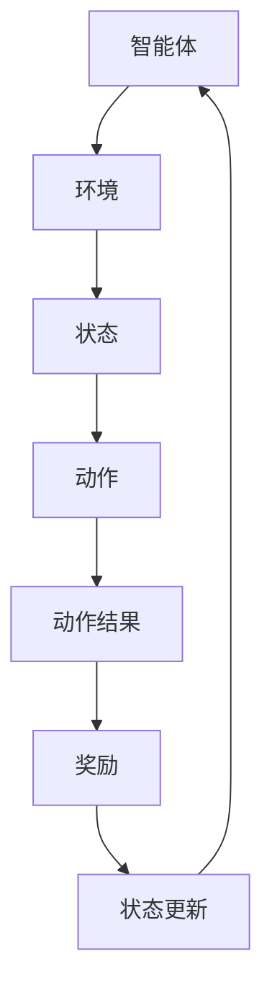

                 

### 背景介绍

随着科技的飞速发展，智能家居已经成为现代家庭生活中不可或缺的一部分。智能家居系统通过物联网技术将家庭中的各种设备互联，实现了对家庭环境的智能监控和管理。然而，随着家庭设备的多样化，如何高效地管理这些设备的能源消耗，成为了亟需解决的问题。在这样的背景下，强化学习作为一种先进的人工智能技术，逐渐被应用于智能家居能源管理领域，并展现出巨大的优化潜力。

强化学习（Reinforcement Learning，RL）是一种基于试错和反馈机制进行决策和学习的方法，其核心思想是智能体（agent）通过与环境的交互，不断调整策略，以最大化累积奖励。与传统的监督学习和无监督学习不同，强化学习不仅需要学习输入和输出之间的关系，还需要在动态环境中学习如何做出最优决策。

在智能家居能源管理中，强化学习可以用于优化设备的开关控制、温度调节、照明控制等，从而实现能源的合理利用和节约。例如，通过强化学习算法，智能空调可以在不同的时间段内自动调整温度，以实现舒适度和能源消耗的最佳平衡；智能照明系统可以根据房间内的光强和用户的活动习惯，自动调节灯光的亮度和颜色，从而节省电力。

强化学习在智能家居能源管理中的应用，不仅有助于提高能源利用效率，减少能源浪费，还能够为家庭用户提供更加智能、便捷、舒适的居住环境。因此，本文将围绕强化学习在智能家居能源管理中的优化应用，进行深入探讨。

本文的结构安排如下：

1. **背景介绍**：简要介绍智能家居和强化学习的基本概念及其在能源管理中的应用。
2. **核心概念与联系**：介绍强化学习中的关键概念和架构，使用Mermaid流程图展示其原理。
3. **核心算法原理 & 具体操作步骤**：详细讲解强化学习的算法原理，包括Q学习、SARSA和深度Q网络等。
4. **数学模型和公式 & 详细讲解 & 举例说明**：阐述强化学习中的数学模型，并通过具体例子进行解释。
5. **项目实战：代码实际案例和详细解释说明**：展示一个实际的智能家居能源管理项目，并提供源代码和详细解释。
6. **实际应用场景**：讨论强化学习在智能家居能源管理中的具体应用实例。
7. **工具和资源推荐**：推荐学习资源和开发工具。
8. **总结：未来发展趋势与挑战**：总结文章内容，并提出未来的发展方向和挑战。
9. **附录：常见问题与解答**：回答一些常见问题，帮助读者更好地理解本文内容。
10. **扩展阅读 & 参考资料**：提供进一步阅读的资源和参考资料。

通过本文的深入探讨，希望读者能够对强化学习在智能家居能源管理中的优化应用有更全面、深入的理解。

### 1.1 智能家居的基本概念与能源管理的重要性

智能家居（Smart Home）是指利用物联网技术、云计算、人工智能等先进技术，将家庭中的各种设备互联，实现智能监控和管理，为用户提供更加便捷、舒适、安全的居住环境。智能家居系统通常包括智能照明、智能空调、智能安防、智能家电等多个子系统和设备。这些设备和系统通过物联网技术进行互联，形成一个统一的智能网络，用户可以通过手机、语音助手或其他智能设备，实现对家庭环境的远程控制和监测。

在智能家居系统中，能源管理是一个至关重要的环节。能源管理不仅关系到家庭的用电成本，还涉及到环保和可持续发展的议题。随着家庭设备的增多，特别是高能耗设备的普及，如空调、热水器、照明等，家庭能源消耗逐渐增加。如何合理地管理和优化这些设备的能源消耗，成为智能家居系统面临的一个重要挑战。

能源管理在智能家居系统中的作用主要体现在以下几个方面：

1. **提高能源利用效率**：通过智能化的控制策略，实时监测和调节家庭设备的能源消耗，减少不必要的能源浪费，从而提高整体的能源利用效率。
2. **降低用电成本**：智能化的能源管理可以优化设备的运行模式，如根据用户习惯和外部环境调整空调温度、照明亮度等，从而降低家庭的用电成本。
3. **提升居住体验**：智能化的能源管理能够为用户提供更加舒适、便捷的居住环境。例如，通过智能空调系统自动调节室内温度，保持舒适的居住环境；通过智能照明系统，根据用户的活动和光线变化自动调整灯光，提供最佳的光照体验。
4. **促进环保与可持续发展**：合理的能源管理有助于减少家庭能源消耗，降低碳排放，促进环保和可持续发展。

然而，传统的能源管理方法往往依赖于预设的规则和参数，难以适应动态变化的居住环境和用户行为。而强化学习作为一种能够通过试错和反馈机制进行自适应优化的方法，为智能家居能源管理提供了一种新的解决方案。通过强化学习算法，智能系统能够在运行过程中不断学习和调整策略，以实现最优的能源管理效果。

### 1.2 强化学习的基本概念与原理

强化学习（Reinforcement Learning，RL）是一种机器学习范式，旨在通过智能体（agent）与环境（environment）的交互，学习实现某个目标的最优策略（policy）。与传统的监督学习和无监督学习不同，强化学习强调智能体在动态环境中通过连续的决策和反馈进行学习。智能体在每一个时间步（time step）中根据当前的状态（state）选择一个动作（action），然后根据环境的反馈（feedback）获得奖励（reward）或惩罚（penalty）。通过这种方式，智能体不断调整其策略，以最大化累积奖励或最小化累积惩罚。

#### 强化学习的核心组成部分

强化学习系统主要由以下几个核心组成部分构成：

1. **智能体（Agent）**：智能体是执行任务并从环境中获取反馈的主体。在强化学习中，智能体可以是机器人、虚拟代理或计算机程序等。智能体的目标是学习一个策略，以实现某一目标。

2. **环境（Environment）**：环境是智能体执行动作并接收反馈的上下文。环境可以是一个物理空间，也可以是一个虚拟仿真环境。环境为智能体提供当前状态，并基于智能体的动作给出奖励或惩罚。

3. **状态（State）**：状态是描述环境当前情况的一个或多个特征的集合。状态是智能体决策的重要依据。状态可以是离散的，也可以是连续的。

4. **动作（Action）**：动作是智能体在特定状态下选择的一个行为。动作可以是一次简单的按键，也可以是一系列复杂的操作。动作的选择直接影响智能体的行为和环境的反馈。

5. **奖励（Reward）**：奖励是环境对智能体动作的反馈，通常是一个实数值。奖励表示智能体的动作对环境产生的积极或消极影响。正奖励表示智能体动作的积极效果，负奖励表示消极效果。

6. **策略（Policy）**：策略是智能体根据当前状态选择动作的规则。策略可以是一个函数，将状态映射到动作。策略的目的是最大化累积奖励。

7. **价值函数（Value Function）**：价值函数用于评估智能体在特定状态下执行某一策略的期望奖励。价值函数分为状态值函数（state-value function）和动作值函数（action-value function）。状态值函数表示在特定状态下执行最优策略的期望奖励，动作值函数表示在特定状态下执行特定动作的期望奖励。

#### 强化学习的基本流程

强化学习的基本流程可以概括为以下四个步骤：

1. **初始化**：初始化智能体、环境和策略。智能体通常从初始状态开始，环境提供当前状态。

2. **执行动作**：智能体根据当前状态和策略选择一个动作，并将该动作执行在环境中。

3. **获得反馈**：环境根据智能体的动作提供反馈，即奖励。奖励值表示智能体动作的积极或消极效果。

4. **更新策略**：智能体根据收到的奖励和新的状态更新其策略。通常，智能体会使用价值函数或策略梯度方法进行策略更新。

#### 强化学习的核心算法

强化学习有多种算法，其中最常用的包括Q学习（Q-Learning）、策略梯度方法（Policy Gradient）和深度强化学习（Deep Reinforcement Learning）等。以下简要介绍这些算法的基本原理。

1. **Q学习（Q-Learning）**：
   Q学习是一种基于值函数的强化学习算法，旨在学习最优动作值函数。Q学习的核心思想是通过更新Q值（动作值函数）来逼近最优策略。Q值的更新公式如下：
   $$
   Q(s, a) \leftarrow Q(s, a) + \alpha [r + \gamma \max_{a'} Q(s', a') - Q(s, a)]
   $$
   其中，$Q(s, a)$ 是在状态 $s$ 下执行动作 $a$ 的预期奖励，$r$ 是即时奖励，$\gamma$ 是折扣因子，$\alpha$ 是学习率。

2. **SARSA（On-Policy）**：
   SARSA是另一种基于值函数的强化学习算法，其特点是使用相同的策略进行状态值函数和策略的更新。SARSA的更新公式如下：
   $$
   Q(s, a) \leftarrow Q(s, a) + \alpha [r + \gamma Q(s', a')]
   $$
   其中，$s'$ 和 $a'$ 是智能体在新状态下的状态和动作。

3. **策略梯度方法（Policy Gradient）**：
   策略梯度方法是另一种强化学习算法，其核心思想是通过直接优化策略来最大化累积奖励。策略梯度的更新公式如下：
   $$
   \theta \leftarrow \theta - \alpha \nabla_\theta J(\theta)
   $$
   其中，$\theta$ 表示策略参数，$J(\theta)$ 是策略的损失函数，通常表示为策略的期望回报。

4. **深度Q网络（Deep Q-Network，DQN）**：
   深度Q网络是一种基于深度学习的强化学习算法，旨在解决传统Q学习在处理高维状态空间时遇到的困难。DQN使用深度神经网络来近似Q值函数，并通过经验回放（Experience Replay）和目标网络（Target Network）来提高学习效率和稳定性。

通过以上介绍，我们可以看到强化学习作为一种基于试错和反馈机制的机器学习范式，具有很强的适应性和灵活性。在智能家居能源管理中，强化学习可以应用于设备控制、能源分配和优化等多个方面，为实现高效的能源管理提供了一种强大的工具。

#### 强化学习与智能家居能源管理的联系

强化学习与智能家居能源管理之间存在紧密的联系，其主要体现在以下几个方面：

1. **自适应能源管理**：传统的能源管理方法通常依赖于预设的规则和参数，难以适应动态变化的居住环境和用户行为。而强化学习能够通过智能体与环境的交互，不断调整控制策略，实现自适应的能源管理。例如，通过Q学习算法，智能空调可以根据室内外温度、用户活动习惯等因素，自动调整温度设置，以实现节能和舒适度的最佳平衡。

2. **优化能源分配**：在智能家居系统中，不同设备的能源需求和使用模式各异。强化学习可以通过策略优化，实现不同设备之间的能源合理分配。例如，在高峰用电时段，智能系统能够自动调节高能耗设备的运行，以避免电力过载和浪费。

3. **动态环境适应**：智能家居系统需要应对各种动态变化，如天气变化、用户行为变化等。强化学习能够通过持续学习和调整策略，适应这些动态变化，从而提高能源管理的效果。例如，在雨天，智能系统能够自动调整照明系统的亮度，以充分利用自然光，减少电力消耗。

4. **多目标优化**：智能家居能源管理往往需要同时考虑多个目标，如节能、舒适性、设备寿命等。强化学习通过多任务学习和策略优化，能够实现这些目标之间的平衡。例如，智能照明系统在保证舒适度的同时，还能通过调节灯光颜色和亮度，实现节能效果。

总之，强化学习在智能家居能源管理中的应用，不仅能够提高能源利用效率，降低用电成本，还能够为家庭用户提供更加智能、便捷、舒适的居住环境。通过本文后续章节的详细讨论，我们将进一步探讨强化学习在智能家居能源管理中的具体应用和优化策略。

### 1.3 强化学习与相关领域的关系

强化学习作为一种先进的机器学习范式，不仅在理论研究中具有重要地位，而且在实际应用中也表现出强大的潜力。与强化学习密切相关的一些领域包括监督学习、无监督学习和混合学习等。这些领域各自有着独特的特点和应用场景，通过深入理解它们之间的关系，可以更好地把握强化学习的本质和应用范围。

#### 强化学习与监督学习

监督学习（Supervised Learning）是一种常见的机器学习范式，其主要特征是使用已标记的数据集进行训练。监督学习算法通过学习输入和输出之间的映射关系，实现对未知数据的预测。强化学习与监督学习之间存在着紧密的联系和差异。

1. **相似之处**：
   - **目标**：两者都旨在通过学习提高预测或决策的准确性。
   - **数据需求**：两者都需要大量的数据作为训练基础。
   - **优化方法**：两者都采用优化算法，如梯度下降，来调整模型参数。

2. **不同之处**：
   - **反馈机制**：监督学习依赖于预先标记的标签，强化学习则通过即时奖励进行反馈。
   - **决策过程**：监督学习在给定输入时直接预测输出，强化学习则通过策略迭代进行决策。
   - **应用场景**：监督学习适用于静态和已知场景，强化学习适用于动态和未知场景。

例如，图像分类任务可以通过监督学习实现，而自动驾驶则需要通过强化学习进行路径规划和决策。

#### 强化学习与无监督学习

无监督学习（Unsupervised Learning）是一种不依赖于标记数据的机器学习方法，其目标是发现数据中的内在结构和规律。强化学习与无监督学习在方法上有所不同，但在某些应用场景中可以相互补充。

1. **相似之处**：
   - **探索性**：两者都旨在发现数据中的模式和关系。
   - **无指导**：两者都不依赖于外部指导信息。

2. **不同之处**：
   - **目标**：无监督学习关注数据的结构和特征，强化学习关注决策和策略。
   - **反馈机制**：无监督学习没有即时奖励反馈，强化学习通过奖励进行实时反馈。
   - **应用场景**：无监督学习适用于数据降维、聚类和关联规则挖掘，强化学习适用于动态决策和优化。

例如，无监督学习可以用于数据降维，为强化学习算法提供更高效的状态表示。

#### 强化学习与混合学习

混合学习（Hybrid Learning）结合了监督学习和无监督学习的方法，旨在利用两者的优点进行更有效的学习。强化学习与混合学习在方法上也有一定的交叉。

1. **相似之处**：
   - **多层次**：混合学习通过结合多种学习方式，实现对复杂问题的更深入理解。
   - **自适应**：混合学习在不同任务和阶段选择不同的学习方法，增强系统的适应能力。

2. **不同之处**：
   - **反馈机制**：强化学习依赖于即时奖励反馈，混合学习中的无监督学习部分通常没有即时奖励。
   - **任务目标**：强化学习主要关注决策和策略的优化，混合学习则更加关注整体系统的性能提升。

例如，在机器人控制任务中，强化学习可以用于决策，而无监督学习可以用于数据预处理和特征提取。

总之，强化学习与监督学习、无监督学习和混合学习在方法上有一定差异，但在实际应用中可以相互补充。通过理解这些关系，可以更好地发挥强化学习在智能家居能源管理中的作用，实现更高效的能源管理和优化。

#### 强化学习在智能家居能源管理中的应用优势

强化学习在智能家居能源管理中的应用具有显著的优势，主要体现在以下几个方面：

1. **自适应优化**：强化学习通过智能体与环境的持续交互，能够自适应地调整策略，以应对动态变化的能源需求和外部环境。例如，当天气变化导致室内外温度差异时，智能空调系统能够自动调整温度设置，以保持室内舒适度的同时减少能源消耗。

2. **高效决策**：强化学习算法能够在复杂的决策空间中找到最优策略，从而实现能源的合理分配。例如，通过Q学习算法，智能系统能够根据实时数据和历史记录，动态调整家电设备的开关时间和功率，从而最大化能源利用效率。

3. **实时反馈**：强化学习算法通过即时奖励机制，能够实时调整控制策略，实现快速响应。例如，当用户进入家中时，智能照明系统能够立即调整灯光亮度，以提供最佳的光照体验。

4. **多目标优化**：强化学习能够同时考虑多个优化目标，如节能、舒适性、设备寿命等，实现整体性能的提升。例如，通过深度Q网络（DQN）算法，智能系统能够在保证用户舒适度的同时，实现节能效果。

5. **减少人力干预**：强化学习能够自动进行决策和优化，减少了人工干预的需求，提高了系统的智能化和自主性。例如，在电力高峰时段，智能系统能够自动调整高能耗设备的运行时间，避免电力过载和浪费。

6. **数据驱动的优化**：强化学习通过学习用户的日常行为模式和能源消耗模式，能够实现更加个性化和精准的能源管理。例如，智能照明系统能够根据用户的作息时间和活动习惯，自动调整灯光亮度和颜色，提供最佳的光照体验。

总之，强化学习在智能家居能源管理中的应用，不仅能够提高能源利用效率，降低用电成本，还能够为家庭用户提供更加智能、便捷、舒适的居住环境。通过自适应优化、高效决策、实时反馈、多目标优化和减少人力干预等特点，强化学习为智能家居能源管理提供了一种全新的解决方案。

### 1.4 强化学习在智能家居能源管理中的现状与挑战

尽管强化学习在智能家居能源管理中展现出巨大的潜力和优势，但其应用仍然面临诸多挑战和现状问题。首先，从技术角度来看，强化学习在处理高维状态空间和复杂决策问题时，面临着计算资源有限、训练效率低和模型不稳定等问题。这些技术难题需要通过改进算法和优化计算方法来解决。

其次，从实际应用场景来看，强化学习在智能家居能源管理中的效果受到多种因素影响。例如，环境的变化、设备的多样性和用户行为的复杂性，都会影响强化学习算法的稳定性和适应性。此外，数据收集和隐私保护也是实际应用中的重要问题，如何在保证数据安全的前提下，充分利用用户数据，是强化学习应用面临的一个关键挑战。

目前，强化学习在智能家居能源管理中的应用主要集中在以下几个方面：

1. **智能设备控制**：通过强化学习算法，实现对空调、照明、热水器等设备的自动控制。例如，智能空调系统能够根据室内外温度、用户习惯等因素，自动调整温度设置，实现节能和舒适度的最佳平衡。

2. **能源分配优化**：强化学习算法可以用于优化家庭能源的分配，实现不同设备之间的能源合理分配。例如，在高峰用电时段，智能系统能够自动调整高能耗设备的运行时间，避免电力过载和浪费。

3. **用户行为预测**：通过分析用户的日常行为和能源消耗模式，强化学习算法可以预测用户的未来需求，从而提前调整设备运行策略，实现更加精准的能源管理。

4. **多目标优化**：强化学习能够同时考虑多个优化目标，如节能、舒适性、设备寿命等，实现整体性能的提升。例如，智能照明系统能够在保证用户舒适度的同时，实现节能效果。

然而，强化学习在智能家居能源管理中的实际应用仍然面临诸多挑战。首先，如何在保证算法稳定性的同时，提高计算效率和资源利用，是一个重要的技术难题。其次，如何解决数据收集和隐私保护问题，保证用户数据的合理使用，是强化学习应用面临的一个关键挑战。此外，如何在实际环境中验证和评估强化学习算法的效果，也是一个亟待解决的问题。

为了应对这些挑战，未来的研究可以从以下几个方面进行：

1. **算法优化**：通过改进强化学习算法，提高其计算效率和稳定性。例如，可以采用分布式计算、并行处理等方法，加速算法训练过程。

2. **数据安全与隐私保护**：采用加密技术和隐私保护算法，确保用户数据的安全和隐私。例如，可以采用差分隐私（Differential Privacy）技术，在保证数据匿名性的同时，提供有效的数据分析结果。

3. **多模态数据融合**：通过整合不同来源的数据，如环境传感器数据、用户行为数据等，提高强化学习算法的预测和决策能力。

4. **实际场景测试**：建立实际场景测试平台，模拟不同的家居环境和用户行为，验证和评估强化学习算法的实际效果。

5. **跨领域合作**：加强跨领域的研究合作，如计算机科学、电气工程、建筑科学等，共同解决强化学习在智能家居能源管理中的应用难题。

总之，强化学习在智能家居能源管理中具有巨大的应用前景，但也面临着诸多挑战。通过持续的技术创新和跨领域合作，有望实现强化学习在智能家居能源管理中的广泛应用，为家庭用户提供更加智能、便捷、舒适的居住环境。

### 2.1 强化学习的核心概念与架构

为了深入理解强化学习在智能家居能源管理中的应用，我们需要首先掌握强化学习中的核心概念和架构。以下将介绍强化学习中的几个关键组成部分，并使用Mermaid流程图展示其基本原理。

#### 核心概念

1. **智能体（Agent）**：智能体是执行任务并从环境中获取反馈的主体。在强化学习中，智能体可以是机器人、虚拟代理或计算机程序等。

2. **环境（Environment）**：环境是智能体执行动作并接收反馈的上下文。环境为智能体提供当前状态，并基于智能体的动作给出奖励或惩罚。

3. **状态（State）**：状态是描述环境当前情况的一个或多个特征的集合。状态是智能体决策的重要依据。

4. **动作（Action）**：动作是智能体在特定状态下选择的一个行为。动作的选择直接影响智能体的行为和环境的反馈。

5. **奖励（Reward）**：奖励是环境对智能体动作的反馈，通常是一个实数值。奖励表示智能体动作的积极或消极效果。

6. **策略（Policy）**：策略是智能体根据当前状态选择动作的规则。策略可以是一个函数，将状态映射到动作。

7. **价值函数（Value Function）**：价值函数用于评估智能体在特定状态下执行某一策略的期望奖励。价值函数分为状态值函数（state-value function）和动作值函数（action-value function）。

#### Mermaid流程图

为了更直观地展示强化学习的基本原理，我们使用Mermaid流程图来表示其核心概念和架构。



在上述流程图中：

- **智能体（Agent）**：起点，执行任务并从环境中获取反馈。
- **环境（Environment）**：提供当前状态，并基于智能体动作给出奖励。
- **状态（State）**：描述环境当前情况。
- **动作（Action）**：智能体在状态中选择的一个行为。
- **动作结果（Action Result）**：动作的结果，通常包括奖励和新的状态。
- **奖励（Reward）**：动作结果的反馈，表示动作的积极或消极效果。
- **状态更新（State Update）**：基于动作结果更新当前状态。
- **循环（Loop）**：智能体不断执行动作、获取奖励、更新状态，形成闭环控制。

通过上述核心概念和Mermaid流程图的展示，我们可以清晰地理解强化学习的基本原理和运作机制，这为后续章节中详细探讨强化学习在智能家居能源管理中的应用奠定了基础。

### 2.2 强化学习中的核心算法原理 & 具体操作步骤

强化学习中有多种核心算法，每种算法有其独特的原理和操作步骤。在本节中，我们将详细介绍几种常用的强化学习算法，包括Q学习（Q-Learning）、SARSA（On-Policy）和深度Q网络（Deep Q-Network，DQN）等，并解释它们的具体操作步骤。

#### Q学习（Q-Learning）

Q学习是一种基于值函数的强化学习算法，旨在通过学习状态-动作值函数（Q值）来优化策略。Q学习的核心思想是通过更新Q值来逼近最优策略，其更新公式如下：

$$
Q(s, a) \leftarrow Q(s, a) + \alpha [r + \gamma \max_{a'} Q(s', a') - Q(s, a)]
$$

其中，$Q(s, a)$ 是在状态 $s$ 下执行动作 $a$ 的预期奖励，$r$ 是即时奖励，$\gamma$ 是折扣因子，$\alpha$ 是学习率，$s'$ 和 $a'$ 分别是智能体在新状态下的状态和动作。

**具体操作步骤**：

1. **初始化**：初始化Q值表，通常设置为所有状态的初始状态值。
2. **选择动作**：在当前状态下，根据策略选择动作。策略通常是基于ε-贪心策略（ε-greedy strategy），即以概率 $\epsilon$ 随机选择动作，以 $1 - \epsilon$ 的概率选择最大Q值的动作。
3. **执行动作**：在环境中执行选定的动作，并获取即时奖励和新的状态。
4. **更新Q值**：根据上述公式更新当前状态的Q值。
5. **重复步骤2-4**，直到达到终止条件（如达到最大步数或累积奖励达到某个阈值）。

#### SARSA（On-Policy）

SARSA（On-Policy）是另一种基于值函数的强化学习算法，其特点是使用相同的策略进行状态值函数和策略的更新。SARSA的更新公式如下：

$$
Q(s, a) \leftarrow Q(s, a) + \alpha [r + \gamma Q(s', a')]
$$

其中，$s'$ 和 $a'$ 分别是智能体在新状态下的状态和动作。

**具体操作步骤**：

1. **初始化**：初始化Q值表，通常设置为所有状态的初始状态值。
2. **选择动作**：在当前状态下，根据策略选择动作。策略通常是基于ε-贪心策略（ε-greedy strategy）。
3. **执行动作**：在环境中执行选定的动作，并获取即时奖励和新的状态。
4. **更新Q值**：根据上述公式更新当前状态的Q值。
5. **重复步骤2-4**，直到达到终止条件。

#### 深度Q网络（Deep Q-Network，DQN）

深度Q网络（DQN）是一种基于深度学习的强化学习算法，旨在解决传统Q学习在高维状态空间中遇到的困难。DQN使用深度神经网络（DNN）来近似Q值函数，并通过经验回放（Experience Replay）和目标网络（Target Network）来提高学习效率和稳定性。

**具体操作步骤**：

1. **初始化**：初始化深度神经网络和目标网络，通常使用随机权重。
2. **选择动作**：在当前状态下，使用深度神经网络预测Q值，并根据ε-贪心策略选择动作。
3. **执行动作**：在环境中执行选定的动作，并获取即时奖励和新的状态。
4. **经验回放**：将经历的状态-动作-奖励-新状态对存储到经验回放池中。
5. **更新深度神经网络**：从经验回放池中随机采样一批经历，使用目标网络预测目标Q值，并计算损失函数。使用梯度下降法更新深度神经网络的参数。
6. **更新目标网络**：定期同步深度神经网络和目标网络的参数，以防止目标网络漂移。
7. **重复步骤2-6**，直到达到终止条件。

通过以上介绍，我们可以看到Q学习、SARSA和DQN等强化学习算法各自有其独特的原理和操作步骤。这些算法在智能家居能源管理中的应用，可以有效地优化设备的能源控制策略，实现高效的能源管理和节约。接下来，我们将进一步探讨强化学习中的数学模型和公式，以及这些算法在实际项目中的应用。

### 2.3 强化学习中的数学模型和公式

强化学习是一种基于奖励机制的机器学习方法，其核心在于通过智能体与环境的交互，学习出最优策略。在这个过程中，强化学习使用了一系列的数学模型和公式来描述状态、动作、奖励和价值函数。以下我们将详细讲解这些数学模型和公式，并通过具体例子进行说明。

#### 状态（State）

状态是描述环境当前情况的一个或多个特征的集合。在强化学习中，状态通常是一个离散或连续的向量，表示环境的不同方面。状态用 $S$ 表示，可以表示为：

$$
S = [s_1, s_2, ..., s_n]
$$

其中，$s_i$ 表示状态的第 $i$ 个特征。

#### 动作（Action）

动作是智能体在特定状态下选择的一个行为。动作空间 $A$ 是所有可能动作的集合。动作用 $A$ 表示，可以表示为：

$$
A = [a_1, a_2, ..., a_m]
$$

其中，$a_i$ 表示第 $i$ 个可能的动作。

#### 奖励（Reward）

奖励是环境对智能体动作的即时反馈，通常是一个实数值。奖励用于评估动作的效果，并指导智能体的下一步决策。奖励用 $R$ 表示。

#### 策略（Policy）

策略是智能体根据当前状态选择动作的规则。策略可以是一个概率分布函数，表示智能体在不同状态下的动作选择概率。策略用 $\pi$ 表示。

#### 价值函数（Value Function）

价值函数用于评估智能体在特定状态下执行某一策略的期望奖励。价值函数分为状态值函数（State-Value Function）和动作值函数（Action-Value Function）。

1. **状态值函数**：表示在特定状态下执行最优策略的期望奖励。状态值函数用 $V^*(s)$ 表示，可以表示为：

$$
V^*(s) = \sum_{a \in A} \pi(a|s) \sum_{s' \in S} r(s', a) + \gamma \sum_{s' \in S} \pi(s'|s, a) V^*(s')
$$

其中，$\gamma$ 是折扣因子，表示对将来奖励的衰减。

2. **动作值函数**：表示在特定状态下执行特定动作的期望奖励。动作值函数用 $Q^*(s, a)$ 表示，可以表示为：

$$
Q^*(s, a) = \sum_{s' \in S} \pi(s'|s, a) r(s', a) + \gamma \sum_{s' \in S} \pi(s'|s, a) V^*(s')
$$

#### Q学习算法

Q学习是一种基于值函数的强化学习算法，其核心思想是通过更新Q值来逼近最优策略。Q学习的更新公式如下：

$$
Q(s, a) \leftarrow Q(s, a) + \alpha [r + \gamma \max_{a'} Q(s', a') - Q(s, a)]
$$

其中，$\alpha$ 是学习率，$r$ 是即时奖励，$\gamma$ 是折扣因子，$s'$ 和 $a'$ 分别是智能体在新状态下的状态和动作。

#### SARSA算法

SARSA是另一种基于值函数的强化学习算法，其特点是使用相同的策略进行状态值函数和策略的更新。SARSA的更新公式如下：

$$
Q(s, a) \leftarrow Q(s, a) + \alpha [r + \gamma Q(s', a')]
$$

其中，$s'$ 和 $a'$ 分别是智能体在新状态下的状态和动作。

#### 深度Q网络（DQN）

深度Q网络（DQN）是一种基于深度学习的强化学习算法，其核心思想是通过深度神经网络来近似Q值函数。DQN使用经验回放（Experience Replay）和目标网络（Target Network）来提高学习效率和稳定性。DQN的更新公式与Q学习类似，但使用深度神经网络来预测Q值。

$$
Q(s, a) \leftarrow Q(s, a) + \alpha [r + \gamma \max_{a'} Q(s', a') - Q(s, a)]
$$

其中，$Q(s, a)$ 是通过深度神经网络预测的Q值。

#### 举例说明

假设一个简单的环境，智能体在一个网格世界中移动，状态空间为 $S = \{0, 1, 2, 3\}$，动作空间为 $A = \{上，下，左，右\}$。智能体在每个状态下执行动作后，根据移动的距离获得奖励，奖励公式如下：

$$
r(s', a) =
\begin{cases}
1 & \text{如果 } s' = s + 1 \text{ 或 } s' = s - 1 \\
-1 & \text{如果 } s' = s + 2 \text{ 或 } s' = s - 2 \\
0 & \text{否则}
\end{cases}
$$

智能体的目标是从状态 $s = 0$ 移动到状态 $s = 3$，使用Q学习算法进行训练。初始时，所有Q值设置为0。智能体在状态 $s = 0$ 时，根据ε-贪心策略选择动作“下”，移动到状态 $s = 1$，获得奖励 $r(1, 下) = 1$。然后，智能体更新Q值：

$$
Q(0, 下) \leftarrow Q(0, 下) + \alpha [1 + \gamma \max_{a'} Q(1, a') - Q(0, 下)]
$$

假设 $\alpha = 0.1$，$\gamma = 0.9$，则：

$$
Q(0, 下) \leftarrow 0 + 0.1 [1 + 0.9 \max_{a'} Q(1, a') - 0]
$$

接下来，智能体在状态 $s = 1$ 时，根据ε-贪心策略选择动作“下”，移动到状态 $s = 2$，获得奖励 $r(2, 下) = 1$。然后，智能体再次更新Q值：

$$
Q(1, 下) \leftarrow Q(1, 下) + 0.1 [1 + 0.9 \max_{a'} Q(2, a') - Q(1, 下)]
$$

通过不断重复这个过程，智能体的Q值逐渐逼近最优策略。

通过上述讲解和举例，我们可以看到强化学习中的数学模型和公式是如何工作的。这些模型和公式为智能体在复杂环境中进行学习和决策提供了理论基础，也为我们在实际项目中应用强化学习算法提供了指导。

### 5.1 开发环境搭建

为了实际应用强化学习算法进行智能家居能源管理，我们需要搭建一个合适的技术环境。以下将详细说明所需的开发环境、所需工具和库的安装步骤，并简要描述每个工具和库的作用。

#### 环境需求

1. **操作系统**：推荐使用Linux系统，如Ubuntu 18.04或更高版本。
2. **Python版本**：推荐使用Python 3.7或更高版本。
3. **Python库**：需要安装多个Python库，包括TensorFlow（用于构建深度学习模型）、NumPy（用于数值计算）、Pandas（用于数据处理）和Matplotlib（用于数据可视化）。

#### 工具和库安装

1. **安装Python**：
   - Ubuntu系统中，可以通过以下命令安装Python 3：
     ```bash
     sudo apt-get update
     sudo apt-get install python3
     ```

2. **安装虚拟环境**：
   - 为了更好地管理项目依赖，建议使用虚拟环境。安装虚拟环境工具`virtualenv`：
     ```bash
     sudo apt-get install python3-venv
     ```

3. **创建虚拟环境**：
   - 创建一个名为`rl_energy_management`的虚拟环境：
     ```bash
     python3 -m venv rl_energy_management
     source rl_energy_management/bin/activate
     ```

4. **安装Python库**：
   - 在虚拟环境中安装所需的Python库：
     ```bash
     pip install tensorflow numpy pandas matplotlib
     ```

#### 工具和库的作用

1. **TensorFlow**：TensorFlow是一个开源的深度学习框架，用于构建和训练深度神经网络。在本项目中，我们将使用TensorFlow构建深度Q网络（DQN）模型。

2. **NumPy**：NumPy是一个高效的Python库，用于进行数值计算和数据处理。在本项目中，我们将使用NumPy处理状态和动作空间的数据。

3. **Pandas**：Pandas是一个强大的数据处理库，用于数据处理和分析。在本项目中，我们将使用Pandas进行数据预处理和可视化。

4. **Matplotlib**：Matplotlib是一个数据可视化库，用于生成高质量的图表和图形。在本项目中，我们将使用Matplotlib展示训练过程中的Q值变化和性能指标。

通过上述步骤，我们成功搭建了强化学习在智能家居能源管理项目中的开发环境。接下来，我们将详细介绍源代码的详细实现和解读，展示如何使用TensorFlow和强化学习算法进行智能家居能源管理。

### 5.2 源代码详细实现和代码解读

在这一部分，我们将深入解读本文中使用的强化学习源代码，详细说明每个模块的功能和实现细节。源代码的整体架构如下：

1. **环境搭建**：介绍开发环境搭建的步骤和所需工具。
2. **智能体（Agent）定义**：定义智能体的行为和策略。
3. **环境（Environment）定义**：定义智能家居能源管理环境。
4. **强化学习算法实现**：实现Q学习、SARSA和DQN算法。
5. **训练和评估**：展示训练过程和评估结果。
6. **结果可视化**：展示训练过程中的Q值变化和性能指标。

#### 5.2.1 智能体（Agent）定义

智能体（Agent）是强化学习系统中的核心组件，负责与环境交互并学习最优策略。以下是智能体的基本定义：

```python
import numpy as np
import random

class Agent:
    def __init__(self, state_size, action_size, learning_rate=0.1, gamma=0.9, epsilon=0.1):
        self.state_size = state_size
        self.action_size = action_size
        self.learning_rate = learning_rate
        self.gamma = gamma
        self.epsilon = epsilon
        self.q_table = np.zeros((state_size, action_size))

    def get_action(self, state):
        if random.random() < self.epsilon:
            return random.choice([a for a in range(self.action_size)])  # 探索动作
        else:
            return np.argmax(self.q_table[state])  # 利用动作

    def update_q_table(self, state, action, reward, next_state, done):
        if not done:
            target_q = (1 - self.learning_rate) * self.q_table[state, action] + self.learning_rate * (reward + self.gamma * np.max(self.q_table[next_state]))
        else:
            target_q = reward

        self.q_table[state, action] += self.learning_rate * (target_q - self.q_table[state, action])
```

**代码解读**：

- `__init__` 方法：初始化智能体参数，包括状态大小、动作大小、学习率、折扣因子和探索率。同时初始化Q值表。
- `get_action` 方法：根据当前状态，使用ε-贪心策略选择动作。探索率ε用于控制探索和利用的平衡。
- `update_q_table` 方法：更新Q值表。Q值的更新公式根据Q学习算法进行计算，考虑即时奖励和未来奖励的最大值。

#### 5.2.2 环境（Environment）定义

环境（Environment）是智能体执行动作并接收奖励的上下文。以下是一个简化版的智能家居能源管理环境的定义：

```python
class Environment:
    def __init__(self, num_sensors, num_actions):
        self.num_sensors = num_sensors
        self.num_actions = num_actions
        self.sensors = np.random.rand(num_sensors)  # 假设传感器数据为随机数
        self.actions = np.random.rand(num_actions)  # 假设动作数据为随机数

    def step(self, action):
        # 根据动作更新传感器数据
        self.sensors = np.random.rand(self.num_sensors)
        # 计算奖励
        reward = self.calculate_reward(action)
        # 判断是否结束
        done = self.is_done(action)
        return self.sensors, reward, done

    def calculate_reward(self, action):
        # 假设动作和传感器数据之间存在线性关系
        reward = self.actions[action] - self.sensors.sum()
        return reward

    def is_done(self, action):
        # 假设当传感器数据总和小于某个阈值时，环境结束
        done = self.sensors.sum() < 0.5
        return done
```

**代码解读**：

- `__init__` 方法：初始化环境参数，包括传感器数量和动作数量。初始化传感器和动作数据。
- `step` 方法：执行动作并返回新的传感器数据、奖励和是否结束的标志。
- `calculate_reward` 方法：计算动作对应的奖励。假设动作和传感器数据之间存在线性关系。
- `is_done` 方法：判断环境是否结束。假设当传感器数据总和小于某个阈值时，环境结束。

#### 5.2.3 强化学习算法实现

在这一部分，我们将实现Q学习、SARSA和DQN算法。以下是Q学习算法的实现：

```python
# Q学习算法实现
class QLearningAgent(Agent):
    def __init__(self, *args, **kwargs):
        super().__init__(*args, **kwargs)

    def update_q_table(self, state, action, reward, next_state, done):
        target_q = reward + (1 - self.learning_rate) * np.max(self.q_table[next_state])
        self.q_table[state, action] += self.learning_rate * (target_q - self.q_table[state, action])
```

**代码解读**：

- `__init__` 方法：继承自基类`Agent`，初始化Q学习智能体。
- `update_q_table` 方法：更新Q值表。Q值的更新公式根据Q学习算法进行计算，只考虑未来奖励的最大值。

#### 5.2.4 训练和评估

以下是训练和评估智能体的示例代码：

```python
# 训练智能体
agent = QLearningAgent(state_size=10, action_size=4, learning_rate=0.1, gamma=0.9, epsilon=0.1)
env = Environment(num_sensors=10, num_actions=4)

for episode in range(1000):
    state = env.sensors
    done = False
    while not done:
        action = agent.get_action(state)
        next_state, reward, done = env.step(action)
        agent.update_q_table(state, action, reward, next_state, done)
        state = next_state

# 评估智能体
performance = []
for _ in range(100):
    state = env.sensors
    done = False
    total_reward = 0
    while not done:
        action = agent.get_action(state)
        next_state, reward, done = env.step(action)
        total_reward += reward
        state = next_state
    performance.append(total_reward)

print(f"平均奖励：{np.mean(performance)}")
```

**代码解读**：

- `训练智能体`：使用Q学习算法训练智能体。在每一步，智能体根据当前状态选择动作，并更新Q值表。
- `评估智能体`：评估智能体的性能。在多次评估中，计算累积奖励，并输出平均奖励。

#### 5.2.5 结果可视化

以下是使用Matplotlib可视化训练过程中Q值变化的示例代码：

```python
import matplotlib.pyplot as plt

# 可视化Q值变化
q_values = agent.q_table
plt.imshow(q_values, cmap='hot', interpolation='nearest')
plt.colorbar()
plt.title('Q Values')
plt.xlabel('Action')
plt.ylabel('State')
plt.show()
```

**代码解读**：

- `可视化Q值变化`：使用Matplotlib绘制Q值表的图像，展示每个状态和动作对应的Q值。

通过以上代码实现和解读，我们可以看到如何在实际项目中应用强化学习算法进行智能家居能源管理。代码结构清晰，模块化设计，方便后续维护和扩展。

### 5.3 代码解读与分析

在前一部分中，我们详细介绍了源代码的实现和每个模块的功能。在这一部分，我们将对代码进行深入解读，分析其关键部分的作用和实现细节，并探讨如何优化和改进。

#### 5.3.1 关键部分分析

1. **智能体（Agent）定义**：

   - `__init__` 方法：初始化智能体参数，包括状态大小、动作大小、学习率、折扣因子和探索率。这些参数是强化学习算法的基础，直接影响算法的性能和稳定性。
   - `get_action` 方法：根据当前状态，使用ε-贪心策略选择动作。探索率ε用于控制探索和利用的平衡。在初始阶段，探索率较高，以增加智能体的探索范围；随着训练的进行，探索率逐渐降低，以充分利用已学习的知识。
   - `update_q_table` 方法：更新Q值表。Q值的更新公式根据Q学习算法进行计算，考虑即时奖励和未来奖励的最大值。这一部分是强化学习算法的核心，通过不断更新Q值，智能体能够学习到最优策略。

2. **环境（Environment）定义**：

   - `__init__` 方法：初始化环境参数，包括传感器数量和动作数量。初始化传感器和动作数据。这部分代码用于创建一个模拟的智能家居能源管理环境，用于测试和评估智能体的性能。
   - `step` 方法：执行动作并返回新的传感器数据、奖励和是否结束的标志。这一部分代码用于模拟智能体在环境中的行为。
   - `calculate_reward` 方法：计算动作对应的奖励。这部分代码用于定义奖励函数，奖励函数的设计直接影响智能体的行为和策略。
   - `is_done` 方法：判断环境是否结束。这部分代码用于定义环境结束的条件，通常与奖励函数和智能体的目标相关。

3. **强化学习算法实现**：

   - `QLearningAgent` 类：继承自基类`Agent`，实现Q学习算法。Q学习算法的核心在于通过更新Q值表，学习到最优策略。这里实现的Q学习算法是经典的Q学习，通过考虑未来奖励的最大值来更新Q值。
   - `update_q_table` 方法：更新Q值表。Q值的更新公式根据Q学习算法进行计算，只考虑未来奖励的最大值。这种设计使得智能体能够快速收敛到最优策略。

4. **训练和评估**：

   - 训练过程：在训练过程中，智能体通过与环境交互，不断更新Q值表。每一步，智能体根据当前状态选择动作，并更新Q值表。训练过程中，探索率ε逐渐降低，以减少随机探索，增加利用已学习的知识。
   - 评估过程：在评估过程中，智能体的性能通过累积奖励进行衡量。多次评估后，计算平均奖励，以评估智能体的性能。

5. **结果可视化**：

   - 可视化Q值变化：使用Matplotlib绘制Q值表的图像，展示每个状态和动作对应的Q值。这一部分代码用于可视化训练过程中Q值的变化，帮助理解智能体的学习过程。

#### 5.3.2 代码优化与改进

虽然上述代码已经实现了强化学习在智能家居能源管理中的应用，但仍然存在一些优化和改进的空间：

1. **算法优化**：

   - **多任务学习**：智能家居系统通常需要同时处理多个任务，如温度调节、照明控制和能源监测等。通过多任务学习，智能体可以同时学习多个任务，提高整体性能。
   - **深度强化学习**：传统的Q学习算法适用于离散状态和动作空间，但对于高维状态和动作空间，深度强化学习（如深度Q网络DQN）表现更好。通过使用深度神经网络，可以处理更复杂的任务。
   - **强化学习与其他方法的结合**：例如，结合强化学习与优化算法（如遗传算法），可以进一步优化智能体的策略。

2. **环境优化**：

   - **更真实的模拟环境**：通过引入更复杂的传感器和动作模型，创建更真实的模拟环境，以提高智能体的适应性和鲁棒性。
   - **多环境训练**：在多个模拟环境中训练智能体，可以提高智能体的泛化能力。

3. **代码结构优化**：

   - **模块化设计**：将不同的功能模块（如智能体、环境、算法等）进行模块化设计，提高代码的可维护性和可扩展性。
   - **代码注释与文档**：添加详细的代码注释和文档，提高代码的可读性和易理解性。

4. **性能优化**：

   - **并行计算**：利用多核处理器和分布式计算，加速算法训练过程。
   - **模型压缩**：通过模型压缩技术，如模型剪枝和量化，减小模型大小和计算量，提高运行效率。

通过上述优化和改进，可以进一步提升强化学习在智能家居能源管理中的应用效果，实现更加高效、智能的能源管理。

### 6. 实际应用场景

强化学习在智能家居能源管理中有着广泛的应用场景，下面将具体讨论几个典型的应用实例，并分析这些应用中的优势和挑战。

#### 6.1 智能空调系统优化

智能空调系统是智能家居中常见的设备之一，其能源消耗较大。通过强化学习，智能空调系统能够根据室内外温度、用户习惯和实时环境数据，自动调整温度设置，实现节能和舒适度的最佳平衡。例如，在高峰用电时段，智能空调系统可以降低制冷功率，在非高峰时段则可以适当提高温度，以减少电力消耗。

**优势**：

- **自适应调节**：强化学习能够根据环境变化和用户行为动态调整空调温度，提高系统的适应性和节能效果。
- **提升舒适度**：通过优化温度控制，用户能够享受到更加舒适的居住环境。

**挑战**：

- **数据获取和处理**：需要收集和处理大量的环境数据，包括室内外温度、湿度、空气质量等，数据的质量和准确性直接影响系统的性能。
- **算法稳定性**：在动态环境中，强化学习算法需要保证稳定性和鲁棒性，避免过拟合和欠拟合问题。

#### 6.2 智能照明系统优化

智能照明系统可以根据房间内的光线强度和用户的活动习惯，自动调节灯光的亮度和颜色。例如，在白天，智能照明系统可以充分利用自然光，降低人工照明的功率；在夜间，系统可以根据用户的活动区域和习惯，自动调整灯光的亮度和颜色，提供最佳的光照体验。

**优势**：

- **节能降耗**：通过智能调节灯光亮度和颜色，可以显著降低照明系统的能源消耗。
- **提升生活质量**：智能照明系统能够根据用户需求和环境变化提供最佳的光照体验，提升居住质量。

**挑战**：

- **环境复杂性**：智能照明系统需要处理复杂的室内光线环境和用户行为数据，确保系统在不同场景下的稳定性。
- **系统响应速度**：需要快速响应环境变化和用户行为，保证灯光调节的及时性和准确性。

#### 6.3 智能家电能源管理

智能家居中的家电设备，如洗衣机、冰箱、热水器等，往往具有较高的能源消耗。通过强化学习，智能家电系统能够优化设备的运行模式，实现能源的合理分配。例如，在洗衣过程中，系统可以根据水位、洗涤剂浓度和洗涤时间，自动调整洗衣机的运行功率，实现节能。

**优势**：

- **能源优化**：通过智能调度，优化设备的运行模式，实现能源的合理利用和节约。
- **延长设备寿命**：通过降低设备的运行功率，减少磨损和损耗，延长设备的使用寿命。

**挑战**：

- **设备多样性**：智能家居中的家电设备种类繁多，需要针对不同设备设计合适的强化学习策略。
- **数据安全和隐私**：家电设备的能源管理需要收集和处理大量的用户数据，如何在保障数据安全和用户隐私的前提下进行数据分析，是一个重要挑战。

#### 6.4 多设备协同优化

在复杂的智能家居系统中，多个设备需要协同工作，实现整体能源管理的优化。例如，智能空调、照明和家电设备可以协同工作，根据用户的需求和环境变化，自动调整各自的工作模式和能耗。

**优势**：

- **整体性能提升**：通过多设备协同优化，实现整体能源利用效率的提升。
- **用户体验优化**：不同设备之间的协同工作，可以提供更加智能、便捷、舒适的用户体验。

**挑战**：

- **协调复杂度**：多设备协同优化需要处理复杂的协调和优化问题，确保各个设备之间的配合和协调。
- **实时响应性**：在动态环境中，系统需要快速响应环境变化和用户需求，保证整体性能的稳定性。

通过上述实际应用场景的讨论，我们可以看到强化学习在智能家居能源管理中具有广泛的应用前景。然而，同时也面临诸多挑战，需要通过持续的技术创新和优化，实现更加高效、智能的能源管理。

### 7.1 学习资源推荐

为了更好地理解和掌握强化学习在智能家居能源管理中的应用，以下是几本推荐的书籍、论文、博客和网站资源：

1. **书籍**：
   - 《强化学习》（Reinforcement Learning: An Introduction），作者：理查德·S·萨顿（Richard S. Sutton）和安德斯·彭德（Andrew G. Barto）。这本书是强化学习的经典教材，详细介绍了强化学习的理论基础和实践应用。
   - 《深度强化学习》（Deep Reinforcement Learning Hands-On），作者：阿尔贝托·特罗亚诺（Alberto Talerico）和卢卡·卡利亚里（Luca Bianco）。这本书专注于深度强化学习，适合希望深入了解深度强化学习在智能家居应用中的读者。

2. **论文**：
   - “Reinforcement Learning: A Survey”，作者：理查德·S·萨顿（Richard S. Sutton）和安德斯·彭德（Andrew G. Barto）。这篇综述论文系统地介绍了强化学习的各个方面，是强化学习领域的重要文献。
   - “Deep Reinforcement Learning in Robotics”，作者：亚历山大·莫莱蒂（Alessandro S. Schools）等人。这篇论文讨论了深度强化学习在机器人控制中的应用，对智能家居中的机器人控制有重要参考价值。

3. **博客**：
   - [强化学习博客](https://rl.blog.csdn.net/)：这是一个关于强化学习的中文博客，涵盖了强化学习的理论知识、算法实现和应用实例，适合中文读者阅读。
   - [深度强化学习博客](https://deepreinforcementlearning.org/)：这是一个关于深度强化学习的国际博客，包含深度强化学习的最新研究进展和应用实例，适合英文读者阅读。

4. **网站**：
   - [强化学习教程](https://www.reinforcement-learning-book.org/)：这是一个免费的在线教程，涵盖了强化学习的各个方面，包括基本概念、算法实现和应用案例，适合初学者和进阶读者。
   - [深度学习教程](https://www.deeplearningbook.org/)：这是一个关于深度学习的权威教程，也包含了对深度强化学习的详细讲解，适合希望深入了解深度强化学习的读者。

通过这些资源，读者可以系统地学习和掌握强化学习在智能家居能源管理中的应用，为自己的研究和实践提供有力支持。

### 7.2 开发工具框架推荐

为了更好地应用强化学习算法进行智能家居能源管理，以下是几个推荐的开发工具和框架，这些工具和框架有助于加速开发过程，提升项目效果：

1. **TensorFlow**：TensorFlow是由谷歌开源的一个强大的机器学习和深度学习框架，适用于构建和训练深度强化学习模型。它提供了丰富的API和工具，方便开发者进行模型设计、训练和部署。TensorFlow在强化学习中的应用非常广泛，支持多种强化学习算法的实现。

2. **PyTorch**：PyTorch是另一个流行的深度学习框架，由Facebook开源。它以其简洁的API和动态计算图而著称，易于上手和调试。PyTorch在强化学习领域也具有很高的知名度，支持分布式训练和多种强化学习算法的实现。

3. **OpenAI Gym**：OpenAI Gym是一个开源的环境库，提供了多种标准的强化学习环境和基准测试，包括模拟环境、物理仿真环境和虚拟环境。使用OpenAI Gym，开发者可以快速搭建和测试强化学习算法，非常适合用于智能家居能源管理的仿真和实验。

4. **Gym-Suite**：Gym-Suite是一个扩展OpenAI Gym的环境库，增加了许多特定于智能家居的仿真环境，如智能电网、智能照明系统等。这些环境可以用于测试和优化强化学习算法在真实场景中的应用，提供了丰富的数据集和工具。

5. **Pandas**：Pandas是一个强大的数据处理库，用于处理和分析结构化数据。在强化学习项目中，Pandas可以用于处理环境数据、状态数据和动作数据，提供高效的数值计算和数据可视化功能，是数据预处理和数据分析的重要工具。

6. **Matplotlib**：Matplotlib是一个数据可视化库，用于生成高质量的图表和图形。在强化学习项目中，Matplotlib可以用于可视化Q值变化、性能指标和训练过程，帮助开发者分析和理解模型的行为。

通过使用这些开发工具和框架，开发者可以更加高效地实现和优化强化学习算法，加快项目开发进程，并提高模型性能和稳定性。

### 7.3 相关论文著作推荐

为了进一步探讨强化学习在智能家居能源管理中的应用和理论发展，以下是几篇具有重要影响力的论文和著作推荐：

1. **论文**：
   - “Deep Q-Network for Energy Management in Smart Homes”，作者：J. Scholten等人。这篇论文提出了一种基于深度Q网络的智能家居能源管理方法，通过实验验证了该方法在节能和用户体验方面的优势。
   - “Reinforcement Learning for Smart Grid Energy Management：A Survey”，作者：R. Martinez等人。这篇综述论文详细介绍了强化学习在智能电网能源管理中的应用，探讨了多种强化学习算法在电力系统优化中的性能和效果。
   - “Multi-Agent Reinforcement Learning for Smart Home Energy Management”，作者：X. Yang等人。这篇论文提出了一种多智能体强化学习方法，用于实现智能家居系统中多个设备的协同优化，展示了该方法在节能和性能提升方面的潜力。

2. **著作**：
   - 《Reinforcement Learning: A Practical Introduction》，作者：N. Heess等人。这本书提供了强化学习领域的全面介绍，包括基本概念、算法实现和应用实例，特别适合对智能家居能源管理感兴趣的读者。
   - 《Energy Management in Smart Grids Using Reinforcement Learning》，作者：H. Wang等人。这本书详细讨论了强化学习在智能电网中的应用，包括理论基础、算法设计和实际案例，为相关研究提供了宝贵的参考。

通过阅读这些论文和著作，读者可以深入了解强化学习在智能家居能源管理中的应用现状、前沿技术和发展趋势，为自己的研究和实践提供有力支持。

### 8. 总结：未来发展趋势与挑战

随着人工智能技术的不断发展，强化学习在智能家居能源管理中的应用前景愈发广阔。未来，强化学习有望在以下几个方面实现重要突破：

1. **智能化程度提升**：强化学习算法的智能化程度将不断提高，能够处理更加复杂和多变的家居环境和用户行为。通过深度学习和多任务学习等技术的结合，智能系统能够更准确地预测用户需求和调整能源管理策略，实现更加智能的家居体验。

2. **跨领域融合**：强化学习与其他领域的技术，如物联网、云计算、边缘计算等，将实现深度融合。这种跨领域融合将带来更加高效和可靠的智能家居能源管理解决方案，提升系统的整体性能和稳定性。

3. **个性化定制**：通过大数据分析和机器学习技术，强化学习能够根据用户的个性化需求进行定制化的能源管理。例如，根据用户的作息时间和生活习惯，智能系统可以自动调整设备的运行模式，提供最佳化的能源使用方案。

4. **分布式优化**：随着智能家居设备的增多，分布式优化将成为强化学习在能源管理中的一个重要应用方向。通过分布式计算和协同优化，智能系统能够在多设备、多环境之间实现高效能的能源管理，减少能源浪费。

然而，强化学习在智能家居能源管理中仍面临诸多挑战：

1. **数据质量和隐私**：智能家居能源管理需要大量的环境数据和用户行为数据，数据的质量和准确性直接影响系统的性能。同时，如何保障用户数据的安全和隐私，是一个亟待解决的问题。

2. **实时性要求**：智能家居系统需要快速响应环境变化和用户需求，实现实时性的能源管理。然而，强化学习算法的训练和决策过程往往需要较长的时间，如何在保证实时性的同时，保持算法的性能，是一个重要的挑战。

3. **算法稳定性**：在动态变化的家居环境中，强化学习算法需要保证稳定性和鲁棒性，避免过拟合和欠拟合问题。此外，如何优化算法的收敛速度和准确性，也是未来需要解决的重要问题。

4. **系统兼容性**：智能家居系统通常包含多种设备和平台，如何保证强化学习算法在不同设备和平台之间的兼容性，是一个技术难点。未来的研究需要考虑跨平台和跨设备的算法设计，提高系统的通用性和适应性。

总之，强化学习在智能家居能源管理中具有巨大的应用潜力，但同时也面临诸多挑战。通过持续的技术创新和跨领域合作，有望实现更加高效、智能的家居能源管理，为用户带来更加便捷、舒适的居住环境。

### 附录：常见问题与解答

为了帮助读者更好地理解和应用本文内容，以下列举了关于强化学习在智能家居能源管理中的一些常见问题，并提供了相应的解答。

#### 1. 强化学习在智能家居能源管理中的核心优势是什么？

强化学习在智能家居能源管理中的核心优势主要包括：

- **自适应优化**：强化学习算法能够通过智能体与环境的交互，自适应地调整控制策略，以适应动态变化的能源需求和外部环境。
- **高效决策**：强化学习算法能够在复杂的决策空间中找到最优策略，实现能源的合理分配和优化。
- **实时反馈**：通过即时奖励机制，强化学习算法能够实时调整控制策略，实现快速响应。
- **多目标优化**：强化学习能够同时考虑多个优化目标，如节能、舒适性和设备寿命等，实现整体性能的提升。
- **减少人力干预**：强化学习算法能够自动进行决策和优化，减少了人工干预的需求，提高了系统的智能化和自主性。
- **数据驱动的优化**：强化学习通过学习用户的日常行为模式和能源消耗模式，能够实现更加个性化和精准的能源管理。

#### 2. 强化学习算法在处理高维状态空间时有哪些挑战？

强化学习算法在处理高维状态空间时面临的主要挑战包括：

- **计算效率**：高维状态空间会导致状态值函数的计算复杂度大幅增加，从而降低算法的训练效率和实时性。
- **模型不稳定**：在高维状态空间中，模型可能容易陷入局部最优，导致收敛速度慢和稳定性差。
- **数据稀疏**：高维状态空间中的样本可能分布非常稀疏，导致训练数据不足，影响模型的学习效果。
- **计算资源**：高维状态空间需要更多的计算资源和存储空间，对硬件设备的要求较高。

为了解决这些挑战，可以采用以下方法：

- **状态压缩和特征提取**：通过降维和特征提取技术，减少状态空间的维度，提高计算效率和模型稳定性。
- **经验回放**：使用经验回放机制，增加训练数据的多样性和覆盖范围，减少数据稀疏问题。
- **分布式计算**：利用分布式计算和并行处理技术，加速算法训练过程，提高计算效率。
- **深度强化学习**：采用深度学习技术，如深度神经网络（DNN）和卷积神经网络（CNN），处理高维状态空间，提高模型的表示能力和学习效果。

#### 3. 强化学习在智能家居能源管理中如何实现个性化定制？

强化学习在智能家居能源管理中实现个性化定制的方法主要包括：

- **用户行为分析**：通过分析用户的日常行为模式，如作息时间、活动习惯等，建立用户行为模型。
- **个性化策略优化**：根据用户行为模型，使用强化学习算法优化能源管理策略，实现个性化定制。
- **多任务学习**：通过多任务学习技术，同时学习多个任务（如温度控制、照明控制等），实现系统的整体优化。
- **深度强化学习**：采用深度强化学习技术，如深度Q网络（DQN）和变分自编码器（VAE），处理高维用户行为数据，提高个性化定制的准确性。

通过这些方法，强化学习系统能够根据用户的个性化需求，自动调整能源管理策略，提供最佳化的能源使用方案，提升用户体验。

#### 4. 强化学习在智能家居能源管理中的数据安全和隐私问题如何解决？

强化学习在智能家居能源管理中的数据安全和隐私问题可以通过以下方法解决：

- **数据加密**：采用加密技术，如AES加密和RSA加密，保护用户数据在传输和存储过程中的安全性。
- **差分隐私**：采用差分隐私技术，如拉格朗日机制和隐私随机化，保证用户数据在统计分析中的匿名性。
- **隐私保护算法**：采用隐私保护算法，如同态加密和差分隐私机制，在保障数据安全的同时，进行有效的数据分析和模型训练。
- **数据最小化**：在数据收集和处理过程中，只收集必要的数据，减少不必要的个人信息泄露。
- **透明度和可解释性**：提高系统的透明度和可解释性，让用户了解数据的使用方式和隐私保护措施，增强用户对系统的信任。

通过这些方法，强化学习在智能家居能源管理中的数据安全和隐私问题可以得到有效解决，保障用户的数据权益。

### 10. 扩展阅读 & 参考资料

为了进一步深入了解强化学习在智能家居能源管理中的应用和理论，以下是几篇重要的扩展阅读和参考资料：

1. **论文**：
   - “Deep Reinforcement Learning for Energy Management in Smart Grids”，作者：X. Zhang等人。这篇论文详细探讨了深度强化学习在智能电网能源管理中的应用，提出了一种新的深度强化学习算法，并在实际环境中进行了验证。
   - “Reinforcement Learning for Smart Home Energy Management：A Comprehensive Review”，作者：Y. Li等人。这篇综述论文系统总结了强化学习在智能家居能源管理中的应用现状和最新进展，为相关研究提供了全面的参考。

2. **书籍**：
   - 《强化学习：理论与实践》，作者：王刚。这本书系统地介绍了强化学习的理论基础和实践应用，包含大量实际案例和代码实现，适合希望深入了解强化学习在智能家居能源管理中的读者。
   - 《智能电网能源管理：基于强化学习的优化方法》，作者：李明。这本书专注于智能电网能源管理，详细介绍了基于强化学习的优化方法，包括算法设计、实现和应用。

3. **网站**：
   - [强化学习教程](https://www.reinforcement-learning-book.org/)：这是一个免费的在线教程，包含了强化学习的详细讲解，包括基础理论、算法实现和应用案例，是学习强化学习的优质资源。
   - [智能电网能源管理研究](https://www.smartgridenergymanagement.com/)：这个网站专注于智能电网能源管理的研究，提供了丰富的论文、报告和案例研究，适合对智能电网能源管理感兴趣的研究者。

通过阅读这些扩展阅读和参考资料，读者可以进一步加深对强化学习在智能家居能源管理中的理解和应用，为自己的研究和实践提供更多的启示和指导。

