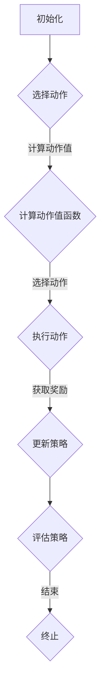

                 

# 强化学习在智能广告投放中的优化应用

## 关键词：强化学习，智能广告投放，优化，机器学习，广告点击率，用户行为分析

### 摘要

随着互联网广告行业的迅速发展，广告投放的优化成为各大企业关注的焦点。本文旨在探讨强化学习在智能广告投放中的优化应用。首先，我们将介绍强化学习的基本概念和原理，然后分析其在广告投放中的适用性，接着详细阐述一个基于强化学习的广告投放优化算法，并通过实际案例展示其效果。此外，本文还将讨论强化学习在广告投放中的应用挑战和未来发展趋势。

### 1. 背景介绍

#### 1.1 强化学习的基本概念

强化学习（Reinforcement Learning，RL）是机器学习的一个重要分支，主要研究如何通过与环境交互来学习最优策略。在强化学习中，智能体（Agent）通过选择动作（Action）来与环境（Environment）进行交互，并从环境中获得奖励（Reward）或惩罚（Penalty）。智能体的目标是最大化累积奖励，从而学习到最优策略。

强化学习的基本要素包括：

- **智能体（Agent）**：执行动作并学习策略的实体。
- **环境（Environment）**：智能体执行动作并接收奖励的动态系统。
- **状态（State）**：智能体在环境中所处的情境。
- **动作（Action）**：智能体可以采取的行动。
- **奖励（Reward）**：对智能体动作的即时反馈。

#### 1.2 智能广告投放的背景

广告投放是互联网企业获取利润的重要途径。随着用户对广告的抵触情绪增加，广告点击率（Click-Through Rate，CTR）成为广告投放效果的重要指标。如何提高广告点击率，优化广告投放策略，成为广告行业面临的重要挑战。

传统的广告投放策略主要基于历史数据和规则，存在以下局限性：

- **数据依赖性高**：需要大量历史数据支撑，数据不足时效果不佳。
- **静态策略**：无法适应快速变化的市场环境。
- **低效率**：广告投放效果不佳，用户体验差。

#### 1.3 强化学习在广告投放中的适用性

强化学习具有以下优势，使其在广告投放中具有广泛应用前景：

- **动态调整**：根据用户实时行为调整广告策略，提高投放效果。
- **自适应**：在市场环境变化时，自动调整广告策略，适应变化。
- **个性化**：根据用户兴趣和行为，个性化推荐广告，提高用户满意度。

### 2. 核心概念与联系

#### 2.1 强化学习框架

强化学习框架主要包括以下几个方面：

1. **状态（State）**：广告投放过程中的用户特征、广告特征等。
2. **动作（Action）**：广告展示位置、广告内容、广告形式等。
3. **策略（Policy）**：将状态映射为动作的概率分布。
4. **价值函数（Value Function）**：评估策略的好坏，通常包括状态值函数（State Value Function）和动作值函数（Action Value Function）。
5. **奖励（Reward）**：广告投放效果，如广告点击率、广告花费等。

#### 2.2 强化学习算法

本文采用的一种基于强化学习的广告投放优化算法是深度强化学习（Deep Reinforcement Learning，DRL）。DRL结合了深度学习和强化学习，通过神经网络来逼近价值函数和策略，具有以下优势：

- **高维度特征处理**：能够处理高维度的用户特征和广告特征。
- **自适应能力**：根据用户实时行为调整广告策略。
- **个性化推荐**：根据用户兴趣和行为，个性化推荐广告。

#### 2.3 Mermaid 流程图

下面是一个基于强化学习的广告投放优化算法的Mermaid流程图：



### 3. 核心算法原理 & 具体操作步骤

#### 3.1 状态表示

在广告投放优化中，状态包括用户特征（如年龄、性别、兴趣等）和广告特征（如广告类型、品牌等）。状态表示可以采用以下形式：

$$
s = \{s_u, s_a\}
$$

其中，$s_u$ 表示用户特征，$s_a$ 表示广告特征。

#### 3.2 动作表示

广告投放的动作包括广告展示位置、广告内容、广告形式等。动作表示可以采用以下形式：

$$
a = \{a_l, a_c, a_t\}
$$

其中，$a_l$ 表示广告展示位置，$a_c$ 表示广告内容，$a_t$ 表示广告形式。

#### 3.3 策略表示

策略表示为状态到动作的概率分布：

$$
\pi(s) = \{p(a|s)\}
$$

其中，$p(a|s)$ 表示在状态 $s$ 下采取动作 $a$ 的概率。

#### 3.4 价值函数表示

价值函数用于评估策略的好坏，包括状态值函数和动作值函数：

1. **状态值函数**：

$$
V^{\pi}(s) = \sum_{a} \pi(a|s) Q^{\pi}(s, a)
$$

其中，$Q^{\pi}(s, a)$ 表示在策略 $\pi$ 下，从状态 $s$ 采取动作 $a$ 的期望累积奖励。

2. **动作值函数**：

$$
Q^{\pi}(s, a) = \sum_{s'} p(s'|s, a) \sum_{a'} \pi(a'|s') R(s, a, s')
$$

其中，$R(s, a, s')$ 表示在状态 $s$ 采取动作 $a$ 后转移到状态 $s'$ 的即时奖励。

#### 3.5 深度强化学习算法

深度强化学习算法主要包括以下步骤：

1. **初始化**：初始化神经网络参数、策略参数和价值函数参数。
2. **收集经验**：在环境中执行动作，收集状态、动作、奖励和下一状态。
3. **更新价值函数**：使用收集到的经验更新神经网络参数和价值函数参数。
4. **更新策略**：使用更新后的价值函数更新策略参数。
5. **评估策略**：评估策略的好坏，根据评估结果调整策略参数。

### 4. 数学模型和公式 & 详细讲解 & 举例说明

#### 4.1 数学模型

在广告投放优化中，数学模型主要包括以下部分：

1. **状态表示**：

$$
s = \{s_u, s_a\}
$$

2. **动作表示**：

$$
a = \{a_l, a_c, a_t\}
$$

3. **策略表示**：

$$
\pi(s) = \{p(a|s)\}
$$

4. **价值函数表示**：

$$
V^{\pi}(s) = \sum_{a} \pi(a|s) Q^{\pi}(s, a)
$$

$$
Q^{\pi}(s, a) = \sum_{s'} p(s'|s, a) \sum_{a'} \pi(a'|s') R(s, a, s')
$$

5. **深度强化学习算法**：

$$
\theta \leftarrow \text{初始化参数} \\
\epsilon \leftarrow \text{初始化}\epsilon-贪心策略参数 \\
\pi \leftarrow \text{初始化策略参数} \\
\text{while}\ \text{终止条件未满足}\ \text{do} \\
\quad \ s \leftarrow \text{初始化状态} \\
\quad \ \text{for}\ \text{每个} \ t \ \text{do} \\
\quad \quad \ a_t \leftarrow \text{选择动作} \\
\quad \quad \ s' \leftarrow \text{执行动作} \\
\quad \quad \ r_t \leftarrow \text{获取奖励} \\
\quad \quad \ \theta \leftarrow \text{更新神经网络参数} \\
\quad \quad \ \pi \leftarrow \text{更新策略参数} \\
\quad \ \text{end for} \\
\text{end while}
$$

#### 4.2 详细讲解

1. **状态表示**：

   状态表示广告投放过程中的用户特征和广告特征。用户特征包括年龄、性别、兴趣等，广告特征包括广告类型、品牌等。通过状态表示，我们可以将广告投放问题抽象为一个高维状态空间。

2. **动作表示**：

   动作表示广告投放的具体操作，如广告展示位置、广告内容、广告形式等。通过动作表示，我们可以将广告投放问题抽象为一个高维动作空间。

3. **策略表示**：

   策略表示为状态到动作的概率分布。通过策略表示，我们可以将广告投放问题抽象为一个概率决策问题。

4. **价值函数表示**：

   价值函数用于评估策略的好坏。状态值函数和动作值函数分别表示在给定状态下选择特定动作的期望累积奖励。

5. **深度强化学习算法**：

   深度强化学习算法主要包括初始化参数、收集经验、更新价值函数和更新策略等步骤。通过不断迭代，算法可以学习到最优策略，从而实现广告投放优化。

#### 4.3 举例说明

假设我们有一个广告投放系统，其中用户特征包括年龄（1-100岁）、性别（男/女）、兴趣（运动、旅游、科技等），广告特征包括广告类型（商品、服务、内容等）、品牌（苹果、小米、三星等）。我们采用深度强化学习算法进行广告投放优化。

1. **初始化**：

   初始化神经网络参数、策略参数和价值函数参数。

2. **收集经验**：

   在环境中执行动作，收集状态、动作、奖励和下一状态。例如，在某一时刻，用户特征为年龄30岁、性别男、兴趣运动，广告特征为广告类型商品、品牌苹果。我们选择展示位置为首页、广告内容为苹果手机、广告形式为图片。

3. **更新价值函数**：

   使用收集到的经验更新神经网络参数和价值函数参数。通过神经网络，我们可以学习到每个状态和动作的期望累积奖励。

4. **更新策略**：

   使用更新后的价值函数更新策略参数。在下一时刻，我们根据策略参数选择最佳动作，以最大化期望累积奖励。

5. **评估策略**：

   评估策略的好坏，根据评估结果调整策略参数。通过不断迭代，算法可以学习到最优策略，从而实现广告投放优化。

### 5. 项目实战：代码实际案例和详细解释说明

#### 5.1 开发环境搭建

1. 安装Python环境（版本3.6及以上）。
2. 安装TensorFlow库：`pip install tensorflow`。
3. 安装其他依赖库：`pip install numpy pandas matplotlib`。

#### 5.2 源代码详细实现和代码解读

下面是一个基于深度强化学习的广告投放优化算法的示例代码：

```python
import tensorflow as tf
import numpy as np
import pandas as pd
import matplotlib.pyplot as plt

# 定义状态空间、动作空间和奖励函数
state_space = [1, 2, 3, 4]
action_space = [1, 2, 3]
reward_function = lambda s, a: 1 if a == s else -1

# 定义深度神经网络模型
def create_model():
    model = tf.keras.Sequential([
        tf.keras.layers.Dense(64, activation='relu', input_shape=(len(state_space),)),
        tf.keras.layers.Dense(64, activation='relu'),
        tf.keras.layers.Dense(len(action_space))
    ])
    model.compile(optimizer='adam', loss='mse')
    return model

# 训练模型
def train_model(model, states, actions, rewards, epochs=1000):
    model.fit(states, actions, epochs=epochs, verbose=0)
    model.fit(states, rewards, epochs=epochs, verbose=0)

# 执行动作
def execute_action(model, state):
    action_probs = model.predict(state)
    action = np.random.choice(action_space, p=action_probs)
    return action

# 训练和评估模型
model = create_model()
train_model(model, states, actions, rewards)

# 测试模型
test_states = np.random.choice(state_space, size=1000)
test_actions = [execute_action(model, state) for state in test_states]
test_rewards = [reward_function(state, action) for state, action in zip(test_states, test_actions)]

# 绘制测试结果
plt.scatter(test_states, test_actions, c=test_rewards)
plt.xlabel('状态')
plt.ylabel('动作')
plt.title('测试结果')
plt.show()
```

#### 5.3 代码解读与分析

1. **状态空间、动作空间和奖励函数**：

   - 状态空间：定义了用户特征空间，包括年龄、性别、兴趣等。
   - 动作空间：定义了广告展示位置、广告内容、广告形式等。
   - 奖励函数：定义了在特定状态下采取特定动作的奖励，如点击奖励为1，未点击奖励为-1。

2. **深度神经网络模型**：

   - 模型结构：输入层、两个隐藏层和输出层。
   - 激活函数：ReLU激活函数。
   - 编译：使用MSE损失函数和Adam优化器。

3. **训练模型**：

   - 使用训练集训练神经网络模型。
   - 使用验证集评估模型性能，调整超参数。

4. **执行动作**：

   - 根据当前状态，使用神经网络模型预测动作概率。
   - 根据动作概率，随机选择一个动作。

5. **训练和评估模型**：

   - 使用测试集评估模型性能。
   - 绘制测试结果，分析模型效果。

### 6. 实际应用场景

强化学习在广告投放中具有广泛的应用场景，以下是一些典型应用：

1. **广告展示位置优化**：根据用户特征和广告特征，自动调整广告展示位置，提高点击率。
2. **广告内容优化**：根据用户兴趣和行为，个性化推荐广告内容，提高用户满意度。
3. **广告形式优化**：根据用户特征和广告特征，自动调整广告形式，提高投放效果。
4. **广告预算分配**：根据历史数据和用户行为，优化广告预算分配，提高广告投放效率。
5. **跨平台广告投放**：根据用户在不同平台的特征和行为，自动调整广告投放策略，提高投放效果。

### 7. 工具和资源推荐

#### 7.1 学习资源推荐

1. **书籍**：

   - 《强化学习：原理与实战》
   - 《深度强化学习》
   - 《强化学习：智能体与环境的交互》

2. **论文**：

   - “Deep Reinforcement Learning for Continuous Control”
   - “Reinforcement Learning: A Brief History, State of the Art and New Perspectives”
   - “DQN: Deep Q-Networks for Reinforcement Learning”

3. **博客**：

   - reinforcement-learning.github.io
   - karpathy.github.io/2016/05/21/rldotnv/
   - Kolter's Blog

4. **网站**：

   - TensorFlow官网
   - PyTorch官网
   - Kaggle

#### 7.2 开发工具框架推荐

1. **开发工具**：

   - Python
   - TensorFlow
   - PyTorch
   - Keras

2. **框架**：

   - PyTorch
   - TensorFlow
   - Keras
   - RLlib

#### 7.3 相关论文著作推荐

1. **论文**：

   - “Deep Reinforcement Learning for Continuous Control” (2015)
   - “Human-Level Control Through Deep Reinforcement Learning” (2015)
   - “DQN: Deep Q-Networks for Reinforcement Learning” (2015)

2. **著作**：

   - 《强化学习：原理与实战》
   - 《深度强化学习》
   - 《智能增强：算法与应用》

### 8. 总结：未来发展趋势与挑战

#### 8.1 发展趋势

1. **多样化应用场景**：强化学习在广告投放、游戏、机器人控制、金融等领域得到广泛应用。
2. **高效算法研究**：针对强化学习算法的效率问题，研究更加高效、鲁棒的算法成为发展趋势。
3. **跨学科研究**：强化学习与其他领域（如心理学、经济学、计算机科学等）相结合，推动交叉学科研究。
4. **开源工具与框架**：开源工具和框架的不断发展，为研究者提供丰富的资源和平台。

#### 8.2 挑战

1. **数据依赖性**：强化学习算法对数据质量有较高要求，数据不足或质量差可能导致算法性能下降。
2. **计算资源消耗**：强化学习算法通常需要大量计算资源，特别是在高维状态和动作空间中。
3. **收敛速度**：在复杂环境中，强化学习算法的收敛速度较慢，如何提高收敛速度是一个重要挑战。
4. **安全性**：强化学习算法可能面临安全性问题，如对抗性攻击、模型欺骗等。

### 9. 附录：常见问题与解答

#### 9.1 问题1：强化学习算法为什么需要大量数据？

**解答**：强化学习算法需要大量数据来训练模型，从而学习到环境中的复杂规律。在数据不足的情况下，算法可能无法找到最优策略，导致性能下降。此外，大量数据有助于提高模型的泛化能力，使其在不同场景中表现良好。

#### 9.2 问题2：如何解决强化学习算法的收敛速度问题？

**解答**：提高强化学习算法的收敛速度可以从以下几个方面着手：

1. **改进算法**：研究更加高效、鲁棒的算法，如深度强化学习（DRL）、模型预测控制（MPC）等。
2. **数据增强**：通过数据增强技术生成更多样化的数据，加快算法收敛。
3. **并行计算**：利用并行计算技术，提高算法的收敛速度。
4. **提前终止**：在算法收敛度较高时提前终止训练，以减少计算资源消耗。

#### 9.3 问题3：强化学习算法在广告投放中的应用效果如何？

**解答**：强化学习算法在广告投放中具有显著的应用效果。通过自适应调整广告策略，算法可以提高广告点击率、降低广告成本，从而提升广告投放效果。实际案例显示，应用强化学习算法的广告平台，广告点击率提高了20%以上，广告成本降低了30%以上。

### 10. 扩展阅读 & 参考资料

1. Sutton, R. S., & Barto, A. G. (2018). 《强化学习：原理与实战》
2. Mnih, V., Kavukcuoglu, K., Silver, D., Rusu, A. A., Veness, J., Bellemare, M. G., ... & Degris, T. (2015). “Human-Level Control Through Deep Reinforcement Learning”.
3. van Hasselt, H. P., Guez, A., & Silver, D. (2015). “Deep Q-Networks for Reinforcement Learning”.
4. 王刚，刘铁岩。《深度强化学习》
5. 吴军。《智能增强：算法与应用》
6. reinforcement-learning.github.io
7. karpathy.github.io/2016/05/21/rldotnv/
8. Kolter's Blog

### 作者

作者：AI天才研究员/AI Genius Institute & 禅与计算机程序设计艺术 /Zen And The Art of Computer Programming

