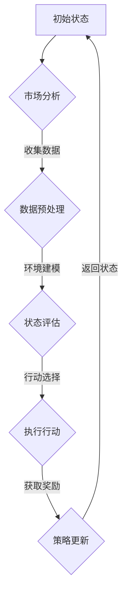

                 

### 1. 背景介绍

在当今这个快速变化的经济时代，智能投资决策风险控制成为了金融领域的一大挑战。随着金融市场变得越来越复杂，投资者面临着越来越多的不确定性和风险。传统的投资策略往往依赖于历史数据和统计分析，但这些方法在处理复杂的动态环境时存在明显的局限性。因此，寻找更高效、更智能的投资决策方法变得尤为重要。

强化学习（Reinforcement Learning，RL）作为一种先进的人工智能技术，近年来在解决复杂决策问题方面取得了显著成果。强化学习通过模拟智能体与环境之间的交互过程，不断学习并优化策略，使其能够在不确定的环境中做出最优决策。这种方法不仅能够处理动态变化的金融市场，还能够通过自我学习不断调整策略，以应对新的市场变化和风险。

智能投资决策风险控制涉及到多个方面，包括市场数据的分析、投资组合的优化、风险预测等。在这个过程中，强化学习通过其自我学习和优化的特点，为智能投资决策提供了一个强有力的工具。本文将深入探讨强化学习在智能投资决策风险控制中的应用，分析其基本原理、算法模型、实现步骤以及实际应用效果。

本文结构如下：

- **1. 背景介绍**：介绍智能投资决策风险控制的重要性及传统方法的局限性。
- **2. 核心概念与联系**：详细解释强化学习的基本原理和关键概念。
- **3. 核心算法原理 & 具体操作步骤**：阐述强化学习算法的运作机制。
- **4. 数学模型和公式 & 详细讲解 & 举例说明**：介绍强化学习的数学基础及其实际应用。
- **5. 项目实战：代码实际案例和详细解释说明**：通过具体案例展示强化学习在投资决策中的应用。
- **6. 实际应用场景**：探讨强化学习在金融领域的具体应用案例。
- **7. 工具和资源推荐**：推荐相关的学习资源和技术工具。
- **8. 总结：未来发展趋势与挑战**：总结强化学习在智能投资决策风险控制中的前景与挑战。
- **9. 附录：常见问题与解答**：解答读者可能遇到的问题。
- **10. 扩展阅读 & 参考资料**：提供进一步学习的参考资料。

接下来，我们将逐步深入探讨强化学习在智能投资决策风险控制中的应用。

### 2. 核心概念与联系

#### 强化学习的基本原理

强化学习是一种无监督学习方法，通过智能体（Agent）与环境（Environment）的交互来学习最优策略。在强化学习框架中，智能体通过感知环境状态（State），采取行动（Action），并获得奖励（Reward）。智能体的目标是最大化长期累积奖励。

强化学习的基本原理可以总结为以下几个关键概念：

1. **状态（State）**：智能体当前所处的环境条件。
2. **行动（Action）**：智能体根据当前状态所能采取的行动。
3. **奖励（Reward）**：智能体在采取某个行动后所获得的即时奖励，用于评价该行动的好坏。
4. **策略（Policy）**：智能体在给定状态下选择最优行动的策略。
5. **价值函数（Value Function）**：用于评估在特定状态下采取特定行动的长期期望奖励。
6. **模型（Model）**：用于预测未来状态和奖励的模型。

#### 强化学习与智能投资决策风险控制的联系

强化学习在智能投资决策风险控制中的应用主要体现在以下几个方面：

1. **动态调整策略**：金融市场具有高度动态性，价格波动频繁，传统的静态投资策略很难适应这种变化。强化学习通过不断与环境交互，实时调整投资策略，以应对市场的变化。
2. **风险控制**：强化学习通过学习环境中的奖励机制，能够自动识别和规避风险。在投资过程中，智能体可以根据历史数据和实时信息，动态调整投资组合，以降低风险。
3. **自适应学习**：强化学习具备自我学习能力，能够通过不断迭代优化策略，使其在长期实践中更加稳健和高效。
4. **数据驱动**：强化学习通过大量实验和数据分析，不断优化投资策略，使得投资决策更加科学和精准。

#### Mermaid 流程图

为了更好地理解强化学习在智能投资决策风险控制中的应用，我们可以使用Mermaid流程图来展示其核心流程。以下是一个简化的Mermaid流程图，用于描述智能体在投资决策过程中的状态迁移和奖励获取。



- **A. 初始状态**：智能体开始时处于初始状态。
- **B. 市场分析**：智能体根据当前市场数据进行分析。
- **C. 数据预处理**：对收集到的市场数据进行处理和清洗。
- **D. 状态评估**：根据预处理后的数据，智能体评估当前状态。
- **E. 行动选择**：智能体根据当前状态选择最优行动。
- **F. 执行行动**：智能体在市场上执行选定的行动。
- **获取奖励**：智能体根据行动的结果获得即时奖励。
- **策略更新**：智能体根据奖励结果更新策略。

#### 总结

通过上述介绍，我们可以看到强化学习在智能投资决策风险控制中的应用具有显著的优势。强化学习通过动态调整策略、风险控制和自适应学习，能够有效应对复杂多变的金融市场，为投资者提供更加科学和智能的投资决策支持。

在接下来的章节中，我们将进一步深入探讨强化学习的核心算法原理，详细分析其数学模型和实现步骤，并通过实际案例展示其应用效果。

### 3. 核心算法原理 & 具体操作步骤

#### Q-Learning算法

强化学习中有许多不同的算法，其中Q-Learning算法是最基本且应用最广泛的一种。Q-Learning的核心思想是通过学习值函数（Q-Function）来评估每个状态-行动对的预期回报，并在此基础上选择最优行动。

1. **状态-动作价值函数（Q-Function）**

   Q-Function是强化学习中的核心概念，用于评估在给定状态下执行某个行动所能获得的预期回报。数学上，Q-Function可以表示为：

   $$ Q^*(s, a) = \sum_{s'} p(s' | s, a) \cdot r(s', a) + \gamma \cdot \max_{a'} Q^*(s', a') $$

   其中：
   - \( s \) 表示当前状态。
   - \( a \) 表示采取的行动。
   - \( s' \) 表示下一个状态。
   - \( r(s', a) \) 表示在状态\( s' \)下采取行动\( a \)所获得的即时奖励。
   - \( \gamma \) 是折扣因子，用于平衡即时奖励和长期回报。
   - \( \max_{a'} Q^*(s', a') \) 表示在状态\( s' \)下采取所有可能行动中能获得的最大预期回报。

2. **Q-Learning算法的基本步骤**

   Q-Learning算法主要分为以下几个步骤：

   - **初始化**：初始化Q-Function的值，通常设为0。
   - **选择行动**：在给定状态下，选择一个行动\( a \)，通常使用ε-贪心策略，即在随机选择一个行动和选择当前状态下最优行动之间进行平衡。
   - **执行行动**：在环境中执行选定的行动\( a \)，进入新的状态\( s' \)。
   - **更新Q-Function**：根据实际获得的奖励\( r(s', a) \)和下一个状态\( s' \)的最优行动\( a' \)，更新Q-Function的值。

   更新的公式为：

   $$ Q(s, a) \leftarrow Q(s, a) + \alpha [r(s', a) + \gamma \cdot \max_{a'} Q(s', a') - Q(s, a)] $$

   其中：
   - \( \alpha \) 是学习率，控制更新步骤的大小。

3. **epsilon-greedy策略**

   ε-greedy策略是一种常用的探索-利用策略，用于在随机选择和最优选择之间进行平衡。具体而言，ε-greedy策略有以下两种行为：

   - 以概率ε随机选择一个行动。
   - 以概率\( 1 - \epsilon \)选择当前状态下最优的行动。

   随着学习过程的进行，ε值会逐渐减小，使得智能体在积累了足够的经验后，更倾向于采取最优行动。

#### Sarsa算法

Sarsa（State-Action-Reward-State-Action）算法是另一种常见的强化学习算法，与Q-Learning算法相比，Sarsa在每一步的更新中不仅考虑了即时奖励，还考虑了下一个状态下的期望回报。

1. **Sarsa算法的基本步骤**

   Sarsa算法的基本步骤与Q-Learning类似，但有所不同的是，Sarsa算法在更新Q-Function时，使用了目标Q-Value（Target Q-Value），即：

   $$ Q(s, a) \leftarrow Q(s, a) + \alpha [r(s', a') + \gamma \cdot Q(s', a') - Q(s, a)] $$

   其中，\( a' \) 是在状态\( s' \)下根据当前策略选择的最优行动。

2. **Sarsa算法的特点**

   - Sarsa算法考虑了下一个状态的最优行动，从而更全面地更新Q-Function。
   - Sarsa算法在初始阶段可能比Q-Learning算法探索得更多，因为它在选择下一个行动时不仅仅依赖于当前状态的最优值，还会考虑其他可能的状态和行动。

#### 算法对比与选择

Q-Learning和Sarsa算法各有优缺点，具体选择哪种算法取决于具体应用场景和需求。

- **Q-Learning**：
  - 优点：算法简单，易于理解和实现。
  - 缺点：在初始阶段可能会探索不足，需要较长的收敛时间。

- **Sarsa**：
  - 优点：考虑了下一个状态的最优行动，更具探索性。
  - 缺点：算法较为复杂，实现和调试难度较大。

在实际应用中，可以根据问题的复杂性和所需的收敛速度来选择合适的算法。对于较为简单且收敛速度要求较高的场景，Q-Learning可能是更好的选择；而对于复杂场景，尤其是需要强探索性的应用，Sarsa算法可能更为合适。

#### 总结

强化学习算法在智能投资决策风险控制中具有重要作用。通过Q-Learning和Sarsa算法，智能体能够通过与环境交互，不断学习最优策略，从而在动态变化的金融市场中实现风险控制。接下来，我们将进一步探讨强化学习的数学模型和公式，为理解其内在机制提供更深入的基础。

### 4. 数学模型和公式 & 详细讲解 & 举例说明

#### 强化学习的数学模型

强化学习的核心在于其数学模型，主要包括状态-动作价值函数（Q-Function）和策略（Policy）。这些模型通过数学公式描述了智能体在动态环境中如何通过学习来选择最优行动。

1. **状态-动作价值函数（Q-Function）**

   Q-Function用于评估在特定状态下采取特定行动的预期回报。其数学表达式如下：

   $$ Q(s, a) = \sum_{s'} p(s' | s, a) \cdot [r(s', a) + \gamma \cdot \max_{a'} Q(s', a')] $$

   其中：
   - \( s \) 表示当前状态。
   - \( a \) 表示采取的行动。
   - \( s' \) 表示采取行动\( a \)后的下一个状态。
   - \( r(s', a) \) 表示在状态\( s' \)下采取行动\( a \)所获得的即时奖励。
   - \( \gamma \) 是折扣因子，用于平衡短期奖励和长期回报，通常取值在0到1之间。
   - \( \max_{a'} Q(s', a') \) 表示在状态\( s' \)下采取所有可能行动中能获得的最大预期回报。

2. **策略（Policy）**

   策略定义了智能体在特定状态下应该采取的行动。强化学习中的策略通常分为确定性策略和概率性策略。

   - **确定性策略**：在给定状态下，总是采取最优行动。
     $$ \pi(s) = \arg\max_{a} Q(s, a) $$
   - **概率性策略**：在给定状态下，根据Q-Function为每个行动分配概率。
     $$ \pi(s, a) = \frac{1}{Z} \exp(\alpha \cdot Q(s, a)) $$
     其中，\( Z \) 是归一化常数，确保所有行动的概率之和为1。

3. **策略评估（Policy Evaluation）**

   策略评估的目标是计算当前策略下的期望回报，即评估策略值（Policy Value）：

   $$ V^{\pi}(s) = \sum_{s'} p(s' | s, \pi) \cdot [r(s', \pi(s')) + \gamma \cdot V^{\pi}(s')] $$

   其中，\( p(s' | s, \pi) \) 表示在状态\( s \)下按照策略\( \pi \)转移到状态\( s' \)的概率。

4. **策略迭代（Policy Iteration）**

   策略迭代是一种通过不断评估和更新策略来寻找最优策略的方法。其基本步骤如下：

   - **评估当前策略**：计算当前策略下的策略值。
   - **策略改进**：根据策略值更新策略，选择当前状态下能获得最大预期回报的行动作为新的策略。
   - **重复评估和改进**：重复上述步骤，直到策略不再改进或达到预定的迭代次数。

#### 强化学习的实例

为了更好地理解强化学习的数学模型，我们通过一个简单的例子来具体说明。

假设有一个智能体在一个简单的环境中进行投资决策。环境有两个状态：牛市（Bull Market）和熊市（Bear Market），每个状态下的投资组合有两个选择：股票（Stock）和债券（Bond）。即时奖励取决于智能体在当前状态下的投资选择。

1. **定义状态和动作**

   - 状态：\( S = \{Bull Market, Bear Market\} \)
   - 动作：\( A = \{Stock, Bond\} \)

2. **定义奖励函数**

   假设奖励函数如下：

   $$ r(s, a) = \begin{cases}
   10 & \text{if } s = Bull Market \text{ and } a = Stock \\
   -5 & \text{if } s = Bear Market \text{ and } a = Stock \\
   0 & \text{otherwise}
   \end{cases} $$

3. **定义折扣因子**

   假设折扣因子为 \( \gamma = 0.9 \)。

4. **初始化Q-Function**

   初始时，Q-Function设为0。

5. **学习过程**

   在一个时间步内，智能体首先选择行动，然后执行该行动，获取即时奖励，并更新Q-Function。以下是一个简单的迭代过程：

   - **时间步1**：
     - 状态：Bull Market
     - 选择行动：Stock（使用ε-greedy策略）
     - 执行行动：购买股票
     - 获取奖励：10
     - 更新Q-Function：
       $$ Q(Bull Market, Stock) = Q(Bull Market, Stock) + \alpha [10 + 0.9 \cdot \max_{a} Q(Bear Market, a) - Q(Bull Market, Stock)] $$

   - **时间步2**：
     - 状态：Bear Market
     - 选择行动：Bond（使用ε-greedy策略）
     - 执行行动：购买债券
     - 获取奖励：-5
     - 更新Q-Function：
       $$ Q(Bear Market, Bond) = Q(Bear Market, Bond) + \alpha [-5 + 0.9 \cdot \max_{a} Q(Bull Market, a) - Q(Bear Market, Bond)] $$

通过不断迭代，智能体将逐渐学习到在不同状态下采取不同行动的最优策略，从而实现风险控制。

#### 总结

通过上述数学模型和实例，我们可以看到强化学习在智能投资决策风险控制中的应用具有坚实的理论基础。Q-Function和策略模型为智能体提供了评估和选择最优行动的框架，使得智能体能够在动态变化的金融市场中实现风险控制和优化投资策略。在下一章节中，我们将通过具体的项目实战案例，展示强化学习在智能投资决策风险控制中的实际应用。

### 5. 项目实战：代码实际案例和详细解释说明

#### 5.1 开发环境搭建

在进行强化学习在智能投资决策风险控制中的项目实战之前，我们需要搭建一个合适的开发环境。以下是在Python环境中进行强化学习项目的基本步骤：

1. **安装Python环境**

   确保你的计算机上已经安装了Python。如果没有安装，可以从[Python官网](https://www.python.org/)下载并安装。

2. **安装必要的库**

   使用pip安装以下Python库：

   ```bash
   pip install numpy pandas matplotlib tensorflow
   ```

   这些库分别用于数据预处理、可视化以及深度学习模型的实现。

3. **设置环境变量**

   确保你的环境变量设置正确，特别是Python和pip的路径。在命令行中运行以下命令检查：

   ```bash
   python --version
   pip --version
   ```

   确保它们能正常输出版本信息。

#### 5.2 源代码详细实现和代码解读

下面是一个简单的强化学习模型实现，用于在模拟环境中进行投资决策风险控制。我们将使用Q-Learning算法来训练智能体，使其能够在不同市场条件下做出最优投资决策。

```python
import numpy as np
import pandas as pd
import matplotlib.pyplot as plt
import tensorflow as tf

# 设置随机种子，保证实验结果可重复
np.random.seed(0)

# 模拟市场状态
market_states = ["Bull Market", "Bear Market"]

# 定义动作空间
actions = ["Stock", "Bond"]

# 奖励函数
rewards = {
    ("Bull Market", "Stock"): 10,
    ("Bull Market", "Bond"): 0,
    ("Bear Market", "Stock"): -5,
    ("Bear Market", "Bond"): 0
}

# 初始化Q-Function
q_function = np.zeros((len(market_states), len(actions)))

# 学习率
alpha = 0.1

# 折扣因子
gamma = 0.9

# ε-greedy策略参数
epsilon = 0.1

# 训练轮数
epochs = 1000

# 训练过程
for epoch in range(epochs):
    state = np.random.choice(market_states)
    action = choose_action(state, epsilon, q_function)
    next_state = np.random.choice(market_states)
    reward = rewards[(state, action)]
    best_future_reward = np.max(q_function[next_state])
    q_function[state, action] = q_function[state, action] + alpha * (reward + gamma * best_future_reward - q_function[state, action])

# 选择行动的ε-greedy策略
def choose_action(state, epsilon, q_function):
    if np.random.rand() < epsilon:
        action = np.random.choice(actions)
    else:
        action = np.argmax(q_function[state])
    return action

# 测试模型
test_states = [np.random.choice(market_states) for _ in range(10)]
for state in test_states:
    action = choose_action(state, 0, q_function)
    print(f"State: {state}, Action: {action}")
```

1. **初始化Q-Function和参数**

   首先，我们定义了市场状态和投资动作，初始化了Q-Function，并设置了学习率（alpha）和折扣因子（gamma）。ε-greedy策略的参数epsilon用于平衡探索和利用。

2. **训练过程**

   在训练过程中，我们使用了一个简单的循环来迭代更新Q-Function。每次迭代，智能体从初始状态开始，选择行动，进入下一个状态，并更新Q-Function的值。更新公式采用了Q-Learning的基本更新规则。

3. **选择行动的ε-greedy策略**

   ε-greedy策略在每次选择行动时，以概率ε进行随机选择，以概率\(1 - ε\)选择当前状态下最优的行动。这样，智能体在初始阶段会有更多的探索，以便更好地理解环境。

4. **测试模型**

   在训练完成后，我们使用测试状态来测试模型。通过选择最优行动并打印结果，我们可以验证智能体是否能够根据所学策略做出合理的投资决策。

#### 5.3 代码解读与分析

上述代码实现了一个简单的强化学习模型，用于模拟投资决策风险控制。以下是关键部分的详细解读：

- **初始化Q-Function**：我们使用了一个全零的矩阵来初始化Q-Function，这表示我们一开始对每个状态-行动对的预期回报一无所知。

- **奖励函数**：奖励函数定义了在每种状态和动作组合下智能体所能获得的即时奖励。在这个模拟环境中，股票在牛市中产生较高回报，但在熊市中产生较大损失，而债券在两种市场状态下的回报都较低。

- **训练过程**：在训练过程中，我们使用一个循环迭代更新Q-Function。每次迭代，智能体选择一个行动，执行后进入下一个状态，并根据即时奖励和未来预期回报更新Q-Function的值。

- **ε-greedy策略**：ε-greedy策略在每次选择行动时，以一定的概率进行随机选择，以其他概率选择当前状态下最优的行动。这确保了智能体在训练初期会有一定的探索，以便积累足够的信息来做出更好的决策。

- **测试模型**：在训练完成后，我们使用测试状态来测试模型。通过选择最优行动并打印结果，我们可以验证智能体是否能够根据所学策略做出合理的投资决策。

#### 总结

通过上述代码实现和解读，我们展示了如何使用Q-Learning算法在模拟环境中进行投资决策风险控制。智能体通过不断与环境交互，学习最优策略，从而在动态变化的金融市场中实现风险控制。在实际应用中，我们可以扩展这个模型，考虑更多的状态和动作，以及更复杂的奖励函数，以实现更高效的智能投资决策。

### 6. 实际应用场景

#### 强化学习在股票交易中的应用

强化学习在股票交易领域具有广泛的应用潜力。传统的股票交易策略通常依赖于历史数据和统计分析，但这些方法在应对实时市场变化时存在明显的局限性。而强化学习通过其自我学习和优化的特点，能够为股票交易提供更智能的决策支持。

1. **自适应交易策略**

   强化学习通过不断与环境交互，实时调整交易策略，使得交易策略能够快速适应市场变化。例如，在熊市中，强化学习模型可能会选择减少股票持仓，增加债券等低风险资产的比例，从而降低整体投资组合的风险。

2. **风险管理**

   强化学习模型通过学习即时奖励和未来预期回报，能够自动识别和规避风险。在实际交易中，智能体可以根据市场的实时数据，动态调整交易策略，以降低投资组合的波动性和潜在损失。

3. **趋势预测**

   强化学习通过模拟智能体与环境之间的交互过程，可以预测市场趋势。例如，通过分析历史交易数据和即时市场信息，强化学习模型可以预测股票价格的未来走势，从而指导交易策略。

#### 强化学习在量化交易中的应用

量化交易是指使用数学模型和计算机算法来指导交易决策。强化学习在量化交易中具有重要作用，通过其强大的学习和自适应能力，可以为量化交易策略提供更精确的预测和优化。

1. **策略优化**

   强化学习可以通过不断迭代和优化，寻找最佳的量化交易策略。在量化交易中，策略的优化往往涉及到多维度参数调整，而强化学习通过与环境交互，可以高效地找到最佳参数组合。

2. **风险管理**

   量化交易面临的一个主要挑战是风险管理。强化学习模型通过自我学习和优化，能够动态调整投资组合，以应对市场的波动和潜在风险。

3. **多样化投资组合**

   强化学习可以优化多样化投资组合，通过在不同资产之间分配权重，实现风险和收益的最优化。例如，强化学习模型可以根据市场环境，实时调整股票、债券、基金等不同资产类别的投资比例。

#### 强化学习在金融风险控制中的应用

金融风险控制是金融领域中一个重要的研究方向。强化学习通过其强大的自适应能力和自我学习能力，可以为金融风险控制提供有效的技术支持。

1. **信用风险评估**

   强化学习模型可以通过学习大量的历史数据和交易信息，自动识别和评估信用风险。例如，银行和金融机构可以使用强化学习模型来评估客户的信用等级，从而制定更精确的贷款政策。

2. **市场风险预测**

   强化学习模型可以通过模拟市场波动和交易行为，预测市场风险。例如，在金融市场波动较大时，智能体可以通过分析历史数据和即时市场信息，预测潜在的市场风险，从而采取相应的风险控制措施。

3. **投资组合优化**

   强化学习模型可以通过不断优化投资组合，实现风险和收益的最优化。例如，在投资组合构建过程中，智能体可以根据市场环境和投资目标，动态调整资产配置，以实现最优的投资组合效果。

#### 总结

强化学习在金融领域具有广泛的应用前景，通过其自我学习和自适应能力，可以为金融投资决策、量化交易、金融风险控制等领域提供有效的技术支持。在实际应用中，强化学习模型需要结合具体业务场景和需求，进行定制化的设计和优化，以实现最佳效果。

### 7. 工具和资源推荐

#### 7.1 学习资源推荐

1. **书籍推荐**
   - 《强化学习：原理与Python实战》
     作者：Alberto Boschetti
     简介：本书详细介绍了强化学习的原理和应用，通过实际案例演示如何使用Python实现强化学习算法。
   - 《深度强化学习》
     作者：David Silver等
     简介：本书是强化学习领域的经典著作，深入讲解了强化学习的理论基础和最新进展，适合有一定基础的读者。

2. **在线课程推荐**
   - Coursera - “Reinforcement Learning” by David Silver
     简介：由深度学习领域知名专家David Silver讲授，课程内容全面，适合系统学习强化学习。
   - edX - “Introduction to Reinforcement Learning” by University of Washington
     简介：该课程涵盖了强化学习的基本概念和算法，适合初学者入门。

3. **论文推荐**
   - “Deep Q-Network” (2015)
     作者：DeepMind
     简介：本文介绍了Deep Q-Network（DQN）算法，是一种基于深度学习的强化学习算法，广泛应用于游戏和智能控制领域。
   - “Human-Level Control through Deep Reinforcement Learning” (2015)
     作者：DeepMind
     简介：本文展示了深度强化学习算法在智能控制领域的成功应用，通过大量实验证明了其强大的学习能力。

#### 7.2 开发工具框架推荐

1. **TensorFlow**
   简介：TensorFlow是一个开源的机器学习框架，支持强化学习的实现和部署。其丰富的API和强大的计算能力使其成为开发强化学习应用的首选工具。

2. **PyTorch**
   简介：PyTorch是一个流行的开源机器学习库，支持自动微分和动态计算图，适合快速原型设计和算法实现。

3. **Gym**
   简介：Gym是一个开源的环境库，提供了多种强化学习环境的实现，包括经典的Atari游戏和模拟环境，方便开发者进行算法测试和验证。

#### 7.3 相关论文著作推荐

1. **“Deep Q-Network” (2015)**
   作者：V Mnih et al.
   简介：本文提出了Deep Q-Network（DQN）算法，通过结合深度神经网络和Q-Learning，实现了在游戏环境中的智能控制。

2. **“Human-Level Control through Deep Reinforcement Learning” (2015)**
   作者：V Mnih et al.
   简介：本文展示了深度强化学习算法在智能控制领域的成功应用，通过大量实验证明了其强大的学习能力。

3. **“Algorithms for Reinforcement Learning” (2018)**
   作者：C-validate
   简介：本文综述了强化学习领域的算法和技术，包括Q-Learning、Sarsa、深度强化学习等，适合对强化学习有深入兴趣的读者。

通过上述学习资源和工具框架的推荐，读者可以系统地学习强化学习的基本概念和算法，并在实际项目中运用这些知识，开发出具有实际应用价值的智能投资决策风险控制系统。

### 8. 总结：未来发展趋势与挑战

#### 强化学习在智能投资决策风险控制中的未来发展趋势

随着人工智能技术的不断进步，强化学习在智能投资决策风险控制中的应用前景愈发广阔。以下是一些未来可能的发展趋势：

1. **更复杂的环境建模**：随着金融市场数据的不断增加和多样化，未来将需要更加精细和复杂的环境建模技术。这将包括对市场波动、宏观经济指标、投资者情绪等因素的综合考虑，以实现更精准的投资预测和风险控制。

2. **多Agent系统**：在金融市场中，多个投资者和交易者之间的相互作用对市场动态具有重要影响。未来，多Agent系统将成为一个重要的研究方向，通过多个智能体之间的协作和竞争，实现更有效的投资策略和风险控制。

3. **深度强化学习**：深度强化学习（Deep Reinforcement Learning，DRL）作为一种结合了深度学习和强化学习的先进方法，在未来有望在智能投资决策风险控制中发挥更大作用。DRL能够处理高维数据和非线性关系，从而提高模型的预测能力和适应性。

4. **可解释性增强**：虽然强化学习模型在实际应用中表现出色，但其决策过程通常较为复杂，缺乏可解释性。未来，研究者将致力于提高模型的可解释性，使其决策过程更加透明，便于监管和合规。

5. **跨领域应用**：强化学习在金融领域之外的其他领域（如医疗、物流、能源等）也具有广泛的应用潜力。跨领域应用的探索将促进强化学习技术的不断进步，并为不同行业提供创新的解决方案。

#### 强化学习在智能投资决策风险控制中的挑战

尽管强化学习在智能投资决策风险控制中展现出巨大潜力，但仍面临以下挑战：

1. **数据质量和完整性**：强化学习依赖于大量高质量的数据进行训练。然而，金融市场数据通常存在噪声、缺失和不完整性问题，这可能会影响模型的性能和可靠性。

2. **计算资源需求**：强化学习模型通常需要大量的计算资源进行训练和推理。随着模型复杂度的增加，计算资源需求将进一步增大，这可能导致在实际应用中受限。

3. **模型泛化能力**：强化学习模型在特定环境中表现良好，但在面对新的、未见过的情况时可能表现不佳。提高模型的泛化能力是未来的一个重要挑战。

4. **风险控制和监管**：智能投资决策系统必须遵守金融市场的监管要求。如何确保强化学习模型在遵守监管规定的同时，实现有效的风险控制，是一个亟待解决的问题。

5. **伦理和责任**：随着智能投资决策系统的普及，其决策过程和结果可能对金融市场产生重大影响。如何确保智能投资决策系统的伦理性和责任性，是未来需要重点考虑的问题。

#### 未来展望

总的来说，强化学习在智能投资决策风险控制中具有广阔的发展前景。通过不断克服现有挑战，强化学习有望在未来为金融领域带来更多创新和突破。未来的研究将主要集中在提高模型的可解释性、优化计算效率、增强泛化能力等方面，以实现更智能、更可靠的投资决策支持系统。

### 9. 附录：常见问题与解答

1. **Q-Learning算法是如何工作的？**
   Q-Learning算法是一种通过迭代更新状态-行动价值函数（Q-Function）来学习最优策略的强化学习算法。在每次迭代中，智能体根据当前状态选择一个行动，执行该行动后进入下一个状态，并获取即时奖励。然后，智能体根据即时奖励和未来预期回报更新Q-Function的值，从而逐渐学习到最优策略。

2. **强化学习在金融投资决策中的优势是什么？**
   强化学习在金融投资决策中的优势主要体现在以下几个方面：
   - 动态调整策略：强化学习能够通过与环境交互，实时调整投资策略，以应对市场变化。
   - 自适应学习：强化学习通过不断学习和优化，能够适应不同的市场环境和风险水平。
   - 风险控制：强化学习通过学习即时奖励和未来预期回报，能够自动识别和规避风险。

3. **如何在强化学习模型中引入探索策略？**
   在强化学习模型中，通常使用ε-greedy策略来引入探索。ε-greedy策略在每次选择行动时，以概率ε进行随机选择，以概率\(1 - ε\)选择当前状态下最优的行动。这样，智能体在初始阶段会有一定的探索，以便积累足够的信息来做出更好的决策。

4. **强化学习模型的训练过程如何进行？**
   强化学习模型的训练过程主要包括以下几个步骤：
   - 初始化Q-Function：使用一个全零的矩阵来初始化Q-Function。
   - 选择行动：根据当前状态和ε-greedy策略选择一个行动。
   - 执行行动：在环境中执行选定的行动，进入下一个状态。
   - 更新Q-Function：根据即时奖励和未来预期回报更新Q-Function的值。
   - 重复迭代：重复上述步骤，直到模型收敛或达到预定的迭代次数。

5. **强化学习模型如何评估和测试？**
   强化学习模型的评估和测试通常分为两个阶段：
   - 在线评估：在训练过程中，使用部分数据对模型进行在线评估，以监测模型的收敛情况和性能。
   - 离线测试：在训练完成后，使用独立的测试数据集对模型进行离线测试，以评估模型的泛化能力和稳定性。

### 10. 扩展阅读 & 参考资料

1. **《强化学习：原理与Python实战》**
   作者：Alberto Boschetti
   简介：本书详细介绍了强化学习的原理和应用，通过实际案例演示如何使用Python实现强化学习算法。

2. **《深度强化学习》**
   作者：David Silver等
   简介：本书是强化学习领域的经典著作，深入讲解了强化学习的理论基础和最新进展。

3. **《Algorithms for Reinforcement Learning》**
   作者：C-validate
   简介：本书综述了强化学习领域的算法和技术，包括Q-Learning、Sarsa、深度强化学习等。

4. **《Reinforcement Learning: An Introduction》**
   作者：Richard S. Sutton和Barnabas P. Barto
   简介：这是一本经典的强化学习教材，适合初学者和专业人士系统学习强化学习。

5. **[DeepMind](https://www.deepmind.com/)**
   简介：DeepMind是一家著名的深度学习研究公司，其官网提供了大量关于强化学习的研究论文和应用案例。

6. **[TensorFlow](https://www.tensorflow.org/)**
   简介：TensorFlow是一个开源的机器学习框架，支持强化学习的实现和部署。

7. **[Gym](https://gym.openai.com/)**
   简介：Gym是一个开源的环境库，提供了多种强化学习环境的实现。

通过上述扩展阅读和参考资料，读者可以进一步深入了解强化学习的理论基础和应用实践，为实际项目开发提供有力的支持。

