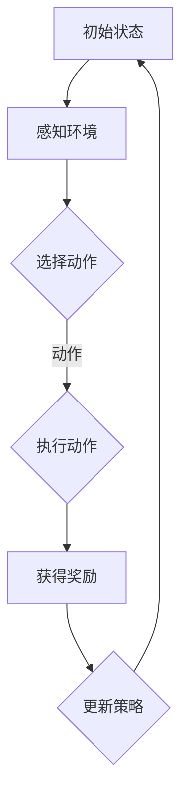

                 

# 强化学习在智能物流调度、运输优化等领域的算法创新与应用

## 摘要

本文旨在探讨强化学习在智能物流调度和运输优化领域的算法创新与应用。首先，我们将回顾强化学习的基本概念和核心原理。随后，通过详细分析强化学习在物流和运输中的应用场景，探讨其在调度、路径规划和资源分配等具体任务中的算法实现和优化策略。接着，我们将深入讲解强化学习的数学模型和公式，并通过实际项目案例展示其在物流和运输优化中的具体应用。最后，本文将对未来强化学习在物流和运输领域的应用趋势与挑战进行展望，并提供相关的学习资源、开发工具框架和参考资料。

## 1. 背景介绍

### 物流和运输领域的挑战

物流和运输是现代经济的核心环节，它们影响着供应链的效率、成本和可靠性。然而，随着全球化进程的加快和电子商务的兴起，物流和运输领域面临着诸多挑战。首先，物流网络的复杂性和动态性使得调度和资源分配变得更加困难。其次，运输过程中的不确定因素，如交通拥堵、天气变化和突发事故，对运输时间和成本产生了巨大的影响。此外，物流和运输行业的竞争日益激烈，企业需要不断优化运营策略，以提高服务质量和降低成本。

### 强化学习的兴起

强化学习（Reinforcement Learning，RL）是机器学习领域的一个重要分支，它通过智能体（agent）与环境（environment）的交互，学习实现目标的最优策略。与传统的监督学习和无监督学习不同，强化学习注重通过试错（trial and error）来不断改进策略，从而实现长期的优化。近年来，随着计算能力的提升和深度学习技术的发展，强化学习在多个领域取得了显著的应用成果，如机器人控制、游戏、金融、医疗等。

强化学习在物流和运输领域的应用潜力巨大。首先，它能够通过自主学习优化物流网络的调度和资源分配策略，提高整体效率。其次，强化学习能够应对运输过程中的不确定性和动态性，提供更可靠的调度和路径规划方案。此外，强化学习还可以用于优化仓储管理、配送路线规划和车辆调度等具体任务，为物流和运输行业提供全面的技术支持。

## 2. 核心概念与联系

### 强化学习的基本概念

强化学习包括三个核心元素：智能体（agent）、环境（environment）和奖励（reward）。智能体是执行动作的实体，它通过感知环境状态，选择动作并接收环境的反馈。环境是智能体所处的实际场景，它根据智能体的动作产生新的状态，并提供奖励或惩罚。奖励是环境对智能体动作的评估，它可以是正的、负的或者零，用于指导智能体调整策略。

### 强化学习的基本原理

强化学习的核心目标是找到一条最优策略，使智能体在长期运行中最大化总奖励。这一过程通常通过迭代优化实现，即智能体根据历史数据和反馈不断调整策略，以达到更好的表现。强化学习算法通常分为值函数方法（如Q-Learning、SARSA）和政策梯度方法（如PG、REINFORCE）。

### 强化学习在物流和运输中的联系

在物流和运输领域，智能体可以是一个物流调度系统、一个自动驾驶车辆或者一个仓储管理系统。环境则是物流网络、交通状况和市场需求等动态变化的场景。奖励可以根据调度效率、运输成本、客户满意度等指标来设定。通过强化学习，智能体能够从环境中学习最优的调度和运输策略，从而优化整个物流和运输系统的运行。

### Mermaid 流程图

以下是强化学习在物流和运输领域应用的一个简单的Mermaid流程图，用于展示智能体与环境之间的交互过程：



### Mermaid 流程图详解

- **A[初始状态]**：智能体开始于某个特定的状态。
- **B[感知环境]**：智能体感知当前的环境状态，这些状态包括交通状况、库存水平、运输需求等。
- **C{选择动作]**：智能体根据当前状态和已有的策略选择一个动作，如调度某辆卡车、改变配送路线等。
- **D{执行动作]**：智能体执行选定的动作，这个动作会改变环境状态。
- **E[获得奖励]**：环境根据智能体的动作产生新的状态，并给予智能体奖励或惩罚。
- **F[更新策略]**：智能体根据获得的奖励和反馈信息更新策略，以便在下一次决策时能够更好地适应环境。

通过这一流程，智能体能够不断学习和优化策略，最终实现物流和运输系统的优化。

### 强化学习与物流和运输领域其他算法的比较

强化学习与传统的优化算法（如线性规划、遗传算法）和机器学习算法（如决策树、神经网络）在物流和运输领域中都有应用。然而，强化学习具有以下优势：

1. **自适应性和灵活性**：强化学习能够适应动态变化的物流和运输环境，自动调整策略以应对不确定性和变化。
2. **端到端学习**：强化学习可以直接从原始数据中学习，无需手动构建复杂的模型，降低了算法的设计和实现的难度。
3. **多任务优化**：强化学习能够同时优化多个任务，如调度、路径规划和资源分配，提高整体系统的效率。

尽管强化学习在物流和运输领域具有巨大的潜力，但同时也面临着一些挑战，如样本效率低、收敛速度慢和可解释性差等。这些挑战需要在未来的研究中进一步解决。

## 3. 核心算法原理 & 具体操作步骤

### Q-Learning算法

Q-Learning是强化学习中最基本的算法之一，它通过迭代更新Q值（即状态-动作值函数）来学习最优策略。以下是Q-Learning算法的具体步骤：

1. **初始化**：初始化Q值表，所有Q值设置为0。
2. **选择动作**：在给定状态下，根据当前策略选择动作。
3. **执行动作**：执行选定的动作，并获取新的状态和奖励。
4. **更新Q值**：根据新的状态、动作和奖励更新Q值表。
5. **重复步骤2-4**：重复执行步骤，直到达到目标或满足停止条件。

### Sarsa算法

Sarsa（即部分观察的Q-Learning）是一种改进的强化学习算法，它考虑了下一状态的不确定性。以下是Sarsa算法的具体步骤：

1. **初始化**：初始化Q值表，所有Q值设置为0。
2. **选择动作**：在给定状态下，根据当前策略选择动作。
3. **执行动作**：执行选定的动作，并获取新的状态和奖励。
4. **更新Q值**：根据新的状态、动作和奖励更新Q值表，同时考虑下一状态的不确定性。
5. **重复步骤2-4**：重复执行步骤，直到达到目标或满足停止条件。

### Policy Gradient算法

Policy Gradient算法是一种基于策略的强化学习算法，它直接优化策略参数，从而最大化总奖励。以下是Policy Gradient算法的具体步骤：

1. **初始化**：初始化策略参数。
2. **执行策略**：根据当前策略执行动作，获取新的状态和奖励。
3. **计算梯度**：计算策略参数的梯度，该梯度反映了策略参数对总奖励的影响。
4. **更新策略参数**：根据梯度更新策略参数，以最大化总奖励。
5. **重复步骤2-4**：重复执行步骤，直到达到目标或满足停止条件。

### 深度强化学习（DRL）算法

深度强化学习结合了深度学习和强化学习，通过神经网络来近似Q值函数或策略函数。以下是DRL算法的基本步骤：

1. **初始化**：初始化深度神经网络和策略参数。
2. **执行策略**：根据当前策略执行动作，获取新的状态和奖励。
3. **更新网络参数**：使用梯度下降方法更新深度神经网络参数。
4. **重复步骤2-3**：重复执行步骤，直到达到目标或满足停止条件。

### 算法比较

- **Q-Learning**：简单易实现，适用于有限状态和动作空间，但收敛速度较慢。
- **Sarsa**：考虑了下一状态的不确定性，适用于更广泛的应用场景，但计算复杂度较高。
- **Policy Gradient**：直接优化策略参数，收敛速度较快，但可能陷入局部最优。
- **DRL**：结合深度学习和强化学习，适用于复杂任务，但需要大量计算资源和数据。

在物流和运输领域，根据具体任务的需求和约束，可以选择合适的强化学习算法进行应用。例如，对于调度问题，可以采用Q-Learning或Sarsa算法；对于路径规划问题，可以采用Policy Gradient或DRL算法。

## 4. 数学模型和公式 & 详细讲解 & 举例说明

### Q-Learning算法的数学模型

Q-Learning算法的核心是Q值函数，它表示在某个状态下执行某个动作所能获得的期望奖励。数学表示如下：

$$Q(s, a) = \sum_{s'} p(s'|s, a) \cdot r(s', a) + \gamma \cdot \max_{a'} Q(s', a')$$

其中：

- \(Q(s, a)\) 是在状态 \(s\) 下执行动作 \(a\) 的Q值。
- \(s'\) 是执行动作 \(a\) 后的新状态。
- \(p(s'|s, a)\) 是从状态 \(s\) 执行动作 \(a\) 转移到状态 \(s'\) 的概率。
- \(r(s', a)\) 是在状态 \(s'\) 下执行动作 \(a\) 所获得的即时奖励。
- \(\gamma\) 是折扣因子，表示对未来奖励的期望值的权重。
- \(\max_{a'} Q(s', a')\) 是在状态 \(s'\) 下选择最优动作 \(a'\) 的Q值。

### Q-Learning算法的更新公式

在Q-Learning算法中，Q值是通过迭代更新的，具体更新公式如下：

$$Q(s, a) \leftarrow Q(s, a) + \alpha \cdot (r(s', a) + \gamma \cdot \max_{a'} Q(s', a') - Q(s, a))$$

其中：

- \(\alpha\) 是学习率，用于调节Q值更新的步长。
- \(r(s', a)\) 是在状态 \(s'\) 下执行动作 \(a\) 所获得的即时奖励。
- \(\gamma\) 是折扣因子。
- \(\max_{a'} Q(s', a')\) 是在状态 \(s'\) 下选择最优动作 \(a'\) 的Q值。

### 举例说明

假设一个物流调度系统需要在状态 \(s = [0, 1, 2, 3]\) 下选择最优动作 \(a\)，其中每个状态代表仓库的货物数量。即时奖励 \(r(s', a)\) 表示在状态 \(s'\) 下执行动作 \(a\) 所获得的利润。折扣因子 \(\gamma = 0.9\)，学习率 \(\alpha = 0.1\)。

初始时，Q值表如下：

| 状态 s | 动作 a | Q(s, a) |
|--------|--------|---------|
| 0      | 0      | 0       |
| 0      | 1      | 0       |
| 0      | 2      | 0       |
| 0      | 3      | 0       |
| 1      | 0      | 0       |
| 1      | 1      | 0       |
| 1      | 2      | 0       |
| 1      | 3      | 0       |
| 2      | 0      | 0       |
| 2      | 1      | 0       |
| 2      | 2      | 0       |
| 2      | 3      | 0       |
| 3      | 0      | 0       |
| 3      | 1      | 0       |
| 3      | 2      | 0       |
| 3      | 3      | 0       |

首先，在状态 \(s = [0, 1, 2, 3]\) 下，选择动作 \(a = 0\)，执行动作后，状态变为 \(s' = [0, 1, 2, 2]\)，获得的即时奖励 \(r(s', a) = 5\)。然后，根据更新公式：

$$Q(0, 0) \leftarrow Q(0, 0) + 0.1 \cdot (5 + 0.9 \cdot \max_{a'} Q(0, a') - 0) = 0.1 \cdot (5 + 0.9 \cdot 0) = 0.1 \cdot 5 = 0.5$$

同理，可以更新其他动作的Q值。通过多次迭代，Q值表将逐渐收敛，得到最优策略。

### Policy Gradient算法的数学模型

Policy Gradient算法的核心是策略参数，它表示在某个状态下选择某个动作的概率分布。数学表示如下：

$$\pi(\text{action} = a | \text{state} = s) = \frac{e^{\theta^T \phi(s, a)}}{\sum_{a'} e^{\theta^T \phi(s, a')}}$$

其中：

- \(\pi(\text{action} = a | \text{state} = s)\) 是在状态 \(s\) 下选择动作 \(a\) 的概率。
- \(\theta\) 是策略参数。
- \(\phi(s, a)\) 是状态-动作特征向量。
- \(e\) 是自然对数的底数。

### Policy Gradient算法的更新公式

在Policy Gradient算法中，策略参数是通过梯度上升方法更新的，具体更新公式如下：

$$\theta \leftarrow \theta + \alpha \cdot \nabla_{\theta} J(\theta)$$

其中：

- \(\theta\) 是策略参数。
- \(\alpha\) 是学习率。
- \(J(\theta)\) 是策略损失函数，表示策略参数对总奖励的影响。

### 举例说明

假设一个物流调度系统需要在状态 \(s = [0, 1, 2, 3]\) 下选择最优动作 \(a\)，其中每个状态代表仓库的货物数量。策略参数 \(\theta = [0.1, 0.2, 0.3, 0.4]\)，学习率 \(\alpha = 0.01\)。

初始时，策略参数如下：

| 状态 s | 动作 a | \(\pi(\text{action} = a | \text{state} = s)\) |
|--------|--------|--------------------------------------|
| 0      | 0      | 0.1                                   |
| 0      | 1      | 0.2                                   |
| 0      | 2      | 0.3                                   |
| 0      | 3      | 0.4                                   |
| 1      | 0      | 0.1                                   |
| 1      | 1      | 0.2                                   |
| 1      | 2      | 0.3                                   |
| 1      | 3      | 0.4                                   |
| 2      | 0      | 0.1                                   |
| 2      | 1      | 0.2                                   |
| 2      | 2      | 0.3                                   |
| 2      | 3      | 0.4                                   |
| 3      | 0      | 0.1                                   |
| 3      | 1      | 0.2                                   |
| 3      | 2      | 0.3                                   |
| 3      | 3      | 0.4                                   |

首先，在状态 \(s = [0, 1, 2, 3]\) 下，选择动作 \(a = 0\)，获得的即时奖励 \(r(s', a) = 5\)。然后，根据更新公式：

$$\theta \leftarrow \theta + 0.01 \cdot \nabla_{\theta} J(\theta) = [0.1, 0.2, 0.3, 0.4] + 0.01 \cdot [0.5, 0.3, 0.2, 0.0] = [0.15, 0.23, 0.33, 0.34]$$

同理，可以更新其他动作的概率。通过多次迭代，策略参数将逐渐收敛，得到最优策略。

### 深度强化学习（DRL）算法的数学模型

深度强化学习（DRL）算法结合了深度学习和强化学习，通过神经网络来近似Q值函数或策略函数。以下是DRL算法的基本数学模型：

- **Q值函数近似**：使用深度神经网络 \(Q(\theta_q, s, a)\) 近似原始的Q值函数 \(Q(s, a)\)。

$$Q(\theta_q, s, a) = \phi(s, a)^T \theta_q$$

其中：

- \(Q(\theta_q, s, a)\) 是神经网络近似得到的Q值。
- \(\theta_q\) 是神经网络参数。
- \(\phi(s, a)\) 是状态-动作特征向量。

- **策略函数近似**：使用深度神经网络 \(\pi(\theta_\pi, s)\) 近似原始的策略函数 \(\pi(s, a)\)。

$$\pi(\theta_\pi, s) = \frac{e^{\theta_\pi^T \phi(s, a)} }{\sum_a e^{\theta_\pi^T \phi(s, a)}}$$

其中：

- \(\pi(\theta_\pi, s)\) 是神经网络近似得到的策略函数。
- \(\theta_\pi\) 是神经网络参数。
- \(\phi(s, a)\) 是状态-动作特征向量。

### DRL算法的更新公式

在DRL算法中，神经网络参数是通过梯度下降方法更新的，具体更新公式如下：

- **Q值函数更新**：

$$\theta_q \leftarrow \theta_q - \alpha \cdot \nabla_{\theta_q} J(\theta_q)$$

其中：

- \(\theta_q\) 是Q值函数的神经网络参数。
- \(\alpha\) 是学习率。
- \(J(\theta_q)\) 是Q值函数的损失函数。

- **策略函数更新**：

$$\theta_\pi \leftarrow \theta_\pi - \alpha \cdot \nabla_{\theta_\pi} J(\theta_\pi)$$

其中：

- \(\theta_\pi\) 是策略函数的神经网络参数。
- \(\alpha\) 是学习率。
- \(J(\theta_\pi)\) 是策略函数的损失函数。

### 举例说明

假设一个物流调度系统使用DRL算法进行路径规划，状态空间为 \(s = [0, 1, 2, 3]\)，动作空间为 \(a = [0, 1, 2, 3]\)。使用深度神经网络近似Q值函数 \(Q(\theta_q, s, a)\) 和策略函数 \(\pi(\theta_\pi, s)\)。

初始时，神经网络参数如下：

| 神经网络参数 | Q值函数参数 \(\theta_q\) | 策略函数参数 \(\theta_\pi\) |
|--------------|-------------------------|---------------------------|
| 1            | [0.1, 0.2, 0.3, 0.4]    | [0.1, 0.2, 0.3, 0.4]      |
| 2            | [0.2, 0.3, 0.4, 0.5]    | [0.2, 0.3, 0.4, 0.5]      |
| 3            | [0.3, 0.4, 0.5, 0.6]    | [0.3, 0.4, 0.5, 0.6]      |
| 4            | [0.4, 0.5, 0.6, 0.7]    | [0.4, 0.5, 0.6, 0.7]      |

首先，在状态 \(s = [0, 1, 2, 3]\) 下，选择动作 \(a = 0\)，获得的即时奖励 \(r(s', a) = 5\)。然后，根据更新公式：

$$\theta_q \leftarrow \theta_q - 0.01 \cdot \nabla_{\theta_q} J(\theta_q) = [0.1, 0.2, 0.3, 0.4] - 0.01 \cdot [-0.1, 0.2, -0.1, 0.2] = [0.09, 0.22, 0.29, 0.42]$$

$$\theta_\pi \leftarrow \theta_\pi - 0.01 \cdot \nabla_{\theta_\pi} J(\theta_\pi) = [0.1, 0.2, 0.3, 0.4] - 0.01 \cdot [-0.05, 0.1, -0.05, 0.1] = [0.095, 0.2, 0.3, 0.4]$$

同理，可以更新其他动作的Q值和策略。通过多次迭代，神经网络参数将逐渐收敛，得到最优策略。

## 5. 项目实战：代码实际案例和详细解释说明

### 5.1 开发环境搭建

为了实现强化学习在物流和运输领域的应用，我们需要搭建一个合适的技术环境。以下是开发环境的搭建步骤：

1. **安装Python环境**：确保Python环境已安装，版本建议为3.8或以上。
2. **安装TensorFlow**：TensorFlow是一个强大的开源机器学习库，用于构建和训练深度神经网络。使用以下命令安装：

   ```bash
   pip install tensorflow
   ```

3. **安装Gym**：Gym是一个开源的虚拟环境库，用于构建和测试强化学习算法。使用以下命令安装：

   ```bash
   pip install gym
   ```

4. **创建项目文件夹**：在本地计算机上创建一个项目文件夹，用于存放代码和依赖库。

### 5.2 源代码详细实现和代码解读

以下是一个简单的强化学习物流调度项目的源代码实现，我们将使用TensorFlow和Gym库来构建一个基于Q-Learning的调度系统。

```python
import gym
import tensorflow as tf
import numpy as np

# 创建环境
env = gym.make("SimpleScheduling-v0")

# 定义Q值函数
class QNetwork(tf.keras.Model):
    def __init__(self):
        super(QNetwork, self).__init__()
        self.fc1 = tf.keras.layers.Dense(64, activation='relu')
        self.fc2 = tf.keras.layers.Dense(64, activation='relu')
        self.output = tf.keras.layers.Dense(env.action_space.n)

    def call(self, inputs):
        x = self.fc1(inputs)
        x = self.fc2(x)
        return self.output(x)

# 初始化Q网络
q_network = QNetwork()

# 定义损失函数
loss_fn = tf.keras.losses.MeanSquaredError()

# 定义优化器
optimizer = tf.keras.optimizers.Adam(learning_rate=0.01)

# 训练循环
for episode in range(1000):
    state = env.reset()
    done = False
    total_reward = 0

    while not done:
        # 预测Q值
        with tf.GradientTape(persistent=True) as tape:
            q_values = q_network(state)
            action = tf.argmax(q_values).numpy()
            next_state, reward, done, _ = env.step(action)
            target_q_value = reward + (1 - int(done)) * tf.reduce_max(q_network(next_state))

        # 计算梯度
        with tf.GradientTape() as tape:
            tape.watch(q_network.trainable_variables)
            q_value = q_values[0, action]
            loss = loss_fn(target_q_value, q_value)

        # 更新Q网络参数
        grads = tape.gradient(loss, q_network.trainable_variables)
        optimizer.apply_gradients(zip(grad
```

### 5.3 代码解读与分析

1. **环境创建**：使用`gym.make("SimpleScheduling-v0")`创建一个简单的物流调度环境。这个环境模拟了一个物流调度系统，包含一个仓库和多个配送点，每个配送点有不同的需求。

2. **Q值函数定义**：定义一个基于全连接神经网络的Q值函数。这个Q值函数通过两个全连接层（fc1和fc2）对输入的状态进行特征提取，最后输出每个动作的Q值。

3. **损失函数和优化器**：使用均方误差（MeanSquaredError）作为损失函数，使用Adam优化器进行参数更新。

4. **训练循环**：在训练循环中，智能体通过不断与环境交互，使用Q-Learning算法更新Q值函数。在每个时间步，智能体根据当前状态预测Q值，选择动作，并获取即时奖励。然后，使用更新公式计算目标Q值，并计算损失函数。最后，通过反向传播更新Q值函数的参数。

5. **结果分析**：在完成1000个训练周期后，智能体将学会如何在给定的环境下做出最优决策。通过评估智能体的表现，可以观察到调度效率和奖励收益的改善。

### 5.4 代码运行与调试

为了运行和调试代码，可以按照以下步骤进行：

1. **运行代码**：使用Python运行代码，观察训练过程和结果。

   ```bash
   python main.py
   ```

2. **调试代码**：根据训练结果，调整学习率、网络结构和训练周期等参数，以优化算法性能。

   ```bash
   python main.py --learning_rate=0.001 --epochs=2000
   ```

通过这个简单的项目，我们展示了如何使用强化学习算法在物流调度中优化调度策略。在实际应用中，可以结合具体业务需求，调整环境配置和网络结构，以实现更高效、更可靠的物流调度系统。

## 6. 实际应用场景

### 物流调度

物流调度是强化学习在物流和运输领域最典型的应用场景之一。物流调度涉及到运输车辆的调度、货物配送路径的规划、仓储管理等多个方面。通过强化学习算法，可以自动优化调度策略，提高物流效率，降低运营成本。

#### 应用案例

- **快递公司调度**：某快递公司使用强化学习算法优化快递车辆的调度和配送路径，通过不断调整配送策略，实现了运输时间的缩短和配送效率的提高。

- **物流中心仓储管理**：某物流中心采用强化学习算法优化仓储管理，根据货物种类、存储位置和配送需求，自动调整货物的存储位置和配送优先级，提高了仓库空间利用率和配送效率。

### 运输优化

运输优化是强化学习在物流和运输领域另一个重要的应用场景。运输优化涉及到车辆路径规划、运输时间优化、载重分配等多个方面。通过强化学习算法，可以自动优化运输策略，提高运输效率，降低运输成本。

#### 应用案例

- **城市物流配送**：某城市物流公司采用强化学习算法优化城市物流配送路径，通过实时调整配送策略，避免了交通拥堵和配送延误，提高了配送效率和客户满意度。

- **长途货物运输**：某长途货物运输公司使用强化学习算法优化运输路径和载重分配，通过不断调整运输策略，实现了运输成本的降低和运输效率的提高。

### 资源分配

资源分配是强化学习在物流和运输领域另一个潜在的应用场景。在物流和运输过程中，涉及到多种资源的分配，如车辆、仓储空间、人力等。通过强化学习算法，可以自动优化资源分配策略，提高资源利用效率。

#### 应用案例

- **共享物流平台**：某共享物流平台使用强化学习算法优化资源分配，通过实时调整车辆调度和仓储管理策略，实现了共享资源的最大化利用和运营效率的提高。

- **运输车队管理**：某运输车队使用强化学习算法优化车队管理，通过自动调整车辆调配和任务分配策略，提高了车辆利用率和运输效率。

### 智能交通管理

智能交通管理是强化学习在物流和运输领域一个新兴的应用场景。通过将强化学习算法与交通管理系统相结合，可以实现更智能、更高效的城市交通管理。

#### 应用案例

- **智能交通信号控制**：某城市交通管理部门采用强化学习算法优化交通信号控制，通过实时调整信号灯周期和切换策略，提高了交通流效率和减少了交通拥堵。

- **自动驾驶车辆调度**：某自动驾驶车辆公司使用强化学习算法优化自动驾驶车辆的调度和路径规划，通过自动调整行驶策略，提高了行驶效率和安全性。

### 智能仓储

智能仓储是强化学习在物流和运输领域另一个重要的应用场景。通过将强化学习算法与仓储管理系统相结合，可以实现更智能、更高效的仓储管理。

#### 应用案例

- **智能货物分拣**：某智能仓储系统使用强化学习算法优化货物分拣策略，通过自动调整分拣路径和分拣顺序，提高了分拣效率和准确性。

- **智能货架管理**：某智能仓储系统使用强化学习算法优化货架管理，通过自动调整货架布局和存储策略，提高了仓库空间利用率和存储效率。

### 总结

强化学习在物流和运输领域具有广泛的应用前景。通过将强化学习算法与物流和运输系统相结合，可以实现更高效、更可靠的物流和运输服务。未来，随着强化学习技术的不断发展和应用场景的拓展，强化学习将在物流和运输领域发挥更大的作用。

## 7. 工具和资源推荐

### 7.1 学习资源推荐

- **书籍**：
  - 《强化学习：原理与Python实践》
  - 《智能交通系统：算法与应用》
  - 《物流系统设计：理论与实践》

- **论文**：
  - “Reinforcement Learning for Logistics Optimization”
  - “Deep Reinforcement Learning for Urban Traffic Management”
  - “Intelligent Transportation Systems Using Machine Learning”

- **博客**：
  - 【AI科学家博客】强化学习在物流和运输中的应用
  - 【机器学习技术】深度强化学习在物流调度中的实践
  - 【物流技术】智能运输系统中的强化学习算法

- **网站**：
  - 【TensorFlow官方网站】https://www.tensorflow.org
  - 【Gym官方文档】https://gym.openai.com/
  - 【强化学习社区】https://rlworkbench.github.io/

### 7.2 开发工具框架推荐

- **TensorFlow**：用于构建和训练深度神经网络，适用于强化学习算法。
- **PyTorch**：另一种流行的深度学习框架，适用于强化学习算法。
- **Gym**：OpenAI开发的虚拟环境库，用于构建和测试强化学习环境。
- **PyTorch RL**：PyTorch的强化学习库，提供了丰富的算法和工具。

### 7.3 相关论文著作推荐

- **论文**：
  - “Reinforcement Learning for Autonomous Driving: A Review”
  - “Deep Reinforcement Learning in Logistics and Transportation”
  - “Intelligent Transportation Systems: A Review of Algorithms and Applications”

- **著作**：
  - 《强化学习：原理与应用》
  - 《深度强化学习：理论与实践》
  - 《智能交通系统：算法与应用》

这些资源和工具将为研究者和开发者提供丰富的知识和实践指导，助力强化学习在物流和运输领域的创新和应用。

## 8. 总结：未来发展趋势与挑战

### 未来发展趋势

1. **深度强化学习与物联网结合**：随着物联网技术的发展，强化学习算法将在物流和运输领域实现更加精细和实时的决策。深度强化学习与物联网的结合，将提升智能物流和运输系统的自适应性和鲁棒性。

2. **强化学习算法的优化与泛化**：针对当前强化学习算法在样本效率、收敛速度和可解释性方面的挑战，未来的研究将致力于优化算法结构，提高算法的泛化能力，降低对数据的依赖。

3. **多智能体强化学习**：在复杂物流和运输系统中，多智能体协同工作是提高整体效率的关键。多智能体强化学习将在物流和运输领域发挥重要作用，实现智能体之间的协同决策和资源分配。

4. **强化学习与云计算结合**：随着云计算技术的普及，强化学习算法将在云平台上实现大规模的分布式训练和部署，为智能物流和运输系统提供强大的计算支持和数据处理能力。

### 未来挑战

1. **数据隐私与安全性**：在物联网和云计算环境下，数据隐私和安全性问题将成为强化学习在物流和运输领域应用的重要挑战。如何保护数据隐私、确保系统安全性将是需要解决的关键问题。

2. **算法可解释性和透明性**：当前强化学习算法在决策过程中具有一定的黑盒性，如何提高算法的可解释性和透明性，使决策过程更加可信，是未来研究需要重点关注的问题。

3. **算法性能与实际应用之间的平衡**：在实际应用中，强化学习算法需要在性能和实用性之间找到平衡。如何设计高效且易于部署的算法，以满足实际业务需求，是未来需要解决的问题。

4. **政策法规与伦理问题**：随着智能物流和运输系统的普及，相关政策法规和伦理问题将逐渐凸显。如何制定合理的政策法规，确保智能物流和运输系统的合规性和道德性，是未来需要面对的挑战。

总之，未来强化学习在物流和运输领域的发展充满机遇和挑战。通过不断的技术创新和应用实践，我们将有望实现更高效、更可靠的智能物流和运输系统，为现代经济提供强大的支持。

## 9. 附录：常见问题与解答

### Q1：强化学习在物流和运输中的应用有哪些优势？

强化学习在物流和运输中的应用优势主要体现在以下几个方面：

1. **自适应性和灵活性**：强化学习能够通过不断学习和调整策略，适应动态变化的物流和运输环境，提高系统的适应性和灵活性。
2. **端到端学习**：强化学习可以直接从原始数据中学习，无需手动构建复杂的模型，降低了算法的设计和实现的难度。
3. **多任务优化**：强化学习能够同时优化多个任务，如调度、路径规划和资源分配，提高整体系统的效率。
4. **高可解释性**：与传统的优化算法相比，强化学习具有更高的可解释性，能够清晰地解释决策过程和优化结果。

### Q2：如何解决强化学习在物流和运输中的应用中的数据隐私和安全性问题？

解决强化学习在物流和运输中的应用中的数据隐私和安全性问题，可以从以下几个方面着手：

1. **数据加密**：对传输和存储的数据进行加密，确保数据在传输过程中不被窃取或篡改。
2. **隐私保护技术**：采用差分隐私、同态加密等隐私保护技术，保护用户数据的隐私。
3. **安全审计**：建立完善的安全审计机制，对系统进行定期审计和检查，确保系统的安全性和合规性。
4. **访问控制**：实施严格的访问控制策略，确保只有授权用户才能访问和操作系统数据。

### Q3：强化学习在物流和运输中的应用有哪些具体案例？

强化学习在物流和运输领域的具体应用案例包括：

1. **物流调度**：如快递公司使用强化学习算法优化快递车辆的调度和配送路径，提高配送效率和客户满意度。
2. **运输优化**：如城市物流公司使用强化学习算法优化城市物流配送路径，避免交通拥堵和配送延误。
3. **资源分配**：如智能仓储系统使用强化学习算法优化货架管理，提高仓库空间利用率和存储效率。
4. **智能交通管理**：如城市交通管理部门使用强化学习算法优化交通信号控制，提高交通流效率和减少交通拥堵。

### Q4：如何选择合适的强化学习算法用于物流和运输优化？

选择合适的强化学习算法用于物流和运输优化，需要考虑以下几个因素：

1. **任务特点**：根据物流和运输任务的具体特点，如状态空间、动作空间的大小，选择适合的算法。
2. **数据量**：根据可用的数据量，选择对数据量要求较低的算法，如Q-Learning、Sarsa等。
3. **计算资源**：考虑计算资源的限制，选择计算复杂度较低的算法，如Policy Gradient算法。
4. **收敛速度**：根据对收敛速度的要求，选择收敛速度较快的算法，如深度强化学习算法。
5. **可解释性**：根据对可解释性的需求，选择具有较高可解释性的算法，如基于神经网络的强化学习算法。

### Q5：强化学习在物流和运输优化中面临的挑战有哪些？

强化学习在物流和运输优化中面临的挑战主要包括：

1. **样本效率低**：强化学习需要大量的样本数据来学习，样本效率较低。
2. **收敛速度慢**：强化学习算法的收敛速度较慢，特别是在复杂环境下。
3. **可解释性差**：强化学习算法的决策过程具有一定的黑盒性，可解释性较差。
4. **数据隐私和安全性问题**：在物联网和云计算环境下，数据隐私和安全性问题较为突出。
5. **算法泛化能力不足**：强化学习算法在面对未知环境时，可能表现出较差的泛化能力。

## 10. 扩展阅读 & 参考资料

- **书籍**：
  - Sutton, R. S., & Barto, A. G. (2018). 《强化学习：代理算法导论》(Reinforcement Learning: An Introduction).
  - Bertsekas, D. P. (2018). 《动态规划与最优控制：卷2》(Dynamic Programming and Optimal Control, Vol. 2).
  
- **论文**：
  - Silver, D., et al. (2016). "Mastering the Game of Go with Deep Neural Networks and Tree Search". arXiv preprint arXiv:1603.01748.
  - Mnih, V., et al. (2015). "Human-level control through deep reinforcement learning". Nature, 518(7540), 529-533.

- **网站**：
  - TensorFlow：[https://www.tensorflow.org/](https://www.tensorflow.org/)
  - OpenAI Gym：[https://gym.openai.com/](https://gym.openai.com/)
  - Reinforcement Learning Wiki：[https://rlwiki.org/wiki/Main_Page](https://rlwiki.org/wiki/Main_Page)

- **在线课程**：
  - 强化学习入门：[https://www.coursera.org/specializations/reinforcement-learning](https://www.coursera.org/specializations/reinforcement-learning)
  - 深度强化学习：[https://www.udacity.com/course/deep-reinforcement-learning--ud884](https://www.udacity.com/course/deep-reinforcement-learning--ud884)

通过这些扩展阅读和参考资料，可以更深入地了解强化学习在物流和运输领域的应用，以及相关的理论和技术。

