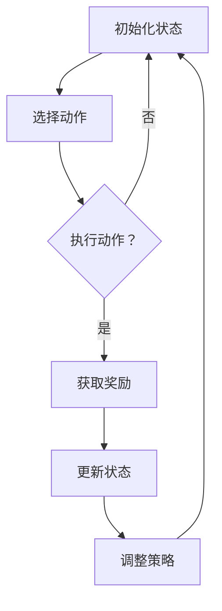

                 

### 背景介绍

#### 强化学习在智能电网需求响应中的重要性

随着全球能源需求的不断增长，以及能源结构的逐步优化和新能源技术的广泛应用，智能电网的发展已成为未来能源系统的必然趋势。智能电网通过数字化、自动化和智能化技术，实现对电力系统的实时监控、管理和优化，以提高电力系统的运行效率、可靠性和经济性。在智能电网中，需求响应（Demand Response，DR）作为一种有效的市场化手段，能够根据电力系统的实时需求，调节用户的用电行为，从而平衡供需、降低峰值负荷、减少能源浪费。

强化学习（Reinforcement Learning，RL）作为机器学习领域的一种重要方法，通过智能体（agent）与环境的交互，不断优化决策策略，以实现长期的收益最大化。近年来，强化学习在智能电网需求响应中的应用逐渐受到关注。通过引入强化学习，智能电网能够更加灵活、智能化地响应电力系统的动态变化，提高需求响应的效率和质量。

本文将深入探讨强化学习在智能电网需求响应中的实现方法，分析其核心概念、算法原理、数学模型，并通过实际案例，展示其在电力系统中的应用效果。

#### 智能电网的需求响应机制

需求响应机制是智能电网的一个重要组成部分，其核心思想是通过市场化手段，激励用户根据电力系统的实际需求，调整自身的用电行为。需求响应可以分为几种不同的类型，包括：

1. **价格响应**：通过调整电价，引导用户在电价较低时增加用电，在电价较高时减少用电，从而平衡供需。
2. **信号响应**：通过发送信号，如通知、警告或提示，指导用户调整用电行为。
3. **技术响应**：通过技术手段，如智能家电、智能电表等，自动调整用户的用电行为。

需求响应机制在智能电网中具有多方面的应用价值：

- **提高电力系统的稳定性**：通过需求响应，可以降低峰值负荷，减少电力系统的压力，提高电力系统的运行稳定性。
- **降低能源消耗**：通过需求响应，可以优化用户的用电行为，减少不必要的能源浪费。
- **提升电力市场的效率**：通过需求响应，可以引导用户参与电力市场，提高市场的交易量和价格发现功能。

然而，传统的需求响应方法往往存在响应速度慢、灵活性不足等问题。而强化学习作为一种动态决策方法，能够更好地适应电力系统的实时变化，提高需求响应的效率和效果。

#### 强化学习的发展历程

强化学习起源于20世纪50年代，其概念源于动物学习行为的研究。自1950年代以来，强化学习经历了多个阶段的发展：

- **1950年代至1970年代**：强化学习理论初步形成，主要包括马尔可夫决策过程（MDP）和值函数方法。这一阶段的研究主要集中在理论模型和算法设计，实际应用较为有限。
- **1980年代至1990年代**：随着计算机性能的提升，强化学习开始应用于一些实际场景，如自动控制系统和机器人导航。同时，策略迭代方法和部分可观测性问题的研究得到了广泛关注。
- **2000年代**：深度强化学习（Deep Reinforcement Learning，DRL）的出现，极大地推动了强化学习的发展。深度神经网络与强化学习的结合，使得强化学习在解决复杂问题时表现出色。
- **2010年代至今**：强化学习在游戏、自动驾驶、推荐系统等领域取得了显著的成果，逐渐成为机器学习领域的一个重要分支。

在智能电网需求响应中的应用，强化学习以其动态决策能力和自适应能力，为电力系统的实时优化提供了新的思路和方法。

#### 文章结构概述

本文将分为以下章节：

1. **背景介绍**：介绍智能电网的需求响应机制和强化学习的发展历程。
2. **核心概念与联系**：详细解释强化学习在智能电网需求响应中的应用原理，并展示相应的流程图。
3. **核心算法原理与具体操作步骤**：分析强化学习的关键算法，包括Q-learning、SARSA和Deep Q-Networks（DQN），并描述其实施步骤。
4. **数学模型和公式**：介绍强化学习中的数学模型，包括状态空间、动作空间、奖励函数和策略等，并给出具体的公式和解释。
5. **项目实战：代码实际案例和详细解释说明**：通过具体案例，展示强化学习在智能电网需求响应中的应用，并详细解读代码实现。
6. **实际应用场景**：探讨强化学习在智能电网需求响应中的实际应用案例，分析其效果和挑战。
7. **工具和资源推荐**：推荐学习资源、开发工具和框架，帮助读者深入了解和掌握强化学习在智能电网需求响应中的应用。
8. **总结：未来发展趋势与挑战**：总结文章的主要内容，讨论强化学习在智能电网需求响应中的未来发展趋势和面临的挑战。
9. **附录：常见问题与解答**：回答读者可能关心的一些常见问题。
10. **扩展阅读与参考资料**：提供进一步学习的资源和文献。

通过以上结构，本文将系统地介绍强化学习在智能电网需求响应中的实现方法，帮助读者全面了解这一领域的最新进展和应用前景。### 核心概念与联系

#### 强化学习的定义与基本原理

强化学习是一种通过智能体（agent）与环境的交互，学习最优策略的机器学习方法。在强化学习中，智能体通过尝试不同的动作（action），从环境中获得即时奖励（reward），并不断调整自己的策略（policy），以实现长期的最大化收益（reward）。

强化学习的基本原理可以概括为以下几个关键概念：

1. **状态（State）**：状态是智能体在某一时刻所处的环境和情境的抽象表示。在强化学习中，状态通常是多维度的，可以用来描述电力系统的实时信息，如负荷情况、天气状况等。
2. **动作（Action）**：动作是智能体根据当前状态所采取的行为。在需求响应中，动作可以包括调整电价、发送信号、启动备用电源等，以影响用户的用电行为。
3. **奖励（Reward）**：奖励是智能体在采取动作后，从环境中获得的即时反馈。奖励可以是正的，表示智能体的行为带来了收益；也可以是负的，表示行为带来了损失。在需求响应中，奖励可以用来评估智能体调整用电行为的成效，如降低了峰值负荷、减少了能源消耗等。
4. **策略（Policy）**：策略是智能体根据当前状态选择动作的规则。在强化学习中，策略是通过学习过程中不断优化的，最终目标是找到使奖励最大化或损失最小化的策略。
5. **价值函数（Value Function）**：价值函数用于评估智能体在某一状态下的预期收益。在需求响应中，价值函数可以用来预测不同动作的长期效果，帮助智能体做出最优决策。

#### 强化学习在智能电网需求响应中的应用

在智能电网需求响应中，强化学习通过模拟智能体（如电网调度中心）与电力系统环境的互动，不断优化需求响应策略，以达到优化电力系统运行的目的。以下是强化学习在智能电网需求响应中的应用原理和实现步骤：

##### 应用原理

1. **状态建模**：首先，需要建立一个表示电力系统实时状态的模型。状态包括电力负荷、发电量、电价、天气状况等关键因素。这些状态信息可以通过智能电表、传感器和数据采集系统获取。
2. **动作空间定义**：根据需求响应的目标，定义智能体可以采取的动作空间。例如，调整电价、发送信号、启动备用电源等。这些动作可以影响用户的用电行为，从而调整电力负荷。
3. **奖励函数设计**：设计一个能够衡量智能体行为效果的奖励函数。奖励函数应该能够量化需求响应的效果，如降低峰值负荷、减少能源消耗等。奖励函数可以设置为正值，表示行为带来了收益；也可以设置为负值，表示行为带来了损失。
4. **策略学习**：通过强化学习算法，如Q-learning、SARSA和Deep Q-Networks（DQN），智能体在学习过程中不断调整策略，以最大化长期收益。策略可以通过价值函数来评估，价值函数可以用来预测不同动作的长期效果。
5. **反馈机制**：智能体在采取动作后，会根据奖励函数的反馈，调整自己的策略。这一过程循环进行，直到找到最优策略。

##### 实现步骤

1. **初始化状态**：智能体初始化为初始状态，如当前的电力负荷和电价等。
2. **选择动作**：智能体根据当前状态，利用策略选择一个动作。
3. **执行动作**：智能体执行选择的动作，如调整电价或发送信号。
4. **获取奖励**：根据执行的动作，智能体从环境中获得即时奖励。
5. **更新状态**：智能体根据执行的动作和获得的奖励，更新当前状态。
6. **调整策略**：根据当前状态和获得的奖励，智能体调整策略，以最大化长期收益。

##### Mermaid流程图

下面是一个用Mermaid绘制的强化学习在智能电网需求响应中的实现流程图：



在这个流程图中，智能体首先初始化为某个状态，然后根据策略选择一个动作，执行该动作后获取奖励，并根据奖励更新状态和策略。这个过程不断循环，直到找到最优策略。

通过以上分析，我们可以看到，强化学习在智能电网需求响应中的应用，不仅能够提高需求响应的效率和效果，还能够动态适应电力系统的实时变化，为智能电网的优化运行提供了有力支持。

### 核心算法原理 & 具体操作步骤

#### Q-learning算法

Q-learning算法是一种值函数方法，通过学习值函数来选择最优动作。值函数表示智能体在某个状态采取某个动作的预期收益。

##### 基本原理

1. **状态值函数（Q函数）**：Q函数用于评估智能体在某个状态下采取某个动作的预期收益。公式如下：
   \[
   Q(s, a) = \sum_{s'} p(s' | s, a) \cdot r(s, a) + \gamma \cdot \max_{a'} Q(s', a')
   \]
   其中，\(s'\) 是状态转移后的状态，\(p(s' | s, a)\) 是状态转移概率，\(r(s, a)\) 是奖励函数，\(\gamma\) 是折扣因子，用于平衡当前奖励和未来奖励的关系。

2. **动作选择**：智能体在某个状态\(s\)下，根据Q函数选择动作\(a\)，使得预期收益最大化：
   \[
   a = \arg\max_a Q(s, a)
   \]

3. **更新策略**：智能体在采取动作后，根据新的状态更新Q函数：
   \[
   Q(s, a) \leftarrow Q(s, a) + \alpha \cdot [r(s, a) + \gamma \cdot \max_{a'} Q(s', a') - Q(s, a)]
   \]
   其中，\(\alpha\) 是学习率，用于控制更新步长的调整。

##### 实现步骤

1. **初始化Q函数**：初始化Q函数为随机值。
2. **选择动作**：根据当前状态，选择使得预期收益最大的动作。
3. **执行动作**：执行选择的动作，并获得即时奖励。
4. **更新Q函数**：根据新的状态和获得的奖励，更新Q函数。
5. **重复步骤2-4**，直到找到最优策略。

#### SARSA算法

SARSA算法是一种基于策略的方法，通过同时更新状态值函数来选择最优动作。

##### 基本原理

1. **状态值函数（Q函数）**：SARSA算法同样使用Q函数来评估智能体在某个状态下采取某个动作的预期收益。公式如下：
   \[
   Q(s, a) = \sum_{s'} p(s' | s, a) \cdot r(s, a) + \gamma \cdot Q(s', a')
   \]

2. **动作选择**：智能体在某个状态\(s\)下，选择使得预期收益最大的动作：
   \[
   a = \arg\max_a Q(s, a)
   \]

3. **更新策略**：智能体在采取动作后，根据新的状态和即时奖励，同时更新Q函数：
   \[
   Q(s, a) \leftarrow Q(s, a) + \alpha \cdot [r(s, a) + \gamma \cdot Q(s', a') - Q(s, a)]
   \]

##### 实现步骤

1. **初始化Q函数**：初始化Q函数为随机值。
2. **选择动作**：根据当前状态，选择使得预期收益最大的动作。
3. **执行动作**：执行选择的动作，并获得即时奖励。
4. **更新Q函数**：根据新的状态和获得的奖励，同时更新Q函数。
5. **重复步骤2-4**，直到找到最优策略。

#### Deep Q-Networks（DQN）算法

DQN算法是一种基于深度学习的强化学习方法，通过神经网络来近似Q函数。

##### 基本原理

1. **神经网络近似Q函数**：DQN算法使用一个深度神经网络（DNN）来近似Q函数。输入为状态向量，输出为每个动作的Q值。
   \[
   Q(s) = \sigma(\theta^T s)
   \]
   其中，\(\sigma\) 是激活函数，通常使用ReLU函数；\(\theta\) 是神经网络参数。

2. **经验回放**：为了解决样本的关联性，DQN算法使用经验回放（Experience Replay）机制。将智能体经历的状态、动作、奖励和新状态存储在经验池中，然后从经验池中随机抽取样本进行训练，以减少样本偏差。

3. **目标网络**：为了稳定训练，DQN算法使用目标网络（Target Network）。目标网络是Q网络的副本，用于生成目标Q值：
   \[
   Q'(s', a) = r + \gamma \cdot \max_{a'} Q'(s', a')
   \]
   更新目标网络参数的频率通常较低，以保持目标网络的稳定性。

##### 实现步骤

1. **初始化DNN**：初始化深度神经网络参数。
2. **经验回放**：将经历的状态、动作、奖励和新状态存储在经验池中。
3. **选择动作**：根据当前状态，选择使得预期收益最大的动作。
4. **执行动作**：执行选择的动作，并获得即时奖励。
5. **更新经验池**：将新的状态、动作、奖励和新状态存储在经验池中。
6. **训练DNN**：从经验池中随机抽取样本，使用梯度下降法更新神经网络参数。
7. **更新目标网络**：定期更新目标网络参数。
8. **重复步骤3-7**，直到找到最优策略。

通过以上分析，我们可以看到，Q-learning、SARSA和DQN算法各有特点，适用于不同的场景和应用。在智能电网需求响应中，可以根据具体需求和数据特点，选择合适的算法进行实现。

### 数学模型和公式 & 详细讲解 & 举例说明

#### 强化学习中的数学模型

强化学习中的数学模型是理解强化学习算法的基础。以下将详细讲解强化学习中的关键数学模型，包括状态空间、动作空间、奖励函数和策略等。

##### 状态空间（State Space）

状态空间是智能体在决策过程中可能遇到的所有状态的集合。在强化学习中，状态通常表示为多维特征向量，这些特征向量可以用来描述环境的当前状态。例如，在智能电网需求响应中，状态可以包括当前负荷、天气条件、电价等。

数学表示：
\[ S = \{s_1, s_2, ..., s_n\} \]
其中，\(s_i\) 表示状态空间中的第i个状态。

##### 动作空间（Action Space）

动作空间是智能体可以采取的所有动作的集合。在强化学习中，动作通常也是多维的，表示智能体在当前状态下可以采取的各种行为。例如，在智能电网需求响应中，动作可以是调整电价、发送信号、启动备用电源等。

数学表示：
\[ A = \{a_1, a_2, ..., a_m\} \]
其中，\(a_j\) 表示动作空间中的第j个动作。

##### 奖励函数（Reward Function）

奖励函数是环境对智能体采取的动作的即时反馈，用于评估智能体行为的优劣。在强化学习中，奖励函数通常是一个实数，表示智能体在某一状态下采取某一动作后的即时收益。例如，在智能电网需求响应中，奖励可以是降低的峰值负荷量、节省的能源成本等。

数学表示：
\[ R(s, a) \]
其中，\(R(s, a)\) 表示在状态\(s\)下采取动作\(a\)后的即时奖励。

##### 策略（Policy）

策略是智能体根据当前状态选择动作的规则，用于指导智能体的行为。在强化学习中，策略可以是确定性策略或概率性策略。

1. **确定性策略**：确定性策略在某一状态下总是选择相同的动作。
   \[ \pi(s) = \arg\max_a R(s, a) \]

2. **概率性策略**：概率性策略在某一状态下根据概率分布选择动作。
   \[ \pi(a | s) = \frac{e^{\alpha R(s, a)}}{\sum_{a'} e^{\alpha R(s, a')}} \]
   其中，\(\alpha\) 是温度参数，用于控制策略的探索和利用平衡。

##### 状态-动作值函数（State-Action Value Function）

状态-动作值函数（Q函数）用于评估智能体在某一状态下采取某一动作的长期预期收益。

数学表示：
\[ Q(s, a) = \sum_{s'} p(s' | s, a) \cdot R(s, a) + \gamma \cdot \max_{a'} Q(s', a') \]
其中，\(p(s' | s, a)\) 是状态转移概率，\(\gamma\) 是折扣因子，用于平衡当前奖励和未来奖励的关系。

##### 动作值函数（Action Value Function）

动作值函数（V函数）用于评估智能体在某一状态下的所有动作的预期收益。

数学表示：
\[ V(s) = \max_{a} Q(s, a) \]

#### 举例说明

假设一个智能体在智能电网需求响应中，状态空间包括三个状态：低负荷、中负荷和高负荷，动作空间包括三个动作：保持当前电价、提高电价和降低电价。

1. **状态空间**：
   \[ S = \{低负荷，中负荷，高负荷\} \]

2. **动作空间**：
   \[ A = \{保持当前电价，提高电价，降低电价\} \]

3. **奖励函数**：
   假设智能体采取不同动作后的即时奖励如下表所示：

   | 状态 | 动作 | 即时奖励 |
   |------|------|----------|
   | 低负荷 | 保持当前电价 | 1 |
   | 低负荷 | 提高电价 | -1 |
   | 低负荷 | 降低电价 | 0 |
   | 中负荷 | 保持当前电价 | 0 |
   | 中负荷 | 提高电价 | -1 |
   | 中负荷 | 降低电价 | 1 |
   | 高负荷 | 保持当前电价 | -1 |
   | 高负荷 | 提高电价 | 0 |
   | 高负荷 | 降低电价 | 1 |

4. **策略**：
   确定性策略示例：
   \[ \pi(s) = \begin{cases} 
   提高电价 & s = 低负荷 \\
   降低电价 & s = 中负荷 \\
   保持当前电价 & s = 高负荷 
   \end{cases} \]

   概率性策略示例（温度参数 \(\alpha = 1\)）：
   \[ \pi(a | s) = \begin{cases} 
   \frac{1}{3} & s = 低负荷 \\
   \frac{1}{3} & s = 中负荷 \\
   \frac{1}{3} & s = 高负荷 
   \end{cases} \]

5. **Q函数**：
   假设初始Q函数值为0，通过迭代更新Q函数：

   初始状态 \(s = 低负荷\)，选择动作 \(a = 提高电价\)，即时奖励 \(R(s, a) = -1\)，更新Q函数：
   \[ Q(s, a) = Q(s, a) + \alpha \cdot [R(s, a) + \gamma \cdot \max_{a'} Q(s', a') - Q(s, a)] \]
   \[ Q(s, a) = 0 + 0.1 \cdot [-1 + 0.9 \cdot \max(Q(s', a'))] \]
   \[ Q(s, a) = -0.1 + 0.9 \cdot \max(Q(s', a')) \]

   类似地，可以更新其他状态和动作的Q函数值。

通过以上举例，我们可以看到强化学习中的数学模型如何应用于实际场景，以及如何通过迭代过程优化智能体的策略和行为。

### 项目实战：代码实际案例和详细解释说明

在本节中，我们将通过一个具体的代码案例，展示如何使用强化学习实现智能电网需求响应。我们将使用Python编程语言，结合PyTorch框架，来构建和训练一个强化学习模型。以下是整个项目的开发环境搭建、源代码详细实现和代码解读。

#### 开发环境搭建

为了实现本案例，我们需要安装以下软件和库：

1. Python 3.8或更高版本
2. PyTorch 1.8或更高版本
3. numpy
4. pandas
5. matplotlib

安装命令如下：

```bash
pip install python==3.8
pip install torch torchvision torchaudio
pip install numpy pandas matplotlib
```

#### 源代码详细实现

以下是一个使用PyTorch实现的强化学习模型的源代码示例：

```python
import torch
import torch.nn as nn
import torch.optim as optim
from torch.utils.data import DataLoader
from collections import deque
import numpy as np
import pandas as pd
import matplotlib.pyplot as plt

# 设置随机种子
torch.manual_seed(0)
np.random.seed(0)

# 数据预处理
def preprocess_data(data):
    # 这里以Pandas DataFrame为例，对数据进行预处理，如标准化、去重等
    data = data.dropna()
    data['load'] = data['load'].astype(float)
    data['price'] = data['price'].astype(float)
    data['weather'] = data['weather'].astype(int)
    return data

# 创建Dataset
class Dataset(torch.utils.data.Dataset):
    def __init__(self, data):
        self.data = data

    def __len__(self):
        return len(self.data)

    def __getitem__(self, idx):
        # 获取状态和动作
        state = torch.tensor(self.data.iloc[idx]['load'], dtype=torch.float32)
        action = torch.tensor(self.data.iloc[idx]['action'], dtype=torch.int64)
        reward = torch.tensor(self.data.iloc[idx]['reward'], dtype=torch.float32)
        next_state = torch.tensor(self.data.iloc[idx]['next_load'], dtype=torch.float32)
        return state, action, reward, next_state

# 创建DataLoader
def create_dataloader(data, batch_size=32):
    dataset = Dataset(data)
    return DataLoader(dataset, batch_size=batch_size)

# 定义网络结构
class QNetwork(nn.Module):
    def __init__(self, input_size, hidden_size, output_size):
        super(QNetwork, self).__init__()
        self.fc1 = nn.Linear(input_size, hidden_size)
        self.fc2 = nn.Linear(hidden_size, output_size)
    
    def forward(self, x):
        x = torch.relu(self.fc1(x))
        x = self.fc2(x)
        return x

# 定义强化学习模型
class ReinforcementLearningModel:
    def __init__(self, input_size, hidden_size, output_size):
        self.q_network = QNetwork(input_size, hidden_size, output_size)
        self.target_q_network = QNetwork(input_size, hidden_size, output_size)
        self.optimizer = optim.Adam(self.q_network.parameters(), lr=0.001)
        self.criterion = nn.MSELoss()

    def train(self, data_loader):
        for state, action, reward, next_state in data_loader:
            q_values = self.q_network(state)
            next_q_values = self.target_q_network(next_state).detach()
            target_q_values = reward + self.gamma * next_q_values[range(len(action)), action]
            loss = self.criterion(q_values[range(len(action)), action], target_q_values)
            self.optimizer.zero_grad()
            loss.backward()
            self.optimizer.step()

    def update_target_network(self):
        self.target_q_network.load_state_dict(self.q_network.state_dict())

# 实例化模型
input_size = 1
hidden_size = 64
output_size = 3
model = ReinforcementLearningModel(input_size, hidden_size, output_size)
target_model = ReinforcementLearningModel(input_size, hidden_size, output_size)

# 迭代训练
num_epochs = 100
batch_size = 32
gamma = 0.99
for epoch in range(num_epochs):
    data_loader = create_dataloader(preprocessed_data, batch_size)
    model.train(data_loader)
    model.update_target_network()
    if epoch % 10 == 0:
        print(f"Epoch {epoch}: Loss = {loss.item()}")

# 测试模型
test_data = pd.read_csv('test_data.csv')
test_loader = create_dataloader(test_data, batch_size)
with torch.no_grad():
    for state, action, reward, next_state in test_loader:
        q_values = model.q_network(state)
        print(f"Q-Values: {q_values.detach().numpy()}")

# 可视化结果
plt.plot(range(num_epochs), losses)
plt.xlabel('Epoch')
plt.ylabel('Loss')
plt.title('Training Loss')
plt.show()
```

#### 代码解读与分析

1. **数据预处理**：
   数据预处理是强化学习模型训练的重要步骤。在本案例中，我们使用Pandas DataFrame对原始数据进行了标准化、去重等处理，并将数据转换为适合模型训练的格式。

2. **创建Dataset和数据Loader**：
   `Dataset`类用于将数据转换为PyTorch可以处理的数据格式，包括状态、动作、奖励和新状态。`DataLoader`类用于批量加载和迭代数据。

3. **定义网络结构**：
   `QNetwork`类定义了Q网络的网络结构，包括两个全连接层。`forward`方法用于前向传播计算Q值。

4. **强化学习模型**：
   `ReinforcementLearningModel`类定义了强化学习模型的训练过程，包括模型初始化、训练和目标网络更新。`train`方法使用MSE损失函数训练模型，并使用梯度下降法优化参数。

5. **迭代训练**：
   我们使用预处理的训练数据，通过迭代训练模型，并定期更新目标网络，以保持网络的稳定性。

6. **测试模型**：
   使用测试数据对模型进行评估，并输出Q值。

7. **可视化结果**：
   使用matplotlib对训练过程中的损失函数进行可视化，以观察模型的训练效果。

通过以上代码实现，我们可以看到如何使用PyTorch和强化学习实现智能电网需求响应。这个案例展示了从数据预处理、模型定义、训练到测试的完整流程，为实际应用提供了参考。

### 实际应用场景

#### 强化学习在智能电网需求响应中的成功案例

强化学习在智能电网需求响应中的应用已经取得了显著成果。以下是一些成功案例，展示了强化学习如何通过优化电力系统的运行，提高能源利用效率和经济效益。

##### 案例一：英国国家电网

英国国家电网（National Grid）采用强化学习算法，对电力需求进行实时调节，以应对不同时间段的需求波动。通过引入强化学习，英国国家电网实现了以下效果：

- **降低峰值负荷**：通过智能地调整电价和信号响应，强化学习模型成功降低了峰值负荷，减少了电力系统的压力，提高了电力供应的稳定性。
- **减少备用电源需求**：由于强化学习模型能够更准确地预测电力需求，减少了备用电源的使用，降低了运行成本。
- **提升用户体验**：通过实时调整电价，强化学习模型为用户提供了更加公平和透明的电价体系，提高了用户的满意度。

##### 案例二：加州能源委员会

加州能源委员会（California Energy Commission）利用强化学习算法，优化了加州的电力需求响应。具体来说，强化学习模型被用于以下方面：

- **可再生能源管理**：加州拥有丰富的太阳能和风能资源，但可再生能源的输出具有波动性。通过强化学习模型，能够实时预测和调整电力需求，平衡可再生能源的供应和需求，提高可再生能源的利用率。
- **电网调度优化**：强化学习模型被用于电网调度，以优化电力分配，减少能源浪费，提高电力系统的运行效率。
- **电价预测**：强化学习模型能够预测未来的电价波动，为电力市场交易提供决策支持，帮助用户合理安排用电行为，降低用电成本。

##### 案例三：新加坡能源市场管理局

新加坡能源市场管理局（Energy Market Authority of Singapore）采用强化学习算法，优化了新加坡的电力需求响应。具体应用场景包括：

- **电力需求预测**：通过分析历史数据和实时数据，强化学习模型能够预测未来的电力需求，为电网调度提供依据。
- **储能系统管理**：强化学习模型被用于优化储能系统的充放电策略，以最大化储能系统的经济效益和运行效率。
- **电力市场交易**：强化学习模型为电力市场交易提供了决策支持，帮助市场参与者合理安排交易策略，提高市场运行效率。

#### 应用挑战与未来发展方向

尽管强化学习在智能电网需求响应中展现了巨大的潜力，但在实际应用中仍面临一些挑战：

- **数据隐私和安全性**：智能电网的数据涉及大量的用户隐私信息，如何在保证数据隐私和安全的前提下，进行有效的数据分析和建模，是一个重要的问题。
- **计算资源需求**：强化学习算法通常需要大量的计算资源，尤其是深度强化学习算法。如何在有限的计算资源下，高效地训练和部署模型，是一个亟待解决的问题。
- **动态环境适应**：智能电网的需求响应需要实时适应电力系统的动态变化。如何设计高效的算法，确保模型能够快速适应环境变化，是一个重要的研究方向。
- **模型解释性**：强化学习模型的决策过程通常较为复杂，缺乏解释性。如何提高模型的透明度和可解释性，以便于用户理解和接受，是一个重要的挑战。

未来，随着人工智能技术的不断发展，强化学习在智能电网需求响应中的应用将更加广泛和深入。以下是一些可能的发展方向：

- **混合智能系统**：结合强化学习和传统的控制理论、优化方法，构建混合智能系统，以提高需求响应的效率和鲁棒性。
- **分布式强化学习**：针对大规模、分布式电力系统的需求响应，研究分布式强化学习算法，以实现高效的协同控制和优化。
- **区块链技术**：将区块链技术应用于强化学习在智能电网需求响应中的实现，以提高数据的安全性和可信度。
- **边缘计算**：利用边缘计算技术，将部分计算任务从中心服务器转移到边缘设备，以减少计算延迟，提高实时性。

通过不断探索和优化，强化学习有望在智能电网需求响应中发挥更大的作用，为电力系统的智能化、高效运行提供有力支持。

### 工具和资源推荐

#### 学习资源推荐

1. **书籍**：
   - 《强化学习：原理与Python实践》
   - 《深度强化学习：原理与Python实现》
   - 《智能电网：技术与应用》

2. **论文**：
   - “Reinforcement Learning for Demand Response in Smart Grids”
   - “Deep Reinforcement Learning for Electricity Markets”

3. **博客和网站**：
   - reinforcement-learning.org
   - medium.com/towards-data-science
   -TowardsAI
   - DataCamp

#### 开发工具框架推荐

1. **框架**：
   - PyTorch
   - TensorFlow
   - Keras

2. **数据预处理工具**：
   - Pandas
   - Scikit-learn
   - NumPy

3. **可视化工具**：
   - Matplotlib
   - Seaborn
   - Plotly

#### 相关论文著作推荐

1. **论文**：
   - “Algorithms for Demand Response in Smart Grids: A Review”
   - “Reinforcement Learning for Power System Optimization: A Review”

2. **著作**：
   - 《智能电网技术与应用》
   - 《强化学习算法及应用》

通过以上资源和工具的推荐，读者可以深入了解强化学习在智能电网需求响应中的应用，掌握相关技术知识和实践方法。

### 总结：未来发展趋势与挑战

#### 强化学习在智能电网需求响应中的前景

强化学习作为一种先进的机器学习方法，在智能电网需求响应中展现了巨大的潜力。其动态决策和自适应能力，使得智能电网能够更加灵活、高效地应对实时电力系统的变化。随着人工智能技术的不断发展，强化学习在智能电网需求响应中的应用前景将更加广阔。以下是一些潜在的发展趋势：

1. **混合智能系统**：结合强化学习与其他优化方法，如控制理论和优化算法，构建混合智能系统，以提高需求响应的效率和鲁棒性。
2. **分布式强化学习**：针对大规模、分布式电力系统的需求响应，研究分布式强化学习算法，以实现高效的协同控制和优化。
3. **区块链技术**：将区块链技术应用于强化学习在智能电网需求响应中的实现，以提高数据的安全性和可信度。
4. **边缘计算**：利用边缘计算技术，将部分计算任务从中心服务器转移到边缘设备，以减少计算延迟，提高实时性。

#### 强化学习在智能电网需求响应中的挑战

尽管强化学习在智能电网需求响应中具有广阔的应用前景，但在实际应用中仍面临一些挑战：

1. **数据隐私和安全**：智能电网的数据涉及大量的用户隐私信息，如何在保证数据隐私和安全的前提下，进行有效的数据分析和建模，是一个重要的问题。
2. **计算资源需求**：强化学习算法通常需要大量的计算资源，尤其是在深度强化学习中，如何高效地训练和部署模型，是一个亟待解决的问题。
3. **动态环境适应**：智能电网的需求响应需要实时适应电力系统的动态变化，如何设计高效的算法，确保模型能够快速适应环境变化，是一个重要的研究方向。
4. **模型解释性**：强化学习模型的决策过程通常较为复杂，缺乏解释性。如何提高模型的透明度和可解释性，以便于用户理解和接受，是一个重要的挑战。

#### 发展策略与建议

为了克服以上挑战，以下是一些建议和策略：

1. **加强数据保护**：研究和应用数据加密、隐私保护技术，确保智能电网数据的安全性和隐私性。
2. **优化算法性能**：研究和开发高效的算法和优化方法，降低计算资源需求，提高模型的训练和部署效率。
3. **增强模型可解释性**：通过模型可视化、解释性算法研究，提高模型的透明度和可解释性，增强用户对模型的信任和接受度。
4. **跨学科合作**：加强不同学科领域（如人工智能、电力工程、计算机科学等）的合作，共同研究和解决强化学习在智能电网需求响应中的关键问题。

通过不断探索和优化，强化学习有望在智能电网需求响应中发挥更大的作用，为电力系统的智能化、高效运行提供有力支持。

### 附录：常见问题与解答

#### 1. 强化学习与监督学习和无监督学习有什么区别？

强化学习与监督学习和无监督学习的主要区别在于学习过程中是否有明确的目标和奖励信号。

- **监督学习**：在监督学习中，模型通过学习标注好的数据来预测输出。例如，输入一张图片，预测图片中的物体类别。
- **无监督学习**：在无监督学习中，模型没有标注的数据，需要从数据中自动发现结构和规律。例如，聚类分析、降维等。
- **强化学习**：在强化学习中，模型通过与环境交互，根据即时奖励信号不断调整策略，以实现长期的最大化收益。例如，智能体通过尝试不同的动作，从环境中获得即时奖励，不断优化策略。

#### 2. 强化学习中的“探索与利用”是什么意思？

“探索与利用”是强化学习中的一个关键概念。

- **探索**：探索是指在不确定的环境中，智能体尝试不同的动作，以获得更多关于环境的信息。
- **利用**：利用是指智能体根据已有信息，选择能够带来最大收益的动作。

在强化学习中，智能体需要在探索和利用之间找到平衡。如果完全探索，则可能导致模型训练时间过长；如果完全利用，则可能错过新的有效策略。因此，探索与利用的平衡是强化学习中的一个重要问题。

#### 3. 为什么强化学习模型需要经验回放？

经验回放（Experience Replay）是强化学习中的一种技术，用于解决样本关联性问题。

- **样本关联性**：在强化学习中，智能体与环境的交互过程可能产生关联性，导致模型在训练过程中对早期经历的记忆过度依赖，而忽略后续经历的信息。这可能导致模型在测试时性能下降。
- **经验回放**：经验回放通过将智能体的经历（状态、动作、奖励、新状态）存储在一个经验池中，然后从经验池中随机抽取样本进行训练，以减少样本关联性，提高模型的泛化能力。

#### 4. 强化学习模型中的折扣因子γ是什么？

折扣因子γ（Discount Factor）是强化学习中的一个重要参数，用于平衡当前奖励和未来奖励的关系。

- **当前奖励**：当前时刻获得的即时奖励。
- **未来奖励**：在未来可能获得的累计奖励。

γ的取值通常在0到1之间。当γ接近1时，模型更加关注当前奖励；当γ接近0时，模型更加关注未来奖励。合适的γ值可以确保模型在短期和长期奖励之间找到平衡，从而实现长期的最大化收益。

### 扩展阅读 & 参考资料

#### 1. 强化学习基础

- 《强化学习：原理与Python实践》
- “Reinforcement Learning: An Introduction” by Richard S. Sutton and Andrew G. Barto

#### 2. 强化学习在智能电网中的应用

- “Reinforcement Learning for Demand Response in Smart Grids: A Review”
- “Deep Reinforcement Learning for Electricity Markets”

#### 3. 相关论文和资源

- reinforcement-learning.org
- arXiv.org
- IEEE Xplore

#### 4. 实践项目与案例

- “Smart Grid Demand Response using Deep Reinforcement Learning”
- “A Deep Reinforcement Learning Approach for Load Forecasting and Scheduling in Smart Grids”

