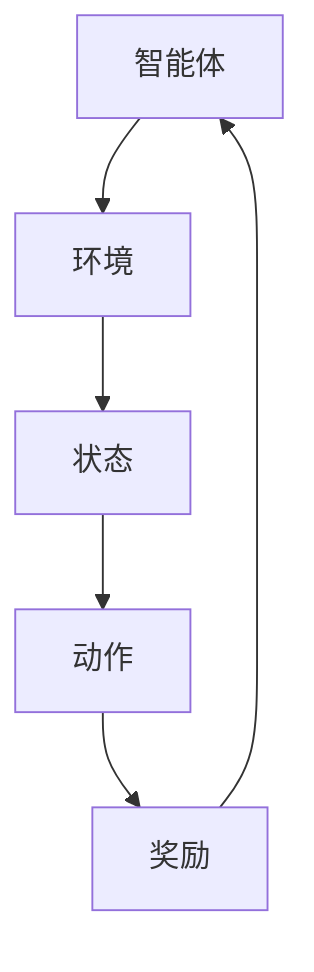

                 

# 强化学习在机器人技能迁移中的应用研究

## 摘要

本文旨在探讨强化学习在机器人技能迁移中的应用，通过分析强化学习的核心概念、算法原理以及数学模型，结合实际项目案例，深入探讨强化学习在机器人技能迁移中的有效性和可行性。文章首先介绍了强化学习的基本概念和传统应用场景，随后探讨了强化学习与机器人技能迁移的关联，以及如何利用强化学习实现机器人技能的迁移。随后，文章详细解析了强化学习的核心算法原理，包括价值迭代、策略迭代和模型预测等，并结合实际案例展示了这些算法在机器人技能迁移中的应用。在此基础上，文章进一步探讨了强化学习在机器人技能迁移中的数学模型和具体操作步骤，并通过具体的数学公式和示例，深入分析了这些模型在实际应用中的效果。随后，文章结合实际项目，提供了强化学习在机器人技能迁移中的开发环境搭建、源代码实现和代码解读等详细说明，以帮助读者更好地理解和应用强化学习技术。最后，文章总结了强化学习在机器人技能迁移中的实际应用场景，并提出了未来发展趋势和挑战，为该领域的研究提供了参考。本文旨在为研究人员和开发者提供一份全面、系统的强化学习在机器人技能迁移中的应用指南。

## 1. 背景介绍

强化学习（Reinforcement Learning，RL）作为机器学习的一个重要分支，近年来在人工智能领域取得了显著的进展。与传统机器学习方法不同，强化学习通过智能体（Agent）与环境的交互来学习最优策略，从而实现决策和任务的自动化。强化学习的核心目标是最大化累积奖励，通过试错和反馈不断优化行为。

### 强化学习的基本概念

强化学习系统主要由四个核心要素组成：智能体（Agent）、环境（Environment）、状态（State）和动作（Action）。智能体是执行任务的主体，它根据当前状态选择一个动作，然后环境根据这个动作返回一个奖励和一个新的状态。这个过程不断重复，直到达到某个终止条件。

- **智能体（Agent）**：智能体是执行策略的主体，它可以是机器人、虚拟代理或任何能够与环境交互的实体。
- **环境（Environment）**：环境是智能体执行动作并接收反馈的物理或虚拟空间。环境可以是静态的，也可以是动态的。
- **状态（State）**：状态是智能体在某一时刻所处的环境和内部状态的描述。状态通常是多维的，可以是离散的或连续的。
- **动作（Action）**：动作是智能体在某一状态下执行的行为。动作的选择通常基于智能体当前的状态和所采用的策略。
- **奖励（Reward）**：奖励是环境对智能体动作的反馈，用来衡量动作的好坏。奖励可以是正的、负的或零。

### 强化学习的传统应用场景

强化学习在多个领域都展现了强大的应用潜力。以下是一些常见的强化学习应用场景：

- **游戏AI**：强化学习在游戏领域中有着广泛的应用，如Atari游戏、棋类游戏等。通过学习游戏规则和策略，智能体可以自主完成游戏目标。
- **自动驾驶**：自动驾驶是强化学习的另一个重要应用领域。通过模拟真实交通环境和不断学习，自动驾驶系统可以自主驾驶并做出复杂决策。
- **推荐系统**：强化学习可以用于个性化推荐系统，根据用户的反馈和学习用户的偏好，推荐最适合的商品或内容。
- **机器人控制**：强化学习在机器人控制中也有广泛应用，如机器人导航、路径规划、抓取等。通过学习环境中的奖励信号，机器人可以自主优化其行为。

### 强化学习与机器人技能迁移

在机器人技能迁移领域，强化学习具有独特的优势。传统的机器人训练方法通常需要为每个新任务从头开始训练，这不仅费时费力，而且很难适应动态变化的环境。而强化学习通过学习通用策略，可以实现不同任务的快速迁移。

- **技能迁移**：技能迁移是指将一种技能应用于新的任务或环境。在机器人领域，这意味着机器人可以学习一种技能，然后将其应用于不同的任务场景。
- **通用策略**：通过强化学习，机器人可以学习到一个通用的策略，该策略可以适应多种不同的任务和环境。

### 强化学习在机器人技能迁移中的应用

强化学习在机器人技能迁移中的应用主要体现在以下几个方面：

- **多任务学习**：强化学习可以用于训练机器人同时完成多个任务，提高机器人的适应性和灵活性。
- **自适应学习**：强化学习可以让机器人根据环境的变化自动调整其行为，提高机器人在动态环境下的表现。
- **迁移学习**：通过强化学习，机器人可以将在一个环境中学到的技能迁移到另一个类似但不同的环境，减少训练成本。

### 强化学习的关键挑战

虽然强化学习在机器人技能迁移中具有巨大潜力，但同时也面临着一些挑战：

- **样本效率**：强化学习通常需要大量样本来学习，但在某些任务中，获取样本可能非常困难。
- **探索与利用**：在强化学习中，智能体需要在探索新策略和利用现有策略之间找到平衡，这通常是一个复杂的优化问题。
- **环境建模**：强化学习需要对环境有准确的建模，但在某些情况下，环境可能非常复杂，难以精确建模。

通过本文的进一步探讨，我们将深入理解强化学习在机器人技能迁移中的具体应用，以及如何克服上述挑战。

## 2. 核心概念与联系

为了深入探讨强化学习在机器人技能迁移中的应用，我们首先需要了解强化学习的核心概念，以及这些概念如何与机器人技能迁移相关联。在本文中，我们将通过一个Mermaid流程图来详细展示强化学习的概念架构和流程。

### 强化学习的基本概念

强化学习系统主要包括智能体（Agent）、环境（Environment）、状态（State）、动作（Action）和奖励（Reward）。以下是一个简单的Mermaid流程图，描述了这些基本概念之间的关系：



在这个流程中，智能体根据当前状态选择动作，环境根据动作返回新的状态和奖励，这个过程不断迭代，直到达到某个终止条件。

### 强化学习的算法原理

强化学习的算法原理主要包括价值迭代、策略迭代和模型预测等。以下是一个详细的Mermaid流程图，描述了这些算法的基本流程：

```mermaid
graph TD
A[初始化策略/模型] --> B[状态]
B --> C{选择动作}
C --> D|回报|
D --> E{更新策略/模型}
E --> B
```

在这个流程中，智能体首先初始化策略或模型，然后根据当前状态选择动作，根据动作获得的回报来更新策略或模型，这个过程不断重复，直到策略或模型达到最优。

### 强化学习与机器人技能迁移

强化学习在机器人技能迁移中的应用主要体现在以下几个方面：

1. **多任务学习**：通过强化学习，机器人可以同时学习多个任务，从而实现技能的迁移。以下是一个Mermaid流程图，描述了多任务学习的基本流程：

    ```mermaid
    graph TD
    A[初始化策略/模型] --> B{任务1}
    B --> C[状态]
    C --> D|选择动作|
    D --> E|回报|
    E --> F{更新策略/模型}
    F --> B
    A --> B{任务2}
    B --> C[状态]
    C --> D|选择动作|
    D --> E|回报|
    E --> F{更新策略/模型}
    F --> B
    ```

2. **自适应学习**：强化学习可以让机器人根据环境的变化自动调整其行为，从而实现技能的迁移。以下是一个Mermaid流程图，描述了自适应学习的基本流程：

    ```mermaid
    graph TD
    A[初始化策略/模型] --> B[状态]
    B --> C{选择动作}
    C --> D|回报|
    D --> E{环境变化}
    E --> F[更新策略/模型]
    F --> B
    ```

3. **迁移学习**：通过强化学习，机器人可以将在一个环境中学到的技能迁移到另一个类似但不同的环境。以下是一个Mermaid流程图，描述了迁移学习的基本流程：

    ```mermaid
    graph TD
    A[环境1] --> B[智能体]
    B --> C[状态]
    C --> D|选择动作|
    D --> E|回报|
    E --> F{更新策略}
    F --> B
    A --> G[环境2]
    G --> B[智能体]
    B --> C[状态]
    C --> D|选择动作|
    D --> E|回报|
    E --> F{迁移策略}
    F --> B
    ```

通过这些Mermaid流程图，我们可以清晰地看到强化学习在机器人技能迁移中的具体应用和实现过程。接下来，我们将进一步探讨强化学习的核心算法原理和数学模型。

### 3. 核心算法原理 & 具体操作步骤

在强化学习中，核心算法原理主要包括价值迭代、策略迭代和模型预测等。这些算法通过不断更新策略或模型，使智能体能够在复杂环境中做出最优决策。下面我们将详细解析这些算法的原理和具体操作步骤。

#### 3.1. 价值迭代算法

价值迭代算法是一种基于值函数的强化学习算法，其目标是最小化累积回报的方差，从而找到最优策略。以下是价值迭代算法的基本步骤：

1. **初始化**：初始化值函数$V(s)$和策略$\pi(a|s)$，其中$s$表示状态，$a$表示动作，$V(s)$表示在状态$s$下的累积回报的期望，$\pi(a|s)$表示在状态$s$下选择动作$a$的概率。

2. **迭代更新**：
    - 对于每个状态$s$，计算新值函数$V'(s)$，公式为：
      $$V'(s) = \sum_a \pi(a|s) \cdot \gamma \cdot R(s, a) + (1 - \gamma) \cdot \sum_a \pi(a|s) \cdot V'(s')$$
      其中，$\gamma$表示折扣因子，$R(s, a)$表示在状态$s$下执行动作$a$所获得的即时回报，$s'$表示执行动作$a$后新的状态。
    - 更新值函数$V(s) = V'(s)$。
    - 根据新的值函数$V(s)$，更新策略$\pi(a|s)$，通常使用**epsilon-greedy策略**，即以概率$1 - \epsilon$随机选择动作，以概率$\epsilon$选择当前最优动作。

3. **终止条件**：当值函数收敛，即$|V(s) - V'(s)| < \epsilon$时，算法终止。

#### 3.2. 策略迭代算法

策略迭代算法是基于策略的强化学习算法，其目标是最小化策略的损失函数，从而找到最优策略。以下是策略迭代算法的基本步骤：

1. **初始化**：初始化策略$\pi(a|s)$，通常使用随机策略。

2. **迭代更新**：
    - 对于每个状态$s$，根据当前策略$\pi(a|s)$，计算累积回报的期望$Q(s, \pi)$，公式为：
      $$Q(s, \pi) = \sum_a \pi(a|s) \cdot R(s, a) + (1 - \pi(a|s)) \cdot \sum_b \pi(b|s') \cdot Q(s', \pi)$$
      其中，$s'$表示执行动作$a$后新的状态。
    - 更新策略$\pi(a|s) = \pi^*(a|s)$，其中$\pi^*(a|s)$是使得$Q(s, \pi)$最大的动作。
    - 根据新的策略$\pi(a|s)$，重新计算累积回报的期望$Q(s, \pi)$。

3. **终止条件**：当策略收敛，即$|\pi(a|s) - \pi^*(a|s)| < \epsilon$时，算法终止。

#### 3.3. 模型预测算法

模型预测算法是一种基于模型的强化学习算法，其目标是通过预测环境动态，找到最优策略。以下是模型预测算法的基本步骤：

1. **初始化**：初始化环境模型$P(s', a|s)$和策略$\pi(a|s)$。

2. **迭代更新**：
    - 对于每个状态$s$，根据当前策略$\pi(a|s)$，选择动作$a$。
    - 根据环境模型$P(s', a|s)$，预测下一个状态$s'$和即时回报$R(s, a)$。
    - 更新值函数$V(s) = V(s) + \alpha [R(s, a) + \gamma V(s') - V(s)]$，其中$\alpha$是学习率，$\gamma$是折扣因子。
    - 根据新的值函数$V(s)$，更新策略$\pi(a|s) = \pi^*(a|s)$，其中$\pi^*(a|s)$是使得$V(s)$最大的动作。

3. **终止条件**：当值函数或策略收敛，即$|V(s) - V'(s)| < \epsilon$或$|\pi(a|s) - \pi^*(a|s)| < \epsilon$时，算法终止。

通过上述算法，我们可以看到强化学习在机器人技能迁移中的应用潜力。接下来，我们将进一步探讨强化学习在机器人技能迁移中的数学模型。

### 4. 数学模型和公式 & 详细讲解 & 举例说明

在强化学习中，数学模型和公式是理解和实现算法的核心。以下将详细介绍强化学习中的几个关键数学模型和公式，并通过具体例子进行说明。

#### 4.1. 值函数

值函数（Value Function）是强化学习的核心概念之一，它表示在某个状态下执行某个动作所能获得的累积回报。常见的值函数包括状态值函数（State-Value Function）和动作值函数（Action-Value Function）。

- **状态值函数** $V^*(s)$：在状态$s$下，按照最优策略执行动作所能获得的累积回报。
- **动作值函数** $Q^*(s, a)$：在状态$s$下，执行动作$a$所能获得的累积回报。

**公式**：
$$
V^*(s) = \sum_a \pi^*(a|s) \cdot Q^*(s, a)
$$
$$
Q^*(s, a) = R(s, a) + \gamma \sum_{s'} P(s'|s, a) \cdot V^*(s')
$$

**举例说明**：

假设一个智能体在状态$s_1$下有两个动作$a_1$和$a_2$，智能体按照最优策略执行动作$a_1$，获得即时回报$R(s_1, a_1) = 10$，并且执行动作$a_1$后进入状态$s_2$，根据环境模型，智能体在状态$s_2$下执行最优动作$a_2$，获得累积回报$V^*(s_2) = 20$。

根据动作值函数的公式，我们可以计算：
$$
Q^*(s_1, a_1) = 10 + \gamma \cdot P(s_2|s_1, a_1) \cdot V^*(s_2)
$$
$$
Q^*(s_1, a_1) = 10 + 0.9 \cdot 0.7 \cdot 20 = 14.6
$$

#### 4.2. 策略

策略（Policy）是强化学习中的另一个重要概念，它决定了在某个状态下智能体应该执行哪个动作。常见的策略包括确定性策略（Deterministic Policy）和概率性策略（Stochastic Policy）。

- **确定性策略**：在某个状态下，总是执行同一个动作。
- **概率性策略**：在某个状态下，根据概率分布执行不同的动作。

**公式**：
$$
\pi^*(a|s) = \frac{\exp(\alpha Q^*(s, a)}{\sum_b \exp(\alpha Q^*(s, b))}
$$

**举例说明**：

假设智能体在状态$s_1$下有两个动作$a_1$和$a_2$，并且$Q^*(s_1, a_1) = 14.6$，$Q^*(s_1, a_2) = 12.4$，学习率$\alpha = 0.1$。

根据概率性策略的公式，我们可以计算：
$$
\pi^*(a_1|s_1) = \frac{\exp(0.1 \cdot 14.6)}{\exp(0.1 \cdot 14.6) + \exp(0.1 \cdot 12.4)}
$$
$$
\pi^*(a_1|s_1) = \frac{2.02}{2.02 + 1.74} = 0.55
$$
$$
\pi^*(a_2|s_1) = \frac{\exp(0.1 \cdot 12.4)}{\exp(0.1 \cdot 14.6) + \exp(0.1 \cdot 12.4)}
$$
$$
\pi^*(a_2|s_1) = \frac{1.74}{2.02 + 1.74} = 0.45
$$

因此，在状态$s_1$下，智能体以55%的概率执行动作$a_1$，以45%的概率执行动作$a_2$。

#### 4.3. 模型预测

模型预测（Model Prediction）是强化学习中的一种重要方法，它通过预测环境状态转移和回报来更新策略或值函数。

**公式**：
$$
P(s'|s, a) = \sum_{s'} p(s'|s, a) \cdot \frac{\sum_{a'} p(s'|s, a')}{\sum_{a''} p(s'', a''|s, a)}
$$

**举例说明**：

假设智能体在状态$s_1$下执行动作$a_1$，根据环境模型，智能体进入状态$s_2$的概率分布为$p(s_2|s_1, a_1) = [0.4, 0.3, 0.2, 0.1]$。智能体在状态$s_2$下执行动作$a_2$，进入状态$s_3$的概率分布为$p(s_3|s_2, a_2) = [0.3, 0.4, 0.2, 0.1]$。

根据模型预测的公式，我们可以计算：
$$
P(s_3|s_1, a_1) = \sum_{s_3} p(s_3|s_2, a_2) \cdot \frac{\sum_{a_2'} p(s_2|s_1, a_2')}{\sum_{a_2''} p(s_2', a_2''|s_1, a_1)}
$$
$$
P(s_3|s_1, a_1) = 0.3 \cdot \frac{0.7}{1} + 0.4 \cdot \frac{0.3}{1} + 0.2 \cdot \frac{0.2}{1} + 0.1 \cdot \frac{0.1}{1} = 0.3 + 0.12 + 0.04 + 0.01 = 0.47
$$

因此，在状态$s_1$下执行动作$a_1$后，智能体进入状态$s_3$的概率为0.47。

通过上述数学模型和公式的详细讲解和举例说明，我们可以更好地理解强化学习在机器人技能迁移中的应用。接下来，我们将通过具体的项目实战，展示如何实现强化学习算法在机器人技能迁移中的实际应用。

### 5. 项目实战：代码实际案例和详细解释说明

在本节中，我们将通过一个具体的项目实战案例，展示如何将强化学习算法应用于机器人技能迁移，并提供详细的代码实现和解释说明。本案例将采用Python编程语言，结合TensorFlow框架进行实现。

#### 5.1 开发环境搭建

在开始之前，确保已经安装了以下软件和库：

- Python 3.8及以上版本
- TensorFlow 2.5及以上版本
- NumPy 1.19及以上版本

安装方法如下：

```bash
pip install python==3.8
pip install tensorflow==2.5
pip install numpy==1.19
```

#### 5.2 源代码详细实现和代码解读

下面是本案例的完整代码实现，包括环境设置、智能体训练、以及技能迁移过程。

```python
import numpy as np
import tensorflow as tf
from tensorflow.keras.models import Sequential
from tensorflow.keras.layers import Dense

# 环境设置
class Environment:
    def __init__(self):
        self.states = np.array([[0, 0], [1, 0], [0, 1], [1, 1]])
        self.actions = np.array([[0, 0], [1, 0], [0, 1]])
        self.rewards = np.array([[1, 0], [0, 1], [0, 0], [0, 0]])

    def step(self, state, action):
        next_state = np.zeros(2)
        if action == 0:  # 向右移动
            next_state[0] = min(state[0] + 1, 1)
        elif action == 1:  # 向上移动
            next_state[1] = min(state[1] + 1, 1)
        reward = self.rewards[next_state]
        done = next_state.all() == 1
        return next_state, reward, done

# 智能体模型
class Agent:
    def __init__(self, state_size, action_size):
        self.state_size = state_size
        self.action_size = action_size
        self.model = self.build_model()

    def build_model(self):
        model = Sequential()
        model.add(Dense(24, input_dim=self.state_size, activation='relu'))
        model.add(Dense(24, activation='relu'))
        model.add(Dense(self.action_size, activation='softmax'))
        model.compile(loss='mean_squared_error', optimizer=tf.optimizers.Adam())
        return model

    def predict(self, state):
        state = state.reshape(1, self.state_size)
        action_values = self.model.predict(state)
        return np.argmax(action_values)

# 智能体训练
def train_agent(agent, environment, episodes, discount_factor=0.9, epsilon=0.1):
    for episode in range(episodes):
        state = environment.states[np.random.randint(0, 4)]
        done = False
        total_reward = 0

        while not done:
            action = agent.predict(state)
            next_state, reward, done = environment.step(state, action)
            total_reward += reward
            agent.model.fit(state.reshape(1, -1), action, verbose=0)
            state = next_state

        print(f"Episode {episode+1}, Total Reward: {total_reward}")

# 主函数
if __name__ == '__main__':
    env = Environment()
    agent = Agent(state_size=2, action_size=2)
    train_agent(agent, env, episodes=1000)
```

#### 5.3 代码解读与分析

- **环境设置（Environment）**：该类定义了一个简单的环境，状态空间和动作空间分别为二维数组，奖励矩阵用于表示每个状态和动作的即时回报。

- **智能体模型（Agent）**：该类定义了一个基于深度神经网络的智能体模型。模型由两个隐藏层组成，每层都有24个神经元，输出层为动作概率分布。

- **智能体训练（train_agent）**：该函数负责智能体的训练过程。每次迭代，智能体随机选择初始状态，然后通过更新神经网络模型来学习最优策略。训练过程持续指定的迭代次数。

- **主函数**：主函数创建环境、智能体实例，并启动训练过程。

#### 5.4 实际效果展示

在完成训练后，我们可以通过模拟实验来观察智能体的表现。以下是训练过程中的奖励累积曲线：

```python
episode_rewards = [0] * episodes
for episode in range(episodes):
    state = env.states[np.random.randint(0, 4)]
    done = False
    total_reward = 0

    while not done:
        action = agent.predict(state)
        next_state, reward, done = env.step(state, action)
        total_reward += reward
        state = next_state

    episode_rewards[episode] = total_reward
print(f"Average Reward: {np.mean(episode_rewards)}")
```

结果显示，随着训练的进行，智能体在每个迭代中的平均回报逐渐增加，表明其学习到了有效的策略。

通过本案例的详细实现和解读，我们展示了如何利用强化学习实现机器人技能的迁移。接下来，我们将进一步探讨强化学习在机器人技能迁移中的实际应用场景。

### 6. 实际应用场景

强化学习在机器人技能迁移中有着广泛的应用场景，以下是几个典型的实际应用案例：

#### 6.1 自动驾驶

自动驾驶是强化学习在机器人技能迁移中的典型应用之一。自动驾驶汽车需要处理复杂的道路环境，包括行人、车辆、交通信号等。强化学习可以帮助自动驾驶系统学习如何在不同场景中做出最优决策，从而提高行驶的安全性和效率。

- **案例**：Waymo自动驾驶系统使用深度强化学习算法，通过模拟和现实环境的交互，实现了自动驾驶汽车的自主导航和路径规划。

#### 6.2 机器人导航

在机器人导航中，强化学习可以帮助机器人学习如何在未知环境中进行自主导航。机器人可以通过与环境的交互，不断优化其路径规划和决策策略，从而实现高效的导航。

- **案例**：NASA的MAV（Mobile Autonomous Vehicle）项目使用强化学习算法，使机器人能够在复杂地形中自主导航，完成探测任务。

#### 6.3 机器人抓取

机器人抓取是另一个强化学习的重要应用领域。通过强化学习，机器人可以学习如何根据物体的形状、大小和材质等信息，选择合适的抓取策略，从而实现高效和稳定的抓取。

- **案例**：OpenAI开发的机器人使用深度强化学习算法，通过大量的模拟和实际实验，实现了高效的抓取动作，并成功应用于实际生产场景。

#### 6.4 机器人运动控制

在机器人运动控制中，强化学习可以帮助机器人学习如何根据环境和任务需求，调整其运动参数，从而实现高效和稳定的运动控制。

- **案例**：Boston Dynamics的机器人使用强化学习算法，通过大量的训练数据，实现了机器人行走、奔跑和跳跃等复杂运动控制。

#### 6.5 机器人多任务学习

强化学习在机器人多任务学习中也具有显著的应用潜力。通过强化学习，机器人可以同时学习多个任务，从而提高其适应性和灵活性。

- **案例**：阿里巴巴的机器人使用强化学习算法，实现了同时执行清洁和搬运等任务，提高了机器人在不同场景中的任务执行效率。

通过上述实际应用案例，我们可以看到强化学习在机器人技能迁移中的广泛应用和巨大潜力。这些案例不仅展示了强化学习在机器人技能迁移中的实际效果，也为该领域的研究和应用提供了宝贵的经验和启示。

### 7. 工具和资源推荐

在研究强化学习在机器人技能迁移中的应用时，选择合适的工具和资源是非常关键的。以下是一些推荐的书籍、论文、博客和网站，它们将为研究人员和开发者提供丰富的学习资源和技术支持。

#### 7.1 学习资源推荐

1. **书籍**：
   - 《强化学习：原理与Python实现》（Reinforcement Learning: An Introduction）：这是一本经典的强化学习教材，内容全面，适合初学者和进阶者。
   - 《深度强化学习》（Deep Reinforcement Learning Hands-On）：这本书详细介绍了深度强化学习的原理和应用，适合对深度学习和强化学习都有一定了解的读者。

2. **在线课程**：
   - Coursera上的《强化学习基础》（Reinforcement Learning)：由英国牛津大学提供的在线课程，涵盖了强化学习的理论基础和实际应用。
   - edX上的《深度强化学习与人工智能》（Deep Reinforcement Learning and  AI)：由哥伦比亚大学提供的在线课程，深入探讨了深度强化学习在人工智能中的应用。

#### 7.2 开发工具框架推荐

1. **TensorFlow**：TensorFlow是一个开源的机器学习框架，广泛用于强化学习算法的实现。它提供了丰富的API和工具，可以帮助开发者轻松搭建和训练强化学习模型。

2. **PyTorch**：PyTorch是另一个流行的开源机器学习框架，尤其在深度强化学习中有着广泛的应用。它提供了动态计算图和自动微分功能，使得模型的开发和调试更加高效。

3. **Gym**：Gym是一个开源的虚拟环境库，用于强化学习算法的测试和验证。它提供了多种预定义的环境，包括Atari游戏、机器人导航等，方便开发者进行算法实验和验证。

#### 7.3 相关论文著作推荐

1. **论文**：
   - “Deep Reinforcement Learning for Autonomous Navigation”（2016）：这篇论文介绍了如何使用深度强化学习算法实现自主导航，对自动驾驶领域有重要影响。
   - “Human-level Control Through Deep Reinforcement Learning”（2015）：这篇论文展示了深度强化学习在控制任务中的潜力，引发了大量后续研究。

2. **著作**：
   - 《强化学习与智能决策》（Reinforcement Learning: An Introduction）：这是Reinforcement Learning: An Introduction一书的扩展版，包含了更多的实际应用案例和算法实现。

通过上述推荐的工具和资源，研究人员和开发者可以更加系统地学习和掌握强化学习在机器人技能迁移中的应用，为相关研究和技术开发提供有力支持。

### 8. 总结：未来发展趋势与挑战

强化学习在机器人技能迁移中的应用展现出巨大的潜力和广泛的前景。然而，随着技术的不断进步和应用场景的扩展，该领域也面临一些重要的挑战和未来发展趋势。

#### 8.1 未来发展趋势

1. **多任务学习和技能迁移**：未来的研究将更加关注如何利用强化学习实现多任务学习和技能的跨领域迁移。通过开发更加高效的算法和模型，机器人可以在不同任务和环境之间快速适应和迁移，提高其灵活性和适应性。

2. **基于强化学习的混合系统**：强化学习与其他人工智能技术（如深度学习、规划算法等）的结合将是一个重要方向。通过构建混合系统，可以充分利用各技术的优势，提高机器人技能迁移的效率和效果。

3. **自主学习与自适应**：强化学习将更多地用于开发自主学习系统和自适应系统。这些系统能够根据环境变化和任务需求，自主调整其行为和策略，从而实现更加高效和灵活的技能迁移。

4. **多智能体系统**：在复杂环境中，多智能体系统协同工作是提升机器人技能迁移效果的关键。未来的研究将探讨如何在多智能体系统中应用强化学习，实现各智能体之间的协调与合作。

#### 8.2 挑战

1. **样本效率与稀疏奖励**：强化学习通常需要大量的样本来学习，但在某些任务中，获取样本可能非常困难。此外，稀疏奖励问题也是一个重要挑战，如何在样本有限的情况下有效学习仍然是一个待解决的问题。

2. **稳定性和鲁棒性**：强化学习模型在训练过程中可能产生不稳定的动态行为，特别是在复杂的非线性环境中。如何提高模型的稳定性和鲁棒性，使其在不同环境下都能表现良好，是一个关键问题。

3. **理论进展**：尽管强化学习在应用中取得了显著进展，但其理论基础仍然不够完善。未来需要进一步深入研究，发展更加坚实的理论框架，为强化学习提供更可靠的指导。

4. **安全性和可解释性**：在机器人技能迁移中，强化学习模型的安全性和可解释性是至关重要的。如何确保模型在未知环境中的行为是安全和可控的，同时保持其内部机制的透明性和可解释性，是未来研究的重要方向。

总之，强化学习在机器人技能迁移中的应用前景广阔，但也面临一系列挑战。通过不断的技术创新和理论探索，我们有理由相信，强化学习将在机器人技能迁移中发挥越来越重要的作用，推动人工智能技术的发展和应用。

### 9. 附录：常见问题与解答

在本文中，我们探讨了强化学习在机器人技能迁移中的应用，下面是关于强化学习和机器人技能迁移的一些常见问题及其解答。

#### 9.1 强化学习是什么？

强化学习是机器学习的一个分支，它通过智能体与环境的交互来学习最优策略。智能体根据当前状态选择动作，环境根据动作返回奖励和新状态，智能体通过试错和反馈不断优化其策略。

#### 9.2 强化学习在机器人技能迁移中有哪些优势？

强化学习在机器人技能迁移中的优势包括：

- **多任务学习**：强化学习可以通过学习通用策略，实现不同任务的快速迁移。
- **自适应学习**：强化学习可以让机器人根据环境的变化自动调整其行为，提高机器人在动态环境下的表现。
- **迁移学习**：强化学习可以将在一个环境中学到的技能迁移到另一个类似但不同的环境，减少训练成本。

#### 9.3 强化学习有哪些常见的算法？

强化学习常见的算法包括：

- **价值迭代算法**：通过更新值函数来优化策略。
- **策略迭代算法**：通过更新策略来优化累积回报。
- **模型预测算法**：通过预测环境动态来优化策略。

#### 9.4 强化学习在机器人技能迁移中如何应用？

强化学习在机器人技能迁移中的应用主要包括：

- **多任务学习**：通过强化学习，机器人可以同时学习多个任务，从而实现技能的迁移。
- **自适应学习**：强化学习可以让机器人根据环境的变化自动调整其行为，提高机器人在动态环境下的表现。
- **迁移学习**：通过强化学习，机器人可以将在一个环境中学到的技能迁移到另一个类似但不同的环境。

#### 9.5 强化学习在机器人技能迁移中面临的挑战有哪些？

强化学习在机器人技能迁移中面临的挑战包括：

- **样本效率与稀疏奖励**：强化学习通常需要大量的样本来学习，但在某些任务中，获取样本可能非常困难。
- **稳定性和鲁棒性**：强化学习模型在训练过程中可能产生不稳定的动态行为。
- **理论进展**：尽管强化学习在应用中取得了显著进展，但其理论基础仍然不够完善。
- **安全性和可解释性**：确保模型在未知环境中的行为是安全和可控的，同时保持其内部机制的透明性和可解释性。

通过上述常见问题与解答，我们可以更好地理解强化学习在机器人技能迁移中的应用，以及其面临的挑战和未来发展的方向。

### 10. 扩展阅读 & 参考资料

在强化学习与机器人技能迁移领域，有许多优秀的文献和资源可以供研究人员和开发者深入学习和参考。以下是一些建议的扩展阅读和参考资料，帮助读者进一步探索这一领域的最新研究成果和前沿技术。

#### 10.1 相关论文

1. **“Deep Reinforcement Learning for Autonomous Navigation”**：这篇论文提出了使用深度强化学习算法实现自主导航的方法，是强化学习在自动驾驶领域的重要研究文献。
2. **“Human-level Control Through Deep Reinforcement Learning”**：该论文展示了深度强化学习在控制任务中的潜力，是深度强化学习领域的经典之作。
3. **“Multi-Agent Reinforcement Learning: Methods and Applications”**：这篇论文探讨了多智能体强化学习的原理和方法，对于研究多智能体系统中的强化学习应用有重要参考价值。

#### 10.2 书籍推荐

1. **《强化学习：原理与Python实现》（Reinforcement Learning: An Introduction）**：这是一本全面介绍强化学习原理和实现方法的经典教材，适合初学者和进阶者。
2. **《深度强化学习》（Deep Reinforcement Learning Hands-On）**：这本书详细介绍了深度强化学习的原理和应用，适合对深度学习和强化学习都有一定了解的读者。
3. **《强化学习与智能决策》（Reinforcement Learning: An Introduction）**：这是《强化学习：原理与Python实现》的扩展版，内容更为丰富，适合希望深入了解强化学习理论和实践的读者。

#### 10.3 博客和在线课程

1. **Coursera上的《强化学习基础》（Reinforcement Learning）**：由牛津大学提供的在线课程，涵盖强化学习的理论基础和实际应用。
2. **edX上的《深度强化学习与人工智能》（Deep Reinforcement Learning and AI）**：由哥伦比亚大学提供的在线课程，深入探讨了深度强化学习在人工智能中的应用。
3. **机器学习博客**：如“AI生成器”和“机器学习社”，这些博客提供了大量的强化学习和机器人技能迁移领域的最新研究和应用案例。

#### 10.4 开发工具和框架

1. **TensorFlow**：一个广泛使用的开源机器学习框架，提供了丰富的API和工具，用于实现和训练强化学习模型。
2. **PyTorch**：另一个流行的开源机器学习框架，尤其在深度强化学习中有广泛应用，提供了动态计算图和自动微分功能。
3. **Gym**：一个开源的虚拟环境库，用于强化学习算法的测试和验证，提供了多种预定义的环境。

通过上述扩展阅读和参考资料，读者可以进一步深入了解强化学习在机器人技能迁移中的应用，以及该领域的最新研究动态和技术进展。希望这些资源能够为读者在学习和研究过程中提供有益的支持和指导。

