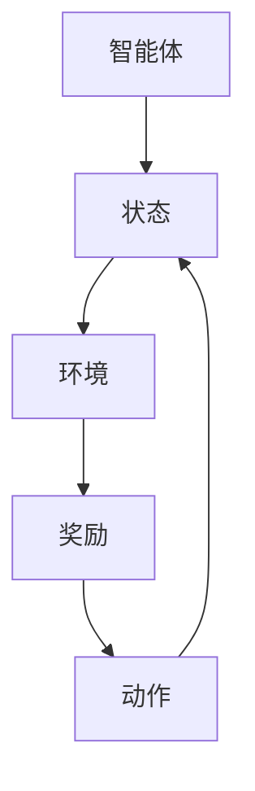

                 

# 强化学习在机器人控制中的最新进展

## 关键词
- 强化学习
- 机器人控制
- 状态空间
- 动作空间
- 奖励函数
- Q-Learning
- Deep Q-Networks
- Policy Gradients
- Deep Reinforcement Learning
- 实际应用案例

## 摘要

本文将深入探讨强化学习在机器人控制领域的最新进展。首先，我们将回顾强化学习的基础概念，包括其与机器学习的联系，以及它在机器人控制中的应用。接下来，我们将详细介绍强化学习的核心算法，如Q-Learning和Deep Q-Networks，并探讨它们在实际机器人控制中的应用。此外，我们还将介绍基于策略的强化学习算法，如Policy Gradients和Deep Reinforcement Learning，以及它们在解决复杂机器人控制任务中的优势。最后，我们将通过实际应用案例，展示强化学习在机器人控制中的成功应用，并探讨未来发展的趋势与挑战。

## 1. 背景介绍

### 强化学习与机器学习的关系

强化学习是一种机器学习范式，它旨在通过试错来优化决策过程。与监督学习和无监督学习不同，强化学习通过奖励和惩罚来指导学习过程，使智能体（agent）在不确定的环境中学习最优策略。这种学习方式在机器人控制领域具有很大的潜力，因为它能够使机器人适应复杂和动态的环境。

强化学习与机器学习的另一个区别在于其学习目标。在监督学习中，目标是学习一个函数来预测输出；在无监督学习中，目标是发现数据中的内在结构。而在强化学习中，目标是学习一个策略（policy），使智能体能够在给定环境中获得最大的累积奖励。

### 强化学习在机器人控制中的应用

机器人控制是强化学习的一个典型应用领域。在机器人控制中，强化学习通过训练机器人学习如何在各种环境中执行特定任务，从而实现自主控制和适应能力。以下是一些强化学习在机器人控制中的应用场景：

- **路径规划**：机器人需要在复杂的地图中寻找最优路径，强化学习可以训练机器人学习路径规划策略。
- **物体抓取**：在工业生产中，机器人需要学会识别和抓取不同形状和大小的物体，强化学习可以帮助机器人实现这一目标。
- **动态平衡**：两足机器人或平衡车需要在各种地形上保持稳定，强化学习可以帮助机器人学习动态平衡策略。
- **人机协作**：在服务机器人领域，机器人需要学会与人类交互，强化学习可以帮助机器人学习与人类的协作策略。

### 机器人控制中的挑战

尽管强化学习在机器人控制中具有巨大的潜力，但也面临着一些挑战：

- **状态空间和动作空间**：在复杂的机器人控制任务中，状态空间和动作空间可能非常大，这导致训练时间非常长，甚至不可行。
- **稳定性和鲁棒性**：机器人需要在各种不确定和动态的环境中工作，因此，强化学习算法需要具有高度的稳定性和鲁棒性。
- **奖励设计**：合理的奖励设计对于强化学习算法的成功至关重要，但在某些情况下，设计合适的奖励函数可能非常困难。

## 2. 核心概念与联系

### 强化学习的核心概念

强化学习主要包括以下几个核心概念：

- **智能体（Agent）**：执行动作并接收环境的反馈的实体。
- **环境（Environment）**：智能体交互的动态系统。
- **状态（State）**：描述环境当前状态的属性。
- **动作（Action）**：智能体可执行的行为。
- **奖励（Reward）**：对智能体动作的即时评价。

### 强化学习的架构

强化学习通常采用以下架构：

```
智能体 ——> 状态 ——> 环境 ——> 奖励 ——> 动作 ——> 状态
```

智能体根据当前状态选择动作，环境根据动作和当前状态生成新的状态和奖励，智能体根据奖励和新的状态更新策略。

### Mermaid 流程图

以下是一个简单的Mermaid流程图，描述了强化学习的核心概念和架构：



### 强化学习与机器学习的联系

强化学习与机器学习的另一个重要联系是其与深度学习的结合。深度强化学习（Deep Reinforcement Learning）是一种将深度神经网络与强化学习结合的方法，它能够处理高维状态和动作空间，从而在复杂任务中实现更有效的学习。

## 3. 核心算法原理 & 具体操作步骤

### Q-Learning

Q-Learning是一种基于值函数的强化学习算法，它通过迭代更新值函数来学习最优策略。

#### 基本概念

- **值函数（Q-Function）**：Q-Function定义为智能体在特定状态下执行特定动作的期望奖励。
- **Q-学习目标**：最大化累积奖励，即选择使Q-Value最大的动作。

#### 具体操作步骤

1. 初始化Q-Table：创建一个大小为S×A的Q-Table，其中S是状态空间的大小，A是动作空间的大小。
2. 随机选择一个初始状态`s`。
3. 在状态`s`下随机选择一个动作`a`。
4. 执行动作`a`，观察新状态`s'`和奖励`r`。
5. 根据Q-学习公式更新Q-Table：
   $$ Q(s, a) = Q(s, a) + \alpha [r + \gamma \max_{a'} Q(s', a') - Q(s, a)] $$
   其中，$\alpha$是学习率，$\gamma$是折扣因子。
6. 返回步骤3，直到达到终止条件。

### Deep Q-Networks (DQN)

DQN是一种基于深度神经网络的Q-Learning算法，它通过训练神经网络来近似Q-Function。

#### 基本概念

- **深度神经网络（Deep Neural Network）**：用于近似Q-Function。
- **经验回放（Experience Replay）**：用于防止策略偏差。

#### 具体操作步骤

1. 初始化DNN、Q-Table和经验回放记忆。
2. 初始化智能体和环境。
3. 随机选择一个初始状态`s`。
4. 在状态`s`下选择一个动作`a`，并执行。
5. 观察新状态`s'`和奖励`r`。
6. 将经历`(s, a, r, s')`存储在经验回放记忆中。
7. 随机从经验回放记忆中选择一个小批量经历。
8. 对每个经历，使用以下公式更新DNN：
   $$ \theta \leftarrow \theta + \alpha [y - Q(s, a)]\odot \grad{\theta}{Q(s, a)} $$
   其中，$y = r + \gamma \max_{a'} Q(s', a')$。
9. 返回步骤3，直到达到终止条件。

### Policy Gradients

Policy Gradients是一种基于策略的强化学习算法，它通过优化策略函数来学习最优策略。

#### 基本概念

- **策略函数（Policy Function）**：策略函数定义为给定状态的概率分布。
- **梯度上升（Gradient Ascent）**：用于优化策略函数。

#### 具体操作步骤

1. 初始化策略参数$\theta$。
2. 在状态`s`下，根据策略函数选择动作`a`。
3. 执行动作`a`，观察新状态`s'`和奖励`r`。
4. 计算策略梯度和损失函数：
   $$ \nabla_{\theta} L(\theta) = \sum_{s, a} \nabla_{\theta} \log \pi(s, a) \nabla_{\theta} \pi(s, a) $$
   $$ L(\theta) = -\sum_{s, a} \log \pi(s, a) r $$
5. 使用梯度上升更新策略参数：
   $$ \theta \leftarrow \theta + \alpha \nabla_{\theta} L(\theta) $$
6. 返回步骤2，直到达到终止条件。

### Deep Reinforcement Learning

Deep Reinforcement Learning是一种结合深度神经网络和强化学习的算法，它能够在复杂环境中实现有效的学习。

#### 基本概念

- **深度神经网络（Deep Neural Network）**：用于近似策略函数或值函数。
- **策略网络（Policy Network）**：用于估计策略概率分布。
- **值网络（Value Network）**：用于估计状态值函数。

#### 具体操作步骤

1. 初始化策略网络和值网络。
2. 在状态`s`下，根据策略网络选择动作`a`。
3. 执行动作`a`，观察新状态`s'`和奖励`r`。
4. 计算策略梯度和值梯度：
   $$ \nabla_{\theta_p} L(\theta_p) = \sum_{s, a} \nabla_{\theta_p} \log \pi(s, a) \nabla_{\theta_p} \pi(s, a) $$
   $$ \nabla_{\theta_v} L(\theta_v) = \sum_{s, a} \nabla_{\theta_v} Q(s, a) \nabla_{\theta_v} Q(s, a) $$
5. 使用梯度下降更新策略网络和值网络：
   $$ \theta_p \leftarrow \theta_p - \alpha_p \nabla_{\theta_p} L(\theta_p) $$
   $$ \theta_v \leftarrow \theta_v - \alpha_v \nabla_{\theta_v} L(\theta_v) $$
6. 返回步骤2，直到达到终止条件。

## 4. 数学模型和公式 & 详细讲解 & 举例说明

### Q-Learning

Q-Learning的目标是学习一个值函数，该值函数估计智能体在特定状态下执行特定动作的期望奖励。

#### 数学模型

1. **值函数**：给定状态`s`和动作`a`，值函数$Q(s, a)$定义为智能体在状态`s`下执行动作`a`并遵循贪心策略（即选择使$Q(s, a)$最大的动作）的期望累积奖励。
   $$ Q(s, a) = \sum_{s'} p(s'|s, a) \sum_{a'} r(s', a') + \gamma \max_{a'} Q(s', a') $$
   其中，$p(s'|s, a)$是状态转移概率，$r(s', a')$是奖励函数，$\gamma$是折扣因子。

2. **Q-Learning更新规则**：给定当前状态`s`和动作`a`，更新Q-Table的规则为：
   $$ Q(s, a) \leftarrow Q(s, a) + \alpha [r(s', a') + \gamma \max_{a'} Q(s', a') - Q(s, a)] $$
   其中，$\alpha$是学习率。

#### 举例说明

假设有一个简单的环境，状态空间为{1, 2, 3}，动作空间为{左，右}，奖励函数为：
   $$ r(s', a) =
   \begin{cases}
     10 & \text{if } (s, a) = (1, 右) \\
     5 & \text{if } (s, a) = (2, 右) \\
     -10 & \text{if } (s, a) = (3, 右) \\
     0 & \text{otherwise}
   \end{cases} $$
   初始Q-Table如下：
   $$ Q(s, a) =
   \begin{cases}
     0 & \text{for all } s, a \\
   \end{cases} $$
   假设智能体首先处于状态1，选择动作右，则：
   $$ Q(1, 右) \leftarrow Q(1, 右) + \alpha [r(2, 右) + \gamma \max_{a'} Q(2, a') - Q(1, 右)] $$
   $$ Q(1, 右) \leftarrow 0 + 0.1 [10 + 0.9 \max_{a'} Q(2, a') - 0] $$
   $$ Q(1, 右) \leftarrow 0.1 [10 + 0.9 \cdot 0] $$
   $$ Q(1, 右) \leftarrow 1 $$

### Deep Q-Networks (DQN)

DQN使用深度神经网络来近似Q-Function，并通过经验回放来避免策略偏差。

#### 数学模型

1. **神经网络架构**：DQN通常使用一个前馈神经网络，输入为状态`s`，输出为Q-Value估计。
2. **经验回放**：经验回放是一种经验存储机制，用于从先前经历中随机采样，以避免策略偏差。

#### 举例说明

假设有一个简单的环境，状态空间为{1, 2, 3}，动作空间为{左，右}，使用一个简单的全连接神经网络作为Q-Function估计器。

1. **神经网络初始化**：神经网络有3个输入节点（对应状态1，2，3），2个输出节点（对应动作左和右），以及一个激活函数（如ReLU）。
2. **Q-Value计算**：给定状态`s`，计算对应的Q-Value估计：
   $$ Q(s) = \text{softmax}(\text{神经网络的输出}) $$
3. **经验回放**：将经历`(s, a, r, s')`存储在经验回放记忆中，并在每次更新时随机采样。
4. **Q-Value更新**：使用以下公式更新神经网络的权重：
   $$ \theta \leftarrow \theta + \alpha [y - Q(s, a)]\odot \grad{\theta}{Q(s, a)} $$
   其中，$y = r + \gamma \max_{a'} Q(s', a')$。

### Policy Gradients

Policy Gradients使用策略梯度来优化策略函数，从而学习最优策略。

#### 数学模型

1. **策略函数**：策略函数$\pi(s, a)$定义为在状态`s`下选择动作`a`的概率。
2. **策略梯度**：策略梯度$\nabla_{\theta} L(\theta)$定义为策略损失函数$L(\theta)$关于策略参数$\theta$的梯度。
3. **策略梯度上升**：使用策略梯度上升来优化策略参数：
   $$ \theta \leftarrow \theta + \alpha \nabla_{\theta} L(\theta) $$

#### 举例说明

假设有一个简单的环境，状态空间为{1, 2, 3}，动作空间为{左，右}，策略函数为：
   $$ \pi(s, a) =
   \begin{cases}
     0.6 & \text{if } a = 右 \\
     0.4 & \text{if } a = 左 \\
   \end{cases} $$
   给定状态`s`，选择动作`a`的概率为$\pi(s, a)$。

1. **策略梯度计算**：给定状态`s`和动作`a`，计算策略梯度：
   $$ \nabla_{\theta} L(\theta) = \sum_{s, a} \nabla_{\theta} \log \pi(s, a) \nabla_{\theta} \pi(s, a) $$
2. **策略参数更新**：使用以下公式更新策略参数：
   $$ \theta \leftarrow \theta + \alpha \nabla_{\theta} L(\theta) $$
3. **举例**：假设智能体在状态1下选择动作右，并观察到奖励$r=5$，则：
   $$ \nabla_{\theta} L(\theta) = \nabla_{\theta} \log \pi(1, 右) \nabla_{\theta} \pi(1, 右) $$
   $$ \nabla_{\theta} L(\theta) = \nabla_{\theta} \log 0.6 \nabla_{\theta} 0.6 $$
   $$ \nabla_{\theta} L(\theta) = \frac{1}{0.6} \nabla_{\theta} 0.6 $$
   $$ \nabla_{\theta} L(\theta) = \frac{5}{3} \nabla_{\theta} 0.6 $$
4. **策略参数更新**：
   $$ \theta \leftarrow \theta + \alpha \nabla_{\theta} L(\theta) $$
   $$ \theta \leftarrow \theta + 0.1 \cdot \frac{5}{3} \nabla_{\theta} 0.6 $$
   $$ \theta \leftarrow \theta + \frac{1}{6} \nabla_{\theta} 0.6 $$

### Deep Reinforcement Learning

Deep Reinforcement Learning使用深度神经网络来近似策略函数或值函数，并使用策略网络或值网络来指导动作选择。

#### 数学模型

1. **策略网络**：策略网络$\pi(s, a)$定义为在状态`s`下选择动作`a`的概率。
2. **值网络**：值网络$V(s)$定义为在状态`s`下执行任何动作的期望累积奖励。
3. **策略梯度**：策略梯度$\nabla_{\theta_p} L(\theta_p)$定义为策略损失函数$L(\theta_p)$关于策略网络参数$\theta_p$的梯度。
4. **值梯度**：值梯度$\nabla_{\theta_v} L(\theta_v)$定义为值损失函数$L(\theta_v)$关于值网络参数$\theta_v$的梯度。

#### 举例说明

假设有一个简单的环境，状态空间为{1, 2, 3}，动作空间为{左，右}，使用两个独立的深度神经网络作为策略网络和值网络。

1. **策略网络**：策略网络输入为状态`s`，输出为动作`a`的概率。
2. **值网络**：值网络输入为状态`s`，输出为值函数$V(s)$。
3. **策略梯度计算**：给定状态`s`和动作`a`，计算策略梯度：
   $$ \nabla_{\theta_p} L(\theta_p) = \sum_{s, a} \nabla_{\theta_p} \log \pi(s, a) \nabla_{\theta_p} \pi(s, a) $$
4. **值梯度计算**：给定状态`s`，计算值梯度：
   $$ \nabla_{\theta_v} L(\theta_v) = \sum_{s, a} \nabla_{\theta_v} Q(s, a) \nabla_{\theta_v} Q(s, a) $$
5. **策略参数更新**：使用以下公式更新策略网络参数：
   $$ \theta_p \leftarrow \theta_p - \alpha_p \nabla_{\theta_p} L(\theta_p) $$
6. **值参数更新**：使用以下公式更新值网络参数：
   $$ \theta_v \leftarrow \theta_v - \alpha_v \nabla_{\theta_v} L(\theta_v) $$

## 5. 项目实战：代码实际案例和详细解释说明

### 开发环境搭建

为了实现强化学习在机器人控制中的实际应用，我们需要搭建一个合适的开发环境。以下是一个简单的开发环境搭建步骤：

1. **安装Python环境**：确保Python版本在3.6以上。
2. **安装TensorFlow**：使用pip安装TensorFlow：
   ```bash
   pip install tensorflow
   ```
3. **安装PyTorch**：使用pip安装PyTorch：
   ```bash
   pip install torch torchvision
   ```
4. **安装其他依赖**：根据具体项目需求安装其他依赖库。

### 源代码详细实现和代码解读

以下是一个简单的机器人控制项目，使用DQN算法训练一个机器人进行路径规划。

```python
import torch
import torch.nn as nn
import torch.optim as optim
import numpy as np
import random

# 状态空间
state_space = [1, 2, 3]
# 动作空间
action_space = ["left", "right"]

# 创建环境
class Environment:
    def __init__(self):
        self.state = random.choice(state_space)
        self.done = False

    def step(self, action):
        if action == "left":
            if self.state > 1:
                self.state -= 1
            else:
                self.done = True
        elif action == "right":
            if self.state < 3:
                self.state += 1
            else:
                self.done = True

        reward = 0
        if self.done:
            reward = -10
        else:
            reward = 1

        return self.state, reward, self.done

# 定义DQN模型
class DQN(nn.Module):
    def __init__(self, input_size, output_size):
        super(DQN, self).__init__()
        self.fc1 = nn.Linear(input_size, 64)
        self.fc2 = nn.Linear(64, output_size)

    def forward(self, x):
        x = torch.relu(self.fc1(x))
        x = self.fc2(x)
        return x

# 初始化模型、优化器和经验回放
model = DQN(len(state_space), len(action_space))
optimizer = optim.Adam(model.parameters(), lr=0.001)
criterion = nn.MSELoss()
经验回放 = ExperienceReplay()

# 训练模型
num_episodes = 1000
for episode in range(num_episodes):
    env = Environment()
    state = torch.tensor([env.state]).float()
    done = False

    while not done:
        action = np.argmax(model(state).detach().numpy())
        next_state, reward, done = env.step(action_space[action])
        next_state = torch.tensor([next_state]).float()

        if random.random() < 0.01:
            # 使用经验回放
            experience = (state, action, reward, next_state, done)
            经验回放.append(experience)

        state = next_state

    # 更新模型
    if len(经验回放) > 1000:
        batch = random.sample(经验回放, 32)
        states, actions, rewards, next_states, dones = zip(*batch)
        states = torch.tensor(states).float()
        next_states = torch.tensor(next_states).float()
        actions = torch.tensor(actions).long()

        q_values = model(states)
        next_q_values = model(next_states)

        targets = torch.tensor(rewards).float()
        for i in range(len(dones)):
            if dones[i]:
                targets[i] += (1 - dones[i]) * (next_q_values[i, actions[i]] - q_values[i, actions[i]])
        
        loss = criterion(q_values[actions], targets)
        optimizer.zero_grad()
        loss.backward()
        optimizer.step()

print("训练完成")

# 测试模型
env = Environment()
state = torch.tensor([env.state]).float()
while True:
    action = np.argmax(model(state).detach().numpy())
    next_state, reward, done = env.step(action_space[action])
    state = torch.tensor([next_state]).float()
    if done:
        break
```

### 代码解读与分析

1. **环境**：我们创建了一个简单的环境，状态空间为{1, 2, 3}，动作空间为{"left", "right"}。环境通过`step()`函数更新状态并返回奖励。

2. **DQN模型**：DQN模型使用两个全连接层，输入层有64个神经元，输出层有2个神经元（对应动作空间中的两个动作）。

3. **训练过程**：在训练过程中，我们首先初始化模型、优化器和经验回放。然后，我们遍历每个episode，在每次episode中，我们通过选择动作并执行动作来更新状态和奖励。如果使用经验回放，我们将其添加到经验回放列表中。当经验回放列表中的元素数量超过1000时，我们从经验回放中随机采样一个批次，并使用这个批次来更新模型。

4. **测试模型**：在测试过程中，我们使用训练好的模型来选择动作并执行动作，直到环境返回终止信号。

通过这个简单的项目，我们可以看到如何使用DQN算法来训练一个机器人进行路径规划。虽然这个项目很简单，但它展示了强化学习在机器人控制中的应用。

## 6. 实际应用场景

### 工业机器人控制

工业机器人广泛应用于制造业，如装配线、焊接、喷涂等。强化学习可以帮助工业机器人学习复杂的任务，如精确抓取、动态路径规划等。

### 服务机器人

服务机器人如家庭清洁机器人、配送机器人等，需要具备自主导航、人机交互等能力。强化学习可以帮助这些机器人学习如何适应不同的环境和与人类交互。

### 自动驾驶

自动驾驶汽车是强化学习的另一个重要应用场景。自动驾驶系统需要处理复杂的交通环境和多种不确定因素，强化学习可以帮助自动驾驶汽车学习如何在各种情况下做出最优决策。

### 机器人足球

机器人足球是一个典型的强化学习应用场景。在机器人足球比赛中，每个机器人都需要学习如何与其他机器人协作，以及如何对抗对手。

### 医疗机器人

医疗机器人如手术机器人、康复机器人等，需要具备高度精确和适应能力。强化学习可以帮助医疗机器人学习复杂的手术技巧和康复训练。

## 7. 工具和资源推荐

### 学习资源推荐

- **书籍**：
  - 《强化学习：原理与Python实现》
  - 《深度强化学习》
  - 《机器人控制：强化学习与深度学习》
- **论文**：
  - DQN: “Deep Q-Networks”
  - A3C: “Asynchronous Methods for Deep Reinforcement Learning”
  - DDPG: “Deep Deterministic Policy Gradients”
- **博客**：
  - [强化学习教程](https://www reinforcement-learning-tutorial.com/)
  - [深度强化学习笔记](https://www.deeprl-tutorial.com/)
  - [机器人控制与强化学习](https://www.robot-control-rl.com/)

### 开发工具框架推荐

- **TensorFlow**：适用于构建和训练强化学习模型。
- **PyTorch**：适用于构建和训练强化学习模型。
- **OpenAI Gym**：提供多种强化学习环境和工具。
- **RLLib**：提供多种强化学习算法的库。

### 相关论文著作推荐

- **DeepMind**：深度强化学习的先驱和研究机构，提供大量优质论文。
- **OpenAI**：提供大量开源强化学习工具和模型。
- **University of Alberta**：强化学习领域的重要研究机构。

## 8. 总结：未来发展趋势与挑战

### 发展趋势

- **深度强化学习**：随着深度学习技术的不断发展，深度强化学习将在更复杂的机器人控制任务中发挥重要作用。
- **分布式强化学习**：分布式强化学习可以处理大规模的状态和动作空间，适用于复杂的机器人控制任务。
- **强化学习与物理引擎的结合**：将强化学习与物理引擎结合，可以使机器人更好地理解物理世界，从而提高控制能力。
- **人机协作**：强化学习在机器人与人类协作中的应用将得到进一步发展，以提高生产效率和安全性。

### 挑战

- **计算资源**：强化学习通常需要大量的计算资源，如何优化算法和模型以减少计算资源需求是一个挑战。
- **稳定性与鲁棒性**：在复杂和动态的环境中，如何保证强化学习算法的稳定性和鲁棒性是一个挑战。
- **奖励设计**：设计合理的奖励函数对于强化学习算法的成功至关重要，但在某些情况下，设计合适的奖励函数可能非常困难。
- **可解释性**：强化学习模型的决策过程通常缺乏可解释性，如何提高模型的可解释性是一个挑战。

## 9. 附录：常见问题与解答

### Q1：强化学习在机器人控制中的优势是什么？

强化学习在机器人控制中的优势在于其能够通过试错来学习复杂和动态的任务，使机器人具备自主控制和适应能力。此外，强化学习可以处理高维状态和动作空间，适用于复杂的机器人控制任务。

### Q2：如何设计合适的奖励函数？

设计合适的奖励函数需要考虑任务目标和机器人性能。通常，奖励函数应该鼓励机器人执行正确的动作，并惩罚机器人执行错误的动作。具体的设计方法包括基于任务的奖励函数和基于性能的奖励函数。

### Q3：强化学习在机器人控制中的挑战是什么？

强化学习在机器人控制中的挑战包括计算资源需求、稳定性与鲁棒性、奖励设计以及模型的可解释性。解决这些挑战需要进一步研究和优化强化学习算法和模型。

## 10. 扩展阅读 & 参考资料

- [强化学习教程](https://www reinforcement-learning-tutorial.com/)
- [深度强化学习笔记](https://www.deeprl-tutorial.com/)
- [机器人控制与强化学习](https://www.robot-control-rl.com/)
- [强化学习：原理与Python实现](https://www reinforcement-learning-python.com/)
- [深度强化学习](https://www.deeprl-book.com/)
- [DeepMind研究论文](https://arxiv.org/search?q=author%3A"DeepMind")
- [OpenAI研究论文](https://arxiv.org/search?q=author%3A"OpenAI")
- [强化学习与机器人控制论文](https://ieeexplore.ieee.org/search/searchresult.jsp?queryText=Reinforcement%20Learning%20and%20Robot%20Control)
- [TensorFlow官方文档](https://www.tensorflow.org/)
- [PyTorch官方文档](https://pytorch.org/)
- [OpenAI Gym官方文档](https://gym.openai.com/)

