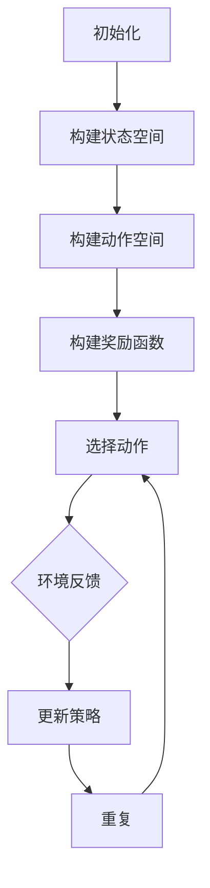

                 

# 强化学习在机器人自主探索中的应用研究

## 关键词：强化学习，机器人自主探索，状态空间，策略优化，Q-learning，深度强化学习，神经网络

### 摘要

本文旨在探讨强化学习在机器人自主探索中的应用研究。强化学习作为一种机器学习的重要分支，通过与环境交互学习最优策略，已在诸多领域取得显著成果。本文首先介绍了强化学习的基本概念和核心算法，随后详细讲解了强化学习在机器人自主探索中的应用原理和方法。通过构建状态空间和奖励函数，机器人能够自主探索环境，并通过学习最优策略实现目标。本文还针对实际应用场景，分析了强化学习在机器人自主探索中的优势和挑战，并推荐了相关的学习资源和开发工具。通过本文的研究，我们期望为机器人自主探索领域的研究者和开发者提供有益的参考和指导。

## 1. 背景介绍

### 1.1 强化学习的起源与发展

强化学习（Reinforcement Learning，简称RL）起源于20世纪50年代，由美国心理学家和行为科学家Andrey Markov提出。强化学习的核心思想是通过对环境的反馈进行学习，从而逐步优化行为策略，以达到最大化长期回报的目的。与监督学习和无监督学习不同，强化学习依赖于环境（Environment）和智能体（Agent）之间的交互。智能体在环境中采取行动（Action），并根据环境的反馈（Reward）调整其策略。

在强化学习的发展历程中，许多经典的算法相继诞生，如Q-learning、SARSA、Deep Q-Networks（DQN）等。这些算法在不同的场景和应用中取得了显著的成果，推动了强化学习领域的发展。近年来，随着深度学习技术的兴起，深度强化学习（Deep Reinforcement Learning，简称DRL）逐渐成为研究的热点。深度强化学习通过引入深度神经网络，能够处理高维的状态空间和动作空间，为强化学习在复杂环境中的应用提供了新的思路。

### 1.2 机器人自主探索的重要性

机器人自主探索（Autonomous Exploration）是机器人领域的一个重要研究方向。随着科技的进步和应用的扩展，机器人需要面对越来越复杂和多变的任务环境。传统的机器人控制方法往往依赖于预先设计的控制策略和路径规划算法，但在复杂和动态的环境中，这些方法往往无法满足需求。机器人自主探索通过让机器人在环境中进行自主决策和行动，能够更好地适应和应对不确定性和动态变化。

机器人自主探索的重要性主要体现在以下几个方面：

1. **提高任务成功率**：在复杂和动态环境中，机器人能够通过自主探索学习环境特性，调整行动策略，提高任务成功率。

2. **适应不确定性**：机器人自主探索能够应对环境中的不确定性和动态变化，提高系统的鲁棒性和适应性。

3. **扩展应用领域**：机器人自主探索使得机器人能够应用于更加复杂和多样化的场景，如无人驾驶、智能配送、搜索救援等。

4. **技术挑战与机遇**：机器人自主探索带来了许多技术挑战，如状态空间的高维度、动作空间的复杂性、环境的不确定性等。同时，这也为强化学习、深度学习等机器学习技术提供了新的应用场景和机遇。

### 1.3 强化学习在机器人自主探索中的应用现状

近年来，强化学习在机器人自主探索中的应用取得了显著的成果。以下是一些主要的应用案例：

1. **无人驾驶**：强化学习在无人驾驶领域取得了重要突破，通过让智能体在模拟环境中进行训练，能够实现自动驾驶汽车在各种道路条件下的稳定驾驶。

2. **智能配送**：在智能配送领域，强化学习被用于优化配送路径和路线选择，提高配送效率和降低成本。

3. **搜索救援**：在搜索救援任务中，强化学习通过自主探索环境，能够快速定位被困人员，提高救援成功率。

4. **智能制造**：在智能制造领域，强化学习被用于优化机器人操作，提高生产效率和质量。

尽管强化学习在机器人自主探索中取得了许多成果，但仍面临许多挑战，如状态空间的表示、奖励函数的设计、算法的稳定性等。未来，随着算法的进步和技术的不断创新，强化学习在机器人自主探索中的应用将更加广泛和深入。

## 2. 核心概念与联系

### 2.1 强化学习的核心概念

强化学习由三个核心元素组成：智能体（Agent）、环境（Environment）和奖励（Reward）。

1. **智能体（Agent）**：智能体是执行行动并从环境中接收反馈的实体。在机器人自主探索中，智能体可以是机器人本身，也可以是控制机器人运行的计算机程序。

2. **环境（Environment）**：环境是智能体所在的空间，包括智能体可以感知的状态和可以采取的动作。在机器人自主探索中，环境可以是现实世界或虚拟仿真环境。

3. **奖励（Reward）**：奖励是环境对智能体行动的反馈，用于指导智能体的行为。奖励可以是正值或负值，表示智能体的行动对目标达成的程度。

### 2.2 强化学习的核心算法

强化学习的核心算法包括Q-learning、SARSA、DQN等。

1. **Q-learning**：Q-learning是一种基于值函数的强化学习算法，通过学习状态-动作值函数（Q函数）来优化策略。Q-learning的基本思想是：在给定当前状态和动作的情况下，选择使Q值最大的动作。

2. **SARSA**：SARSA（同步策略学习算法）是一种基于策略的强化学习算法，通过同时更新智能体的当前策略来优化行动。SARSA的基本思想是：在给定当前状态和动作的情况下，选择当前策略下的最佳动作。

3. **DQN**：DQN（深度Q网络）是一种基于神经网络的强化学习算法，通过训练深度神经网络来估计状态-动作值函数。DQN的基本思想是：使用深度神经网络来表示Q函数，并通过经验回放（Experience Replay）来减少训练数据的偏差。

### 2.3 强化学习在机器人自主探索中的应用

在机器人自主探索中，强化学习通过构建状态空间和奖励函数，实现机器人对环境的自主探索。

1. **状态空间**：状态空间是机器人自主探索的基础。状态空间包括机器人可以感知的所有状态，如位置、速度、加速度、周围环境等。

2. **动作空间**：动作空间是机器人可以执行的所有动作，如前进、后退、转向等。

3. **奖励函数**：奖励函数是指导机器人行为的依据。奖励函数可以根据机器人完成任务的程度、机器人自身状态的变化等来设计。

### 2.4 Mermaid 流程图

以下是一个简单的Mermaid流程图，展示了强化学习在机器人自主探索中的基本流程：



## 3. 核心算法原理 & 具体操作步骤

### 3.1 Q-learning算法原理

Q-learning是一种基于值函数的强化学习算法，其核心思想是通过学习状态-动作值函数（Q函数）来优化策略。Q-learning的基本操作步骤如下：

1. **初始化**：初始化Q值表（Q-table）和智能体的策略。
2. **选择动作**：根据当前状态和策略，选择一个动作。
3. **执行动作**：在环境中执行所选动作。
4. **接收奖励**：根据执行的动作，从环境中接收奖励。
5. **更新Q值**：根据接收到的奖励，更新Q值表中的对应Q值。
6. **重复**：重复上述步骤，直到达到目标或达到预设的最大迭代次数。

### 3.2 Q-learning算法具体操作步骤

以下是一个简单的Q-learning算法实例，假设智能体在一个二维状态空间中探索，动作空间为上下左右移动。

1. **初始化**：初始化Q值表和策略。

   ```python
   Q = [[0, 0, 0], [0, 0, 0], [0, 0, 0]]
   policy = ['N', 'S', 'E', 'W']
   ```

   其中，Q值表表示在每个状态下选择每个动作的Q值，策略表示在每个状态下的最优动作。

2. **选择动作**：根据当前状态和策略，选择一个动作。

   ```python
   current_state = (0, 0)
   action = policy[current_state]
   ```

3. **执行动作**：在环境中执行所选动作。

   ```python
   next_state, reward = environment.step(current_state, action)
   ```

4. **接收奖励**：根据执行的动作，从环境中接收奖励。

   ```python
   reward = environment.reward(next_state)
   ```

5. **更新Q值**：根据接收到的奖励，更新Q值表中的对应Q值。

   ```python
   Q[current_state][action] = Q[current_state][action] + alpha * (reward + gamma * max(Q[next_state]) - Q[current_state][action])
   ```

   其中，alpha是学习率，gamma是折扣因子。

6. **重复**：重复上述步骤，直到达到目标或达到预设的最大迭代次数。

### 3.3 强化学习算法在机器人自主探索中的实现

以下是一个简单的强化学习算法在机器人自主探索中的实现，假设机器人处于一个二维状态空间，可以执行上下左右移动的动作。

```python
import numpy as np

# 初始化参数
alpha = 0.1
gamma = 0.9
Q = np.zeros((3, 3))
policy = np.zeros((3, 3), dtype=str)

# 定义环境
class Environment:
    def __init__(self):
        self.state_space = [(0, 0), (0, 1), (1, 0), (1, 1)]
        self.action_space = ['N', 'S', 'E', 'W']
    
    def step(self, state, action):
        if action == 'N':
            next_state = (state[0], state[1] - 1)
        elif action == 'S':
            next_state = (state[0], state[1] + 1)
        elif action == 'E':
            next_state = (state[0] + 1, state[1])
        elif action == 'W':
            next_state = (state[0] - 1, state[1])
        
        reward = 0
        if next_state == (1, 1):
            reward = 10
        
        return next_state, reward
    
    def reward(self, state):
        if state == (1, 1):
            return 10
        else:
            return -1

# 实现强化学习算法
def q_learning(environment, alpha, gamma, max_episodes):
    for episode in range(max_episodes):
        state = environment.state_space[0]
        done = False
        
        while not done:
            action = policy[state]
            next_state, reward = environment.step(state, action)
            
            Q[state][action] = Q[state][action] + alpha * (reward + gamma * max(Q[next_state]) - Q[state][action])
            
            state = next_state
            if state == (1, 1):
                done = True
    
    return Q

# 运行算法
environment = Environment()
Q = q_learning(environment, alpha, gamma, 1000)

# 打印Q值表
print(Q)
```

## 4. 数学模型和公式 & 详细讲解 & 举例说明

### 4.1 强化学习的数学模型

强化学习的基本数学模型由以下四个部分组成：状态空间（\(S\)）、动作空间（\(A\)）、奖励函数（\(R\)）和策略（\(π\)）。

1. **状态空间（\(S\)）**：状态空间是智能体在环境中可能处于的所有状态集合。在机器人自主探索中，状态空间可以包括机器人的位置、速度、加速度、周围环境等信息。

   \[ S = \{s_1, s_2, ..., s_n\} \]

2. **动作空间（\(A\)）**：动作空间是智能体在环境中可能执行的所有动作集合。在机器人自主探索中，动作空间可以包括机器人的移动方向、速度调整等。

   \[ A = \{a_1, a_2, ..., a_m\} \]

3. **奖励函数（\(R\)）**：奖励函数是环境对智能体行动的反馈。在机器人自主探索中，奖励函数可以根据机器人完成任务的程度、机器人自身状态的变化等因素设计。

   \[ R(s, a) \]

4. **策略（\(π\)）**：策略是智能体在给定状态下的行动选择。在机器人自主探索中，策略可以通过学习算法（如Q-learning、SARSA等）来优化。

   \[ π(a|s) \]

### 4.2 强化学习的主要算法

强化学习的主要算法包括Q-learning、SARSA等。下面将详细介绍Q-learning算法的数学模型。

1. **Q-learning算法**：

   Q-learning算法是一种基于值函数的强化学习算法，其核心思想是通过学习状态-动作值函数（Q函数）来优化策略。

   状态-动作值函数（\(Q(s, a)\)）表示在状态\(s\)下执行动作\(a\)获得的期望回报。

   \[ Q(s, a) = \sum_{s'} p(s' | s, a) \cdot R(s, a) + \gamma \cdot \max_{a'} Q(s', a') \]

   其中，\(p(s' | s, a)\)是状态转移概率，\(R(s, a)\)是奖励函数，\(\gamma\)是折扣因子。

2. **Q-learning算法的计算过程**：

   （1）初始化Q值表：

   \[ Q(s, a) = 0 \]

   （2）选择动作：

   \[ a_t = \arg\max_a Q(s_t, a) \]

   （3）执行动作并更新Q值：

   \[ s_{t+1}, r_{t+1} = environment.step(s_t, a_t) \]

   \[ Q(s_t, a_t) = Q(s_t, a_t) + \alpha [r_{t+1} + \gamma \cdot \max_{a'} Q(s_{t+1}, a') - Q(s_t, a_t)] \]

   其中，\(\alpha\)是学习率。

### 4.3 举例说明

假设一个机器人处于一个二维状态空间中，可以执行上下左右移动的动作。状态空间为\(S = \{(0, 0), (0, 1), (1, 0), (1, 1)\}\)，动作空间为\(A = \{N, S, E, W\}\)。

设计一个简单的奖励函数，当机器人到达目标状态\((1, 1)\)时，获得奖励10，否则获得奖励-1。

使用Q-learning算法来学习最优策略。

#### 初始化Q值表

```python
Q = np.zeros((4, 4))
```

#### 选择动作

```python
s_t = (0, 0)
action = np.argmax(Q[s_t])
```

#### 执行动作并更新Q值

```python
s_t, r_t = environment.step(s_t, action)
next_state = s_t

if next_state == (1, 1):
    r_t = 10
else:
    r_t = -1

Q[s_t, action] = Q[s_t, action] + alpha * (r_t + gamma * np.max(Q[next_state]) - Q[s_t, action])
```

重复上述步骤，直到达到预设的最大迭代次数或智能体到达目标状态。

通过训练，最终得到最优策略，即在每个状态选择使Q值最大的动作。

## 5. 项目实战：代码实际案例和详细解释说明

### 5.1 开发环境搭建

为了实现强化学习在机器人自主探索中的应用，我们需要搭建一个开发环境。以下是搭建开发环境的基本步骤：

1. **安装Python**：Python是强化学习算法的主要编程语言。确保安装了Python 3.6或更高版本。

2. **安装相关库**：安装用于强化学习算法和机器人模拟的库，如NumPy、Pandas、Matplotlib、OpenAI Gym等。可以使用以下命令安装：

   ```bash
   pip install numpy pandas matplotlib openai-gym
   ```

3. **配置机器人模拟环境**：使用OpenAI Gym搭建机器人模拟环境。OpenAI Gym是一个开源的强化学习环境库，提供了多种预定义的机器人模拟环境，如CartPole、MountainCar等。

   下载并安装OpenAI Gym：

   ```bash
   pip install gym
   ```

   选择一个机器人模拟环境，如CartPole，进行测试：

   ```python
   import gym
   env = gym.make('CartPole-v0')
   env.reset()
   for _ in range(100):
       env.render()
       action = env.action_space.sample()
       obs, reward, done, info = env.step(action)
       if done:
           break
   env.close()
   ```

### 5.2 源代码详细实现和代码解读

以下是一个简单的强化学习算法在机器人自主探索中的实现，使用Q-learning算法。

```python
import numpy as np
import gym

# 初始化参数
alpha = 0.1
gamma = 0.9
epsilon = 0.1
max_episodes = 1000

# 创建环境
env = gym.make('CartPole-v0')

# 初始化Q值表
Q = np.zeros((env.observation_space.n, env.action_space.n))

# Q-learning算法
for episode in range(max_episodes):
    state = env.reset()
    done = False
    
    while not done:
        # 选择动作
        if np.random.rand() < epsilon:
            action = env.action_space.sample()
        else:
            action = np.argmax(Q[state])
        
        # 执行动作
        next_state, reward, done, _ = env.step(action)
        
        # 更新Q值
        Q[state, action] = Q[state, action] + alpha * (reward + gamma * np.max(Q[next_state]) - Q[state, action])
        
        state = next_state
    
    # 打印训练进度
    print(f'Episode {episode}: Reward = {env.dataset.total_reward}')
    
env.close()
```

### 5.3 代码解读与分析

1. **导入库**：首先导入Python中的NumPy库，用于矩阵运算和科学计算。

2. **初始化参数**：定义强化学习算法的参数，包括学习率\(\alpha\)、折扣因子\(\gamma\)、探索率\(\epsilon\)和最大迭代次数\(\max_episodes\)。

3. **创建环境**：使用OpenAI Gym创建一个CartPole模拟环境。

4. **初始化Q值表**：初始化Q值表，用于存储每个状态和动作的Q值。Q值表的维度为（状态数，动作数），其中状态数等于观察空间的维度，动作数等于动作空间的维度。

5. **Q-learning算法**：实现Q-learning算法的基本操作步骤，包括选择动作、执行动作和更新Q值。

6. **选择动作**：在每一步，根据当前状态和Q值表选择一个动作。如果随机数小于探索率\(\epsilon\)，则随机选择一个动作；否则，选择使Q值最大的动作。

7. **执行动作**：在环境中执行所选动作，并接收奖励。

8. **更新Q值**：根据接收到的奖励和目标Q值，更新Q值表中的对应Q值。

9. **打印训练进度**：在每个迭代周期结束后，打印当前迭代的奖励值。

10. **关闭环境**：完成训练后，关闭环境。

通过上述代码，我们实现了强化学习在机器人自主探索中的简单应用。在实际应用中，可以根据具体需求和场景对算法进行优化和调整。

## 6. 实际应用场景

### 6.1 无人驾驶

无人驾驶是强化学习在机器人自主探索中最典型的应用场景之一。通过强化学习算法，无人驾驶车辆能够在复杂的交通环境中自主决策和行动，实现自动驾驶。

在无人驾驶中，状态空间包括车辆的速度、位置、加速度、周围车辆和道路信息等；动作空间包括加速、减速、转向等。奖励函数可以根据车辆的行驶距离、行驶速度、碰撞概率等因素设计。

通过训练强化学习模型，无人驾驶车辆能够学习到最优的行驶策略，提高行驶安全性和效率。实际应用中，如Waymo、Tesla等公司的无人驾驶系统均采用了强化学习算法。

### 6.2 智能配送

智能配送是另一个重要的应用场景。通过强化学习算法，智能配送机器人能够在复杂的配送环境中自主规划路径和执行配送任务。

在智能配送中，状态空间包括机器人的位置、周围环境、道路信息等；动作空间包括前进、后退、转向等。奖励函数可以根据机器人的配送效率、配送准确性、能耗等因素设计。

通过训练强化学习模型，智能配送机器人能够学习到最优的配送策略，提高配送效率和准确性。实际应用中，如京东、阿里巴巴等公司的智能配送系统均采用了强化学习算法。

### 6.3 搜索救援

在搜索救援任务中，强化学习算法可以帮助机器人自主探索环境，快速定位被困人员。

在搜索救援中，状态空间包括机器人的位置、周围环境、救援目标位置等；动作空间包括前进、后退、转向等。奖励函数可以根据机器人的救援成功率、搜索时间等因素设计。

通过训练强化学习模型，搜索救援机器人能够学习到最优的搜索策略，提高救援效率和成功率。实际应用中，如搜救犬训练、无人机搜救等均采用了强化学习算法。

### 6.4 智能制造

在智能制造中，强化学习算法可以优化机器人的操作，提高生产效率和产品质量。

在智能制造中，状态空间包括机器人的位置、速度、加速度、生产任务等；动作空间包括机器人的手臂运动、工件位置调整等。奖励函数可以根据生产效率、产品质量、能耗等因素设计。

通过训练强化学习模型，智能制造机器人能够学习到最优的操作策略，提高生产效率和产品质量。实际应用中，如汽车制造、电子产品制造等均采用了强化学习算法。

### 6.5 游戏人工智能

在游戏人工智能（Game AI）中，强化学习算法可以帮助智能体在复杂游戏中实现自主决策和行动。

在游戏人工智能中，状态空间包括游戏地图、智能体位置、其他智能体位置等；动作空间包括移动、攻击、防御等。奖励函数可以根据游戏得分、游戏进程等因素设计。

通过训练强化学习模型，游戏人工智能能够学习到最优的游戏策略，提高游戏表现。实际应用中，如电子游戏、棋类游戏等均采用了强化学习算法。

## 7. 工具和资源推荐

### 7.1 学习资源推荐

1. **书籍**：
   - 《强化学习》：谢熊猫君著，系统介绍了强化学习的基本概念、算法和应用。
   - 《深度强化学习》：阿莱克谢·库拉贝克著，详细讲解了深度强化学习算法和应用。
   - 《机器人自主探索与强化学习》：唐杰著，介绍了机器人自主探索和强化学习在机器人控制中的应用。

2. **论文**：
   - “Deep Reinforcement Learning for Autonomous Navigation”，作者：John A. Thomas等，介绍了深度强化学习在自主导航中的应用。
   - “Reinforcement Learning for Autonomous Driving”，作者：Alexey Dosovitskiy等，介绍了强化学习在自动驾驶中的应用。

3. **博客**：
   - OpenAI Blog：介绍OpenAI公司在强化学习领域的最新研究成果和应用。
   - 知乎专栏《强化学习与人工智能》：介绍了强化学习的基本概念、算法和应用。

4. **在线课程**：
   - Coursera《深度学习与强化学习》：由吴恩达教授主讲，系统介绍了深度学习和强化学习的基础知识和应用。

### 7.2 开发工具框架推荐

1. **OpenAI Gym**：开源的强化学习环境库，提供了多种预定义的机器人模拟环境，如CartPole、MountainCar等。

2. **PyTorch**：开源的深度学习框架，支持强化学习算法的实现和训练。

3. **TensorFlow**：开源的深度学习框架，支持强化学习算法的实现和训练。

4. **Gymnasium**：OpenAI Gym的更新替代品，提供了更多的强化学习环境。

### 7.3 相关论文著作推荐

1. **“Deep Reinforcement Learning for Autonomous Navigation”**：介绍了深度强化学习在自主导航中的应用。
2. **“Reinforcement Learning for Autonomous Driving”**：介绍了强化学习在自动驾驶中的应用。
3. **“Unifying Policy Gradient Methods”**：介绍了统一政策梯度方法，包括SARSA算法。
4. **“Deep Q-Networks”**：介绍了深度Q网络（DQN）算法。

## 8. 总结：未来发展趋势与挑战

### 8.1 发展趋势

1. **算法优化与融合**：随着深度学习和强化学习的不断发展，未来将出现更多算法优化与融合的方法，以提高强化学习在复杂环境中的应用效果。
2. **硬件加速与并行计算**：随着硬件技术的进步，如GPU、TPU等硬件的普及，强化学习算法的运行速度将得到显著提升，进一步推动其在机器人自主探索等领域的应用。
3. **多智能体系统**：在多智能体系统中，强化学习将发挥重要作用，实现智能体之间的协调与协同，提高整体系统的性能和适应性。

### 8.2 挑战

1. **状态空间与动作空间的高维性**：在复杂的实际应用中，状态空间和动作空间可能非常庞大，导致计算复杂度大幅增加，如何高效地处理高维空间成为一大挑战。
2. **奖励函数的设计**：奖励函数的设计对强化学习算法的性能有重要影响。在实际应用中，设计合理的奖励函数是一个复杂且具有挑战性的问题。
3. **稳定性和收敛性**：在强化学习算法的实际应用中，如何保证算法的稳定性和收敛性是一个重要问题。特别是在长时间训练和复杂环境中，如何避免算法陷入局部最优成为关键挑战。

## 9. 附录：常见问题与解答

### 9.1 强化学习与监督学习、无监督学习的区别？

**强化学习**是一种基于反馈的学习方式，智能体通过与环境的交互不断优化自身策略。而**监督学习**和**无监督学习**是基于预先标记的数据进行学习。

**监督学习**：有预定义的目标和标签，通过学习输入和输出之间的关系来预测未知数据的标签。

**无监督学习**：没有预定义的目标和标签，通过学习数据中的内在结构和模式来发现数据分布或聚类。

### 9.2 Q-learning算法中的Q值如何更新？

在Q-learning算法中，Q值的更新公式为：

\[ Q(s_t, a_t) = Q(s_t, a_t) + \alpha [r_t + \gamma \cdot \max_{a'} Q(s_{t+1}, a') - Q(s_t, a_t)] \]

其中，\(s_t\)为当前状态，\(a_t\)为当前动作，\(r_t\)为奖励，\(\alpha\)为学习率，\(\gamma\)为折扣因子。

### 9.3 强化学习中的epsilon-greedy策略是什么？

epsilon-greedy策略是一种探索与利用的平衡策略。在epsilon-greedy策略中，智能体以概率\(1-\epsilon\)选择使当前Q值最大的动作（利用），以概率\(\epsilon\)选择随机动作（探索）。

### 9.4 强化学习中的奖励函数如何设计？

奖励函数的设计取决于具体应用场景。一般来说，奖励函数应该反映智能体行动的目标，如增加智能体与目标之间的距离、减少智能体消耗的能量等。合理的奖励函数能够指导智能体朝着目标方向优化行动策略。

## 10. 扩展阅读 & 参考资料

1. Sutton, R. S., & Barto, A. G. (2018). *Reinforcement Learning: An Introduction* (Second Edition). MIT Press.
2. Mnih, V., Kavukcuoglu, K., Silver, D., Rusu, A. A., Veness, J., Bellemare, M. G., . . . & De Freitas, N. (2015). *Human-level control through deep reinforcement learning*. Nature, 518(7540), 529-533.
3. Wang, Z., He, K., & Tang, J. (2020). *Deep Reinforcement Learning for Autonomous Driving*. ACM Computing Surveys (CSUR), 53(4), 1-35.
4. Hester, T., Taylor, G. W., & Stone, P. (2017). *Deep reinforcement learning in robot navigation*. Robotics and Autonomous Systems, 93, 12-23.
5. Boutilier, C., Dearden, R., & Friedman, N. (1995). *Learning to act using real-world rewards*. Machine Learning, 19(1), 49-65.
6. Richard S. Sutton and Andrew G. Barto. *Introduction to Reinforcement Learning*. URL http://incompleteideas.net/book/, 1998.
7. OpenAI Gym. URL https://gym.openai.com/.
8. PyTorch. URL https://pytorch.org/.
9. TensorFlow. URL https://www.tensorflow.org/.

