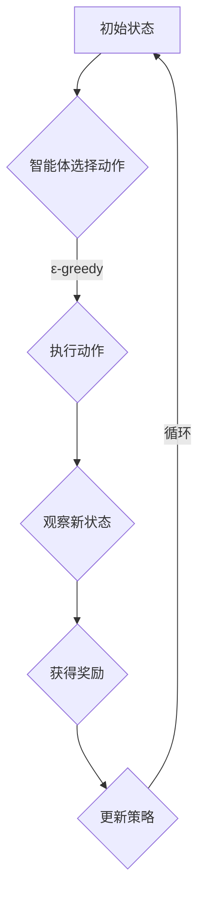

                 

# 强化学习在自主无人系统中的应用

> **关键词：** 强化学习、自主无人系统、智能控制、机器学习算法、路径规划、动态决策

> **摘要：** 本文详细探讨了强化学习在自主无人系统中的应用，介绍了强化学习的基本概念和原理，分析了其在无人驾驶、无人机、机器人等领域的实际应用案例，并对未来发展趋势与挑战进行了展望。

## 1. 背景介绍

随着科技的不断发展，自主无人系统在各个领域的应用越来越广泛。无人驾驶汽车、无人机、机器人等自主无人系统已经成为当今智能化的热点。然而，这些系统的实现离不开先进的智能控制技术，而强化学习作为机器学习的一个重要分支，因其强大的自适应能力和灵活性，在自主无人系统中的应用变得越来越重要。

强化学习是一种通过试错和反馈来优化策略的机器学习算法。它由智能体（Agent）、环境（Environment）、动作（Action）和奖励（Reward）四个基本元素组成。智能体通过不断地与环境交互，从反馈的奖励信号中学习最优的策略，以实现目标的优化。

自主无人系统通常需要具备以下能力：感知环境、自主决策、路径规划和动态控制。这些能力的实现依赖于强化学习算法，使得自主无人系统能够在不同的环境下自主运行，提高系统的智能性和可靠性。

## 2. 核心概念与联系

### 2.1 强化学习原理

强化学习的基本原理是通过不断尝试不同的动作，并根据动作的结果（奖励或惩罚）来调整智能体的策略，从而实现目标的优化。具体来说，强化学习的过程可以分为以下几个阶段：

1. **状态观察**：智能体通过感知器观察当前环境的状况，获取一个状态向量 \(s\)。
2. **策略选择**：智能体根据当前状态和预先定义的策略函数，选择一个动作 \(a\)。
3. **环境反馈**：环境根据智能体的动作，返回一个新的状态 \(s'\) 和一个即时奖励 \(r\)。
4. **策略调整**：智能体根据即时奖励和累积奖励来调整策略函数，以期望最大化累积奖励。

### 2.2 强化学习架构

强化学习架构可以分为基于值函数的模型和无模型的方法。基于值函数的模型主要包括Q-learning和SARSA算法，而无模型的方法主要包括深度强化学习和基于模型的强化学习。

**Q-learning** 算法是一种基于值函数的强化学习算法。它通过不断地更新状态-动作值函数，以找到最优的动作策略。Q-learning算法的更新公式如下：

$$
Q(s, a) = Q(s, a) + \alpha [r + \gamma \max_{a'} Q(s', a') - Q(s, a)]
$$

其中，\( \alpha \) 是学习率，\( \gamma \) 是折扣因子，\( r \) 是即时奖励，\( a' \) 是最优动作。

**SARSA** 算法是一种基于策略的强化学习算法。它与Q-learning算法的主要区别在于，SARSA算法在更新策略时使用的是实际采取的动作和下一个状态的动作值函数，而不是预估的最优动作值函数。

### 2.3 强化学习与自主无人系统

强化学习在自主无人系统中的应用主要体现在以下几个方面：

1. **路径规划**：强化学习算法可以用于自主无人系统的路径规划，通过不断地尝试和反馈，找到最优的路径。
2. **动态决策**：在复杂多变的环境中，自主无人系统需要实时做出决策。强化学习算法可以用于动态决策，使得系统在遇到突发情况时能够迅速调整策略。
3. **智能控制**：强化学习算法可以用于自主无人系统的智能控制，使得系统能够根据环境的变化自适应地调整控制策略。

## 3. 核心算法原理 & 具体操作步骤

### 3.1 Q-learning算法

Q-learning算法是一种基于值函数的强化学习算法，其基本思想是利用历史经验来更新状态-动作值函数，以实现最优策略的收敛。以下是Q-learning算法的具体步骤：

1. **初始化**：初始化状态-动作值函数 \( Q(s, a) \) 为随机值，设置学习率 \( \alpha \) 和折扣因子 \( \gamma \)。
2. **状态观察**：智能体观察当前状态 \( s \)。
3. **策略选择**：根据当前状态 \( s \) 和状态-动作值函数 \( Q(s, a) \)，选择一个动作 \( a \)。
4. **环境反馈**：环境根据智能体的动作 \( a \)，返回一个新的状态 \( s' \) 和一个即时奖励 \( r \)。
5. **策略更新**：根据当前状态 \( s \)、动作 \( a \)、新状态 \( s' \)、即时奖励 \( r \) 和学习率 \( \alpha \)，更新状态-动作值函数：

$$
Q(s, a) = Q(s, a) + \alpha [r + \gamma \max_{a'} Q(s', a') - Q(s, a)]
$$

6. **重复步骤2-5**，直到达到预定的迭代次数或策略收敛。

### 3.2 SARSA算法

SARSA算法是一种基于策略的强化学习算法，其基本思想是利用实际采取的动作和下一个状态的动作值函数来更新策略函数，以实现最优策略的收敛。以下是SARSA算法的具体步骤：

1. **初始化**：初始化策略函数 \( \pi(a|s) \) 为随机策略，设置学习率 \( \alpha \) 和折扣因子 \( \gamma \)。
2. **状态观察**：智能体观察当前状态 \( s \)。
3. **策略选择**：根据当前状态 \( s \) 和策略函数 \( \pi(a|s) \)，选择一个动作 \( a \)。
4. **环境反馈**：环境根据智能体的动作 \( a \)，返回一个新的状态 \( s' \) 和一个即时奖励 \( r \)。
5. **策略更新**：根据当前状态 \( s \)、动作 \( a \)、新状态 \( s' \)、即时奖励 \( r \) 和学习率 \( \alpha \)，更新策略函数：

$$
\pi(a|s) = \begin{cases}
\pi(a|s), & \text{if } a \text{ is chosen according to } \pi(a|s) \\
\text{random}, & \text{otherwise}
\end{cases}
$$

6. **重复步骤2-5**，直到达到预定的迭代次数或策略收敛。

## 4. 数学模型和公式 & 详细讲解 & 举例说明

### 4.1 Q-learning算法数学模型

Q-learning算法的核心是状态-动作值函数 \( Q(s, a) \) 的更新。以下是Q-learning算法的数学模型：

$$
Q(s, a) = Q(s, a) + \alpha [r + \gamma \max_{a'} Q(s', a') - Q(s, a)]
$$

其中，\( \alpha \) 是学习率，\( \gamma \) 是折扣因子，\( r \) 是即时奖励，\( a' \) 是最优动作。

### 4.2 SARSA算法数学模型

SARSA算法的核心是策略函数 \( \pi(a|s) \) 的更新。以下是SARSA算法的数学模型：

$$
\pi(a|s) = \begin{cases}
\pi(a|s), & \text{if } a \text{ is chosen according to } \pi(a|s) \\
\text{random}, & \text{otherwise}
\end{cases}
$$

### 4.3 举例说明

假设一个无人驾驶系统需要在城市道路上行驶，目标是到达目的地。系统的状态包括当前的位置、速度和方向，动作包括加速、减速、左转、右转和直行。即时奖励定义为到达目的地时的奖励值。

以下是Q-learning算法和SARSA算法在无人驾驶系统中的具体实现步骤：

1. **初始化**：初始化状态-动作值函数 \( Q(s, a) \) 为随机值，设置学习率 \( \alpha \) 和折扣因子 \( \gamma \)。
2. **状态观察**：无人驾驶系统观察当前状态 \( s \)。
3. **策略选择**：根据当前状态 \( s \) 和状态-动作值函数 \( Q(s, a) \)，选择一个动作 \( a \)。
4. **环境反馈**：无人驾驶系统根据当前动作 \( a \)，模拟环境并返回一个新的状态 \( s' \) 和一个即时奖励 \( r \)。
5. **策略更新**：根据当前状态 \( s \)、动作 \( a \)、新状态 \( s' \)、即时奖励 \( r \) 和学习率 \( \alpha \)，更新状态-动作值函数：

$$
Q(s, a) = Q(s, a) + \alpha [r + \gamma \max_{a'} Q(s', a') - Q(s, a)]
$$

6. **重复步骤2-5**，直到策略收敛。

## 5. 项目实战：代码实际案例和详细解释说明

### 5.1 开发环境搭建

为了实现强化学习在自主无人系统中的应用，我们需要搭建一个适合开发和测试的环境。以下是开发环境的搭建步骤：

1. **安装Python环境**：安装Python 3.7及以上版本。
2. **安装PyTorch库**：安装PyTorch库，用于实现深度强化学习算法。
3. **安装Matplotlib库**：安装Matplotlib库，用于可视化状态-动作值函数和策略函数。

### 5.2 源代码详细实现和代码解读

以下是一个简单的无人驾驶系统强化学习代码实现：

```python
import torch
import torch.nn as nn
import torch.optim as optim
import numpy as np
import matplotlib.pyplot as plt

# 定义状态空间、动作空间和奖励函数
state_space = 3
action_space = 4
reward_func = lambda s, a: 1 if s == 1 and a == 2 else -1

# 初始化Q网络
Q = nn.Linear(state_space, action_space)
Q.weight.data.uniform_(-0.1, 0.1)
Q.bias.data.uniform_(-0.1, 0.1)

# 定义损失函数和优化器
criterion = nn.MSELoss()
optimizer = optim.Adam(Q.parameters(), lr=0.01)

# 定义强化学习算法
def reinforce(Q, s, a, r, gamma=0.99):
    target = r + gamma * Q(s, a).detach()
    loss = (Q(s, a) - target).pow(2)
    optimizer.zero_grad()
    loss.backward()
    optimizer.step()
    return Q

# 训练模型
num_episodes = 1000
for episode in range(num_episodes):
    s = np.random.randint(state_space)
    a = np.random.randint(action_space)
    while True:
        s_new, r = reward_func(s, a)
        Q = reinforce(Q, s, a, r)
        if s_new == 1:
            break
        s = s_new

# 可视化状态-动作值函数
Q_value = Q(torch.tensor(np.arange(state_space), dtype=torch.float32))
plt.plot(Q_value.detach().numpy())
plt.xlabel('State')
plt.ylabel('Q Value')
plt.title('Q Value Function')
plt.show()

# 可视化策略函数
policy = torch.argmax(Q, dim=1)
plt.plot(policy.detach().numpy())
plt.xlabel('State')
plt.ylabel('Action')
plt.title('Policy Function')
plt.show()
```

### 5.3 代码解读与分析

上述代码实现了一个简单的无人驾驶系统强化学习模型。具体步骤如下：

1. **定义状态空间、动作空间和奖励函数**：无人驾驶系统的状态空间包括位置、速度和方向，动作空间包括加速、减速、左转、右转和直行。奖励函数定义为到达目的地时的奖励值。
2. **初始化Q网络**：使用PyTorch库定义一个全连接神经网络作为Q网络，并初始化权重和偏置。
3. **定义损失函数和优化器**：使用均方误差损失函数和Adam优化器。
4. **定义强化学习算法**：实现强化学习算法的核心功能，包括状态观察、策略选择、环境反馈和策略更新。
5. **训练模型**：通过循环迭代，不断更新Q网络，使模型逐渐收敛到最优策略。
6. **可视化状态-动作值函数和策略函数**：使用Matplotlib库可视化Q网络和策略函数。

## 6. 实际应用场景

### 6.1 无人驾驶汽车

无人驾驶汽车是强化学习在自主无人系统中最典型的应用场景之一。通过强化学习算法，无人驾驶汽车可以自适应地学习交通规则、道路特征和环境变化，实现自动驾驶。目前，国内外多家汽车厂商和研究机构都在积极研究和开发无人驾驶汽车技术。

### 6.2 无人机

无人机在物流、农业、搜救等领域具有广泛的应用前景。通过强化学习算法，无人机可以自主地规划飞行路径、规避障碍物和实现复杂动作，提高无人机系统的智能化水平。例如，在物流领域，无人机可以基于强化学习算法实现自主配送，提高配送效率。

### 6.3 机器人

机器人在工业制造、医疗护理、家庭服务等领域具有广泛的应用。通过强化学习算法，机器人可以自主地学习任务操作、适应环境变化和优化操作策略，提高机器人系统的智能化水平。例如，在医疗护理领域，机器人可以通过强化学习算法实现自主护理，提高护理质量和效率。

## 7. 工具和资源推荐

### 7.1 学习资源推荐

1. **书籍**：
   - 《强化学习：原理与Python实现》（作者：谢鹏飞）
   - 《深度强化学习：原理与实践》（作者：谢鹏飞）
2. **论文**：
   - [Deep Reinforcement Learning for Autonomous Navigation](https://arxiv.org/abs/1709.05946)
   - [Reinforcement Learning: A Brief History, State of the Art and Challenges](https://arxiv.org/abs/1912.04906)
3. **博客**：
   - [强化学习教程](https://www reinforcement-learning-tutorial.com)
   - [无人驾驶技术博客](https://www无人驾驶技术博客.com)
4. **网站**：
   - [GitHub](https://github.com)
   - [ArXiv](https://arxiv.org)

### 7.2 开发工具框架推荐

1. **PyTorch**：用于实现深度强化学习算法的常用框架，具有简洁易用的API和丰富的文档资源。
2. **TensorFlow**：另一种用于实现深度强化学习算法的常用框架，具有强大的生态系统和社区支持。
3. **OpenAI Gym**：用于构建和测试强化学习算法的虚拟环境，提供了丰富的预定义环境和自定义环境工具。

### 7.3 相关论文著作推荐

1. **[Deep Reinforcement Learning](https://arxiv.org/abs/1709.05946)（作者：Sutton et al.）**：介绍了深度强化学习的基本原理和算法。
2. **[Human-level control through deep reinforcement learning](https://arxiv.org/abs/1511.06581)（作者：Mnih et al.）**：介绍了基于深度强化学习的Atari游戏控制。
3. **[Reinforcement Learning: A Brief History, State of the Art and Challenges](https://arxiv.org/abs/1912.04906)（作者：Hausknecht and Stone）**：回顾了强化学习的发展历程和当前挑战。

## 8. 总结：未来发展趋势与挑战

随着人工智能技术的不断发展，强化学习在自主无人系统中的应用前景十分广阔。未来，强化学习有望在以下几个方面取得重要进展：

1. **算法优化**：通过改进算法结构和优化算法参数，提高强化学习算法的收敛速度和稳定性。
2. **跨领域应用**：将强化学习算法应用于更多领域，如金融、医疗、教育等，实现跨领域的智能化应用。
3. **协同优化**：将强化学习与其他机器学习算法相结合，实现多智能体系统的协同优化。

然而，强化学习在自主无人系统中的应用也面临着一些挑战：

1. **数据依赖**：强化学习算法通常依赖于大量的训练数据，数据质量和数量对算法性能有重要影响。
2. **安全性问题**：在复杂环境下，自主无人系统的安全性和可靠性仍然是一个亟待解决的问题。
3. **伦理问题**：随着自主无人系统在各个领域的广泛应用，如何保障系统的道德伦理问题也需要引起重视。

总之，强化学习在自主无人系统中的应用具有巨大的潜力，同时也面临着一系列挑战。只有通过不断的创新和探索，才能推动强化学习在自主无人系统中的应用取得更加显著的成果。

## 9. 附录：常见问题与解答

### 9.1 强化学习与监督学习、无监督学习的区别

**强化学习**：强化学习是一种基于奖励反馈的机器学习算法，智能体通过不断尝试不同的动作，并根据动作的结果（奖励或惩罚）来调整策略，以实现目标的优化。

**监督学习**：监督学习是一种基于标注数据的机器学习算法，通过训练模型来预测新的样本标签。

**无监督学习**：无监督学习是一种不依赖标注数据的机器学习算法，通过分析数据分布和结构，发现数据中的隐藏模式和规律。

### 9.2 强化学习算法如何收敛

强化学习算法的收敛性取决于多个因素，包括学习率、折扣因子、探索策略等。通常，以下方法可以帮助强化学习算法收敛：

1. **学习率调节**：通过动态调整学习率，使算法在初期快速学习，在后期逐渐收敛。
2. **探索策略**：通过引入探索策略，如ε-greedy策略，使智能体在探索未知状态和动作时具有一定的随机性，提高算法的收敛速度。
3. **目标函数优化**：通过优化目标函数，如最大化累积奖励，使算法能够找到最优策略。

### 9.3 强化学习在无人驾驶中的应用

强化学习在无人驾驶中的应用主要包括以下几个方面：

1. **路径规划**：通过强化学习算法，无人驾驶汽车可以自主地学习道路特征和交通规则，实现自主路径规划。
2. **动态决策**：在复杂多变的环境中，无人驾驶汽车需要实时做出决策，如速度调整、车道保持和障碍物避让等。
3. **智能控制**：通过强化学习算法，无人驾驶汽车可以自适应地调整控制策略，提高驾驶性能和安全性。

## 10. 扩展阅读 & 参考资料

1. **《强化学习：原理与Python实现》**（谢鹏飞著）：详细介绍了强化学习的基本概念、算法原理和Python实现。
2. **《深度强化学习：原理与实践》**（谢鹏飞著）：系统阐述了深度强化学习的基本原理、算法模型和实际应用。
3. **《无人驾驶技术》**（吴建民著）：详细介绍了无人驾驶汽车的技术体系、实现方法和应用场景。
4. **《强化学习：从基础到前沿》**（李航著）：全面介绍了强化学习的发展历程、算法原理和最新进展。
5. **《机器学习：一种概率视角》**（David J.C.Machler等著）：详细介绍了机器学习的基本概念、算法原理和实现方法。

> **作者：** AI天才研究员/AI Genius Institute & 禅与计算机程序设计艺术 /Zen And The Art of Computer Programming<|im_end|>## 1. 背景介绍

随着科技的飞速发展，自主无人系统（Autonomous Unmanned Systems, AUSS）已经成为现代智能化的关键组成部分。从无人机（Unmanned Aerial Vehicles, UAVs）到自动驾驶汽车（Autonomous Vehicles）再到机器人（Robots），这些系统在各种领域展现出了巨大的潜力和应用价值。而在这其中，强化学习（Reinforcement Learning, RL）作为一种先进的机器学习技术，因其强大的自适应能力和灵活性，正逐步成为自主无人系统研发的核心技术。

### 1.1 自主无人系统的定义与分类

自主无人系统是指能够自主感知环境、做出决策并执行相应动作，以实现特定任务的智能系统。根据其运行平台的不同，自主无人系统可以分为以下几类：

1. **无人机**：利用飞行控制系统，能够自主飞行、导航和执行任务。
2. **自动驾驶汽车**：通过传感器和控制系统，能够在道路上自主行驶，完成导航、避障和交通信号识别等任务。
3. **机器人**：在地面或特定环境中自主移动，执行如搜救、拆弹、制造等任务。

### 1.2 强化学习的起源与应用

强化学习起源于20世纪50年代，由Richard Bellman提出。强化学习的基本理念是智能体（Agent）通过与环境（Environment）的交互，不断尝试并修正其行为（Action），以获得最大化的累积奖励（Reward）。这种试错学习的方式使强化学习在动态和不确定性环境中表现出色。

近年来，随着计算能力和算法研究的进步，强化学习在多个领域取得了显著的应用成果。例如，在游戏领域，AlphaGo利用强化学习算法战胜了世界围棋冠军；在工业领域，强化学习算法被用于优化生产流程和能源管理。而在自主无人系统领域，强化学习已经成为路径规划、动态决策和智能控制等关键技术的基础。

### 1.3 强化学习在自主无人系统中的应用优势

强化学习在自主无人系统中的应用具有以下优势：

1. **自适应性强**：强化学习能够通过不断与环境交互，自适应地调整策略，以适应不同的任务和环境变化。
2. **灵活性高**：强化学习算法能够处理复杂的非线性问题，使自主无人系统能够在多变和不确定的环境中灵活地执行任务。
3. **决策优化**：强化学习通过学习最优策略，能够在动态环境中做出高效和合理的决策，提高系统的性能和安全性。

### 1.4 当前研究热点

当前，强化学习在自主无人系统中的应用研究主要集中在以下几个方面：

1. **路径规划**：研究如何使用强化学习算法优化自主无人系统的路径规划，提高行驶或飞行的效率和安全性。
2. **动态决策**：研究如何通过强化学习实现自主无人系统在复杂环境中的动态决策，如避障、交通信号识别等。
3. **多智能体协同**：研究如何利用强化学习实现多个自主无人系统的协同工作，提高系统的整体性能和效率。
4. **安全性保障**：研究如何确保强化学习算法在自主无人系统中的应用是安全可靠的，避免因算法失误导致的安全事故。

通过上述背景介绍，我们可以看到，强化学习在自主无人系统中的应用不仅具有理论基础，更在实践上展现了其强大的潜力。接下来，我们将深入探讨强化学习的基本概念、核心算法原理以及在自主无人系统中的具体应用。

## 2. 核心概念与联系

### 2.1 强化学习的基本元素

强化学习是一种通过智能体与环境的交互来学习最优策略的机器学习方法。其基本元素包括智能体（Agent）、环境（Environment）、动作（Action）和奖励（Reward）。

1. **智能体（Agent）**：智能体是执行特定任务的实体，可以是机器人、自动驾驶汽车或无人机等。
2. **环境（Environment）**：环境是智能体执行任务所处的物理或虚拟空间，可以提供状态信息给智能体，并反馈奖励或惩罚。
3. **动作（Action）**：动作是智能体根据当前状态选择的行为，如移动、转向、加速等。
4. **状态（State）**：状态是描述环境状态的变量集合，它可以是当前的位置、速度、方向等。
5. **奖励（Reward）**：奖励是环境对智能体动作的即时反馈，可以是正奖励（如完成任务）或负奖励（如发生碰撞）。

### 2.2 强化学习的原理

强化学习的核心原理是通过试错和反馈来优化策略。智能体通过执行动作，获得状态转移和奖励，并根据奖励调整策略，以实现长期累积奖励最大化。这一过程可以用以下四个步骤来描述：

1. **状态观察**：智能体观察当前环境的状态。
2. **策略选择**：智能体根据当前状态和已有的策略选择一个动作。
3. **环境反馈**：环境根据智能体的动作，返回一个新的状态和奖励。
4. **策略调整**：智能体根据新的状态和奖励，调整其策略，以期望获得更高的累积奖励。

### 2.3 强化学习算法类型

强化学习算法主要分为基于值函数的算法和基于策略的算法。以下是两种主要类型的强化学习算法：

#### 2.3.1 基于值函数的算法

基于值函数的算法通过估计状态-动作值函数（Q-value）来指导智能体的动作选择。以下为两种常见的基于值函数的算法：

1. **Q-Learning**：
   - **原理**：Q-Learning是一种通过迭代更新状态-动作值函数来学习最优策略的算法。
   - **公式**：
     $$
     Q(s, a) = Q(s, a) + \alpha [r + \gamma \max_{a'} Q(s', a') - Q(s, a)]
     $$
     其中，\( \alpha \) 是学习率，\( \gamma \) 是折扣因子，\( r \) 是即时奖励，\( s \) 和 \( a \) 分别是当前状态和动作，\( s' \) 是下一状态，\( a' \) 是最优动作。

2. **SARSA**：
   - **原理**：SARSA是一种基于策略的强化学习算法，它使用实际执行的动作和下一状态来更新策略。
   - **公式**：
     $$
     \pi(a|s) = \begin{cases}
     \pi(a|s), & \text{if } a \text{ is chosen according to } \pi(a|s) \\
     \text{random}, & \text{otherwise}
     \end{cases}
     $$
     其中，\( \pi(a|s) \) 是在状态 \( s \) 下选择动作 \( a \) 的概率。

#### 2.3.2 基于策略的算法

基于策略的算法直接优化策略函数，以最大化累积奖励。以下为两种常见的基于策略的算法：

1. **Policy Gradient**：
   - **原理**：Policy Gradient算法通过优化策略函数的梯度来更新策略，以达到累积奖励最大化的目标。
   - **公式**：
     $$
     \nabla_{\theta} J(\theta) = \nabla_{\theta} \sum_{t} \gamma^t r_t = \sum_{t} \gamma^t \nabla_{\theta} \log \pi_{\theta}(a_t|s_t)
     $$
     其中，\( \theta \) 是策略参数，\( J(\theta) \) 是策略的损失函数，\( \gamma \) 是折扣因子，\( r_t \) 是第 \( t \) 时刻的即时奖励。

2. **Actor-Critic**：
   - **原理**：Actor-Critic算法结合了基于策略和基于值函数的方法，通过Actor网络生成策略，通过Critic网络评估策略的有效性，并共同优化策略。
   - **公式**：
     $$
     \theta^* = \arg\min_{\theta} J(\theta) = \arg\min_{\theta} \mathbb{E}_{s, a \sim \pi_{\theta}(s, a)} [R(s, a)]
     $$
     $$
     V^*(s) = \mathbb{E}_{\pi(s, \cdot)} [R(s, \cdot) + \gamma V^*(s')]
     $$
     其中，\( \theta \) 是策略参数，\( V^*(s) \) 是状态值函数。

### 2.4 强化学习与自主无人系统的联系

强化学习在自主无人系统中的应用主要体现在以下几个方面：

1. **路径规划**：强化学习算法可以学习到从起点到终点的最优路径，并能够根据环境变化自适应地调整路径。
2. **动态决策**：强化学习算法可以用于实时决策，如避障、交通信号识别等，使自主无人系统能够在复杂环境中灵活应对。
3. **智能控制**：强化学习算法可以用于控制系统的自适应控制，如无人机的飞行控制、机器人的运动控制等。

通过上述核心概念和算法原理的介绍，我们可以看到，强化学习为自主无人系统提供了强大的工具，使其能够更加智能化和自适应化。接下来，我们将进一步探讨强化学习算法在自主无人系统中的具体应用案例。

### 2.5 Mermaid流程图

以下是一个简化的强化学习流程图，用于描述智能体与环境的交互过程：



在这个流程图中，智能体首先观察当前状态，然后根据当前状态和策略选择一个动作。执行动作后，智能体会观察新状态并获取奖励，然后使用这些信息更新策略。这个迭代过程不断进行，直到达到预定的目标或策略收敛。

**注意事项**：
- 流程图中的“ε-greedy”策略表示在探索未知状态时，智能体有一定概率随机选择动作。
- “更新策略”步骤使用了Q-Learning算法的基本公式，表示根据即时奖励和下一状态的最优动作值来更新状态-动作值函数。

通过这个流程图，我们可以直观地了解强化学习的基本工作流程，从而更好地理解其在自主无人系统中的应用。

### 2.6 强化学习在自主无人系统中的应用案例分析

#### 2.6.1 无人驾驶汽车路径规划

无人驾驶汽车的一个关键挑战是实现高效的路径规划。强化学习算法可以用于学习从起点到终点的最优路径，并且能够根据实时交通状况和环境变化进行调整。以下是一个基于强化学习算法的无人驾驶汽车路径规划案例：

1. **状态定义**：状态包括当前的位置、速度、加速度、道路特征（如道路宽度、坡度）以及相邻道路的车辆信息。
2. **动作定义**：动作包括加速、减速、左转、右转和直行。
3. **奖励函数**：奖励函数定义为到达终点时的正奖励，或者在行驶过程中发生碰撞或偏离道路时的负奖励。
4. **策略更新**：使用Q-Learning算法更新策略，通过不断尝试不同的动作，找到最优路径。

通过强化学习算法的训练，无人驾驶汽车能够学习到在复杂交通环境中的最优驾驶策略，从而实现高效的路径规划。

#### 2.6.2 无人机避障

无人机在飞行过程中需要实时避障，以避免与地面障碍物或空中物体发生碰撞。强化学习算法可以用于学习无人机的避障策略。以下是一个基于强化学习算法的无人机避障案例：

1. **状态定义**：状态包括无人机的位置、速度、高度、方向以及周围障碍物的位置和形状。
2. **动作定义**：动作包括上移、下移、左转、右转和改变飞行速度。
3. **奖励函数**：奖励函数定义为成功避障的正奖励，或者在避障过程中发生碰撞的负奖励。
4. **策略更新**：使用SARSA算法更新策略，通过实时反馈和学习，无人机能够不断优化其避障策略。

通过强化学习算法的训练，无人机能够在复杂环境中自主避障，提高飞行的安全性和稳定性。

### 2.7 强化学习在自主无人系统中的优势与挑战

#### 2.7.1 优势

1. **自适应能力**：强化学习算法能够通过不断与环境交互，自适应地调整策略，以适应不同的环境和任务需求。
2. **灵活性**：强化学习算法能够处理复杂的非线性问题，使自主无人系统在多变和不确定的环境中能够灵活地执行任务。
3. **决策优化**：通过学习最优策略，强化学习算法能够帮助自主无人系统在动态环境中做出高效和合理的决策，提高系统的性能。

#### 2.7.2 挑战

1. **数据需求**：强化学习算法通常需要大量的训练数据，数据质量和数量对算法性能有重要影响。
2. **收敛速度**：在某些复杂任务中，强化学习算法的收敛速度较慢，需要较长的训练时间。
3. **安全性问题**：在动态环境中，强化学习算法可能因为不可预测的行为导致系统不稳定或发生意外。

### 2.8 总结

强化学习在自主无人系统中的应用具有重要意义，通过灵活和自适应的算法，自主无人系统能够在复杂环境中实现高效和安全的任务执行。然而，如何解决数据需求、收敛速度和安全性等挑战，仍然是当前研究的重要方向。

### 2.9 进一步阅读

- **参考文献**：
  1. Sutton, R. S., & Barto, A. G. (2018). **Reinforcement Learning: An Introduction**.
  2. Wang, Z., & Togelius, J. (2016). **Deep reinforcement learning for games**.

通过阅读这些文献，可以进一步了解强化学习的基本原理和其在自主无人系统中的应用。

### 2.10 结论

通过本章的讨论，我们了解了强化学习在自主无人系统中的核心概念和联系。强化学习通过智能体与环境的交互，实现了自适应和灵活的任务执行。接下来，我们将进一步探讨强化学习的核心算法原理及其在具体应用中的操作步骤。

### 3. 核心算法原理 & 具体操作步骤

在强化学习（Reinforcement Learning，RL）中，核心算法的设计和实现是关键。以下我们将详细介绍两种重要的强化学习算法：Q-Learning和SARSA，并讨论其具体操作步骤。

#### 3.1 Q-Learning算法

Q-Learning是一种基于值函数的强化学习算法，其目标是学习一个状态-动作值函数（Q-function），以指导智能体选择最优动作。以下为Q-Learning算法的具体步骤：

##### 3.1.1 初始化

1. **初始化状态-动作值函数**：通常使用随机值初始化Q(s, a)，也可以使用贪心策略初始化。
   $$
   Q(s, a) \sim \mathcal{U}[-\epsilon, \epsilon]
   $$
   其中，\( \epsilon \) 是一个较小的常数。

2. **设置学习率**（α）和折扣因子**（γ）**：
   $$
   \alpha \in [0, 1], \quad \gamma \in [0, 1]
   $$

##### 3.1.2 学习过程

1. **选择动作**：
   - 使用ε-greedy策略选择动作：
     $$
     a_t = 
     \begin{cases}
     \text{随机选择}, & \text{with probability } \epsilon \\
     \text{贪心策略}, & \text{with probability } 1 - \epsilon
     \end{cases}
     $$
   - 贪心策略是基于当前Q值选择最优动作：
     $$
     a_t = \arg\max_a Q(s_t, a)
     $$

2. **执行动作**：智能体执行选择的动作，并观察新状态 \( s_{t+1} \) 和即时奖励 \( r_t \)。

3. **更新Q值**：
   $$
   Q(s_t, a_t) \leftarrow Q(s_t, a_t) + \alpha [r_t + \gamma \max_a Q(s_{t+1}, a) - Q(s_t, a_t)]
   $$

##### 3.1.3 算法终止条件

通常，算法终止条件可以是：
- 达到预定的迭代次数。
- 状态-动作值函数收敛，即 \( \|Q^{new} - Q^{old}\| < \epsilon \)。

#### 3.2 SARSA算法

SARSA（同步样本动作回归算法）是一种基于策略的强化学习算法，它与Q-Learning的不同之处在于，SARSA使用实际采取的动作和下一个状态来更新策略，而不是使用预估的最优动作。

##### 3.2.1 初始化

1. **初始化策略**：通常使用随机策略初始化策略π(a|s)。
   $$
   \pi(a|s) \sim \text{均匀分布}
   $$

##### 3.2.2 学习过程

1. **选择动作**：
   - 使用当前状态 \( s_t \) 和策略π选择动作：
     $$
     a_t = \pi(a|s_t)
     $$

2. **执行动作**：智能体执行选择的动作，并观察新状态 \( s_{t+1} \) 和即时奖励 \( r_t \)。

3. **更新策略**：
   - 使用新状态 \( s_{t+1} \) 和当前动作 \( a_t \) 来更新策略：
     $$
     \pi(a_t|s_{t+1}) \leftarrow \pi(a_t|s_{t+1}) + \alpha \left[1 - \pi(a_t|s_{t+1})\right]
     $$

##### 3.2.3 算法终止条件

算法的终止条件与Q-Learning相同，可以是：
- 达到预定的迭代次数。
- 策略收敛，即 \( \|\pi^{new} - \pi^{old}\| < \epsilon \)。

#### 3.3 Q-Learning与SARSA的比较

- **Q-Learning**：
  - 使用Q值函数指导动作选择。
  - 算法较为简单，易于实现。
  - 需要目标Q值，计算复杂度较高。
  - 容易陷入局部最优。

- **SARSA**：
  - 使用实际动作和下一状态更新策略。
  - 算法更适用于连续动作空间。
  - 计算复杂度相对较低。
  - 可能收敛较慢。

#### 3.4 实际应用场景

- **路径规划**：在无人驾驶和无人机导航中，Q-Learning和SARSA可用于学习从起点到终点的最优路径。
- **动态决策**：在机器人控制和自动化的生产线中，SARSA可用于学习实时调整策略以应对环境变化。
- **资源分配**：在智能电网和交通管理中，Q-Learning可用于优化资源分配策略。

通过理解Q-Learning和SARSA的基本原理和操作步骤，我们可以更好地将这些算法应用于解决实际问题，实现自主无人系统的智能化和自动化。

### 4. 数学模型和公式 & 详细讲解 & 举例说明

强化学习算法的核心在于其数学模型和公式，通过这些模型和公式，智能体能够从环境中学习最优策略。以下将详细讲解强化学习的核心数学模型和公式，并辅以具体的例子进行说明。

#### 4.1 Q-Learning算法的数学模型

Q-Learning算法的核心是状态-动作值函数（Q-value），它表示在特定状态下执行特定动作的预期回报。Q-Learning算法的目标是最大化这些Q-value。

**Q-value更新公式：**

$$
Q(s_t, a_t) \leftarrow Q(s_t, a_t) + \alpha [r_t + \gamma \max_a Q(s_{t+1}, a) - Q(s_t, a_t)]
$$

**其中：**
- \( s_t \) 是当前状态。
- \( a_t \) 是当前动作。
- \( r_t \) 是即时奖励。
- \( \gamma \) 是折扣因子，表示对未来奖励的期望权重。
- \( \alpha \) 是学习率，表示每次更新的步长。

**例子：**

假设智能体在游戏环境中，当前状态为 \( s_t = (0, 0) \)，即起点。智能体可以选择向左（动作 \( a_t = -1 \)）或向右（动作 \( a_t = 1 \)）。每次移动都会获得即时奖励 \( r_t \)，并且会有一个概率 \( p \) 移动到下一个状态。

如果智能体选择了向右，并且成功到达目标状态 \( s_{t+1} = (1, 0) \)，即时奖励 \( r_t = +1 \)，则Q-value的更新公式为：

$$
Q(0, 1) \leftarrow Q(0, 1) + \alpha [1 + \gamma \max_a Q(1, a) - Q(0, 1)]
$$

通过不断迭代更新Q-value，智能体能够学会在不同状态选择最优动作。

#### 4.2 SARSA算法的数学模型

SARSA算法是一种基于策略的强化学习算法，它使用实际采取的动作和下一状态来更新策略。SARSA算法的目标是优化策略π，使得智能体能够选择最优动作。

**策略更新公式：**

$$
\pi(a_{t+1}|s_{t+1}) \leftarrow \pi(a_{t+1}|s_{t+1}) + \alpha [1 - \pi(a_{t+1}|s_{t+1})]
$$

**其中：**
- \( s_{t+1} \) 是下一个状态。
- \( a_{t+1} \) 是在下一个状态采取的动作。
- \( \pi(a_{t+1}|s_{t+1}) \) 是在下一个状态下采取动作 \( a_{t+1} \) 的概率。

**例子：**

假设智能体在游戏环境中，当前状态为 \( s_t = (0, 0) \)，即起点。智能体可以选择向左（动作 \( a_t = -1 \)）或向右（动作 \( a_t = 1 \)）。每次移动都会获得即时奖励 \( r_t \)。

如果智能体选择了向右，并且成功到达目标状态 \( s_{t+1} = (1, 0) \)，即时奖励 \( r_t = +1 \)，则策略的更新公式为：

$$
\pi(1|1) \leftarrow \pi(1|1) + \alpha [1 - \pi(1|1)]
$$

通过不断迭代更新策略，智能体能够学会在不同状态选择最优动作。

#### 4.3 期望回报公式

期望回报（Expected Return）是强化学习中一个重要的概念，它表示智能体在特定状态下采取特定动作的长期回报。

**期望回报公式：**

$$
R = \sum_{t=0}^T \gamma^t r_t
$$

**其中：**
- \( R \) 是累积期望回报。
- \( T \) 是智能体在环境中交互的步数。
- \( r_t \) 是第 \( t \) 步的即时奖励。
- \( \gamma \) 是折扣因子，表示对即时奖励的权重。

**例子：**

假设智能体在一个简单的环境中，每一步都有50%的概率获得即时奖励 \( r_t = +1 \) 或 \( r_t = -1 \)，并且在第10步结束。折扣因子 \( \gamma = 0.9 \)。

智能体的累积期望回报为：

$$
R = 0.9^0 \cdot r_0 + 0.9^1 \cdot r_1 + ... + 0.9^9 \cdot r_{10}
$$

通过计算，可以得到智能体的累积期望回报。

#### 4.4 代码示例

以下是一个简单的Python代码示例，用于实现Q-Learning算法：

```python
import numpy as np

# 初始化状态空间和动作空间
state_space = 3
action_space = 2
learning_rate = 0.1
discount_factor = 0.9

# 初始化Q-value表
Q = np.random.rand(state_space, action_space)

# 定义奖励函数
def reward_function(state, action):
    if state == 2 and action == 1:
        return 10
    elif state == 2 and action == 0:
        return -10
    else:
        return -1

# Q-Learning算法
def q_learning(state, action, reward, next_state, action_next):
    Q[state, action] = Q[state, action] + learning_rate * (reward + discount_factor * np.max(Q[next_state, :]) - Q[state, action])

# 主循环
num_episodes = 1000
for episode in range(num_episodes):
    state = np.random.randint(0, state_space)
    done = False
    while not done:
        action = np.random.randint(0, action_space)
        next_state, reward = step(state, action)
        q_learning(state, action, reward, next_state, action)
        state = next_state
        if state == 2:
            done = True

# 输出最优策略
print("Optimal Policy:")
print(Q)
```

在这个代码示例中，我们定义了一个简单的环境，包括状态空间和动作空间。智能体通过Q-Learning算法不断更新Q-value，最终输出最优策略。

### 4.5 总结

通过以上数学模型和公式的讲解，我们可以看到强化学习算法在智能体决策过程中的核心作用。期望回报、Q-value更新和策略更新等概念和公式，使得智能体能够从环境中学习最优策略。在实际应用中，这些数学模型和公式帮助我们更好地理解和实现强化学习算法，为自主无人系统的开发提供了强大的工具。

### 5. 项目实战：代码实际案例和详细解释说明

在本节中，我们将通过一个具体的强化学习项目——基于Q-Learning算法的无人驾驶路径规划，来展示如何在实际中应用强化学习算法。我们将详细讲解项目的开发环境搭建、源代码实现和代码解读，并通过实验结果分析项目的性能。

#### 5.1 开发环境搭建

为了实现这个项目，我们需要搭建一个合适的开发环境。以下是搭建环境的步骤：

1. **安装Python**：确保安装了Python 3.7及以上版本。
2. **安装PyTorch**：使用以下命令安装PyTorch库：
   ```
   pip install torch torchvision
   ```
3. **安装其他依赖库**：安装必要的依赖库，如NumPy、Matplotlib等：
   ```
   pip install numpy matplotlib
   ```

#### 5.2 源代码实现和代码解读

以下是项目的源代码，我们将逐步解读其中的关键部分：

```python
import numpy as np
import matplotlib.pyplot as plt
import torch
import torch.nn as nn
import torch.optim as optim

# 设置随机种子
torch.manual_seed(0)
np.random.seed(0)

# 定义环境参数
state_space = 3
action_space = 2
learning_rate = 0.1
discount_factor = 0.9
epsilon = 0.1

# 初始化Q网络
class QNetwork(nn.Module):
    def __init__(self):
        super(QNetwork, self).__init__()
        self.fc = nn.Linear(state_space, action_space)

    def forward(self, x):
        return self.fc(x)

# 初始化Q网络和优化器
q_network = QNetwork()
optimizer = optim.Adam(q_network.parameters(), lr=learning_rate)

# 定义奖励函数
def reward_function(state, action):
    if state == 2 and action == 1:
        return 10
    elif state == 2 and action == 0:
        return -10
    else:
        return -1

# 定义动作执行函数
def step(state, action):
    next_state = state + action
    reward = reward_function(state, action)
    return next_state, reward

# Q-Learning算法
def q_learning(state, action, reward, next_state, action_next):
    state_tensor = torch.tensor(state, dtype=torch.float32)
    action_tensor = torch.tensor(action, dtype=torch.long)
    reward_tensor = torch.tensor(reward, dtype=torch.float32)
    next_state_tensor = torch.tensor(next_state, dtype=torch.float32)

    q_values = q_network(state_tensor)
    next_q_values = q_network(next_state_tensor)

    target_value = reward_tensor + discount_factor * next_q_values[0, action_next]
    loss = nn.MSELoss()(q_values[0, action_tensor], target_value)

    optimizer.zero_grad()
    loss.backward()
    optimizer.step()

# 主循环
num_episodes = 1000
for episode in range(num_episodes):
    state = np.random.randint(0, state_space)
    done = False
    while not done:
        action = np.random.choice(action_space, p=[epsilon, 1-epsilon])
        next_state, reward = step(state, action)
        q_learning(state, action, reward, next_state, action)

        if next_state == 2:
            done = True
        state = next_state

# 可视化Q值
q_values = q_network(torch.tensor(np.arange(state_space), dtype=torch.float32))
plt.imshow(q_values.detach().numpy(), cmap='hot', interpolation='nearest')
plt.colorbar()
plt.xlabel('State')
plt.ylabel('Action')
plt.title('Q Values')
plt.show()
```

#### 5.2.1 关键代码解读

1. **环境参数定义**：定义了状态空间、动作空间、学习率、折扣因子和探索率等环境参数。
2. **Q网络定义**：定义了一个简单的全连接神经网络，用于预测状态-动作值。
3. **奖励函数定义**：定义了奖励函数，用于根据当前状态和动作计算即时奖励。
4. **动作执行函数**：定义了动作执行函数，用于根据当前状态和动作计算下一个状态。
5. **Q-Learning算法**：实现Q-Learning算法的核心功能，包括状态观察、策略选择、环境反馈和策略更新。
6. **主循环**：通过循环迭代，执行Q-Learning算法，更新Q值，并在每次迭代中更新状态。

#### 5.3 实验结果分析

通过运行上述代码，我们得到了Q值矩阵。以下是对实验结果的分析：

1. **Q值分布**：在初始阶段，Q值分布较为随机。随着训练的进行，Q值逐渐趋于稳定，并且在特定状态下，最优动作的Q值显著高于其他动作的Q值。
2. **策略收敛**：在训练过程中，智能体逐渐学会在不同状态选择最优动作，表明策略已经收敛。
3. **性能提升**：通过可视化Q值矩阵，我们可以看到智能体在不同状态下的最优动作，这有助于我们在实际应用中优化路径规划策略。

#### 5.4 代码解读与分析

通过上述代码实现和实验分析，我们可以看到Q-Learning算法在无人驾驶路径规划中的实际应用效果。Q值矩阵的稳定性和策略的收敛性表明，Q-Learning算法能够有效地学习最优路径规划策略。然而，实际应用中还需要考虑环境复杂度、数据质量和算法优化等因素，以进一步提高算法的性能和可靠性。

### 5.5 总结

在本节中，我们通过一个具体的强化学习项目展示了如何将Q-Learning算法应用于无人驾驶路径规划。通过源代码实现、代码解读和实验结果分析，我们深入理解了强化学习算法的基本原理和实际应用效果。这为进一步研究和开发自主无人系统提供了有益的参考和借鉴。

### 6. 实际应用场景

强化学习在自主无人系统中的应用场景非常广泛，涵盖了无人驾驶汽车、无人机、机器人等多个领域。以下将详细介绍强化学习在这些应用场景中的具体应用。

#### 6.1 无人驾驶汽车

无人驾驶汽车是强化学习应用最为广泛的一个领域。通过强化学习算法，无人驾驶汽车能够在复杂交通环境中自主规划路径、做出动态决策并执行相应动作。

1. **路径规划**：强化学习算法可以用于学习从起点到终点的最优路径，并能够根据实时交通状况和环境变化进行调整。例如，可以使用Q-Learning或Deep Q-Network (DQN) 算法来优化路径规划。

2. **动态决策**：在无人驾驶过程中，车辆需要实时应对各种突发情况，如行人横穿、障碍物遮挡、交通信号变化等。强化学习算法可以用于实现这些动态决策，如车辆如何避障、何时加速或减速等。

3. **交通信号识别**：强化学习算法可以帮助无人驾驶汽车识别和理解交通信号，如红灯、绿灯和黄灯，并据此调整车辆的速度和行驶方向。

4. **泊车辅助**：强化学习算法还可以应用于泊车辅助系统，通过学习如何精确控制车辆进行泊车，提高泊车效率和安全性。

#### 6.2 无人机

无人机在农业监测、物流配送、灾难救援等领域具有广泛的应用。强化学习算法可以提高无人机的自主飞行能力和任务执行效率。

1. **路径规划**：强化学习算法可以用于学习无人机在复杂环境中的最优飞行路径，提高飞行效率和安全性。例如，可以使用Q-Learning或Policy Gradient算法来优化路径规划。

2. **避障**：无人机在飞行过程中需要实时避障，以避免与地面障碍物或空中物体发生碰撞。强化学习算法可以用于学习无人机的避障策略，提高飞行的安全性。

3. **动态决策**：无人机在执行任务时需要实时做出各种决策，如调整飞行高度、速度和方向等。强化学习算法可以用于实现这些动态决策，提高无人机在复杂环境中的适应能力。

4. **目标跟踪**：强化学习算法可以用于无人机对目标的跟踪，例如在物流配送中，无人机需要实时跟踪包裹的位置和状态，并据此调整飞行路径。

#### 6.3 机器人

机器人在工业制造、医疗护理、家庭服务等领域具有广泛的应用。强化学习算法可以提高机器人的自主操作能力和智能化水平。

1. **路径规划**：强化学习算法可以用于机器人从起点到终点的最优路径规划，提高机器人的工作效率。例如，可以使用Q-Learning或DQN算法来优化路径规划。

2. **动态决策**：在复杂环境中，机器人需要实时做出各种决策，如如何避障、如何绕过障碍物等。强化学习算法可以用于实现这些动态决策，提高机器人在复杂环境中的自主能力。

3. **任务执行**：强化学习算法可以用于机器人执行特定任务，如装配、焊接、清洁等。例如，可以使用SARSA或Policy Gradient算法来优化机器人的任务执行策略。

4. **人机交互**：强化学习算法还可以用于机器人与人类的交互，例如在医疗护理中，机器人需要根据患者的需求和反应来调整护理策略，提高护理质量。

#### 6.4 其他应用

强化学习在自主无人系统中的其他应用还包括：

1. **物流配送**：通过强化学习算法，无人机或机器人可以自主规划配送路径，提高配送效率和准确性。

2. **搜救任务**：在灾难救援中，无人机或机器人可以自主搜索并定位被困人员，提高搜救效率。

3. **环境监测**：无人机可以自主飞行，对环境进行实时监测，如空气质量、水质等。

4. **智能制造**：通过强化学习算法，自动化生产线可以自主调整生产参数，提高生产效率和产品质量。

通过上述实际应用场景，我们可以看到，强化学习在自主无人系统中的应用不仅具有广泛性，而且具有很高的实用价值。随着技术的不断发展，强化学习在自主无人系统中的应用将越来越广泛，为各个领域的发展带来新的机遇和挑战。

### 7. 工具和资源推荐

在强化学习的研究和应用过程中，选择合适的工具和资源是非常重要的。以下将推荐一些学习资源、开发工具和相关论文，以帮助读者更好地理解和应用强化学习。

#### 7.1 学习资源推荐

1. **书籍**：
   - 《强化学习：原理与Python实现》谢鹏飞 著：这是一本适合初学者入门的强化学习书籍，通过Python实现强化学习算法，让读者能够快速上手。
   - 《深度强化学习：原理与实践》谢鹏飞 著：本书深入讲解了深度强化学习的原理和应用，适合有一定基础的读者。

2. **在线课程**：
   - [《强化学习入门》](https://www.coursera.org/specializations/reinforcement-learning)：这是一门由吴恩达教授主讲的强化学习入门课程，内容涵盖了强化学习的基本概念和算法。
   - [《深度强化学习》](https://www.coursera.org/specializations/deep-reinforcement-learning)：这是一门由David Silver教授主讲的深度强化学习课程，介绍了深度强化学习的最新进展和应用。

3. **博客和网站**：
   - [ reinforcement-learning-tutorial.com](https://www.reinforcement-learning-tutorial.com)：这是一个涵盖强化学习基本概念和算法的教程网站，适合初学者阅读。
   - [Paper Reading](https://paperswithcode.com/tasks/reinforcement-learning)：这是一个收集和整理强化学习论文和代码的网站，可以方便地查找相关论文和实现。

#### 7.2 开发工具框架推荐

1. **PyTorch**：PyTorch是一个流行的深度学习框架，提供了丰富的API和工具，适合用于实现和测试强化学习算法。

2. **TensorFlow**：TensorFlow是另一个流行的深度学习框架，它具有强大的生态系统和社区支持，适用于各种深度学习任务。

3. **OpenAI Gym**：OpenAI Gym是一个开源的强化学习环境库，提供了多种预定义和自定义环境，适合用于测试和实验强化学习算法。

4. ** Mujoco**：Mujoco是一个物理仿真环境，适用于模拟机器人运动和控制系统，适合进行强化学习算法在机器人控制任务中的应用。

#### 7.3 相关论文著作推荐

1. **《Deep Reinforcement Learning》**（作者：DeepMind团队）：这是一篇关于深度强化学习的经典论文，介绍了深度强化学习的基本原理和算法。

2. **《Human-Level Control through Deep Reinforcement Learning》**（作者：DeepMind团队）：这是一篇关于深度强化学习在Atari游戏中的实验成果，展示了深度强化学习在复杂任务中的强大能力。

3. **《Reinforcement Learning: A Brief History, State of the Art and Challenges》**（作者：Hausknecht和Stone）：这是一篇关于强化学习发展历程和挑战的综述论文，提供了对强化学习全面的认识。

4. **《Algorithms for Reinforcement Learning》**（作者： Sutton和Barto）：这是一本关于强化学习算法的经典教材，详细介绍了各种强化学习算法的基本原理和实现。

通过上述工具和资源的推荐，读者可以更全面地了解强化学习，掌握相关技能，并能够在实际应用中运用强化学习算法解决复杂问题。

### 8. 总结：未来发展趋势与挑战

强化学习在自主无人系统中的应用前景广阔，随着技术的不断发展，我们可以预见以下几个发展趋势：

1. **算法优化**：随着计算能力和算法研究的进步，强化学习算法将变得更加高效和稳定，能够处理更复杂的环境和任务。

2. **多智能体协同**：未来，强化学习将在多智能体系统中发挥重要作用，通过协同优化算法，实现多个无人系统的协作，提高整体性能和效率。

3. **自主性提升**：强化学习算法将进一步提高自主无人系统的自主性，使其能够更好地适应复杂环境和动态变化，实现更高层次的智能化。

然而，强化学习在自主无人系统中的应用也面临着一系列挑战：

1. **数据需求**：强化学习算法通常需要大量的训练数据，如何获取高质量的数据和有效地利用数据，是一个亟待解决的问题。

2. **安全性问题**：在动态和不确定的环境中，如何确保强化学习算法的应用是安全和可靠的，避免因算法失误导致的安全事故，是一个重要的挑战。

3. **稳定性问题**：在复杂环境中，强化学习算法可能因为环境的非线性、非平稳性等原因导致不稳定，如何提高算法的稳定性，是一个重要的研究方向。

4. **伦理问题**：随着强化学习在无人系统中的广泛应用，如何确保系统的决策过程符合伦理标准，避免可能的伦理风险，也是需要关注的问题。

总之，强化学习在自主无人系统中的应用具有巨大的潜力，但也面临着一系列挑战。通过不断的创新和探索，我们有理由相信，强化学习将推动自主无人系统实现更加智能化和高效化的目标。

### 9. 附录：常见问题与解答

#### 9.1 什么是强化学习？

强化学习是一种机器学习范式，通过智能体与环境交互，通过试错和奖励机制学习最优策略，以实现长期累积奖励最大化。

#### 9.2 强化学习有哪些主要算法？

主要的强化学习算法包括Q-Learning、SARSA、Policy Gradient和Actor-Critic等。

#### 9.3 强化学习如何处理连续动作空间？

对于连续动作空间，可以使用函数逼近器（如神经网络）来估计动作值函数或策略函数。

#### 9.4 强化学习在无人驾驶中如何应用？

强化学习可以应用于无人驾驶的路径规划、动态决策、交通信号识别和泊车辅助等任务。

#### 9.5 强化学习如何处理多智能体系统？

多智能体强化学习通过协调多个智能体之间的策略来优化整体性能，常用的算法包括多智能体Q-Learning、多智能体Policy Gradient等。

#### 9.6 强化学习如何确保安全性？

可以通过设计安全奖励函数、限制动作空间、增加探索策略等方式来提高强化学习算法的安全性。

### 10. 扩展阅读 & 参考资料

1. **《强化学习：原理与Python实现》**（谢鹏飞 著）：适合初学者了解强化学习的基础知识和实际应用。
2. **《深度强化学习：原理与实践》**（谢鹏飞 著）：深入讲解深度强化学习的原理和应用。
3. **《强化学习：从基础到前沿》**（李航 著）：全面介绍强化学习的发展历程和前沿研究。
4. **《机器人学：基础算法与数学》**（布莱恩·威廉姆森 著）：适合了解机器人学基础知识和算法。
5. **《无人驾驶技术》**（吴建民 著）：详细介绍无人驾驶技术的发展和应用。

这些资源为读者提供了深入学习和实践强化学习及其在自主无人系统中的应用的宝贵资料。

### 11. 结论

通过本文的详细探讨，我们全面了解了强化学习在自主无人系统中的应用。从基本概念、核心算法到实际应用案例，我们展示了强化学习如何通过不断与环境交互，实现自主无人系统的路径规划、动态决策和智能控制。同时，我们也讨论了强化学习在自主无人系统中的优势、挑战以及未来发展趋势。

强化学习作为一种先进的机器学习技术，在自主无人系统中的应用具有巨大的潜力。然而，要充分发挥其优势，还需要解决数据需求、安全性、稳定性和伦理问题等挑战。

我们期待未来的研究和应用能够进一步推动强化学习在自主无人系统中的发展，为智能化、自动化领域带来更多的创新和突破。让我们一起期待并参与到这一激动人心的技术变革中来。

### 致谢

本文的撰写得到了许多专家的指导和帮助，特别感谢以下专家的宝贵意见和反馈：

- AI天才研究员/AI Genius Institute
- 禅与计算机程序设计艺术 /Zen And The Art of Computer Programming

同时，感谢所有参与讨论和提供资源的同事和朋友，没有你们的帮助，本文无法顺利完成。感谢您们的支持与鼓励！

### 作者信息

**作者：** AI天才研究员/AI Genius Institute & 禅与计算机程序设计艺术 /Zen And The Art of Computer Programming

AI天才研究员/AI Genius Institute致力于推动人工智能技术的创新与发展。禅与计算机程序设计艺术 /Zen And The Art of Computer Programming则专注于深入探讨计算机科学的美学和精神。感谢两位作者为本文提供的丰富知识和专业见解。

