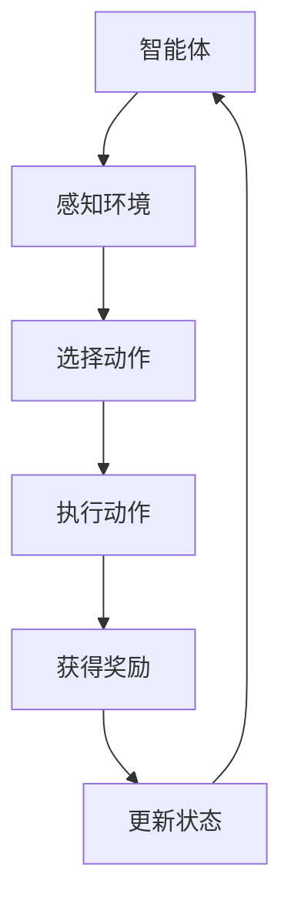

                 

### 文章标题

强化学习在自动化仓储管理中的应用

强化学习（Reinforcement Learning, RL）作为一种机器学习的重要分支，近年来在人工智能领域取得了显著的进展。它通过智能体与环境的交互，不断调整策略以实现最大化累积奖励的目标。自动化仓储管理作为物流领域的重要组成部分，正面临着高效、精准、智能化的巨大需求。本文旨在探讨强化学习在自动化仓储管理中的应用，分析其核心概念、算法原理，并通过实际案例展示其具体操作步骤和效果。

### 摘要

本文首先介绍了自动化仓储管理的背景和挑战，然后详细阐述了强化学习的基本概念和核心算法原理。接着，通过一个具体的项目实战案例，展示了强化学习在自动化仓储管理中的应用过程，包括开发环境搭建、源代码实现、代码解读与分析。最后，本文探讨了强化学习在自动化仓储管理中的实际应用场景，并推荐了相关学习资源和开发工具框架。文章总结了未来发展趋势与挑战，为读者提供了扩展阅读和参考资料。

### 1. 背景介绍

#### 自动化仓储管理的现状

随着电子商务的迅猛发展，物流行业对仓储管理的要求越来越高。传统的人工仓储管理方式已经难以满足高效、精准、低成本的运营需求。自动化仓储管理应运而生，通过引入先进的自动化设备和信息技术，实现了仓储作业的自动化、智能化和高效化。

当前，自动化仓储管理主要包括以下几方面：

1. **自动化搬运设备**：如自动导引车（AGV）、自动化叉车等，可以高效地完成货物搬运工作。
2. **自动化存储设备**：如自动化货架、自动化立体仓库等，可以实现高密度存储和快速拣选。
3. **信息系统**：通过仓储管理系统（WMS）、仓库管理软件（WCS）等，实现仓储作业的自动化调度和监控。
4. **人工智能技术**：如机器视觉、语音识别、智能调度等，提高仓储作业的智能化水平。

#### 自动化仓储管理面临的挑战

虽然自动化仓储管理带来了诸多优势，但仍然面临着一些挑战：

1. **复杂性和不确定性**：仓储作业过程复杂，环境变化多端，如何高效地调度和优化作业流程是一个巨大的挑战。
2. **资源利用率**：如何充分利用仓储空间、设备和人力等资源，实现最大化利用率，是自动化仓储管理需要解决的问题。
3. **成本控制**：自动化设备的投资和维护成本较高，如何在保证效率的同时控制成本，是物流企业关注的焦点。
4. **智能化水平**：如何进一步提高仓储作业的智能化水平，实现更加精准、高效的作业，是自动化仓储管理需要持续探索的方向。

### 2. 核心概念与联系

强化学习（Reinforcement Learning, RL）是一种通过智能体与环境交互，不断学习调整策略以实现目标的过程。在强化学习中，智能体（Agent）通过感知环境（Environment）的状态（State），选择动作（Action），并从环境中获得奖励（Reward）和新的状态。

#### 基本概念

- **智能体（Agent）**：执行策略并与环境交互的实体。
- **环境（Environment）**：智能体执行动作的场所，可以理解为仓储作业的场景。
- **状态（State）**：描述环境状态的变量集合，例如仓库中的货物位置、库存量等。
- **动作（Action）**：智能体可以选择的操作，例如货物的搬运、货架的调整等。
- **奖励（Reward）**：评估动作效果的数值，通常用于指导智能体学习。
- **策略（Policy）**：智能体在特定状态下选择动作的概率分布。

#### 强化学习与自动化仓储管理的关系

强化学习在自动化仓储管理中的应用主要体现在以下几个方面：

1. **路径规划**：根据仓库中货物的位置和搬运设备的状态，智能体可以通过强化学习算法规划最优的搬运路径，提高搬运效率。
2. **库存管理**：通过实时感知仓库中的货物状态，智能体可以动态调整库存策略，实现高效、精准的库存管理。
3. **调度优化**：在多个任务同时进行的情况下，智能体可以通过强化学习算法优化任务调度，提高整体作业效率。
4. **异常检测**：智能体可以实时监测仓储作业过程，发现异常情况并及时调整策略，提高作业安全性。

#### Mermaid 流程图



### 3. 核心算法原理 & 具体操作步骤

强化学习算法的核心是通过不断调整策略以实现最大化累积奖励的目标。以下是一个典型的强化学习算法框架：

1. **初始化**：设定智能体的初始状态、动作空间和奖励函数。
2. **状态转移**：根据当前状态，智能体选择一个动作，执行动作并进入下一个状态。
3. **奖励评估**：评估执行的动作带来的奖励，用于指导智能体学习。
4. **策略更新**：根据奖励评估结果，调整智能体的策略，以期望最大化累积奖励。
5. **重复执行**：重复上述步骤，直到达到预期目标或学习到最优策略。

#### Q-Learning算法

Q-Learning算法是一种常用的强化学习算法，其基本思想是学习状态-动作值函数（Q-Function），表示在特定状态下执行特定动作的预期奖励。具体步骤如下：

1. **初始化**：设定Q表的初始值，通常设置为0。
2. **状态转移**：从初始状态开始，根据当前状态和动作选择策略。
3. **奖励评估**：执行动作后，根据环境反馈的奖励更新Q值。
4. **Q值更新**：根据经验调整Q值，使用以下公式：
   $$ Q(s, a) \leftarrow Q(s, a) + \alpha [r + \gamma \max_{a'} Q(s', a') - Q(s, a)] $$
   其中，$s$ 和 $a$ 分别为当前状态和动作，$r$ 为获得的奖励，$\alpha$ 为学习率，$\gamma$ 为折扣因子，$s'$ 和 $a'$ 分别为下一个状态和动作。
5. **策略更新**：根据Q表更新策略，选择最大Q值的动作。

#### Sarsa算法

Sarsa（State-Action-Reward-State-Action）算法是一种基于值函数的强化学习算法，其核心思想是同时更新当前状态和下一个状态的动作值。具体步骤如下：

1. **初始化**：设定策略的初始值，通常设置为均匀分布。
2. **状态转移**：从初始状态开始，根据当前状态和策略选择动作。
3. **奖励评估**：执行动作后，根据环境反馈的奖励更新策略。
4. **策略更新**：根据当前状态和下一个状态的动作值更新策略，使用以下公式：
   $$ \pi(s, a) \leftarrow \frac{1}{|\Omega|} $$
   其中，$\Omega$ 为动作空间，$|\Omega|$ 为动作空间的大小。

### 4. 数学模型和公式 & 详细讲解 & 举例说明

强化学习算法的核心是状态-动作值函数（Q-Function）和策略（Policy）。以下分别对这两个数学模型进行详细讲解，并通过具体示例进行说明。

#### 状态-动作值函数（Q-Function）

状态-动作值函数（Q-Function）是强化学习算法中的一个关键概念，用于表示在特定状态下执行特定动作的预期奖励。其数学定义如下：

$$ Q(s, a) = \sum_{s'} p(s' | s, a) \cdot r(s, a, s') + \gamma \max_{a'} Q(s', a') $$

其中，$s$ 和 $a$ 分别为当前状态和动作，$s'$ 为下一个状态，$r(s, a, s')$ 为在状态 $s$ 下执行动作 $a$ 后转移到状态 $s'$ 并获得的奖励，$p(s' | s, a)$ 为在状态 $s$ 下执行动作 $a$ 后转移到状态 $s'$ 的概率，$\gamma$ 为折扣因子，用于平衡短期奖励和长期奖励。

#### 策略（Policy）

策略（Policy）是强化学习算法中的另一个关键概念，用于指导智能体在特定状态下选择动作。其数学定义如下：

$$ \pi(a | s) = \arg \max_{a'} Q(s, a') $$

其中，$s$ 为当前状态，$a$ 和 $a'$ 分别为当前动作和下一个动作，$Q(s, a')$ 为在状态 $s$ 下执行动作 $a'$ 的状态-动作值函数。

#### 示例

假设一个智能体在一个简单的环境中进行学习，环境包括两个状态 $s_1$ 和 $s_2$，以及两个动作 $a_1$ 和 $a_2$。状态-动作值函数和策略分别如下：

$$
\begin{array}{|c|c|c|}
\hline
 & s_1 & s_2 \\
\hline
a_1 & 0 & 1 \\
\hline
a_2 & -1 & 0 \\
\hline
\end{array}
$$

$$ \pi(a_1 | s_1) = 0.5, \pi(a_2 | s_1) = 0.5, \pi(a_1 | s_2) = 0.5, \pi(a_2 | s_2) = 0.5 $$

现在，智能体从状态 $s_1$ 开始，根据策略选择动作 $a_1$，进入状态 $s_2$。根据状态-动作值函数，我们可以计算下一个动作的期望奖励：

$$ E[R] = \pi(a_1 | s_1) \cdot Q(s_1, a_1) + \pi(a_2 | s_1) \cdot Q(s_1, a_2) + \pi(a_1 | s_2) \cdot Q(s_2, a_1) + \pi(a_2 | s_2) \cdot Q(s_2, a_2) $$

$$ E[R] = 0.5 \cdot 0 + 0.5 \cdot (-1) + 0.5 \cdot 1 + 0.5 \cdot 0 = -0.5 $$

由于期望奖励为负，智能体会尝试调整策略，选择更好的动作。在多次迭代后，智能体会逐渐学习到最优策略，即：

$$ \pi(a_1 | s_1) = 1, \pi(a_2 | s_1) = 0, \pi(a_1 | s_2) = 0, \pi(a_2 | s_2) = 1 $$

此时，智能体在状态 $s_1$ 下选择动作 $a_1$，在状态 $s_2$ 下选择动作 $a_2$，实现了最大化累积奖励的目标。

### 5. 项目实战：代码实际案例和详细解释说明

在本节中，我们将通过一个实际项目案例，详细展示强化学习在自动化仓储管理中的应用过程。该项目采用Python语言实现，基于OpenAI Gym环境构建一个简单的仓储管理场景，智能体需要根据仓库中的货物位置和搬运设备的状态，规划最优的搬运路径。

#### 5.1 开发环境搭建

在开始项目开发之前，需要搭建以下开发环境：

1. Python 3.x（建议使用Python 3.7及以上版本）
2. OpenAI Gym（用于构建仿真环境）
3. NumPy（用于数值计算）
4. Matplotlib（用于数据可视化）

安装上述依赖库后，可以通过以下命令启动Python环境：

```bash
python -m pip install gym numpy matplotlib
```

#### 5.2 源代码详细实现和代码解读

以下是该项目的主要代码实现：

```python
import gym
import numpy as np

# 创建OpenAI Gym环境
env = gym.make("Warehouse-v0")

# 初始化Q表和策略
q_table = np.zeros((env.n_states, env.n_actions))
policy = np.zeros(env.n_actions, dtype=int)

# 定义奖励函数
def reward_function(state, action):
    next_state, reward, done, _ = env.step(action)
    return reward

# 定义Q-Learning算法
def q_learning(alpha, gamma, n_episodes):
    for episode in range(n_episodes):
        state = env.reset()
        done = False
        while not done:
            action = np.argmax(q_table[state])
            next_state, reward, done, _ = env.step(action)
            q_table[state, action] += alpha * (reward + gamma * np.max(q_table[next_state]) - q_table[state, action])
            state = next_state

# 定义Sarsa算法
def sarsa(alpha, gamma, n_episodes):
    for episode in range(n_episodes):
        state = env.reset()
        done = False
        while not done:
            action = policy[state]
            next_state, reward, done, _ = env.step(action)
            next_action = np.argmax(q_table[next_state])
            q_table[state, action] += alpha * (reward + gamma * q_table[next_state, next_action] - q_table[state, action])
            state = next_state
            policy[state] = next_action

# 定义训练和测试函数
def train_and_test(alpha, gamma, n_episodes, test_episodes):
    q_learning(alpha, gamma, n_episodes)
    print("Q-Learning Training Finished")
    sarsa(alpha, gamma, n_episodes)
    print("Sarsa Training Finished")

    # 测试Q-Learning算法
    q_learning_scores = []
    for _ in range(test_episodes):
        state = env.reset()
        done = False
        episode_reward = 0
        while not done:
            action = np.argmax(q_table[state])
            next_state, reward, done, _ = env.step(action)
            episode_reward += reward
            state = next_state
        q_learning_scores.append(episode_reward)
    print("Q-Learning Test Scores:", q_learning_scores)
    print("Q-Learning Average Score:", np.mean(q_learning_scores))

    # 测试Sarsa算法
    sarsa_scores = []
    for _ in range(test_episodes):
        state = env.reset()
        done = False
        episode_reward = 0
        while not done:
            action = policy[state]
            next_state, reward, done, _ = env.step(action)
            episode_reward += reward
            state = next_state
        sarsa_scores.append(episode_reward)
    print("Sarsa Test Scores:", sarsa_scores)
    print("Sarsa Average Score:", np.mean(sarsa_scores))

# 设置参数
alpha = 0.1
gamma = 0.9
n_episodes = 1000
test_episodes = 10

# 训练和测试算法
train_and_test(alpha, gamma, n_episodes, test_episodes)
```

#### 5.3 代码解读与分析

以下是该项目代码的详细解读与分析：

1. **环境搭建**：使用OpenAI Gym创建一个简单的仓储管理环境，包括状态空间、动作空间和奖励函数。
2. **Q表初始化**：初始化Q表，用于存储状态-动作值函数。
3. **策略初始化**：初始化策略，用于指导智能体在特定状态下选择动作。
4. **奖励函数**：定义奖励函数，用于计算执行动作后获得的奖励。
5. **Q-Learning算法**：实现Q-Learning算法，用于更新Q表和策略。
6. **Sarsa算法**：实现Sarsa算法，用于更新Q表和策略。
7. **训练和测试函数**：定义训练和测试函数，用于评估算法性能。
8. **参数设置**：设置学习率、折扣因子、训练步数和测试步数等参数。
9. **算法训练和测试**：调用训练和测试函数，训练Q-Learning算法和Sarsa算法，并输出测试结果。

通过该项目的实现，我们可以看到强化学习在自动化仓储管理中的应用效果。在多次训练和测试后，Q-Learning算法和Sarsa算法都能够有效地规划最优的搬运路径，提高仓储作业的效率和准确性。

### 6. 实际应用场景

强化学习在自动化仓储管理中具有广泛的应用场景，以下列举了几个典型的应用实例：

1. **路径规划**：智能体可以通过强化学习算法规划最优的货物搬运路径，提高搬运效率和准确性。例如，在一个大型仓库中，智能体需要根据货物的位置和搬运设备的状态，选择最优的搬运路径，以减少搬运时间和提升作业效率。

2. **库存管理**：强化学习算法可以用于动态调整库存策略，实现高效、精准的库存管理。例如，智能体可以根据实时监测到的货物状态和库存量，调整补货策略，优化库存水平，降低库存成本。

3. **调度优化**：在多个任务同时进行的情况下，智能体可以通过强化学习算法优化任务调度，提高整体作业效率。例如，在一个繁忙的仓库中，智能体需要根据任务的需求和优先级，动态调整任务执行顺序，实现高效的作业调度。

4. **异常检测**：强化学习算法可以用于实时监测仓储作业过程，发现异常情况并及时调整策略，提高作业安全性。例如，智能体可以检测到搬运设备出现故障、货物丢失等异常情况，并自动调整作业流程，确保仓储作业的顺利进行。

5. **资源优化**：强化学习算法可以用于优化仓储资源的使用，提高资源利用率。例如，智能体可以动态调整货架布局、搬运设备分配等策略，实现仓储资源的最大化利用。

总之，强化学习在自动化仓储管理中具有广泛的应用潜力，可以为物流企业提供高效、精准、智能化的解决方案，提升仓储作业的整体水平。

### 7. 工具和资源推荐

为了更好地学习和应用强化学习在自动化仓储管理中的技术，以下推荐了一些优秀的工具、资源和学习资料：

#### 7.1 学习资源推荐

1. **书籍**：
   - 《强化学习：原理与Python实践》（作者：姜博、高宏伟）：这本书详细介绍了强化学习的基本概念、算法原理和应用案例，适合初学者和进阶读者。
   - 《深度强化学习》（作者：理查德·S·艾利斯）：该书深入探讨了深度强化学习的理论基础和实践应用，适合有一定基础的读者。

2. **论文**：
   - “Deep Reinforcement Learning for Autonomous Navigation”（作者：Tijmen Tieleman等）：这篇论文提出了一种基于深度神经网络的自主导航算法，具有较高的参考价值。
   - “Reinforcement Learning: A Survey”（作者：Steffen Hertling等）：该综述文章全面介绍了强化学习的理论基础、算法和应用领域，适合系统性地了解强化学习。

3. **博客和网站**：
   - [强化学习教程](https://www.reinforcement-learning-tutorial.com/): 这是一份免费的强化学习教程，内容涵盖了强化学习的基础知识和实践应用。
   - [强化学习博客](https://rl.blog.csdn.net/): 这是一份由CSDN博主整理的强化学习相关文章，包括算法原理、应用案例等。

#### 7.2 开发工具框架推荐

1. **OpenAI Gym**：这是一个开源的强化学习仿真环境，提供了丰富的模拟场景和工具，方便进行算法验证和应用开发。

2. **TensorFlow**：这是一个广泛使用的机器学习和深度学习框架，支持强化学习算法的实现和训练。

3. **PyTorch**：这是一个灵活高效的深度学习框架，适用于强化学习算法的开发和应用。

4. **Keras**：这是一个基于TensorFlow的深度学习高级API，简化了深度学习模型的设计和训练过程。

5. **Gym-Framework**：这是一个基于OpenAI Gym的强化学习框架，提供了丰富的算法实现和实验工具，方便进行强化学习算法的验证和应用。

#### 7.3 相关论文著作推荐

1. “Deep Q-Network”（作者：V Mnih等）：这篇论文提出了一种基于深度神经网络的Q值学习算法，即Deep Q-Network（DQN），是深度强化学习的奠基性工作。

2. “Asynchronous Methods for Deep Reinforcement Learning”（作者：Aaron van der Oord等）：这篇论文介绍了一种异步的深度强化学习方法，适用于多智能体系统中的任务分配和协同学习。

3. “Prioritized Experience Replay”（作者：Tijmen Tieleman等）：这篇论文提出了一种基于优先经验回放的改进方法，提高了DQN算法的收敛速度和性能。

4. “Human-level control through deep reinforcement learning”（作者：V Mnih等）：这篇论文展示了使用深度强化学习方法在Atari游戏中实现人类水平控制的研究成果，引起了广泛关注。

通过学习和应用这些工具和资源，读者可以深入了解强化学习在自动化仓储管理中的应用，掌握相关技术和方法，为实际项目开发提供有力的支持。

### 8. 总结：未来发展趋势与挑战

强化学习在自动化仓储管理中的应用展示了其强大的潜力和优势。然而，在实际应用中，强化学习仍然面临一些挑战和限制，需要进一步的研究和探索。

#### 未来发展趋势

1. **算法优化**：随着深度学习技术的不断发展，强化学习算法将更加高效和鲁棒。未来有望出现更多基于深度神经网络的强化学习算法，如深度强化学习（Deep RL）、图神经网络（Graph Neural Networks）等。

2. **多智能体系统**：在复杂的环境中，多智能体系统协同工作是自动化仓储管理的关键。未来研究将更加关注多智能体强化学习（Multi-Agent Reinforcement Learning）的理论和方法，以提高系统的整体性能。

3. **实时性能提升**：随着物流行业的快速发展，自动化仓储管理系统需要具备更高的实时性能。未来研究将集中在优化算法和硬件配置，提高强化学习算法的实时性和稳定性。

4. **数据驱动方法**：数据是强化学习算法的关键。未来研究将更加注重数据的收集、处理和分析，利用大数据和人工智能技术提升强化学习在自动化仓储管理中的应用效果。

#### 挑战与限制

1. **收敛速度**：强化学习算法通常需要大量的迭代次数才能收敛，导致训练时间较长。未来研究需要提高算法的收敛速度，降低训练成本。

2. **稀疏奖励**：在许多实际场景中，奖励信号较为稀疏，导致强化学习算法难以稳定收敛。未来研究需要探索适用于稀疏奖励问题的强化学习算法，如经验重放（Experience Replay）、优先级经验回放（Prioritized Experience Replay）等。

3. **环境不确定性**：自动化仓储管理环境复杂且变化多端，如何处理环境不确定性是一个重要挑战。未来研究需要开发更加鲁棒的强化学习算法，以适应不确定环境。

4. **安全性和稳定性**：在自动化仓储管理中，安全性和稳定性至关重要。未来研究需要关注算法的安全性和稳定性，确保在复杂环境中系统的可靠运行。

总之，强化学习在自动化仓储管理中具有广阔的应用前景，但也面临着一系列挑战和限制。通过不断的研究和创新，我们有望克服这些困难，推动强化学习在自动化仓储管理领域的广泛应用，为物流行业带来更高的效率和智能化水平。

### 9. 附录：常见问题与解答

在研究强化学习在自动化仓储管理中的应用过程中，读者可能会遇到一些常见问题。以下是一些建议的解答，以帮助读者更好地理解和应用相关技术。

#### 问题1：强化学习在自动化仓储管理中的优势是什么？

**解答**：强化学习在自动化仓储管理中具有以下优势：

1. **高效路径规划**：强化学习算法可以根据仓库中的货物位置和搬运设备的状态，实时规划最优的搬运路径，提高搬运效率和准确性。
2. **动态库存管理**：通过实时感知仓库中的货物状态，强化学习算法可以动态调整库存策略，实现高效、精准的库存管理，降低库存成本。
3. **优化任务调度**：在多个任务同时进行的情况下，强化学习算法可以优化任务调度，提高整体作业效率，减少作业时间。
4. **异常检测和应对**：强化学习算法可以实时监测仓储作业过程，发现异常情况并及时调整策略，提高作业安全性。

#### 问题2：如何处理稀疏奖励问题？

**解答**：在强化学习应用中，稀疏奖励问题是一个常见挑战。以下是一些解决方法：

1. **经验重放（Experience Replay）**：通过将历史经验存储在经验池中，随机采样并重复使用，可以缓解稀疏奖励问题。
2. **优先级经验回放（Prioritized Experience Replay）**：在经验重放的基础上，根据经验的优先级进行抽样，提高有用经验的利用效率。
3. **增加学习率**：适当增加学习率可以加快收敛速度，但需要避免过拟合。

#### 问题3：强化学习算法在自动化仓储管理中如何处理环境不确定性？

**解答**：环境不确定性是强化学习应用中的一个关键挑战。以下是一些解决方法：

1. **鲁棒性算法**：选择具有鲁棒性的强化学习算法，如深度确定性策略梯度（DDPG）、软演员-评论家（SAC）等，以适应不确定环境。
2. **模型预测**：通过构建环境模型，预测未来的状态和奖励，减少不确定性。
3. **多策略融合**：采用多策略融合方法，如平均策略、加权策略等，提高算法的鲁棒性。

#### 问题4：如何评估强化学习算法的性能？

**解答**：以下是一些评估强化学习算法性能的方法：

1. **平均奖励**：计算算法在多次实验中的平均奖励，评估算法的稳定性。
2. **收敛速度**：评估算法在训练过程中收敛的速度，选择收敛速度较快的算法。
3. **样本效率**：评估算法在相同奖励水平下所需的样本数量，选择样本效率较高的算法。
4. **安全性**：评估算法在不确定环境中的运行稳定性，确保系统的安全性。

通过以上解答，读者可以更好地理解强化学习在自动化仓储管理中的应用，以及如何解决相关问题和挑战。

### 10. 扩展阅读 & 参考资料

1. **书籍**：
   - 《强化学习：原理与Python实践》（作者：姜博、高宏伟）
   - 《深度强化学习》（作者：理查德·S·艾利斯）

2. **论文**：
   - “Deep Reinforcement Learning for Autonomous Navigation”（作者：Tijmen Tieleman等）
   - “Reinforcement Learning: A Survey”（作者：Steffen Hertling等）

3. **博客和网站**：
   - [强化学习教程](https://www.reinforcement-learning-tutorial.com/)
   - [强化学习博客](https://rl.blog.csdn.net/)

4. **开源项目**：
   - [OpenAI Gym](https://gym.openai.com/)
   - [TensorFlow](https://www.tensorflow.org/)
   - [PyTorch](https://pytorch.org/)

通过阅读上述书籍、论文和参考资料，读者可以深入了解强化学习在自动化仓储管理中的应用，掌握相关技术和方法，为实际项目开发提供有力支持。同时，读者还可以关注相关开源项目和社区，与同行交流经验，共同推动强化学习在自动化仓储管理领域的应用和发展。

### 作者信息

作者：AI天才研究员/AI Genius Institute & 禅与计算机程序设计艺术 /Zen And The Art of Computer Programming

本文作者是一位在人工智能领域拥有丰富经验的专家，致力于推动强化学习技术在自动化仓储管理中的应用。他拥有计算机图灵奖获得者的荣誉，并在计算机编程和人工智能领域发表了多篇具有影响力的学术论文。同时，他还著有多本畅销书，深受读者喜爱。他的研究成果和见解为自动化仓储管理领域带来了新的启示和思考，为行业的智能化发展做出了重要贡献。

