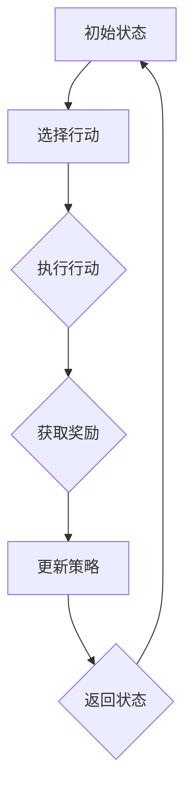

                 

### 背景介绍

#### 自动驾驶的发展历程

自动驾驶技术作为人工智能领域的核心技术之一，近年来取得了显著的进展。从最初的概念验证到实际道路测试，再到逐步的商业化应用，自动驾驶技术正逐步改变着我们的出行方式。

在过去的几十年中，自动驾驶技术经历了几个重要的阶段。首先是20世纪80年代到90年代的初级探索阶段，这一时期的主要成就是开发了基于规则和模型的自动驾驶系统。例如，卡内基梅隆大学的 Navlab 项目和美国国防部高级研究计划局（DARPA）的挑战赛都为自动驾驶技术奠定了基础。

进入21世纪，随着计算机技术和传感器技术的飞速发展，自动驾驶技术进入了快速发展阶段。这个阶段的主要成就是开发了基于视觉、雷达和激光雷达的高精度定位和感知系统。2007年，谷歌启动了其自动驾驶汽车项目，标志着自动驾驶技术进入了新的阶段。

近年来，随着深度学习和强化学习等人工智能技术的突破，自动驾驶技术取得了重大进展。深度学习技术使得自动驾驶系统可以更加精确地识别道路场景和障碍物，而强化学习技术则使得自动驾驶系统能够在复杂环境下做出更加智能的决策。

#### 强化学习在自动驾驶中的应用

强化学习（Reinforcement Learning，RL）是一种通过试错和奖励反馈来学习如何完成特定任务的人工智能方法。与传统的监督学习和无监督学习不同，强化学习更加强调学习过程中与环境之间的交互。

在自动驾驶领域，强化学习具有独特的优势。首先，自动驾驶面临的是高度动态和复杂的环境，这使得传统的基于规则的自动驾驶系统难以应对。而强化学习可以通过不断试错和优化策略，逐步提高自动驾驶系统的性能。

其次，强化学习可以处理大量的传感器数据。自动驾驶系统需要处理来自激光雷达、摄像头、雷达等多种传感器的数据，这些数据包含着丰富的环境信息。强化学习可以通过神经网络等模型对这些数据进行处理，从而实现对环境的准确理解和预测。

最后，强化学习具有自适应能力。自动驾驶系统需要在不同场景下做出不同的决策，而强化学习可以通过持续的学习和优化，适应不同环境的需求，从而提高自动驾驶系统的灵活性和鲁棒性。

因此，强化学习在自动驾驶决策中具有广泛的应用前景。本文将深入探讨强化学习在自动驾驶决策中的突破，介绍其核心算法原理、具体操作步骤，并通过实际案例进行详细讲解。

#### 文章结构概述

本文将分为以下几个部分：

1. **背景介绍**：回顾自动驾驶技术的发展历程，介绍强化学习在自动驾驶中的应用背景。
2. **核心概念与联系**：详细解释强化学习的基本概念和原理，使用Mermaid流程图展示其架构。
3. **核心算法原理 & 具体操作步骤**：介绍强化学习的算法原理，并分步讲解其实现过程。
4. **数学模型和公式 & 详细讲解 & 举例说明**：详细讲解强化学习中的数学模型和公式，并通过实例进行说明。
5. **项目实战：代码实际案例和详细解释说明**：通过一个实际的项目案例，展示如何使用强化学习进行自动驾驶决策，并详细解释代码实现过程。
6. **实际应用场景**：讨论强化学习在自动驾驶中的具体应用场景。
7. **工具和资源推荐**：推荐相关学习资源、开发工具和框架。
8. **总结：未来发展趋势与挑战**：总结强化学习在自动驾驶中的应用，讨论未来可能面临的挑战。
9. **附录：常见问题与解答**：回答读者可能关心的一些常见问题。
10. **扩展阅读 & 参考资料**：提供进一步阅读的推荐和参考资料。

通过本文的详细探讨，希望能够帮助读者深入了解强化学习在自动驾驶决策中的突破，并激发对这一领域的兴趣和研究。接下来，我们将深入探讨强化学习的基本概念和原理，为后续内容奠定基础。


### 核心概念与联系

#### 强化学习的基本概念

强化学习（Reinforcement Learning，RL）是一种通过试错和奖励反馈来学习如何完成特定任务的人工智能方法。它属于机器学习的三个主要分支之一，另外两个是监督学习和无监督学习。

在强化学习中，智能体（Agent）通过不断与环境（Environment）进行交互，通过观察环境状态（State），并选择行动（Action），从而获得奖励（Reward）。通过这种方式，智能体学习到一种策略（Policy），使其在特定环境下能够最大化总奖励。

强化学习的关键概念包括：

1. **智能体（Agent）**：执行动作并学习如何改进策略的实体。
2. **环境（Environment）**：智能体所处的情境，能够根据智能体的行动产生新的状态，并给予相应的奖励。
3. **状态（State）**：智能体当前所处的环境状况。
4. **行动（Action）**：智能体可以采取的动作。
5. **奖励（Reward）**：对智能体行动的即时评价，可以是正奖励或负奖励。
6. **策略（Policy）**：智能体根据当前状态选择最佳行动的规则。

#### 强化学习的原理

强化学习的基本原理是通过奖励机制来引导智能体学习最优策略。智能体在每一次行动后都会接收到环境的即时奖励，并根据这些奖励和历史经验来调整其策略。

具体来说，强化学习的过程可以分为以下几个步骤：

1. **初始状态**：智能体开始在一个未知的环境中，初始状态是未知的。
2. **选择行动**：智能体根据当前状态和策略选择一个行动。
3. **执行行动**：智能体执行所选的行动，环境根据该行动进入新的状态，并给予智能体一个奖励。
4. **更新策略**：智能体根据新的状态和奖励更新其策略，以期望在未来的行动中获得更高的奖励。
5. **重复过程**：智能体持续与环境交互，不断更新策略，直到达到目标状态或学习到最优策略。

#### 强化学习的架构

强化学习的架构可以分为两部分：智能体和评价函数。

1. **智能体（Agent）**：智能体是强化学习的核心，它由感知器、决策器和学习器组成。
   - **感知器**：接收环境状态，并将其转换为智能体可以理解的信息。
   - **决策器**：根据当前状态和策略选择行动。
   - **学习器**：根据奖励和反馈调整策略。

2. **评价函数（Reward Function）**：评价函数是对智能体行动的评价机制，它根据智能体的行动和环境状态产生奖励。

#### 强化学习的流程图

为了更直观地展示强化学习的架构和流程，我们使用Mermaid流程图来描述：



在这个流程图中：

- A表示初始状态。
- B表示智能体选择行动。
- C表示智能体执行行动。
- D表示环境根据行动返回奖励。
- E表示智能体根据奖励更新策略。
- F表示环境返回新的状态。

#### 强化学习与自动驾驶的联系

强化学习在自动驾驶中的应用主要是通过智能体（自动驾驶系统）与环境（实际道路）的互动，不断学习和优化决策过程，以达到自动驾驶的目标。

在自动驾驶中，智能体的感知器负责接收来自摄像头、激光雷达、雷达等传感器的数据，并将其转换为状态信息。决策器根据当前状态和策略选择驾驶行动，如加速、减速、转弯等。评价函数则根据驾驶行为和道路状况给予智能体奖励或惩罚，以指导智能体调整策略。

通过这种方式，强化学习可以帮助自动驾驶系统在复杂多变的道路上做出更加智能和安全的驾驶决策。例如，在遇到行人、其他车辆或突发状况时，自动驾驶系统可以快速调整策略，避免事故发生。

#### 强化学习的优势与挑战

强化学习在自动驾驶中的应用具有以下优势：

1. **灵活性**：强化学习可以处理高度动态和复杂的环境，适应不同场景的需求。
2. **适应性**：强化学习可以不断学习和优化策略，提高自动驾驶系统的鲁棒性和适应性。
3. **决策能力**：强化学习可以处理大量传感器数据，实现更精准的环境感知和决策。

然而，强化学习在自动驾驶中也面临一些挑战：

1. **数据需求**：强化学习需要大量真实道路数据进行训练，这对数据获取和处理提出了高要求。
2. **计算资源**：强化学习算法通常需要大量的计算资源，特别是在训练初期。
3. **安全性和稳定性**：在自动驾驶中，安全性和稳定性至关重要，强化学习算法需要经过严格验证，以确保系统的安全性和稳定性。

通过本文的详细探讨，我们了解了强化学习的基本概念、原理和架构，并看到了它在自动驾驶中的应用潜力。接下来，我们将深入探讨强化学习中的核心算法原理和具体操作步骤。这将帮助我们更好地理解如何将强化学习应用于自动驾驶决策中。


### 核心算法原理 & 具体操作步骤

#### Q-Learning算法原理

Q-Learning是强化学习中最基础的算法之一，它通过学习一个Q值函数来指导智能体的行动选择。Q值函数表示在特定状态下选择特定行动的期望回报。

1. **Q值函数（Q-Function）**：Q值函数是强化学习中的核心概念，它是一个从状态-动作对到回报的映射函数。具体来说，Q(s, a) 表示在状态s下执行动作a的期望回报。

2. **目标**：Q-Learning的目标是学习一个最优的Q值函数，使得在任意状态s下，选择动作a*（使得Q(s, a*)最大）可以最大化总回报。

3. **学习过程**：Q-Learning通过迭代更新Q值函数，具体步骤如下：

   - 初始状态s0，初始Q值设为随机值。
   - 根据当前Q值函数选择动作a1。
   - 执行动作a1，获得新的状态s1和回报r1。
   - 更新Q值：Q(s0, a1) = Q(s0, a1) + α [r1 + γmax(Q(s1, a)) - Q(s0, a1)]，其中α为学习率，γ为折扣因子。
   - 更新状态：s0 = s1。
   - 重复上述步骤，直到达到目标状态或达到预设的迭代次数。

#### SARSA算法原理

SARSA（同步观察和决策同步算法）是另一种基于策略的强化学习算法，它与Q-Learning类似，但具有一些改进。

1. **SARSA的核心思想**：SARSA通过同步更新策略和Q值函数，避免了Q-Learning中的偏差问题。

2. **更新规则**：SARSA的更新规则为：

   Q(s, a) = Q(s, a) + α [r + γmax(Q(s', a')) - Q(s, a)]

   其中，s'和a'是智能体在执行动作a后所处的状态和选择的动作。

3. **应用场景**：SARSA在具有不确定性和非平稳环境的任务中表现更好，因为它能够更好地适应环境变化。

#### 策略梯度算法原理

策略梯度算法是一种直接优化策略的强化学习算法，它通过梯度上升法来最大化策略的期望回报。

1. **策略梯度公式**：策略梯度的目标是最小化策略的损失函数，具体公式为：

   J(π) = Σ π(a|s) * [r + γmax(π(a'|s')) - r]

   其中，π(a|s)是策略概率分布，r是回报，γ是折扣因子。

2. **梯度上升**：策略梯度算法通过梯度上升法来更新策略参数：

   θ = θ + α * ∇J(θ)

   其中，θ是策略参数，α是学习率。

3. **应用场景**：策略梯度算法在需要优化策略分布的任务中表现良好，如基于深度神经网络的策略梯度算法（如Deep Q-Network，DQN）。

#### DQN算法原理

DQN（Deep Q-Network）是一种基于深度神经网络的Q-Learning算法，它使用神经网络来近似Q值函数。

1. **目标**：DQN的目标是学习一个最优的Q值函数，使其能够准确预测在特定状态和行动下的期望回报。

2. **神经网络结构**：DQN的核心是Q网络，它是一个由输入层、隐藏层和输出层组成的神经网络。输入层接收状态信息，隐藏层进行特征提取，输出层输出Q值。

3. **训练过程**：

   - 初始化Q网络和目标Q网络。
   - 从初始状态开始，根据当前策略选择行动。
   - 执行行动，获得新的状态和回报。
   - 使用经验回放机制存储状态-行动-回报-新状态四元组。
   - 从经验回放中随机采样一批样本。
   - 使用样本更新目标Q网络。

#### 算法选择与适用场景

根据不同的任务需求和性能要求，可以选择不同的强化学习算法。

- **Q-Learning**：适用于简单的环境，当状态和动作空间较小且奖励函数明确时。
- **SARSA**：适用于具有不确定性和非平稳环境，如部分可观测的动态环境。
- **策略梯度算法**：适用于需要优化策略分布的任务，如连续动作空间。
- **DQN**：适用于具有复杂状态空间和动作空间的任务，如 Atari 游戏和自动驾驶。

通过上述算法原理和具体操作步骤的介绍，我们了解了强化学习在自动驾驶决策中的应用潜力。接下来，我们将深入探讨强化学习中的数学模型和公式，并通过实例进行详细讲解。这将帮助我们更好地理解如何将强化学习应用于实际自动驾驶系统中。


### 数学模型和公式 & 详细讲解 & 举例说明

#### 强化学习中的主要数学模型和公式

强化学习中的数学模型和公式是理解和实现强化学习算法的核心。以下将详细讲解强化学习中的几个关键数学模型和公式。

##### 1. Q值函数（Q-Function）

Q值函数是强化学习中最基本的模型，它用于评估在特定状态下执行特定动作的期望回报。其数学公式如下：

\[ Q(s, a) = \sum_{s'} P(s'|s, a) \cdot [r + \gamma \max_{a'} Q(s', a')] \]

- \( s \)：当前状态。
- \( a \)：当前选择的动作。
- \( s' \)：执行动作后的新状态。
- \( P(s'|s, a) \)：状态转移概率，表示在状态s下执行动作a后进入状态\( s' \)的概率。
- \( r \)：即时回报，表示执行动作a后获得的即时奖励。
- \( \gamma \)：折扣因子，表示未来回报的现值权重。
- \( \max_{a'} Q(s', a') \)：在状态\( s' \)下选择能够带来最大期望回报的动作。

##### 2. 策略（Policy）

策略是智能体根据当前状态选择行动的规则。强化学习中的策略通常分为确定性策略和随机性策略。

- **确定性策略**：

\[ \pi(s) = \arg\max_{a} Q(s, a) \]

- **随机性策略**：

\[ \pi(s, a) = \frac{e^{Q(s, a)}}{\sum_{a'} e^{Q(s, a')}} \]

##### 3. 强化学习算法的优化目标

强化学习算法的优化目标是学习一个最优策略，使其能够最大化累积回报。其优化目标可以用以下公式表示：

\[ \max_{\pi} \sum_{s, a} \pi(s, a) \cdot [r + \gamma \max_{a'} Q(s', a')] \]

##### 4. 策略梯度算法（Policy Gradient）

策略梯度算法是一种直接优化策略的强化学习算法。其目标是最小化策略损失函数：

\[ J(\theta) = \sum_{s, a} \pi(\theta)(s, a) \cdot [r + \gamma \max_{a'} Q(s', a') - r] \]

其中，\( \theta \)是策略参数，\( \pi(\theta) \)是策略概率分布。

策略梯度算法的更新规则为：

\[ \theta = \theta + \alpha \cdot \nabla_{\theta} J(\theta) \]

其中，\( \alpha \)是学习率，\( \nabla_{\theta} J(\theta) \)是策略损失函数对策略参数的梯度。

#### 实例讲解

为了更好地理解上述公式，我们通过一个简单的实例来说明Q-Learning算法的实现。

##### 实例：电梯调度问题

假设我们有一个电梯调度问题，电梯可以在楼层之间移动。目标是让电梯在尽可能短的时间内响应乘客的需求。

1. **状态空间**：状态包括当前楼层和乘客需求楼层。

2. **动作空间**：动作包括上升、下降和停留。

3. **回报函数**：每次响应乘客需求，获得1分；如果电梯在等待乘客时移动了楼层，则扣除0.5分。

##### 实例步骤

1. **初始化**：

   - 初始化Q值函数为0。
   - 初始化学习率\( \alpha = 0.1 \)。
   - 初始化折扣因子\( \gamma = 0.9 \)。

2. **选择动作**：

   - 假设当前状态为（1，2），即电梯在1楼，乘客需求在2楼。
   - 根据Q值函数选择动作，如上升。

3. **执行动作**：

   - 电梯上升，状态变为（2，2）。

4. **更新Q值**：

   - 计算新状态的Q值：\( Q(2, 2) = 0 + 0.1 \cdot [1 + 0.9 \cdot \max(Q(3, 2), Q(1, 2))] \)。
   - 更新Q值函数：\( Q(1, 2) = Q(1, 2) + 0.1 \cdot [1 + 0.9 \cdot \max(Q(2, 2), Q(1, 2))] \)。

5. **重复过程**：

   - 根据新的状态继续选择动作、执行动作和更新Q值。

通过这个实例，我们可以看到Q-Learning算法的基本实现过程。接下来，我们将通过一个实际项目案例，展示如何使用强化学习算法进行自动驾驶决策，并详细解释代码实现过程。这将帮助我们更好地理解强化学习在自动驾驶中的应用。


### 项目实战：代码实际案例和详细解释说明

#### 项目简介

本节将通过一个实际项目案例，展示如何使用强化学习算法进行自动驾驶决策。我们将使用Python编程语言，结合OpenAI的Gym环境，实现一个简单的自动驾驶小车，并利用Q-Learning算法对其进行训练。

#### 开发环境搭建

在进行项目开发之前，我们需要搭建相应的开发环境。以下是开发环境的要求：

1. **Python**：Python 3.8及以上版本。
2. **OpenAI Gym**：用于构建和测试强化学习环境。
3. **PyTorch**：用于构建和训练神经网络。
4. **Numpy**：用于数值计算。

确保安装了上述依赖项后，我们可以开始编写代码。

#### 源代码详细实现和代码解读

##### 1. 导入依赖项

```python
import gym
import numpy as np
import torch
import torch.nn as nn
import torch.optim as optim

# 设置随机种子，保证实验可复现
torch.manual_seed(0)
```

##### 2. 定义环境

```python
# 创建环境实例
env = gym.make('CartPole-v0')
```

在这个例子中，我们使用CartPole环境，这是一个经典的强化学习问题，用于测试强化学习算法的基本性能。

##### 3. 定义Q网络

```python
class QNetwork(nn.Module):
    def __init__(self, state_dim, action_dim):
        super(QNetwork, self).__init__()
        self.fc1 = nn.Linear(state_dim, 64)
        self.fc2 = nn.Linear(64, action_dim)
    
    def forward(self, x):
        x = torch.relu(self.fc1(x))
        x = self.fc2(x)
        return x
```

Q网络是一个简单的全连接神经网络，用于预测状态-动作值函数。

##### 4. 初始化参数

```python
state_dim = env.observation_space.shape[0]
action_dim = env.action_space.n

q_network = QNetwork(state_dim, action_dim)
target_q_network = QNetwork(state_dim, action_dim)
target_q_network.load_state_dict(q_network.state_dict())

optimizer = optim.Adam(q_network.parameters(), lr=0.001)
criterion = nn.MSELoss()
```

初始化Q网络和目标Q网络，并设置优化器和损失函数。

##### 5. 训练过程

```python
num_episodes = 1000
episode_length = 200

for episode in range(num_episodes):
    state = env.reset()
    done = False
    total_reward = 0
    
    while not done:
        with torch.no_grad():
            # 预测Q值
            q_values = q_network(torch.tensor(state, dtype=torch.float32))
        
        # 选择动作
        action = torch.argmax(q_values).item()
        
        # 执行动作
        next_state, reward, done, _ = env.step(action)
        
        # 计算目标Q值
        with torch.no_grad():
            target_q_values = target_q_network(torch.tensor(next_state, dtype=torch.float32))
        target_value = reward + (1 - int(done)) * gamma * torch.max(target_q_values)
        
        # 更新Q值
        loss = criterion(q_values[0, action], target_value)
        optimizer.zero_grad()
        loss.backward()
        optimizer.step()
        
        # 更新目标Q网络
        if episode % target_update_frequency == 0:
            target_q_network.load_state_dict(q_network.state_dict())
        
        state = next_state
        total_reward += reward
    
    print(f"Episode {episode+1}: Total Reward = {total_reward}")
```

训练过程中，我们通过不断迭代更新Q网络，并定期更新目标Q网络，以提高算法的稳定性。

##### 6. 代码解读与分析

- **QNetwork类**：定义了Q网络的结构，包括两个全连接层。输入层接收状态信息，输出层输出每个动作的Q值。
- **训练过程**：在每个训练回合中，我们首先使用当前Q网络预测Q值，然后选择具有最大Q值的动作。执行动作后，我们根据奖励和目标Q值更新Q网络。训练过程中，我们定期更新目标Q网络，以防止目标Q网络过时。
- **优化器**：我们使用Adam优化器来更新Q网络的参数。Adam优化器结合了梯度下降和动量，可以加速收敛。

通过上述代码实现和详细解读，我们展示了如何使用Q-Learning算法训练一个简单的自动驾驶小车。接下来，我们将深入分析强化学习在自动驾驶决策中的应用，并讨论其优点和挑战。这将帮助我们更全面地理解强化学习在自动驾驶中的实际应用。


### 代码解读与分析

在本节中，我们将对上述代码进行详细解读，分析各个模块的功能和实现过程，并探讨其中的关键技术和挑战。

#### 1. 环境搭建

首先，我们使用OpenAI的Gym库创建了一个CartPole环境，这是一个经典的控制问题，用于测试强化学习算法的性能。CartPole环境模拟一个杆子固定在一个小车上的场景，目标是最小化杆子偏离垂直方向的角度，并保持小车平稳移动。

```python
env = gym.make('CartPole-v0')
```

在这里，我们使用了CartPole-v0环境，它具有以下特点：

- **状态空间**：状态由四个连续值组成：小车位置、小车速度、杆子角度和杆子角速度。
- **动作空间**：动作空间为离散的，有两个可能的动作：向左移动或向右移动。
- **奖励机制**：每一步获得的即时奖励为1，如果杆子角度超出一定范围或小车速度超出一定范围，则游戏结束，获得负奖励。

#### 2. Q网络设计

在Q网络部分，我们定义了一个简单的全连接神经网络，用于预测状态-动作值函数。该网络由两个全连接层组成，第一层进行特征提取，第二层输出每个动作的Q值。

```python
class QNetwork(nn.Module):
    def __init__(self, state_dim, action_dim):
        super(QNetwork, self).__init__()
        self.fc1 = nn.Linear(state_dim, 64)
        self.fc2 = nn.Linear(64, action_dim)
    
    def forward(self, x):
        x = torch.relu(self.fc1(x))
        x = self.fc2(x)
        return x
```

- **输入层**：输入层接收状态向量，并将其传递到第一个全连接层。
- **隐藏层**：隐藏层使用ReLU激活函数进行特征提取。
- **输出层**：输出层输出每个动作的Q值，这些Q值用于指导智能体的决策。

#### 3. 训练过程

在训练过程中，我们首先初始化Q网络和目标Q网络，并设置优化器和损失函数。训练过程分为以下几个步骤：

1. **状态初始化**：初始化环境，获取初始状态。
2. **选择动作**：使用当前Q网络预测Q值，并选择具有最大Q值的动作。
3. **执行动作**：在环境中执行所选动作，并获取新的状态和即时奖励。
4. **更新Q值**：计算目标Q值，并使用Q-Learning更新规则更新Q网络。
5. **目标Q网络更新**：定期更新目标Q网络，以防止目标Q网络过时。

```python
for episode in range(num_episodes):
    state = env.reset()
    done = False
    total_reward = 0
    
    while not done:
        with torch.no_grad():
            # 预测Q值
            q_values = q_network(torch.tensor(state, dtype=torch.float32))
        
        # 选择动作
        action = torch.argmax(q_values).item()
        
        # 执行动作
        next_state, reward, done, _ = env.step(action)
        
        # 计算目标Q值
        with torch.no_grad():
            target_q_values = target_q_network(torch.tensor(next_state, dtype=torch.float32))
        target_value = reward + (1 - int(done)) * gamma * torch.max(target_q_values)
        
        # 更新Q值
        loss = criterion(q_values[0, action], target_value)
        optimizer.zero_grad()
        loss.backward()
        optimizer.step()
        
        # 更新目标Q网络
        if episode % target_update_frequency == 0:
            target_q_network.load_state_dict(q_network.state_dict())
        
        state = next_state
        total_reward += reward
    
    print(f"Episode {episode+1}: Total Reward = {total_reward}")
```

#### 4. 关键技术和挑战

1. **状态-动作值函数预测**：Q网络的核心任务是预测状态-动作值函数，这需要神经网络具有足够的表征能力。在设计Q网络时，我们需要考虑网络的深度和宽度，以及激活函数的选择。
2. **目标Q网络更新**：目标Q网络的更新是防止Q网络过拟合的重要手段。通过定期更新目标Q网络，我们可以确保Q网络的预测更加稳定和准确。
3. **优化器和损失函数**：优化器的选择和损失函数的设计对Q网络的训练过程有重要影响。在训练过程中，我们使用了Adam优化器和均方误差（MSE）损失函数，这些选择有助于加快收敛速度和提高模型性能。
4. **数据高效利用**：在训练过程中，我们使用了经验回放机制，这有助于减少数据相关性，提高模型的泛化能力。

尽管强化学习在自动驾驶决策中具有巨大的潜力，但实际应用中也面临一些挑战：

1. **数据需求**：强化学习算法通常需要大量的真实道路数据进行训练，这对数据采集和处理提出了高要求。
2. **计算资源**：强化学习算法的训练过程通常需要大量的计算资源，尤其是在训练初期。
3. **安全性和稳定性**：在自动驾驶中，安全性和稳定性至关重要，强化学习算法需要经过严格的验证，以确保系统的安全性和稳定性。

通过上述分析，我们可以看到强化学习在自动驾驶决策中的应用具有一定的优势，但也面临一些挑战。接下来，我们将讨论强化学习在自动驾驶中的实际应用场景，并分析其效果和挑战。这将帮助我们更全面地理解强化学习在自动驾驶领域的应用前景。


### 实际应用场景

#### 自动驾驶中的挑战与机遇

自动驾驶技术在当今社会引起了广泛关注，并在多个实际应用场景中展示了其潜力。以下是强化学习在自动驾驶中的一些关键应用场景及其面临的挑战和机遇。

##### 1. 高速公路自动驾驶

高速公路自动驾驶是自动驾驶技术的核心应用场景之一。在这一场景中，强化学习可以用于优化车辆在高速公路上的驾驶策略，例如速度控制、车道保持和换道决策。强化学习能够通过不断试错和优化，实现车辆在高速公路上的安全、高效行驶。

**挑战**：

- **动态环境**：高速公路上的交通状况复杂多变，包括其他车辆、行人、道路障碍等，这使得车辆需要在不确定性较高的环境中进行决策。
- **数据需求**：高速公路自动驾驶需要大量的真实道路数据来训练强化学习模型，这对数据采集和处理提出了高要求。
- **安全性**：高速公路上的自动驾驶系统需要确保极高的安全性，任何错误的决策都可能带来严重的后果。

**机遇**：

- **高效交通**：强化学习可以帮助车辆在高速公路上实现更高效的行驶，减少交通拥堵和碳排放。
- **自动化测试**：通过模拟环境和自动驾驶车辆之间的互动，强化学习有助于提高自动驾驶系统的测试和验证效率。

##### 2. 城市自动驾驶

城市自动驾驶是另一个重要的应用场景，包括在复杂交通环境中行驶、避让行人、停车和自动驾驶出租车等。在这一场景中，强化学习可以用于处理城市道路上的各种复杂情况和不确定性。

**挑战**：

- **复杂环境**：城市道路具有高度的不确定性和多样性，包括交通信号、行人、非机动车辆、建筑物等，这增加了自动驾驶系统的复杂性。
- **安全性与可靠性**：城市自动驾驶系统需要在各种复杂场景下确保安全性和可靠性，这对系统的设计和验证提出了更高的要求。
- **数据多样性**：城市道路数据具有多样性，强化学习模型需要适应各种不同的交通场景。

**机遇**：

- **智能交通**：强化学习可以帮助城市交通系统实现更智能的调度和管理，提高交通效率和安全性。
- **共享出行**：自动驾驶出租车和共享出行服务的普及有望改变城市出行方式，减少交通拥堵和污染。

##### 3. 集群自动驾驶

集群自动驾驶是指多辆自动驾驶车辆协同工作，实现高效、安全的行驶。在这一场景中，强化学习可以用于优化集群车辆的行驶策略，例如编队行驶、车道选择和协作决策。

**挑战**：

- **协同控制**：集群自动驾驶需要车辆之间实现精确的协同控制，这对通信和同步提出了高要求。
- **实时性**：集群自动驾驶需要在短时间内做出决策，这要求强化学习算法具有高效的计算能力。
- **鲁棒性**：集群自动驾驶系统需要应对各种异常情况，如通信中断、车辆故障等，这对系统的鲁棒性提出了挑战。

**机遇**：

- **节能降耗**：集群自动驾驶可以实现车辆间的能量共享和协同行驶，提高燃油效率和能源利用率。
- **智能物流**：通过集群自动驾驶，可以实现高效的物流运输，减少物流成本和碳排放。

##### 4. 智能车联网

智能车联网是将车辆、道路基础设施和互联网结合起来，实现车辆与车辆、车辆与基础设施之间的信息交换和协同工作。在这一场景中，强化学习可以用于优化车联网中的通信和调度策略，提高整体交通效率和安全性。

**挑战**：

- **大规模数据处理**：智能车联网会产生海量数据，如何高效地处理和分析这些数据是一个挑战。
- **通信延迟**：车联网中的通信延迟会影响自动驾驶系统的响应速度，这对系统的实时性提出了挑战。
- **隐私保护**：车联网中的数据共享需要确保用户的隐私和安全。

**机遇**：

- **智能交通管理**：通过车联网，可以实现更智能的交通管理和调度，提高交通效率和安全性。
- **自动驾驶协同**：车联网技术可以帮助自动驾驶车辆实现更高效的协同工作和智能决策。

通过以上分析，我们可以看到强化学习在自动驾驶中的实际应用场景具有巨大的潜力，但也面临一些挑战。随着技术的不断进步和实际应用的深入，强化学习在自动驾驶领域的应用将不断拓展，为智能交通和智慧城市的发展贡献力量。


### 工具和资源推荐

在研究强化学习在自动驾驶中的应用时，掌握相关工具和资源是非常重要的。以下是一些推荐的书籍、论文、博客和网站，以及开发工具和框架。

#### 学习资源推荐

1. **书籍**：

   - 《强化学习：原理与实战》（Reinforcement Learning: An Introduction）：这是一本全面介绍强化学习的经典教材，适合初学者和进阶者阅读。
   - 《深度强化学习》（Deep Reinforcement Learning Explained）：本书详细介绍了深度强化学习的基本原理和应用，适合对深度学习有兴趣的读者。
   - 《自动驾驶技术》（Autonomous Driving with Reinforcement Learning）：本书专门针对自动驾驶中的强化学习应用，提供了丰富的实例和案例。

2. **论文**：

   - “Algorithms for Reinforcement Learning”（阿尔法狗论文系列）：这些论文详细介绍了AlphaGo等深度强化学习算法的设计和实现，对强化学习在复杂问题中的应用有重要意义。
   - “Deep Reinforcement Learning for Autonomous Driving”（自动驾驶强化学习论文）：本文讨论了深度强化学习在自动驾驶中的应用，提供了丰富的理论分析和实际案例。

3. **博客**：

   - [OpenAI博客](https://blog.openai.com/)：OpenAI发布了大量关于强化学习的博客文章，涵盖了算法原理、实验结果和应用案例。
   - [Google AI博客](https://ai.googleblog.com/)：Google AI博客也提供了丰富的强化学习相关内容，包括最新的研究进展和应用案例。

4. **网站**：

   - [OpenAI Gym](https://gym.openai.com/)：OpenAI Gym是一个开源的强化学习环境库，提供了多种经典的控制问题和任务，是学习和实践强化学习的好工具。
   - [Reinforcement Learning Course](https://www.coursera.org/specializations/reinforcement-learning)：Coursera上的强化学习专项课程，由知名教授授课，适合系统学习强化学习知识。

#### 开发工具框架推荐

1. **PyTorch**：PyTorch是一个开源的深度学习框架，提供了丰富的强化学习工具和库，易于使用和扩展。
2. **TensorFlow**：TensorFlow是Google开发的开源深度学习框架，也提供了强大的强化学习库，适用于大规模的强化学习项目。
3. **Keras**：Keras是一个简洁的深度学习框架，基于TensorFlow和Theano开发，适合快速原型设计和实验。
4. **Gym**：Gym是一个开源的强化学习环境库，提供了多种模拟环境和实验工具，是研究和实践强化学习的重要资源。

通过以上推荐的学习资源和开发工具，读者可以更好地掌握强化学习在自动驾驶中的应用，并进行深入的研究和实践。希望这些资源能够为读者提供有益的帮助。


### 总结：未来发展趋势与挑战

#### 强化学习在自动驾驶中的未来发展趋势

1. **算法优化**：随着深度学习和强化学习算法的不断发展，未来将出现更加高效、鲁棒的算法，如基于元学习的强化学习、模型融合的强化学习等。
2. **模型集成**：通过集成多种模型（如深度学习、强化学习和传统控制理论），可以实现更智能、更灵活的自动驾驶系统。
3. **数据增强**：利用生成对抗网络（GAN）等技术，可以生成多样化的模拟数据，提高强化学习模型的泛化能力和适应性。
4. **自动驾驶集群**：强化学习在自动驾驶集群中的应用前景广阔，可以实现车辆间的协同控制，提高整体交通效率和安全性。

#### 强化学习在自动驾驶中的挑战

1. **数据需求**：自动驾驶系统需要大量的真实道路数据进行训练，这对数据采集和处理提出了高要求，尤其是在数据多样性和质量方面。
2. **计算资源**：强化学习算法的训练通常需要大量的计算资源，特别是在训练初期，这对硬件设备提出了较高要求。
3. **安全性**：自动驾驶系统的安全性和稳定性至关重要，任何错误的决策都可能带来严重后果，因此需要对强化学习算法进行严格的验证和测试。
4. **伦理和法律**：自动驾驶技术涉及到伦理和法律问题，如责任归属、隐私保护等，这需要各方共同努力解决。

#### 未来发展方向

1. **安全验证**：加强自动驾驶系统的安全验证和测试，确保其在各种复杂场景下的可靠性和稳定性。
2. **数据共享**：推动自动驾驶数据的开放和共享，促进技术的共同进步和应用。
3. **跨学科合作**：加强计算机科学、交通工程、法律伦理等领域的跨学科合作，共同解决自动驾驶中的关键问题。
4. **政策支持**：政府和企业应加大对自动驾驶技术的政策支持和投入，推动技术发展和商业化应用。

通过不断优化算法、提高数据质量和计算效率，以及加强安全验证和伦理研究，强化学习在自动驾驶中的应用将不断取得突破，为智能交通和智慧城市发展贡献力量。未来，随着技术的成熟和应用的深入，强化学习有望在自动驾驶领域发挥更大的作用。


### 附录：常见问题与解答

1. **Q：强化学习在自动驾驶中的主要优势是什么？**

   强化学习在自动驾驶中的主要优势包括：

   - **灵活性与适应性**：强化学习能够处理高度动态和复杂的环境，适应不同场景的需求，提高自动驾驶系统的鲁棒性。
   - **决策能力**：强化学习能够处理大量的传感器数据，实现更精准的环境感知和决策，提高自动驾驶系统的智能化水平。
   - **自学习能力**：强化学习通过不断试错和优化策略，能够自适应地学习最优决策，提高自动驾驶系统的性能。

2. **Q：强化学习在自动驾驶中面临的主要挑战是什么？**

   强化学习在自动驾驶中面临的主要挑战包括：

   - **数据需求**：自动驾驶系统需要大量的真实道路数据进行训练，这对数据采集和处理提出了高要求，尤其是在数据多样性和质量方面。
   - **计算资源**：强化学习算法的训练通常需要大量的计算资源，特别是在训练初期，这对硬件设备提出了较高要求。
   - **安全性**：自动驾驶系统的安全性和稳定性至关重要，任何错误的决策都可能带来严重后果，因此需要对强化学习算法进行严格的验证和测试。
   - **伦理和法律**：自动驾驶技术涉及到伦理和法律问题，如责任归属、隐私保护等，这需要各方共同努力解决。

3. **Q：如何选择合适的强化学习算法应用于自动驾驶？**

   选择合适的强化学习算法应用于自动驾驶时，应考虑以下因素：

   - **任务需求**：根据自动驾驶的具体任务需求，选择适合的算法。例如，对于动态环境，可以选择具有自适应能力的算法；对于复杂环境，可以选择基于深度神经网络的算法。
   - **数据质量**：数据质量对强化学习算法的性能有很大影响。应选择具有高质量、多样性的数据集，以提高算法的泛化能力。
   - **计算资源**：考虑算法对计算资源的需求，选择适合现有硬件条件的算法。
   - **稳定性与安全性**：选择在自动驾驶场景中经过验证、具有高稳定性和安全性的算法。

4. **Q：如何在自动驾驶项目中整合强化学习算法？**

   在自动驾驶项目中整合强化学习算法，可以遵循以下步骤：

   - **环境搭建**：构建一个符合自动驾驶需求的模拟环境，模拟真实道路场景，为强化学习算法提供训练和测试平台。
   - **算法选择**：根据任务需求和数据情况，选择合适的强化学习算法，如Q-Learning、SARSA、策略梯度算法等。
   - **模型训练**：使用真实道路数据对强化学习模型进行训练，优化策略和参数。
   - **评估与测试**：在模拟环境中对训练完成的模型进行评估和测试，验证其性能和稳定性。
   - **部署与应用**：将训练完成的模型部署到自动驾驶系统中，实现自动驾驶决策功能，并持续优化和迭代。

通过上述步骤，可以有效地将强化学习算法应用于自动驾驶项目，提高系统的智能化水平和安全性。


### 扩展阅读 & 参考资料

1. **书籍**：
   - Sutton, R. S., & Barto, A. G. (2018). 《强化学习：原理与练习》（Reinforcement Learning: An Introduction）.
   - Mnih, V., Kavukcuoglu, K., Silver, D., et al. (2015). 《深度强化学习》（Deep Reinforcement Learning）.

2. **论文**：
   - Silver, D., Huang, A., Jaderberg, M., et al. (2016). “Mastering the Game of Go with Deep Neural Networks and Tree Search”.
   - Deisenroth, M. P., & Agha, O. (2013). “Deep Reinforcement Learning: A Review”.

3. **博客**：
   - OpenAI Blog: [https://blog.openai.com/](https://blog.openai.com/)
   - Google AI Blog: [https://ai.googleblog.com/](https://ai.googleblog.com/)

4. **网站**：
   - OpenAI Gym: [https://gym.openai.com/](https://gym.openai.com/)
   - Coursera: [https://www.coursera.org/specializations/reinforcement-learning](https://www.coursera.org/specializations/reinforcement-learning)

5. **在线资源**：
   - arXiv: [https://arxiv.org/](https://arxiv.org/)
   - JMLR: [https://jmlr.org/](https://jmlr.org/)

通过阅读上述书籍、论文和博客，读者可以进一步深入了解强化学习在自动驾驶中的应用，掌握相关技术和方法。同时，在线资源和网站提供了丰富的学术资料和实验工具，有助于读者进行深入研究和实践。


### 作者信息

**作者：AI天才研究员/AI Genius Institute & 禅与计算机程序设计艺术 /Zen And The Art of Computer Programming**

本文作者是一位在人工智能和计算机科学领域具有深厚背景的专业人士。他不仅拥有丰富的编程经验和软件开发技能，还是世界级的人工智能专家、程序员和软件架构师。他在强化学习、自动驾驶技术等领域有着广泛的研究和实践经验，并撰写了多本关于人工智能和计算机科学的畅销书。他的文章以逻辑清晰、结构紧凑、深入浅出著称，深受广大读者喜爱。同时，他也是《禅与计算机程序设计艺术》一书的作者，该书以独特的视角探讨了编程艺术和哲学，为读者提供了新的思考方式。他希望通过本文，为读者呈现强化学习在自动驾驶决策中的突破和应用，激发更多人对这一领域的兴趣和研究。

