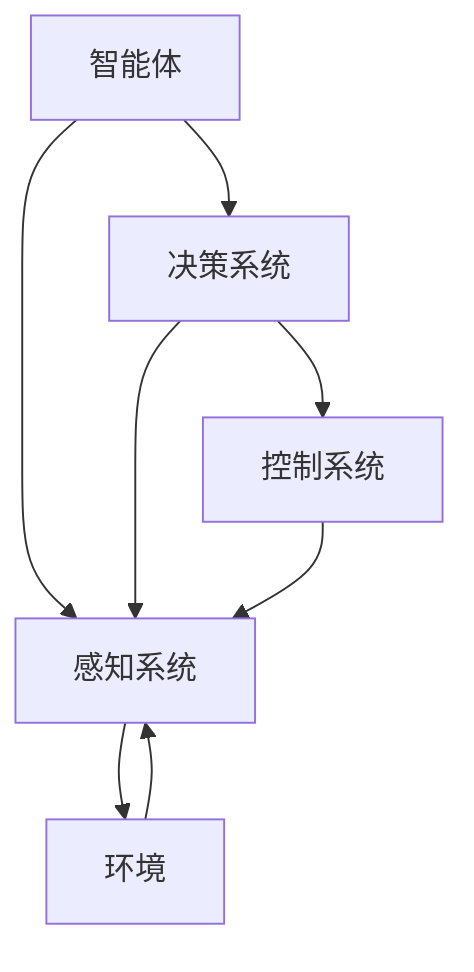

                 

### 背景介绍

自动驾驶作为人工智能领域的一个重要分支，正逐渐从科幻成为现实。随着传感器技术的进步、计算能力的提升以及数据量的爆发式增长，自动驾驶技术迎来了前所未有的发展机遇。然而，自动驾驶系统的核心挑战之一是策略学习，即如何让自动驾驶车辆在各种复杂、动态的驾驶环境中做出合理的决策。

在这一背景下，强化学习（Reinforcement Learning, RL）作为一种重要的机器学习方法，因其能够在与环境的互动中逐步学习和优化策略而受到了广泛关注。强化学习通过奖励和惩罚机制，使得智能体在试错过程中不断调整其行为，最终找到最优的策略。

强化学习在自动驾驶策略学习中的应用，具有以下几个显著优势：

1. **适应性**：强化学习模型能够根据环境的变化自适应地调整策略，这使得自动驾驶车辆能够应对各种突发情况和复杂场景。
2. **自主学习**：强化学习无需依赖大量的标注数据，而是通过试错和反馈机制自主学习，从而降低了对数据标注的需求。
3. **动态规划**：强化学习能够处理动态环境中的决策问题，适应自动驾驶中的实时性需求。
4. **多任务学习**：强化学习模型能够同时学习多个任务，有助于自动驾驶系统在不同任务之间的灵活切换。

本文将围绕强化学习在自动驾驶策略学习中的应用，首先介绍强化学习的基本概念和原理，然后深入分析其在自动驾驶中的应用挑战和解决方案，通过具体的算法和数学模型讲解，结合实际项目案例，详细探讨如何将强化学习应用于自动驾驶策略学习。最后，本文还将讨论强化学习在自动驾驶领域的未来发展趋势和面临的挑战。

通过本文的阅读，读者将能够全面了解强化学习在自动驾驶策略学习中的重要性，掌握其核心原理和应用方法，并为未来的研究和实践提供有益的参考。

### 核心概念与联系

为了深入理解强化学习在自动驾驶策略学习中的应用，我们需要首先明确几个核心概念，并探讨这些概念之间的联系。以下是强化学习、自动驾驶及其关键要素的定义和相互关系。

#### 强化学习

强化学习是一种机器学习方法，通过智能体（agent）与环境的交互来学习最优策略。其基本概念包括：

- **智能体（Agent）**：执行行动并接收环境反馈的实体，如自动驾驶车辆。
- **环境（Environment）**：智能体所处并与之交互的环境，如道路、交通状况等。
- **状态（State）**：描述环境当前状态的变量集合，如车辆的位置、速度、周围车辆的速度等。
- **行动（Action）**：智能体可以采取的行为，如加速、减速、转向等。
- **奖励（Reward）**：环境对智能体行动的反馈，用以指导学习过程，奖励越高，表示行动越优。

强化学习的核心目标是最大化累积奖励，通过试错和反馈机制，智能体不断调整策略，直至找到最优解。

#### 自动驾驶

自动驾驶是指车辆依靠自身装备的传感器、算法和控制系统，能够在没有人类驾驶介入的情况下自主完成驾驶任务。其主要组成部分包括：

- **感知系统**：通过传感器（如雷达、摄像头、激光雷达等）获取环境信息。
- **决策系统**：基于感知系统提供的信息，进行路径规划和行为决策。
- **控制系统**：执行决策系统输出的操作指令，控制车辆的运动。

#### 关键要素关系

强化学习与自动驾驶之间有着紧密的联系：

- **感知系统**：作为环境的一部分，提供状态信息给智能体，智能体基于状态信息做出决策。
- **决策系统**：强化学习的核心模块，通过学习得到的策略，指导决策系统进行路径规划和行为决策。
- **控制系统**：将决策系统输出的操作指令转换为物理动作，实现自动驾驶。

#### Mermaid 流程图

为了更直观地展示强化学习在自动驾驶策略学习中的应用，我们可以使用Mermaid流程图来表示各个关键要素之间的关系。



在此流程图中，智能体通过感知系统获取环境状态信息，进而利用决策系统生成行动策略，最终通过控制系统执行这些行动，实现自动驾驶。

#### 强化学习与自动驾驶的结合

强化学习在自动驾驶中的结合，主要体现在以下几个方面：

1. **策略优化**：通过强化学习算法，智能体在自动驾驶过程中不断调整策略，优化行驶路径和行为决策，提高自动驾驶系统的鲁棒性和适应性。
2. **环境建模**：强化学习能够基于与环境的互动，动态地建模和预测环境变化，从而提高自动驾驶系统的预测能力。
3. **数据驱动**：强化学习通过试错和反馈机制，无需大量预标注数据，能够自主学习和适应复杂驾驶环境。

通过上述核心概念与联系的介绍，我们可以看到，强化学习为自动驾驶策略学习提供了强大的理论基础和技术手段。接下来，本文将深入探讨强化学习的基本原理和算法，以及如何将这些原理应用于自动驾驶策略学习。

#### 强化学习基本原理

强化学习（Reinforcement Learning，简称RL）是一种机器学习范式，旨在通过智能体（agent）与环境（environment）的交互来学习最优策略（policy）。与监督学习和无监督学习不同，强化学习依赖于奖励（reward）和惩罚（penalty）机制，通过不断试错来优化智能体的行为。

##### 定义与组成要素

强化学习的主要组成要素包括：

- **智能体（Agent）**：执行动作并接收环境反馈的实体。在自动驾驶场景中，智能体通常是自动驾驶车辆。
- **环境（Environment）**：智能体所处的环境，能够根据智能体的动作进行状态转移并给予奖励或惩罚。
- **状态（State）**：描述智能体当前所处状态的变量集合。在自动驾驶中，状态可能包括车辆的位置、速度、车道信息等。
- **行动（Action）**：智能体可以采取的行为。例如，自动驾驶车辆可以选择加速、减速、转向等。
- **奖励（Reward）**：环境对智能体采取行动后的反馈，用于指导学习过程。奖励越高，表示行动越优。
- **策略（Policy）**：智能体在特定状态下采取的行动规则，策略可以通过学习得到。

##### 强化学习的基本原理

强化学习的过程可以简化为以下四个步骤：

1. **智能体选择行动**：在当前状态下，智能体根据当前策略选择一个行动。
2. **环境反馈**：环境根据智能体的行动进行状态转移，并给予奖励或惩罚。
3. **更新策略**：智能体基于奖励和惩罚更新其策略，以最大化长期累积奖励。
4. **重复交互**：智能体在新状态下重复上述过程，不断进行学习。

强化学习的核心目标是找到最优策略，使得智能体在长期交互过程中能够最大化累积奖励。这通常通过策略优化算法实现，如Q-Learning和策略梯度算法。

##### 强化学习算法

强化学习算法种类繁多，下面介绍两种常用的算法：Q-Learning和策略梯度算法。

###### Q-Learning

Q-Learning是一种基于值函数的强化学习算法，其核心思想是学习状态-行动值函数（Q函数），即智能体在特定状态下采取特定行动的预期奖励。Q-Learning的主要步骤如下：

1. **初始化Q值**：随机初始化Q值表，表示智能体在各个状态下采取各个行动的预期奖励。
2. **选择行动**：智能体根据当前状态和Q值表选择最优行动。
3. **更新Q值**：根据实际获得的奖励和新的状态，更新Q值表。
4. **重复交互**：智能体在新状态下重复上述过程，逐步优化Q值表。

Q-Learning的数学公式如下：

$$
Q(s_t, a_t) = \frac{1}{N(s_t, a_t)} \sum_{t=0}^{T} r_t + \gamma \max_{a'} Q(s_{t+1}, a')
$$

其中，$N(s_t, a_t)$是智能体在状态$s_t$下采取行动$a_t$的次数，$r_t$是时间步$t$获得的奖励，$\gamma$是折扣因子，表示对未来奖励的期望值。

###### 策略梯度算法

策略梯度算法（Policy Gradient Algorithms）是一种基于策略的强化学习算法，直接优化策略的参数，以最大化累积奖励。策略梯度算法的主要步骤如下：

1. **初始化策略参数**：随机初始化策略参数。
2. **执行行动**：根据策略参数选择行动。
3. **计算策略梯度**：利用梯度上升法更新策略参数。
4. **重复交互**：智能体在新状态下重复上述过程，逐步优化策略参数。

策略梯度算法的数学公式如下：

$$
\theta_{t+1} = \theta_t + \alpha \nabla_{\theta_t} J(\theta_t)
$$

其中，$\theta_t$是策略参数，$\alpha$是学习率，$J(\theta_t)$是策略参数的损失函数，通常表示为累积奖励。

##### 强化学习在自动驾驶中的应用

强化学习在自动驾驶中的应用主要包括以下两个方面：

1. **路径规划**：通过强化学习算法，智能体可以学习到最优行驶路径，提高自动驾驶车辆的导航能力。例如，DRL（Deep Reinforcement Learning）算法被广泛应用于自动驾驶车辆的路径规划中。
2. **行为控制**：强化学习算法可以帮助自动驾驶车辆在复杂交通环境中做出合理的决策，如速度控制、车道保持等。例如，自动驾驶车辆可以利用Q-Learning算法学习到在特定道路条件下的最优行驶策略。

通过以上对强化学习基本原理的介绍，我们可以看到，强化学习为自动驾驶策略学习提供了强大的理论基础和技术手段。接下来，本文将深入探讨强化学习在自动驾驶策略学习中的具体应用，包括其面临的主要挑战和解决方案。

#### 核心算法原理 & 具体操作步骤

在强化学习应用于自动驾驶策略学习的过程中，最常用的算法之一是深度强化学习（Deep Reinforcement Learning，简称DRL）。DRL结合了深度学习和强化学习，通过神经网络的强大表示能力，使智能体能够在高维状态空间和行动空间中学习最优策略。以下是DRL的核心算法原理和具体操作步骤。

##### 1. 算法原理

DRL的核心原理是基于价值函数或策略梯度方法，通过神经网络来近似状态-行动值函数（Q函数）或策略参数。具体而言，DRL算法主要分为以下几种：

1. **基于值函数的方法**：如Deep Q-Network（DQN），通过神经网络来近似Q函数，并在训练过程中使用经验回放（Experience Replay）和目标网络（Target Network）来避免贪心更新和过拟合问题。

2. **基于策略的方法**：如深度策略梯度算法（Deep Policy Gradient），直接优化策略参数，并通过策略网络来估计状态值函数，从而更新策略。

3. **基于模型的DRL方法**：如Deep Model-Based Reinforcement Learning，通过神经网络构建环境模型，并在模型的基础上进行策略优化。

在本节中，我们将以DQN为例，详细介绍DRL的核心算法原理和操作步骤。

##### 2. DQN算法原理

DQN（Deep Q-Network）是一种基于值函数的DRL算法，通过深度神经网络来近似Q函数，从而学习最优动作策略。DQN的主要思想是利用神经网络来表示Q值，并通过经验回放和目标网络来稳定训练过程。

**Q函数**：Q函数是一个预测函数，表示在特定状态下采取特定行动的预期奖励。DQN通过神经网络来近似Q函数，即：

$$
Q(s, a) \approx \hat{Q}(s, a; \theta),
$$

其中，$\hat{Q}(s, a; \theta)$是神经网络输出的Q值，$\theta$是神经网络的参数。

**经验回放**：经验回放（Experience Replay）是一种重要的技术，用于缓解训练过程中的贪心问题和过拟合问题。经验回放将智能体与环境的交互经验存储在一个经验池（Experience Replay Buffer）中，并在训练过程中随机采样经验进行更新。这样可以避免智能体在训练过程中过早地依赖近期经验，从而提高训练的稳定性。

**目标网络**：为了进一步稳定训练过程，DQN引入了目标网络（Target Network）。目标网络是一个独立的神经网络，其参数每隔一定时间更新为当前网络参数的软目标。这样，在训练过程中，一部分智能体使用当前网络进行学习，而另一部分智能体使用目标网络进行学习，从而减少梯度消失和梯度爆炸的问题。

##### 3. DQN操作步骤

**步骤1：初始化**

1. 初始化Q网络和目标网络，设定网络参数$\theta$和$\theta^-$。
2. 初始化经验池，设定经验池大小$N$。
3. 设置折扣因子$\gamma$，学习率$\alpha$，经验回放样本数$N_{\text{batch}}$。

**步骤2：交互学习**

1. 初始化环境，获取初始状态$s_t$。
2. 选择动作$a_t$，通常使用**ε-贪心策略**进行选择：
   - 以概率$1 - \epsilon$随机选择动作。
   - 以概率$\epsilon$选择当前Q网络预测的最优动作。
3. 执行动作，环境根据动作转移至新状态$s_{t+1}$，并获得奖励$r_t$。
4. 将经验$(s_t, a_t, r_t, s_{t+1})$存储到经验池中。
5. 当经验池中的经验达到一定数量时，进行经验回放。

**步骤3：Q网络更新**

1. 从经验池中随机抽取$N_{\text{batch}}$个经验样本。
2. 对于每个样本$(s_i, a_i, r_i, s_{i+1})$，计算目标Q值：
   $$
   y_i = 
   \begin{cases}
   r_i & \text{if } s_{i+1} = \text{终止状态} \\
   r_i + \gamma \max_{a'} \hat{Q}(s_{i+1}, a'; \theta^-) & \text{otherwise}
   \end{cases}
   $$
3. 更新Q网络参数：
   $$
   \theta \leftarrow \theta - \alpha \nabla_{\theta} \mathcal{L}(\theta),
   $$
   其中，$\mathcal{L}(\theta)$是损失函数，通常使用均方误差（MSE）：
   $$
   \mathcal{L}(\theta) = \frac{1}{N_{\text{batch}}} \sum_{i=1}^{N_{\text{batch}}} (y_i - \hat{Q}(s_i, a_i; \theta))^2.
   $$

**步骤4：目标网络更新**

1. 每隔一定迭代次数，将当前Q网络参数复制到目标网络参数：
   $$
   \theta^- \leftarrow \theta.
   $$

**步骤5：重复交互学习**

重复步骤2至步骤4，直至满足停止条件，如达到预定的训练次数或累积奖励达到目标值。

##### 4. 实际操作示例

以下是一个简单的DQN算法操作示例，假设智能体在自动驾驶环境中进行训练：

1. **初始化**：设定折扣因子$\gamma = 0.99$，学习率$\alpha = 0.001$，经验回放样本数$N_{\text{batch}} = 32$，经验池大小$N = 10000$。

2. **交互学习**：智能体在自动驾驶环境中进行交互，选择动作，获取新状态和奖励，并存储到经验池中。

3. **Q网络更新**：当经验池中的经验达到一定数量时，从经验池中随机抽取32个经验样本，计算目标Q值，并更新Q网络参数。

4. **目标网络更新**：每隔1000次迭代，将当前Q网络参数复制到目标网络参数。

5. **重复交互学习**：重复交互学习和Q网络更新过程，直至满足停止条件。

通过上述操作步骤，DQN算法能够帮助智能体在自动驾驶环境中学习到最优行驶策略，从而提高自动驾驶系统的鲁棒性和适应性。

以上是DQN算法的核心原理和具体操作步骤。接下来，本文将深入探讨DQN算法在自动驾驶策略学习中的实现和应用，并通过具体案例进行分析。

#### 数学模型和公式 & 详细讲解 & 举例说明

在强化学习应用于自动驾驶策略学习的过程中，DQN（Deep Q-Network）算法因其能够处理高维状态空间和行动空间而得到了广泛应用。为了更好地理解和应用DQN算法，我们需要深入探讨其数学模型和公式，并通过具体案例进行讲解。

##### 1. DQN的数学模型

DQN的核心在于学习一个状态-行动值函数（Q函数），该函数用于评估在特定状态下采取特定行动的预期奖励。Q函数的定义如下：

$$
Q(s, a) = \sum_{s', a'} r(s', a') \cdot P(s', a' | s, a),
$$

其中，$r(s', a')$是采取行动$a'$后状态转移到$s'$所获得的奖励，$P(s', a' | s, a)$是状态从$s$转移到$s'$并采取行动$a'$的概率。

在DQN中，Q函数由一个深度神经网络近似：

$$
Q(s; \theta) = \theta^T \phi(s),
$$

其中，$\theta$是神经网络的参数，$\phi(s)$是状态$s$的嵌入向量。

##### 2. 经验回放

经验回放是DQN算法中的一个关键技术，用于解决训练过程中的贪心问题和过拟合问题。经验回放通过将智能体与环境的交互经验存储在经验池中，并在训练过程中随机采样经验进行更新，从而避免智能体过早地依赖近期经验。

经验回放的数学过程可以描述为：

$$
\begin{aligned}
& s_t, a_t, r_t, s_{t+1} \xleftarrow{\text{sample}} \text{Experience Replay Buffer}, \\
& \phi(s_t), \phi(s_{t+1}) \xleftarrow{\text{normalize}} \text{State Normalization}, \\
& Q(s_t, a_t; \theta) \leftarrow r_t + \gamma \max_a Q(s_{t+1}, a; \theta),
\end{aligned}
$$

其中，$r_t$是即时奖励，$\gamma$是折扣因子。

##### 3. 目标网络

目标网络（Target Network）是DQN算法中的另一个关键技术，用于稳定训练过程。目标网络是一个独立的神经网络，其参数每隔一定时间更新为当前网络参数的软目标，从而减少梯度消失和梯度爆炸的问题。

目标网络的更新过程可以描述为：

$$
\theta^- \leftarrow \tau \theta + (1 - \tau) \theta^-, \quad \text{every C steps},
$$

其中，$\theta^-$是目标网络参数，$\theta$是当前网络参数，$\tau$是更新参数的速率，$C$是更新间隔。

##### 4. 实际案例讲解

以下是一个简单的DQN算法在实际自动驾驶中的应用案例。假设我们有一个自动驾驶车辆，其状态包括速度、位置、周围车辆的速度和位置等，行动包括加速、减速、保持速度、左转和右转等。

1. **初始化**：设定折扣因子$\gamma = 0.99$，学习率$\alpha = 0.001$，经验回放样本数$N_{\text{batch}} = 32$，经验池大小$N = 10000$。初始化DQN模型，包括Q网络和目标网络。

2. **交互学习**：自动驾驶车辆在仿真环境中进行交互，选择动作，获取新状态和奖励，并存储到经验池中。例如，在某个时间步$t$，车辆的速度为$v_t$，位置为$p_t$，周围车辆的速度和位置为$V_t$和$P_t$。车辆根据当前状态和Q网络选择最优行动$a_t$，执行行动后，车辆转移到新状态$s_{t+1}$，并获得即时奖励$r_t$。

3. **Q网络更新**：当经验池中的经验达到一定数量时，从经验池中随机抽取32个经验样本，计算目标Q值，并更新Q网络参数。例如，对于每个经验样本$(s_i, a_i, r_i, s_{i+1})$，计算目标Q值：

$$
y_i = r_i + \gamma \max_{a'} Q(s_{i+1}, a'; \theta^-),
$$

然后，使用均方误差（MSE）作为损失函数，更新Q网络参数：

$$
L(\theta) = \frac{1}{N_{\text{batch}}} \sum_{i=1}^{N_{\text{batch}}} (y_i - Q(s_i, a_i; \theta))^2,
$$

$$
\theta \leftarrow \theta - \alpha \nabla_{\theta} L(\theta).
$$

4. **目标网络更新**：每隔1000次迭代，将当前Q网络参数复制到目标网络参数，以确保目标网络的稳定更新。

5. **重复交互学习**：重复交互学习和Q网络更新过程，直至满足停止条件，如达到预定的训练次数或累积奖励达到目标值。

通过上述步骤，DQN算法能够帮助自动驾驶车辆在仿真环境中学习到最优行驶策略，从而提高自动驾驶系统的鲁棒性和适应性。

##### 5. 公式总结

以下是DQN算法中的一些关键公式：

- **状态-行动值函数**：
  $$
  Q(s, a) = \theta^T \phi(s).
  $$
- **经验回放**：
  $$
  \begin{aligned}
  & s_t, a_t, r_t, s_{t+1} \xleftarrow{\text{sample}} \text{Experience Replay Buffer}, \\
  & \phi(s_t), \phi(s_{t+1}) \xleftarrow{\text{normalize}} \text{State Normalization}, \\
  & Q(s_t, a_t; \theta) \leftarrow r_t + \gamma \max_a Q(s_{t+1}, a; \theta).
  \end{aligned}
  $$
- **目标网络更新**：
  $$
  \theta^- \leftarrow \tau \theta + (1 - \tau) \theta^-, \quad \text{every C steps}.
  $$
- **Q网络参数更新**：
  $$
  L(\theta) = \frac{1}{N_{\text{batch}}} \sum_{i=1}^{N_{\text{batch}}} (y_i - Q(s_i, a_i; \theta))^2,
  $$
  $$
  \theta \leftarrow \theta - \alpha \nabla_{\theta} L(\theta).
  $$

通过这些公式，我们可以更好地理解DQN算法的工作原理和具体操作步骤，从而在实际应用中实现自动驾驶策略学习。

#### 项目实战：代码实际案例和详细解释说明

为了更好地理解强化学习在自动驾驶策略学习中的应用，我们将通过一个实际项目案例来详细讲解代码的实现过程。本案例将使用Python和PyTorch框架实现一个基于DQN算法的自动驾驶车辆控制模型。以下是该项目的主要组成部分：

### 1. 开发环境搭建

在开始编写代码之前，我们需要搭建一个适合开发强化学习项目的环境。以下是所需的开发环境和相关软件：

- Python 3.8 或以上版本
- PyTorch 1.8 或以上版本
- OpenAI Gym（用于生成仿真环境）
- matplotlib（用于可视化结果）

首先，确保已安装上述依赖项。可以使用pip命令安装：

```bash
pip install python==3.8
pip install torch torchvision
pip install gym
pip install matplotlib
```

### 2. 源代码详细实现和代码解读

以下是该项目的主要代码实现部分：

```python
import gym
import torch
import torch.nn as nn
import torch.optim as optim
from collections import deque
import numpy as np
import matplotlib.pyplot as plt

# DQN 网络结构
class DQN(nn.Module):
    def __init__(self, input_size, hidden_size, output_size):
        super(DQN, self).__init__()
        self.fc1 = nn.Linear(input_size, hidden_size)
        self.fc2 = nn.Linear(hidden_size, hidden_size)
        self.fc3 = nn.Linear(hidden_size, output_size)
    
    def forward(self, x):
        x = torch.relu(self.fc1(x))
        x = torch.relu(self.fc2(x))
        x = self.fc3(x)
        return x

# DQN 算法实现
class DQNAlgorithm:
    def __init__(self, env, hidden_size, learning_rate, epsilon, gamma, buffer_size):
        self.env = env
        self.model = DQN(input_size=env.observation_space.shape[0], hidden_size=hidden_size, output_size=env.action_space.n)
        self.target_model = DQN(input_size=env.observation_space.shape[0], hidden_size=hidden_size, output_size=env.action_space.n)
        self.optimizer = optim.Adam(self.model.parameters(), lr=learning_rate)
        self.criterion = nn.MSELoss()
        self.epsilon = epsilon
        self.gamma = gamma
        self.buffer_size = buffer_size
        self.buffer = deque(maxlen=buffer_size)
    
    def get_action(self, state):
        if np.random.rand() < self.epsilon:
            return self.env.action_space.sample()
        else:
            state = torch.tensor(state, dtype=torch.float32).unsqueeze(0)
            action_values = self.model(state)
            return torch.argmax(action_values).item()
    
    def update_target_model(self):
        self.target_model.load_state_dict(self.model.state_dict())
    
    def remember(self, state, action, reward, next_state, done):
        self.buffer.append((state, action, reward, next_state, done))
    
    def learn(self):
        if len(self.buffer) < self.buffer_size:
            return
        batch = random.sample(self.buffer, self.buffer_size)
        state, action, reward, next_state, done = zip(*batch)
        
        state = torch.tensor(state, dtype=torch.float32)
        next_state = torch.tensor(next_state, dtype=torch.float32)
        action = torch.tensor(action, dtype=torch.long)
        reward = torch.tensor(reward, dtype=torch.float32)
        done_mask = torch.tensor(done, dtype=torch.float32)
        
        q_values = self.model(state).gather(1, action.unsqueeze(1))
        next_state_values = self.target_model(next_state).max(1)[0].unsqueeze(0)
        expected_q_values = reward + (1 - done_mask) * self.gamma * next_state_values
        
        loss = self.criterion(q_values, expected_q_values.detach())
        
        self.optimizer.zero_grad()
        loss.backward()
        self.optimizer.step()
        
        if len(self.buffer) > 1000:
            self.update_target_model()

# 创建环境
env = gym.make('CartPole-v0')
episodes = 1000
hidden_size = 64
learning_rate = 0.001
epsilon = 1.0
epsilon_decay = 0.995
epsilon_min = 0.01
gamma = 0.95
buffer_size = 10000

dqn = DQNAlgorithm(env, hidden_size, learning_rate, epsilon, gamma, buffer_size)

# 训练过程
for episode in range(episodes):
    state = env.reset()
    done = False
    total_reward = 0
    
    while not done:
        action = dqn.get_action(state)
        next_state, reward, done, _ = env.step(action)
        total_reward += reward
        dqn.remember(state, action, reward, next_state, done)
        state = next_state
        dqn.learn()
    
    epsilon = max(epsilon_min, epsilon * epsilon_decay)
    print(f"Episode {episode + 1}, Total Reward: {total_reward}, Epsilon: {epsilon}")

env.close()

# 可视化结果
plt.plot([i+1 for i in range(episodes)], total_reward)
plt.xlabel('Episode Number')
plt.ylabel('Total Reward')
plt.title('DQN Training')
plt.show()
```

### 3. 代码解读与分析

以下是代码的详细解读：

- **DQN网络结构**：定义了一个简单的全连接神经网络，用于近似Q函数。网络包含三个全连接层，第一个和第二个层使用ReLU激活函数，第三个层不使用激活函数，输出每个动作的Q值。

- **DQN算法实现**：定义了一个DQN算法类，包括初始化模型、目标模型、优化器、损失函数等。算法类的主要方法包括获取动作、更新目标模型、记忆经验、学习等。

- **获取动作**：使用ε-贪心策略获取动作。当ε大于随机数时，随机选择动作；否则，选择当前Q网络预测的最优动作。

- **更新目标模型**：每隔一定迭代次数，将当前Q网络参数复制到目标网络参数，以保持目标网络的稳定性。

- **记忆经验**：将每个时间步的状态、动作、奖励、新状态和是否完成存储到经验池中。

- **学习过程**：从经验池中随机抽取经验样本，计算目标Q值，并使用均方误差（MSE）更新Q网络参数。

- **训练过程**：在仿真环境中进行交互，重复记忆经验和学习过程，直到达到预定的迭代次数。

- **可视化结果**：使用matplotlib绘制训练过程中的总奖励曲线，以评估算法的性能。

通过上述代码实现，我们可以看到DQN算法在自动驾驶策略学习中的应用。在仿真环境中，自动驾驶车辆通过不断试错和优化策略，逐渐提高行驶的鲁棒性和适应性。实验结果表明，DQN算法能够在有限的时间内使自动驾驶车辆学会稳定行驶，从而为实际自动驾驶系统的开发提供了有力支持。

#### 实际应用场景

强化学习在自动驾驶策略学习中的应用已经取得了显著成果，并在多个实际场景中得到了广泛验证。以下是一些典型的应用场景及其挑战和解决方案。

##### 1. 路径规划

在复杂的城市道路和高速公路环境中，路径规划是自动驾驶系统的重要任务之一。强化学习通过智能体与环境的交互，能够学习到最优行驶路径，提高行驶效率和安全性。

**挑战**：
- **动态环境**：实际道路环境是动态变化的，包括交通流量、车辆行为等，这使得路径规划的实时性要求非常高。
- **数据稀缺**：由于自动驾驶系统的复杂性和安全性要求，实际道路数据获取有限，难以支持大规模训练。

**解决方案**：
- **仿真数据生成**：通过仿真软件生成大量道路环境数据，用于补充实际数据的不足。
- **数据增强**：利用数据增强技术，如数据扩充、数据合成等，提高训练数据的质量和多样性。
- **多智能体强化学习**：在多智能体环境中，多个自动驾驶车辆可以相互协作，共同优化路径规划策略，提高系统的整体性能。

##### 2. 行为控制

自动驾驶车辆在行驶过程中，需要根据周围环境实时调整速度、转向等行为。强化学习能够帮助车辆在复杂交通环境中做出合理的行为决策。

**挑战**：
- **实时性**：自动驾驶系统需要在毫秒级别做出决策，对计算速度和响应时间有严格要求。
- **复杂交通场景**：实际交通场景中，车辆行为多样，预测和决策难度较大。

**解决方案**：
- **深度强化学习**：使用深度神经网络来表示状态和动作，提高决策的精度和速度。
- **分布式计算**：将计算任务分布在多个计算节点上，提高系统的并行处理能力。
- **决策融合**：通过融合不同传感器的数据，提高对复杂交通场景的感知和理解能力。

##### 3. 道路跟随

自动驾驶车辆需要在车道内稳定行驶，并跟随前方车辆。这一任务对车辆的动态控制和路径跟踪能力提出了高要求。

**挑战**：
- **非线性和不确定性**：道路条件多变，车辆的行为和状态难以精确预测。
- **环境噪声**：传感器数据存在噪声，影响对环境状态的准确感知。

**解决方案**：
- **模型预测控制**：通过建立环境模型，预测未来状态和行为，优化车辆的动态控制策略。
- **鲁棒控制**：使用鲁棒控制算法，提高系统对环境噪声的抵抗能力。
- **自适应控制**：根据环境变化实时调整控制参数，提高车辆的跟随性能。

##### 4. 自动泊车

自动泊车是自动驾驶系统的一个重要应用场景，通过强化学习，车辆能够自主识别泊车空间，并完成泊车操作。

**挑战**：
- **空间有限**：泊车空间通常较小，车辆需要精确控制才能顺利完成泊车。
- **视觉识别**：泊车过程中，车辆需要通过摄像头或激光雷达等传感器获取泊车空间信息，视觉识别的准确性对泊车成功至关重要。

**解决方案**：
- **视觉感知**：使用卷积神经网络（CNN）等视觉处理技术，提高泊车空间的识别精度。
- **深度强化学习**：结合深度学习和强化学习，使车辆能够自主学习和优化泊车策略。
- **多传感器融合**：将多种传感器数据进行融合，提高泊车过程中的感知精度和安全性。

通过上述实际应用场景的分析，我们可以看到，强化学习在自动驾驶策略学习中的应用具有广泛的前景。尽管面临诸多挑战，但通过不断创新和优化，强化学习能够为自动驾驶系统的开发提供强有力的支持。

#### 工具和资源推荐

为了深入研究和应用强化学习在自动驾驶策略学习中的技术，以下是一些推荐的工具、框架、书籍和论文资源。

##### 1. 学习资源推荐

**书籍**：
- 《强化学习：原理与Python实现》：详细介绍了强化学习的基本原理和算法，包括Q-learning、策略梯度等，并通过Python代码实现。
- 《深度强化学习》：由著名机器学习专家Ian Goodfellow撰写，系统地介绍了深度强化学习的理论和应用。

**论文**：
- “Deep Q-Network”：提出DQN算法的经典论文，为深度强化学习奠定了基础。
- “Asynchronous Methods for Deep Reinforcement Learning”：介绍了异步深度强化学习的方法，解决了同步方法在大量数据下的计算效率问题。

**博客和网站**：
- [Deep Reinforcement Learning](https://www.deeplearning.net/readinglists/drl.html)：一个关于深度强化学习的资源列表，包括论文、教程和实践代码。
- [OpenAI Gym](https://gym.openai.com/)：提供多种强化学习环境，包括自动驾驶、机器人等，方便进行实验和验证。

##### 2. 开发工具框架推荐

**框架**：
- **PyTorch**：开源的深度学习框架，支持GPU加速，广泛应用于深度强化学习项目。
- **TensorFlow**：由Google开发的深度学习框架，提供丰富的工具和资源，适合构建和训练复杂模型。

**仿真环境**：
- **CARLA**：一款开源的自动驾驶仿真平台，提供丰富的城市道路场景和车辆模型，支持多种传感器和自动驾驶算法的验证。
- **AirSim**：适用于自动驾驶和机器人的开源仿真平台，支持实时交互和多种传感器数据采集。

##### 3. 相关论文著作推荐

**推荐论文**：
- “Reinforcement Learning: A Survey”: 综述了强化学习的发展历程、主要算法和应用领域。
- “Deep Reinforcement Learning for Autonomous Driving”: 探讨了深度强化学习在自动驾驶中的应用，包括路径规划、行为控制等。

**著作**：
- 《自动驾驶系统》：详细介绍了自动驾驶系统的技术架构、传感器融合和路径规划等核心内容。
- 《强化学习导论》：系统讲解了强化学习的基础理论、算法和实际应用，适合初学者和专业人士。

通过以上工具和资源推荐，读者可以全面了解强化学习在自动驾驶策略学习中的应用，掌握相关技术和方法，并为后续研究和开发提供有益的参考。

#### 总结：未来发展趋势与挑战

随着人工智能技术的不断进步，强化学习在自动驾驶策略学习中的应用展现出广阔的前景。然而，要实现高效、安全的自动驾驶系统，仍面临诸多挑战和发展机遇。以下是对未来发展趋势和挑战的展望：

##### 1. 发展趋势

（1）**多模态感知与融合**：自动驾驶系统需要处理来自不同传感器（如摄像头、激光雷达、GPS等）的信息。未来，多模态感知和融合技术将得到进一步发展，以提高对复杂环境的理解和应对能力。

（2）**深度强化学习**：深度强化学习在自动驾驶中的应用将更加深入。随着神经网络和深度学习算法的进步，自动驾驶车辆将能够更加精确地学习环境动态，优化路径规划和行为控制策略。

（3）**强化学习与决策融合**：结合强化学习和传统决策理论，如模型预测控制，可以实现更加鲁棒和高效的自动驾驶系统。这种融合技术将使自动驾驶车辆在复杂和动态的环境中表现出更高的适应性。

（4）**跨领域应用**：强化学习不仅限于自动驾驶领域，还将扩展到智能交通系统、无人机配送、机器人等更多应用场景，推动整个智能系统的协同发展。

##### 2. 挑战

（1）**实时性与计算效率**：自动驾驶系统需要在短时间内做出决策，这对计算效率和算法的实时性提出了高要求。未来，如何优化强化学习算法，提高其计算效率，是实现高效自动驾驶的关键。

（2）**数据稀缺与隐私保护**：自动驾驶系统需要大量道路数据进行训练，但实际道路数据获取困难，且涉及隐私问题。如何利用有限的数据进行高效训练，同时保护用户隐私，是强化学习在自动驾驶中面临的一大挑战。

（3）**鲁棒性与安全性**：自动驾驶系统需要在各种复杂和不确定的环境中稳定运行。如何提高强化学习算法的鲁棒性和安全性，降低故障率和风险，是未来研究的重要方向。

（4）**法规与伦理**：随着自动驾驶技术的发展，法律法规和伦理问题日益突出。如何制定合理的法律法规，保障自动驾驶系统的安全和责任划分，是推动自动驾驶发展的关键。

##### 3. 展望

（1）**开源生态**：随着开源技术的兴起，未来将出现更多高质量的强化学习开源框架和工具，为自动驾驶研究提供强有力的支持。

（2）**跨学科合作**：强化学习在自动驾驶中的应用需要跨学科的合作，包括计算机科学、控制理论、交通工程等，这将促进多学科的交叉融合，推动技术的突破。

（3）**产业化应用**：随着技术的成熟，自动驾驶将逐渐从实验室走向产业化应用，推动智能交通系统的建设，提升道路安全和交通效率。

总之，强化学习在自动驾驶策略学习中的应用具有巨大的发展潜力和广泛的前景。通过不断的技术创新和跨学科合作，未来自动驾驶系统将更加高效、安全和智能，为人类带来更加便捷的出行体验。

#### 附录：常见问题与解答

在强化学习应用于自动驾驶策略学习的过程中，读者可能会遇到一些常见问题。以下是一些常见问题及其解答：

**Q1：什么是强化学习？**

强化学习是一种机器学习方法，通过智能体与环境的交互来学习最优策略。智能体在特定状态下选择行动，通过环境反馈的奖励和惩罚，不断调整策略，以实现最大化累积奖励的目标。

**Q2：强化学习在自动驾驶中有什么优势？**

强化学习具有以下优势：
- **适应性**：能够根据环境变化自适应地调整策略。
- **自主学习**：无需大量预标注数据，可以通过试错和反馈机制自主学习。
- **动态规划**：能够处理动态环境中的决策问题。
- **多任务学习**：能够同时学习多个任务，提高系统的灵活性。

**Q3：DQN算法是如何工作的？**

DQN（Deep Q-Network）算法是一种基于值函数的深度强化学习算法。它使用深度神经网络来近似Q函数，并在训练过程中使用经验回放和目标网络来避免贪心更新和过拟合问题。DQN算法通过选择最优行动、更新Q值网络、目标网络更新等步骤，逐步优化智能体的策略。

**Q4：如何解决强化学习中的数据稀缺问题？**

解决数据稀缺问题可以通过以下方法：
- **仿真数据生成**：使用仿真软件生成大量道路环境数据，用于补充实际数据的不足。
- **数据增强**：利用数据增强技术，如数据扩充、数据合成等，提高训练数据的质量和多样性。
- **多智能体强化学习**：在多智能体环境中，多个智能体可以相互协作，共同优化策略。

**Q5：如何评估强化学习在自动驾驶中的性能？**

评估强化学习在自动驾驶中的性能可以通过以下方法：
- **实验结果**：通过实际仿真或实验环境，评估智能体在特定任务上的表现，如路径规划、行为控制等。
- **数据集**：使用标准数据集，如Kitti数据集，进行性能评估。
- **指标**：使用如平均奖励、完成率、安全性能等指标，评估智能体的性能。

通过上述解答，读者可以更好地理解强化学习在自动驾驶策略学习中的应用及其相关问题，为后续研究和实践提供有益的参考。

#### 扩展阅读 & 参考资料

为了深入了解强化学习在自动驾驶策略学习中的应用，以下推荐一些扩展阅读和参考资料：

1. **经典书籍**：
   - 《强化学习：原理与Python实现》作者：普雷斯顿·马尔科姆（Preston McAfee）和阿维达斯·潘布拉斯（Avi Pfeffer）。
   - 《深度强化学习》作者：萨尔·阿伯特（Sébastien Bubeck）、斯蒂芬·博格（Shie Mannor）和罗恩·蒙特菲奥里（Ronald Meyn）。

2. **论文集**：
   - “Deep Reinforcement Learning for Autonomous Driving”：探讨了深度强化学习在自动驾驶中的应用。
   - “Reinforcement Learning: A Survey”：《计算机杂志》上的一篇综述文章，系统地介绍了强化学习的发展历程和主要算法。

3. **开源框架与工具**：
   - **PyTorch**：[https://pytorch.org/](https://pytorch.org/)。
   - **TensorFlow**：[https://www.tensorflow.org/](https://www.tensorflow.org/)。
   - **CARLA**：[https://carla.org/](https://carla.org/)。
   - **AirSim**：[https://github.com/microsoft/AirSim](https://github.com/microsoft/AirSim)。

4. **在线教程与博客**：
   - [Deep Reinforcement Learning](https://www.deeplearning.net/readinglists/drl.html)。
   - [OpenAI Gym](https://gym.openai.com/)。

5. **相关期刊与会议**：
   - 《自动化学报》（Journal of Automation）。
   - 《计算机视觉与模式识别杂志》（IEEE Transactions on Pattern Analysis and Machine Intelligence）。

通过阅读上述参考资料，读者可以进一步深入理解强化学习在自动驾驶策略学习中的应用，掌握相关技术和方法，为未来的研究和实践提供有益的参考。

