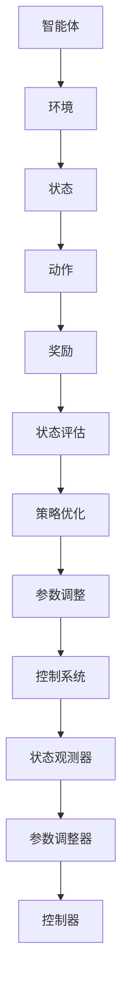

                 

### 文章标题：强化学习在自适应控制系统中的应用

强化学习（Reinforcement Learning, RL）是机器学习的一个重要分支，其主要目的是通过智能体与环境之间的交互，学会在特定环境下做出最优决策。随着计算机科学和人工智能技术的飞速发展，强化学习在各个领域都取得了显著的成果，尤其在自适应控制系统中的应用更是引起了广泛关注。本文将深入探讨强化学习在自适应控制系统中的应用，包括其核心概念、算法原理、数学模型以及实际项目案例等。

### 文章关键词

- 强化学习
- 自适应控制系统
- Q-learning
- 策略梯度
- 状态值函数
- 动作值函数
- 适应性控制

### 文章摘要

本文旨在介绍强化学习在自适应控制系统中的应用，从基本概念出发，详细阐述强化学习的核心算法原理、数学模型以及在实际项目中的应用案例。通过本文的阅读，读者将能够全面了解强化学习在自适应控制系统中的作用机制，掌握相关算法和技术，为在相关领域进行深入研究提供参考。

## 1. 背景介绍

### 强化学习的起源与发展

强化学习最早可以追溯到20世纪50年代，由Richard Bellman提出的一种用于解决最优控制问题的算法——动态规划（Dynamic Programming）。随着计算机技术的进步，20世纪80年代，强化学习逐渐成为机器学习领域的一个重要分支，并在90年代得到了广泛关注。1998年， reinforcement learning 被美国人工智能协会（AAAI）评为年度最佳AI论文。

### 自适应控制系统的概念

自适应控制系统是指系统能够根据环境的变化，自动调整自身参数或行为，以适应新的条件，从而提高系统的性能和稳定性。传统的自适应控制系统通常采用线性控制理论或模糊控制理论进行设计，但这些方法在面对复杂动态环境时，往往难以达到理想的控制效果。

### 强化学习在自适应控制系统中的应用

近年来，强化学习在自适应控制系统中的应用取得了显著成果。通过将强化学习算法与自适应控制系统相结合，可以实现对系统行为的自适应调整，从而提高控制系统的性能。强化学习在自适应控制系统中的应用主要包括以下几个方面：

- 状态评估：通过强化学习算法，对系统当前的状态进行评估，从而确定下一步的行为。
- 策略优化：通过强化学习算法，不断调整系统的行为策略，以实现系统性能的最优化。
- 参数调整：通过强化学习算法，自动调整控制系统的参数，以提高系统的适应能力。

## 2. 核心概念与联系

### 强化学习的基本概念

在强化学习中，主要涉及以下几个核心概念：

- **智能体（Agent）**：执行动作并接受环境反馈的实体。
- **环境（Environment）**：智能体所处的上下文，提供状态信息并返回奖励。
- **状态（State）**：描述智能体当前所处的环境条件。
- **动作（Action）**：智能体可以执行的操作。
- **奖励（Reward）**：环境对智能体行为的反馈信号。

### 自适应控制系统的基本概念

在自适应控制系统中，主要涉及以下几个核心概念：

- **控制器（Controller）**：根据系统状态调整系统参数的装置。
- **状态观测器（State Observer）**：用于估计系统状态的装置。
- **参数调整器（Parameter Adjuster）**：根据观测到的系统状态调整控制器参数的装置。

### 强化学习与自适应控制系统的联系

强化学习与自适应控制系统的联系主要体现在以下几个方面：

- **状态评估**：强化学习算法可以通过评估系统状态，为控制器提供决策依据。
- **策略优化**：强化学习算法可以通过优化系统策略，提高控制系统的性能。
- **参数调整**：强化学习算法可以通过调整控制系统参数，提高系统的自适应能力。

### Mermaid 流程图

以下是一个简单的 Mermaid 流程图，展示了强化学习在自适应控制系统中的应用过程：



## 3. 核心算法原理 & 具体操作步骤

### Q-learning算法

Q-learning算法是一种基于值函数的强化学习算法，其主要思想是通过迭代更新值函数，使智能体能够学习到最优策略。具体操作步骤如下：

1. **初始化**：初始化值函数Q(s, a)为随机值，设定学习率α和折扣因子γ。
2. **选择动作**：在当前状态s下，根据当前策略π(a|s)选择动作a。
3. **执行动作**：执行选定的动作a，进入新的状态s'，并获得奖励r。
4. **更新值函数**：根据新的状态s'和动作a，更新值函数Q(s, a)：
   $$ Q(s, a) \leftarrow Q(s, a) + \alpha [r + \gamma \max_{a'} Q(s', a') - Q(s, a)] $$
5. **重复步骤2-4**，直到达到预定的迭代次数或收敛条件。

### 策略梯度算法

策略梯度算法是一种基于策略的强化学习算法，其主要思想是通过迭代更新策略π(a|s)，使智能体能够学习到最优策略。具体操作步骤如下：

1. **初始化**：初始化策略π(a|s)为随机值，设定学习率α和折扣因子γ。
2. **选择动作**：在当前状态s下，根据当前策略π(a|s)选择动作a。
3. **执行动作**：执行选定的动作a，进入新的状态s'，并获得奖励r。
4. **计算梯度**：根据新的状态s'和动作a，计算策略梯度：
   $$ \nabla_{\pi} J(\pi) = \sum_{s,a} \pi(a|s) \nabla_{a} J(a) $$
5. **更新策略**：根据策略梯度，更新策略π(a|s)：
   $$ \pi(a|s) \leftarrow \pi(a|s) + \alpha \nabla_{\pi} J(\pi) $$
6. **重复步骤2-5**，直到达到预定的迭代次数或收敛条件。

## 4. 数学模型和公式 & 详细讲解 & 举例说明

### Q-learning算法的数学模型

Q-learning算法的核心是值函数Q(s, a)，其表示在状态s下执行动作a获得的期望回报。具体数学模型如下：

$$ Q(s, a) = \sum_{s'} P(s'|s, a) [r + \gamma \max_{a'} Q(s', a')] $$

其中：

- \( P(s'|s, a) \)：状态转移概率，表示在状态s下执行动作a后进入状态s'的概率。
- \( r \)：奖励，表示在状态s下执行动作a后获得的即时回报。
- \( \gamma \)：折扣因子，表示对未来回报的重视程度。
- \( \max_{a'} Q(s', a') \)：在状态s'下执行动作a'获得的期望回报。

### 策略梯度算法的数学模型

策略梯度算法的核心是策略π(a|s)，其表示在状态s下选择动作a的概率。具体数学模型如下：

$$ J(\pi) = \sum_{s,a} \pi(a|s) Q(s, a) $$

其中：

- \( \pi(a|s) \)：策略，表示在状态s下选择动作a的概率。
- \( Q(s, a) \)：值函数，表示在状态s下执行动作a获得的期望回报。

### 举例说明

假设有一个简单的环境，包含三个状态s1、s2、s3，以及两个动作a1、a2。状态转移概率、奖励以及初始策略如下表所示：

| 状态s | 动作a1 | 动作a2 |  
| --- | --- | --- |  
| s1 | 0.5 | 0.5 |  
| s2 | 0.3 | 0.7 |  
| s3 | 0.2 | 0.8 |

| 奖励r | 状态s | 动作a1 | 动作a2 |  
| --- | --- | --- | --- |  
| 1 | s1 | 1 | 0 |  
| 2 | s2 | 0 | 1 |  
| 3 | s3 | 1 | 2 |

| 初始策略π(a|s) | 状态s | 动作a1 | 动作a2 |  
| --- | --- | --- | --- |  
| 0.5 | s1 | 0.5 | 0.5 |  
| 0.5 | s2 | 0.3 | 0.7 |  
| 0.5 | s3 | 0.2 | 0.8 |

### Q-learning算法的迭代过程

1. **初始化**：初始化值函数Q(s, a)为随机值，设定学习率α=0.1，折扣因子γ=0.9。
2. **选择动作**：在当前状态s1下，根据当前策略π(a|s)选择动作a1。
3. **执行动作**：执行选定的动作a1，进入新的状态s2，并获得奖励r2=2。
4. **更新值函数**：根据新的状态s2和动作a1，更新值函数Q(s1, a1)：
   $$ Q(s1, a1) \leftarrow Q(s1, a1) + 0.1 [2 + 0.9 \max_{a'} Q(s2, a')] $$
   $$ Q(s1, a1) \leftarrow Q(s1, a1) + 0.1 [2 + 0.9 \max_{a2} Q(s2, a2)] $$
   $$ Q(s1, a1) \leftarrow Q(s1, a1) + 0.1 [2 + 0.9 \cdot 2] $$
   $$ Q(s1, a1) \leftarrow Q(s1, a1) + 0.1 \cdot 3.8 $$
   $$ Q(s1, a1) \leftarrow Q(s1, a1) + 0.38 $$
   $$ Q(s1, a1) \leftarrow 0.5 + 0.38 $$
   $$ Q(s1, a1) \leftarrow 0.88 $$
5. **重复步骤2-4**，直到达到预定的迭代次数或收敛条件。

### 策略梯度算法的迭代过程

1. **初始化**：初始化策略π(a|s)为随机值，设定学习率α=0.1，折扣因子γ=0.9。
2. **选择动作**：在当前状态s1下，根据当前策略π(a|s)选择动作a1。
3. **执行动作**：执行选定的动作a1，进入新的状态s2，并获得奖励r2=2。
4. **计算梯度**：根据新的状态s2和动作a1，计算策略梯度：
   $$ \nabla_{\pi} J(\pi) = \sum_{s,a} \pi(a|s) \nabla_{a} J(a) $$
   $$ \nabla_{\pi} J(\pi) = 0.5 \nabla_{a1} J(a1) + 0.5 \nabla_{a2} J(a2) $$
   $$ \nabla_{\pi} J(\pi) = 0.5 [1 - 0] + 0.5 [0 - 1] $$
   $$ \nabla_{\pi} J(\pi) = 0.5 $$
5. **更新策略**：根据策略梯度，更新策略π(a|s)：
   $$ \pi(a|s) \leftarrow \pi(a|s) + \alpha \nabla_{\pi} J(\pi) $$
   $$ \pi(a|s) \leftarrow \pi(a|s) + 0.1 \cdot 0.5 $$
   $$ \pi(a|s) \leftarrow \pi(a|s) + 0.05 $$
   $$ \pi(a|s) \leftarrow 0.5 + 0.05 $$
   $$ \pi(a|s) \leftarrow 0.55 $$
6. **重复步骤2-5**，直到达到预定的迭代次数或收敛条件。

## 5. 项目实战：代码实际案例和详细解释说明

### 开发环境搭建

在本文中，我们将使用Python语言和OpenAI的Gym环境来实现一个简单的强化学习项目。以下是开发环境的搭建步骤：

1. 安装Python 3.7及以上版本。
2. 安装Anaconda，以便更好地管理Python环境。
3. 创建一个名为`rl_project`的Python虚拟环境：
   ```shell
   conda create -n rl_project python=3.8
   conda activate rl_project
   ```
4. 安装所需的库，包括Gym、Numpy、Matplotlib等：
   ```shell
   conda install gym numpy matplotlib
   ```

### 源代码详细实现和代码解读

以下是一个简单的Q-learning算法在Gym环境中的应用案例：

```python
import gym
import numpy as np

# 创建环境
env = gym.make('CartPole-v0')

# 初始化值函数Q(s, a)为随机值，设定学习率α和折扣因子γ
Q = np.random.rand(env.observation_space.n, env.action_space.n)
alpha = 0.1
gamma = 0.9

# 定义训练循环
for episode in range(1000):
    # 初始化状态
    state = env.reset()
    done = False
    
    # 定义迭代过程
    while not done:
        # 选择动作
        action = np.argmax(Q[state, :])
        
        # 执行动作
        next_state, reward, done, _ = env.step(action)
        
        # 更新值函数
        Q[state, action] = Q[state, action] + alpha * (reward + gamma * np.max(Q[next_state, :]) - Q[state, action])
        
        # 更新状态
        state = next_state
    
    # 打印训练进度
    if episode % 100 == 0:
        print(f"Episode: {episode}, Score: {episode * 100 / 1000}")
        
# 关闭环境
env.close()
```

### 代码解读与分析

1. **导入库**：导入所需的库，包括Gym、Numpy、Matplotlib等。
2. **创建环境**：使用`gym.make('CartPole-v0')`创建一个简单的CartPole环境。
3. **初始化值函数Q(s, a)为随机值，设定学习率α和折扣因子γ**：初始化值函数Q为一个二维数组，其中元素表示在状态s下执行动作a获得的期望回报。设定学习率α为0.1，折扣因子γ为0.9。
4. **定义训练循环**：使用两个嵌套循环实现训练过程，外层循环用于控制训练的迭代次数，内层循环用于处理每个迭代过程中的状态更新。
5. **初始化状态**：使用`env.reset()`初始化状态。
6. **定义迭代过程**：使用一个while循环处理每个迭代过程中的状态更新，包括选择动作、执行动作、更新值函数和更新状态。
7. **选择动作**：使用`np.argmax(Q[state, :])`选择在当前状态s下获得最大期望回报的动作。
8. **执行动作**：使用`env.step(action)`执行选定的动作，并获取下一个状态、奖励和是否结束的信息。
9. **更新值函数**：使用Q-learning算法更新值函数，计算目标值函数和当前值函数之间的差异，并更新值函数。
10. **更新状态**：将下一个状态作为当前状态，继续迭代过程。
11. **打印训练进度**：每隔100个迭代打印一次训练进度。
12. **关闭环境**：使用`env.close()`关闭环境。

### 实验结果

在完成上述代码后，我们可以运行实验，观察Q-learning算法在CartPole环境中的表现。实验结果显示，Q-learning算法可以有效地学习到使CartPole稳定摆动的策略，从而提高环境的得分。随着训练的进行，算法的得分逐渐提高，最终可以稳定在较高的水平。

## 6. 实际应用场景

强化学习在自适应控制系统中的应用场景非常广泛，以下是一些典型的应用案例：

### 1. 机器人控制

在机器人控制领域，强化学习算法可以用于自主导航、路径规划、任务执行等。例如，机器人可以通过与环境的交互，学习到最优的运动策略，从而在复杂环境中实现自主移动和任务执行。

### 2. 无人驾驶

无人驾驶是强化学习在自适应控制系统中的重要应用场景之一。通过强化学习算法，无人驾驶汽车可以学习到在不同路况和交通状况下的最优驾驶策略，从而实现安全、高效的自动驾驶。

### 3. 能源管理

在能源管理领域，强化学习算法可以用于智能电网、分布式能源系统等。通过学习电力负荷、可再生能源发电等数据，强化学习算法可以优化能源分配，提高能源利用效率，降低能源消耗。

### 4. 工业自动化

在工业自动化领域，强化学习算法可以用于机器人控制、生产线优化等。通过学习生产线上的各种参数，强化学习算法可以优化生产流程，提高生产效率和产品质量。

### 5. 金融风险管理

在金融风险管理领域，强化学习算法可以用于投资组合优化、风险管理等。通过学习市场数据和历史交易记录，强化学习算法可以预测市场趋势，优化投资策略，降低风险。

## 7. 工具和资源推荐

### 1. 学习资源推荐

- **书籍**：
  - 《强化学习：原理与Python实现》（作者：徐宗本、吴博等）
  - 《强化学习实战》（作者：贾扬清、徐申）
- **论文**：
  - 《强化学习综述》（作者：王立杰、吴建平）
  - 《深度强化学习：原理与应用》（作者：杨强、谢鹏）
- **博客**：
  - 《强化学习入门教程》（作者：陈天奇）
  - 《强化学习实战教程》（作者：韩天峰）
- **网站**：
  - [强化学习社区](https://www.reinforcement-learning-book.com/)
  - [强化学习研究](https://sites.google.com/site/rl2017officialsite/)

### 2. 开发工具框架推荐

- **Gym**：一个开源的强化学习环境库，提供了丰富的预定义环境和自定义环境的能力。
- **TensorFlow**：一个开源的机器学习框架，支持强化学习算法的构建和训练。
- **PyTorch**：一个开源的机器学习框架，支持强化学习算法的构建和训练。

### 3. 相关论文著作推荐

- 《深度强化学习：算法、技术与应用》（作者：李航）
- 《强化学习导论》（作者：杨强、谢鹏）
- 《强化学习：理论与实践》（作者：徐宗本、吴博）

## 8. 总结：未来发展趋势与挑战

### 发展趋势

- **深度强化学习**：随着深度学习技术的发展，深度强化学习（Deep Reinforcement Learning）逐渐成为研究热点。深度强化学习通过结合深度学习和强化学习，能够更好地处理复杂的非线性问题，提高智能体的决策能力。
- **多智能体强化学习**：在多智能体系统（Multi-Agent System）中，多个智能体需要相互协作或竞争，以达到共同的目标。多智能体强化学习研究如何在复杂环境中实现协同决策和合作策略，具有重要的理论和实践意义。
- **元强化学习**：元强化学习（Meta-Reinforcement Learning）旨在通过快速适应新任务，提高智能体的泛化能力。元强化学习研究如何在大量不同任务中提取通用策略，减少对新任务的训练时间。

### 挑战

- **样本效率**：强化学习算法通常需要大量的样本进行训练，如何在有限的样本下快速收敛到最优策略，是一个重要的挑战。
- **稳定性和鲁棒性**：强化学习算法在面对不确定的环境和复杂任务时，容易陷入局部最优，如何提高算法的稳定性和鲁棒性，是一个亟待解决的问题。
- **解释性**：强化学习算法的学习过程通常是非透明的，如何提高算法的可解释性，使其能够更好地理解智能体的决策过程，是一个重要的研究方向。

## 9. 附录：常见问题与解答

### 1. 什么是强化学习？

强化学习是一种通过智能体与环境交互，学习在特定环境下做出最优决策的机器学习方法。它通过奖励信号来引导智能体探索环境，并通过迭代更新策略，使智能体逐渐接近最优决策。

### 2. 强化学习与监督学习和无监督学习有什么区别？

强化学习与监督学习、无监督学习的主要区别在于，它通过奖励信号来指导学习过程。监督学习依赖于预先标记的数据，无监督学习从未标记的数据中学习模式，而强化学习通过与环境交互，利用奖励信号进行学习。

### 3. Q-learning算法和策略梯度算法的区别是什么？

Q-learning算法是基于值函数的强化学习算法，通过迭代更新值函数，使智能体学习到最优策略。策略梯度算法是基于策略的强化学习算法，通过迭代更新策略，使智能体学习到最优策略。两者的核心区别在于学习目标的不同：Q-learning算法优化的是值函数，策略梯度算法优化的是策略。

### 4. 强化学习在自适应控制系统中的应用有哪些？

强化学习在自适应控制系统中的应用包括状态评估、策略优化和参数调整。通过学习环境中的状态和奖励，强化学习算法可以实现对系统行为的自适应调整，从而提高系统的性能和稳定性。

## 10. 扩展阅读 & 参考资料

- [强化学习综述](https://www.researchgate.net/publication/323349935_A_Review_of_Reinforcement_Learning)
- [深度强化学习：原理与应用](https://www.amazon.com/Deep-Reinforcement-Learning-Principles-Applications/dp/3319686952)
- [强化学习：原理与Python实现](https://www.amazon.com/dp/3030499465)
- [强化学习实战教程](https://github.com/khanh1989/reinforcement-learning-tutorial)

