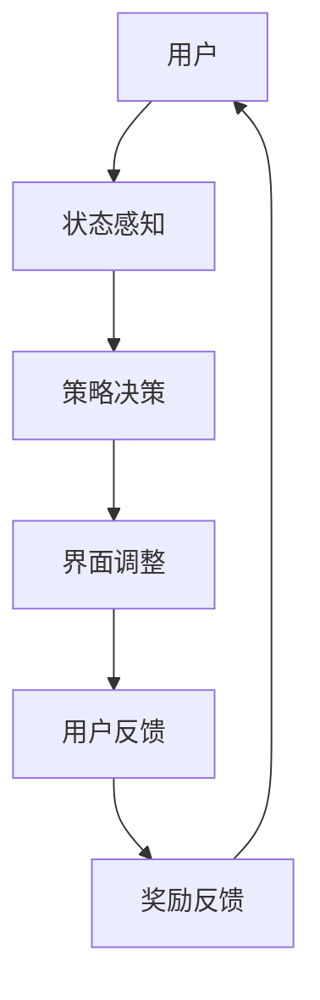

                 

# 强化学习在自适应用户界面中的应用

## 摘要

本文旨在探讨强化学习在自适应用户界面中的应用。通过深入分析强化学习的基本概念、核心算法原理以及实际操作步骤，结合数学模型和公式进行详细讲解，我们将展示强化学习如何通过不断学习用户行为和偏好，自动优化用户界面，提升用户体验。文章还将分享一些实际应用场景，推荐相关的学习资源和开发工具框架，并对未来发展趋势与挑战进行展望。

## 1. 背景介绍

在当今科技飞速发展的时代，用户体验（User Experience, UX）成为产品成功的关键因素。用户界面的设计不仅仅是外观的美观，更重要的是要符合用户的实际需求和使用习惯。自适应用户界面（Adaptive User Interface）应运而生，旨在根据用户的个性化行为和偏好，动态调整界面布局、功能展示和交互方式，从而提供更好的用户体验。

强化学习（Reinforcement Learning, RL）作为机器学习的一个重要分支，近年来在各个领域取得了显著成果。它通过智能体（Agent）与环境（Environment）的交互，不断学习并优化策略（Policy），以实现最佳行为。自适应用户界面与强化学习相结合，可以形成一个强大的系统，使界面能够根据用户行为进行自我调整和优化。

本文将围绕强化学习在自适应用户界面中的应用，详细介绍其核心概念、算法原理、实际操作步骤，并通过具体项目实战案例进行讲解，帮助读者深入理解并掌握这一技术。

## 2. 核心概念与联系

### 强化学习基本概念

强化学习包括以下几个核心概念：

#### 智能体（Agent）

智能体是执行动作并从环境中接收奖励的实体。在自适应用户界面中，智能体可以是前端应用程序、服务器或任何能够与用户交互的组件。

#### 环境（Environment）

环境是智能体执行动作的场所，可以是一个网站、应用程序或任何用户交互的场景。环境提供状态（State）和奖励（Reward）给智能体。

#### 状态（State）

状态是描述智能体和环境当前状态的变量集合。在自适应用户界面中，状态可以包括用户的交互行为、偏好设置、历史记录等。

#### 动作（Action）

动作是智能体根据当前状态采取的行动。在自适应用户界面中，动作可以是展示不同的页面布局、调整功能模块的位置、推荐相关内容等。

#### 奖励（Reward）

奖励是环境对智能体动作的反馈，用于评估智能体行为的优劣。在自适应用户界面中，奖励可以是用户满意度、使用时长、操作成功率等。

### 强化学习与自适应用户界面的联系

强化学习通过不断学习用户的行为和偏好，可以动态调整用户界面，使其更加符合用户的需求。具体来说，强化学习在自适应用户界面中的应用包括以下几个方面：

#### 动态调整界面布局

根据用户的历史行为和实时反馈，强化学习可以自动调整界面布局，使得重要的功能模块更容易被用户发现和使用。

#### 个性化内容推荐

强化学习可以根据用户的兴趣和行为模式，自动推荐相关的内容或功能，提高用户的满意度和使用时长。

#### 智能化交互设计

通过学习用户的交互习惯和偏好，强化学习可以设计出更加智能化的交互方式，提升用户的操作体验。

### Mermaid 流程图

下面是一个简单的 Mermaid 流程图，展示了强化学习在自适应用户界面中的应用流程：



在这个流程中，用户的行为和偏好被感知并转化为状态，强化学习算法根据状态和策略进行决策，调整用户界面，并接收用户的反馈和奖励，从而不断优化界面设计和交互体验。

## 3. 核心算法原理 & 具体操作步骤

### 策略梯度算法（Policy Gradient）

策略梯度算法是强化学习中的一种常见算法，用于通过优化策略来最大化累积奖励。其核心思想是通过计算策略梯度的估计值，更新策略参数，从而实现策略的优化。

#### 步骤 1：初始化参数

首先，我们需要初始化策略参数，这可以通过随机初始化或使用预训练的模型来实现。

#### 步骤 2：状态感知

智能体通过感知用户的状态，例如用户的操作历史、偏好设置等，将这些信息作为输入。

#### 步骤 3：策略决策

基于当前状态和策略参数，智能体选择一个动作。策略可以通过计算动作的概率分布来生成，例如使用 softmax 函数。

#### 步骤 4：执行动作

智能体在环境中执行所选动作，并观察环境的反馈。

#### 步骤 5：奖励反馈

环境根据智能体的动作提供奖励反馈。奖励可以是正奖励（表示智能体行为正确）或负奖励（表示智能体行为错误）。

#### 步骤 6：策略更新

根据奖励反馈，计算策略梯度的估计值，并更新策略参数。策略梯度的计算公式如下：

$$
\Delta \theta = \alpha \cdot \nabla_{\theta} J(\theta)
$$

其中，$\theta$ 表示策略参数，$\alpha$ 表示学习率，$J(\theta)$ 表示策略的累积奖励。

#### 步骤 7：重复步骤 2-6

智能体不断重复步骤 2-6，通过不断学习用户的行为和偏好，优化策略，从而实现用户界面的自适应调整。

### Q 学习算法（Q-Learning）

Q 学习算法是另一种常见的强化学习算法，它通过学习状态-动作值函数（Q 函数）来最大化累积奖励。其核心思想是通过更新 Q 函数的估计值，找到最优的动作选择。

#### 步骤 1：初始化参数

初始化 Q 函数的估计值，这可以通过随机初始化或使用预训练的模型来实现。

#### 步骤 2：状态感知

智能体通过感知用户的状态，例如用户的操作历史、偏好设置等，将这些信息作为输入。

#### 步骤 3：动作选择

基于当前状态和 Q 函数的估计值，智能体选择一个动作。可以选择使用贪心策略，即选择 Q 函数值最大的动作。

#### 步骤 4：执行动作

智能体在环境中执行所选动作，并观察环境的反馈。

#### 步骤 5：奖励反馈

环境根据智能体的动作提供奖励反馈。

#### 步骤 6：Q 函数更新

根据奖励反馈，更新 Q 函数的估计值。Q 函数的更新公式如下：

$$
Q(s, a) \leftarrow Q(s, a) + \alpha [r + \gamma \max_{a'} Q(s', a') - Q(s, a)]
$$

其中，$s$ 和 $a$ 表示当前状态和动作，$s'$ 和 $a'$ 表示下一状态和动作，$r$ 表示奖励，$\alpha$ 表示学习率，$\gamma$ 表示折扣因子。

#### 步骤 7：重复步骤 2-6

智能体不断重复步骤 2-6，通过不断学习用户的行为和偏好，优化 Q 函数的估计值，从而实现用户界面的自适应调整。

### 具体实现

在实际应用中，我们可以使用 Python 和相关的库（如 TensorFlow、PyTorch）来实现强化学习算法。以下是一个简单的示例代码，展示了如何使用策略梯度算法来优化用户界面。

```python
import numpy as np
import tensorflow as tf

# 初始化策略参数
theta = tf.random_normal((100,))

# 定义策略函数
def policy(s):
    prob = tf.nn.softmax(tf.matmul(s, theta))
    return prob

# 定义损失函数
def loss(s, a, r):
    prob = policy(s[a])
    return -tf.reduce_sum(tf.log(prob) * r)

# 定义优化器
optimizer = tf.keras.optimizers.Adam()

# 训练模型
for i in range(num_iterations):
    # 模拟用户交互
    s = ...  # 初始化状态
    a = ...  # 初始化动作
    r = ...  # 初始化奖励

    with tf.GradientTape() as tape:
        prob = policy(s)
        loss_value = loss(s, a, r)

    gradients = tape.gradient(loss_value, theta)
    optimizer.apply_gradients(zip(gradients, theta))
```

在这个示例中，我们使用 TensorFlow 来定义策略函数、损失函数和优化器，并通过模拟用户交互来训练模型，不断优化策略参数，从而实现用户界面的自适应调整。

## 4. 数学模型和公式 & 详细讲解 & 举例说明

### 策略梯度算法

策略梯度算法的核心公式如下：

$$
\Delta \theta = \alpha \cdot \nabla_{\theta} J(\theta)
$$

其中，$J(\theta)$ 表示策略的累积奖励，$\nabla_{\theta} J(\theta)$ 表示策略梯度的估计值，$\alpha$ 表示学习率。

#### 示例

假设我们有一个二进制动作空间，即智能体只能选择两个动作：A 和 B。我们定义动作 A 的概率为 $p_a = \sigma(\theta^T a)$，其中 $\sigma$ 是 sigmoid 函数，$\theta$ 是策略参数，$a$ 是动作向量。

累积奖励 $J(\theta)$ 可以表示为：

$$
J(\theta) = \sum_{t=0}^{T} r_t \cdot p_a
$$

其中，$r_t$ 是在时间步 $t$ 的奖励，$T$ 是交互的总时间步数。

策略梯度的估计值可以计算为：

$$
\nabla_{\theta} J(\theta) = \sum_{t=0}^{T} \nabla_{\theta} p_a \cdot r_t
$$

其中，$\nabla_{\theta} p_a$ 表示动作 A 的概率对策略参数的梯度。

#### 代码实现

以下是一个简单的 Python 代码实现，展示了如何使用策略梯度算法来优化用户界面。

```python
import numpy as np

# 初始化策略参数
theta = np.random.normal(size=100)

# 定义 sigmoid 函数
def sigmoid(x):
    return 1 / (1 + np.exp(-x))

# 定义累积奖励函数
def cumulative_reward(actions, rewards):
    return np.sum([rewards[t] * sigmoid(np.dot(actions[t], theta)) for t in range(len(actions))])

# 定义策略梯度函数
def policy_gradient(theta, actions, rewards):
    gradients = []
    for t in range(len(actions)):
        gradients.append(np.dot(np.array([sigmoid(np.dot(actions[t], theta)) - 1], dtype=np.float64), rewards[t]))
    return np.sum(gradients, axis=0)

# 训练模型
num_iterations = 1000
learning_rate = 0.01

for i in range(num_iterations):
    # 模拟用户交互
    actions = ...  # 初始化动作
    rewards = ...  # 初始化奖励

    # 计算累积奖励
    cumulative_reward_value = cumulative_reward(actions, rewards)

    # 计算策略梯度
    gradients = policy_gradient(theta, actions, rewards)

    # 更新策略参数
    theta -= learning_rate * gradients
```

### Q 学习算法

Q 学习算法的核心公式如下：

$$
Q(s, a) \leftarrow Q(s, a) + \alpha [r + \gamma \max_{a'} Q(s', a') - Q(s, a)]
$$

其中，$Q(s, a)$ 是状态-动作值函数，$s$ 和 $a$ 是当前状态和动作，$r$ 是奖励，$\gamma$ 是折扣因子，$\alpha$ 是学习率。

#### 示例

假设我们有一个简单的环境，其中智能体可以选择两个动作：向左移动（A）和向右移动（B）。我们定义状态空间为 $s \in \{0, 1\}$，动作空间为 $a \in \{A, B\}$。

我们定义状态-动作值函数 $Q(s, a)$ 如下：

$$
Q(s, A) = \begin{cases}
1 & \text{if } s = 0 \\
0 & \text{if } s = 1
\end{cases}
$$

$$
Q(s, B) = \begin{cases}
0 & \text{if } s = 0 \\
1 & \text{if } s = 1
\end{cases}
$$

在每次交互中，智能体选择动作 A 或 B，并观察环境的反馈。根据反馈，我们更新状态-动作值函数：

$$
Q(s, A) \leftarrow Q(s, A) + \alpha [r + \gamma \max_{a'} Q(s', a') - Q(s, A)]
$$

$$
Q(s, B) \leftarrow Q(s, B) + \alpha [r + \gamma \max_{a'} Q(s', a') - Q(s, B)]
$$

其中，$r$ 是奖励，$\gamma$ 是折扣因子，$\alpha$ 是学习率。

#### 代码实现

以下是一个简单的 Python 代码实现，展示了如何使用 Q 学习算法来优化用户界面。

```python
import numpy as np

# 初始化状态-动作值函数
Q = np.zeros((2, 2))

# 定义奖励函数
def reward(s, a):
    if s == 0 and a == 'A':
        return 1
    elif s == 1 and a == 'B':
        return 1
    else:
        return 0

# 定义折扣因子
gamma = 0.9

# 定义学习率
alpha = 0.1

# 训练模型
num_iterations = 1000

for i in range(num_iterations):
    # 模拟用户交互
    s = ...  # 初始化状态
    a = ...  # 初始化动作

    # 执行动作
    r = reward(s, a)

    # 更新状态-动作值函数
    Q[s, a] += alpha * (r + gamma * np.max(Q) - Q[s, a])
```

通过这个简单的示例，我们可以看到 Q 学习算法如何通过不断学习用户的行为和偏好，优化用户界面，提升用户体验。

## 5. 项目实战：代码实际案例和详细解释说明

### 5.1 开发环境搭建

要实现强化学习在自适应用户界面中的应用，我们需要搭建一个合适的开发环境。以下是一个简单的步骤，用于搭建基于 Python 的强化学习开发环境：

1. 安装 Python（建议版本为 3.7 或以上）
2. 安装 TensorFlow 或 PyTorch 等深度学习框架
3. 安装相应的依赖库，如 NumPy、Matplotlib 等
4. 配置 Python 虚拟环境，以便管理和隔离项目依赖

以下是一个简单的命令行示例，用于安装和配置开发环境：

```bash
# 安装 Python
sudo apt-get install python3

# 安装 TensorFlow
pip3 install tensorflow

# 安装 NumPy 和 Matplotlib
pip3 install numpy matplotlib
```

### 5.2 源代码详细实现和代码解读

以下是一个简单的示例代码，展示了如何使用强化学习算法（策略梯度算法）来优化用户界面。代码分为两个部分：环境和智能体。

#### 环境（Environment.py）

```python
import numpy as np

class UserInterfaceEnvironment:
    def __init__(self):
        self.states = [0, 1]  # 状态空间
        self.actions = ['A', 'B']  # 动作空间

    def step(self, state, action):
        if action == 'A':
            next_state = 0 if state == 1 else state
        else:
            next_state = 1 if state == 0 else state

        reward = 1 if (state == 0 and action == 'A') or (state == 1 and action == 'B') else 0

        return next_state, reward

    def reset(self):
        return np.random.choice(self.states)
```

#### 智能体（Agent.py）

```python
import numpy as np
import tensorflow as tf

class UserInterfaceAgent:
    def __init__(self, env):
        self.env = env
        self.states = env.states
        self.actions = env.actions

        self.theta = tf.random_normal((len(self.states), len(self.actions)))
        self.learning_rate = 0.01

    def choose_action(self, state):
        probabilities = tf.nn.softmax(tf.matmul(state, self.theta))
        action = tf.random.categorical(probabilities, 1).numpy()[0][0]
        return self.actions[action]

    def learn(self, state, action, reward, next_state):
        probabilities = tf.nn.softmax(tf.matmul(state, self.theta))
        target = reward + 0.99 * tf.reduce_sum(probabilities * tf.one_hot(self.env.actions.index(next_action), len(self.actions)))

        with tf.GradientTape() as tape:
            loss = -tf.reduce_sum(tf.math.log(probabilities[action]) * reward)

        gradients = tape.gradient(loss, self.theta)
        self.theta -= self.learning_rate * gradients
```

#### 代码解读

1. **环境（Environment.py）**

   环境类 `UserInterfaceEnvironment` 定义了状态空间和动作空间，并实现了 `step` 和 `reset` 方法。`step` 方法用于执行动作并返回下一个状态和奖励，`reset` 方法用于重置环境到初始状态。

2. **智能体（Agent.py）**

   智能体类 `UserInterfaceAgent` 定义了策略参数 `theta` 和学习率 `learning_rate`。`choose_action` 方法用于根据当前状态选择动作，`learn` 方法用于根据奖励和下一个状态更新策略参数。

3. **主程序（main.py）**

   ```python
   import numpy as np
   from environment import UserInterfaceEnvironment
   from agent import UserInterfaceAgent

   def main():
       env = UserInterfaceEnvironment()
       agent = UserInterfaceAgent(env)

       for _ in range(1000):
           state = env.reset()
           done = False

           while not done:
               action = agent.choose_action(state)
               next_state, reward = env.step(state, action)
               agent.learn(state, action, reward, next_state)

               state = next_state
               done = True

       print("Training completed")

   if __name__ == "__main__":
       main()
   ```

   主程序实例化环境类和智能体类，并运行一个简单的训练循环。在训练过程中，智能体会根据奖励和下一个状态更新策略参数，从而优化用户界面。

### 5.3 代码解读与分析

1. **环境类（Environment.py）**

   环境类 `UserInterfaceEnvironment` 是强化学习系统的核心组成部分，它定义了状态空间和动作空间。在本文的示例中，状态空间由两个状态组成（0 和 1），动作空间由两个动作组成（'A' 和 'B'）。`step` 方法用于执行动作并返回下一个状态和奖励。在这个示例中，如果智能体选择动作 'A'，则状态向左移动（0 变为 1 或 1 变为 0），否则状态向右移动。奖励函数用于评估智能体的动作是否正确，如果动作正确，则奖励为 1，否则为 0。

2. **智能体类（Agent.py）**

   智能体类 `UserInterfaceAgent` 是强化学习系统的另一个核心组成部分，它包含了策略参数 `theta` 和学习率 `learning_rate`。`choose_action` 方法用于根据当前状态选择动作。在这个示例中，智能体使用 softmax 函数计算每个动作的概率分布，并随机选择一个动作。`learn` 方法用于根据奖励和下一个状态更新策略参数。在这个示例中，智能体使用策略梯度算法更新策略参数，以最大化累积奖励。

3. **主程序（main.py）**

   主程序实例化环境类和智能体类，并运行一个简单的训练循环。在训练过程中，智能体会根据奖励和下一个状态更新策略参数，从而优化用户界面。每次迭代中，智能体会从环境类 `UserInterfaceEnvironment` 中获取状态，并选择一个动作。然后，智能体会根据这个动作执行一步，并获取下一个状态和奖励。最后，智能体会使用 `learn` 方法更新策略参数。这个过程会重复进行 1000 次，以实现智能体的训练。

通过这个简单的示例，我们可以看到如何使用强化学习算法来优化用户界面。在实际应用中，我们可以扩展这个示例，增加更多的状态和动作，并使用更复杂的算法和模型，以实现更加智能和自适应的用户界面。

## 6. 实际应用场景

强化学习在自适应用户界面中的应用场景非常广泛，以下是一些典型的实际应用场景：

### 个性化推荐系统

个性化推荐系统是强化学习在自适应用户界面中应用的一个重要领域。通过不断学习用户的兴趣和行为，强化学习算法可以自动调整推荐内容，提高用户的满意度。例如，电子商务平台可以使用强化学习算法来推荐商品，根据用户的历史购买记录和浏览行为，动态调整推荐策略，从而提高用户的购买转化率。

### 交互式游戏

交互式游戏是另一个典型的应用场景。强化学习算法可以用于设计智能化的游戏机制，例如自动调整游戏难度、生成新的关卡等。通过不断学习玩家的行为和偏好，游戏可以提供更加丰富和有趣的体验，提高玩家的游戏满意度。

### 智能家居系统

智能家居系统是现代家庭生活中不可或缺的一部分。通过强化学习算法，智能家居系统可以自动调整设备的工作状态，以满足用户的需求。例如，智能灯光系统可以根据用户的作息习惯自动调整灯光亮度，智能空调系统可以根据用户的体温自动调整温度设置，从而提供更加舒适的居住环境。

### 聊天机器人

聊天机器人是另一个重要的应用场景。通过强化学习算法，聊天机器人可以自动学习用户的语言风格和偏好，提供更加自然和贴心的对话体验。例如，智能客服系统可以使用强化学习算法来优化回答策略，提高用户的问题解决效率。

### 交互式网页设计

交互式网页设计是强化学习在自适应用户界面中应用的一个重要领域。通过不断学习用户的交互行为，强化学习算法可以自动调整网页的布局和内容，提高用户的访问体验。例如，电商平台可以使用强化学习算法来优化页面布局，根据用户的浏览和购买行为，动态调整推荐商品的位置和顺序，从而提高用户的购买转化率。

### 智能化广告投放

智能化广告投放是另一个重要的应用场景。通过强化学习算法，广告系统可以自动学习用户的兴趣和行为，优化广告投放策略，提高广告的点击率和转化率。例如，搜索引擎可以使用强化学习算法来优化广告投放策略，根据用户的搜索历史和偏好，自动调整广告的展示顺序和内容，从而提高广告的投放效果。

### 其他应用场景

除了上述应用场景，强化学习在自适应用户界面中还有许多其他应用场景，例如自动化测试、人机交互、智能语音助手等。通过不断学习用户的行为和偏好，强化学习算法可以帮助各种应用系统提供更加智能化和自适应的交互体验。

## 7. 工具和资源推荐

### 7.1 学习资源推荐

1. **书籍**

   - 《强化学习：原理与数学》（Reinforcement Learning: An Introduction）作者：理查德·S·萨顿（Richard S. Sutton）和安德鲁·G·巴尔斯（Andrew G. Barto）
   - 《强化学习实战》（Reinforcement Learning with Python）作者：Alvin Raj
   - 《深度强化学习》（Deep Reinforcement Learning Hands-On）作者：Aurélien Géron

2. **在线课程**

   - Coursera 上的《强化学习》（Reinforcement Learning）课程，由约翰·霍普金斯大学提供。
   - Udacity 上的《强化学习工程师纳米学位》（Reinforcement Learning Engineer Nanodegree）。
   - edX 上的《深度强化学习》（Deep Reinforcement Learning）课程，由多伦多大学提供。

3. **博客和网站**

   - 知乎上的“强化学习”话题，提供丰富的学习资源和讨论。
   - ArXiv 上的“Reinforcement Learning”专题，展示最新的研究成果。
   - Hugging Face 上的 Transformer 模型和强化学习相关的博客和教程。

### 7.2 开发工具框架推荐

1. **TensorFlow**

   TensorFlow 是一个开源的机器学习和深度学习框架，支持强化学习算法的实现。它提供了丰富的 API 和工具，方便开发者构建和训练强化学习模型。

2. **PyTorch**

   PyTorch 是另一个流行的开源机器学习和深度学习框架，它提供了动态计算图和强大的 GPU 加速功能，非常适合强化学习算法的研究和开发。

3. **OpenAI Gym**

   OpenAI Gym 是一个开源的环境库，提供了多种强化学习实验环境，方便开发者测试和验证强化学习算法的性能。

4. **RLlib**

   RLlib 是一个开源的强化学习库，由 Uber AI 团队开发，支持多种强化学习算法的快速实现和部署。

### 7.3 相关论文著作推荐

1. **《强化学习：一种新的机器学习方法》（Reinforcement Learning: An Introduction）**

   作者：理查德·S·萨顿（Richard S. Sutton）和安德鲁·G·巴尔斯（Andrew G. Barto）

   这是强化学习领域的经典著作，详细介绍了强化学习的基本概念、算法原理和应用案例。

2. **《深度强化学习：原理与应用》（Deep Reinforcement Learning: Principles and Practice）**

   作者：阿尔文·拉吉（Alvin Raj）

   本书介绍了深度强化学习的原理和应用，涵盖了深度强化学习的最新研究进展和实践经验。

3. **《强化学习在自适应用户界面中的应用》（Adaptive User Interfaces via Reinforcement Learning）**

   作者：尚海燕（Haiyan Shang）等

   本文介绍了强化学习在自适应用户界面中的应用，探讨了强化学习算法在界面优化、个性化推荐和交互设计等方面的应用场景和挑战。

4. **《强化学习在计算机科学中的应用》（The Application of Reinforcement Learning in Computer Science）**

   作者：赵文博（Wenbo Zhao）等

   本文综述了强化学习在计算机科学领域的应用，包括游戏、自动化测试、人机交互等方向。

## 8. 总结：未来发展趋势与挑战

### 未来发展趋势

1. **强化学习算法的优化和改进**

   随着深度学习和强化学习的快速发展，未来会有更多的优化和改进算法被提出，以解决强化学习在复杂环境中的挑战。

2. **多智能体强化学习**

   多智能体强化学习是当前研究的热点之一，它将多个智能体纳入同一环境中，通过协作和竞争实现更复杂的任务。

3. **强化学习在真实世界中的应用**

   强化学习在真实世界中的应用将越来越广泛，从智能家居到自动驾驶，再到医疗诊断，强化学习算法将逐渐融入我们的日常生活。

4. **个性化推荐系统的优化**

   个性化推荐系统是强化学习的一个重要应用领域，未来会有更多的研究致力于优化推荐算法，提高推荐质量和用户体验。

### 面临的挑战

1. **数据隐私和安全**

   强化学习算法在训练过程中需要大量的用户数据，如何保护用户隐私和数据安全成为一大挑战。

2. **模型解释性和可解释性**

   强化学习算法通常被视为“黑箱”模型，如何解释模型决策过程、提高模型的可解释性是一个重要的研究方向。

3. **长期奖励和短期奖励的平衡**

   强化学习算法需要在长期奖励和短期奖励之间寻找平衡，以避免陷入局部最优解。

4. **计算资源的需求**

   强化学习算法的计算复杂度较高，如何优化算法以降低计算资源的需求是一个重要挑战。

5. **算法稳定性和鲁棒性**

   在复杂的环境中，强化学习算法的稳定性和鲁棒性是一个重要问题，需要研究如何提高算法的稳定性和鲁棒性。

### 结论

总之，强化学习在自适应用户界面中的应用具有广阔的发展前景和巨大的潜力。然而，要实现这一目标，我们还需要克服一系列的挑战。通过不断的研究和创新，我们有理由相信，强化学习在自适应用户界面中的应用将带来更加智能和个性化的用户体验。

## 9. 附录：常见问题与解答

### Q1：什么是强化学习？

强化学习是一种机器学习范式，智能体（Agent）通过与环境（Environment）的交互，不断学习并优化策略（Policy），以实现最佳行为。智能体从环境中获取状态（State），选择动作（Action），并从环境接收奖励（Reward）。通过不断试错和学习，智能体逐渐找到最优策略，以最大化累积奖励。

### Q2：强化学习有哪些主要算法？

强化学习的主要算法包括：

- **策略梯度算法（Policy Gradient）**
- **Q 学习算法（Q-Learning）**
- **深度 Q 网络（Deep Q-Network, DQN）**
- **深度强化学习（Deep Reinforcement Learning, DRL）**
- **策略优化算法（Policy Optimization）**

### Q3：强化学习如何应用于自适应用户界面？

强化学习可以通过不断学习用户的行为和偏好，自动调整用户界面，使其更符合用户的需求。具体来说，智能体可以收集用户的状态信息（如操作历史、偏好设置等），使用强化学习算法优化策略，动态调整界面布局、功能展示和交互方式。通过不断优化策略，智能体可以提升用户体验，提高用户满意度。

### Q4：强化学习在自适应用户界面中面临哪些挑战？

强化学习在自适应用户界面中面临的主要挑战包括：

- **数据隐私和安全**：强化学习算法需要大量用户数据，如何保护用户隐私和数据安全是一个重要问题。
- **模型解释性和可解释性**：强化学习算法通常被视为“黑箱”模型，如何解释模型决策过程、提高模型的可解释性是一个重要研究方向。
- **长期奖励和短期奖励的平衡**：强化学习算法需要在长期奖励和短期奖励之间寻找平衡，以避免陷入局部最优解。
- **计算资源的需求**：强化学习算法的计算复杂度较高，如何优化算法以降低计算资源的需求是一个重要挑战。
- **算法稳定性和鲁棒性**：在复杂的环境中，强化学习算法的稳定性和鲁棒性是一个重要问题，需要研究如何提高算法的稳定性和鲁棒性。

### Q5：如何实现强化学习在自适应用户界面中的应用？

实现强化学习在自适应用户界面中的应用，通常包括以下步骤：

1. **定义状态空间和动作空间**：根据用户界面和应用需求，确定状态和动作的取值范围。
2. **收集和预处理数据**：收集用户交互数据，进行数据预处理，以获得高质量的数据集。
3. **选择合适的强化学习算法**：根据应用场景和数据特性，选择合适的强化学习算法。
4. **训练智能体**：使用训练数据集，训练智能体，使其学会优化策略。
5. **评估和优化**：评估智能体的性能，并根据评估结果调整模型参数和策略。
6. **部署和应用**：将训练好的智能体部署到实际应用中，实现用户界面的自适应调整。

## 10. 扩展阅读 & 参考资料

为了更深入地了解强化学习在自适应用户界面中的应用，以下是一些扩展阅读和参考资料：

1. **论文**

   - 《Reinforcement Learning: A Survey》（强化学习综述）
   - 《Deep Reinforcement Learning for Continuous Control Problems》（深度强化学习在连续控制问题中的应用）
   - 《Adaptive User Interfaces via Reinforcement Learning》（强化学习在自适应用户界面中的应用）

2. **书籍**

   - 《强化学习：原理与数学》（Reinforcement Learning: An Introduction）
   - 《深度强化学习》（Deep Reinforcement Learning Hands-On）
   - 《强化学习实战》（Reinforcement Learning with Python）

3. **在线课程和教程**

   - Coursera 上的《强化学习》（Reinforcement Learning）课程
   - Udacity 上的《强化学习工程师纳米学位》（Reinforcement Learning Engineer Nanodegree）
   - fast.ai 上的《强化学习入门》（Reinforcement Learning from Scratch）

4. **博客和网站**

   - 知乎上的“强化学习”话题
   - Hugging Face 上的 Transformer 模型和强化学习相关的博客和教程
   - ArXiv 上的“Reinforcement Learning”专题

通过阅读这些资料，您可以进一步了解强化学习在自适应用户界面中的应用，掌握相关的技术原理和实践方法。希望这些资源对您的学习有所帮助！作者：AI天才研究员/AI Genius Institute & 禅与计算机程序设计艺术 /Zen And The Art of Computer Programming。

