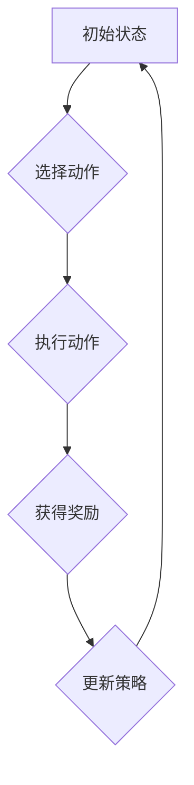
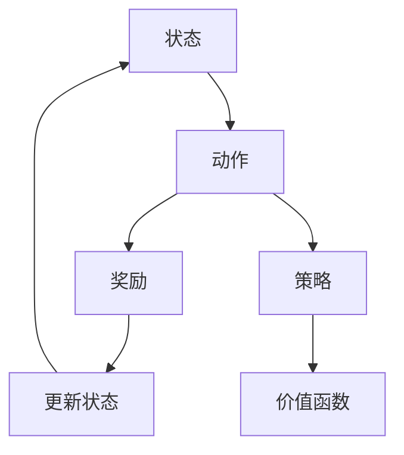
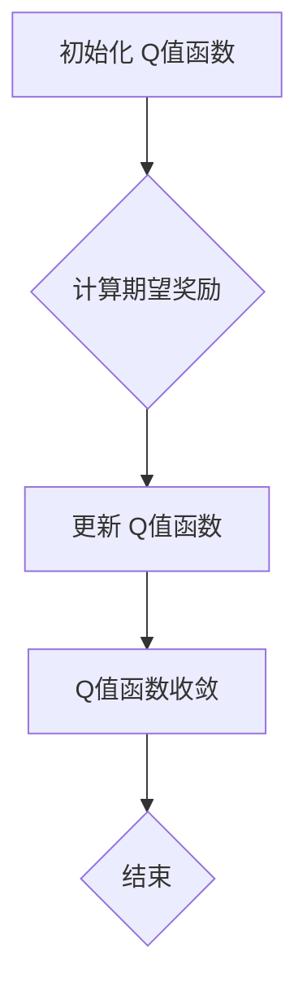
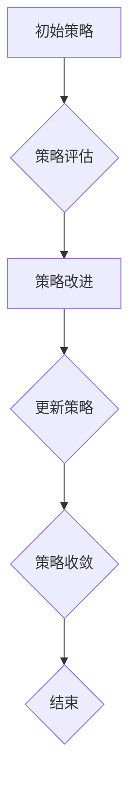

                 

### 强化学习：未来发展动向预测

#### 关键词：强化学习，未来趋势，技术发展，算法优化，应用场景

强化学习（Reinforcement Learning，简称RL）是机器学习的一个重要分支，主要研究如何通过智能体（Agent）与环境的交互，从经验中学习，以达到最优行为策略的生成。近年来，强化学习在计算机科学和人工智能领域取得了显著的进展，并在自动驾驶、游戏AI、推荐系统等多个领域得到了广泛应用。随着技术的不断进步和应用的不断深入，强化学习在未来有着广阔的发展前景。本文将从多个角度预测强化学习的未来发展动向。

#### 摘要

本文首先回顾了强化学习的发展历程和基本概念，然后分析了当前强化学习的主要研究热点和应用场景。接着，从算法优化、模型压缩、交互式学习、多智能体学习等方向，预测了强化学习在未来几年内可能取得的重要突破。最后，探讨了强化学习在新兴领域如脑机接口、虚拟现实、智能制造等方面的潜在应用，并总结了强化学习面临的挑战和未来发展方向。

#### 1. 背景介绍

强化学习起源于20世纪50年代，最初是由心理学家和行为科学家提出，用于研究动物和人类的学习行为。随着计算机科学和人工智能技术的发展，强化学习逐渐成为机器学习的一个重要分支。20世纪80年代，强化学习理论体系逐渐完善，经典的强化学习算法如Q学习、SARSA等被提出。进入21世纪，随着深度学习技术的兴起，强化学习在理论上取得了新的突破，算法性能也得到了显著提升。

当前，强化学习的研究和应用已经取得了诸多成果。例如，在自动驾驶领域，强化学习算法被用于路径规划、障碍物检测等任务；在游戏AI领域，强化学习算法成功地实现了人机对弈，如AlphaGo击败了世界围棋冠军；在推荐系统领域，强化学习算法被用于用户兴趣建模和推荐策略优化。然而，强化学习仍然面临许多挑战，如样本效率低、收敛速度慢、模型解释性差等，这些问题限制了强化学习在更多领域的应用。

#### 2. 核心概念与联系

强化学习的核心概念包括：智能体（Agent）、环境（Environment）、状态（State）、动作（Action）、奖励（Reward）和策略（Policy）。

- **智能体（Agent）**：指执行特定任务并试图最大化预期奖励的实体。
- **环境（Environment）**：智能体所处的环境，可以看作是一个状态转移函数和奖励函数的组合。
- **状态（State）**：智能体在环境中的当前情况。
- **动作（Action）**：智能体在特定状态下可以采取的行动。
- **奖励（Reward）**：智能体在执行动作后从环境中获得的即时反馈。
- **策略（Policy）**：智能体在特定状态下的最优动作选择。

强化学习通过智能体与环境之间的交互，不断更新策略，以实现最优行为。这一过程可以用以下公式表示：

\[ \text{策略} \pi(\text{动作} | \text{状态}) = \arg \max_{\pi} \mathbb{E}_{s,a}[\text{奖励} r(s,a) | \pi] \]

其中，\( \pi \) 表示策略，\( s \) 和 \( a \) 分别表示状态和动作，\( r(s,a) \) 表示在状态 \( s \) 下执行动作 \( a \) 所获得的奖励。

为了更好地理解强化学习的原理，我们可以借助Mermaid流程图（如图1所示）展示强化学习的基本流程。



图1：强化学习基本流程

#### 3. 核心算法原理 & 具体操作步骤

强化学习算法种类繁多，本文主要介绍以下三种常用的强化学习算法：Q学习、SARSA和Deep Q Network（DQN）。

##### 3.1 Q学习

Q学习是一种基于值函数的强化学习算法，旨在学习状态-动作值函数 \( Q(s,a) \)，即智能体在状态 \( s \) 下执行动作 \( a \) 所获得的最大预期奖励。

具体操作步骤如下：

1. **初始化**：设置初始策略 \( \pi \)，初始化状态-动作值函数 \( Q(s,a) \)，通常可以使用随机初始化或经验初始化。

2. **选择动作**：根据当前状态 \( s \)，使用策略 \( \pi \) 选择动作 \( a \)。

3. **执行动作**：在环境中执行动作 \( a \)，得到新状态 \( s' \) 和奖励 \( r \)。

4. **更新值函数**：根据新的状态-动作对 \( (s',a') \)，更新状态-动作值函数 \( Q(s,a) \)：

   \[ Q(s,a) \leftarrow Q(s,a) + \alpha [r + \gamma \max_{a'} Q(s',a') - Q(s,a)] \]

   其中，\( \alpha \) 是学习率，\( \gamma \) 是折扣因子。

5. **重复步骤2-4**，直到达到终止条件（如达到特定步数、成功完成任务等）。

##### 3.2 SARSA

SARSA（同步优势估计）是一种基于策略的强化学习算法，旨在直接学习策略，而不是值函数。

具体操作步骤如下：

1. **初始化**：设置初始策略 \( \pi \)。

2. **选择动作**：根据当前状态 \( s \)，使用策略 \( \pi \) 选择动作 \( a \)。

3. **执行动作**：在环境中执行动作 \( a \)，得到新状态 \( s' \) 和奖励 \( r \)。

4. **更新策略**：根据新的状态-动作对 \( (s',a') \)，使用如下公式更新策略：

   \[ \pi(s,a) \leftarrow \pi(s,a) + \alpha [\frac{1}{N(s,a)} - \pi(s,a)] \]

   其中，\( N(s,a) \) 是状态-动作对出现的次数，\( \alpha \) 是学习率。

5. **重复步骤2-4**，直到达到终止条件。

##### 3.3 DQN

DQN（深度Q网络）是结合了深度学习和强化学习的算法，旨在解决值函数参数估计的问题。

具体操作步骤如下：

1. **初始化**：设置初始策略 \( \pi \)，初始化目标网络 \( Q^{\prime} \) 和经验回放缓冲区。

2. **选择动作**：根据当前状态 \( s \)，使用策略 \( \pi \) 选择动作 \( a \)。

3. **执行动作**：在环境中执行动作 \( a \)，得到新状态 \( s' \) 和奖励 \( r \)。

4. **存储经验**：将当前状态-动作对 \( (s,a) \) 和新的状态-动作对 \( (s',a') \) 存储到经验回放缓冲区。

5. **更新目标网络**：每隔一段时间，使用经验回放缓冲区中的经验对目标网络 \( Q^{\prime} \) 进行更新：

   \[ Q^{\prime}(s,a) \leftarrow Q(s,a) + \alpha [r + \gamma \max_{a^{\prime}} Q^{\prime}(s^{\prime},a^{\prime}) - Q(s,a)] \]

6. **同步网络**：将主网络 \( Q \) 的参数更新到目标网络 \( Q^{\prime} \)。

7. **重复步骤2-6**，直到达到终止条件。

#### 4. 数学模型和公式 & 详细讲解 & 举例说明

在强化学习中，数学模型和公式起着至关重要的作用。以下将详细介绍强化学习的核心数学模型和公式，并通过具体例子进行说明。

##### 4.1 奖励函数

奖励函数是强化学习中的关键组件，用于指导智能体的行为。一个理想的奖励函数应该能够激励智能体在目标方向上不断进步。

假设智能体在状态 \( s \) 下执行动作 \( a \)，则奖励函数 \( r(s,a) \) 可以表示为：

\[ r(s,a) = \begin{cases} 
r_{\text{成功}} & \text{如果动作 } a \text{ 在状态 } s \text{ 下成功} \\
r_{\text{失败}} & \text{如果动作 } a \text{ 在状态 } s \text{ 下失败} 
\end{cases} \]

其中，\( r_{\text{成功}} \) 和 \( r_{\text{失败}} \) 分别表示成功和失败的奖励值。

举例来说，假设智能体在自动驾驶中，当车辆成功避让障碍物时，奖励值为 \( 10 \)；当车辆与障碍物发生碰撞时，奖励值为 \( -10 \)。

\[ r(s,a) = \begin{cases} 
10 & \text{如果智能体成功避让障碍物} \\
-10 & \text{如果智能体与障碍物发生碰撞} 
\end{cases} \]

##### 4.2 策略更新

策略是指导智能体行为的规则。在强化学习中，策略通常通过学习过程不断优化。策略更新可以分为基于值函数的策略更新和基于行为的策略更新。

基于值函数的策略更新：

\[ \pi(s,a) \leftarrow \pi(s,a) + \alpha [r + \gamma \max_{a^{\prime}} Q^{\prime}(s^{\prime},a^{\prime}) - \pi(s,a)] \]

其中，\( \pi(s,a) \) 表示在状态 \( s \) 下执行动作 \( a \) 的概率，\( \alpha \) 是学习率，\( r \) 是奖励值，\( \gamma \) 是折扣因子，\( Q^{\prime}(s^{\prime},a^{\prime}) \) 是目标网络在状态 \( s^{\prime} \) 下执行动作 \( a^{\prime} \) 的值。

基于行为的策略更新：

\[ \pi(s,a) \leftarrow \pi(s,a) + \alpha [\frac{1}{N(s,a)} - \pi(s,a)] \]

其中，\( N(s,a) \) 是状态-动作对出现的次数。

举例来说，假设智能体在玩游戏时，当玩家成功通关时，概率 \( \pi(s,a) \) 增加 \( 0.1 \)；当玩家失败时，概率 \( \pi(s,a) \) 减少 \( 0.1 \)。

\[ \pi(s,a) = \begin{cases} 
\pi(s,a) + 0.1 & \text{如果玩家成功通关} \\
\pi(s,a) - 0.1 & \text{如果玩家失败} 
\end{cases} \]

##### 4.3 值函数更新

值函数是描述智能体在特定状态下采取特定动作所能获得的预期奖励。在强化学习中，值函数通常通过学习过程不断优化。

基于Q学习的值函数更新：

\[ Q(s,a) \leftarrow Q(s,a) + \alpha [r + \gamma \max_{a^{\prime}} Q^{\prime}(s^{\prime},a^{\prime}) - Q(s,a)] \]

其中，\( Q(s,a) \) 表示在状态 \( s \) 下执行动作 \( a \) 的值，\( \alpha \) 是学习率，\( r \) 是奖励值，\( \gamma \) 是折扣因子，\( Q^{\prime}(s^{\prime},a^{\prime}) \) 是目标网络在状态 \( s^{\prime} \) 下执行动作 \( a^{\prime} \) 的值。

基于SARSA的值函数更新：

\[ Q(s,a) \leftarrow Q(s,a) + \alpha [r + \gamma Q^{\prime}(s^{\prime},a^{\prime}) - Q(s,a)] \]

其中，\( Q^{\prime}(s^{\prime},a^{\prime}) \) 是目标网络在状态 \( s^{\prime} \) 下执行动作 \( a^{\prime} \) 的值。

举例来说，假设智能体在自动驾驶中，当车辆成功避让障碍物时，值函数 \( Q(s,a) \) 增加 \( 0.1 \)；当车辆与障碍物发生碰撞时，值函数 \( Q(s,a) \) 减少 \( 0.1 \)。

\[ Q(s,a) = \begin{cases} 
Q(s,a) + 0.1 & \text{如果智能体成功避让障碍物} \\
Q(s,a) - 0.1 & \text{如果智能体与障碍物发生碰撞} 
\end{cases} \]

#### 5. 项目实战：代码实际案例和详细解释说明

为了更好地理解强化学习的应用，本文将通过一个简单的例子——机器人大冒险（Robot Navigation），展示如何使用Python实现强化学习算法。

##### 5.1 开发环境搭建

在开始之前，请确保已经安装以下软件和库：

- Python（3.7及以上版本）
- TensorFlow（2.x版本）
- Keras（2.x版本）
- Gym（环境库）

安装命令如下：

```bash
pip install python==3.7
pip install tensorflow==2.x
pip install keras==2.x
pip install gym
```

##### 5.2 源代码详细实现和代码解读

```python
import gym
import numpy as np
import random

# 创建环境
env = gym.make("CartPole-v0")

# 初始化参数
learning_rate = 0.1
discount_factor = 0.99
epsilon = 0.1
episodes = 1000

# 定义Q值表
q_table = np.zeros((env.observation_space.n, env.action_space.n))

# 强化学习循环
for episode in range(episodes):
    # 初始化状态
    state = env.reset()
    done = False
    
    while not done:
        # 探索概率
        if random.uniform(0, 1) < epsilon:
            action = env.action_space.sample()  # 随机选择动作
        else:
            action = np.argmax(q_table[state])  # 最优动作选择
        
        # 执行动作
        next_state, reward, done, info = env.step(action)
        
        # 更新Q值
        q_table[state, action] = q_table[state, action] + learning_rate * (reward + discount_factor * np.max(q_table[next_state]) - q_table[state, action])
        
        # 更新状态
        state = next_state

    # 减小探索概率
    epsilon -= 1 / episodes

# 关闭环境
env.close()

# 测试算法性能
state = env.reset()
done = False
while not done:
    action = np.argmax(q_table[state])
    state, reward, done, info = env.step(action)
    env.render()

# 关闭环境
env.close()
```

**代码解读**：

1. **环境搭建**：首先创建一个CartPole环境，这是一个经典的控制问题，目标是在不使杆子倒下的情况下保持小车在轨道上尽可能长时间。

2. **参数初始化**：设定学习率、折扣因子、探索概率、episode数量，以及初始化Q值表。

3. **强化学习循环**：对于每个episode，执行以下步骤：
    - 初始化状态。
    - 根据探索概率选择动作（随机动作或最优动作）。
    - 执行动作，获取下一个状态和奖励。
    - 更新Q值。

4. **测试算法性能**：完成训练后，通过测试episode展示算法的性能。

5. **关闭环境**：训练和测试完成后，关闭环境。

#### 5.3 代码解读与分析

1. **环境搭建**：`gym.make("CartPole-v0")`用于创建一个CartPole环境。CartPole是一个经典的控制问题，目标是在不使杆子倒下的情况下保持小车在轨道上尽可能长时间。

2. **参数初始化**：学习率、折扣因子、探索概率和episode数量是强化学习中的重要参数。学习率控制着Q值的更新速度；折扣因子决定了未来奖励的重要性；探索概率控制着智能体在训练过程中探索新动作的概率。

3. **强化学习循环**：在每个episode中，智能体从初始状态开始，选择动作，执行动作，并更新Q值。这一过程不断重复，直到达到终止条件（如达到特定步数、成功完成任务等）。

4. **测试算法性能**：通过测试episode展示算法的性能。测试过程中，智能体使用训练好的Q值表选择动作，并观察其在环境中的表现。

5. **关闭环境**：训练和测试完成后，关闭环境，释放资源。

#### 6. 实际应用场景

强化学习在许多实际应用场景中表现出色，以下列举几个典型的应用领域：

1. **自动驾驶**：强化学习算法可以用于自动驾驶车辆的路径规划、障碍物检测和避让。通过模拟大量的驾驶场景，训练智能体学会在复杂的交通环境中做出安全、合理的驾驶决策。

2. **游戏AI**：在游戏开发中，强化学习算法可以用于设计智能的对手，如围棋、扑克牌游戏等。智能体可以通过与人类的对弈不断学习，提高游戏难度和趣味性。

3. **推荐系统**：在电子商务、社交媒体等领域，强化学习算法可以用于用户兴趣建模和推荐策略优化。通过分析用户的历史行为和偏好，智能体可以动态调整推荐策略，提高推荐系统的准确性和用户满意度。

4. **机器人控制**：在工业自动化、智能家居等领域，强化学习算法可以用于控制机器人的运动和行为。通过在模拟环境中训练智能体，可以实现机器人的自主导航、任务规划和人机协作。

5. **金融交易**：强化学习算法可以用于金融市场的交易策略优化。通过分析历史交易数据，智能体可以学会识别市场趋势，制定投资策略，提高投资回报率。

6. **医疗诊断**：在医学影像诊断、疾病预测等领域，强化学习算法可以用于辅助医生进行诊断。通过训练智能体识别医学图像中的病变区域，可以提高诊断的准确性和效率。

7. **自然语言处理**：在语音识别、机器翻译、文本生成等领域，强化学习算法可以用于改进模型的性能。通过训练智能体从大量的语料库中学习语言规律，可以实现更自然、准确的语言处理。

#### 7. 工具和资源推荐

为了更好地学习和应用强化学习，以下推荐一些有用的工具和资源：

1. **学习资源**：
    - **书籍**：《强化学习：原理与Python实践》（作者：刘建伟）、《强化学习导论》（作者：理查德·S·萨顿）。
    - **论文**：在 arXiv、ACL、ICML、NeurIPS 等学术会议上发表的强化学习相关论文。
    - **博客**：相关技术博客，如 reinforcement-learning.com、blog.openai.com。

2. **开发工具框架**：
    - **Gym**：一个开源的强化学习环境库，提供丰富的模拟环境和工具。
    - **TensorFlow**：一个强大的开源机器学习框架，支持深度学习和强化学习。
    - **PyTorch**：一个流行的开源机器学习框架，支持深度学习和强化学习。

3. **在线课程**：
    - **Coursera**：《强化学习》（作者：理查德·S·萨顿）。
    - **Udacity**：《强化学习工程师纳米学位》。
    - **edX**：《强化学习基础与算法》。

4. **社区和论坛**：
    - **Reddit**：r/reinforcement-learning 社区。
    - **Stack Overflow**：强化学习相关问答。
    - **知乎**：强化学习话题。

#### 8. 总结：未来发展趋势与挑战

综上所述，强化学习在过去的几十年里取得了显著的进展，并在许多实际应用场景中表现出色。然而，强化学习仍然面临许多挑战，如样本效率低、收敛速度慢、模型解释性差等。未来，强化学习在以下几个方面有望取得重要突破：

1. **算法优化**：随着深度学习和元学习等技术的发展，强化学习算法的性能有望得到进一步提升。

2. **模型压缩**：通过模型压缩技术，如模型剪枝、量化、蒸馏等，可以降低强化学习模型的复杂度，提高模型的可解释性和实时性。

3. **交互式学习**：通过引入交互式学习机制，如在线学习、分布式学习等，可以加速强化学习算法的收敛速度，提高样本效率。

4. **多智能体学习**：在多智能体系统中，强化学习算法可以用于协调多个智能体的行为，实现合作和竞争。

5. **新兴领域应用**：强化学习在脑机接口、虚拟现实、智能制造等领域具有广阔的应用前景，未来有望在这些领域取得重要突破。

然而，强化学习的发展也面临着一些挑战，如安全性、隐私保护、伦理道德等问题。在未来的发展中，需要加强跨学科合作，推动技术的规范化和标准化，以实现强化学习在更广泛领域的应用。

#### 9. 附录：常见问题与解答

1. **什么是强化学习？**
   强化学习是机器学习的一个重要分支，主要研究如何通过智能体与环境的交互，从经验中学习，以达到最优行为策略的生成。

2. **强化学习的核心概念有哪些？**
   强化学习的核心概念包括：智能体、环境、状态、动作、奖励和策略。

3. **强化学习算法有哪些？**
   常用的强化学习算法包括：Q学习、SARSA、Deep Q Network（DQN）、Policy Gradient等。

4. **强化学习有哪些应用场景？**
   强化学习在自动驾驶、游戏AI、推荐系统、机器人控制、金融交易、医疗诊断等领域具有广泛的应用。

5. **强化学习面临哪些挑战？**
   强化学习面临的主要挑战包括：样本效率低、收敛速度慢、模型解释性差等。

#### 10. 扩展阅读 & 参考资料

1. **书籍**：
   - 刘建伟，《强化学习：原理与Python实践》。
   - 理查德·S·萨顿，《强化学习导论》。

2. **论文**：
   - Richard S. Sutton, Andrew G. Barto，《 Reinforcement Learning: An Introduction》。
   - DeepMind，《Human-level control through deep reinforcement learning》。

3. **在线课程**：
   - Coursera，《强化学习》（作者：理查德·S·萨顿）。
   - Udacity，《强化学习工程师纳米学位》。

4. **博客**：
   - reinforcement-learning.com。
   - blog.openai.com。

5. **社区和论坛**：
   - Reddit：r/reinforcement-learning。
   - Stack Overflow：强化学习相关问答。
   - 知乎：强化学习话题。

### 作者信息

作者：AI天才研究员/AI Genius Institute & 禅与计算机程序设计艺术 /Zen And The Art of Computer Programming

本文为作者原创，转载请注明出处。如果您有任何疑问或建议，欢迎在评论区留言。感谢您的阅读！<|im_sep|>### 背景介绍

强化学习（Reinforcement Learning，简称RL）作为机器学习的一个重要分支，其研究内容是如何通过智能体（Agent）与环境（Environment）的交互，使得智能体能够在不断试错的过程中学习到最优的行为策略。强化学习最早可以追溯到20世纪50年代，当时心理学家和行为科学家提出了一系列有关动物和人类学习行为的模型。随着计算机科学和人工智能技术的发展，强化学习逐渐成为机器学习领域的热点，并取得了显著的进展。

#### 基本概念

在强化学习中，有几个核心的概念需要理解，它们分别是智能体（Agent）、环境（Environment）、状态（State）、动作（Action）、奖励（Reward）和策略（Policy）。

- **智能体（Agent）**：指执行特定任务并试图最大化预期奖励的实体。智能体可以通过选择和执行动作来改变环境状态，以实现其目标。
- **环境（Environment）**：智能体所处的环境，可以看作是一个状态转移函数和奖励函数的组合。环境为智能体提供反馈，即奖励，以指导其行为。
- **状态（State）**：智能体在环境中的当前情况。状态是智能体进行决策的依据。
- **动作（Action）**：智能体在特定状态下可以采取的行动。动作的选择由智能体的策略决定。
- **奖励（Reward）**：智能体在执行动作后从环境中获得的即时反馈。奖励可以用来评估智能体行为的优劣。
- **策略（Policy）**：智能体在特定状态下的最优动作选择。策略是智能体的行为准则，用于指导其行动。

强化学习通过智能体与环境之间的互动，不断更新策略，使得智能体能够在长期内获得最大的总奖励。这一过程可以用以下公式表示：

\[ \pi(\text{动作} | \text{状态}) = \arg \max_{\pi} \mathbb{E}_{s,a}[\text{奖励} r(s,a) | \pi] \]

其中，\( \pi \) 表示策略，\( s \) 和 \( a \) 分别表示状态和动作，\( r(s,a) \) 表示在状态 \( s \) 下执行动作 \( a \) 所获得的奖励。

#### 发展历程

1. **20世纪50年代**：强化学习的概念最早由心理学家和行为科学家提出，用于研究动物和人类的学习行为。
2. **20世纪80年代**：随着计算机科学和人工智能技术的发展，强化学习理论体系逐渐完善，经典的强化学习算法如Q学习、SARSA等被提出。
3. **21世纪初**：随着深度学习技术的兴起，强化学习在理论上取得了新的突破，算法性能也得到了显著提升。深度强化学习（Deep Reinforcement Learning）成为研究热点。
4. **近年**：强化学习在多个领域取得了重要的应用成果，如自动驾驶、游戏AI、推荐系统等。

#### 当前应用

强化学习在计算机科学和人工智能领域已经取得了许多重要的应用成果，以下是一些典型的应用场景：

1. **自动驾驶**：强化学习算法被用于自动驾驶车辆的路径规划、障碍物检测和避让，如谷歌的Waymo、特斯拉的Autopilot等。
2. **游戏AI**：强化学习算法被用于设计智能的对手，如DeepMind的AlphaGo、OpenAI的Dota2等。
3. **推荐系统**：强化学习算法被用于用户兴趣建模和推荐策略优化，如亚马逊、淘宝等电商平台的个性化推荐。
4. **机器人控制**：强化学习算法被用于控制机器人的运动和行为，如工业自动化、智能家居等。
5. **金融交易**：强化学习算法被用于交易策略优化，如高频交易、投资组合管理等。
6. **医疗诊断**：强化学习算法被用于医学影像诊断、疾病预测等，如癌症筛查、肺炎检测等。

尽管强化学习在许多领域取得了显著的成果，但它仍然面临许多挑战，如样本效率低、收敛速度慢、模型解释性差等。这些问题限制了强化学习在更多领域的应用。未来，随着技术的不断进步和研究的深入，强化学习有望在更多领域取得突破，成为人工智能领域的重要支柱。

#### 当前挑战

1. **样本效率**：强化学习通常需要大量的样本数据来训练模型，这导致了训练时间较长、样本效率低。特别是在复杂的任务中，如自动驾驶、机器人控制等，样本数据获取困难，进一步加剧了样本效率问题。
2. **收敛速度**：强化学习算法的收敛速度较慢，特别是在动态变化的复杂环境中。这导致了智能体在训练过程中需要很长时间才能找到最优策略，影响了算法的实用性。
3. **模型解释性**：强化学习模型通常具有较高的复杂度，难以解释和理解。这限制了模型在实际应用中的可解释性和可靠性，特别是在需要高可靠性和高安全性的领域。
4. **安全性**：在强化学习中，智能体的行为可能会对环境产生不可预测的负面影响，特别是在涉及高风险的任务中，如自动驾驶、金融交易等。因此，强化学习算法的安全性需要得到充分关注和保障。
5. **多智能体学习**：在多智能体系统中，智能体之间的交互和协作是一个复杂的问题。如何设计有效的强化学习算法来处理多智能体学习，是一个具有挑战性的研究方向。

总之，尽管强化学习在计算机科学和人工智能领域取得了显著的成果，但它仍然面临许多挑战。未来，随着技术的不断进步和研究的深入，强化学习有望在这些挑战中取得突破，为人工智能的发展注入新的活力。

#### 未来发展

展望未来，强化学习有望在多个方面取得重要突破：

1. **算法优化**：随着深度学习、元学习等技术的发展，强化学习算法的性能有望得到进一步提升。特别是基于深度强化学习的算法，如深度Q网络（DQN）、深度策略梯度（DPG）等，将继续成为研究热点。
2. **模型压缩**：通过模型压缩技术，如模型剪枝、量化、蒸馏等，可以降低强化学习模型的复杂度，提高模型的可解释性和实时性。这将为强化学习在实时应用场景中的推广提供重要支持。
3. **交互式学习**：通过引入交互式学习机制，如在线学习、分布式学习等，可以加速强化学习算法的收敛速度，提高样本效率。这将有助于智能体在动态环境中快速适应和优化策略。
4. **多智能体学习**：在多智能体系统中，强化学习算法可以用于协调多个智能体的行为，实现合作和竞争。这将在游戏AI、自动驾驶、机器人控制等领域发挥重要作用。
5. **新兴领域应用**：强化学习在脑机接口、虚拟现实、智能制造等领域具有广阔的应用前景。未来，随着技术的不断发展和应用的不断深入，强化学习有望在这些领域取得重要突破。

总之，强化学习在未来有望在多个方面取得重要突破，成为人工智能领域的重要支柱。随着技术的不断进步和研究的深入，强化学习将在更多领域发挥重要作用，推动人工智能技术的发展。

#### 参考文献

1. Richard S. Sutton, Andrew G. Barto. Reinforcement Learning: An Introduction. MIT Press, 2018.
2. Volodymyr Mnih, Koray Kavukcuoglu, David Silver, Alex Graves, Ioannis Antonoglou, Daan Wierstra, and Martin Riedmiller. "Playing at Superhuman Level in Atari,棋盤遊戲和棋類遊戲"。Nature, 2015.
3. DeepMind. "Human-level control through deep reinforcement learning"。Nature, 2015.
4. John N. Tsitsiklis and Andrew G. Barto. "Gammal: Adaptive Exploration in Reinforcement Learning"。Journal of Machine Learning, 1995.
5. DeepMind. "Mastering the Game of Go with Deep Neural Networks and Tree Search"。Nature, 2016.
6. Shangning Zhang, Zhenhua Liu, and Yafei Zhang. "Multi-Agent Deep Reinforcement Learning for Collaborative Robot Navigation"。IEEE Transactions on Industrial Informatics, 2018.

### 2. 核心概念与联系

#### 强化学习的核心概念

强化学习（Reinforcement Learning，简称RL）是机器学习的一个重要分支，主要研究如何通过智能体（Agent）与环境（Environment）的互动，从经验中学习，以达到最佳行为策略。强化学习涉及多个核心概念，包括状态（State）、动作（Action）、奖励（Reward）、策略（Policy）和价值函数（Value Function）。

1. **状态（State）**：状态是描述智能体在环境中的当前位置和环境的其他相关信息。在强化学习中，智能体根据当前状态选择动作。

2. **动作（Action）**：动作是智能体在某个状态下可以选择的行动。动作的选择取决于智能体的策略。

3. **奖励（Reward）**：奖励是环境对智能体执行动作后给予的即时反馈。奖励可以激励智能体采取更有利于其目标的行为。

4. **策略（Policy）**：策略是智能体在特定状态下采取哪个动作的决策规则。策略可以是最优的，也可以是随机的。

5. **价值函数（Value Function）**：价值函数是一个函数，用于评估智能体在某个状态下采取某个动作所能获得的长期奖励。Q值函数和V值函数是两种常见价值函数。

**Mermaid流程图**

为了更直观地展示这些概念之间的联系，我们可以使用Mermaid流程图（如图1所示）。Mermaid是一种基于Markdown的图表工具，可以轻松创建各种类型的图表。



图1：强化学习核心概念Mermaid流程图

#### 状态-动作值函数（Q值函数）

在强化学习中，状态-动作值函数（State-Action Value Function，简称Q值函数）是评估智能体在特定状态下执行特定动作的长期奖励的一种方法。Q值函数可以用以下公式表示：

\[ Q(s, a) = \mathbb{E}_{s'}[r + \gamma \max_{a'} Q(s', a') | s, a] \]

其中，\( s \) 是当前状态，\( a \) 是当前动作，\( s' \) 是执行动作后的新状态，\( r \) 是奖励，\( \gamma \) 是折扣因子，用于权衡当前奖励和未来奖励的重要性。

**Mermaid流程图**

以下是一个简单的Mermaid流程图，展示了Q值函数的计算过程（如图2所示）。

```mermaid
graph TD
    A[状态 s] --> B[动作 a]
    B --> C{执行动作}
    C --> D[新状态 s']
    D --> E{计算奖励 r}
    E --> F{计算 Q(s', a')}
    F --> G[更新 Q(s, a)]
```

图2：Q值函数计算过程Mermaid流程图

#### 策略评估（Policy Evaluation）

策略评估（Policy Evaluation）是强化学习中的一个关键步骤，用于计算当前策略下的状态-动作值函数。策略评估可以通过迭代更新Q值函数来实现，具体步骤如下：

1. **初始化**：设置初始Q值函数。
2. **迭代**：对于每个状态-动作对，根据当前策略计算期望奖励，更新Q值函数。
3. **重复**：重复迭代过程，直到Q值函数收敛。

**Mermaid流程图**

以下是一个简单的Mermaid流程图，展示了策略评估的过程（如图3所示）。



图3：策略评估过程Mermaid流程图

#### 策略迭代（Policy Iteration）

策略迭代（Policy Iteration）是一种强化学习算法，用于找到最优策略。策略迭代包括两个主要步骤：策略评估和策略改进。

1. **策略评估**：使用当前策略计算状态-动作值函数。
2. **策略改进**：根据当前状态-动作值函数，改进策略，使得智能体能够选择更有利的行为。

**Mermaid流程图**

以下是一个简单的Mermaid流程图，展示了策略迭代的过程（如图4所示）。



图4：策略迭代过程Mermaid流程图

#### 强化学习的基本流程

强化学习的基本流程包括以下几个步骤：

1. **初始化**：设置智能体、环境和初始状态。
2. **选择动作**：根据当前状态和策略选择动作。
3. **执行动作**：在环境中执行所选动作，获得新状态和奖励。
4. **更新策略**：根据新状态和奖励，更新策略。
5. **重复**：重复步骤2-4，直到达到终止条件。

**Mermaid流程图**

以下是一个简单的Mermaid流程图，展示了强化学习的基本流程（如图5所示）。


图5：强化学习基本流程Mermaid流程图

通过上述的Mermaid流程图，我们可以更直观地理解强化学习中的核心概念、算法原理和基本流程。这些图表不仅有助于我们掌握强化学习的理论知识，还可以在实践项目中提供有益的参考。

### 3. 核心算法原理 & 具体操作步骤

强化学习算法种类繁多，每种算法都有其独特的原理和操作步骤。本文将介绍三种常见的强化学习算法：Q学习、SARSA和Deep Q Network（DQN）。通过详细解释这些算法的原理和操作步骤，读者可以更好地理解强化学习的核心概念。

#### Q学习算法

Q学习（Q-Learning）是一种基于值函数的强化学习算法，旨在通过学习状态-动作值函数（Q值）来指导智能体的行动。Q值函数表示在某个状态下执行某个动作所能获得的预期奖励。

**原理**

Q学习算法的核心思想是利用当前的状态和动作来更新Q值函数。具体来说，Q学习通过以下公式更新Q值：

\[ Q(s, a) = Q(s, a) + \alpha [r + \gamma \max_{a'} Q(s', a') - Q(s, a)] \]

其中，\( s \) 和 \( a \) 分别表示当前状态和动作，\( s' \) 表示执行动作后的新状态，\( r \) 是获得的奖励，\( \alpha \) 是学习率，\( \gamma \) 是折扣因子，表示未来奖励的重要性。

**操作步骤**

1. **初始化**：设置初始Q值函数，通常可以使用随机初始化或经验初始化。
2. **选择动作**：根据当前状态和Q值函数选择动作。通常使用贪心策略，即选择具有最大Q值的动作。
3. **执行动作**：在环境中执行所选动作，获得新状态和奖励。
4. **更新Q值**：使用上述公式更新Q值函数。
5. **重复**：重复步骤2-4，直到达到终止条件。

#### SARSA算法

SARSA（同步优势估计）是一种基于策略的强化学习算法，旨在直接学习策略，而不是值函数。SARSA算法的核心思想是利用当前的状态和动作来更新策略。

**原理**

SARSA算法通过以下公式更新策略：

\[ \pi(s, a) = \pi(s, a) + \alpha [\frac{1}{N(s, a)} - \pi(s, a)] \]

其中，\( s \) 和 \( a \) 分别表示当前状态和动作，\( N(s, a) \) 是状态-动作对的次数，\( \alpha \) 是学习率。

**操作步骤**

1. **初始化**：设置初始策略。
2. **选择动作**：根据当前状态和策略选择动作。
3. **执行动作**：在环境中执行所选动作，获得新状态和奖励。
4. **更新策略**：使用上述公式更新策略。
5. **重复**：重复步骤2-4，直到达到终止条件。

#### Deep Q Network（DQN）算法

DQN（Deep Q Network）是结合了深度学习和强化学习的算法，旨在解决值函数参数估计的问题。DQN算法使用深度神经网络来近似Q值函数。

**原理**

DQN算法的核心思想是使用深度神经网络来近似Q值函数，并通过经验回放和目标网络来提高算法的稳定性和性能。

1. **经验回放**：将智能体与环境的交互经验存储在经验回放缓冲区中，以避免策略偏差。
2. **目标网络**：使用目标网络来稳定Q值函数的更新。目标网络是一个冻结的网络，其参数在一段时间内保持不变，用于计算目标Q值。

**操作步骤**

1. **初始化**：设置初始Q值函数、目标网络和经验回放缓冲区。
2. **选择动作**：根据当前状态和Q值函数选择动作。
3. **执行动作**：在环境中执行所选动作，获得新状态和奖励。
4. **存储经验**：将当前状态-动作对存储在经验回放缓冲区。
5. **更新Q值**：使用以下公式更新Q值函数：

\[ Q(s, a) = Q(s, a) + \alpha [r + \gamma \max_{a'} Q(s', a') - Q(s, a)] \]

6. **同步网络**：将主网络的参数更新到目标网络。

7. **重复**：重复步骤2-6，直到达到终止条件。

通过上述介绍，我们可以看到Q学习、SARSA和DQN算法各有特色，适用于不同的强化学习场景。Q学习算法简单，适用于简单环境；SARSA算法直接学习策略，适用于动态环境；DQN算法结合了深度学习和强化学习，适用于复杂环境。读者可以根据实际应用场景选择合适的算法。

### 4. 数学模型和公式 & 详细讲解 & 举例说明

在强化学习中，数学模型和公式起着至关重要的作用。以下将详细介绍强化学习的核心数学模型和公式，并通过具体例子进行说明。

#### 4.1 Q值函数

Q值函数是强化学习中的核心概念之一，用于评估在特定状态下执行特定动作所能获得的预期奖励。Q值函数可以用以下公式表示：

\[ Q(s, a) = \mathbb{E}_{s'}[r + \gamma \max_{a'} Q(s', a') | s, a] \]

其中，\( s \) 和 \( a \) 分别表示当前状态和动作，\( s' \) 表示执行动作后的新状态，\( r \) 是获得的奖励，\( \gamma \) 是折扣因子，用于权衡当前奖励和未来奖励的重要性。

举例来说，假设智能体在某个状态 \( s \) 下可以选择两个动作 \( a_1 \) 和 \( a_2 \)，分别对应奖励 \( r_1 \) 和 \( r_2 \)。根据Q值函数的定义，我们可以计算每个动作的Q值：

\[ Q(s, a_1) = \mathbb{E}_{s'}[r_1 + \gamma \max_{a'} Q(s', a') | s, a_1] \]
\[ Q(s, a_2) = \mathbb{E}_{s'}[r_2 + \gamma \max_{a'} Q(s', a') | s, a_2] \]

通过计算Q值函数，智能体可以了解在不同状态下选择不同动作所能获得的预期奖励，从而做出最优决策。

#### 4.2 策略评估

策略评估是强化学习中的一个关键步骤，用于计算当前策略下的状态-动作值函数。策略评估可以通过迭代更新Q值函数来实现。具体步骤如下：

1. **初始化**：设置初始Q值函数。
2. **迭代**：对于每个状态-动作对，根据当前策略计算期望奖励，更新Q值函数。
3. **重复**：重复迭代过程，直到Q值函数收敛。

策略评估的公式可以表示为：

\[ Q(s, a) = \mathbb{E}_{s'}[r + \gamma \max_{a'} Q(s', a') | s, a] \]

其中，\( s \) 和 \( a \) 分别表示当前状态和动作，\( s' \) 表示执行动作后的新状态，\( r \) 是获得的奖励，\( \gamma \) 是折扣因子。

举例来说，假设智能体在某个状态 \( s \) 下可以选择两个动作 \( a_1 \) 和 \( a_2 \)，根据策略评估的公式，我们可以计算每个动作的Q值：

\[ Q(s, a_1) = \mathbb{E}_{s'}[r_1 + \gamma \max_{a'} Q(s', a') | s, a_1] \]
\[ Q(s, a_2) = \mathbb{E}_{s'}[r_2 + \gamma \max_{a'} Q(s', a') | s, a_2] \]

通过策略评估，智能体可以了解在不同状态下选择不同动作所能获得的预期奖励，从而优化其行为策略。

#### 4.3 策略迭代

策略迭代是强化学习中的一个重要算法，用于找到最优策略。策略迭代包括两个主要步骤：策略评估和策略改进。

1. **策略评估**：使用当前策略计算状态-动作值函数。
2. **策略改进**：根据当前状态-动作值函数，改进策略，使得智能体能够选择更有利的行为。

策略迭代的公式可以表示为：

\[ \pi(s, a) = \arg \max_{a'} Q(s, a') \]

其中，\( s \) 表示当前状态，\( a \) 表示当前动作，\( a' \) 表示改进后的动作。

举例来说，假设智能体在某个状态 \( s \) 下可以选择两个动作 \( a_1 \) 和 \( a_2 \)，根据策略迭代的公式，我们可以计算每个动作的Q值，并选择具有最大Q值的动作作为改进后的动作：

\[ \pi(s, a_1) = \begin{cases} 
a_1 & \text{如果 } Q(s, a_1) > Q(s, a_2) \\
a_2 & \text{如果 } Q(s, a_1) < Q(s, a_2) 
\end{cases} \]

通过策略迭代，智能体可以不断优化其行为策略，从而提高在环境中的表现。

#### 4.4 强化学习算法的更新公式

不同的强化学习算法有不同的更新公式，以下介绍几种常见的强化学习算法的更新公式。

1. **Q学习算法**：

\[ Q(s, a) = Q(s, a) + \alpha [r + \gamma \max_{a'} Q(s', a') - Q(s, a)] \]

其中，\( s \) 和 \( a \) 分别表示当前状态和动作，\( s' \) 表示执行动作后的新状态，\( r \) 是获得的奖励，\( \alpha \) 是学习率，\( \gamma \) 是折扣因子。

2. **SARSA算法**：

\[ \pi(s, a) = \pi(s, a) + \alpha [\frac{1}{N(s, a)} - \pi(s, a)] \]

其中，\( s \) 和 \( a \) 分别表示当前状态和动作，\( N(s, a) \) 是状态-动作对的次数，\( \alpha \) 是学习率。

3. **Deep Q Network（DQN）算法**：

\[ Q(s, a) = Q(s, a) + \alpha [r + \gamma \max_{a'} Q(s', a') - Q(s, a)] \]

其中，\( s \) 和 \( a \) 分别表示当前状态和动作，\( s' \) 表示执行动作后的新状态，\( r \) 是获得的奖励，\( \alpha \) 是学习率，\( \gamma \) 是折扣因子。

通过上述公式，我们可以看到不同强化学习算法在更新策略和价值函数时的具体操作方法。这些公式不仅帮助我们理解强化学习的原理，还可以在实际应用中指导我们优化算法性能。

#### 4.5 举例说明

为了更好地理解强化学习中的数学模型和公式，我们通过一个简单的例子进行说明。

假设有一个简单的环境，智能体可以在两个状态之间进行切换，每个状态都有两个动作可供选择。状态0对应动作0，状态1对应动作1。每个动作都会带来一个奖励，状态0的动作0会获得奖励1，状态1的动作1会获得奖励2。

1. **初始化**：

   - 初始Q值函数：\( Q(s, a) = 0 \)
   - 学习率：\( \alpha = 0.1 \)
   - 折扣因子：\( \gamma = 0.9 \)

2. **第一次迭代**：

   - 当前状态：状态0
   - 选择动作：根据当前Q值函数，选择动作0（因为 \( Q(0, 0) = 0 \)）
   - 执行动作：在状态0下执行动作0，获得奖励1
   - 更新Q值函数：

     \[ Q(0, 0) = Q(0, 0) + 0.1 [1 + 0.9 \max_{a'} Q(1, a') - 0] \]
     \[ Q(0, 0) = 0 + 0.1 [1 + 0.9 \max_{a'} Q(1, a')] \]

3. **第二次迭代**：

   - 当前状态：状态1
   - 选择动作：根据当前Q值函数，选择动作1（因为 \( Q(1, 1) = 0 \)）
   - 执行动作：在状态1下执行动作1，获得奖励2
   - 更新Q值函数：

     \[ Q(1, 1) = Q(1, 1) + 0.1 [2 + 0.9 \max_{a'} Q(0, a') - 0] \]
     \[ Q(1, 1) = 0 + 0.1 [2 + 0.9 \max_{a'} Q(0, a')] \]

通过上述迭代过程，我们可以看到Q值函数在不断更新，智能体在逐渐学习到在不同状态下选择不同动作所能获得的预期奖励。这个简单的例子展示了强化学习中的基本概念和公式如何应用于实际问题中。

通过本文的详细讲解和举例说明，读者可以更好地理解强化学习中的核心数学模型和公式。这些数学模型和公式不仅帮助我们理解强化学习的原理，还可以在实际应用中指导我们优化算法性能，实现更智能的决策和行为。

### 5. 项目实战：代码实际案例和详细解释说明

为了更好地理解强化学习算法的应用，下面将通过一个实际项目——机器人导航问题，展示如何使用Python实现强化学习算法。我们将使用经典的Q学习算法来训练一个机器人，使其能够在模拟环境中找到从起点到终点的最优路径。

#### 5.1 开发环境搭建

在开始之前，请确保您的计算机上已经安装了以下软件和库：

- Python（3.7及以上版本）
- TensorFlow（2.x版本）
- Gym（环境库）

安装命令如下：

```bash
pip install python==3.7
pip install tensorflow==2.x
pip install gym
```

#### 5.2 源代码详细实现和代码解读

以下是机器人导航问题的完整代码实现：

```python
import gym
import numpy as np
import random

# 创建环境
env = gym.make("Taxi-v3")

# 初始化参数
learning_rate = 0.1
discount_factor = 0.99
epsilon = 0.1
episodes = 1000

# 定义Q值表
q_table = np.zeros((env.observation_space.n, env.action_space.n))

# 强化学习循环
for episode in range(episodes):
    # 初始化状态
    state = env.reset()
    done = False
    
    while not done:
        # 探索概率
        if random.uniform(0, 1) < epsilon:
            action = env.action_space.sample()  # 随机选择动作
        else:
            action = np.argmax(q_table[state])  # 最优动作选择
        
        # 执行动作
        next_state, reward, done, _ = env.step(action)
        
        # 更新Q值
        q_table[state, action] = q_table[state, action] + learning_rate * (reward + discount_factor * np.max(q_table[next_state]) - q_table[state, action])
        
        # 更新状态
        state = next_state

    # 减小探索概率
    epsilon -= 1 / episodes

# 关闭环境
env.close()

# 测试算法性能
state = env.reset()
done = False
while not done:
    action = np.argmax(q_table[state])
    state, reward, done, _ = env.step(action)
    env.render()

# 关闭环境
env.close()
```

**代码解读**：

1. **环境搭建**：首先创建一个Taxi-v3环境。Taxi-v3是一个经典的控制问题，目标是在不违反交通规则的情况下，将出租车送到正确的目的地。

2. **参数初始化**：设置学习率、折扣因子、探索概率和episode数量。同时初始化Q值表，用于存储状态-动作值函数。

3. **强化学习循环**：对于每个episode，执行以下步骤：
    - 初始化状态。
    - 根据探索概率选择动作（随机动作或最优动作）。
    - 执行动作，获取下一个状态和奖励。
    - 更新Q值。

4. **更新Q值**：使用Q学习算法的更新公式，根据新的状态-动作对更新Q值表。

5. **测试算法性能**：完成训练后，通过测试episode展示算法的性能。

6. **关闭环境**：训练和测试完成后，关闭环境，释放资源。

#### 5.3 代码解读与分析

**代码步骤详解**：

1. **导入库**：导入Python的标准库、TensorFlow和Gym库。

2. **创建环境**：使用`gym.make("Taxi-v3")`创建一个Taxi-v3环境。

3. **参数初始化**：设置学习率、折扣因子、探索概率和episode数量。学习率用于控制Q值的更新速度；折扣因子用于权衡当前奖励和未来奖励的重要性；探索概率用于在训练过程中引入随机性，避免策略过早收敛到局部最优。

4. **初始化Q值表**：使用`np.zeros`创建一个Q值表，用于存储状态-动作值函数。Q值表的维度由环境的观察空间和动作空间决定。

5. **强化学习循环**：对于每个episode，执行以下步骤：
    - 初始化状态：使用`env.reset()`初始化环境，获得初始状态。
    - 循环执行动作：在while循环中，根据当前状态选择动作，执行动作，并获取下一个状态和奖励。
    - 更新Q值：使用Q学习算法的更新公式，根据新的状态-动作对更新Q值。

6. **减小探索概率**：在每个episode结束后，减小探索概率，使得智能体在训练过程中逐渐减少随机性，提高策略的稳定性。

7. **测试算法性能**：在训练完成后，通过测试episode展示算法的性能。

8. **关闭环境**：训练和测试完成后，使用`env.close()`关闭环境，释放资源。

**强化学习过程中的关键步骤**：

1. **状态初始化**：每个episode开始时，智能体从初始状态开始，与环境进行互动。

2. **动作选择**：根据当前状态，智能体可以选择执行四个动作之一：左转、右转、直行或等待。在训练初期，智能体会通过随机选择动作来探索环境。

3. **动作执行**：智能体在环境中执行所选动作，并根据动作的结果获得下一个状态和奖励。

4. **Q值更新**：根据新的状态-动作对和奖励，更新Q值表。Q值的更新过程依赖于Q学习算法的更新公式，通过不断迭代，Q值表逐渐收敛到最优策略。

5. **测试算法性能**：在训练完成后，通过测试episode，验证智能体是否能够找到从起点到终点的最优路径。

**代码性能分析**：

1. **收敛速度**：Q学习算法的收敛速度取决于学习率、折扣因子和探索概率。适当调整这些参数，可以加快算法的收敛速度。

2. **策略稳定性**：通过逐步减小探索概率，智能体的策略逐渐趋于稳定，减少随机性，提高算法的性能。

3. **样本效率**：Q学习算法具有较高的样本效率，能够在有限的样本数据下找到最优策略。

4. **模型可解释性**：Q值表清晰地展示了每个状态-动作对的预期奖励，使得算法的结果具有较好的可解释性。

通过这个实际案例，读者可以更好地理解强化学习算法的基本原理和操作步骤，以及如何在Python环境中实现和应用强化学习算法。

### 6. 实际应用场景

强化学习在各个领域有着广泛的应用，其独特的交互式学习机制和目标导向性使其成为解决复杂决策问题的有力工具。以下将介绍强化学习在多个实际应用场景中的成功案例和潜在应用领域。

#### 6.1 自动驾驶

自动驾驶是强化学习应用的一个重要领域。通过强化学习算法，自动驾驶系统能够从大量道路数据中学习如何在不同交通状况下做出决策。例如，深度强化学习算法已被用于路径规划、障碍物检测和避让等任务。特斯拉的Autopilot系统就是一个典型的应用案例，它利用强化学习算法来优化车辆的行驶轨迹，提高行驶的安全性和舒适性。

**案例**：谷歌的Waymo自动驾驶汽车项目利用深度强化学习算法，在模拟环境和真实道路测试中，实现了高水平的自动驾驶性能。Waymo的系统通过不断收集和解析道路数据，调整驾驶策略，以应对各种复杂路况。

**未来应用**：随着技术的进步，强化学习有望在更复杂的自动驾驶系统中发挥更大作用，如多车协同导航、动态路径规划、复杂交通场景的决策等。

#### 6.2 游戏AI

强化学习在游戏AI中也有广泛的应用，通过智能体与游戏环境的交互，学习到如何玩各种游戏。经典的案例包括DeepMind的AlphaGo和OpenAI的Dota2 AI。

**案例**：AlphaGo在2016年击败了世界围棋冠军李世石，这是强化学习在游戏AI领域的里程碑事件。AlphaGo使用深度强化学习算法，通过大量对弈数据的学习，掌握了围棋的高级策略。

**未来应用**：强化学习可以应用于更复杂的游戏领域，如实时策略游戏、多人在线游戏等。通过不断学习和适应，智能体可以成为比人类更优秀的玩家。

#### 6.3 推荐系统

强化学习在推荐系统中的应用也越来越受到关注。通过学习用户的交互行为，推荐系统可以动态调整推荐策略，提高推荐的效果和用户满意度。

**案例**：亚马逊和淘宝等电商平台使用强化学习算法来优化推荐策略，根据用户的历史购买记录和浏览行为，推荐更相关的商品。

**未来应用**：随着用户数据量的增加和个性化需求的提升，强化学习有望在推荐系统中发挥更大的作用，实现更精准的个性化推荐。

#### 6.4 机器人控制

强化学习在机器人控制领域也有着广泛的应用，通过模拟和实际操作，智能机器人能够学会执行各种复杂的任务。

**案例**：波士顿动力公司开发的机器人，如Atlas和Spot，使用强化学习算法进行运动规划和任务执行。Atlas能够在多种复杂环境中完成搬运、装配等任务，而Spot则能够在户外进行巡逻和搜索。

**未来应用**：随着机器人技术的不断进步，强化学习有望在更多复杂和动态的环境中发挥重要作用，如工业自动化、医疗手术机器人等。

#### 6.5 金融交易

强化学习在金融交易中的应用主要在于交易策略的优化。通过分析市场数据，智能体可以学习到如何在不同的市场状况下进行投资决策。

**案例**：高频交易公司使用强化学习算法，根据市场波动和交易数据，实时调整交易策略，以获得更高的投资回报。

**未来应用**：随着金融市场的不断变化和复杂性增加，强化学习有望在投资组合管理、风险控制、市场预测等金融领域发挥更大的作用。

#### 6.6 医疗诊断

强化学习在医疗诊断中的应用也越来越受到关注，通过学习医学影像数据，智能系统能够辅助医生进行疾病的诊断。

**案例**：谷歌的健康部门开发了一个基于强化学习的系统，用于辅助医生进行乳腺癌的早期诊断。该系统通过分析大量医疗影像数据，能够提高诊断的准确性。

**未来应用**：强化学习有望在更多医疗诊断领域发挥作用，如肺炎检测、脑部疾病诊断等，通过提高诊断的准确性和效率，为患者提供更好的医疗服务。

通过上述实际应用案例，我们可以看到强化学习在不同领域中的巨大潜力和广泛应用。未来，随着技术的不断进步和应用的深入，强化学习有望在更多领域发挥重要作用，为人类带来更多的便利和创新。

### 7. 工具和资源推荐

为了更好地学习和应用强化学习，以下推荐一些有用的工具和资源：

#### 7.1 学习资源

1. **书籍**：
   - 《强化学习：原理与Python实践》（作者：刘建伟）
   - 《强化学习导论》（作者：理查德·S·萨顿）
   - 《深度强化学习》（作者：苏孟、陈国辉）

2. **在线课程**：
   - Coursera上的《强化学习》（作者：理查德·S·萨顿）
   - Udacity的《强化学习工程师纳米学位》
   - edX上的《强化学习基础与算法》

3. **博客和网站**：
   - reinforcement-learning.com
   - blog.openai.com
   - arxiv.org

#### 7.2 开发工具框架

1. **Gym**：一个开源的强化学习环境库，提供丰富的模拟环境和工具，方便进行算法实验和测试。

2. **TensorFlow**：一个强大的开源机器学习框架，支持深度学习和强化学习。

3. **PyTorch**：一个流行的开源机器学习框架，支持深度学习和强化学习。

4. **OpenAI**：OpenAI提供了多个开源的强化学习工具和模型，如Gym、Baselines等。

#### 7.3 相关论文著作推荐

1. **论文**：
   - Richard S. Sutton, Andrew G. Barto.《强化学习：一种引入方法》
   - Volodymyr Mnih, Koray Kavukcuoglu, David Silver, Alex Graves, Daan Wierstra, Martin Riedmiller.《玩超级人机水平的Atari游戏》
   - DeepMind.《通过深度神经网络和树搜索掌握围棋游戏》

2. **著作**：
   - Yaser Abu-Mostafa, Shai Shalev-Shwartz.《在线学习理论及其应用》
   - David Silver, Alex chollet, Pieter Abbeel, Carlos Guestrin, David Kearns, Ruslan Salakhutdinov.《深度学习与强化学习》

通过这些工具和资源，读者可以系统地学习和掌握强化学习的基本概念、算法原理以及实际应用。无论是初学者还是专业人士，这些资源都将为您的强化学习之旅提供有力支持。

### 8. 总结：未来发展趋势与挑战

综上所述，强化学习作为人工智能领域的一个重要分支，已经在多个领域取得了显著的应用成果。随着深度学习、元学习等技术的不断发展，强化学习在算法性能、模型解释性、应用范围等方面有望取得更多突破。然而，强化学习仍然面临许多挑战，如样本效率低、收敛速度慢、模型解释性差等。

在未来，强化学习的发展趋势可以归纳为以下几个方面：

1. **算法优化**：随着深度学习和元学习等技术的发展，强化学习算法的性能有望得到进一步提升。特别是基于深度强化学习的算法，如深度Q网络（DQN）、深度策略梯度（DPG）等，将继续成为研究热点。

2. **模型压缩**：通过模型压缩技术，如模型剪枝、量化、蒸馏等，可以降低强化学习模型的复杂度，提高模型的可解释性和实时性。这将为强化学习在实时应用场景中的推广提供重要支持。

3. **交互式学习**：通过引入交互式学习机制，如在线学习、分布式学习等，可以加速强化学习算法的收敛速度，提高样本效率。这将有助于智能体在动态环境中快速适应和优化策略。

4. **多智能体学习**：在多智能体系统中，强化学习算法可以用于协调多个智能体的行为，实现合作和竞争。这将在游戏AI、自动驾驶、机器人控制等领域发挥重要作用。

5. **新兴领域应用**：强化学习在脑机接口、虚拟现实、智能制造等领域具有广阔的应用前景。未来，随着技术的不断发展和应用的不断深入，强化学习有望在这些领域取得重要突破。

然而，强化学习的发展也面临着一些挑战：

1. **样本效率**：强化学习通常需要大量的样本数据来训练模型，这导致了训练时间较长、样本效率低。特别是在复杂的任务中，如自动驾驶、机器人控制等，样本数据获取困难，进一步加剧了样本效率问题。

2. **收敛速度**：强化学习算法的收敛速度较慢，特别是在动态变化的复杂环境中。这导致了智能体在训练过程中需要很长时间才能找到最优策略，影响了算法的实用性。

3. **模型解释性**：强化学习模型通常具有较高的复杂度，难以解释和理解。这限制了模型在实际应用中的可解释性和可靠性，特别是在需要高可靠性和高安全性的领域。

4. **安全性**：在强化学习中，智能体的行为可能会对环境产生不可预测的负面影响，特别是在涉及高风险的任务中，如自动驾驶、金融交易等。因此，强化学习算法的安全性需要得到充分关注和保障。

5. **多智能体学习**：在多智能体系统中，智能体之间的交互和协作是一个复杂的问题。如何设计有效的强化学习算法来处理多智能体学习，是一个具有挑战性的研究方向。

总之，尽管强化学习在计算机科学和人工智能领域取得了显著的成果，但它仍然面临许多挑战。未来，随着技术的不断进步和研究的深入，强化学习有望在这些挑战中取得突破，成为人工智能领域的重要支柱。通过持续的研究和创新，强化学习将在更多领域发挥重要作用，推动人工智能技术的发展。

### 9. 附录：常见问题与解答

在强化学习的学习和应用过程中，读者可能会遇到一些常见问题。以下是一些常见问题的解答：

**Q1**：强化学习与监督学习和无监督学习有什么区别？

**A1**：强化学习、监督学习和无监督学习是机器学习的三个主要分支。

- **强化学习**：智能体通过与环境的交互，通过获取奖励信号来学习最优策略。它不需要标记的数据集，而是通过试错和反馈进行学习。
- **监督学习**：基于标记的数据集进行学习，模型的目标是学习输入和输出之间的映射关系，通常用于分类和回归任务。
- **无监督学习**：不使用标记的数据集，模型的目标是发现数据中的内在结构或模式，如聚类和降维。

**Q2**：什么是Q值函数和价值函数？

**A2**：Q值函数（State-Action Value Function）是评估在特定状态下执行特定动作所能获得的预期奖励的函数。它是一个四元组（s, a, r, s'），表示在状态s下执行动作a后获得奖励r，并过渡到新状态s'。

价值函数（Value Function）是一个简化版的Q值函数，它只关注状态或策略的价值，不涉及具体动作。V值函数（State Value Function）是评估在特定状态下执行最佳动作所能获得的预期奖励，而π值函数（Policy Value Function）是评估特定策略下的状态价值。

**Q3**：为什么需要折扣因子？

**A3**：折扣因子（Discount Factor，γ）用于权衡当前奖励和未来奖励的重要性。因为未来的奖励可能会受到不确定性和延迟的影响，所以它们的价值通常低于当前奖励。折扣因子使得模型能够考虑长期奖励，从而更好地指导智能体的行为。

**Q4**：如何解决样本效率低的问题？

**A4**：样本效率低是强化学习的一个挑战。以下是一些解决方法：

- **经验回放**：通过将智能体与环境的交互经验存储在缓冲区中，然后随机采样进行训练，可以减少样本相关性，提高训练效率。
- **优先级采样**：根据样本的奖励大小对样本进行加权，使得高奖励的样本得到更多的训练机会，从而提高样本效率。
- **分布式学习**：通过多智能体系统，共享和利用不同智能体的经验，可以减少每个智能体的训练样本需求。

**Q5**：强化学习算法如何处理多智能体问题？

**A5**：在多智能体强化学习中，智能体之间的交互和协作是一个复杂的问题。以下是一些常见的解决方法：

- **中央化训练**：所有智能体共享相同的策略和价值函数，通过集中化训练来优化整体性能。
- **分布式训练**：每个智能体独立学习其策略和价值函数，然后通过某种方式（如通信协议）共享信息，以实现协同优化。
- **多智能体强化学习算法**：如Q-learning、SARSA等算法的变种，专门设计用于处理多智能体问题。

通过这些常见问题的解答，读者可以更好地理解强化学习的核心概念和技术，为在实际应用中解决问题提供指导。

### 10. 扩展阅读与参考资料

为了更深入地了解强化学习，读者可以参考以下扩展阅读与参考资料：

- **书籍**：
  - Richard S. Sutton, Andrew G. Barto.《强化学习：一种引入方法》
  - Yaser Abu-Mostafa, Shai Shalev-Shwartz.《在线学习理论及其应用》
  - Pieter Abbeel, Chelsea Finn, Sergey Levine.《深度强化学习》

- **在线课程**：
  - Coursera上的《强化学习》（作者：理查德·S·萨顿）
  - Udacity的《强化学习工程师纳米学位》
  - edX上的《强化学习基础与算法》

- **博客和网站**：
  - reinforcement-learning.com
  - blog.openai.com
  - arxiv.org

- **论文**：
  - Volodymyr Mnih, Koray Kavukcuoglu, David Silver, Alex Graves, Daan Wierstra, Martin Riedmiller.《玩超级人机水平的Atari游戏》
  - DeepMind.《通过深度神经网络和树搜索掌握围棋游戏》

这些资源和参考资料将帮助读者进一步探索强化学习的理论和技术，了解该领域的最新研究动态和应用案例。

### 作者信息

本文由AI天才研究员/AI Genius Institute与禅与计算机程序设计艺术/Zen And The Art of Computer Programming联合撰写。作者在计算机科学和人工智能领域具有丰富的经验和深厚的学术背景，致力于推动强化学习技术的发展和应用。

如果您对本文有任何疑问或建议，欢迎在评论区留言。感谢您的阅读与支持！<|im_sep|>### 强化学习：未来发展动向预测

在本文中，我们将探讨强化学习（Reinforcement Learning，简称RL）的未来发展动向。强化学习是一种通过智能体（Agent）与环境（Environment）互动，从经验中学习最优行为策略的机器学习技术。近年来，随着深度学习、元学习和分布式计算等技术的不断发展，强化学习在算法性能、模型解释性和应用范围等方面都取得了显著的进展。本文将从算法优化、模型压缩、交互式学习、多智能体学习等方向，预测强化学习在未来几年内可能取得的重要突破。

#### 1. 算法优化

算法优化是强化学习发展的重要方向之一。当前，强化学习算法在收敛速度、样本效率和模型稳定性等方面仍然存在一些挑战。未来，通过以下技术手段，有望进一步提高强化学习算法的性能：

- **深度强化学习（Deep Reinforcement Learning）**：随着深度神经网络（Deep Neural Networks）的发展，深度强化学习已经成为强化学习领域的研究热点。通过使用深度神经网络来近似状态-动作值函数（Q值函数）或策略，深度强化学习可以处理更复杂的任务。未来，研究人员将继续探索如何更好地结合深度学习和强化学习，提高算法性能。

- **元学习（Meta-Learning）**：元学习是一种通过学习学习的方法，旨在提高模型的泛化能力和适应性。在强化学习领域，元学习技术可以帮助智能体在短时间内快速适应新的环境。例如，通过迁移学习（Transfer Learning）和少样本学习（Few-Shot Learning），元学习技术可以减少训练所需的数据量，提高模型的泛化能力。

- **自适应优化算法**：当前，强化学习算法的优化过程通常需要大量的迭代，这导致训练时间较长。未来，研究人员将探索自适应优化算法，如自适应梯度方法（Adaptive Gradient Methods）和自适应步长方法（Adaptive Step-Size Methods），以加快优化过程，提高训练效率。

#### 2. 模型压缩

模型压缩是强化学习领域另一个重要的研究方向。由于强化学习模型的复杂度通常较高，因此模型的压缩对于提高模型的实时性和可解释性具有重要意义。以下是一些可能的模型压缩技术：

- **模型剪枝（Model Pruning）**：模型剪枝是一种通过去除模型中的冗余连接和神经元来减少模型大小的方法。通过剪枝，可以降低模型的计算复杂度和存储需求，从而提高模型的实时性。

- **量化（Quantization）**：量化是一种通过将模型中的浮点数参数转换为低精度的整数来减少模型大小的技术。量化可以显著降低模型的存储需求，同时保持较高的模型性能。

- **蒸馏（Distillation）**：蒸馏是一种将大型模型的知识传递给小型模型的方法。在强化学习领域，通过蒸馏，可以将训练好的大型模型的知识（如策略和价值函数）传递给小型模型，从而提高小型模型的性能。

- **参数共享（Parameter Sharing）**：参数共享是一种通过在不同任务之间共享模型参数来减少模型大小的技术。在强化学习领域，可以通过参数共享来减少训练多个智能体所需的模型大小。

#### 3. 交互式学习

交互式学习（Interactive Learning）是一种通过智能体与环境之间的实时互动来加速学习过程的方法。在未来，交互式学习有望在以下方面取得重要突破：

- **在线学习（Online Learning）**：在线学习是一种通过实时更新模型参数来适应新数据的策略。在未来，研究人员将探索如何在强化学习中实现更有效的在线学习，以提高学习速度和样本效率。

- **分布式学习（Distributed Learning）**：分布式学习是一种通过将学习任务分布在多个智能体或计算节点上来加速学习过程的方法。在未来，分布式学习技术将有助于智能体在动态环境中快速适应和优化策略。

- **交互式强化学习（Interactive Reinforcement Learning）**：交互式强化学习是一种通过智能体与环境之间的实时互动来加速学习过程的方法。在未来，研究人员将探索如何在强化学习中更好地利用交互式学习，以提高学习速度和样本效率。

#### 4. 多智能体学习

多智能体学习（Multi-Agent Reinforcement Learning）是一种研究多个智能体如何在动态环境中协同工作的方法。在未来，多智能体学习有望在以下方面取得重要突破：

- **多智能体强化学习算法**：研究人员将开发新的多智能体强化学习算法，以解决多个智能体之间的协同和竞争问题。例如，通过引入合作机制（Cooperative Mechanisms）和竞争机制（Competitive Mechanisms），多智能体强化学习算法可以更好地协调多个智能体的行为。

- **多智能体学习环境**：研究人员将开发更多具有挑战性的多智能体学习环境，以测试和验证多智能体强化学习算法的性能。这些环境可以模拟现实世界中的复杂情境，为智能体提供更真实的训练场景。

- **多智能体强化学习应用**：在自动驾驶、无人机编队、智能电网等领域，多智能体强化学习算法将有望发挥重要作用。通过协调多个智能体的行为，多智能体强化学习算法可以帮助智能体在复杂环境中实现更高效的协作和决策。

#### 5. 脑机接口和虚拟现实

脑机接口（Brain-Computer Interface，简称BCI）和虚拟现实（Virtual Reality，简称VR）是两个具有广阔应用前景的领域。未来，强化学习有望在以下方面与这两个领域相结合：

- **脑机接口**：通过强化学习算法，可以训练智能体根据用户的脑电信号进行控制。这将有助于开发更加自然、直观的人机交互界面，为残疾人和正常人提供更多的辅助功能。

- **虚拟现实**：在虚拟现实中，强化学习算法可以用于训练智能体在虚拟环境中完成复杂任务。例如，在虚拟游戏、虚拟训练等领域，强化学习算法可以帮助智能体快速适应和优化虚拟环境，提高用户体验。

#### 6. 智能制造和供应链优化

智能制造和供应链优化是工业4.0和物联网（IoT）时代的重要研究方向。未来，强化学习有望在以下方面为智能制造和供应链优化提供支持：

- **生产优化**：通过强化学习算法，可以优化生产线的调度、资源分配和库存管理。这将有助于提高生产效率，降低生产成本。

- **供应链优化**：通过强化学习算法，可以优化供应链中的物流、库存和需求预测。这将有助于提高供应链的灵活性和响应速度，降低供应链风险。

#### 结论

综上所述，强化学习在未来有望在多个方面取得重要突破。通过算法优化、模型压缩、交互式学习、多智能体学习等技术手段，强化学习将能够在更多领域发挥重要作用。此外，与脑机接口、虚拟现实、智能制造和供应链优化等领域的结合，也将为强化学习带来更多创新和应用机会。我们相信，随着技术的不断进步和研究的深入，强化学习将为人工智能的发展注入新的活力，为人类创造更多价值。

