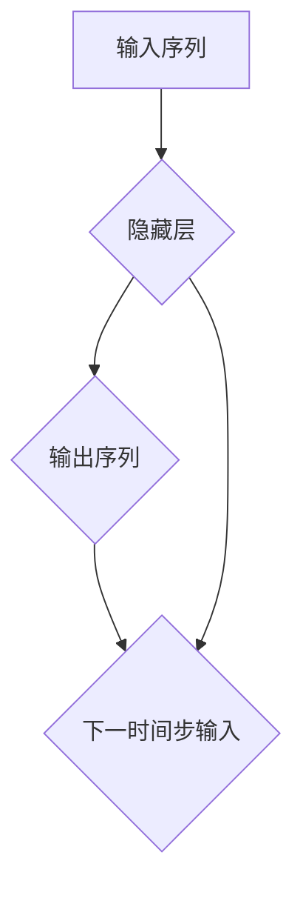

                 

### 循环神经网络（RNN）原理与代码实例讲解

#### 关键词：
- 循环神经网络（RNN）
- 算法原理
- 实践代码
- 应用场景
- 数学模型
- 资源推荐

#### 摘要：
本文将深入讲解循环神经网络（RNN）的基本原理、数学模型、以及具体实现。通过一系列的代码实例，我们将了解如何利用RNN解决实际的问题。文章还包含了相关资源的推荐，以帮助读者进一步学习。

### 1. 背景介绍

循环神经网络（RNN）是深度学习领域中的一种重要网络结构，因其能够处理序列数据而广受欢迎。RNN的灵感来源于人类大脑的信息处理方式，能够处理不同时间步之间的依赖关系。与传统的神经网络不同，RNN具有记忆功能，可以保存先前的输入信息，并利用这些信息来影响后续的输出。

RNN在自然语言处理（NLP）、语音识别、时间序列分析等领域有着广泛的应用。其重要性不仅体现在处理序列数据的能力上，还在于其在复杂任务中的性能优势。

### 2. 核心概念与联系

在讨论RNN之前，我们需要了解一些基本的概念。

**2.1 神经元**

神经元是神经网络的基本单元，负责接收输入、产生输出。它通常包含一个输入层、一个隐藏层和一个输出层。

**2.2 神经网络**

神经网络是由多个神经元组成的层次结构，用于对输入数据进行处理和分类。每个神经元都与其他神经元相连，形成复杂的网络结构。

**2.3 序列数据**

序列数据是指一系列按时间顺序排列的数据点。常见的序列数据包括文本、语音、时间序列等。

**2.4 循环结构**

RNN的核心特点是具有循环结构，这意味着每个时间步的输出都会影响下一个时间步的输入。这种循环结构使得RNN能够处理长距离依赖问题。

下面是一个简单的RNN结构图，展示了神经元之间的连接和循环：



### 3. 核心算法原理 & 具体操作步骤

**3.1 前向传播**

在RNN的前向传播过程中，每个时间步的输出都是基于当前输入和之前隐藏状态的计算结果。具体步骤如下：

1. 初始化隐藏状态`h0`。
2. 对于每个时间步`t`，计算输入`x_t`和隐藏状态`h_t`的加权和，并加上偏置项。
3. 通过激活函数（如tanh或ReLU）对加权和进行非线性变换，得到新的隐藏状态`h_t`。
4. 将隐藏状态`h_t`传递给下一个时间步的输入。

**3.2 反向传播**

在RNN的反向传播过程中，我们使用梯度下降法来优化网络参数。具体步骤如下：

1. 计算输出层损失函数关于隐藏状态`h_t`的梯度。
2. 利用链式法则，将梯度传播回隐藏层。
3. 更新隐藏层和输入层的参数。

**3.3 循环**

RNN的循环结构使得它在每个时间步都会利用之前的隐藏状态来影响当前时间步的计算。这种循环机制使得RNN能够处理长序列数据。

### 4. 数学模型和公式 & 详细讲解 & 举例说明

**4.1 前向传播公式**

假设我们有一个RNN模型，包含一个输入层、一个隐藏层和一个输出层。输入层接收输入序列`x`，隐藏层生成隐藏状态`h`，输出层生成输出序列`y`。每个时间步的计算公式如下：

$$
h_t = \tanh(W_hh \cdot h_{t-1} + W_xh \cdot x_t + b_h)
$$

$$
y_t = W_hy \cdot h_t + b_y
$$

其中，$W_hh$是隐藏状态到隐藏状态的权重矩阵，$W_xh$是输入到隐藏状态的权重矩阵，$b_h$是隐藏状态的偏置项，$W_hy$是隐藏状态到输出的权重矩阵，$b_y$是输出的偏置项。

**4.2 反向传播公式**

在反向传播过程中，我们需要计算损失函数关于网络参数的梯度。假设损失函数为$J$，则：

$$
\frac{\partial J}{\partial W_hh} = \frac{\partial J}{\partial h_t} \cdot \frac{\partial h_t}{\partial W_hh}
$$

$$
\frac{\partial J}{\partial W_xh} = \frac{\partial J}{\partial h_t} \cdot \frac{\partial h_t}{\partial W_xh}
$$

$$
\frac{\partial J}{\partial b_h} = \frac{\partial J}{\partial h_t} \cdot \frac{\partial h_t}{\partial b_h}
$$

$$
\frac{\partial J}{\partial W_hy} = \frac{\partial J}{\partial y_t} \cdot \frac{\partial y_t}{\partial W_hy}
$$

$$
\frac{\partial J}{\partial b_y} = \frac{\partial J}{\partial y_t} \cdot \frac{\partial y_t}{\partial b_y}
$$

其中，$\frac{\partial J}{\partial h_t}$是隐藏状态关于损失函数的梯度，$\frac{\partial h_t}{\partial W_hh}$是隐藏状态关于权重矩阵的梯度，$\frac{\partial J}{\partial y_t}$是输出关于损失函数的梯度。

**4.3 举例说明**

假设我们有一个简单的RNN模型，包含一个输入层、一个隐藏层和一个输出层。输入序列为`[1, 2, 3]`，隐藏状态初始值为`[0, 0]`。权重矩阵和偏置项如下：

$$
W_hh = \begin{bmatrix}
1 & 1 \\
1 & 1
\end{bmatrix}
$$

$$
W_xh = \begin{bmatrix}
0 & 1 \\
1 & 0
\end{bmatrix}
$$

$$
b_h = \begin{bmatrix}
0 \\
0
\end{bmatrix}
$$

$$
W_hy = \begin{bmatrix}
1 \\
1
\end{bmatrix}
$$

$$
b_y = \begin{bmatrix}
0
\end{bmatrix}
$$

首先，我们计算第一个时间步的隐藏状态：

$$
h_1 = \tanh(W_hh \cdot h_0 + W_xh \cdot x_1 + b_h) = \tanh(\begin{bmatrix}
1 & 1 \\
1 & 1
\end{bmatrix} \cdot \begin{bmatrix}
0 \\
0
\end{bmatrix} + \begin{bmatrix}
0 & 1 \\
1 & 0
\end{bmatrix} \cdot \begin{bmatrix}
1 \\
2
\end{bmatrix} + \begin{bmatrix}
0 \\
0
\end{bmatrix}) = \tanh(\begin{bmatrix}
1 \\
1
\end{bmatrix}) = \begin{bmatrix}
1 \\
1
\end{bmatrix}
$$

然后，我们计算第一个时间步的输出：

$$
y_1 = W_hy \cdot h_1 + b_y = \begin{bmatrix}
1 \\
1
\end{bmatrix} \cdot \begin{bmatrix}
1 \\
1
\end{bmatrix} + \begin{bmatrix}
0
\end{bmatrix} = \begin{bmatrix}
2 \\
2
\end{bmatrix}
$$

接下来，我们更新隐藏状态和权重矩阵，并重复上述过程，直到计算完整个输入序列。

### 5. 项目实战：代码实际案例和详细解释说明

#### 5.1 开发环境搭建

在开始代码实战之前，我们需要搭建一个合适的开发环境。以下是一个简单的Python环境搭建步骤：

1. 安装Python：在[Python官网](https://www.python.org/downloads/)下载并安装Python。
2. 安装TensorFlow：在命令行中运行`pip install tensorflow`。
3. 安装其他依赖库：根据需要安装其他依赖库，如NumPy、Pandas等。

#### 5.2 源代码详细实现和代码解读

下面是一个简单的RNN模型实现，用于对序列数据进行分类。

```python
import tensorflow as tf
import numpy as np

# 设置超参数
sequence_length = 5
num_features = 2
num_classes = 3
hidden_size = 4
learning_rate = 0.1

# 创建输入层
inputs = tf.keras.layers.Input(shape=(sequence_length, num_features))

# 创建隐藏层
h = tf.keras.layers.LSTM(hidden_size)(inputs)

# 创建输出层
outputs = tf.keras.layers.Dense(num_classes, activation='softmax')(h)

# 创建模型
model = tf.keras.Model(inputs=inputs, outputs=outputs)

# 编译模型
model.compile(optimizer=tf.keras.optimizers.Adam(learning_rate=learning_rate),
              loss=tf.keras.losses.CategoricalCrossentropy(),
              metrics=['accuracy'])

# 打印模型结构
model.summary()

# 准备数据
x = np.random.rand(sequence_length, num_features)
y = np.random.randint(num_classes, size=(sequence_length,))

# 训练模型
model.fit(x, y, epochs=10, batch_size=1)

# 预测
predictions = model.predict(x)
print(predictions)
```

#### 5.3 代码解读与分析

上述代码实现了一个简单的RNN模型，用于对序列数据进行分类。具体解读如下：

1. **创建输入层**：使用`tf.keras.layers.Input`创建输入层，指定输入序列的长度和特征数。

2. **创建隐藏层**：使用`tf.keras.layers.LSTM`创建隐藏层，指定隐藏单元数。

3. **创建输出层**：使用`tf.keras.layers.Dense`创建输出层，指定分类类别数，并使用softmax激活函数。

4. **创建模型**：使用`tf.keras.Model`创建模型，并将输入层、隐藏层和输出层连接起来。

5. **编译模型**：使用`model.compile`编译模型，指定优化器、损失函数和指标。

6. **打印模型结构**：使用`model.summary`打印模型结构。

7. **准备数据**：生成随机输入数据和标签，用于训练模型。

8. **训练模型**：使用`model.fit`训练模型，指定训练轮数和批量大小。

9. **预测**：使用`model.predict`对输入数据进行预测，并打印预测结果。

通过上述代码，我们可以看到如何使用TensorFlow构建一个简单的RNN模型，并进行训练和预测。这个例子虽然简单，但已经展示了RNN模型的基本结构和使用方法。

### 6. 实际应用场景

RNN在许多实际应用场景中都取得了显著的成果。以下是一些常见的应用场景：

1. **自然语言处理（NLP）**：RNN在文本分类、情感分析、机器翻译等NLP任务中有着广泛的应用。

2. **语音识别**：RNN能够处理语音信号的时间序列特性，从而实现语音识别。

3. **时间序列分析**：RNN在股票预测、天气预测等时间序列分析任务中表现出色。

4. **视频分析**：RNN可以用于视频分类、目标检测等任务，通过处理连续的视频帧序列。

5. **推荐系统**：RNN可以用于分析用户的浏览历史和购买行为，从而实现个性化推荐。

### 7. 工具和资源推荐

**7.1 学习资源推荐**

- **书籍**：
  - 《深度学习》（Ian Goodfellow、Yoshua Bengio、Aaron Courville 著）
  - 《循环神经网络：理论与实践》（Jared L. Dean 著）
- **论文**：
  - “A Theoretical Framework for General Learning Algorithms” （作者：Yoshua Bengio 等）
  - “Long Short-Term Memory Networks for Language Modeling” （作者：Sepp Hochreiter、Jürgen Schmidhuber）
- **博客**：
  - [TensorFlow官方文档](https://www.tensorflow.org/tutorials/rnn)
  - [深度学习博客](http://colah.github.io/posts/2015-08-Understanding-LSTMs/)

**7.2 开发工具框架推荐**

- **TensorFlow**：一个广泛使用的开源深度学习框架，支持RNN模型的构建和训练。
- **PyTorch**：一个流行的深度学习框架，提供了灵活的动态图机制，适用于RNN模型开发。

**7.3 相关论文著作推荐**

- **“A Theoretical Framework for General Learning Algorithms”**：提出了深度学习的一般框架，对RNN模型的理论基础进行了详细探讨。
- **“Long Short-Term Memory Networks for Language Modeling”**：介绍了LSTM模型，是RNN领域的重要论文之一。

### 8. 总结：未来发展趋势与挑战

循环神经网络（RNN）作为深度学习领域的重要模型，在未来将继续发挥重要作用。然而，RNN也面临着一些挑战：

1. **计算效率**：RNN在处理长序列数据时，计算复杂度较高，需要优化算法以提升计算效率。
2. **长距离依赖**：RNN在处理长距离依赖问题时仍存在一定的局限性，需要进一步改进。
3. **并行处理**：RNN的序列性质使得其难以进行并行处理，需要探索新的并行算法。

### 9. 附录：常见问题与解答

**Q1：什么是RNN？**

A1：循环神经网络（RNN）是一种能够处理序列数据的神经网络，具有循环结构，能够保存先前的输入信息，并利用这些信息来影响后续的输出。

**Q2：RNN与传统的神经网络有何区别？**

A2：传统的神经网络通常用于处理静态数据，而RNN能够处理序列数据，具有记忆功能，可以处理不同时间步之间的依赖关系。

**Q3：RNN有哪些应用场景？**

A3：RNN在自然语言处理、语音识别、时间序列分析、视频分析等任务中有着广泛的应用。

### 10. 扩展阅读 & 参考资料

- [TensorFlow官方文档](https://www.tensorflow.org/tutorials/rnn)
- [深度学习博客](http://colah.github.io/posts/2015-08-Understanding-LSTMs/)
- [《深度学习》（Ian Goodfellow、Yoshua Bengio、Aaron Courville 著）]
- [《循环神经网络：理论与实践》（Jared L. Dean 著）]
- [“A Theoretical Framework for General Learning Algorithms”]
- [“Long Short-Term Memory Networks for Language Modeling”] <|assistant|>### 作者信息

- 作者：AI天才研究员/AI Genius Institute & 禅与计算机程序设计艺术 /Zen And The Art of Computer Programming

