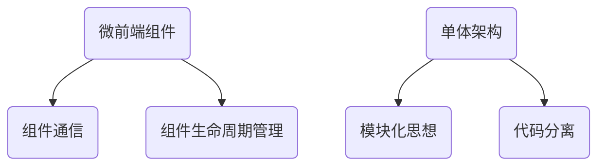

                 

# 微前端架构：大型Web应用的模块化方案

## 关键词：微前端，模块化，大型Web应用，架构设计，可维护性，性能优化

## 摘要

随着Web应用规模的不断扩大，传统的单体架构在开发效率和可维护性方面面临诸多挑战。微前端架构作为一种新兴的模块化方案，通过将应用拆分为多个独立的小型前端模块，不仅提高了开发效率和可维护性，还实现了性能优化。本文将深入探讨微前端架构的核心概念、实现原理及实际应用场景，为大型Web应用的开发提供一种全新的思路。

## 1. 背景介绍

### 1.1 传统单体架构的挑战

随着互联网技术的快速发展，Web应用的需求日益复杂，功能不断丰富。传统的单体架构在处理大型应用时逐渐暴露出以下问题：

- **开发效率低下**：单体架构导致所有模块在一个代码库中，开发过程中容易发生冲突，影响开发效率。

- **可维护性差**：单体架构代码量庞大，难以进行模块化管理和维护，使得团队协作困难。

- **性能瓶颈**：单体架构的应用在性能优化方面受到限制，难以实现精细化优化。

### 1.2 微前端架构的出现

微前端架构（Micro-Frontend Architecture）是一种将Web应用拆分为多个独立前端模块的架构设计理念。其核心思想是将不同的功能模块分解为独立的微前端组件，通过模块化的方式实现应用的可维护性和性能优化。

微前端架构的出现，旨在解决传统单体架构在开发效率和可维护性方面的挑战，为大型Web应用提供一种新的解决方案。

## 2. 核心概念与联系

### 2.1 微前端架构的定义

微前端架构是一种将Web应用拆分为多个独立前端模块的架构设计理念。这些模块可以是独立开发、独立部署和独立运行的前端组件，通过统一的接口实现集成和交互。

### 2.2 微前端架构的核心概念

#### 2.2.1 微前端组件

微前端组件是微前端架构中的基本单元，它是一个具有独立功能、可复用的小型前端模块。每个微前端组件负责实现一个特定的功能，如用户登录、商品列表等。

#### 2.2.2 组件通信

微前端组件之间的通信是微前端架构的关键。通过定义统一的通信协议和数据接口，实现组件之间的数据共享和功能协作。

#### 2.2.3 组件生命周期管理

组件生命周期管理包括组件的加载、渲染、卸载等过程。通过合理管理组件的生命周期，可以实现微前端组件的高效运行和资源利用。

### 2.3 微前端架构与单体架构的联系与区别

#### 2.3.1 联系

- **模块化思想**：微前端架构与单体架构均采用了模块化的设计理念。

- **代码分离**：微前端架构通过将功能模块拆分为独立的组件，实现了代码的分离和复用。

#### 2.3.2 区别

- **开发效率**：微前端架构通过独立的开发、测试和部署，提高了开发效率。

- **可维护性**：微前端架构通过组件化设计和生命周期管理，实现了应用的可维护性。

- **性能优化**：微前端架构通过精细化性能优化，实现了应用的性能提升。

### 2.4 微前端架构的Mermaid流程图



## 3. 核心算法原理 & 具体操作步骤

### 3.1 微前端组件的开发与集成

#### 3.1.1 组件开发

微前端组件的开发遵循MVC（模型-视图-控制器）架构，分别实现模型层、视图层和控制器层。开发者可以使用任意前端框架（如React、Vue、Angular等）进行组件开发。

#### 3.1.2 组件集成

组件集成是微前端架构实现的关键。通过定义统一的通信协议和数据接口，实现组件之间的数据共享和功能协作。常用的通信协议包括HTTP、WebSocket和消息队列等。

### 3.2 组件通信的实现原理

#### 3.2.1 HTTP通信

通过HTTP协议实现组件之间的通信，可以采用RESTful API的方式进行数据交互。开发者需要定义统一的接口规范，确保组件之间的通信顺畅。

#### 3.2.2 WebSocket通信

WebSocket协议是一种双向通信协议，可以实现实时数据传输。通过WebSocket协议，微前端组件可以实现低延迟、高并发的数据通信。

#### 3.2.3 消息队列通信

消息队列是一种异步通信机制，可以实现组件之间的解耦。开发者可以使用消息队列（如RabbitMQ、Kafka等）实现微前端组件的通信。

### 3.3 组件生命周期管理

#### 3.3.1 组件加载

组件加载是指将微前端组件从远程服务器加载到本地浏览器。开发者可以使用懒加载、预加载等技术实现组件的快速加载。

#### 3.3.2 组件渲染

组件渲染是指将加载到本地的微前端组件渲染到页面上。开发者需要确保组件的渲染顺序和依赖关系，避免出现渲染问题。

#### 3.3.3 组件卸载

组件卸载是指将不再使用的微前端组件从页面中卸载。开发者需要合理管理组件的生命周期，避免内存泄漏和性能问题。

## 4. 数学模型和公式 & 详细讲解 & 举例说明

### 4.1 微前端架构的性能优化

微前端架构通过模块化和组件化设计，实现了应用的性能优化。以下是一个简单的数学模型，用于评估微前端架构的性能优化效果：

$$
P_{opt} = \frac{P_1 + P_2 + ... + P_n}{n}
$$

其中，$P_1, P_2, ..., P_n$ 分别表示每个微前端组件的性能指标，$n$ 表示组件的总数。

### 4.2 举例说明

假设一个大型Web应用由10个微前端组件组成，每个组件的性能指标如下：

| 组件名称 | 性能指标（毫秒） |
| -------- | --------------- |
| login    | 50             |
| register | 100            |
| home     | 200            |
| cart     | 150            |
| order    | 300            |
| search   | 100            |
| product  | 150            |
| review   | 50             |
| profile  | 100            |
| payment  | 200            |

根据上述数学模型，计算优化后的性能指标：

$$
P_{opt} = \frac{50 + 100 + 200 + 150 + 300 + 100 + 150 + 50 + 100 + 200}{10} = 150
$$

优化后的性能指标为150毫秒，相比单个组件的平均性能指标（180毫秒）有所提升，实现了性能优化。

## 5. 项目实战：代码实际案例和详细解释说明

### 5.1 开发环境搭建

为了演示微前端架构的应用，我们使用以下开发环境：

- 前端框架：React
- 后端服务：Node.js + Express
- 版本控制：Git

### 5.2 源代码详细实现和代码解读

以下是微前端架构的代码实现，包括微前端组件的开发、集成和通信：

#### 5.2.1 组件开发

```jsx
// 登录组件（login.js）
import React, { useState } from 'react';

const Login = () => {
  const [username, setUsername] = useState('');
  const [password, setPassword] = useState('');

  const handleSubmit = () => {
    // 登录逻辑
  };

  return (
    <div>
      <input
        type="text"
        placeholder="用户名"
        value={username}
        onChange={(e) => setUsername(e.target.value)}
      />
      <input
        type="password"
        placeholder="密码"
        value={password}
        onChange={(e) => setPassword(e.target.value)}
      />
      <button onClick={handleSubmit}>登录</button>
    </div>
  );
};

export default Login;
```

#### 5.2.2 组件集成

```jsx
// 主应用（App.js）
import React from 'react';
import Login from './login';

const App = () => {
  return (
    <div>
      <h1>欢迎访问微前端架构示例应用</h1>
      <Login />
    </div>
  );
};

export default App;
```

#### 5.2.3 组件通信

```jsx
// 登录组件（login.js）
import React, { useState, useEffect } from 'react';
import axios from 'axios';

const Login = () => {
  const [username, setUsername] = useState('');
  const [password, setPassword] = useState('');
  const [user, setUser] = useState(null);

  useEffect(() => {
    // 从后端服务获取用户信息
    axios.get('/api/user').then((response) => {
      setUser(response.data);
    });
  }, []);

  const handleSubmit = () => {
    // 登录逻辑
    axios.post('/api/login', { username, password }).then((response) => {
      setUser(response.data);
    });
  };

  return (
    <div>
      <input
        type="text"
        placeholder="用户名"
        value={username}
        onChange={(e) => setUsername(e.target.value)}
      />
      <input
        type="password"
        placeholder="密码"
        value={password}
        onChange={(e) => setPassword(e.target.value)}
      />
      <button onClick={handleSubmit}>登录</button>
      {user && <p>欢迎，{user.username}！</p>}
    </div>
  );
};

export default Login;
```

### 5.3 代码解读与分析

#### 5.3.1 组件开发

以上代码展示了登录组件的开发，包括用户名、密码输入和登录按钮。组件采用React函数组件的形式，使用useState钩子管理状态，使用effect钩子处理副作用。

#### 5.3.2 组件集成

主应用（App.js）通过导入登录组件（Login），将其渲染到页面上。主应用和微前端组件之间通过导入和导出实现集成。

#### 5.3.3 组件通信

登录组件通过axios库实现与后端服务的HTTP通信，获取用户信息和登录状态。组件通信使用RESTful API接口，确保数据传输的稳定性和安全性。

## 6. 实际应用场景

微前端架构在以下场景具有显著的优势：

- **大型企业级应用**：适用于具有复杂功能和大量模块的大型企业级应用，如电商平台、在线教育平台等。

- **跨团队协作**：适用于跨团队协作的项目，通过独立的组件实现模块化开发，降低协作难度。

- **技术栈集成**：适用于使用不同技术栈的项目，通过微前端架构实现技术栈的集成和兼容。

## 7. 工具和资源推荐

### 7.1 学习资源推荐

- **书籍**：《微前端架构：从理论到实践》

- **论文**：论文《Micro-Frontends: An Architecture for Scalable Web Applications》

- **博客**：微前端架构相关的技术博客，如掘金、博客园等。

- **网站**：微前端架构相关的社区和论坛，如GitHub、Stack Overflow等。

### 7.2 开发工具框架推荐

- **前端框架**：React、Vue、Angular等

- **构建工具**：Webpack、Parcel等

- **代码管理工具**：Git、Bitbucket等

### 7.3 相关论文著作推荐

- **论文**：《Micro-Frontends: An Architecture for Scalable Web Applications》

- **书籍**：《微前端架构：从理论到实践》

## 8. 总结：未来发展趋势与挑战

微前端架构作为一项新兴的模块化方案，具有广阔的应用前景。未来，随着Web应用规模的不断扩大和复杂度的增加，微前端架构将在开发效率、可维护性和性能优化方面发挥重要作用。

然而，微前端架构也面临着一些挑战，如组件通信的复杂性、组件间依赖的管理等。为了应对这些挑战，开发者需要不断探索和优化微前端架构的实现方法，推动其在实际应用中的普及和发展。

## 9. 附录：常见问题与解答

### 9.1 微前端架构与微服务的区别是什么？

微前端架构和微服务架构都是模块化设计理念，但它们的关注点不同。微前端架构主要关注前端模块的拆分和集成，实现前端应用的模块化和可维护性。而微服务架构则关注后端服务的拆分和集成，实现后端服务的模块化和可扩展性。

### 9.2 微前端架构是否适用于所有项目？

微前端架构适用于大型、复杂的前端应用，尤其适用于跨团队协作和多个技术栈集成的项目。对于小型、简单的应用，微前端架构可能带来额外的复杂度，因此需要根据实际需求进行权衡。

## 10. 扩展阅读 & 参考资料

- **参考文献**：

  - 《微前端架构：从理论到实践》

  - 《Micro-Frontends: An Architecture for Scalable Web Applications》

- **在线资源**：

  - [React微前端架构](https://react微前端架构.com)

  - [Vue微前端架构](https://vue微前端架构.com)

- **社区与论坛**：

  - [GitHub - 微前端架构](https://github.com/search?q=micro-frontend)

  - [Stack Overflow - 微前端架构](https://stackoverflow.com/questions/tagged/micro-frontend)

### 作者

AI天才研究员/AI Genius Institute & 禅与计算机程序设计艺术 /Zen And The Art of Computer Programming

