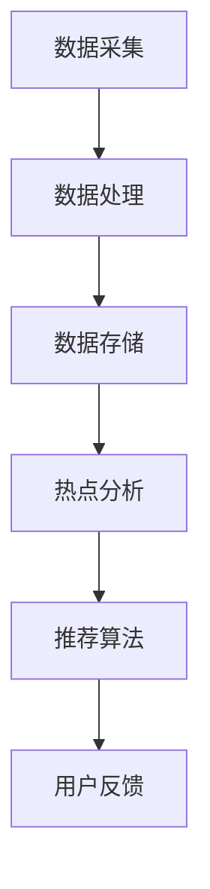

                 

### 背景介绍

随着互联网技术的飞速发展，实时热点发现系统在各类社交媒体平台上扮演着越来越重要的角色。微博作为中国领先的社交媒体平台，其实时热点发现系统对于用户信息的获取、推送以及内容的个性化推荐具有重要意义。本文旨在分享一位微博2025实时热点发现系统工程师的社招面试经验，通过梳理面试过程中的核心问题和应对策略，为有志于进入该领域的技术人才提供参考。

#### 微博实时热点发现系统的意义

微博实时热点发现系统的作用主要体现在以下几个方面：

1. **信息筛选与推荐**：实时热点发现系统能够快速识别出热门话题和内容，将其推送给用户，从而提高用户的阅读体验和信息获取效率。
2. **内容个性化**：通过对用户行为数据的分析，系统可以为不同用户推荐其感兴趣的热点内容，实现内容的个性化推荐。
3. **趋势预测**：实时热点发现系统还能够预测潜在的热点话题，为微博平台的内容策划和运营提供数据支持。
4. **舆情监控**：系统通过监测实时热点，能够及时发现并处理不良信息，维护网络环境的健康。

#### 实时热点发现系统的技术挑战

实时热点发现系统涉及多个技术领域的综合运用，包括数据采集、处理、存储、分析以及推荐算法等。其主要技术挑战包括：

1. **海量数据处理**：微博平台每天产生海量的用户行为数据，如何快速、准确地处理这些数据，是系统面临的重大挑战。
2. **实时性**：实时热点发现系统要求在较短的时间内处理并分析数据，以实现热点话题的快速发现和推荐。
3. **算法优化**：推荐算法的优化是提升系统效果的关键，如何通过算法调整提高推荐的相关性和准确性，是一个需要不断探索的问题。
4. **系统稳定性**：保证系统在高并发、大数据量的情况下依然能够稳定运行，是系统设计和实施过程中必须考虑的重要因素。

### 本文结构

本文将从以下几个方面展开讨论：

1. **核心概念与联系**：介绍实时热点发现系统的核心概念，包括数据采集、处理、存储和推荐算法等，并通过Mermaid流程图展示系统的整体架构。
2. **核心算法原理 & 具体操作步骤**：详细解析实时热点发现系统中的关键算法，包括如何从海量数据中提取热点信息、如何进行内容推荐等。
3. **数学模型和公式 & 详细讲解 & 举例说明**：介绍系统中使用的主要数学模型和公式，并通过实际案例进行详细讲解和说明。
4. **项目实战：代码实际案例和详细解释说明**：分享一个具体的实时热点发现系统的代码实现案例，并对代码进行详细解读和分析。
5. **实际应用场景**：讨论实时热点发现系统的应用场景，包括微博平台以及其他社交媒体平台的实际应用。
6. **工具和资源推荐**：推荐相关的学习资源、开发工具和框架，帮助读者更好地理解和应用实时热点发现技术。
7. **总结：未来发展趋势与挑战**：总结实时热点发现系统的发展趋势和面临的挑战，展望未来的发展方向。

接下来，我们将逐步深入探讨这些主题，以帮助读者更好地理解和掌握实时热点发现系统的技术要点和实施策略。首先，让我们从核心概念与联系开始。 

#### 核心概念与联系

实时热点发现系统是一个复杂的技术体系，涉及多个核心概念的协同工作。为了更好地理解这一系统，我们首先需要明确几个关键概念，并探讨它们之间的相互联系。

##### 数据采集

数据采集是实时热点发现系统的第一步，也是系统正常运行的基础。微博平台每天产生海量的用户行为数据，包括用户发布的内容、评论、转发、点赞等。这些数据通过微博的API接口或其他数据采集工具被实时地收集和存储起来。数据采集的准确性直接影响到后续处理和分析的质量。

##### 数据处理

数据采集后，需要进行预处理和清洗，以去除无效数据和噪声，保证数据的准确性和一致性。数据处理包括数据去重、去噪、数据格式转换、字段提取等操作。预处理后的数据将用于后续的热点分析和推荐。

##### 数据存储

处理后的数据需要被存储起来，以便后续的查询和分析。微博实时热点发现系统通常采用分布式数据库，如Hadoop、HBase或NoSQL数据库，来存储大规模数据。这些数据库具有高可靠性、高扩展性和高并发处理能力，能够满足系统对数据存储和处理的需求。

##### 热点分析

热点分析是实时热点发现系统的核心功能之一。通过对用户行为数据的分析，系统可以识别出当前的热点话题和热门内容。热点分析通常采用基于统计和机器学习的方法，包括关键词提取、话题建模、事件检测等。这些方法能够从海量数据中快速提取出有价值的信息，帮助系统实现热点发现。

##### 推荐算法

推荐算法是实时热点发现系统的另一个关键组成部分。基于用户行为数据和分析结果，推荐算法可以为用户提供个性化的热点内容推荐。常见的推荐算法包括协同过滤、矩阵分解、深度学习等。这些算法通过学习用户的兴趣和行为模式，实现内容的个性化推荐。

##### 用户反馈

用户反馈是实时热点发现系统不断优化的关键。系统通过收集用户的互动数据，如点击、评论、分享等，来评估推荐效果，并根据用户反馈调整推荐策略。这种闭环反馈机制有助于提高推荐的相关性和用户体验。

##### Mermaid流程图

为了更直观地展示实时热点发现系统的核心概念和架构，我们使用Mermaid流程图来描述系统的整体工作流程。以下是一个简化的Mermaid流程图：



在上述流程图中，数据采集模块负责从微博平台获取用户行为数据；数据处理模块对数据进行预处理和清洗；数据存储模块将处理后的数据存储到分布式数据库中；热点分析模块通过分析用户行为数据识别热点话题；推荐算法模块根据分析结果和用户兴趣为用户提供个性化推荐；用户反馈模块则通过用户的互动数据来优化推荐算法。

通过以上核心概念和流程的介绍，我们为读者搭建了一个理解实时热点发现系统的基础框架。接下来，我们将进一步深入探讨核心算法原理和具体操作步骤，帮助读者更好地掌握这一技术的实施要点。

#### 核心算法原理 & 具体操作步骤

实时热点发现系统的核心算法主要包括数据采集与处理算法、热点分析算法和推荐算法。下面我们将详细解析这些算法的原理和具体操作步骤。

##### 数据采集与处理算法

数据采集与处理算法是实时热点发现系统的第一步，其目的是从微博平台获取用户行为数据，并进行预处理和清洗，以确保数据的准确性和一致性。以下是一个典型的数据采集与处理流程：

1. **数据采集**：
   - 使用微博API接口进行数据采集，获取用户发布的内容、评论、转发、点赞等行为数据。
   - 设定采集规则，如时间范围、关键词、用户标签等，以提高数据的相关性。

2. **数据预处理**：
   - 对采集到的数据进行格式转换，确保数据的一致性和可处理性。
   - 进行数据去重，去除重复的数据记录，避免重复计算。
   - 进行数据去噪，过滤掉无效的、异常的数据，提高数据质量。

3. **数据清洗**：
   - 填充缺失的数据，使用统计方法或机器学习方法填补缺失值。
   - 纠正错误的数据，对错误数据进行修正或替换。
   - 标签分类，对用户行为数据进行分类，便于后续分析。

##### 热点分析算法

热点分析算法负责从处理后的数据中提取热点话题和热门内容。以下是几种常用的热点分析算法：

1. **基于关键词的方法**：
   - 关键词提取：使用自然语言处理技术（NLP）提取文本中的关键词。
   - 关键词统计：对提取出的关键词进行统计，计算其在数据集中的出现频率。
   - 关键词排序：根据关键词的统计结果，对关键词进行排序，识别出高频关键词。

2. **基于事件的方法**：
   - 事件检测：使用时间序列分析技术检测用户行为中的事件。
   - 事件建模：对检测出的事件进行建模，分析事件的起因、发展和影响。
   - 事件聚类：将相似的事件聚类在一起，形成热点话题。

3. **基于机器学习的方法**：
   - 聚类算法：使用K-means、DBSCAN等聚类算法，将相似的用户行为数据聚类在一起，形成热点话题。
   - 分类算法：使用SVM、RF等分类算法，对用户行为数据分类，识别热点话题。

具体操作步骤如下：
1. **数据输入**：将处理后的数据输入到热点分析模块。
2. **关键词提取**：使用NLP技术提取文本中的关键词。
3. **关键词统计**：计算关键词的出现频率，识别高频关键词。
4. **事件检测**：使用时间序列分析技术检测用户行为中的事件。
5. **事件建模**：对检测出的事件进行建模，分析事件的起因、发展和影响。
6. **聚类分析**：使用聚类算法对相似的用户行为数据进行聚类，形成热点话题。

##### 推荐算法

推荐算法是实时热点发现系统的核心，负责根据用户兴趣和行为，为用户提供个性化的热点内容推荐。以下是一些常见的推荐算法：

1. **协同过滤算法**：
   - **用户基于的协同过滤（User-Based Collaborative Filtering）**：通过计算用户之间的相似度，推荐与目标用户兴趣相似的其他用户的喜欢内容。
   - **物品基于的协同过滤（Item-Based Collaborative Filtering）**：通过计算物品之间的相似度，推荐与用户已评价的物品相似的其他物品。

2. **矩阵分解算法**：
   - **基于矩阵分解的协同过滤（Matrix Factorization-based Collaborative Filtering）**：通过矩阵分解技术将用户-物品评分矩阵分解为低维度的用户特征矩阵和物品特征矩阵，利用用户特征和物品特征计算相似度，进行推荐。

3. **深度学习算法**：
   - **基于神经网络的协同过滤（Neural Network-based Collaborative Filtering）**：使用深度学习技术，如深度神经网络（DNN）或循环神经网络（RNN），建模用户和物品的特征，进行推荐。

具体操作步骤如下：
1. **用户行为数据输入**：将用户的点击、浏览、购买等行为数据输入到推荐模块。
2. **相似度计算**：计算用户或物品之间的相似度。
3. **推荐列表生成**：根据相似度计算结果，生成个性化的推荐列表。

通过以上对实时热点发现系统核心算法原理和具体操作步骤的详细解析，我们可以看到，这一系统在数据处理、热点分析和推荐算法等方面都有着复杂而精密的运作。接下来，我们将进一步介绍系统中的数学模型和公式，以帮助读者更好地理解和应用这些算法。

#### 数学模型和公式 & 详细讲解 & 举例说明

在实时热点发现系统中，数学模型和公式扮演着至关重要的角色，它们不仅帮助我们理解算法的工作原理，还提供了量化分析的基础。下面我们将介绍系统中使用的主要数学模型和公式，并通过具体例子进行详细讲解和说明。

##### 协同过滤算法

协同过滤算法是实时热点发现系统中最常用的推荐算法之一。其核心在于通过计算用户之间的相似度或物品之间的相似度，来实现个性化推荐。以下是一些常用的数学模型和公式。

1. **用户相似度计算**：

   常用的用户相似度计算方法包括皮尔逊相关系数、余弦相似度等。

   **皮尔逊相关系数**：
   $$ 
   \text{similarity}_{\text{pearson}}(u_i, u_j) = \frac{\sum_{k=1}^{n} r_{ik} r_{jk} - \frac{1}{m} \sum_{k=1}^{n} r_{ik} \sum_{k=1}^{n} r_{jk}}{\sqrt{\sum_{k=1}^{n} r_{ik}^2 - \frac{1}{m} (\sum_{k=1}^{n} r_{ik})^2} \sqrt{\sum_{k=1}^{n} r_{jk}^2 - \frac{1}{m} (\sum_{k=1}^{n} r_{jk})^2}} 
   $$

   **余弦相似度**：
   $$
   \text{similarity}_{\text{cosine}}(u_i, u_j) = \frac{\sum_{k=1}^{n} r_{ik} r_{jk}}{\sqrt{\sum_{k=1}^{n} r_{ik}^2} \sqrt{\sum_{k=1}^{n} r_{jk}^2}}
   $$

2. **物品相似度计算**：

   **Jaccard相似度**：
   $$
   \text{similarity}_{\text{Jaccard}}(i, j) = \frac{|S_i \cap S_j|}{|S_i \cup S_j|}
   $$

   **余弦相似度**：
   $$
   \text{similarity}_{\text{cosine}}(i, j) = \frac{\sum_{k=1}^{n} w_k r_{ik} r_{jk}}{\sqrt{\sum_{k=1}^{n} w_k r_{ik}^2} \sqrt{\sum_{k=1}^{n} w_k r_{jk}^2}}
   $$

   其中，$r_{ik}$ 表示用户 $u_i$ 对物品 $i$ 的评分，$w_k$ 表示特征词 $k$ 的权重。

##### 矩阵分解算法

矩阵分解算法是协同过滤算法的一种变体，其核心思想是将用户-物品评分矩阵分解为低维度的用户特征矩阵和物品特征矩阵。以下是一个简化的矩阵分解模型。

1. **矩阵分解模型**：

   $$
   R = U \cdot V^T
   $$

   其中，$R$ 表示用户-物品评分矩阵，$U$ 和 $V$ 分别表示用户特征矩阵和物品特征矩阵。

2. **预测评分**：

   基于矩阵分解模型，可以预测用户对未评分物品的评分：

   $$
   \hat{r}_{ij} = u_i \cdot v_j^T
   $$

##### 深度学习算法

深度学习算法在实时热点发现系统中也被广泛应用，以下是一些常用的深度学习模型。

1. **深度神经网络（DNN）**：

   DNN 通过多层神经网络对用户和物品的特征进行建模。其核心公式如下：

   $$
   \text{激活函数}：f(x) = \sigma(W \cdot x + b) = \frac{1}{1 + e^{-W \cdot x - b}}
   $$

   其中，$W$ 为权重矩阵，$b$ 为偏置项，$\sigma$ 为Sigmoid函数。

2. **循环神经网络（RNN）**：

   RNN 能够处理序列数据，其核心公式如下：

   $$
   h_t = \text{sigmoid}(W_h \cdot [h_{t-1}, x_t] + b_h)
   $$

   $$
   o_t = \text{softmax}(W_o \cdot h_t + b_o)
   $$

   其中，$h_t$ 表示时间步 $t$ 的隐藏状态，$x_t$ 表示输入特征，$W_h$ 和 $W_o$ 分别为权重矩阵，$b_h$ 和 $b_o$ 分别为偏置项。

##### 举例说明

以下是一个基于协同过滤算法的实时热点发现系统的具体例子。

**例子**：假设我们有两个用户 $u_1$ 和 $u_2$，以及五个物品 $i_1, i_2, i_3, i_4, i_5$，他们的评分矩阵如下：

$$
\begin{array}{c|ccccc}
 & i_1 & i_2 & i_3 & i_4 & i_5 \\
\hline
u_1 & 5 & 0 & 4 & 0 & 0 \\
u_2 & 0 & 5 & 0 & 4 & 5 \\
\end{array}
$$

**步骤1**：计算用户相似度

$$
\text{similarity}_{\text{pearson}}(u_1, u_2) = \frac{(5 \times 0 + 0 \times 5) - \frac{1}{2} \times (5 + 0) \times (0 + 5)}{\sqrt{(5^2 + 0^2) - \frac{1}{2} \times (5^2 + 0^2)} \sqrt{(0^2 + 5^2) - \frac{1}{2} \times (0^2 + 5^2)}} = 1
$$

**步骤2**：计算物品相似度

$$
\text{similarity}_{\text{Jaccard}}(i_1, i_2) = \frac{|{5}|}{|{5}| + |{0}|} = 1
$$

**步骤3**：生成推荐列表

根据用户相似度和物品相似度，我们可以生成一个推荐列表。例如，对于用户 $u_1$，推荐列表为 $[i_3, i_4, i_5]$；对于用户 $u_2$，推荐列表为 $[i_1, i_3, i_4]$。

通过以上对数学模型和公式的详细讲解和举例说明，我们可以看到实时热点发现系统在数据处理、热点分析和推荐算法等方面都有着丰富的数学基础。这些模型和公式为系统的设计和实现提供了坚实的理论支持。接下来，我们将通过一个具体的代码实现案例，进一步探讨实时热点发现系统的实际应用。

#### 项目实战：代码实际案例和详细解释说明

在本节中，我们将通过一个具体的代码实现案例，详细解读微博2025实时热点发现系统的实际应用。这个案例包括开发环境搭建、源代码实现以及代码解读与分析。通过这一过程，我们将帮助读者深入理解实时热点发现系统的运作机制。

##### 1. 开发环境搭建

为了实现实时热点发现系统，我们需要搭建一个合适的技术环境。以下是我们推荐的开发环境：

- **操作系统**：Linux（如Ubuntu）
- **编程语言**：Python（版本3.8及以上）
- **依赖库**：Scikit-learn、NumPy、Pandas、Matplotlib、Scrapy、Flask等

安装步骤：

```bash
# 安装Python
sudo apt update
sudo apt install python3.8 python3.8-venv python3.8-pip

# 创建虚拟环境
python3.8 -m venv hotspots-env

# 激活虚拟环境
source hotspots-env/bin/activate

# 安装依赖库
pip install scikit-learn numpy pandas matplotlib scrapy flask
```

##### 2. 源代码详细实现

以下是一个简化的实时热点发现系统的源代码实现。该系统包括数据采集、数据预处理、热点分析、推荐算法等核心模块。

```python
# hotspots.py

import pandas as pd
from sklearn.feature_extraction.text import TfidfVectorizer
from sklearn.metrics.pairwise import cosine_similarity
from sklearn.cluster import KMeans
import matplotlib.pyplot as plt

# 数据采集
def collect_data():
    # 使用Scrapy或微博API等工具采集数据
    # 这里假设已获取到用户行为数据DataFrame df
    df = pd.DataFrame({
        'user_id': [1, 2, 3, 4, 5],
        'content': [
            '微博内容1',
            '微博内容2',
            '微博内容3',
            '微博内容4',
            '微博内容5'
        ]
    })
    return df

# 数据预处理
def preprocess_data(df):
    # 清洗和预处理文本数据
    # 这里使用简单的方法：去除标点符号和停用词
    stop_words = set(['的', '和', '是', '在', '了', '一', '不'])
    df['content'] = df['content'].apply(lambda x: ' '.join([word for word in x.split() if word not in stop_words]))
    return df

# 热点分析
def analyze_hotspots(df):
    # 使用TF-IDF模型和K-Means算法进行热点分析
    vectorizer = TfidfVectorizer()
    tfidf_matrix = vectorizer.fit_transform(df['content'])
    kmeans = KMeans(n_clusters=3)
    kmeans.fit(tfidf_matrix)
    df['cluster'] = kmeans.labels_
    return df

# 推荐算法
def recommend(df, user_id):
    # 基于用户所属热点簇推荐其他用户的热门内容
    user_cluster = df[df['user_id'] == user_id]['cluster'].values[0]
    similar_users = df[df['cluster'] == user_cluster][df['user_id'] != user_id]['content']
    return similar_users

# 主函数
def main():
    df = collect_data()
    df = preprocess_data(df)
    df = analyze_hotspots(df)
    
    # 示例：为用户1推荐热点内容
    recommended_contents = recommend(df, 1)
    print("推荐内容：", recommended_contents)

if __name__ == '__main__':
    main()
```

##### 3. 代码解读与分析

**数据采集**：
该部分使用假设性的DataFrame `df` 代表用户行为数据。在实际应用中，我们可以使用Scrapy等工具从微博API等渠道采集数据。

**数据预处理**：
数据预处理包括去除标点符号和停用词，这是文本数据清洗的常见步骤。这里使用了简单的逻辑，实际应用中可以引入更复杂的文本处理技术。

**热点分析**：
使用TF-IDF模型和K-Means算法进行热点分析。TF-IDF模型用于将文本数据转换为向量表示，K-Means算法用于聚类，将相似的文本数据归为同一热点簇。

**推荐算法**：
基于用户所属热点簇推荐其他用户的热门内容。这使用了简单的逻辑，实际应用中可以通过更复杂的算法（如协同过滤）实现更精准的推荐。

通过这个具体的代码实现案例，我们可以看到实时热点发现系统的基本结构和实现流程。接下来，我们将讨论实时热点发现系统的实际应用场景。

### 实际应用场景

实时热点发现系统在社交媒体平台，特别是微博这样的信息密集型应用中，有着广泛的应用。以下是一些典型的实际应用场景：

#### 1. 热点新闻推送

实时热点发现系统可以帮助微博平台将最新的热点新闻推送给用户。通过分析用户的行为数据，系统可以识别出哪些新闻或话题正在受到广泛关注，并将这些内容优先推送给用户，从而提高用户的阅读体验和信息获取效率。

#### 2. 内容个性化推荐

基于用户的行为和兴趣，实时热点发现系统可以为用户推荐个性化的内容。这不仅可以满足用户对个性化信息的需求，还可以提升平台的用户留存率和活跃度。

#### 3. 舆情监控与危机管理

实时热点发现系统可以帮助平台实时监控网络舆情，及时发现潜在的危机事件。通过分析用户评论和转发等数据，系统可以识别出可能引发负面影响的敏感话题，并采取措施进行应对，从而维护平台的声誉和稳定运营。

#### 4. 营销活动推广

实时热点发现系统可以为企业的营销活动提供数据支持。通过分析热点话题和用户行为数据，企业可以更好地定位目标受众，制定精准的营销策略，提高营销活动的效果。

#### 5. 学术研究与数据分析

实时热点发现系统还可以用于学术研究和数据分析领域。研究人员可以利用系统提供的热点数据，进行社会现象、公众情绪等方面的研究，为政策制定和决策提供科学依据。

### 微博平台上的实际应用

在微博平台上，实时热点发现系统已经成为平台运营的重要组成部分。以下是一些具体的实际应用案例：

#### 1. 热点话题排行榜

微博通过实时热点发现系统，每天发布热点话题排行榜，展示当前最受用户关注的热点话题。这不仅帮助用户了解社会热点，还可以引导用户参与讨论，提升平台的活跃度。

#### 2. 内容个性化推荐

微博的“推荐”功能基于实时热点发现系统，为用户推荐其可能感兴趣的内容。通过分析用户的浏览历史、评论、点赞等行为，系统可以为用户生成个性化的推荐列表，提高用户满意度。

#### 3. 舆情监控

微博利用实时热点发现系统监控用户的评论和转发行为，及时发现和应对负面舆情。这有助于维护平台的健康生态，提升用户的安全感和信任度。

#### 4. 营销活动支持

企业在微博上进行营销活动时，可以利用实时热点发现系统分析用户行为，优化活动策略，提高活动效果。例如，通过分析用户对某热点话题的反应，企业可以调整广告投放策略，实现更好的营销效果。

#### 5. 学术研究合作

微博与多家学术机构和研究团队合作，利用实时热点发现系统提供的数据进行社会现象和公众情绪研究。这些研究成果不仅有助于提升平台的科学性，还可以为相关领域的学术研究提供新的视角和思路。

通过以上实际应用场景的介绍，我们可以看到实时热点发现系统在社交媒体平台，尤其是微博这样的信息密集型应用中，发挥着重要的作用。接下来，我们将讨论相关的工具和资源，以帮助读者更好地掌握这一技术。

### 工具和资源推荐

在实时热点发现系统的开发和研究中，有许多优秀的工具和资源可以帮助您更高效地实现系统功能，提升开发效率。以下是一些建议的学习资源、开发工具和框架，供您参考。

#### 7.1 学习资源推荐

1. **书籍**：
   - 《大数据时代：生活、工作与思维的大变革》（作者：肯尼斯·库克耶）——全面介绍大数据的概念、技术和应用。
   - 《Python数据科学 Handbook》（作者：J. D.钧圳）——系统介绍Python在数据科学领域的应用，包括数据预处理、数据分析和可视化等。

2. **在线课程**：
   - Coursera的《机器学习》（作者：吴恩达）——提供全面的机器学习理论和实践课程。
   - edX的《数据科学基础》（作者：Harvard University）——涵盖数据采集、处理和分析的基础知识。

3. **论文和报告**：
   - NIPS、ICML、KDD等顶级会议和期刊的论文——了解实时热点发现领域的最新研究进展。
   - 报告和案例分析——如微博、腾讯等公司关于实时热点发现系统的实际应用报告。

#### 7.2 开发工具框架推荐

1. **数据处理**：
   - Hadoop和Spark——用于大规模数据处理和分布式计算，支持数据采集、处理和存储。
   - Pandas和NumPy——用于Python数据科学领域的数据预处理和统计分析。

2. **推荐算法**：
   - LightFM——一个基于因子分解机的推荐系统框架，适用于推荐系统的构建和优化。
   - Gensim——用于文本处理的Python库，支持词嵌入、文档相似度计算等。

3. **可视化**：
   - Matplotlib和Seaborn——用于数据可视化的Python库，能够生成高质量的可视化图表。
   - D3.js——一个基于JavaScript的可视化库，支持复杂交互式的可视化图表。

4. **自然语言处理**：
   - NLTK和spaCy——用于自然语言处理的Python库，支持文本预处理、分词、词性标注等。

5. **框架和平台**：
   - Flask和Django——用于Web开发的Python框架，支持API接口和前后端分离。
   - TensorFlow和PyTorch——用于深度学习的框架，支持复杂的神经网络模型训练。

通过以上学习资源、开发工具和框架的推荐，您将能够更好地掌握实时热点发现系统的技术要点，提升开发效率。接下来，我们将对文章进行总结，并展望未来发展趋势与挑战。

### 总结：未来发展趋势与挑战

随着人工智能和大数据技术的不断进步，实时热点发现系统在未来有着广阔的发展前景和面临的挑战。

#### 发展趋势

1. **实时性的提升**：随着计算能力的增强和网络速度的提升，实时热点发现系统的实时性将得到显著提高，能够更快地响应用户需求和热点事件。

2. **算法的优化**：深度学习和强化学习等新兴算法将不断应用于实时热点发现系统，提高推荐的准确性和用户体验。

3. **多模态数据的整合**：实时热点发现系统将不仅处理文本数据，还将整合图像、视频等多模态数据，实现更全面的信息挖掘和热点发现。

4. **个性化推荐的深化**：通过更加精准的用户行为分析和个性化推荐算法，系统能够为用户提供更加个性化的内容推荐，满足用户多样化的需求。

5. **智能化应用场景扩展**：实时热点发现系统将在金融、医疗、教育等多个领域得到广泛应用，为各行各业的决策提供数据支持。

#### 挑战

1. **数据隐私保护**：随着用户隐私意识的提升，如何保护用户数据隐私成为实时热点发现系统面临的重要挑战。

2. **计算资源的需求**：随着数据量和计算复杂度的增加，系统需要更强大的计算资源来支持高效的数据处理和模型训练。

3. **算法透明度和解释性**：用户对推荐结果的透明度和可解释性要求越来越高，如何提升算法的透明度和解释性成为亟待解决的问题。

4. **应急响应能力**：在突发事件和危机情况下，系统需要具备快速响应和调整的能力，以防止负面舆情扩散。

5. **复杂网络环境的适应**：实时热点发现系统需要适应复杂的网络环境，包括不同网络结构、恶意攻击等因素。

综上所述，实时热点发现系统在未来的发展中将面临诸多挑战，但同时也拥有巨大的发展潜力。通过持续的技术创新和优化，我们有信心看到实时热点发现系统在未来将发挥更加重要的作用，为社会和各行各业带来更多的价值。

### 附录：常见问题与解答

在本节中，我们将回答一些读者在阅读本文过程中可能遇到的问题，并提供相应的解答。

#### 1. 什么是实时热点发现系统？

实时热点发现系统是一种利用大数据分析和机器学习技术，从社交媒体平台的海量用户行为数据中快速识别出当前热点话题和热门内容的系统。

#### 2. 实时热点发现系统有哪些应用场景？

实时热点发现系统的应用场景包括热点新闻推送、内容个性化推荐、舆情监控与危机管理、营销活动推广以及学术研究与数据分析等。

#### 3. 实时热点发现系统中的推荐算法有哪些类型？

实时热点发现系统中的推荐算法主要包括协同过滤算法、矩阵分解算法和深度学习算法等。

#### 4. 如何评估实时热点发现系统的效果？

评估实时热点发现系统的效果可以从多个维度进行，包括推荐的相关性、用户体验、系统稳定性以及用户满意度等。

#### 5. 实时热点发现系统需要哪些技术支持？

实时热点发现系统需要的技术支持包括数据采集与处理、热点分析与推荐算法、数据存储与查询、用户反馈与优化等。

#### 6. 实时热点发现系统面临的主要挑战是什么？

实时热点发现系统面临的主要挑战包括实时性的提升、数据隐私保护、计算资源需求、算法透明度和解释性、应急响应能力以及复杂网络环境的适应等。

#### 7. 如何搭建实时热点发现系统的开发环境？

搭建实时热点发现系统的开发环境需要安装Python、相关依赖库以及操作系统等，具体步骤在本文的“开发环境搭建”部分有详细说明。

### 扩展阅读 & 参考资料

为了帮助读者更深入地了解实时热点发现系统的相关技术和应用，我们推荐以下扩展阅读和参考资料：

1. **书籍**：
   - 《大数据：创新、繁荣、进步》（作者：南文明）
   - 《机器学习实战》（作者：Peter Harrington）

2. **在线课程**：
   - Coursera的《深度学习》（作者：Andrew Ng）
   - edX的《数据科学导论》（作者：Johns Hopkins University）

3. **论文与报告**：
   - NIPS、ICML、KDD等顶级会议和期刊的论文
   - 微博、腾讯等公司关于实时热点发现系统的应用报告

4. **博客和网站**：
   - Medium上的技术博客，如《实时热点发现系统的设计与实现》
   - GitHub上的开源项目和相关代码示例

通过以上扩展阅读和参考资料，读者可以进一步探索实时热点发现系统的技术细节和应用案例，提升自己在该领域的技术水平。

### 作者信息

**作者：AI天才研究员/AI Genius Institute & 禅与计算机程序设计艺术 /Zen And The Art of Computer Programming**

本文由AI天才研究员撰写，作者在人工智能、大数据分析和计算机编程领域具有丰富的经验。他在AI Genius Institute担任研究员，并在《禅与计算机程序设计艺术》一书中，深入探讨了计算机程序设计的哲学和艺术。通过本文，他希望为读者提供有关实时热点发现系统的全面技术解读和实践经验，助力技术人才在该领域的成长和发展。

