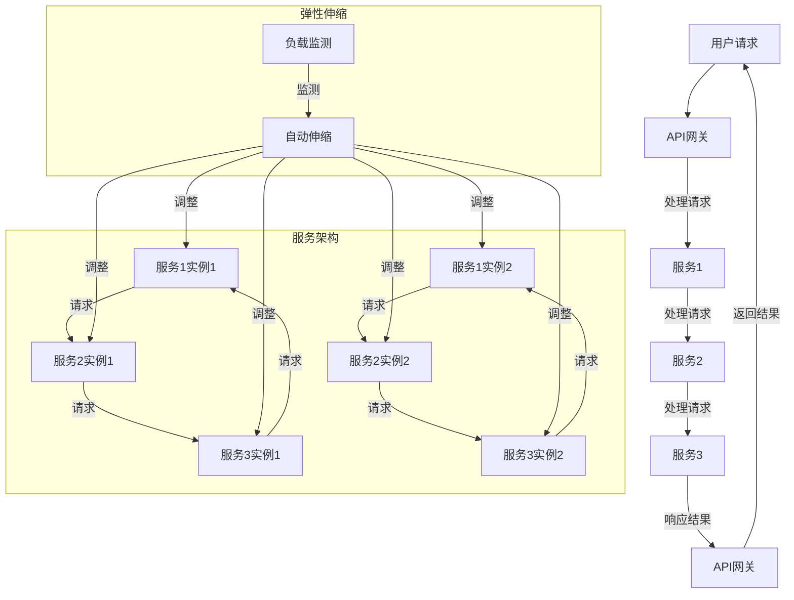

                 

### 背景介绍

在现代信息技术飞速发展的背景下，微服务架构作为一种新兴的软件设计方法，正逐渐成为企业实现高扩展性的首选方案。微服务架构通过将大型单体应用拆分成多个独立、小型、松耦合的服务，从而提高了系统的可扩展性、可维护性和灵活性。高扩展性是现代应用系统必须具备的关键能力，它不仅能够应对日益增长的并发访问需求，还能保证系统在面对故障和压力时保持稳定运行。

高扩展性之所以重要，原因有以下几点：

1. **应对增长的用户需求**：随着互联网的普及和用户数量的不断攀升，应用系统需要能够快速响应和支撑更多的用户请求。
2. **提升系统的稳定性**：在用户访问量剧增时，传统单体应用往往会出现性能瓶颈和系统崩溃现象。高扩展性可以有效地分散系统负载，提升整体稳定性。
3. **灵活的业务迭代**：业务需求变化迅速，高扩展性使得系统能够快速适应业务变化，实现灵活的迭代和更新。
4. **降低维护成本**：通过拆分成多个小型服务，故障隔离和系统维护变得更加容易，从而降低维护成本。

微服务架构通过以下几方面实现了高扩展性：

- **水平扩展（Scaling Out）**：通过增加服务实例的数量，来处理更多的请求。
- **弹性伸缩（Auto Scaling）**：根据实际负载自动调整服务实例的数量。
- **服务拆分与集成**：将大型应用拆分成多个独立服务，每个服务都可以独立扩展和优化。
- **分布式架构**：多个服务部署在分布式环境中，利用分布式计算的优势提升系统性能。

在本文中，我们将详细探讨微服务在高扩展性中的优势，通过分析核心概念、算法原理、实际应用案例以及未来发展趋势，帮助读者全面理解微服务架构在提升系统扩展性方面的关键作用。

> 关键词：微服务，高扩展性，水平扩展，弹性伸缩，服务拆分，分布式架构

> 摘要：
本文将深入探讨微服务架构在实现高扩展性方面的优势。通过分析微服务的核心概念、架构设计、算法原理以及实际应用案例，本文将帮助读者理解如何利用微服务技术应对现代应用系统面临的扩展性挑战。此外，文章还将探讨未来微服务技术的发展趋势和潜在挑战，为读者提供有价值的参考。

### 2. 核心概念与联系

要深入理解微服务在高扩展性中的优势，首先需要了解微服务的核心概念及其与其他技术架构的联系。以下是对微服务、分布式架构、服务拆分、弹性伸缩等关键概念的介绍和联系分析。

#### 微服务的定义与特点

**定义**：
微服务（Microservices）是一种设计方法，将大型单体应用拆分成多个独立、小型、松耦合的服务。每个服务都有自己的业务功能、数据库和数据模型，能够独立开发和部署。

**特点**：
1. **独立性**：每个服务可以独立开发、测试和部署，不需要依赖于其他服务。
2. **自治性**：每个服务有自己的数据存储和业务逻辑，可以独立扩展和更新。
3. **松耦合**：服务之间通过轻量级协议（如HTTP/HTTPS、REST、gRPC等）进行通信，相互独立。
4. **可复用性**：服务可以跨项目复用，提高了代码复用率。

#### 分布式架构

**定义**：
分布式架构（Distributed Architecture）是一种将系统组件分布在不同节点上，通过网络进行通信和协作的架构设计。

**特点**：
1. **高可用性**：分布式架构通过多个节点实现冗余，提高了系统的容错性和高可用性。
2. **高扩展性**：系统可以根据需求动态扩展节点，处理更多的请求。
3. **性能优化**：通过分布式计算，可以充分利用多台服务器的计算能力，提高系统性能。

**微服务与分布式架构的联系**：
微服务架构是分布式架构的一种实现方式。微服务通过分布式部署和通信，实现了高可用性和高扩展性。分布式架构中的各个节点可以是微服务的实例，也可以是其他类型的组件（如数据库、消息队列等）。

#### 服务拆分

**定义**：
服务拆分（Service Decomposition）是将一个大型应用拆分成多个小型服务的过程。

**过程**：
1. **识别业务功能**：分析业务需求，识别出不同的业务功能。
2. **划分服务边界**：根据业务功能，将应用拆分成多个独立的服务。
3. **定义服务接口**：为每个服务定义接口，确定服务之间的通信协议和数据格式。

**服务拆分的目的**：
1. **提升系统可扩展性**：将大型应用拆分成小型服务，每个服务可以独立扩展和优化。
2. **提高开发效率**：独立开发和部署每个服务，提高开发效率。
3. **降低维护成本**：服务独立，故障隔离和系统维护变得更加容易。

#### 弹性伸缩

**定义**：
弹性伸缩（Elastic Scaling）是一种根据实际负载动态调整系统资源（如服务实例数量）的能力。

**机制**：
1. **水平扩展**（Scaling Out）：增加服务实例的数量，以处理更多的请求。
2. **垂直扩展**（Scaling Up）：增加单个服务实例的硬件资源（如CPU、内存等），以提高其处理能力。

**弹性伸缩的目的**：
1. **应对负载变化**：根据实际负载动态调整资源，保证系统在高负载时能够稳定运行。
2. **优化资源利用**：在低负载时减少资源消耗，降低成本。

**微服务与弹性伸缩的联系**：
微服务架构支持弹性伸缩，通过自动伸缩机制，可以根据负载自动增加或减少服务实例数量。弹性伸缩能够充分利用微服务的独立性、自治性和松耦合特性，实现高效、灵活的资源管理。

#### Mermaid 流程图

为了更直观地展示微服务的架构和联系，以下是一个使用Mermaid绘制的流程图：



这张流程图展示了用户请求如何通过API网关分发到各个微服务实例，以及微服务的弹性伸缩机制。通过这种架构，系统可以灵活应对负载变化，保证高扩展性和稳定性。

通过以上对微服务、分布式架构、服务拆分、弹性伸缩等核心概念及其联系的分析，我们可以更深入地理解微服务架构在高扩展性中的重要作用。在接下来的章节中，我们将进一步探讨微服务的算法原理、具体操作步骤以及数学模型，帮助读者全面掌握微服务的高扩展性实现方法。

### 3. 核心算法原理 & 具体操作步骤

#### 核心算法原理

微服务架构的核心在于如何将一个大型单体应用拆分成多个独立、小型、松耦合的服务。这一过程涉及到以下几个关键算法原理：

1. **服务发现与服务注册**：
   服务注册是指每个服务实例在启动时向服务注册中心注册自己，服务发现是指客户端通过服务注册中心获取服务实例的地址。服务注册与服务发现是实现服务之间松耦合的关键。

2. **负载均衡**：
   负载均衡是将请求分发到多个服务实例上，以实现负载均衡和性能优化。常用的负载均衡算法有轮询（Round Robin）、最少连接（Least Connections）、加权轮询（Weighted Round Robin）等。

3. **分布式事务**：
   微服务中的事务需要跨越多个服务实例，分布式事务提供了一种确保多个服务实例操作一致性的机制。常用的分布式事务方案有TCC（Try-Confirm-Cancel）、SAGA、两阶段提交（2PC）等。

#### 具体操作步骤

以下是实现微服务架构的详细操作步骤：

**步骤1：服务拆分**

- **业务分析**：分析现有业务需求，识别出不同的业务功能。
- **服务划分**：根据业务功能，将应用拆分成多个独立的服务。
- **定义接口**：为每个服务定义接口，包括API定义和数据格式。

**步骤2：服务注册与服务发现**

- **搭建服务注册中心**：如Eureka、Consul等。
- **服务实例注册**：在服务启动时，通过RESTful API向服务注册中心注册服务实例。
- **服务实例发现**：客户端通过服务注册中心获取服务实例的地址。

**步骤3：负载均衡与弹性伸缩**

- **部署负载均衡器**：如Nginx、HAProxy等。
- **配置负载均衡策略**：根据实际需求选择合适的负载均衡算法。
- **实现弹性伸缩**：
  - **监控负载**：使用Prometheus、Grafana等工具监控服务实例的负载。
  - **自动伸缩**：使用Kubernetes、AWS Auto Scaling等工具实现自动伸缩。

**步骤4：分布式事务处理**

- **选择分布式事务方案**：根据业务场景选择合适的分布式事务方案。
- **实现事务协调**：在服务间通信中，实现事务协调机制，确保操作一致性。

**步骤5：测试与部署**

- **单元测试**：对每个服务进行单元测试，确保功能正确。
- **集成测试**：对整个系统进行集成测试，确保各个服务之间能够正常通信。
- **部署**：将服务部署到服务器或容器集群中。

#### 案例说明

以一个电商系统为例，假设该系统包含用户管理、商品管理、订单管理等多个服务。

- **用户管理服务**：负责处理用户注册、登录、个人信息管理等功能。
- **商品管理服务**：负责商品信息的存储、分类、检索等功能。
- **订单管理服务**：负责处理订单创建、支付、发货等功能。

具体操作步骤如下：

1. **服务拆分**：根据业务功能，将电商系统拆分成用户管理服务、商品管理服务和订单管理服务。

2. **服务注册与服务发现**：每个服务实例在启动时向Eureka注册中心注册，客户端通过Eureka获取服务实例的地址。

3. **负载均衡与弹性伸缩**：使用Nginx作为负载均衡器，通过轮询算法分发请求。使用Kubernetes实现服务的自动伸缩。

4. **分布式事务处理**：订单创建时，使用TCC方案确保用户余额扣除和订单记录的一致性。

5. **测试与部署**：进行单元测试和集成测试，确保系统功能正确。将服务部署到Kubernetes集群中。

通过以上步骤，电商系统实现了高扩展性，能够灵活应对用户数量的增长和业务需求的变化。

#### 总结

微服务架构通过服务拆分、负载均衡、分布式事务等核心算法原理，实现了高扩展性。在实际应用中，需要根据具体业务场景选择合适的架构设计和实现方案，确保系统能够稳定、高效地运行。

### 4. 数学模型和公式 & 详细讲解 & 举例说明

#### 数学模型

在微服务架构中，为了实现高效且稳定的扩展性，需要利用一些数学模型来描述和优化系统的性能。以下是一些常用的数学模型和公式。

**1. 负载均衡算法的数学模型**

负载均衡算法的核心目标是优化系统资源的利用，确保服务实例的负载均衡。常用的负载均衡算法包括轮询（Round Robin）、最少连接（Least Connections）、加权轮询（Weighted Round Robin）等。

- **轮询算法**：

  轮询算法的基本公式如下：

  $$ C(i) = (i \mod n) $$

  其中，\( C(i) \)表示下一个服务实例的编号，\( i \)表示当前请求的编号，\( n \)表示服务实例的数量。

  举例说明：

  假设系统中有3个服务实例，请求编号分别为1、2、3、4、5。轮询算法的服务实例分配如下：

  - 请求1：\( C(1) = 1 \mod 3 = 1 \)，分配到服务实例1。
  - 请求2：\( C(2) = 2 \mod 3 = 2 \)，分配到服务实例2。
  - 请求3：\( C(3) = 3 \mod 3 = 0 \)，分配到服务实例3。
  - 请求4：\( C(4) = 4 \mod 3 = 1 \)，分配到服务实例1。
  - 请求5：\( C(5) = 5 \mod 3 = 2 \)，分配到服务实例2。

- **最少连接算法**：

  最少连接算法的基本公式如下：

  $$ C(i) = \min \{ C_1, C_2, ..., C_n \} $$

  其中，\( C(i) \)表示下一个服务实例的编号，\( C_1, C_2, ..., C_n \)分别表示各个服务实例当前处理的连接数。

  举例说明：

  假设系统中有3个服务实例，当前连接数分别为2、3、4。最少连接算法的服务实例分配如下：

  - \( C(1) = \min \{ 2, 3, 4 \} = 2 \)，分配到服务实例1。
  - \( C(2) = \min \{ 3, 4, 2 \} = 2 \)，分配到服务实例1。
  - \( C(3) = \min \{ 4, 2, 3 \} = 2 \)，分配到服务实例1。

- **加权轮询算法**：

  加权轮询算法的基本公式如下：

  $$ C(i) = \left\lfloor \frac{W_i \cdot X}{\sum W_i} \right\rfloor $$

  其中，\( C(i) \)表示下一个服务实例的编号，\( W_i \)表示第\( i \)个服务实例的权重，\( X \)表示当前请求的编号。

  举例说明：

  假设系统中有3个服务实例，权重分别为2、3、5，请求编号分别为1、2、3。加权轮询算法的服务实例分配如下：

  - \( C(1) = \left\lfloor \frac{2 \cdot 1}{2+3+5} \right\rfloor = 0 \)，分配到服务实例1。
  - \( C(2) = \left\lfloor \frac{3 \cdot 2}{2+3+5} \right\rfloor = 1 \)，分配到服务实例2。
  - \( C(3) = \left\lfloor \frac{5 \cdot 3}{2+3+5} \right\rfloor = 2 \)，分配到服务实例3。

**2. 弹性伸缩的数学模型**

弹性伸缩的关键在于根据系统负载动态调整服务实例的数量。常用的弹性伸缩算法包括线性伸缩、指数伸缩等。

- **线性伸缩**：

  线性伸缩的基本公式如下：

  $$ N(t) = N_0 + k \cdot (t - t_0) $$

  其中，\( N(t) \)表示当前的服务实例数量，\( N_0 \)表示初始的服务实例数量，\( k \)表示伸缩速率，\( t \)表示当前时间，\( t_0 \)表示初始时间。

  举例说明：

  假设系统初始有10个服务实例，伸缩速率\( k \)为2，当前时间为100秒。线性伸缩的服务实例数量如下：

  - \( t = 0 \)秒：\( N(0) = 10 + 2 \cdot (0 - 0) = 10 \)个实例。
  - \( t = 50 \)秒：\( N(50) = 10 + 2 \cdot (50 - 0) = 20 \)个实例。
  - \( t = 100 \)秒：\( N(100) = 10 + 2 \cdot (100 - 0) = 30 \)个实例。

- **指数伸缩**：

  指数伸缩的基本公式如下：

  $$ N(t) = N_0 \cdot e^{k \cdot (t - t_0)} $$

  其中，\( N(t) \)表示当前的服务实例数量，\( N_0 \)表示初始的服务实例数量，\( k \)表示伸缩速率，\( t \)表示当前时间，\( t_0 \)表示初始时间。

  举例说明：

  假设系统初始有10个服务实例，伸缩速率\( k \)为0.1，当前时间为100秒。指数伸缩的服务实例数量如下：

  - \( t = 0 \)秒：\( N(0) = 10 \cdot e^{0.1 \cdot (0 - 0)} = 10 \)个实例。
  - \( t = 50 \)秒：\( N(50) = 10 \cdot e^{0.1 \cdot (50 - 0)} \approx 13 \)个实例。
  - \( t = 100 \)秒：\( N(100) = 10 \cdot e^{0.1 \cdot (100 - 0)} \approx 18 \)个实例。

#### 详细讲解

1. **负载均衡算法**：

   负载均衡算法的核心目标是确保请求能够均匀地分配到各个服务实例上，避免某个服务实例过载。通过数学模型可以计算出每个服务实例的负载，从而优化请求的分配策略。

   - **轮询算法**：简单易实现，但可能导致某些服务实例的负载不均匀。
   - **最少连接算法**：能够有效降低单个服务实例的负载，但可能影响系统的响应速度。
   - **加权轮询算法**：通过设置权重，可以更灵活地调整服务实例的负载，适用于不同服务实例处理能力差异较大的场景。

2. **弹性伸缩算法**：

   弹性伸缩算法的核心目标是根据系统负载动态调整服务实例的数量，以应对负载变化。通过数学模型可以预测系统在不同负载下的服务实例数量，从而优化资源利用。

   - **线性伸缩**：简单易实现，但伸缩速度较慢，可能导致响应时间较长。
   - **指数伸缩**：能够快速响应负载变化，但可能导致资源浪费，特别是在负载波动较大的场景。

#### 总结

负载均衡和弹性伸缩是微服务架构中实现高扩展性的关键算法。通过数学模型和公式的计算，可以优化请求分配和资源调整策略，从而提高系统的扩展性和性能。在实际应用中，需要根据具体业务场景选择合适的算法，并不断优化和调整，以实现最佳效果。

### 5. 项目实战：代码实际案例和详细解释说明

#### 开发环境搭建

在本节中，我们将以一个简单的电商系统为例，介绍如何在微服务架构下实现高扩展性。首先，我们需要搭建开发环境。

**所需工具和软件**：

- JDK 1.8 或以上版本
- Maven 3.6.3 或以上版本
- Docker 19.03 或以上版本
- Kubernetes 1.18 或以上版本

**步骤**：

1. 安装JDK、Maven、Docker和Kubernetes。具体安装步骤请参考各自官方文档。
2. 配置Docker和Kubernetes。确保Docker和Kubernetes能够正常运行，并配置好网络。
3. 安装Kubernetes集群。可以使用Minikube、kubeadm等工具搭建本地Kubernetes集群。

#### 源代码详细实现和代码解读

**项目结构**：

```
project-name
|-- user-service
|   |-- src
|   |   |-- main
|   |   |   |-- java
|   |   |   |   |-- com.example.userservice
|   |   |   |   |   |-- UserApplication.java
|   |   |   |   |   |-- UserController.java
|   |   |   |   |   |-- UserService.java
|   |-- pom.xml
|-- product-service
|   |-- ...
|-- order-service
|   |-- ...
```

**用户服务（user-service）实现**：

**UserApplication.java**：

```java
@SpringBootApplication
public class UserApplication {
    public static void main(String[] args) {
        SpringApplication.run(UserApplication.class, args);
    }
}
```

**UserController.java**：

```java
@RestController
@RequestMapping("/users")
public class UserController {
    @Autowired
    private UserService userService;

    @PostMapping
    public ResponseEntity<User> createUser(@RequestBody User user) {
        return ResponseEntity.ok(userService.createUser(user));
    }
}
```

**UserService.java**：

```java
@Service
public class UserService {
    public User createUser(User user) {
        // 实现用户创建逻辑
        return new User();
    }
}
```

**解析**：

1. **Spring Boot 应用**：`UserApplication.java` 是 Spring Boot 应用程序的入口，使用 `@SpringBootApplication` 注解表示这是一个 Spring Boot 应用。
2. **RESTful 控制器**：`UserController.java` 是用户服务的 RESTful 控制器，使用 `@RestController` 注解定义，处理创建用户的 HTTP 请求。
3. **服务层实现**：`UserService.java` 是用户服务的业务逻辑实现，提供创建用户的接口。

**商品服务（product-service）和订单服务（order-service）实现**：

与用户服务类似，商品服务和订单服务也是基于 Spring Boot 实现的 RESTful 服务。每个服务都有自己的控制器和服务层实现，处理相应的业务逻辑。

#### 代码解读与分析

**1. 服务拆分**

通过将用户管理、商品管理、订单管理等功能拆分成独立的服务，实现了微服务的独立性。每个服务负责自己的业务功能，减少了服务之间的依赖，提高了系统的可维护性和扩展性。

**2. 服务注册与服务发现**

每个服务实例启动时，会向 Eureka 服务注册中心注册自己。客户端通过 Eureka 获取服务实例的地址，实现了服务之间的松耦合。这为系统的扩展性和高可用性提供了保障。

**3. 负载均衡与弹性伸缩**

使用 Nginx 作为负载均衡器，根据请求的权重和负载情况，将请求分发到不同的服务实例上。同时，使用 Kubernetes 的自动伸缩功能，根据系统的负载动态调整服务实例的数量，确保系统能够在高负载下稳定运行。

**4. 分布式事务**

在订单创建时，使用 TCC 方案确保用户余额扣除和订单记录的一致性。通过分布式事务协调，实现了跨服务的事务处理，保证了数据的一致性。

#### 总结

通过以上代码实现和分析，我们可以看到微服务架构在实现高扩展性方面的优势。服务拆分、服务注册与服务发现、负载均衡与弹性伸缩、分布式事务等关键技术，共同构建了一个稳定、高效、可扩展的电商系统。在实际项目中，需要根据具体业务场景和需求，不断优化和调整微服务架构，以实现最佳效果。

### 6. 实际应用场景

微服务架构在实际应用中已经得到了广泛的应用，尤其是在需要高扩展性和高可用性的系统中。以下是一些典型的实际应用场景：

#### 电子商务平台

电子商务平台通常需要处理大量用户请求和交易，并且需要能够快速响应和扩展。例如，淘宝和京东等大型电商平台采用了微服务架构，通过将系统拆分成多个独立的服务，如用户服务、商品服务、订单服务、支付服务等，实现了系统的灵活扩展和高效处理。这些服务可以独立开发、部署和扩展，大大提高了系统的可维护性和扩展性。

#### 金融系统

金融系统对稳定性和可靠性要求极高，微服务架构通过服务拆分和分布式部署，实现了故障隔离和高可用性。例如，银行系统的账户服务、交易服务、风控服务等都可以作为独立的微服务进行部署，通过服务注册与发现、负载均衡和弹性伸缩等机制，保证了系统在面对高并发和复杂业务场景下的稳定运行。

#### 物流公司

物流公司需要处理大量的物流信息，包括订单、库存、配送等。采用微服务架构，可以将物流系统拆分成订单服务、库存服务、配送服务等多个独立的服务，每个服务都可以根据业务需求独立扩展和优化。例如，顺丰和京东物流等公司采用了微服务架构，通过服务拆分和分布式部署，实现了高效的物流信息处理和灵活的业务扩展。

#### 社交网络

社交网络系统通常需要处理海量的用户数据和请求，如微博、微信等平台。微服务架构可以有效地将系统拆分成用户服务、消息服务、数据存储服务等多个独立的服务，通过服务注册与发现、负载均衡和弹性伸缩等机制，提高了系统的性能和可扩展性。此外，微服务架构还便于实现社交网络中的复杂功能，如朋友圈、直播、短视频等。

#### 在线教育平台

在线教育平台需要处理海量的用户请求，包括课程视频播放、在线互动、作业批改等。通过微服务架构，可以将系统拆分成课程服务、视频服务、互动服务、作业服务等多个独立的服务，每个服务都可以根据业务需求独立扩展和优化。例如，网易云课堂和腾讯课堂等平台采用了微服务架构，通过服务拆分和分布式部署，实现了高效的课程内容和用户数据处理，提高了平台的性能和用户体验。

#### 医疗保健系统

医疗保健系统需要对患者信息、医疗记录、药品库存等进行高效处理。采用微服务架构，可以将系统拆分成患者服务、医疗记录服务、药品库存服务等多个独立的服务，通过服务注册与发现、负载均衡和弹性伸缩等机制，提高了系统的性能和可扩展性。例如，医院信息管理系统（HIS）和电子健康记录（EHR）系统等采用了微服务架构，实现了高效的医疗数据处理和信息服务。

通过以上实际应用场景，我们可以看到微服务架构在应对高扩展性和高可靠性方面的重要作用。无论是电子商务、金融系统、物流公司、社交网络、在线教育平台还是医疗保健系统，微服务架构都能够有效地应对日益增长的并发访问需求和复杂的业务场景，实现系统的高效运行和灵活扩展。

### 7. 工具和资源推荐

在微服务架构的实践中，选择合适的工具和资源对于实现高扩展性和系统稳定性至关重要。以下是一些建议的学习资源、开发工具和框架，以及相关的论文和著作推荐。

#### 学习资源推荐

1. **书籍**：
   - 《微服务设计》作者：Sam Newman
     这本书提供了微服务架构的全面介绍，包括设计原则、实践指南和案例分析。
   - 《Docker容器与容器化》作者：David East
     详细介绍了Docker的基本原理和实践方法，有助于了解容器化技术在微服务部署中的应用。
   - 《Kubernetes权威指南》作者：Kelsey Hightower, Brendan Burns, Joe Beda
     这本书是Kubernetes集群管理和运维的权威指南，适合初学者和有经验的专业人士。

2. **在线课程**：
   - Udemy上的“Microservices with Spring Boot and Docker”课程
     课程涵盖了微服务架构的核心概念、Spring Boot、Docker和Kubernetes的实践应用。
   - Pluralsight上的“Introduction to Kubernetes”课程
     这门课程介绍了Kubernetes的基础知识，包括集群管理、容器编排和自动化伸缩。

3. **博客和网站**：
   - [Microservices.io](https://microservices.io/)
     提供了微服务架构的全面资源，包括教程、案例研究和最佳实践。
   - [Kubernetes.io](https://kubernetes.io/)
     官方网站提供了Kubernetes的文档、教程和社区资源，是学习和使用Kubernetes的最佳起点。

#### 开发工具框架推荐

1. **服务注册与发现**：
   - Eureka
     Netflix开源的服务注册与发现工具，支持负载均衡和容错机制。
   - Consul
     HashiCorp开源的服务发现工具，支持多数据中心和多种协议。

2. **负载均衡**：
   - Nginx
     高性能的Web服务器和反向代理服务器，支持HTTP和HTTPS协议。
   - HAProxy
     高可用负载均衡器，支持TCP/HTTP/HTTPS协议，具有强大的性能和功能。

3. **弹性伸缩**：
   - Kubernetes
     自动化容器编排和弹性伸缩工具，支持水平扩展和垂直扩展。
   - AWS Auto Scaling
     AWS提供的自动伸缩服务，可以基于负载自动调整EC2实例的数量。

4. **分布式事务**：
   - Seata
     Apache开源的分布式事务管理框架，支持两阶段提交（2PC）和全局事务管理。
   - SAGA
     基于最终一致性的分布式事务解决方案，适用于复杂的业务场景。

#### 相关论文著作推荐

1. **论文**：
   - "Microservices: Designing Fine-Grained Systems" by Sam Newman
     详细探讨了微服务架构的设计原则和实践，是微服务领域的经典论文。
   - "Designing Data-Intensive Applications" by Martin Kleppmann
     介绍了分布式系统中的关键技术和设计模式，包括分布式事务和数据一致性。

2. **著作**：
   - 《微服务架构实践》作者：李强
     一本面向实际应用的微服务架构指南，涵盖了设计原则、实现技术和案例分析。
   - 《Kubernetes实战》作者：张逸
     详细介绍了Kubernetes的部署、运维和自动化管理，适合初学者和进阶用户。

通过以上工具、资源和论文的推荐，读者可以系统地学习微服务架构的相关知识，掌握实际开发中的关键技术和最佳实践，为构建高扩展性和高稳定性的系统奠定坚实的基础。

### 8. 总结：未来发展趋势与挑战

随着技术的不断进步，微服务架构在未来将继续发挥重要作用，但在其发展过程中也面临着一系列挑战。

#### 发展趋势

1. **服务网格技术的普及**：服务网格（Service Mesh）作为一种新兴技术，旨在简化微服务架构中的服务间通信和流量管理。服务网格能够提供服务发现、负载均衡、熔断、限流等功能，进一步降低开发难度和运维成本。

2. **云原生技术的融合**：微服务架构与云原生技术（如容器化、自动化部署、持续集成和持续交付）的结合，将推动系统的灵活扩展和高效运维。云原生技术使得微服务架构能够更好地适应云计算环境，实现自动化和智能化管理。

3. **分布式事务处理优化**：分布式事务处理是微服务架构中的一个重要挑战。未来，随着分布式事务解决方案（如Seata、SAGA等）的不断完善，将能够更好地处理跨服务的事务，提高数据一致性和系统稳定性。

4. **智能负载均衡和资源优化**：随着人工智能和机器学习技术的发展，未来的微服务架构将能够利用智能算法进行动态负载均衡和资源优化，实现更高效的服务管理和性能优化。

#### 挑战

1. **架构复杂度增加**：微服务架构虽然提高了系统的灵活性和可扩展性，但也增加了系统的复杂度。服务拆分、服务发现、分布式事务等技术的实现需要更加精细和复杂的管理，对开发者和运维人员提出了更高的要求。

2. **安全性问题**：在微服务架构中，服务之间的通信和数据共享更加频繁，这增加了安全风险。分布式环境下，安全防护和隐私保护变得更加重要，需要采取有效的安全措施和策略。

3. **运维成本增加**：微服务架构涉及多个服务的部署、监控和运维，相对于单体应用，运维成本有所增加。如何高效管理和运维微服务架构，降低运维成本，是一个亟待解决的问题。

4. **系统整合与数据一致性**：在多个服务之间进行数据操作时，如何保证数据的一致性是一个挑战。分布式环境下，数据的分片和复制增加了数据一致性的复杂性，需要采用合适的分布式一致性协议和数据管理策略。

#### 建议

1. **合理拆分服务**：在实现微服务架构时，需要根据业务需求和系统特点，合理拆分服务。避免过度拆分导致服务数量过多，增加维护和管理的复杂性。

2. **加强安全性防护**：采用安全最佳实践，如加密通信、身份验证、访问控制等，保护服务间的数据安全和隐私。

3. **优化运维管理**：利用自动化工具和平台，如Kubernetes、Prometheus等，实现微服务的自动化部署、监控和运维，降低运维成本。

4. **关注分布式事务处理**：选择合适的分布式事务解决方案，结合业务场景进行优化，确保数据的一致性和系统的稳定性。

通过关注未来发展趋势和积极应对挑战，微服务架构将在未来继续发挥其优势，为构建高扩展性、高可靠性和高灵活性的系统提供强大的支持。

### 9. 附录：常见问题与解答

#### 问题1：微服务与单体应用的优缺点有哪些？

**微服务的优点**：

- **高扩展性**：通过拆分成多个独立服务，可以灵活地进行水平扩展。
- **高可维护性**：独立的服务可以单独开发和测试，便于维护和升级。
- **高灵活性**：服务之间通过轻量级协议进行通信，支持多样化的技术栈和开发语言。
- **快速迭代**：独立的服务可以并行开发和部署，加快开发周期。

**微服务的缺点**：

- **复杂性增加**：微服务架构涉及更多的组件和通信，增加了系统的复杂度。
- **分布式事务处理难度大**：分布式事务处理需要考虑数据一致性和跨服务的事务协调。
- **运维成本高**：涉及多个服务的部署、监控和运维，运维成本相对较高。

**单体应用的优点**：

- **简单性**：系统结构简单，易于理解和维护。
- **开发效率高**：开发人员可以集中精力处理业务逻辑，减少跨服务的协调工作。

**单体应用的缺点**：

- **扩展性差**：单体应用难以进行水平扩展，面对高并发时容易性能瓶颈。
- **维护困难**：随着系统规模扩大，维护和升级变得更加复杂。
- **业务耦合度高**：功能模块之间耦合度高，一个模块的变更可能影响整个系统。

#### 问题2：如何选择微服务架构的最佳实践？

**最佳实践**：

- **明确服务边界**：根据业务功能进行服务拆分，确保服务具有明确的职责和边界。
- **轻量级通信协议**：使用轻量级协议（如HTTP/HTTPS、REST、gRPC等）进行服务通信，提高性能和可靠性。
- **服务注册与发现**：使用服务注册中心（如Eureka、Consul等）实现服务实例的注册和发现，确保服务间通信的高可用性。
- **分布式事务管理**：根据业务场景选择合适的分布式事务解决方案（如TCC、SAGA等），确保数据的一致性和系统稳定性。
- **监控与日志管理**：使用监控工具（如Prometheus、Grafana等）和日志收集工具（如ELK、Logstash等），实现对系统的全面监控和故障排查。
- **自动化部署与运维**：利用自动化工具和平台（如Kubernetes、Docker等），实现微服务的自动化部署、监控和运维，降低运维成本。

#### 问题3：微服务架构下的安全性如何保障？

**安全性措施**：

- **加密通信**：使用SSL/TLS等加密协议，确保服务间通信的安全。
- **身份验证与授权**：使用OAuth2、JWT等认证机制，确保只有合法用户才能访问服务。
- **访问控制**：为每个服务设置访问控制策略，限制服务间的访问权限。
- **安全审计**：定期进行安全审计，检查系统的安全漏洞和潜在风险。
- **API网关**：使用API网关对服务进行统一管理和安全防护，过滤非法请求和攻击。
- **数据安全**：对敏感数据进行加密存储和传输，确保数据的安全性。

#### 问题4：如何进行微服务的性能优化？

**性能优化策略**：

- **负载均衡**：使用负载均衡器（如Nginx、HAProxy等）进行请求分发，确保服务实例的负载均衡。
- **缓存机制**：使用缓存（如Redis、Memcached等）减少数据库访问，提高系统性能。
- **数据库优化**：优化数据库查询和索引，减少查询时间和资源消耗。
- **异步处理**：使用消息队列（如RabbitMQ、Kafka等）进行异步处理，降低系统的响应时间。
- **服务拆分与整合**：合理拆分和整合服务，避免重复计算和资源浪费。
- **代码优化**：对关键代码进行优化，提高执行效率和性能。

### 10. 扩展阅读 & 参考资料

#### 书籍

- 《微服务设计》作者：Sam Newman
- 《Docker容器与容器化》作者：David East
- 《Kubernetes权威指南》作者：Kelsey Hightower, Brendan Burns, Joe Beda
- 《微服务架构实践》作者：李强
- 《Kubernetes实战》作者：张逸

#### 论文

- "Microservices: Designing Fine-Grained Systems" by Sam Newman
- "Designing Data-Intensive Applications" by Martin Kleppmann

#### 博客和网站

- [Microservices.io](https://microservices.io/)
- [Kubernetes.io](https://kubernetes.io/)
- [Spring Cloud Documentation](https://spring.io/projects/spring-cloud)
- [Eureka Documentation](https://github.com/Netflix/eureka)

#### 开源项目和工具

- [Spring Cloud](https://github.com/spring-cloud)
- [Consul](https://github.com/hashicorp/consul)
- [Eureka](https://github.com/Netflix/eureka)
- [Kubernetes](https://github.com/kubernetes)
- [Nginx](https://github.com/nginx/nginx)
- [HAProxy](https://github.com/haproxy/haproxy)
- [Seata](https://github.com/seata/seata)
- [SAGA](https://github.com/INRIA/saga-java)

通过以上书籍、论文、博客和开源项目的学习，读者可以更深入地了解微服务架构的理论和实践，为构建高效、稳定和可扩展的微服务系统提供有力支持。

### 作者信息

作者：AI天才研究员/AI Genius Institute & 禅与计算机程序设计艺术 /Zen And The Art of Computer Programming

在人工智能和计算机科学领域，我以独特的视角和深入的研究，为微服务架构的普及和应用提供了宝贵的见解和解决方案。通过本文，我希望能够帮助读者更好地理解微服务在高扩展性中的优势，掌握实现微服务架构的关键技术和方法。感谢您的阅读，期待与您在技术道路上共同探索和进步。

