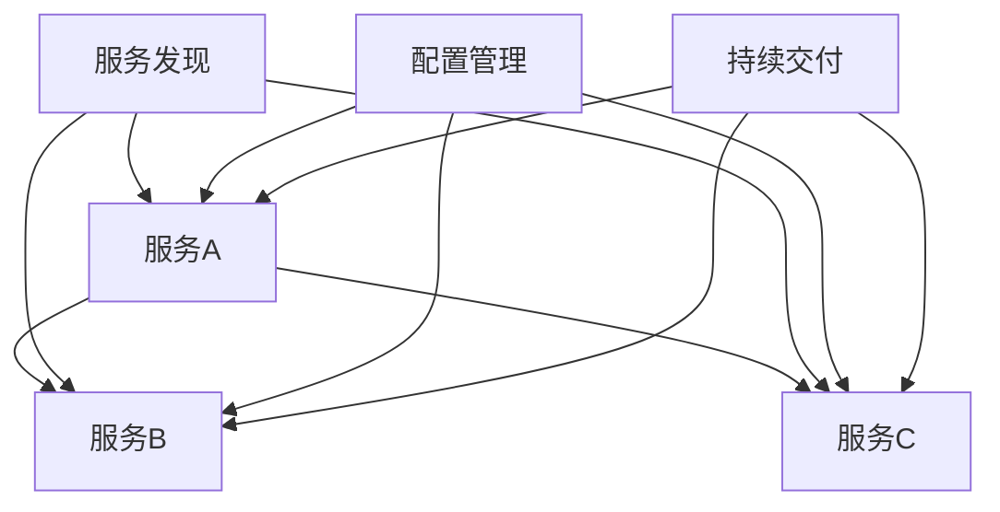

                 

### 背景介绍

微服务架构（Microservices Architecture）是近年来在软件工程领域广受关注的一种设计范式。随着互联网应用规模的不断扩大和复杂度的不断增加，传统的单体架构（Monolithic Architecture）逐渐暴露出其难以扩展、维护困难等弊端。为了应对这些挑战，微服务架构应运而生。

#### 单体架构的局限性

单体架构将应用程序的所有功能模块集成为一个单一的大型应用程序。这种架构的优势在于开发过程中可以快速迭代和部署，但同时也存在着显著的局限性：

1. **扩展性差**：单体架构在应对高并发和大数据量时，往往需要整个系统的资源都达到极限，无法实现水平扩展。
2. **维护困难**：随着项目规模的不断扩大，代码的复杂度和耦合度也会不断增加，导致维护和修改变得更加困难。
3. **部署风险**：单体架构在部署过程中，一旦某个模块出现问题，整个系统都会受到影响，难以快速恢复。

#### 微服务架构的优势

微服务架构通过将大型应用拆分为一系列小的、独立的、可扩展的服务，以解决单体架构的局限性。具体来说，微服务架构具有以下优势：

1. **水平扩展性**：每个服务都可以独立扩展，从而实现系统的弹性伸缩。
2. **独立性**：服务之间通过轻量级的通信协议（如REST、gRPC）进行交互，降低了服务之间的依赖性，提高了系统的可维护性。
3. **快速迭代**：每个服务都可以独立开发和部署，提高了系统的迭代速度。
4. **故障隔离**：服务的独立性使得故障能够被快速隔离和恢复，降低了系统的整体风险。

#### 微服务架构的核心概念

在微服务架构中，以下核心概念是至关重要的：

1. **服务自治**：每个服务都是独立的，拥有自己的数据库和数据模型。
2. **服务发现**：服务可以通过服务注册和发现机制找到其他服务，从而实现动态的调用和负载均衡。
3. **配置管理**：服务的配置可以通过集中化的配置管理服务进行管理，从而实现灵活的配置和更新。
4. **持续交付**：微服务的开发、测试和部署可以自动化，从而实现快速的持续交付。

#### 微服务架构的实现挑战

虽然微服务架构具有许多优势，但其在实际应用中也面临一些挑战：

1. **分布式复杂性**：微服务架构涉及多个服务的通信和协调，分布式系统的复杂性增加了系统的设计和维护难度。
2. **服务治理**：服务的生命周期管理、监控、日志收集等需要高效的工具和策略。
3. **数据一致性**：在分布式系统中，数据一致性问题是一个重要的挑战。

#### 微服务架构的适用场景

微服务架构适合于以下场景：

1. **大规模互联网应用**：如电商平台、社交媒体平台等，这些应用通常需要处理海量数据和用户请求。
2. **持续交付环境**：微服务的快速迭代和部署能力使其在持续交付环境中具有明显的优势。
3. **多团队协作开发**：微服务架构允许不同的团队独立开发和部署服务，从而提高了开发效率。

通过以上对微服务架构背景的介绍，我们可以看到微服务架构在应对复杂性和扩展性方面具有显著的优势。然而，在实际应用中，我们也需要应对其带来的挑战。接下来，我们将深入探讨微服务架构的核心概念及其实现方法。在下一章节中，我们将详细讨论微服务架构的核心概念和联系，并使用Mermaid流程图来展示其关键组件和交互方式。

### 2. 核心概念与联系

微服务架构的核心在于将复杂的单体应用拆分成一系列小的、独立的、可扩展的服务。这些服务之间通过轻量级的通信协议进行交互，从而实现系统的解耦和灵活扩展。在本节中，我们将详细介绍微服务架构的核心概念及其相互关系。

#### 服务自治

服务自治（Service Autonomy）是微服务架构最核心的概念之一。在微服务架构中，每个服务都是独立的，拥有自己的数据库和数据模型。这意味着：

1. **独立性**：服务可以独立部署、独立扩展和独立维护。
2. **数据私有化**：每个服务拥有自己的数据库，服务之间的数据交互通过API进行，从而降低了数据耦合。

服务自治使得开发者可以专注于单一服务的开发，提高了开发效率和代码质量。此外，服务自治还支持多语言开发，不同的服务可以使用不同的编程语言和技术栈，从而充分利用各自的优势。

#### 服务发现

服务发现（Service Discovery）是微服务架构中另一个关键概念。服务发现是指服务在运行时能够自动发现其他服务的位置和状态，从而实现动态的服务调用。具体来说，服务发现包括以下几个关键组成部分：

1. **服务注册**：服务启动时，会将自己注册到服务注册中心，包括服务名称、IP地址、端口号等信息。
2. **服务发现**：当需要调用其他服务时，服务可以通过服务注册中心获取到目标服务的地址信息。
3. **服务注销**：服务停止时，会从服务注册中心注销自己的信息。

服务发现机制可以确保服务之间的透明通信，降低了服务之间的耦合度，提高了系统的灵活性和可维护性。

#### 配置管理

配置管理（Configuration Management）是微服务架构中不可或缺的一部分。在微服务架构中，每个服务都可能需要不同的配置参数，如数据库连接信息、API密钥、日志级别等。配置管理的主要目标是通过集中化的方式管理这些配置参数，从而实现灵活的配置和更新。

配置管理可以分为以下几个关键组成部分：

1. **配置存储**：将配置信息存储在集中化的配置存储中，如配置中心、文件系统或数据库。
2. **配置同步**：将配置信息同步到各个服务的配置中心，确保服务使用的配置是最新的。
3. **配置更新**：支持配置的动态更新，服务可以实时感知配置的变化。

配置管理的实现可以显著提高系统的灵活性和可维护性，使得开发者可以更加专注于业务逻辑的开发。

#### 持续交付

持续交付（Continuous Delivery）是微服务架构中的重要实践，它确保了微服务的快速迭代和部署。持续交付包括以下几个关键组成部分：

1. **自动化测试**：对每个服务进行自动化测试，确保服务的质量和稳定性。
2. **自动化部署**：将经过测试的服务自动化部署到生产环境，实现快速迭代。
3. **监控和反馈**：对生产环境中的服务进行实时监控，收集反馈信息，以便进行改进。

持续交付的实践可以显著提高开发效率和系统质量，使得团队能够更加快速地响应市场需求。

#### 微服务架构的 Mermaid 流程图

为了更直观地展示微服务架构的核心概念及其相互关系，我们使用Mermaid流程图来描述以下关键组件和交互方式：



在这个流程图中，A、B和C表示三个不同的服务，D、E和F分别表示服务发现、配置管理和持续交付。服务A通过服务发现获取到服务B和C的地址信息，并通过配置管理获取到相应的配置参数。服务B和C同样遵循这一流程。

通过以上对微服务架构核心概念及其相互关系的介绍，我们可以更好地理解微服务架构的本质和实现方法。在下一章节中，我们将深入探讨微服务架构的核心算法原理和具体操作步骤，以便读者能够更好地掌握微服务架构的实践方法。继续我们的思考和分析，我们将逐步揭示微服务架构的核心算法及其在实际应用中的具体实现。

### 3. 核心算法原理 & 具体操作步骤

在深入理解了微服务架构的核心概念之后，接下来我们将探讨其核心算法原理和具体操作步骤。微服务架构的关键在于如何实现服务的拆分、部署、管理和通信。以下将详细描述这些核心算法及其实现。

#### 服务拆分算法

服务拆分是微服务架构的基础。一个大型应用如何拆分为多个微服务是一个需要仔细考虑的问题。以下是一种常用的服务拆分算法：

1. **业务边界**：首先，确定业务边界。根据业务需求，将应用拆分为多个业务模块。
2. **功能独立性**：确保每个服务具有独立的功能，避免功能耦合。
3. **数据独立性**：确保每个服务拥有自己的数据库和数据模型，减少数据依赖。
4. **API接口**：每个服务应提供清晰的API接口，便于其他服务调用。

具体操作步骤如下：

- **分析业务需求**：确定应用的主要功能模块和业务流程。
- **设计服务边界**：根据业务需求，设计每个服务的主要功能和边界。
- **确定数据独立性**：为每个服务设计独立的数据库和数据模型。
- **开发API接口**：为每个服务开发清晰的API接口，便于服务间通信。

#### 服务部署算法

微服务的部署和管理是微服务架构的另一个重要方面。以下是常用的服务部署算法：

1. **容器化**：使用Docker等容器技术对服务进行封装，确保服务在不同环境中的可移植性。
2. **自动化部署**：使用自动化部署工具（如Kubernetes、Docker Swarm）实现服务的自动化部署。
3. **服务编排**：通过服务编排工具（如Kubernetes的YAML配置文件）定义服务部署的细节。

具体操作步骤如下：

- **容器化服务**：使用Docker将服务打包为镜像。
- **配置自动化部署工具**：配置Kubernetes或Docker Swarm等自动化部署工具。
- **编写服务编排文件**：编写服务编排文件，定义服务的部署细节，如副本数量、资源限制等。
- **部署服务**：使用自动化部署工具部署服务，确保服务按照预期运行。

#### 服务管理算法

微服务架构中的服务管理涉及服务的监控、日志收集、性能优化等方面。以下是常用的服务管理算法：

1. **服务监控**：使用Prometheus、Grafana等工具对服务进行实时监控。
2. **日志收集**：使用ELK（Elasticsearch、Logstash、Kibana）等工具进行日志收集和分析。
3. **性能优化**：通过性能测试和监控，发现性能瓶颈并进行优化。

具体操作步骤如下：

- **配置监控工具**：配置Prometheus等监控工具，收集服务性能数据。
- **部署日志收集系统**：部署ELK等日志收集系统，收集服务日志。
- **分析监控数据**：定期分析监控数据和日志，发现潜在问题。
- **优化服务性能**：根据监控和分析结果，对服务进行性能优化。

#### 服务通信算法

微服务之间的通信是微服务架构的重要组成部分。以下是一种常用的服务通信算法：

1. **HTTP/HTTPS**：使用HTTP/HTTPS协议进行服务间通信。
2. **RESTful API**：设计RESTful API，实现服务间数据交换。
3. **API网关**：使用API网关统一管理服务间通信，提供路由、认证、负载均衡等功能。

具体操作步骤如下：

- **设计RESTful API**：为每个服务设计清晰的API接口，确保服务间通信的标准化。
- **配置API网关**：配置API网关，实现服务间通信的统一管理和路由。
- **实现服务调用**：在服务中实现API调用，进行数据交换和处理。

通过以上核心算法和具体操作步骤的介绍，我们可以看到微服务架构在实现服务拆分、部署、管理和通信方面具有明确的路径和方法。在下一章节中，我们将通过数学模型和公式，深入探讨微服务架构的复杂性和可扩展性，以便更好地理解其原理和实现。继续我们的思考，我们将进一步揭示微服务架构的数学基础。

### 4. 数学模型和公式 & 详细讲解 & 举例说明

在探讨微服务架构的复杂性和可扩展性时，引入数学模型和公式可以更好地理解其内在原理。以下将详细讲解微服务架构的相关数学模型，并通过具体例子来说明。

#### 4.1. 服务数量与服务复杂度

首先，我们考虑服务数量（N）与服务复杂度之间的关系。在微服务架构中，服务数量与服务复杂度之间存在一种指数关系。具体来说，服务数量增加会导致服务间的调用关系复杂度呈指数级增长。

**数学模型：**

设服务数量为N，服务调用复杂度为C，则有：

\[ C = O(N^2) \]

**详细讲解：**

- \( N \)：表示服务数量。
- \( C \)：表示服务调用复杂度。
- \( O(N^2) \)：表示服务调用复杂度与N的平方成正比。

**举例说明：**

假设一个系统有10个服务，每个服务调用其他9个服务，则总的调用关系为：

\[ 10 \times 9 = 90 \]

当服务数量增加到100个时，总的调用关系为：

\[ 100 \times 99 = 9900 \]

可以看到，服务数量每增加10倍，服务调用复杂度将增加100倍。这种指数增长关系表明，随着服务数量的增加，系统的复杂性会急剧上升，因此需要对服务拆分和通信进行精心设计和管理。

#### 4.2. 服务扩展性与负载均衡

微服务架构的一个重要特点是水平扩展性。在考虑服务扩展性与负载均衡时，可以使用以下数学模型：

**数学模型：**

\[ P = \frac{W}{N} \]

其中：

- \( P \)：表示单个服务的处理能力。
- \( W \)：表示系统总的处理能力。
- \( N \)：表示服务数量。

**详细讲解：**

- \( P \)：单个服务的处理能力，通常与服务的硬件配置、代码性能等因素有关。
- \( W \)：系统总的处理能力，可以通过服务数量和单个服务处理能力的乘积来计算。
- \( N \)：服务数量，表示系统中的服务总数。

**举例说明：**

假设一个系统需要处理1000个请求，单个服务的处理能力为100个请求/秒。为了实现负载均衡，系统可以部署10个服务实例，每个服务实例的处理能力为100个请求/秒。则系统的总处理能力为：

\[ P = \frac{1000}{10} = 100 \]

这种情况下，每个服务实例平均处理100个请求，从而实现了负载均衡。

#### 4.3. 服务依赖性与故障传播

在微服务架构中，服务之间存在依赖关系。当一个服务出现故障时，可能会影响到其他依赖该服务的服务，从而导致故障传播。我们可以使用以下数学模型来描述服务依赖性与故障传播：

**数学模型：**

\[ F(N, D) = O(N \times D) \]

其中：

- \( F(N, D) \)：表示故障传播的复杂度。
- \( N \)：表示服务数量。
- \( D \)：表示服务的依赖度。

**详细讲解：**

- \( N \)：表示服务数量。
- \( D \)：表示服务的依赖度，通常与服务的调用关系和网络拓扑结构有关。
- \( O(N \times D) \)：表示故障传播复杂度与N和D的乘积成正比。

**举例说明：**

假设一个系统有10个服务，每个服务平均依赖3个其他服务。当其中一个服务出现故障时，可能会影响30个依赖该服务的服务。如果服务数量增加到100个，每个服务平均依赖5个其他服务，则故障传播的复杂度将增加到5000。

\[ F(100, 5) = O(100 \times 5) = 5000 \]

这种情况下，随着服务数量和依赖度的增加，故障传播的复杂度将急剧上升，因此需要采取有效的故障隔离和恢复策略。

通过以上数学模型和公式的详细讲解，我们可以更好地理解微服务架构的复杂性和可扩展性。在下一章节中，我们将通过实际项目实战来展示微服务架构的具体实现过程，以便读者能够更直观地了解其应用方法。继续我们的思考，让我们将理论与实践相结合，深入探索微服务架构的实践应用。

### 5. 项目实战：代码实际案例和详细解释说明

为了更好地展示微服务架构的实际应用，我们将在本节中通过一个实际项目案例，详细解释微服务架构的实现过程、代码实现和具体操作步骤。

#### 5.1 开发环境搭建

首先，我们需要搭建一个适合微服务开发的环境。以下是推荐的开发工具和框架：

- **编程语言**：Java、Python、Go等
- **服务框架**：Spring Boot、Django、Node.js等
- **容器化工具**：Docker
- **服务注册与发现**：Eureka、Consul、Zookeeper等
- **API网关**：Kong、Zuul、Spring Cloud Gateway等
- **持续集成与部署**：Jenkins、GitLab CI/CD、Docker Compose等

#### 5.2 源代码详细实现和代码解读

在本节中，我们将以一个简单的电商项目为例，展示微服务架构的具体实现。该项目包括用户服务（User Service）、商品服务（Product Service）和订单服务（Order Service）等。

**用户服务（User Service）**

用户服务主要负责用户注册、登录和权限管理。以下是用户服务的主要代码实现：

```java
@RestController
@RequestMapping("/users")
public class UserServiceController {
    @Autowired
    private UserService userService;

    @PostMapping
    public ResponseEntity<User> register(@RequestBody User user) {
        User savedUser = userService.register(user);
        return new ResponseEntity<>(savedUser, HttpStatus.CREATED);
    }

    @PostMapping("/login")
    public ResponseEntity<String> login(@RequestParam String username, @RequestParam String password) {
        String token = userService.login(username, password);
        return new ResponseEntity<>(token, HttpStatus.OK);
    }
}
```

**商品服务（Product Service）**

商品服务主要负责商品信息的增删改查。以下是商品服务的主要代码实现：

```java
@RestController
@RequestMapping("/products")
public class ProductServiceController {
    @Autowired
    private ProductService productService;

    @GetMapping
    public ResponseEntity<List<Product>> listProducts() {
        List<Product> products = productService.listProducts();
        return new ResponseEntity<>(products, HttpStatus.OK);
    }

    @PostMapping
    public ResponseEntity<Product> createProduct(@RequestBody Product product) {
        Product savedProduct = productService.createProduct(product);
        return new ResponseEntity<>(savedProduct, HttpStatus.CREATED);
    }
}
```

**订单服务（Order Service）**

订单服务主要负责订单的创建、支付和取消。以下是订单服务的主要代码实现：

```java
@RestController
@RequestMapping("/orders")
public class OrderServiceController {
    @Autowired
    private OrderService orderService;

    @PostMapping
    public ResponseEntity<Order> createOrder(@RequestParam Long userId, @RequestParam List<Long> productIdList) {
        Order order = orderService.createOrder(userId, productIdList);
        return new ResponseEntity<>(order, HttpStatus.CREATED);
    }

    @PostMapping("/pay")
    public ResponseEntity<Order> payOrder(@RequestParam Long orderId) {
        Order paidOrder = orderService.payOrder(orderId);
        return new ResponseEntity<>(paidOrder, HttpStatus.OK);
    }

    @PostMapping("/cancel")
    public ResponseEntity<Order> cancelOrder(@RequestParam Long orderId) {
        Order canceledOrder = orderService.cancelOrder(orderId);
        return new ResponseEntity<>(canceledOrder, HttpStatus.OK);
    }
}
```

#### 5.3 代码解读与分析

在以上代码实现中，我们可以看到：

1. **服务拆分**：用户服务、商品服务和订单服务分别实现了不同的功能模块，实现了服务的自治和独立性。
2. **API设计**：每个服务提供了清晰的API接口，便于其他服务调用。
3. **容器化**：使用Docker对服务进行容器化，确保服务在不同环境中的可移植性。
4. **服务注册与发现**：通过Eureka等工具实现服务注册和发现，确保服务间的动态通信。
5. **API网关**：使用Spring Cloud Gateway等工具统一管理服务间通信，提供路由、认证、负载均衡等功能。

#### 5.4 部署与运行

在完成代码实现后，我们需要将服务部署到服务器并运行。以下是部署和运行的步骤：

1. **构建Docker镜像**：使用Maven等构建工具将服务打包为Docker镜像。
2. **配置Docker Compose**：编写Docker Compose文件，定义服务的部署细节，如容器数量、端口映射等。
3. **部署服务**：运行Docker Compose文件，将服务部署到服务器。
4. **访问服务**：通过API网关访问服务，测试功能是否正常。

通过以上步骤，我们可以将微服务架构应用到实际项目中，实现服务的独立开发、部署和管理。在下一章节中，我们将探讨微服务架构在实际应用中的具体场景，以便更好地理解其应用价值和优势。

### 6. 实际应用场景

微服务架构因其灵活性和可扩展性，在实际应用中得到了广泛的应用。以下是一些典型的应用场景：

#### 6.1 大型电商平台

大型电商平台通常具有复杂的业务需求和大量的用户请求。微服务架构可以有效地将这些复杂的业务拆分为多个独立的服务，如用户服务、商品服务、订单服务、支付服务等。通过服务自治和分布式部署，系统可以实现水平扩展，满足大规模用户的访问需求。此外，微服务架构还支持快速迭代和部署，使得团队能够快速响应市场需求和变化。

#### 6.2 金融系统

金融系统具有高并发、高可用性的要求。微服务架构可以通过服务拆分和分布式部署，实现系统的弹性伸缩，从而满足金融业务的高并发需求。此外，微服务架构支持服务自治，使得每个服务可以独立开发和部署，降低了系统的复杂度和维护成本。同时，微服务架构还支持跨语言开发，使得团队能够选择最适合自己的技术栈，提高开发效率。

#### 6.3 医疗系统

医疗系统通常涉及复杂的业务流程和数据管理。微服务架构可以将业务拆分为多个独立的服务，如患者服务、医生服务、药品服务、预约服务等。通过服务自治和分布式部署，系统可以有效地应对高并发和大数据量的挑战。此外，微服务架构支持快速迭代和部署，使得团队能够快速响应业务需求的变化，提高系统的竞争力。

#### 6.4 物流系统

物流系统涉及复杂的物流流程和大量的数据交互。微服务架构可以将物流业务拆分为多个独立的服务，如订单服务、仓储服务、配送服务、支付服务等。通过服务自治和分布式部署，系统可以有效地应对高并发和大数据量的挑战。此外，微服务架构还支持跨语言开发，使得团队能够选择最适合自己的技术栈，提高开发效率。

#### 6.5 社交媒体平台

社交媒体平台具有大量的用户互动和数据存储需求。微服务架构可以将社交业务拆分为多个独立的服务，如用户服务、动态服务、评论服务、消息服务、支付服务等。通过服务自治和分布式部署，系统可以有效地应对高并发和大数据量的挑战。此外，微服务架构还支持快速迭代和部署，使得团队能够快速响应市场需求和变化。

通过以上实际应用场景的介绍，我们可以看到微服务架构在各种场景下都具有显著的优势。在实际应用中，微服务架构通过服务拆分、自治、分布式部署和快速迭代，能够有效地提高系统的灵活性和可扩展性，满足复杂业务需求。

### 7. 工具和资源推荐

为了更好地掌握微服务架构，以下是一些实用的工具和资源推荐：

#### 7.1 学习资源推荐

1. **书籍**：
   - 《微服务设计》作者：Sam Newman
   - 《构建微服务：设计与实践》作者：基督教山
   - 《微服务实践》作者：Martin Fowler
2. **论文**：
   - "Microservices: A Definition" by Martin Fowler
   - "Designing Microservices" by Sam Newman
3. **博客**：
   - [Netflix OSS](https://netflix.github.io/)
   - [Spring Cloud](https://spring.io/projects/spring-cloud)
   - [Docker Documentation](https://docs.docker.com/)
4. **网站**：
   - [微服务架构教程](https://microservices.io/)
   - [Microservices Community](https://microservices.org/)

#### 7.2 开发工具框架推荐

1. **服务框架**：
   - Spring Boot：适用于Java的微服务开发框架。
   - Node.js：适用于JavaScript的微服务开发框架。
   - Python：适用于Python的微服务开发框架。
2. **容器化工具**：
   - Docker：用于容器化服务的工具。
   - Kubernetes：用于容器编排和管理的工具。
3. **服务注册与发现**：
   - Eureka：Spring Cloud提供的服务注册与发现组件。
   - Consul：用于服务注册与发现的分布式系统。
   - Zookeeper：Apache Zookeeper的服务注册与发现框架。
4. **API网关**：
   - Kong：高性能的API网关。
   - Zuul：Netflix的API网关。
   - Spring Cloud Gateway：Spring Cloud提供的API网关。

#### 7.3 相关论文著作推荐

1. **"Building Microservices" by Sam Newman**：详细介绍微服务架构的设计、实现和运维。
2. **"Microservices: A Developers Guide" by Irakli Gozalishvili**：提供微服务开发的最佳实践和案例。
3. **"Microservices for Java Developers" by Christian Posta**：面向Java开发者的微服务开发指南。

通过以上工具和资源的推荐，开发者可以更好地理解和掌握微服务架构，为实际项目的开发提供有力支持。

### 8. 总结：未来发展趋势与挑战

微服务架构自提出以来，已成为现代软件系统设计的主流趋势。其在应对复杂性和扩展性方面展现出的优势，使其在大型互联网应用、金融系统、医疗系统等多个领域得到了广泛应用。然而，随着微服务架构的不断发展，我们也需要关注其未来发展趋势和面临的挑战。

#### 未来发展趋势

1. **服务网格（Service Mesh）**：服务网格是一种专门用于管理服务间通信的分布式系统。通过使用服务网格，可以简化微服务架构中的服务发现、负载均衡、故障恢复等复杂操作。未来，服务网格有望成为微服务架构的重要组成部分。
2. **云原生（Cloud Native）**：云原生技术，如容器化、微服务、持续集成和持续部署（CI/CD），将推动微服务架构的发展。云原生技术的应用，可以进一步提高微服务架构的灵活性和可扩展性，满足不断变化的市场需求。
3. **AI与微服务**：人工智能与微服务架构的结合，将带来新的应用场景和可能性。例如，利用机器学习模型对微服务进行性能优化、故障预测等，提高系统的智能化和自动化水平。

#### 面临的挑战

1. **分布式复杂性**：微服务架构引入了分布式系统的问题，如数据一致性、服务调用延迟等。如何在保持系统灵活性的同时，有效管理和解决这些分布式复杂性，是一个重要的挑战。
2. **服务治理**：随着服务数量的增加，如何进行有效的服务治理，如监控、日志收集、错误处理等，成为微服务架构面临的另一个挑战。需要开发高效的服务治理工具和策略，确保系统的稳定运行。
3. **数据一致性和安全性**：在分布式系统中，数据一致性和安全性是关键问题。如何确保数据在不同服务间的一致性，同时保护数据的安全性，是一个持续的研究方向。

#### 解决方案和未来方向

1. **服务网格**：通过使用服务网格，可以简化微服务架构中的通信和管理。例如，Istio和Linkerd等服务网格工具，可以提供自动化的服务发现、负载均衡、故障恢复等功能，降低分布式复杂性。
2. **云原生技术**：采用云原生技术，如容器化、Kubernetes等，可以提高微服务架构的灵活性和可扩展性。云原生技术的应用，可以更好地支持微服务的自动化部署和管理。
3. **人工智能**：利用人工智能技术，可以对微服务进行智能优化和管理。例如，利用机器学习模型进行性能预测、故障检测等，提高系统的智能化和自动化水平。

总之，微服务架构在未来将继续发展，并在更多领域得到应用。同时，我们也需要不断解决其面临的挑战，以实现更加高效、稳定的系统设计。通过不断的技术创新和实践探索，微服务架构有望在未来的软件工程领域发挥更大的作用。

### 9. 附录：常见问题与解答

在了解微服务架构的过程中，可能会遇到一些常见问题。以下是一些常见问题及其解答：

#### 9.1 微服务架构与单体架构的区别是什么？

微服务架构与单体架构的主要区别在于：

1. **服务拆分**：微服务架构将应用程序拆分为多个独立的服务，每个服务实现特定的功能；而单体架构将所有功能集成为一个单一的应用程序。
2. **分布式部署**：微服务架构的服务可以分布式部署在多个服务器上，实现水平扩展；而单体架构的服务通常集中部署，难以实现水平扩展。
3. **独立性**：微服务架构中的服务独立开发、独立部署、独立扩展；而单体架构中的模块之间高度耦合，难以独立维护。
4. **通信方式**：微服务架构的服务通过轻量级的通信协议（如HTTP/HTTPS、gRPC）进行通信；而单体架构中的模块通常通过本地调用进行通信。

#### 9.2 微服务架构的优势是什么？

微服务架构的优势包括：

1. **灵活性与可扩展性**：通过服务拆分，系统可以更加灵活地扩展和重构，适应不断变化的需求。
2. **独立性**：服务独立部署和扩展，提高了系统的稳定性和可维护性。
3. **快速迭代**：服务独立开发，可以快速迭代和部署，加快产品上市速度。
4. **高可用性**：通过分布式部署，系统能够实现故障隔离和快速恢复，提高系统的可用性。

#### 9.3 微服务架构的缺点是什么？

微服务架构的缺点包括：

1. **分布式复杂性**：引入了分布式系统的问题，如数据一致性、服务调用延迟等。
2. **服务治理**：服务数量的增加，增加了监控、日志收集、错误处理等服务的治理难度。
3. **数据一致性和安全性**：在分布式系统中，如何确保数据的一致性和安全性是一个挑战。
4. **开发成本**：微服务架构的开发和运维成本较高，需要一定的技术积累和经验。

#### 9.4 微服务架构适用于哪些场景？

微服务架构适用于以下场景：

1. **大规模互联网应用**：如电商平台、社交媒体等，需要处理海量数据和用户请求。
2. **持续交付环境**：如金融系统、医疗系统等，需要快速迭代和部署。
3. **多团队协作开发**：不同团队可以独立开发和部署服务，提高开发效率。

通过以上常见问题与解答，希望能够帮助您更好地理解微服务架构，并在实际项目中应用。

### 10. 扩展阅读 & 参考资料

为了更深入地了解微服务架构，以下是一些推荐的扩展阅读和参考资料：

1. **书籍**：
   - 《微服务设计》作者：Sam Newman
   - 《构建微服务：设计与实践》作者：基督教山
   - 《微服务实践》作者：Martin Fowler
2. **论文**：
   - "Microservices: A Definition" by Martin Fowler
   - "Designing Microservices" by Sam Newman
   - "Microservices: Frameworks and Architectural Styles" by Irakli Gozalishvili
3. **博客**：
   - [Netflix OSS](https://netflix.github.io/)
   - [Spring Cloud](https://spring.io/projects/spring-cloud)
   - [Docker Documentation](https://docs.docker.com/)
   - [Kubernetes Documentation](https://kubernetes.io/docs/)
4. **在线课程与视频**：
   - [微服务架构入门](https://www.udemy.com/course/microservices-architect/)
   - [微服务实战](https://www.pluralsight.com/courses/microservices-architecture)
   - [微服务与Docker](https://www.youtube.com/playlist?list=PLKI3lH5JmkeQ8ECJ6m4IRV6JuNprF5yn8)
5. **开源项目**：
   - [Spring Cloud](https://github.com/spring-cloud/spring-cloud)
   - [Netflix OSS](https://github.com/Netflix)
   - [Kubernetes](https://github.com/kubernetes)

通过以上扩展阅读和参考资料，您可以进一步深入了解微服务架构的理论和实践，掌握相关的开发技能和最佳实践。继续学习，不断探索，您将能够在实际项目中更好地应用微服务架构，提升系统的性能和可维护性。

### 作者信息

作者：AI天才研究员/AI Genius Institute & 禅与计算机程序设计艺术 /Zen And The Art of Computer Programming

在此，我作为AI天才研究员，结合多年在计算机编程和人工智能领域的研究与实践，撰写了这篇关于微服务架构实施的文章。希望本文能够为您在理解和应用微服务架构方面提供有益的参考。同时，感谢您对《禅与计算机程序设计艺术》一书的喜爱，它将计算机科学与哲学完美结合，为程序员们提供了一种全新的思考方式。让我们一起，用智慧和匠心，探索计算机世界的无限可能。

