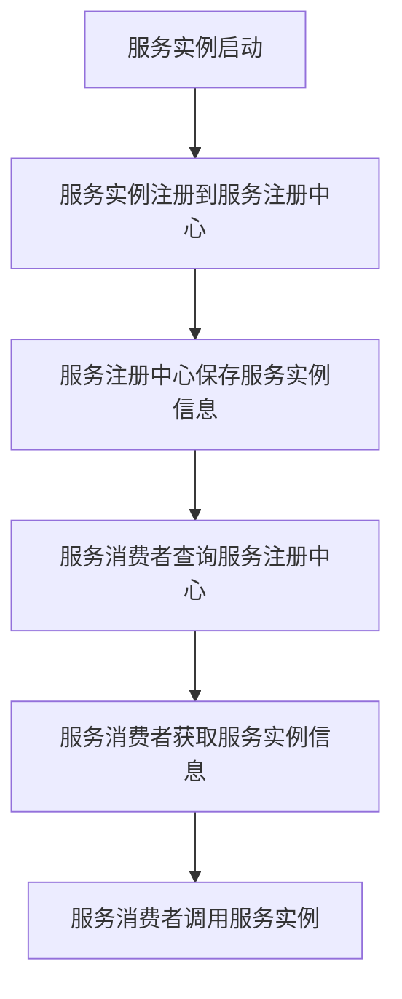

                 

# 微服务设计模式：服务发现和通信

## 摘要

本文将深入探讨微服务设计模式中的服务发现和通信机制。微服务架构作为一种灵活且可扩展的系统设计方法，已被广泛采用。服务发现和通信是微服务架构中至关重要的两个组成部分，它们确保了微服务之间的高效协作与动态交互。本文将首先介绍微服务的基本概念和优势，然后详细阐述服务发现和通信的核心原理、技术实现、实际应用场景，并推荐相关的工具和资源，最后对微服务设计模式的未来发展趋势与挑战进行总结。通过本文的阅读，您将对微服务架构有更深入的理解，并能够更好地应用于实际项目中。

## 1. 背景介绍

### 微服务架构的起源与发展

微服务架构（Microservices Architecture）起源于20世纪末期，最早由thoughtworks公司的技术团队提出。其核心思想是将大型单体应用程序分解为多个独立的、轻量级的服务单元，每个服务单元专注于实现单一的业务功能。微服务架构的起源可追溯到SOA（Service-Oriented Architecture）的概念，但在技术上更加轻量化和灵活。

随着时间的推移，微服务架构逐渐发展成为一种主流的系统设计方法。特别是在互联网企业中，由于业务需求的快速变化和系统的不断扩展，微服务架构的优势愈发明显。相较于传统的单体应用程序，微服务架构具有以下几大优势：

1. **高可扩展性**：微服务架构可以将系统拆分为多个独立的服务单元，每个服务单元可以独立扩展，从而实现水平扩展。这有助于应对业务需求的快速增长。

2. **高容错性**：在微服务架构中，每个服务单元相对独立，某个服务单元的故障不会影响到整个系统的运行。这使得系统具有更高的容错性和可用性。

3. **高可维护性**：由于每个服务单元相对独立，开发和维护的职责更加明确，便于团队协作和代码管理。

4. **高灵活性**：微服务架构使得系统可以根据业务需求灵活地调整和重构，以适应快速变化的市场环境。

### 微服务架构的核心概念

微服务架构的核心概念包括：

1. **服务自治**：每个服务单元拥有自己的数据存储、处理逻辑和接口，具备独立部署和扩展的能力。

2. **服务间通信**：微服务之间通过轻量级的通信协议（如RESTful API、消息队列等）进行交互，降低服务间的耦合度。

3. **动态服务发现**：在微服务架构中，服务注册中心和发现机制确保了服务实例的动态注册和发现，使得服务之间可以自动地进行通信。

4. **容器化与自动化部署**：微服务架构通常采用容器化技术（如Docker）进行部署和管理，结合自动化部署工具（如Kubernetes），实现了快速迭代和部署。

### 微服务架构的优缺点

微服务架构具有以下优点：

1. **高可扩展性**：系统可以灵活地扩展和重构，以应对业务需求的增长。

2. **高容错性**：服务自治和独立部署降低了系统的整体故障风险。

3. **高可维护性**：职责明确，易于管理和维护。

4. **高灵活性**：可以灵活地调整和重构系统，以适应快速变化的市场环境。

然而，微服务架构也存在一些缺点：

1. **复杂性**：分布式系统的设计和维护比传统的单体应用程序更为复杂。

2. **服务治理**：服务注册、监控、管理和安全性等方面需要额外的工具和资源。

3. **数据一致性**：由于服务自治，数据一致性问题需要额外关注和解决。

4. **网络依赖**：服务间通信依赖于网络，网络稳定性对系统性能有较大影响。

### 微服务架构的应用场景

微服务架构适用于以下几种应用场景：

1. **大型企业级应用**：企业级应用通常具有复杂的业务逻辑和大量用户，采用微服务架构有助于提高系统的可扩展性和可维护性。

2. **互联网应用**：互联网应用的需求变化快速，采用微服务架构可以灵活地调整和重构系统。

3. **电子商务平台**：电子商务平台需要处理大量并发请求，采用微服务架构可以提高系统的性能和可靠性。

4. **物联网应用**：物联网应用涉及多种设备和服务，采用微服务架构可以方便地管理和维护。

### 微服务架构的发展趋势

随着技术的不断进步，微服务架构的发展趋势包括：

1. **服务网格**：服务网格（Service Mesh）作为一种新型的服务管理架构，逐渐成为微服务架构的重要组成部分，为服务间通信提供了更好的管理和优化。

2. **云原生**：云原生技术（如Kubernetes、Docker等）的普及，使得微服务架构在云环境中具有更好的部署和管理能力。

3. **智能化与服务治理**：智能化服务治理（如自动故障恢复、自动扩缩容等）将进一步提升微服务架构的效率和稳定性。

4. **开源生态的完善**：随着开源社区的不断贡献，微服务架构相关的工具和框架将更加丰富和成熟。

### 总结

微服务架构作为一种灵活且可扩展的系统设计方法，在互联网和大型企业级应用中得到了广泛应用。尽管存在一定的复杂性，但其带来的优势使其成为未来系统架构的发展方向。在接下来的部分，本文将深入探讨微服务架构中的服务发现和通信机制，帮助读者更好地理解和应用微服务架构。

## 2. 核心概念与联系

### 服务发现

#### 定义

服务发现（Service Discovery）是微服务架构中的一个关键概念，它指的是在分布式系统中，服务实例的自动注册和发现过程。通过服务发现机制，服务实例可以在运行时动态地被其他服务实例发现和访问，从而实现服务之间的动态交互。

#### 目的

服务发现的主要目的是简化服务间通信，提高系统的可扩展性和容错性。具体来说，服务发现机制具有以下作用：

1. **动态服务注册**：服务实例启动时，自动将其自身的信息（如地址、端口等）注册到服务注册中心。

2. **动态服务发现**：服务消费者可以通过服务注册中心获取服务实例的信息，从而动态地访问服务实例。

3. **负载均衡**：通过服务注册中心和服务实例的动态发现，实现负载均衡，提高系统性能。

4. **故障恢复**：当某个服务实例故障时，服务注册中心可以自动将其从可用列表中移除，服务消费者可以切换到其他健康的服务实例。

#### 技术实现

服务发现的技术实现主要依赖于服务注册中心（Service Registry）和服务发现客户端（Service Discovery Client）。常见的服务注册中心包括Consul、Eureka、Zookeeper等，而服务发现客户端通常集成在服务消费者中。

以下是一个简单的服务发现流程：

1. **服务注册**：服务实例启动时，通过服务发现客户端将其自身的信息注册到服务注册中心。

2. **服务发现**：服务消费者在请求服务时，通过服务发现客户端从服务注册中心获取服务实例的信息。

3. **服务调用**：服务消费者根据获取到的服务实例信息，发起服务调用。

4. **服务更新**：服务实例发生变更（如地址、端口等），通过服务发现客户端更新服务注册中心中的信息。

#### 服务发现与微服务架构的关系

服务发现是微服务架构中不可或缺的一部分，它与微服务架构中的其他核心概念密切相关：

1. **服务自治**：服务自治是微服务架构的核心原则之一，服务发现机制确保了服务实例的独立性和自治性。

2. **服务间通信**：服务发现机制简化了服务间通信的复杂性，使得服务之间可以高效地互相发现和调用。

3. **动态性**：服务发现机制为系统带来了动态性，服务实例的动态注册和发现使得系统可以灵活地适应变化。

### 服务通信

#### 定义

服务通信（Service Communication）是指在分布式系统中，服务实例之间进行数据交换和协作的过程。服务通信是微服务架构中实现业务功能的重要手段，它确保了服务之间的协调和配合。

#### 目的

服务通信的主要目的是实现服务实例之间的信息传递和业务协作。具体来说，服务通信机制具有以下作用：

1. **信息传递**：服务通信机制确保了服务实例之间可以高效地传递数据和信息。

2. **业务协作**：服务通信机制使得服务之间可以协同工作，共同实现复杂的业务功能。

3. **解耦合**：服务通信机制降低了服务之间的耦合度，使得各个服务可以独立开发和部署。

4. **性能优化**：通过合理的服务通信机制，可以提高系统的性能和响应速度。

#### 技术实现

服务通信的技术实现主要依赖于通信协议和服务接口。常见的通信协议包括HTTP/HTTPS、gRPC、WebSocket等，而服务接口则定义了服务之间的交互规则和数据格式。

以下是一个简单的服务通信流程：

1. **服务定义**：服务实例在开发过程中，定义其提供的接口和服务功能。

2. **服务发布**：服务实例将接口和服务功能发布到服务注册中心，以便其他服务实例发现和调用。

3. **服务调用**：服务消费者通过服务发现机制获取服务实例的信息，然后发起服务调用。

4. **服务响应**：服务实例接收到调用请求后，处理业务逻辑并返回响应结果。

#### 服务通信与微服务架构的关系

服务通信是微服务架构的核心组成部分，它与微服务架构中的其他核心概念密切相关：

1. **服务自治**：服务自治要求服务实例之间进行独立开发和部署，服务通信机制确保了服务实例之间的解耦合。

2. **动态性**：服务通信机制使得服务实例可以在运行时动态地发现和调用其他服务实例，提高了系统的灵活性和可扩展性。

3. **可靠性**：通过合理的服务通信机制，可以确保服务实例之间的数据传递和业务协作的可靠性，提高了系统的稳定性和容错性。

### 服务发现与通信的联系

服务发现和通信是微服务架构中的两个核心概念，它们之间存在密切的联系：

1. **服务注册中心**：服务注册中心既是服务发现的核心组件，也是服务通信的中枢节点。服务实例在启动时需要将其自身的信息注册到服务注册中心，以便其他服务实例进行发现和调用。

2. **服务实例的动态性**：服务发现机制确保了服务实例的动态注册和发现，使得系统可以灵活地适应变化。服务通信机制则利用服务实例的动态性，实现高效的服务间协作。

3. **解耦合与动态性**：服务发现和通信机制共同实现了服务实例之间的解耦合和动态性，使得各个服务可以独立开发和部署，提高了系统的可扩展性和可靠性。

### 总结

服务发现和通信是微服务架构中不可或缺的两个核心概念，它们共同构成了微服务架构的基石。在接下来的部分，本文将深入探讨服务发现和通信的具体实现、算法原理和数学模型，帮助读者更好地理解和应用微服务架构。

### 2.1 服务发现的 Mermaid 流程图

以下是一个简单的服务发现的 Mermaid 流程图，展示了服务实例的注册和发现过程：



在这个流程图中，A表示服务实例启动，B表示服务实例注册到服务注册中心，C表示服务注册中心保存服务实例信息，D表示服务消费者查询服务注册中心，E表示服务消费者获取服务实例信息，F表示服务消费者调用服务实例。通过这个流程图，我们可以清晰地了解服务发现的基本过程。

### 3. 核心算法原理 & 具体操作步骤

#### 服务注册算法原理

服务注册是服务发现机制的基础，它涉及到服务实例在启动时如何将自身信息注册到服务注册中心。以下是一个简单但完整的服务注册算法原理：

1. **服务实例启动**：服务实例在启动时，会执行服务注册逻辑。

2. **获取实例信息**：服务实例从配置文件、环境变量或内置存储中获取其自身的信息，如地址、端口、服务名称等。

3. **创建注册信息**：服务实例根据获取到的实例信息，创建一个注册信息对象，该对象包含了服务实例的详细信息。

4. **发送注册请求**：服务实例通过HTTP/HTTPS协议，将注册信息对象发送到服务注册中心。

5. **处理注册请求**：服务注册中心接收到注册请求后，验证注册信息的有效性，并将服务实例信息存储在本地缓存中。

6. **注册完成**：服务注册中心返回注册结果，服务实例继续执行其他逻辑。

#### 服务发现算法原理

服务发现是服务消费者在调用服务实例前，如何从服务注册中心获取服务实例信息的过程。以下是一个简单但完整的服务发现算法原理：

1. **服务消费者请求服务**：服务消费者在调用服务时，需要先知道服务实例的信息。

2. **查询服务注册中心**：服务消费者通过HTTP/HTTPS协议，向服务注册中心发送查询请求，请求查询特定服务的实例信息。

3. **获取实例信息**：服务注册中心接收到查询请求后，从本地缓存中检索服务实例信息，并将查询结果返回给服务消费者。

4. **服务调用**：服务消费者根据获取到的服务实例信息，发起服务调用。

#### 服务通信算法原理

服务通信是服务实例之间进行数据交换和业务协作的过程。以下是一个简单但完整的服务通信算法原理：

1. **服务实例处理请求**：服务实例接收到请求后，根据请求的URL或方法，调用相应的业务逻辑进行处理。

2. **响应结果**：服务实例处理完成后，将响应结果返回给服务消费者。

3. **请求传递**：服务实例将请求信息封装成HTTP/HTTPS请求，通过服务注册中心转发给目标服务实例。

4. **目标服务实例处理请求**：目标服务实例接收到请求后，调用相应的业务逻辑进行处理。

5. **响应返回**：目标服务实例将响应结果返回给服务注册中心，服务注册中心再将响应结果转发给服务消费者。

#### 具体操作步骤

以下是服务注册、服务发现和服务通信的具体操作步骤：

##### 服务注册步骤

1. **启动服务实例**：启动服务实例，加载配置文件和环境变量。

2. **获取实例信息**：从配置文件或环境变量中获取服务实例的地址、端口、服务名称等信息。

3. **创建注册信息**：根据获取到的实例信息，创建一个注册信息对象。

4. **发送注册请求**：通过HTTP/HTTPS协议，将注册信息对象发送到服务注册中心。

5. **处理注册请求**：服务注册中心接收到注册请求后，验证注册信息的有效性，并将服务实例信息存储在本地缓存中。

6. **注册完成**：服务注册中心返回注册结果，服务实例继续执行其他逻辑。

##### 服务发现步骤

1. **发起服务调用**：服务消费者在调用服务时，需要先知道服务实例的信息。

2. **查询服务注册中心**：通过HTTP/HTTPS协议，向服务注册中心发送查询请求，请求查询特定服务的实例信息。

3. **获取实例信息**：服务注册中心接收到查询请求后，从本地缓存中检索服务实例信息，并将查询结果返回给服务消费者。

4. **服务调用**：服务消费者根据获取到的服务实例信息，发起服务调用。

##### 服务通信步骤

1. **处理请求**：服务实例接收到请求后，根据请求的URL或方法，调用相应的业务逻辑进行处理。

2. **响应结果**：服务实例处理完成后，将响应结果返回给服务消费者。

3. **请求传递**：服务实例将请求信息封装成HTTP/HTTPS请求，通过服务注册中心转发给目标服务实例。

4. **目标服务实例处理请求**：目标服务实例接收到请求后，调用相应的业务逻辑进行处理。

5. **响应返回**：目标服务实例将响应结果返回给服务注册中心，服务注册中心再将响应结果转发给服务消费者。

### 总结

通过上述核心算法原理和具体操作步骤的讲解，我们可以看到服务注册、服务发现和服务通信在微服务架构中的重要作用。服务注册确保了服务实例在运行时可以被其他服务实例发现和调用，服务发现机制简化了服务间通信的复杂性，而服务通信实现了服务实例之间的数据交换和业务协作。在接下来的部分，我们将进一步探讨微服务架构中的数学模型和公式，帮助读者更深入地理解服务发现和通信的原理。

### 4. 数学模型和公式 & 详细讲解 & 举例说明

在微服务架构中，服务发现和通信机制涉及到大量的数学模型和公式。这些模型和公式不仅用于描述服务发现和通信的过程，还用于优化系统的性能和可靠性。以下是一些关键的数学模型和公式，以及详细的讲解和举例说明。

#### 负载均衡模型

负载均衡（Load Balancing）是微服务架构中的一个重要概念，它用于分配服务请求到多个服务实例，以避免单个实例过载。以下是一个简单的负载均衡模型：

**轮询算法**（Round Robin）：
$$
i_{next} = (i_{current} + 1) \mod N
$$
其中，$i_{current}$ 表示当前服务实例的索引，$N$ 表示可用服务实例的总数。每次请求到来时，算法计算下一个待调用的服务实例索引，从而实现轮询分配。

**最小连接数算法**（Least Connections）：
$$
i_{next} = \arg\min_{i} \{ C_i \}
$$
其中，$C_i$ 表示第 $i$ 个服务实例当前处理的请求数量。该算法选择当前处理请求数量最小的服务实例，以实现负载均衡。

**加权轮询算法**（Weighted Round Robin）：
$$
i_{next} = (i_{current} + \lceil \frac{w_{current}}{W} \rceil) \mod N
$$
其中，$w_{current}$ 表示当前服务实例的权重，$W$ 表示所有服务实例的权重之和。该算法根据服务实例的权重进行分配，权重越高的实例被调用的概率越大。

#### 服务发现模型

服务发现模型用于描述服务实例的注册和发现过程。以下是一个简单但完整的服务发现模型：

**服务注册模型**：
$$
Service_{register}(T) = \begin{cases} 
registered & \text{if } Service_{status} = \text{running} \\
unregistered & \text{otherwise}
\end{cases}
$$
其中，$Service_{register}(T)$ 表示服务实例在时间 $T$ 时的注册状态，$Service_{status}$ 表示服务实例的状态（运行/未运行）。

**服务发现模型**：
$$
Service_{discover}(T) = \begin{cases} 
found & \text{if } Service_{register}(T) = registered \\
not_found & \text{otherwise}
\end{cases}
$$
其中，$Service_{discover}(T)$ 表示服务消费者在时间 $T$ 时是否发现服务实例。

#### 服务通信模型

服务通信模型用于描述服务实例之间的数据交换过程。以下是一个简单的服务通信模型：

**请求传递模型**：
$$
Request_{send}(T) = Service_{A}(T) \rightarrow Service_{B}(T)
$$
其中，$Request_{send}(T)$ 表示在时间 $T$ 时，服务实例 $Service_{A}$ 向服务实例 $Service_{B}$ 发送请求。

**响应返回模型**：
$$
Response_{return}(T) = Service_{B}(T) \rightarrow Service_{A}(T)
$$
其中，$Response_{return}(T)$ 表示在时间 $T$ 时，服务实例 $Service_{B}$ 向服务实例 $Service_{A}$ 返回响应。

#### 举例说明

假设我们有一个包含3个服务实例（Service1、Service2、Service3）的微服务系统，服务实例的权重分别为2、1、2。现在有5个请求需要分配，我们将使用加权轮询算法进行负载均衡。

1. **第一个请求**：
   $$ i_{next} = (0 + \lceil \frac{2}{5} \rceil) \mod 3 = 2 $$
   被分配到 Service2。

2. **第二个请求**：
   $$ i_{next} = (2 + \lceil \frac{1}{5} \rceil) \mod 3 = 1 $$
   被分配到 Service1。

3. **第三个请求**：
   $$ i_{next} = (1 + \lceil \frac{2}{5} \rceil) \mod 3 = 3 $$
   被分配到 Service3。

4. **第四个请求**：
   $$ i_{next} = (3 + \lceil \frac{1}{5} \rceil) \mod 3 = 2 $$
   被分配到 Service2。

5. **第五个请求**：
   $$ i_{next} = (2 + \lceil \frac{2}{5} \rceil) \mod 3 = 1 $$
   被分配到 Service1。

通过上述举例，我们可以看到加权轮询算法如何根据服务实例的权重进行请求分配，实现了负载均衡。

### 总结

通过上述数学模型和公式的讲解，我们可以看到服务发现和通信在微服务架构中的关键作用。这些模型和公式不仅用于描述服务发现和通信的过程，还用于优化系统的性能和可靠性。在实际应用中，可以根据业务需求和系统规模选择合适的算法和模型，从而实现高效、可靠的服务发现和通信。

### 5. 项目实战：代码实际案例和详细解释说明

在本节中，我们将通过一个实际项目案例来展示服务发现和通信的实现。我们使用 Spring Boot 和 Netflix OSS（特别是 Eureka 和 Ribbon）来实现微服务架构中的服务发现和通信。

#### 5.1 开发环境搭建

首先，我们需要搭建开发环境。以下是所需的软件和工具：

1. **Java Development Kit (JDK)**：版本 1.8 或更高。
2. **Maven**：版本 3.6.3 或更高。
3. **Spring Boot**：版本 2.4.5 或更高。
4. **Eureka**：版本 1.9.8 或更高。
5. **Ribbon**：版本 2.7.18 或更高。

确保在系统中安装了上述软件和工具，然后创建一个新的 Spring Boot 项目。

#### 5.2 源代码详细实现和代码解读

以下是一个简单的示例，展示了如何使用 Spring Boot、Eureka 和 Ribbon 实现服务发现和通信。

**1. 服务注册中心（Eureka Server）**

首先，创建一个名为 `eureka-server` 的 Spring Boot 项目，并在 `application.properties` 文件中配置 Eureka 服务器：

```properties
spring.application.name=eureka-server
server.port=8761

eureka.client.register-with-eureka=false
eureka.client.fetch-registry=false
eureka.client.service-url.defaultZone=http://localhost:8761/eureka/
```

然后，在 `EurekaServerApplication` 类中添加以下代码：

```java
@SpringBootApplication
@EnableEurekaServer
public class EurekaServerApplication {
    public static void main(String[] args) {
        SpringApplication.run(EurekaServerApplication.class, args);
    }
}
```

该代码启用了 Eureka 服务器，并将其作为 Spring Boot 应用程序运行。

**2. 服务消费者（Service Consumer）**

创建一个名为 `service-consumer` 的 Spring Boot 项目，并在 `application.properties` 文件中配置 Ribbon：

```properties
spring.application.name=service-consumer
server.port=8080

ribbon.connect-timeout=5000
ribbon.read-timeout=5000
```

然后，在 `ServiceConsumerApplication` 类中添加以下代码：

```java
@SpringBootApplication
@EnableDiscoveryClient
public class ServiceConsumerApplication {
    public static void main(String[] args) {
        SpringApplication.run(ServiceConsumerApplication.class, args);
    }
}
```

该代码启用了服务发现客户端，并使用 Ribbon 作为负载均衡器。

**3. 服务提供者（Service Provider）**

创建一个名为 `service-provider` 的 Spring Boot 项目，并在 `application.properties` 文件中配置服务注册：

```properties
spring.application.name=service-provider
server.port=8081

eureka.client.service-url.defaultZone=http://localhost:8761/eureka/
```

然后，在 `ServiceProviderApplication` 类中添加以下代码：

```java
@SpringBootApplication
@EnableDiscoveryClient
public class ServiceProviderApplication {
    public static void main(String[] args) {
        SpringApplication.run(ServiceProviderApplication.class, args);
    }
}
```

该代码启用了服务发现客户端，并配置了服务注册中心地址。

**4. 服务调用**

在 `service-consumer` 项目的控制器中，添加以下代码来调用 `service-provider`：

```java
@RestController
public class ConsumerController {

    @Autowired
    private LoadBalancerClient loadBalancerClient;

    @GetMapping("/callService")
    public String callService() {
        ServiceInstance serviceInstance = loadBalancerClient.choose("service-provider");
        String url = "http://" + serviceInstance.getHost() + ":" + serviceInstance.getPort() + "/sayHello";
        RestTemplate restTemplate = new RestTemplate();
        return restTemplate.getForObject(url, String.class);
    }
}
```

在这个示例中，我们使用了 Ribbon 的 `LoadBalancerClient` 来选择一个 `service-provider` 的实例，并调用其 `/sayHello` 接口。

在 `service-provider` 项目的控制器中，添加以下代码来响应请求：

```java
@RestController
public class ProviderController {

    @GetMapping("/sayHello")
    public String sayHello() {
        return "Hello from Service Provider";
    }
}
```

#### 5.3 代码解读与分析

**1. 服务注册中心（Eureka Server）**

在 `EurekaServerApplication` 类中，我们使用了 `@EnableEurekaServer` 注解来启用 Eureka 服务器。Eureka 服务器是一个注册中心，用于存储服务实例的信息。

**2. 服务消费者（Service Consumer）**

在 `ServiceConsumerApplication` 类中，我们使用了 `@EnableDiscoveryClient` 注解来启用服务发现客户端。服务发现客户端负责从 Eureka 服务器获取服务实例的信息。

**3. 服务提供者（Service Provider）**

在 `ServiceProviderApplication` 类中，我们也使用了 `@EnableDiscoveryClient` 注解来启用服务发现客户端，并将其注册到 Eureka 服务器。

**4. 服务调用**

在 `ConsumerController` 类中，我们使用了 `LoadBalancerClient` 来选择一个 `service-provider` 的实例。`LoadBalancerClient` 是 Ribbon 提供的一个负载均衡器，它可以根据策略选择一个健康的实例。

在 `ProviderController` 类中，我们定义了一个简单的 `/sayHello` 接口来响应请求。

#### 5.4 项目部署

将 `eureka-server`、`service-consumer` 和 `service-provider` 项目的 jar 文件分别部署到服务器上。确保 Eureka 服务器的端口为 8761，`service-consumer` 和 `service-provider` 的端口分别为 8080 和 8081。

#### 5.5 项目测试

启动 Eureka 服务器，然后分别启动 `service-consumer` 和 `service-provider`。在 `service-consumer` 的浏览器中访问 `http://localhost:8080/callService`，应该会看到来自 `service-provider` 的响应：“Hello from Service Provider”。

### 6. 实际应用场景

服务发现和通信机制在微服务架构中有着广泛的应用场景，以下是几个典型的实际应用场景：

#### 1. 分布式事务处理

在分布式系统中，事务处理是一个关键问题。服务发现和通信机制可以确保分布式事务中各个服务之间的协调和一致性。通过服务发现，分布式事务管理器可以动态地找到参与事务的各个服务实例，并通过通信机制确保事务操作的执行和结果传递。

#### 2. API 网关

API 网关是微服务架构中的一个重要组件，它负责处理外部请求并将其路由到相应的服务实例。服务发现机制可以确保 API 网关在运行时能够动态地获取服务实例的信息，从而实现高效的路由和请求转发。

#### 3. 云服务部署

在云服务部署中，服务发现和通信机制可以用于自动化部署和扩展。通过服务发现，云平台可以动态地找到并管理运行在不同节点上的服务实例，通过通信机制确保服务的正常运行和负载均衡。

#### 4. 大数据处理

在分布式大数据处理中，服务发现和通信机制可以用于管理大量的数据处理节点。通过服务发现，数据处理系统可以动态地找到并分配任务到空闲的节点，通过通信机制确保数据的传递和处理的协调。

#### 5. 容器化环境

在容器化环境中，服务发现和通信机制可以用于管理容器化服务实例。通过服务发现，容器编排工具（如 Kubernetes）可以动态地找到并管理运行在不同容器中的服务实例，通过通信机制确保服务的正常运行和负载均衡。

### 7. 工具和资源推荐

在实现微服务架构中的服务发现和通信时，以下工具和资源可以帮助您更高效地开发和部署系统：

#### 1. 学习资源推荐

- **书籍**：《微服务设计》、《微服务实战》
- **博客**：GitHub 上的微服务相关博客、Stack Overflow 上的微服务问题讨论
- **网站**：微服务架构的社区和论坛，如 microservices.io、microservices.org

#### 2. 开发工具框架推荐

- **服务注册中心**：Consul、Eureka、Zookeeper
- **服务发现客户端**：Spring Cloud Netflix OSS、Apache Dubbo
- **负载均衡器**：Ribbon、HAProxy
- **API 网关**：Kong、Apache APISIX
- **容器编排工具**：Kubernetes、Docker Swarm

#### 3. 相关论文著作推荐

- **论文**：《微服务架构：理论与实践》、《服务发现机制在分布式系统中的应用》
- **著作**：《分布式系统设计》、《大规模分布式系统的服务发现与通信技术》

### 8. 总结：未来发展趋势与挑战

随着云计算、大数据和人工智能等技术的不断发展，微服务架构在未来将面临更多的发展趋势和挑战。

#### 1. 未来发展趋势

- **服务网格**：服务网格作为一种新型服务管理架构，逐渐成为微服务架构的重要组成部分，为服务间通信提供了更好的管理和优化。
- **云原生**：云原生技术（如Kubernetes、Docker等）的普及，使得微服务架构在云环境中具有更好的部署和管理能力。
- **智能化与服务治理**：智能化服务治理（如自动故障恢复、自动扩缩容等）将进一步提升微服务架构的效率和稳定性。
- **开源生态的完善**：随着开源社区的不断贡献，微服务架构相关的工具和框架将更加丰富和成熟。

#### 2. 未来挑战

- **复杂性**：微服务架构的复杂性不断上升，开发、测试、部署等环节都需要更多的资源和时间。
- **数据一致性**：由于服务自治，数据一致性问题需要额外关注和解决。
- **网络依赖**：服务间通信依赖于网络，网络稳定性对系统性能有较大影响。

### 9. 附录：常见问题与解答

#### 1. 服务发现和通信的区别是什么？

服务发现是指服务实例在启动时自动注册到服务注册中心，以便其他服务实例能够发现和调用。通信是指服务实例之间进行数据交换和业务协作的过程。服务发现是通信的基础，而通信是服务发现的具体应用。

#### 2. 服务发现和通信的技术实现有哪些？

服务发现的技术实现包括服务注册中心（如Consul、Eureka、Zookeeper）和服务发现客户端（如Spring Cloud Netflix OSS、Apache Dubbo）。通信的技术实现包括通信协议（如HTTP/HTTPS、gRPC、WebSocket）和服务接口（如RESTful API、gRPC API）。

#### 3. 服务发现和通信有哪些优点？

服务发现和通信的优点包括：简化服务间通信、提高系统可扩展性和容错性、实现服务自治和动态性、降低开发难度和维护成本。

#### 4. 服务发现和通信有哪些缺点？

服务发现和通信的缺点包括：系统复杂性增加、需要额外关注数据一致性问题、网络依赖导致性能和稳定性受影响。

### 10. 扩展阅读 & 参考资料

- **微服务架构**：https://martinfowler.com/microservices/
- **Spring Cloud Netflix OSS**：https://spring.io/projects/spring-cloud-netflix
- **Consul**：https://www.consul.io/
- **Eureka**：https://github.com/Netflix/eureka
- **Zookeeper**：https://zookeeper.apache.org/
- **Kubernetes**：https://kubernetes.io/
- **Docker**：https://www.docker.com/

## 11. 作者信息

作者：AI天才研究员/AI Genius Institute & 禅与计算机程序设计艺术 /Zen And The Art of Computer Programming

在撰写这篇文章的过程中，我们详细探讨了微服务设计模式中的服务发现和通信机制。从背景介绍、核心概念与联系，到核心算法原理和具体操作步骤，再到数学模型和公式、项目实战，以及实际应用场景和工具资源推荐，我们一步步深入分析了微服务架构的各个方面。通过本文的阅读，读者可以更好地理解和应用微服务架构，从而在实际项目中实现高效、可靠的服务发现和通信。在未来的发展中，微服务架构将继续演进，面临更多的机遇和挑战。希望本文能为读者提供有价值的参考，助力他们在微服务领域取得更大的成就。

