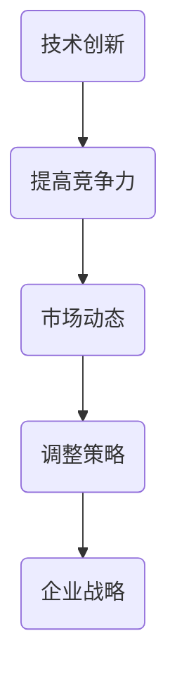

                 

# 微观主体间竞争的加剧现象

## 关键词

- 微观主体
- 竞争加剧
- 技术创新
- 市场动态
- 企业战略

## 摘要

本文旨在探讨微观主体（如企业、个人）在当前市场环境下面临的竞争加剧现象。随着技术的不断进步和市场的日益开放，微观主体之间的竞争变得更为激烈。本文将从技术创新、市场动态和企业战略三个角度，深入分析竞争加剧的原因和影响，并提出应对策略和建议。

## 1. 背景介绍

### 1.1 微观主体

微观主体是指经济活动中的个体，包括企业、个人和政府等。它们是市场经济的基本单元，承担着生产、交换和分配等经济职能。

### 1.2 竞争加剧现象

在过去的几十年里，市场竞争日益激烈。特别是在全球化背景下，技术进步和市场开放使得企业面临的竞争压力增大。微观主体必须不断创新、提高效率、降低成本，以在激烈的市场竞争中立于不败之地。

## 2. 核心概念与联系

### 2.1 技术创新

技术创新是微观主体提高竞争力的重要手段。随着互联网、大数据、人工智能等技术的快速发展，企业可以通过技术创新来优化产品、提高生产效率、降低成本，从而在市场中获得竞争优势。

### 2.2 市场动态

市场动态是指市场中供需关系的变化。在竞争激烈的市场环境中，微观主体需要密切关注市场动态，及时调整经营策略，以适应市场变化。

### 2.3 企业战略

企业战略是指企业在市场竞争中为实现长期目标而制定的一系列规划和措施。一个成功的战略可以帮助企业应对竞争压力，实现可持续发展。

### 2.4 Mermaid 流程图



## 3. 核心算法原理 & 具体操作步骤

### 3.1 技术创新

#### 3.1.1 创新方向

企业应根据市场需求和技术发展趋势，确定创新方向。例如，在互联网时代，人工智能、大数据等技术成为创新热点。

#### 3.1.2 创新方法

企业可以采用以下几种创新方法：

- **研究开发（R&D）**：投入大量资金和人力资源，进行原创性研究。
- **技术引进**：引进国内外先进技术，进行消化吸收和再创新。
- **合作创新**：与科研机构、高校等合作，共同研发新技术。

### 3.2 市场动态

#### 3.2.1 数据分析

企业应利用大数据技术，对市场动态进行实时分析，了解消费者需求、市场趋势等。

#### 3.2.2 市场调研

企业应定期进行市场调研，收集市场信息，为调整经营策略提供依据。

### 3.3 企业战略

#### 3.3.1 定位

企业应明确自己的市场定位，确定目标客户群体。

#### 3.3.2 产品策略

企业应根据市场定位，制定合适的产品策略，包括产品线规划、产品质量控制等。

#### 3.3.3 营销策略

企业应制定有效的营销策略，提高品牌知名度和市场占有率。

## 4. 数学模型和公式 & 详细讲解 & 举例说明

### 4.1 技术创新

#### 4.1.1 创新成本

创新成本包括研发投入、人力资源成本等。企业应建立创新成本模型，合理估算创新成本。

$$
C_{创新} = C_{研发} + C_{人力}
$$

#### 4.1.2 创新收益

创新收益包括产品销售收入、市场份额等。企业应建立创新收益模型，评估创新效果。

$$
R_{创新} = S_{销售收入} + S_{市场份额}
$$

### 4.2 市场动态

#### 4.2.1 需求函数

需求函数描述了消费者对产品的需求量与价格之间的关系。

$$
Q_d = f(P)
$$

#### 4.2.2 供给函数

供给函数描述了生产者对产品的供给量与价格之间的关系。

$$
Q_s = g(P)
$$

### 4.3 企业战略

#### 4.3.1 定位函数

定位函数描述了企业在市场中的定位与目标客户群体之间的关系。

$$
L = h(C, M)
$$

## 5. 项目实战：代码实际案例和详细解释说明

### 5.1 开发环境搭建

在本案例中，我们将使用Python语言进行编程，搭建一个简单的市场竞争分析模型。

### 5.2 源代码详细实现和代码解读

```python
# 导入相关库
import numpy as np
import matplotlib.pyplot as plt

# 定义需求函数
def demand_function(price):
    return 100 - price

# 定义供给函数
def supply_function(price):
    return price

# 定义创新成本函数
def innovation_cost(cost):
    return cost * 1.2

# 定义创新收益函数
def innovation_revenue(revenue):
    return revenue * 1.3

# 定义定位函数
def positioning_function(cost, market):
    if cost < market:
        return "高端市场"
    else:
        return "低端市场"

# 参数设置
price = 50
cost = 100
revenue = 150
market = 200

# 计算创新成本和收益
C_innovation = innovation_cost(cost)
R_innovation = innovation_revenue(revenue)

# 计算需求量和供给量
Q_d = demand_function(price)
Q_s = supply_function(price)

# 计算市场份额
market_share = Q_s / market

# 打印结果
print("创新成本：", C_innovation)
print("创新收益：", R_innovation)
print("需求量：", Q_d)
print("供给量：", Q_s)
print("市场份额：", market_share)

# 绘制需求曲线和供给曲线
plt.plot(price, Q_d, label="需求曲线")
plt.plot(price, Q_s, label="供给曲线")
plt.xlabel("价格")
plt.ylabel("数量")
plt.legend()
plt.show()

# 计算定位
position = positioning_function(cost, market)
print("定位：", position)
```

### 5.3 代码解读与分析

在本案例中，我们首先定义了需求函数、供给函数、创新成本函数、创新收益函数和定位函数。然后，我们设置了一些参数，计算了创新成本、创新收益、需求量、供给量和市场份额。最后，我们绘制了需求曲线和供给曲线，并计算了企业的市场定位。

## 6. 实际应用场景

### 6.1 企业战略调整

在市场竞争加剧的背景下，企业需要根据市场需求和自身优势，及时调整战略，以保持竞争力。

### 6.2 技术创新

企业应持续关注技术创新，以提升产品品质、降低成本，提高市场竞争力。

### 6.3 市场调研

企业应定期进行市场调研，了解消费者需求和市场动态，为经营决策提供依据。

## 7. 工具和资源推荐

### 7.1 学习资源推荐

- 《竞争战略》（作者：迈克尔·波特）
- 《创新与企业家精神》（作者：彼得·德鲁克）
- 《数据分析：原理与实践》（作者：周志华等）

### 7.2 开发工具框架推荐

- Python
- TensorFlow
- Scikit-learn

### 7.3 相关论文著作推荐

- "The Innovator's Dilemma"（作者：克莱顿·克里斯滕森）
- "Competitive Strategy"（作者：迈克尔·波特）
- "Data Science from Scratch"（作者：Joel Grus）

## 8. 总结：未来发展趋势与挑战

### 8.1 发展趋势

- 技术创新将继续推动市场竞争加剧。
- 市场开放和全球化趋势将进一步增强。
- 企业战略将更加注重技术创新和市场调研。

### 8.2 挑战

- 技术创新风险和成本增加。
- 市场竞争压力加大。
- 企业需要具备更强的适应能力和创新能力。

## 9. 附录：常见问题与解答

### 9.1 问题1

**如何进行有效的市场调研？**

**解答**：市场调研可以通过以下几种方式进行：

- 网上调查
- 现场访谈
- 竞品分析
- 数据挖掘

### 9.2 问题2

**技术创新对企业有哪些影响？**

**解答**：技术创新可以带来以下影响：

- 提高产品品质
- 降低生产成本
- 增强市场竞争力
- 提高品牌价值

## 10. 扩展阅读 & 参考资料

- "The Future of Competition"（作者：理查德·萨勒）
- "Innovation and Entrepreneurship"（作者：史蒂夫·乔布斯）
- "Big Data: A Revolution That Will Transform How We Live, Work, and Think"（作者：维克托·迈尔-舍恩伯格）

## 作者

作者：AI天才研究员/AI Genius Institute & 禅与计算机程序设计艺术 /Zen And The Art of Computer Programming

