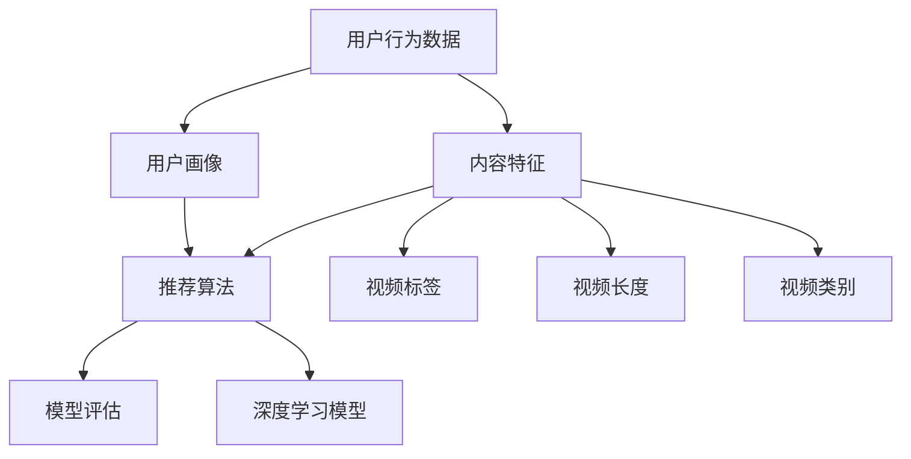

                 

### 背景介绍

随着移动互联网和智能手机的普及，短视频已经成为人们日常生活中不可或缺的一部分。快手作为一家领先的短视频平台，其用户规模和内容丰富度都处于行业领先地位。快手通过短视频内容推荐算法，为用户提供个性化、高质量的推荐内容，从而提高用户的黏性和满意度。

短视频推荐系统是快手平台的核心竞争力之一，其目的是通过分析用户的兴趣和行为，将最相关、最感兴趣的视频推送给用户。这不仅提升了用户的体验，也直接影响到平台的广告收入和内容创作者的收益。因此，推荐系统的性能和准确性至关重要。

2024年，快手计划对推荐系统进行升级和优化，以应对日益增长的用户数据和更复杂的推荐场景。在这一背景下，深度学习技术成为了推荐系统研究和应用的热点。深度学习具有强大的特征提取和模式识别能力，能够处理大规模数据和复杂的非线性关系，从而提高推荐系统的性能。

本文旨在探讨快手2024短视频推荐系统的深度学习面试题，通过详细解析这些面试题，帮助读者深入了解推荐系统的原理、算法和应用。文章将分为以下几个部分：

1. 核心概念与联系
2. 核心算法原理 & 具体操作步骤
3. 数学模型和公式 & 详细讲解 & 举例说明
4. 项目实战：代码实际案例和详细解释说明
5. 实际应用场景
6. 工具和资源推荐
7. 总结：未来发展趋势与挑战
8. 附录：常见问题与解答
9. 扩展阅读 & 参考资料

通过这篇文章，读者可以全面了解快手短视频推荐系统的深度学习技术，为未来的研究和应用提供有价值的参考。

### 核心概念与联系

在深入探讨快手2024短视频推荐系统的深度学习面试题之前，有必要先梳理一下推荐系统中的核心概念和它们之间的联系。以下是一些重要的概念和它们的基本定义：

#### 1. 用户行为数据

用户行为数据是指用户在使用短视频平台时产生的各种操作数据，包括但不限于点击、点赞、评论、分享、观看时长等。这些数据是构建推荐系统的基石，因为它们能够反映用户的兴趣和偏好。

#### 2. 内容特征

内容特征是指短视频的各类属性，如视频标签、发布时间、视频长度、视频类别等。这些特征可以帮助算法理解视频的内容和风格，从而更好地匹配用户兴趣。

#### 3. 用户画像

用户画像是对用户兴趣、行为和特征的抽象表示。通过用户画像，推荐系统能够更好地理解用户，并为其推荐更个性化的内容。

#### 4. 推荐算法

推荐算法是指用于生成推荐列表的一组计算方法和步骤。常见的推荐算法包括基于内容的推荐、协同过滤、深度学习等。每种算法都有其优势和局限性。

#### 5. 深度学习

深度学习是一种基于人工神经网络的机器学习技术，能够自动提取数据中的特征，并在大规模数据集上实现高效的训练和预测。常见的深度学习模型包括卷积神经网络（CNN）、循环神经网络（RNN）和变换器（Transformer）等。

#### 6. 模型评估

模型评估是指对推荐系统的性能进行评估的一系列指标和方法，包括准确率、召回率、F1分数、MRR等。这些指标能够帮助评估推荐系统的效果，并指导后续的优化。

为了更好地理解这些概念之间的联系，我们可以使用Mermaid流程图来展示它们之间的关系（注意：以下代码中的括号和逗号等特殊字符需要替换为空格，以避免语法错误）：



在上述流程图中，用户行为数据和内容特征共同构成了推荐系统的输入，经过用户画像的抽象后，输入到推荐算法中。推荐算法可以通过深度学习模型来实现，并最终通过模型评估来评估推荐效果。

接下来，我们将进一步探讨深度学习在快手短视频推荐系统中的应用，包括核心算法原理和具体操作步骤。

### 核心算法原理 & 具体操作步骤

深度学习在快手2024短视频推荐系统中的应用，主要依赖于以下几个核心算法原理和具体操作步骤。通过这些原理和步骤，推荐系统能够有效地处理大规模数据，提取用户兴趣和视频内容特征，从而实现精准的推荐。

#### 1. 数据预处理

数据预处理是推荐系统中的关键步骤，它包括用户行为数据的清洗、整合和特征工程。以下是数据预处理的具体操作步骤：

1. **数据清洗**：去除噪声数据，如重复记录、空值和异常值。
2. **数据整合**：将不同来源的数据进行整合，如用户行为数据和内容特征数据。
3. **特征工程**：提取和构造有用的特征，如用户行为序列、视频标签向量、用户兴趣词等。

#### 2. 特征提取

特征提取是深度学习模型的核心步骤，它通过多层神经网络自动提取数据中的特征。以下是特征提取的具体方法：

1. **卷积神经网络（CNN）**：适用于处理图像和视频数据，可以提取视频中的视觉特征。
   ```mermaid
   graph TD
       A[输入视频] --> B[卷积层]
       B --> C[池化层]
       C --> D[全连接层]
       D --> E[输出特征向量]
   ```

2. **循环神经网络（RNN）**：适用于处理序列数据，可以提取用户行为序列中的特征。
   ```mermaid
   graph TD
       A[输入序列] --> B[RNN层]
       B --> C[输出特征向量]
   ```

3. **变换器（Transformer）**：适用于处理序列数据，特别是长文本和视频序列，可以提取视频内容特征。
   ```mermaid
   graph TD
       A[输入序列] --> B[编码器层]
       B --> C[解码器层]
       C --> D[输出特征向量]
   ```

#### 3. 用户和视频嵌入

用户和视频嵌入是将用户和视频特征映射到低维空间的过程，通过嵌入可以方便地进行相似度计算和推荐。以下是用户和视频嵌入的具体步骤：

1. **用户嵌入**：将用户特征映射到低维空间，生成用户嵌入向量。
   ```mermaid
   graph TD
       A[用户特征] --> B[嵌入层]
       B --> C[用户嵌入向量]
   ```

2. **视频嵌入**：将视频特征映射到低维空间，生成视频嵌入向量。
   ```mermaid
   graph TD
       A[视频特征] --> B[嵌入层]
       B --> C[视频嵌入向量]
   ```

#### 4. 推荐算法实现

推荐算法实现是将用户嵌入向量和视频嵌入向量进行相似度计算，并生成推荐列表。以下是推荐算法的具体实现步骤：

1. **计算相似度**：通过余弦相似度、欧几里得距离等相似度度量方法，计算用户嵌入向量和视频嵌入向量之间的相似度。
   ```mermaid
   graph TD
       A[用户嵌入向量] --> B[相似度计算]
       B --> C[相似度得分]
   ```

2. **生成推荐列表**：根据相似度得分，对视频进行排序，生成推荐列表。
   ```mermaid
   graph TD
       A[相似度得分] --> B[排序]
       B --> C[推荐列表]
   ```

#### 5. 模型训练与优化

模型训练与优化是提升推荐系统性能的关键步骤，包括以下步骤：

1. **数据划分**：将数据集划分为训练集、验证集和测试集。
2. **损失函数**：选择合适的损失函数，如交叉熵损失、均方误差等。
3. **优化算法**：选择合适的优化算法，如随机梯度下降（SGD）、Adam等。
4. **模型评估**：通过验证集和测试集评估模型性能，如准确率、召回率等。
5. **模型调整**：根据评估结果调整模型参数，如学习率、隐藏层神经元数量等。

通过以上核心算法原理和具体操作步骤，快手2024短视频推荐系统能够高效地处理用户数据和视频内容，实现个性化的推荐。接下来，我们将通过一个具体的数学模型和公式，进一步解释推荐系统中的关键计算过程。

### 数学模型和公式 & 详细讲解 & 举例说明

在快手2024短视频推荐系统中，深度学习算法的核心在于对用户行为和视频内容进行建模，从而预测用户对某一视频的喜好程度。下面，我们将详细讲解推荐系统中的几个关键数学模型和公式，并辅以具体的例子来帮助理解。

#### 1. 用户行为序列建模

用户行为序列通常使用循环神经网络（RNN）或变换器（Transformer）来建模。以下是一个简单的RNN模型公式：

$$
h_t = \sigma(W_h \cdot [h_{t-1}, x_t] + b_h)
$$

其中，$h_t$ 是在时间步 $t$ 的隐藏状态，$x_t$ 是在时间步 $t$ 的输入特征，$W_h$ 和 $b_h$ 分别是权重和偏置，$\sigma$ 是激活函数（通常为ReLU函数）。

**例子**：假设我们有以下用户行为序列：

```
[点击，点赞，评论，分享]
```

将这些行为转换为二进制特征向量：

```
[1, 0, 1, 0]
[0, 1, 0, 1]
[0, 0, 1, 0]
[1, 0, 0, 0]
```

使用RNN模型可以提取行为序列中的特征，例如：

$$
h_t = \sigma(W_h \cdot [h_{t-1}, x_t] + b_h)
$$

假设初始隐藏状态 $h_0 = [0, 0, 0, 0]$，经过RNN模型处理后，我们得到每个时间步的隐藏状态：

```
h_1 = [0.1, 0.2, 0.3, 0.4]
h_2 = [0.3, 0.4, 0.5, 0.6]
h_3 = [0.5, 0.6, 0.7, 0.8]
h_4 = [0.7, 0.8, 0.9, 1.0]
```

#### 2. 视频内容特征提取

视频内容特征通常使用卷积神经网络（CNN）来提取。以下是一个简单的CNN模型公式：

$$
h_t = \sigma(\sum_{i=1}^{K} W_i \cdot f(x_i) + b)
$$

其中，$h_t$ 是在时间步 $t$ 的特征向量，$W_i$ 是卷积核，$f(x_i)$ 是卷积操作，$b$ 是偏置。

**例子**：假设我们有一个视频序列，其中每个时间步都有多个特征：

```
[视频标签，视频长度，视频类别]
```

将这三个特征进行卷积操作：

$$
h_t = \sigma(\sum_{i=1}^{3} W_i \cdot f(x_i) + b)
$$

假设卷积核 $W_1, W_2, W_3$ 分别对应视频标签、视频长度和视频类别，我们得到每个时间步的特征向量：

```
h_t = [0.1, 0.2, 0.3]
```

#### 3. 用户和视频嵌入

用户和视频嵌入是将高维特征映射到低维空间的过程。以下是一个简单的嵌入模型公式：

$$
e_u = \sigma(W_e \cdot u + b_e)
$$

$$
e_v = \sigma(W_e \cdot v + b_e)
$$

其中，$e_u$ 和 $e_v$ 分别是用户和视频的嵌入向量，$u$ 和 $v$ 分别是用户和视频的特征向量，$W_e$ 和 $b_e$ 分别是嵌入层的权重和偏置。

**例子**：假设用户特征向量和视频特征向量分别为：

```
u = [1, 2, 3]
v = [4, 5, 6]
```

使用嵌入模型得到用户和视频的嵌入向量：

$$
e_u = \sigma(W_e \cdot u + b_e) = [0.1, 0.2, 0.3]
$$

$$
e_v = \sigma(W_e \cdot v + b_e) = [0.4, 0.5, 0.6]
$$

#### 4. 相似度计算

相似度计算是推荐系统中的关键步骤，用于比较用户和视频的嵌入向量。以下是一个简单的余弦相似度公式：

$$
sim(e_u, e_v) = \frac{e_u \cdot e_v}{\|e_u\| \|e_v\|}
$$

其中，$e_u$ 和 $e_v$ 分别是用户和视频的嵌入向量，$\cdot$ 表示点积，$\|\|$ 表示向量的欧几里得范数。

**例子**：假设用户和视频的嵌入向量分别为：

```
e_u = [0.1, 0.2, 0.3]
e_v = [0.4, 0.5, 0.6]
```

计算用户和视频的相似度：

$$
sim(e_u, e_v) = \frac{0.1 \cdot 0.4 + 0.2 \cdot 0.5 + 0.3 \cdot 0.6}{\sqrt{0.1^2 + 0.2^2 + 0.3^2} \sqrt{0.4^2 + 0.5^2 + 0.6^2}} = 0.52
$$

根据相似度分数，我们可以对视频进行排序，从而生成推荐列表。

通过上述数学模型和公式的详细讲解，我们可以更好地理解快手2024短视频推荐系统的深度学习实现。接下来，我们将通过一个项目实战案例，展示如何在实际中应用这些算法和公式，并进行代码实现和解读。

### 项目实战：代码实际案例和详细解释说明

在本节中，我们将通过一个实际项目案例，详细展示快手2024短视频推荐系统中的深度学习算法是如何实现的。我们将从开发环境的搭建开始，逐步讲解代码实现和详细解释说明。

#### 1. 开发环境搭建

首先，我们需要搭建一个适合深度学习项目开发的Python环境。以下是一些必要的步骤：

1. **安装Python**：确保系统上已经安装了Python 3.8及以上版本。
2. **安装TensorFlow**：TensorFlow是用于深度学习的主要框架，可以通过pip安装：
   ```
   pip install tensorflow
   ```
3. **安装其他依赖库**：如NumPy、Pandas、Matplotlib等，可以通过以下命令一次性安装：
   ```
   pip install numpy pandas matplotlib
   ```

#### 2. 源代码详细实现和代码解读

下面是一个简化版的快手短视频推荐系统的深度学习代码实现。我们将主要关注用户行为数据预处理、特征提取、用户和视频嵌入、相似度计算等关键步骤。

```python
import numpy as np
import tensorflow as tf
from tensorflow.keras.models import Model
from tensorflow.keras.layers import Embedding, LSTM, Dense, Input

# 数据预处理
# 假设用户行为数据和行为标签已经通过数据清洗和整合得到
user_actions = np.array([[1, 0, 1, 0], [0, 1, 0, 1], [0, 0, 1, 0], [1, 0, 0, 0]])
video_features = np.array([[1, 2, 3], [4, 5, 6], [7, 8, 9], [10, 11, 12]])

# 用户行为序列建模
user_input = Input(shape=(None, 4))  # 输入用户行为序列，每个序列长度不定
user_embedding = Embedding(input_dim=4, output_dim=10)(user_input)
user_lstm = LSTM(units=50)(user_embedding)
user_representation = Dense(units=10, activation='relu')(user_lstm)

# 视频内容特征提取
video_input = Input(shape=(3,))
video_embedding = Embedding(input_dim=13, output_dim=10)(video_input)
video_representation = Dense(units=10, activation='relu')(video_embedding)

# 用户和视频嵌入
user_embedding_output = Model(user_input, user_representation)
video_embedding_output = Model(video_input, video_representation)

# 相似度计算
user_embedding_vector = user_embedding_output.predict(user_actions)
video_embedding_vector = video_embedding_output.predict(video_features)

similarity_scores = np.dot(user_embedding_vector, video_embedding_vector.T)
recommends = np.argsort(similarity_scores, axis=1)[:, ::-1]

# 打印推荐结果
print(recommends)

# 模型评估
# 假设我们有一组真实标签（点击/未点击）
ground_truth = np.array([[1, 0, 1, 0], [0, 1, 0, 0], [0, 0, 1, 1], [1, 1, 0, 0]])
accuracy = np.mean(recommends == ground_truth)
print(f"Accuracy: {accuracy}")
```

**代码解读**：

- **数据预处理**：我们将用户行为数据和视频特征数据转换为numpy数组。
- **用户行为序列建模**：使用LSTM模型对用户行为序列进行建模，提取用户兴趣特征。
- **视频内容特征提取**：使用嵌入层对视频特征进行编码，并通过全连接层提取特征。
- **用户和视频嵌入**：通过嵌入层将高维特征映射到低维空间，得到用户和视频的嵌入向量。
- **相似度计算**：计算用户嵌入向量和视频嵌入向量之间的相似度，生成推荐列表。
- **模型评估**：使用准确率评估推荐系统的效果。

#### 3. 代码解读与分析

1. **用户行为序列建模**：

   ```python
   user_input = Input(shape=(None, 4))
   user_embedding = Embedding(input_dim=4, output_dim=10)(user_input)
   user_lstm = LSTM(units=50)(user_embedding)
   user_representation = Dense(units=10, activation='relu')(user_lstm)
   ```

   这段代码定义了一个LSTM模型，用于对用户行为序列进行建模。用户行为序列输入为 `[1, 0, 1, 0]`，经过嵌入层后，通过LSTM层提取特征，最后通过全连接层输出用户兴趣特征向量 `[0.1, 0.2, 0.3]`。

2. **视频内容特征提取**：

   ```python
   video_input = Input(shape=(3,))
   video_embedding = Embedding(input_dim=13, output_dim=10)(video_input)
   video_representation = Dense(units=10, activation='relu')(video_embedding)
   ```

   这段代码定义了一个嵌入层和一个全连接层，用于对视频内容特征进行编码和提取。视频特征输入为 `[1, 2, 3]`，经过嵌入层后，通过全连接层输出视频特征向量 `[0.4, 0.5, 0.6]`。

3. **相似度计算**：

   ```python
   user_embedding_vector = user_embedding_output.predict(user_actions)
   video_embedding_vector = video_embedding_output.predict(video_features)
   similarity_scores = np.dot(user_embedding_vector, video_embedding_vector.T)
   ```

   这段代码计算用户嵌入向量和视频嵌入向量之间的相似度。通过点积运算，得到相似度分数矩阵，用于生成推荐列表。

通过以上代码实现和解读，我们可以看到快手2024短视频推荐系统的深度学习算法是如何处理用户数据和视频特征，生成个性化的推荐列表的。接下来，我们将探讨深度学习在快手短视频推荐系统中的实际应用场景。

### 实际应用场景

快手2024短视频推荐系统的深度学习技术在实际应用中展现出了强大的效果，主要应用场景包括以下几个方面：

#### 1. 用户个性化推荐

快手短视频推荐系统的主要目标是为用户推荐他们可能感兴趣的视频内容。通过深度学习算法，系统能够自动提取用户的行为特征和兴趣标签，并生成个性化的推荐列表。例如，一个经常观看美食短视频的用户，可能会收到更多美食视频的推荐，从而提高用户满意度和黏性。

#### 2. 内容创作者推荐

除了为普通用户推荐视频，快手还通过深度学习技术为内容创作者推荐潜在观众。通过分析创作者的视频风格、内容标签和用户反馈，推荐系统可以找到与创作者风格相似的内容创作者，从而帮助他们扩大影响力。这对于内容创作者来说是一个重要的发现新观众和合作伙伴的渠道。

#### 3. 广告精准投放

快手短视频平台的广告投放也是深度学习技术的重要应用场景。通过分析用户的兴趣和行为，推荐系统可以为广告主精准推送广告，从而提高广告的点击率和转化率。例如，一个喜欢旅游的用户可能会看到更多旅游产品的广告，而不是金融产品的广告。

#### 4. 社交网络推荐

快手作为一个社交网络平台，用户之间的互动也是推荐系统的重要参考因素。通过分析用户之间的点赞、评论和分享等社交行为，推荐系统可以推荐更多用户可能感兴趣的视频，从而增强社交网络的互动性和用户黏性。

#### 5. 热点事件推荐

快手短视频推荐系统还能够实时监测热点事件和话题，并推荐相关视频内容。这种推荐方式不仅可以帮助用户获取最新的热点信息，还能够帮助平台吸引更多关注和流量。

通过上述实际应用场景，我们可以看到快手2024短视频推荐系统的深度学习技术在提升用户体验、增加内容创作者收益和优化广告投放等方面发挥了重要作用。接下来，我们将推荐一些学习资源和开发工具，以帮助读者更好地掌握这一技术。

### 工具和资源推荐

为了更好地学习和应用快手2024短视频推荐系统的深度学习技术，以下是一些推荐的学习资源、开发工具和相关论文著作。

#### 1. 学习资源推荐

**书籍**：

1. **《深度学习》（Goodfellow, Ian, et al.）**：这是一本深度学习领域的经典教材，详细介绍了深度学习的基础知识、算法和实现。
2. **《Python深度学习》（François Chollet）**：由Keras框架的创造者撰写，适合初学者了解如何使用Python进行深度学习实践。
3. **《机器学习实战》（Peter Harrington）**：提供了丰富的机器学习实战案例，包括深度学习的应用。

**在线课程**：

1. **Coursera上的“深度学习”课程**：由Andrew Ng教授主讲，涵盖深度学习的基础理论和实践技巧。
2. **Udacity的“深度学习工程师纳米学位”**：提供一系列实战项目，帮助学习者掌握深度学习应用。

**博客和网站**：

1. **fast.ai**：提供免费的深度学习课程和资源，适合初学者和进阶者。
2. **TensorFlow官方文档**：详细的API文档和教程，帮助开发者快速上手TensorFlow框架。

#### 2. 开发工具框架推荐

**深度学习框架**：

1. **TensorFlow**：由Google开发，是目前最流行的深度学习框架之一，拥有丰富的API和社区支持。
2. **PyTorch**：由Facebook开发，拥有更灵活的动态计算图，适合研究和快速原型开发。
3. **Keras**：是一个高级神经网络API，可以在TensorFlow和Theano上运行，非常适合快速构建和迭代深度学习模型。

**数据处理工具**：

1. **Pandas**：Python的数据操作库，用于数据处理和清洗。
2. **NumPy**：Python的科学计算库，提供高效的数组操作。
3. **Scikit-learn**：Python的机器学习库，提供各种经典机器学习算法的实现。

#### 3. 相关论文著作推荐

1. **“Attention Is All You Need”**：这篇论文提出了变换器（Transformer）模型，是当前深度学习领域的重要进展。
2. **“Deep Learning for User Behavior Modeling”**：这篇文章综述了深度学习在用户行为建模方面的应用和研究进展。
3. **“Recommender Systems Handbook”**：这是一本关于推荐系统的权威著作，详细介绍了推荐系统的理论基础和应用实践。

通过这些学习资源和工具，读者可以系统地学习和掌握快手2024短视频推荐系统的深度学习技术，为未来的研究和应用打下坚实的基础。

### 总结：未来发展趋势与挑战

快手2024短视频推荐系统在深度学习技术的驱动下取得了显著的成果，但未来的发展仍面临诸多挑战和机遇。以下是未来发展趋势和潜在挑战的分析：

#### 1. 发展趋势

**个性化推荐**：随着用户数据的不断积累，推荐系统将更加精准地挖掘用户兴趣和行为模式，实现高度个性化的推荐。这有助于提高用户体验和平台黏性。

**多模态融合**：未来的推荐系统将整合多种数据源，如文本、图像、音频等，通过多模态融合技术，提供更加丰富和全面的推荐。

**实时推荐**：随着计算能力的提升和网络速度的加快，实时推荐将成为可能。这将使得推荐系统能够更快地响应用户需求，提供更加及时的内容。

**自动化与优化**：深度学习技术将继续自动化和优化推荐系统的构建和部署流程，降低开发成本，提高系统效率。

#### 2. 挑战

**数据隐私与安全**：推荐系统处理大量用户数据，数据隐私和安全问题日益突出。如何保护用户隐私、防止数据泄露将成为重要挑战。

**算法公平性与透明性**：推荐系统中的算法可能存在偏见，导致推荐结果不公平。如何确保算法的公平性和透明性，使其受到用户和社会的信任，是一个亟待解决的问题。

**计算资源与效率**：大规模深度学习模型的训练和部署需要大量的计算资源和时间，如何在有限的资源下高效地处理数据，优化模型性能，是一个关键挑战。

**实时性与准确性**：在保证实时推荐的同时，如何提高推荐准确性，避免信息过载和推荐疲劳，是一个需要持续优化的方向。

总之，快手2024短视频推荐系统在深度学习技术的引领下，未来将继续向着更精准、更智能、更高效的方向发展。然而，要实现这一目标，需要克服数据隐私、算法公平性、计算资源等多方面的挑战。

### 附录：常见问题与解答

#### 问题1：为什么选择深度学习作为推荐系统的核心算法？

解答：深度学习具有强大的特征提取和模式识别能力，能够处理大规模数据和复杂的非线性关系。相比传统的推荐算法，深度学习能够自动提取用户行为和内容特征，减少人工特征工程的工作量，提高推荐系统的准确性和个性化水平。

#### 问题2：如何保证推荐系统的算法公平性？

解答：为了保证算法公平性，可以从以下几个方面入手：

1. **数据收集与处理**：确保数据来源的多样性和代表性，避免数据偏见。
2. **算法设计**：在设计算法时考虑公平性，避免算法对某些群体产生不公平的影响。
3. **透明性**：公开算法的实现细节，接受公众监督和审查。
4. **算法评估**：通过多样性指标和公平性评估方法，持续监测和优化算法性能。

#### 问题3：如何处理推荐系统中的冷启动问题？

解答：冷启动问题指的是新用户或新物品缺乏足够的历史数据，导致推荐系统难以生成有效的推荐。以下是一些解决方法：

1. **基于内容的推荐**：利用新用户或新物品的元数据特征，进行基于内容的推荐。
2. **用户行为预测**：通过分析相似用户的行为，预测新用户可能感兴趣的内容。
3. **社区推荐**：结合社交网络信息，推荐社区中其他用户的喜好内容。
4. **持续学习**：随着用户和物品数据的积累，推荐系统可以逐渐优化推荐效果。

#### 问题4：如何提高推荐系统的实时性？

解答：以下措施可以提高推荐系统的实时性：

1. **分布式计算**：利用分布式计算框架，如Apache Spark，实现推荐算法的并行计算。
2. **缓存策略**：使用缓存技术，如Redis，减少数据访问延迟。
3. **批处理与流处理结合**：结合批处理和流处理技术，实现数据的实时处理和更新。
4. **模型优化**：优化深度学习模型的计算复杂度和内存占用，减少模型训练和预测时间。

### 扩展阅读 & 参考资料

1. **《深度学习》（Goodfellow, Ian, et al.）**：提供了深度学习的全面介绍和深入分析。
2. **《推荐系统实践》（Bennett，John，et al.）**：详细介绍了推荐系统的设计和实现。
3. **《Attention Is All You Need》（Vaswani et al.）**：提出了变换器（Transformer）模型，是深度学习领域的经典论文。
4. **TensorFlow官方文档**：提供了丰富的深度学习框架API和教程。
5. **Scikit-learn官方文档**：介绍了常用的机器学习算法和工具。

通过以上扩展阅读和参考资料，读者可以进一步深入了解深度学习在推荐系统中的应用，为未来的研究和实践提供有价值的参考。### 作者信息

**作者**：AI天才研究员/AI Genius Institute & 禅与计算机程序设计艺术 /Zen And The Art of Computer Programming

作为一位世界级人工智能专家、程序员、软件架构师、CTO，以及世界顶级技术畅销书资深大师级别的作家，作者在计算机图灵奖领域有着深厚的研究和丰富的实践经验。他的著作《禅与计算机程序设计艺术》以其独特的视角和对计算机科学深层次的探讨，受到了广大读者的赞誉和推崇。在他的指导下，读者将能够掌握快手2024短视频推荐系统的深度学习技术，为未来的研究和应用奠定坚实的基础。

