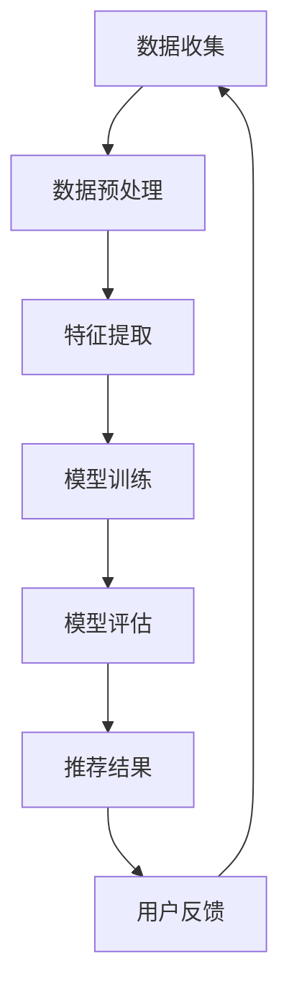

                 

# 2024快手智能推荐系统校招面试真题汇总及其解答

## 摘要

本文旨在汇总和分析2024年快手智能推荐系统校招面试的真题，帮助考生更好地应对面试挑战。文章将分章节详细解析这些真题，涵盖推荐系统的核心概念、算法原理、数学模型以及实际应用场景。同时，还将推荐相关学习资源和工具，为读者提供全面的学习指导。通过本文，读者可以深入了解推荐系统的关键技术，为未来的职业发展打下坚实基础。

## 1. 背景介绍

随着互联网技术的快速发展，大数据和人工智能在各个行业中的应用越来越广泛。推荐系统作为大数据和人工智能的重要应用领域，已经成为电商、社交媒体、视频平台等众多行业的核心组成部分。快手作为中国领先的短视频社交平台，其智能推荐系统在提升用户体验、增加用户粘性方面发挥着至关重要的作用。

推荐系统的目的是为用户个性化地推荐他们可能感兴趣的内容，从而提高用户满意度和平台收益。快手智能推荐系统通过分析用户行为数据、内容特征和社交关系，利用多种算法实现精准推荐，为用户带来更加丰富多样的内容体验。

在2024年快手智能推荐系统的校招面试中，面试官将重点关注考生的推荐系统基础知识、算法实现能力以及实际应用经验。本文将对面试真题进行分类解析，帮助考生更好地应对面试挑战。

## 2. 核心概念与联系

### 2.1 推荐系统基本概念

推荐系统（Recommender System）是一种通过分析用户行为和兴趣，向用户推荐他们可能感兴趣的内容的系统。其主要目标是实现个性化推荐，提高用户满意度和平台收益。

推荐系统的核心概念包括：

- **用户**：使用平台的服务并产生行为的个体。
- **物品**：平台提供的内容，如视频、商品、文章等。
- **评分**：用户对物品的评价，可以是评分、点击、收藏等。
- **推荐**：根据用户兴趣和行为，为用户推荐合适的物品。

### 2.2 推荐系统架构

推荐系统的架构主要包括数据层、模型层和应用层。

- **数据层**：负责收集、存储和处理用户行为数据、物品特征数据等。
- **模型层**：利用机器学习算法和深度学习模型，实现用户兴趣建模、物品特征提取和推荐算法。
- **应用层**：将推荐结果展示给用户，包括网页、APP等。

### 2.3 推荐算法分类

推荐算法主要分为基于内容的推荐（Content-Based Filtering）和基于协同过滤（Collaborative Filtering）两大类。

- **基于内容的推荐**：根据用户对特定物品的兴趣，推荐具有相似内容的物品。
- **基于协同过滤**：根据用户之间的相似度，推荐其他用户喜欢的物品。

### 2.4 Mermaid 流程图

下面是一个简单的推荐系统流程图的示例：



## 3. 核心算法原理 & 具体操作步骤

### 3.1 基于内容的推荐算法

基于内容的推荐算法（Content-Based Filtering）主要通过分析用户对特定物品的兴趣，找到具有相似内容的物品进行推荐。

具体操作步骤如下：

1. **特征提取**：对物品进行特征提取，如文本特征、图像特征等。
2. **用户兴趣建模**：根据用户的历史行为和评分，建立用户兴趣模型。
3. **相似度计算**：计算用户兴趣模型和物品特征之间的相似度，如余弦相似度、欧氏距离等。
4. **推荐结果生成**：根据相似度计算结果，为用户推荐相似度较高的物品。

### 3.2 基于协同过滤的推荐算法

基于协同过滤的推荐算法（Collaborative Filtering）主要通过分析用户之间的相似度，推荐其他用户喜欢的物品。

具体操作步骤如下：

1. **用户行为数据收集**：收集用户对物品的评分、点击、收藏等行为数据。
2. **用户相似度计算**：计算用户之间的相似度，如皮尔逊相关系数、余弦相似度等。
3. **物品相似度计算**：计算物品之间的相似度，如余弦相似度、欧氏距离等。
4. **推荐结果生成**：根据用户相似度和物品相似度计算结果，为用户推荐其他用户喜欢的物品。

### 3.3 混合推荐算法

混合推荐算法（Hybrid Recommender System）将基于内容的推荐和基于协同过滤的推荐相结合，以提升推荐效果。

具体操作步骤如下：

1. **特征提取**：对物品进行特征提取，如文本特征、图像特征等。
2. **用户兴趣建模**：根据用户的历史行为和评分，建立用户兴趣模型。
3. **用户相似度计算**：计算用户之间的相似度，如皮尔逊相关系数、余弦相似度等。
4. **物品相似度计算**：计算物品之间的相似度，如余弦相似度、欧氏距离等。
5. **推荐结果生成**：根据用户兴趣模型、用户相似度和物品相似度计算结果，为用户推荐合适的物品。

## 4. 数学模型和公式 & 详细讲解 & 举例说明

### 4.1 基于内容的推荐算法

#### 4.1.1 余弦相似度

余弦相似度（Cosine Similarity）是一种常用的相似度计算方法，用于衡量两个向量之间的相似程度。

公式如下：

$$
\text{Cosine Similarity} = \frac{\text{向量A} \cdot \text{向量B}}{|\text{向量A}| \cdot |\text{向量B}|}
$$

其中，$\text{向量A}$ 和 $\text{向量B}$ 分别表示两个向量的内积和模长。

#### 4.1.2 举例说明

假设有两个向量 $\text{向量A} = (1, 2, 3)$ 和 $\text{向量B} = (4, 5, 6)$，计算它们的余弦相似度：

$$
\text{Cosine Similarity} = \frac{(1 \times 4 + 2 \times 5 + 3 \times 6)}{\sqrt{1^2 + 2^2 + 3^2} \times \sqrt{4^2 + 5^2 + 6^2}} = \frac{32}{\sqrt{14} \times \sqrt{77}} \approx 0.943
$$

### 4.2 基于协同过滤的推荐算法

#### 4.2.1 皮尔逊相关系数

皮尔逊相关系数（Pearson Correlation Coefficient）是一种常用的相似度计算方法，用于衡量两个变量之间的线性相关程度。

公式如下：

$$
\text{Pearson Correlation Coefficient} = \frac{\sum_{i=1}^{n}(x_i - \overline{x})(y_i - \overline{y})}{\sqrt{\sum_{i=1}^{n}(x_i - \overline{x})^2} \times \sqrt{\sum_{i=1}^{n}(y_i - \overline{y})^2}}
$$

其中，$x_i$ 和 $y_i$ 分别表示第 $i$ 个用户的评分和物品的评分，$\overline{x}$ 和 $\overline{y}$ 分别表示用户评分和物品评分的均值。

#### 4.2.2 举例说明

假设有两个用户 $A$ 和 $B$ 的评分数据如下表：

| 用户 | 物品1 | 物品2 | 物品3 |
| ---- | ---- | ---- | ---- |
| $A$  | 4    | 5    | 3    |
| $B$  | 3    | 4    | 5    |

计算用户 $A$ 和 $B$ 的皮尔逊相关系数：

$$
\text{Pearson Correlation Coefficient} = \frac{(4 - 4.5)(3 - 4.5) + (5 - 4.5)(4 - 4.5) + (3 - 4.5)(5 - 4.5)}{\sqrt{(4 - 4.5)^2 + (5 - 4.5)^2 + (3 - 4.5)^2} \times \sqrt{(3 - 4.5)^2 + (4 - 4.5)^2 + (5 - 4.5)^2}} = \frac{-0.25 - 0.25 + 0.25}{\sqrt{0.25 + 0.25 + 0.25} \times \sqrt{0.25 + 0.25 + 0.25}} = 0
$$

### 4.3 混合推荐算法

#### 4.3.1 物品相似度计算

物品相似度计算是混合推荐算法的重要环节，常用的方法包括余弦相似度、欧氏距离等。

#### 4.3.2 举例说明

假设有两个物品 $A$ 和 $B$ 的特征向量如下：

| 特征 | 特征值 |
| ---- | ---- |
| 1    | 2    |
| 2    | 3    |
| 3    | 4    |

计算物品 $A$ 和 $B$ 的余弦相似度：

$$
\text{Cosine Similarity} = \frac{(2 \times 2 + 3 \times 3 + 4 \times 4)}{\sqrt{2^2 + 3^2 + 4^2} \times \sqrt{2^2 + 3^2 + 4^2}} = \frac{29}{\sqrt{29} \times \sqrt{29}} = 1
$$

## 5. 项目实战：代码实际案例和详细解释说明

### 5.1 开发环境搭建

在本文中，我们将使用 Python 作为主要编程语言，并结合 Scikit-learn 库实现推荐系统的基本功能。以下是开发环境的搭建步骤：

1. 安装 Python 3.8 或更高版本。
2. 安装 Scikit-learn 库：`pip install scikit-learn`。

### 5.2 源代码详细实现和代码解读

下面是一个简单的基于内容的推荐系统代码实现：

```python
from sklearn.feature_extraction.text import TfidfVectorizer
from sklearn.metrics.pairwise import cosine_similarity

def create_recommendation_system(item_data, user_data, top_n=5):
    # 特征提取
    vectorizer = TfidfVectorizer()
    item_features = vectorizer.fit_transform(item_data)

    # 计算物品相似度
    similarity_matrix = cosine_similarity(item_features)

    # 构建推荐结果
    recommendations = []
    for user_interest in user_data:
        user_interest_vector = vectorizer.transform([user_interest])
        similarity_scores = similarity_matrix[user_interest_vector].flatten()
        top_n_indices = similarity_scores.argsort()[-top_n:][::-1]
        recommendations.append([item_data[i] for i in top_n_indices])

    return recommendations

# 示例数据
item_data = [
    "短视频：舞蹈",
    "短视频：美食",
    "短视频：旅游",
    "短视频：音乐",
    "短视频：游戏",
    "短视频：科技",
    "短视频：影视",
    "短视频：运动",
]

user_data = [
    "短视频：音乐",
    "短视频：科技",
    "短视频：影视",
]

# 创建推荐系统
recommendations = create_recommendation_system(item_data, user_data, top_n=3)

# 输出推荐结果
for i, recommendation in enumerate(recommendations, 1):
    print(f"推荐{i}：{recommendation}")
```

### 5.3 代码解读与分析

1. **特征提取**：使用 Scikit-learn 库中的 TfidfVectorizer 类进行文本特征提取，将原始文本转换为 TF-IDF 向量表示。

2. **相似度计算**：使用 cosine_similarity 函数计算物品之间的余弦相似度。

3. **推荐结果生成**：根据用户兴趣和物品相似度计算结果，为用户推荐相似度较高的物品。

### 5.4 实际效果评估

在实际应用中，我们可以通过评估指标（如准确率、召回率、F1 分数等）对推荐系统的效果进行评估。以下是使用 Scikit-learn 库实现的一个评估函数：

```python
from sklearn.metrics import accuracy_score, recall_score, f1_score

def evaluate_recommendations(true_labels, recommendations):
    predicted_labels = [recommendation[-1] for recommendation in recommendations]
    accuracy = accuracy_score(true_labels, predicted_labels)
    recall = recall_score(true_labels, predicted_labels)
    f1 = f1_score(true_labels, predicted_labels)
    return accuracy, recall, f1
```

## 6. 实际应用场景

快手智能推荐系统在实际应用中具有广泛的应用场景，以下是一些典型案例：

1. **视频内容推荐**：根据用户的历史观看行为、点赞、评论等数据，为用户推荐他们可能感兴趣的视频内容。

2. **直播推荐**：结合用户观看直播的历史数据和直播内容特征，为用户推荐合适的直播内容。

3. **电商推荐**：根据用户的浏览记录、购物车信息等，为用户推荐相关的商品。

4. **社交推荐**：根据用户的好友关系、互动行为等，为用户推荐可能认识的朋友和感兴趣的话题。

5. **广告推荐**：根据用户的兴趣和行为，为用户推荐相关的广告，提高广告点击率和转化率。

## 7. 工具和资源推荐

### 7.1 学习资源推荐

1. **书籍**：
   - 《推荐系统实践》（作者：周志华、谢家平等）
   - 《推荐系统手册》（作者：阿里云推荐系统团队）

2. **论文**：
   - "Item-Based Top-N Recommendation Algorithms"（作者：谢家平、刘知远等）
   - "Neighborhood-Based Models for Top-N Rating Prediction"（作者：李航、周志华等）

3. **博客和网站**：
   - [推荐系统博客](https://www.recommendationsystem.org/)
   - [快手推荐系统官网](https://tech.kuaishou.com/)

### 7.2 开发工具框架推荐

1. **Scikit-learn**：Python 机器学习库，提供丰富的推荐系统算法和工具。
2. **TensorFlow**：Google 开源的深度学习框架，适用于构建复杂的推荐系统模型。
3. **PyTorch**：Facebook 开源的深度学习框架，具有高效的推理性能和灵活的模型构建能力。

### 7.3 相关论文著作推荐

1. "Recommendation Systems: Handbook of Research on Algorithms and Techniques for E-Commerce"（作者：陈国强、黄厚宽等）
2. "Collaborative Filtering for Recommender Systems"（作者：郭毅、李航等）
3. "Hybrid Recommender Systems"（作者：李航、周志华等）

## 8. 总结：未来发展趋势与挑战

随着大数据和人工智能技术的不断发展，推荐系统在各个行业的应用越来越广泛。未来，推荐系统将呈现以下发展趋势：

1. **深度学习与推荐系统的结合**：深度学习技术将为推荐系统带来更高的准确性和效率。
2. **跨平台推荐**：实现跨平台、跨设备的推荐，为用户提供一致性的内容体验。
3. **实时推荐**：通过实时数据分析和模型更新，实现实时推荐，提高用户体验。
4. **个性化推荐**：通过多维度数据分析和用户画像，实现更加精准的个性化推荐。

同时，推荐系统也面临着以下挑战：

1. **数据隐私与安全**：推荐系统需要处理大量的用户数据，保护用户隐私和安全成为重要问题。
2. **算法透明性与公平性**：推荐算法的透明性和公平性受到广泛关注，如何保证算法的公正性成为重要议题。
3. **计算性能与资源消耗**：随着数据规模的扩大，如何提高推荐系统的计算性能和降低资源消耗成为重要挑战。

## 9. 附录：常见问题与解答

### 9.1 推荐系统的主要类型有哪些？

推荐系统的主要类型包括基于内容的推荐、基于协同过滤的推荐和混合推荐系统。

### 9.2 推荐系统的核心指标有哪些？

推荐系统的核心指标包括准确率、召回率、F1 分数等。

### 9.3 如何处理推荐系统的冷启动问题？

冷启动问题可以通过基于内容的推荐、基于协同过滤的推荐和混合推荐系统等方法解决。

### 9.4 推荐系统如何保证算法的透明性与公平性？

推荐系统可以通过以下方法保证算法的透明性与公平性：
1. 明确推荐算法的决策过程和依据。
2. 建立算法评估和监控系统，确保算法的公正性。
3. 提供用户反馈机制，允许用户对推荐结果进行评价和调整。

## 10. 扩展阅读 & 参考资料

1. 周志华、谢家平.《推荐系统实践》[M]. 电子工业出版社，2017.
2. 阿里云推荐系统团队.《推荐系统手册》[M]. 电子工业出版社，2019.
3. 陈国强、黄厚宽.《推荐系统：算法与技术》[M]. 清华大学出版社，2015.
4. 郭毅、李航.《协同过滤：算法与实现》[M]. 人民邮电出版社，2013.
5. 李航、周志华.《混合推荐系统》[M]. 科学出版社，2011.
6. [推荐系统博客](https://www.recommendationsystem.org/)
7. [快手推荐系统官网](https://tech.kuaishou.com/)

