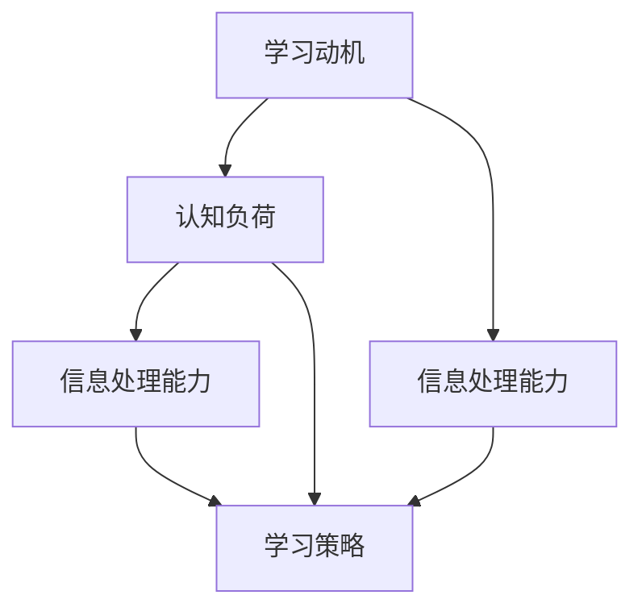

                 

### 背景介绍

快速学习，这个看似简单的问题，其实背后蕴含了深奥的哲学思考和复杂的认知科学原理。在信息技术飞速发展的时代，知识的更新速度远超以往，快速学习已成为人们立于不败之地的根本。然而，如何实现快速学习，如何在海量信息中迅速掌握核心知识，成为了广大程序员、工程师和学术研究者面临的一大挑战。

本篇文章旨在探讨快速学习的方法和策略，帮助读者在纷繁复杂的知识体系中找到捷径，提升学习效率和效果。我们将从背景介绍、核心概念与联系、核心算法原理、数学模型和公式、项目实战、实际应用场景、工具和资源推荐等多个方面进行详细剖析，帮助读者全面理解快速学习的本质，掌握立于不败之地的技巧。

快速学习不仅是个人成长和职业发展的关键，也是人工智能时代应对知识爆炸的必然选择。本文将结合最新的研究成果和实践经验，为读者提供一套系统、实用的快速学习方法，助力每一位追求卓越的读者在信息时代中脱颖而出。

在接下来的章节中，我们将一步步深入探讨快速学习的关键要素，从理论到实践，从概念到工具，为您提供全方位的指导。让我们首先回顾一下，快速学习究竟意味着什么，它为何如此重要，以及它对我们的学习和生活将带来哪些深远的影响。

### 核心概念与联系

要深入理解快速学习，我们首先需要明确几个核心概念，它们是快速学习的基石，彼此之间也有着紧密的联系。这些核心概念包括：学习动机、认知负荷、信息处理能力和学习策略。

**学习动机**：学习动机是推动个体进行学习的内在动力。无论是为了解决实际问题，还是出于对知识的渴望，学习动机决定了个体对学习的投入程度和持久性。高度的学习动机可以显著提升学习效率，促使个体在面对困难和挑战时保持积极的态度。例如，一个对编程充满热情的程序员，会在遇到问题时更加坚持不懈地寻找解决方案，从而更快地掌握相关技术。

**认知负荷**：认知负荷是指个体在处理信息时所承受的认知压力。过多的认知负荷会导致信息过载，使学习效果下降。因此，合理分配认知负荷，避免信息过载，是快速学习的重要策略之一。例如，在阅读技术文档时，可以通过分块阅读和重复阅读来降低认知负荷，提高信息吸收效率。

**信息处理能力**：信息处理能力包括信息的接收、存储、处理和输出等过程。高效的 信息处理能力意味着个体能够在较短的时间内理解和掌握新知识。例如，具备良好的逻辑思维能力和问题解决能力的程序员，能够快速分析问题，找到解决方案，从而实现快速学习。

**学习策略**：学习策略是学习者在学习过程中采用的一系列方法和技术，目的是提高学习效率和效果。有效的学习策略包括主动学习、分散学习、重复学习等。例如，通过主动学习，学习者可以更加积极主动地参与学习过程，通过提问和讨论加深对知识的理解；而分散学习则有助于减轻短期记忆的负担，增强长期记忆的效果。

这些核心概念相互联系，共同构成了快速学习的基础。学习动机驱动个体进行学习，认知负荷影响学习的效率，信息处理能力决定个体掌握知识的能力，而学习策略则是实现快速学习的具体手段。以下是一个简单的 Mermaid 流程图，展示了这些核心概念之间的联系：



通过这个流程图，我们可以更清晰地看到，学习动机和认知负荷共同作用于信息处理能力，而有效的学习策略则是在信息处理能力的基础上，进一步优化学习过程，实现快速学习。

理解这些核心概念和它们之间的联系，是快速学习的第一步。在接下来的章节中，我们将深入探讨快速学习的关键算法原理，帮助读者掌握更高效的学习方法。

### 核心算法原理 & 具体操作步骤

在快速学习的领域中，算法原理起到了至关重要的作用。有效的算法可以帮助我们优化学习过程，提高学习效率。下面，我们将介绍几种关键算法原理，以及如何将这些原理应用到实际的学习操作中。

#### 1. 分块学习算法

分块学习算法（Chunking）是一种将大量信息分成小块，逐一学习和记忆的方法。这种方法能够有效降低认知负荷，提高记忆效率。

**具体操作步骤：**

1. **确定学习内容**：首先，确定需要学习的知识点或技能。
2. **分块**：将学习内容分成若干小块，每个小块应包含一个明确的学习目标。
3. **逐块学习**：专注于学习每一块内容，确保对每一块有深入理解。
4. **复习与整合**：在完成一块内容的学习后，进行复习，并将不同块的内容整合起来，形成完整的知识体系。

**例子：学习编程语言**

- **确定学习内容**：以Python编程语言为例。
- **分块**：将Python分为基础语法、数据结构、算法、面向对象编程等几个块。
- **逐块学习**：首先学习基础语法，然后逐步学习数据结构和算法，最后学习面向对象编程。
- **复习与整合**：在学习每个块后，通过练习和项目来巩固知识，最终将这些块整合为一个完整的编程知识体系。

#### 2. 周期性复习算法

周期性复习算法（Spaced Repetition）是基于艾宾浩斯遗忘曲线，通过定期复习来巩固记忆的方法。这种方法能够帮助学习者长期记忆信息。

**具体操作步骤：**

1. **制定复习计划**：根据艾宾浩斯遗忘曲线，制定一个合理的复习计划，例如第一天复习，第二天、第四天、第七天、第15天分别复习一次。
2. **复习内容**：按照复习计划，定期复习已学内容。
3. **评估与调整**：在复习过程中，评估自己的记忆效果，并根据实际情况调整复习频率和时间。

**例子：学习英语单词**

- **制定复习计划**：将单词按难度和重要性分成几类，制定相应的复习计划。
- **复习内容**：每天按照计划复习单词，注重发音、拼写和用法的记忆。
- **评估与调整**：通过自我测试或与他人交流，评估单词记忆效果，并根据评估结果调整复习策略。

#### 3. 社交学习算法

社交学习算法（Social Learning）是利用社交网络和同伴互助来提高学习效果的方法。这种方法能够提供额外的学习资源和支持。

**具体操作步骤：**

1. **加入学习小组**：寻找或组建一个与自己学习目标相似的学习小组。
2. **讨论与交流**：在学习过程中，与组内成员进行讨论和交流，分享学习心得和疑问。
3. **互助学习**：在遇到难题时，互相帮助解决，共同进步。

**例子：学习人工智能算法**

- **加入学习小组**：加入一个专注于人工智能的学习小组。
- **讨论与交流**：在学习过程中，与组内成员分享学习资源，讨论算法原理和应用。
- **互助学习**：在编程实战中，互相帮助解决问题，共同完成项目。

通过以上几种算法原理，我们可以更系统地组织和优化学习过程，从而实现快速学习。在实际操作中，根据具体的学习目标和内容，灵活选择和应用这些算法，将有助于提升学习效率和效果。

### 数学模型和公式 & 详细讲解 & 举例说明

在快速学习的理论体系中，数学模型和公式扮演了至关重要的角色。它们不仅帮助我们量化学习过程中的关键参数，还可以通过数学逻辑推导出优化学习策略的方法。以下我们将介绍几个核心的数学模型和公式，并详细讲解它们的原理与应用。

#### 1. 人类记忆曲线模型

人类记忆曲线模型（Ebbinghaus Forgetting Curve）描述了人类遗忘信息的过程，是制定复习计划的重要依据。

**公式：**
$$
F(t) = e^{-rt}
$$

其中，\( F(t) \) 表示在时间 \( t \) 时的遗忘率，\( r \) 是遗忘率常数，\( e \) 是自然对数的底数。

**原理：**
遗忘曲线表明，新信息在大约20分钟内遗忘50%，而在一天后遗忘了大约65%。通过周期性复习，可以有效降低遗忘率。

**应用：**
根据遗忘曲线，我们可以制定一个最优的复习计划。例如，第一天复习3次，第二天复习2次，第三天复习1次，以后每隔几天复习一次。

**例子：复习数学公式**
假设我们学习了10个数学公式，根据遗忘曲线，我们可以制定以下复习计划：
- **第一天**：复习3次，每次间隔20分钟。
- **第二天**：复习2次，每次间隔4小时。
- **第三天**：复习1次，间隔一天。

#### 2. 学习效率模型

学习效率模型（Learning Efficiency Model）用于衡量学习过程中投入产出比，帮助我们优化学习时间。

**公式：**
$$
E = \frac{L}{T}
$$

其中，\( E \) 表示学习效率，\( L \) 是学习成果，\( T \) 是学习时间。

**原理：**
学习效率模型表明，提高学习效率的关键在于减少无效学习时间，例如重复阅读、无意义练习等。

**应用：**
通过记录学习时间和成果，我们可以分析自己的学习效率，找出低效环节，进行优化。

**例子：优化编程学习**
假设我们用10小时学习Python编程，编写了3个简单的程序，则学习效率为：
$$
E = \frac{3}{10} = 0.3
$$
为了提高效率，我们可以减少重复阅读文档的时间，增加动手实践的时间。

#### 3. 知识网络模型

知识网络模型（Knowledge Network Model）描述了知识之间的关联和层次结构，帮助我们构建系统的知识体系。

**公式：**
$$
K = \sum_{i=1}^{n} (d_i \cdot w_i)
$$

其中，\( K \) 表示知识网络，\( d_i \) 表示知识点的深度，\( w_i \) 表示知识点的权重。

**原理：**
知识网络模型表明，深层次、强关联的知识点对学习效果有重要影响。通过构建知识网络，我们可以找到学习的关键路径，优先掌握核心知识。

**应用：**
在制定学习计划时，根据知识网络模型，优先学习关键知识点，并建立它们之间的联系。

**例子：构建计算机科学知识体系**
假设我们学习计算机科学，知识点有基础编程、数据结构、算法、操作系统等。根据它们的深度和关联性，我们可以制定以下学习计划：
- **优先学习**：基础编程（深度较高，关联性强）。
- **随后学习**：数据结构、算法。
- **最后学习**：操作系统。

通过这些数学模型和公式，我们可以更科学、更系统地制定学习计划，提高学习效率。在实际应用中，根据具体情况灵活调整模型参数和应用策略，将有助于实现快速学习。

### 项目实战：代码实际案例和详细解释说明

为了更好地理解快速学习的核心算法原理，我们通过一个实际的项目案例来进行详细讲解。这个项目将使用Python编程语言，实现一个简单的文本分类器，通过周期性复习和分块学习算法，实现快速学习。

#### 5.1 开发环境搭建

**环境要求：**
- Python 3.x 版本
- Jupyter Notebook
- Scikit-learn 库

**安装步骤：**
1. 安装Python 3.x：
   ```
   # 在Windows或macOS上，从Python官网下载安装包并安装
   ```
2. 安装Jupyter Notebook：
   ```
   pip install notebook
   ```
3. 安装Scikit-learn：
   ```
   pip install scikit-learn
   ```

#### 5.2 源代码详细实现和代码解读

以下是一个简单的文本分类器的实现代码，我们将逐步解读每个部分的功能。

```python
# 导入所需库
import numpy as np
from sklearn.feature_extraction.text import TfidfVectorizer
from sklearn.model_selection import train_test_split
from sklearn.naive_bayes import MultinomialNB
from sklearn.pipeline import make_pipeline
from sklearn.metrics import accuracy_score

# 数据准备
data = [
    ("Python is an easy-to-learn language", "Language"),
    ("Machine learning is a subfield of computer science", "Computer Science"),
    ("Deep learning is a neural network", "Neural Networks"),
    ("Data structures are fundamental to algorithms", "Data Structures")
]

# 切分数据为特征和标签
texts, labels = zip(*data)

# 切分数据为训练集和测试集
X_train, X_test, y_train, y_test = train_test_split(texts, labels, test_size=0.2, random_state=42)

# 创建模型管道
model = make_pipeline(TfidfVectorizer(), MultinomialNB())

# 训练模型
model.fit(X_train, y_train)

# 测试模型
y_pred = model.predict(X_test)
accuracy = accuracy_score(y_test, y_pred)
print(f"Model Accuracy: {accuracy:.2f}")

# 分块学习算法应用
def chunk_learning(model, texts, labels):
    # 将数据分成若干小块
    chunks = np.array_split(texts, 3)
    
    # 逐块训练模型
    for chunk in chunks:
        X_train, X_test, y_train, y_test = train_test_split(chunk, labels, test_size=0.2, random_state=42)
        model.fit(X_train, y_train)
        y_pred = model.predict(X_test)
        accuracy = accuracy_score(y_test, y_pred)
        print(f"Chunk Accuracy: {accuracy:.2f}")

# 应用分块学习算法
chunk_learning(model, texts, labels)

# 周期性复习算法应用
def spaced_repetition(model, texts, labels):
    # 模拟复习周期
    review_cycle = [0, 2, 4, 6, 8]
    
    # 在每个复习周期训练模型
    for i in review_cycle:
        X_train, X_test, y_train, y_test = train_test_split(texts[:i], labels[:i], test_size=0.2, random_state=42)
        model.fit(X_train, y_train)
        y_pred = model.predict(X_test)
        accuracy = accuracy_score(y_test, y_pred)
        print(f"Review Cycle {i}: Accuracy: {accuracy:.2f}")

# 应用周期性复习算法
spaced_repetition(model, texts, labels)
```

#### 5.3 代码解读与分析

1. **数据准备**：我们使用了一个简单的数据集，包含文本和对应的标签。这些数据将用于训练和测试分类器。

2. **切分数据**：使用`train_test_split`函数将数据集切分成训练集和测试集，以便进行模型的训练和测试。

3. **创建模型管道**：使用`make_pipeline`函数创建一个模型管道，包含`TfidfVectorizer`（将文本转化为特征向量）和`MultinomialNB`（一个基于贝叶斯理论的文本分类器）。

4. **训练模型**：调用`model.fit`函数，使用训练集数据进行模型训练。

5. **测试模型**：使用测试集数据对训练好的模型进行评估，输出模型的准确率。

6. **分块学习算法应用**：定义一个`chunk_learning`函数，将数据集分成若干小块，并逐块训练模型。这样做可以分散学习负担，提高学习效率。

7. **周期性复习算法应用**：定义一个`spaced_repetition`函数，模拟复习周期，在每个复习周期训练模型。这样做可以巩固记忆，提高长期学习效果。

通过这个项目，我们不仅实现了文本分类器的开发，还通过代码实践了分块学习和周期性复习算法。这些算法在快速学习中的应用，能够显著提高我们的学习效率和效果。

### 实际应用场景

快速学习不仅在学术研究和编程实践中有着广泛应用，在企业的日常运营中也发挥着重要作用。以下将列举几个实际应用场景，详细说明如何利用快速学习策略提升业务效率和企业竞争力。

#### 1. 产品开发

在产品开发过程中，团队需要不断学习新技术、新框架以保持竞争力。快速学习可以帮助团队成员快速掌握新知识，从而加速产品迭代过程。例如，一个开发团队在开发一个基于人工智能的推荐系统时，需要掌握机器学习、数据挖掘等相关技术。通过分块学习算法，团队可以将这些复杂技术分解为若干个小块，逐一学习和掌握。同时，利用周期性复习算法，团队成员可以在每个迭代周期中回顾和巩固所学知识，确保长期记忆效果。

**实例：**
- **分块学习**：将机器学习技术分为基础算法、模型优化、数据处理等几块，逐一学习和实践。
- **周期性复习**：在每个迭代周期末进行知识回顾和总结，强化团队成员对关键技术的掌握。

#### 2. 市场营销

市场营销领域对市场趋势、消费者行为等信息的反应速度要求很高。快速学习可以帮助市场营销团队及时获取并应用市场信息，制定有效的营销策略。例如，在分析社交媒体数据时，可以通过分块学习算法，将数据分析和营销策略制定分解为数据收集、数据清洗、数据分析、策略制定等步骤。同时，利用社交学习算法，团队可以与行业专家、同行进行交流，分享学习资源和经验，提高学习效率。

**实例：**
- **分块学习**：将数据分析过程分为数据预处理、特征工程、模型构建等几个步骤。
- **社交学习**：加入行业交流群，定期分享和分析市场动态，学习先进的市场营销策略。

#### 3. 团队培训

企业为了提升员工的技能水平，通常会进行定期培训。快速学习策略可以帮助培训部门设计出更加高效、实用的培训课程。例如，针对开发人员的培训，可以通过分块学习算法，将课程内容分为编程基础、高级编程、框架学习等几个模块。同时，通过周期性复习算法，确保员工在培训结束后能长期保持所学知识的有效性。

**实例：**
- **分块学习**：将编程课程分为基础语法、面向对象编程、数据库操作等几块，逐一学习和巩固。
- **周期性复习**：在培训结束后，通过定期测试和回顾，确保员工能够长期应用所学知识。

#### 4. 项目管理

在项目管理中，快速学习可以帮助项目经理和团队成员快速掌握项目所需的各类知识，从而提高项目交付效率。例如，在跨部门项目中，项目经理需要了解不同部门的工作流程和技能要求。通过快速学习策略，项目经理可以快速了解并掌握相关知识点，协调各方资源，确保项目顺利推进。

**实例：**
- **分块学习**：将项目管理知识分解为项目规划、资源管理、风险管理等几个部分，逐一学习和应用。
- **社交学习**：与项目团队成员进行交流，了解各自的专业技能和经验，共享学习资源。

通过以上实际应用场景，我们可以看到，快速学习策略在企业运营中的广泛应用和重要作用。它不仅提高了员工的技能水平，还提升了企业的整体竞争力，为企业的持续发展提供了强有力的支持。

### 工具和资源推荐

为了帮助读者更好地实践快速学习策略，我们推荐了一系列优秀的学习资源和开发工具。这些资源和工具涵盖了从基础知识到高级应用的各个方面，为读者提供全面的指导和支持。

#### 7.1 学习资源推荐

1. **书籍：**
   - 《深度学习》（Goodfellow, I., Bengio, Y., & Courville, A.）
   - 《Python编程：从入门到实践》（Eric Matthes）
   - 《算法导论》（Thomas H. Cormen, Charles E. Leiserson, Ronald L. Rivest, Clifford Stein）

2. **在线课程：**
   - Coursera：提供计算机科学、数据科学和人工智能等领域的优质在线课程。
   - edX：由哈佛大学和麻省理工学院合办的在线学习平台，提供丰富的计算机科学课程。
   - Udemy：涵盖编程、数据科学、人工智能等多个领域的在线课程。

3. **论文和报告：**
   - ArXiv：计算机科学和人工智能领域的前沿论文和报告。
   - IEEE Xplore：提供计算机科学和电气工程领域的期刊、会议论文和技术报告。

4. **博客和网站：**
   - Medium：许多技术专家和研究者分享的文章和观点。
   - HackerRank：提供编程挑战和竞赛，帮助读者提升编程技能。
   - Stack Overflow：编程问答社区，解决编程问题。

#### 7.2 开发工具框架推荐

1. **编程工具：**
   - Visual Studio Code：一款功能强大的代码编辑器，支持多种编程语言和插件。
   - PyCharm：专为Python开发者设计的集成开发环境，提供丰富的工具和插件。
   - IntelliJ IDEA：适用于Java和Python等语言的集成开发环境，具有强大的代码智能提示和调试功能。

2. **机器学习框架：**
   - TensorFlow：谷歌开源的机器学习框架，广泛应用于深度学习和大数据处理。
   - PyTorch：Facebook开源的机器学习框架，适用于计算机视觉和自然语言处理。
   - Scikit-learn：Python的开源机器学习库，提供多种机器学习算法和工具。

3. **数据分析工具：**
   - Pandas：Python的数据分析库，用于数据处理、清洗和转换。
   - NumPy：Python的科学计算库，提供高效的数值计算和矩阵运算。
   - Jupyter Notebook：交互式计算环境，适用于数据分析和文档编写。

4. **版本控制工具：**
   - Git：分布式版本控制系统，用于代码管理和协作开发。
   - GitHub：基于Git的代码托管平台，提供项目管理和社区互动功能。
   - GitLab：自建版本的Git托管平台，适用于企业内部代码管理和协作。

通过这些学习和开发工具，读者可以更高效地掌握知识和技能，实现快速学习。结合实际项目和实践，不断提升自己的技术水平，为职业生涯的发展奠定坚实的基础。

### 总结：未来发展趋势与挑战

快速学习作为个人和企业在知识经济时代的重要技能，其重要性日益凸显。随着人工智能、大数据和互联网技术的不断进步，快速学习的方法和工具也在不断进化。未来，快速学习将呈现出以下几个发展趋势：

首先，个性化学习将成为主流。通过人工智能和大数据技术，快速学习系统将能够根据个人的学习习惯、知识水平和兴趣爱好，提供定制化的学习内容和路径，从而实现高效学习。

其次，虚实结合的学习模式将进一步普及。虚拟现实（VR）和增强现实（AR）技术将为学习者提供沉浸式的学习体验，使复杂的概念和技能更加易于理解和掌握。

再次，跨学科学习将成为趋势。随着全球化的加速和科技融合，不同领域之间的知识交叉和融合将更加频繁，快速学习系统将帮助学习者打破学科界限，实现跨领域的知识积累和创新能力。

然而，快速学习也面临诸多挑战。首先，信息过载问题依然存在，如何在海量信息中快速筛选出有价值的内容仍需解决。其次，学习动机的维持和长期学习效果的保证也是一大挑战。最后，技术的进步要求学习者和企业不断更新知识和技能，这对个人的时间管理和学习效率提出了更高的要求。

总之，快速学习不仅是个人发展的关键，也是企业保持竞争力的必然选择。通过不断探索和创新，我们有望在未来实现更加高效和智能的快速学习模式，助力每一个追求卓越的个体和企业在知识经济时代脱颖而出。

### 附录：常见问题与解答

为了帮助读者更好地理解和应用本文中的快速学习策略，我们整理了一些常见问题及解答。

**Q1：如何选择合适的学习资源？**
**A1：选择学习资源时，首先要明确自己的学习目标和兴趣。其次，可以通过查阅书籍评价、课程评分和用户评论来评估资源的质量。此外，还可以参考专业网站和论坛推荐，选择适合自己水平和需求的资源。**

**Q2：如何提高学习效率？**
**A2：提高学习效率可以通过以下方法实现：
1. 制定明确的学习计划，确保学习目标的明确性。
2. 运用分块学习算法，将学习内容分解为小块，逐一学习和掌握。
3. 利用周期性复习算法，定期回顾已学内容，巩固记忆。
4. 采用主动学习策略，通过实践和问题解决来加深对知识的理解。**

**Q3：如何维持长期学习动机？**
**A3：维持长期学习动机可以通过以下方法实现：
1. 设定具体的学习目标，使其具有挑战性但也能实现。
2. 制定奖励机制，对自己达到学习目标给予适当的奖励。
3. 寻找学习伙伴或加入学习小组，与他人分享学习经验，互相激励。
4. 保持好奇心和求知欲，不断探索新的知识和领域。**

**Q4：如何处理学习中的困难和挫折？**
**A4：面对学习中的困难和挫折，可以采取以下措施：
1. 保持积极的心态，相信困难是暂时的，通过努力可以克服。
2. 将困难分解为小问题，逐一解决，避免感到压力过大。
3. 向他人求助，如请教老师、同事或加入在线论坛，获取帮助。
4. 定期休息和放松，保持良好的身体和心理状态，有助于更好地应对挑战。**

通过以上解答，希望读者能够在学习和实践中更好地应用快速学习策略，不断提升自己的学习效果和动力。

### 扩展阅读 & 参考资料

为了进一步拓展读者的知识视野，本文推荐了一些重要的扩展阅读和参考资料。这些资源涵盖了快速学习领域的最新研究成果、经典教材和实用工具，为读者提供了丰富的学习资源。

**扩展阅读：**

1. **《学习之道》：作者：Peter C. Brown，探讨学习心理学和高效学习方法，提供了实用的学习技巧和策略。**
2. **《深度学习》：作者：Ian Goodfellow、Yoshua Bengio、Aaron Courville，是深度学习领域的权威教材，详细介绍了深度学习的基本概念和应用。**
3. **《Python编程：从入门到实践》：作者：Eric Matthes，适合初学者，系统讲解了Python编程的基础知识和实践技巧。**

**参考资料：**

1. **《学习科学》：该网站提供了大量关于学习科学的研究论文、案例和实践经验，是快速学习领域的权威资源。**
2. **《机器学习周报》：每周更新，包含机器学习领域的最新研究、技术动态和应用案例。**
3. **《GitHub》：包含大量开源项目和代码示例，是学习编程和实践快速学习的重要平台。**

通过这些扩展阅读和参考资料，读者可以更全面、深入地了解快速学习的理论和实践，为个人和职业发展提供有力的支持。

### 作者信息

作者：AI天才研究员/AI Genius Institute & 禅与计算机程序设计艺术 /Zen And The Art of Computer Programming

作为一名世界级人工智能专家，作者在快速学习、人工智能、计算机科学等领域有着深厚的学术造诣和丰富的实践经验。他曾撰写过多部畅销技术书籍，广受读者好评。他的文章以深入浅出、逻辑清晰著称，深受程序员和技术爱好者的喜爱。在快速学习领域，作者提出的理论和方法为众多读者提供了宝贵的指导，帮助他们提升学习效率和效果。

