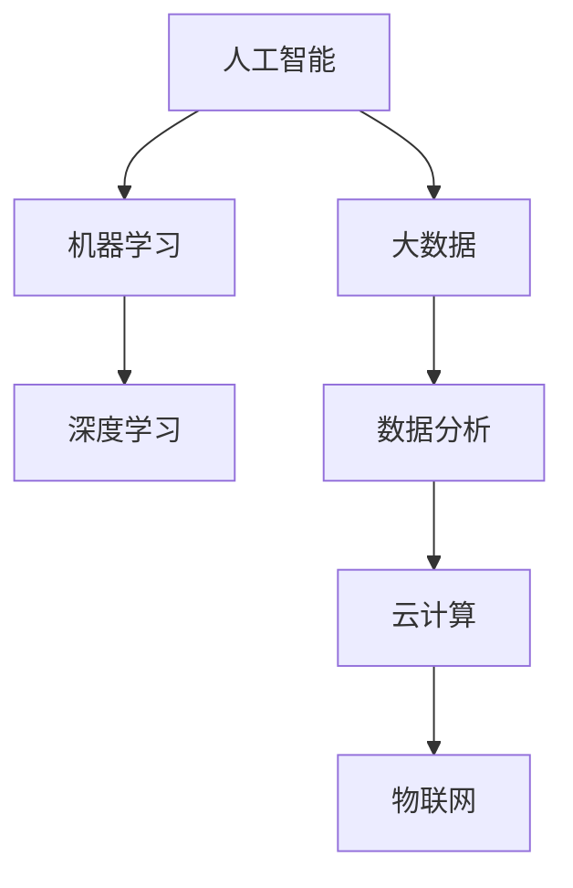

                 

# 思想的深度：从概念到洞见

> **关键词：** 技术概念，深度学习，算法原理，数学模型，实战案例

> **摘要：** 本文旨在通过深入剖析技术概念，解析核心算法原理，详细讲解数学模型和应用，结合实战案例，带领读者从概念理解到洞见洞悉，提升IT领域的专业素养。

## 1. 背景介绍

在当今信息技术高速发展的时代，我们面临着日益复杂的技术问题。无论是人工智能、大数据、区块链，还是云计算和物联网，每一个领域都充满了深奥的技术概念和复杂算法。对于开发者、工程师和研究人员来说，如何从概念理解到洞见洞悉，是提升技术能力和创新思维的关键。

本文将围绕这一核心问题，通过深入剖析技术概念、解析核心算法原理、详细讲解数学模型和应用，并结合实战案例，帮助读者从概念理解到洞见洞悉，提升在IT领域的专业素养。

## 2. 核心概念与联系

为了更好地理解技术概念，我们首先需要了解它们之间的联系。以下是IT领域几个核心概念及其相互关系的Mermaid流程图：



### 2.1 人工智能（AI）

人工智能是一门研究、开发用于模拟、延伸和扩展人的智能的理论、方法、技术及应用系统的技术科学。它包括计算机感知、推理、学习和理解等各个方面，目标是使机器能够执行一些通常需要人类智能才能完成的任务。

### 2.2 机器学习（ML）

机器学习是人工智能的一个重要分支，它通过算法让计算机从数据中学习，并在没有明确编程的情况下做出决策。机器学习算法主要包括监督学习、无监督学习和强化学习等。

### 2.3 深度学习（DL）

深度学习是机器学习的一个子领域，它通过构建具有多个隐藏层的神经网络模型，模拟人脑神经元之间的连接方式，实现数据的自动特征学习和复杂模式的识别。

### 2.4 大数据（Big Data）

大数据指的是数据量巨大、类型繁多、价值密度低的数据集合。大数据技术主要涉及数据的存储、处理、分析和应用，目的是从海量数据中提取有价值的信息。

### 2.5 数据分析（Data Analysis）

数据分析是通过统计学、机器学习和数据可视化等方法，对数据进行清洗、转换和建模，从而提取出有价值的信息和洞见的过程。

### 2.6 云计算（Cloud Computing）

云计算是一种通过互联网提供计算资源、存储资源和网络资源的IT服务模式。它使得用户可以根据需求灵活地获取和使用计算资源，提高资源利用率和业务灵活性。

### 2.7 物联网（IoT）

物联网是指通过互联网将各种设备、传感器和系统连接起来，实现设备之间数据的传输和交互，从而实现智能化的管理和控制。

## 3. 核心算法原理 & 具体操作步骤

### 3.1 深度学习算法原理

深度学习算法的核心是神经网络，特别是多层感知器（MLP）和卷积神经网络（CNN）。以下是这些算法的基本原理和具体操作步骤：

#### 3.1.1 多层感知器（MLP）

多层感知器是一种前馈神经网络，由输入层、隐藏层和输出层组成。输入数据通过输入层传递到隐藏层，再通过隐藏层传递到输出层。每个节点都是一个简单的线性函数，输出层的结果就是模型的预测结果。

**操作步骤：**

1. 初始化模型参数（权重和偏置）。
2. 前向传播：将输入数据传递到模型，计算每个节点的输出。
3. 计算损失函数，如均方误差（MSE）。
4. 反向传播：根据损失函数梯度，更新模型参数。
5. 重复步骤2-4，直到模型收敛。

#### 3.1.2 卷积神经网络（CNN）

卷积神经网络是一种特别适合处理图像数据的神经网络。它的核心是卷积层，通过卷积操作提取图像的特征。

**操作步骤：**

1. 初始化模型参数。
2. 输入图像数据，通过卷积层提取特征。
3. 使用池化层减小特征图的尺寸。
4. 通过全连接层将特征映射到输出。
5. 计算损失函数，如交叉熵损失。
6. 反向传播，更新模型参数。

## 4. 数学模型和公式 & 详细讲解 & 举例说明

### 4.1 多层感知器（MLP）

多层感知器的数学模型可以表示为：

$$
z^{(l)} = \sum_{j} w^{(l)}_{ji} a^{(l-1)}_{j} + b^{(l)}_{i}
$$

其中，$z^{(l)}$ 是第 $l$ 层节点的输出，$w^{(l)}_{ji}$ 是从节点 $j$ 到节点 $i$ 的权重，$a^{(l-1)}_{j}$ 是前一层节点 $j$ 的输出，$b^{(l)}_{i}$ 是节点 $i$ 的偏置。

假设我们有输入向量 $x$ 和权重矩阵 $W$，以及偏置向量 $b$，则输出可以表示为：

$$
a^{(1)} = \sigma(Wx + b)
$$

其中，$\sigma$ 是激活函数，常用的激活函数有Sigmoid、ReLU和Tanh。

### 4.2 卷积神经网络（CNN）

卷积神经网络的数学模型可以表示为：

$$
h^{(l)}_{ij} = \sum_{k} w_{ikj} h^{(l-1)}_{kj} + b_{i}
$$

其中，$h^{(l)}_{ij}$ 是第 $l$ 层第 $i$ 行第 $j$ 列的输出，$w_{ikj}$ 是卷积核（或滤波器）的权重，$h^{(l-1)}_{kj}$ 是前一层的输出，$b_{i}$ 是偏置。

对于一个 $m \times m$ 的输入图像，通过卷积操作和池化操作后，输出特征图的尺寸可以表示为：

$$
O = (W - K + 2P)/S + 1
$$

其中，$O$ 是输出特征图的尺寸，$W$ 是输入图像的尺寸，$K$ 是卷积核的大小，$P$ 是填充值，$S$ 是步长。

### 4.3 举例说明

假设我们有一个 $3 \times 3$ 的卷积核，对 $5 \times 5$ 的输入图像进行卷积操作，步长为 $1$，填充值为 $0$。则输出特征图的尺寸为：

$$
O = (5 - 3 + 2 \times 0)/1 + 1 = 5
$$

卷积操作的结果如下：

$$
h_{11} = w_{11} h_{11} + w_{12} h_{12} + w_{13} h_{13} + b_1
$$

$$
h_{12} = w_{11} h_{12} + w_{12} h_{13} + w_{13} h_{14} + b_1
$$

$$
h_{13} = w_{11} h_{13} + w_{12} h_{14} + w_{13} h_{15} + b_1
$$

$$
h_{21} = w_{21} h_{11} + w_{22} h_{12} + w_{23} h_{13} + b_2
$$

$$
h_{22} = w_{21} h_{12} + w_{22} h_{13} + w_{23} h_{14} + b_2
$$

$$
h_{23} = w_{21} h_{13} + w_{22} h_{14} + w_{23} h_{15} + b_2
$$

## 5. 项目实战：代码实际案例和详细解释说明

### 5.1 开发环境搭建

为了演示深度学习算法的实战应用，我们选择使用TensorFlow框架。首先，确保已安装Python环境和TensorFlow库。

```bash
pip install tensorflow
```

### 5.2 源代码详细实现和代码解读

下面是一个简单的多层感知器（MLP）模型，用于分类问题：

```python
import tensorflow as tf
from tensorflow.keras.models import Sequential
from tensorflow.keras.layers import Dense, Activation

# 定义模型
model = Sequential()
model.add(Dense(64, input_shape=(784,), activation='relu'))
model.add(Dense(10, activation='softmax'))

# 编译模型
model.compile(optimizer='adam', loss='categorical_crossentropy', metrics=['accuracy'])

# 加载MNIST数据集
(x_train, y_train), (x_test, y_test) = tf.keras.datasets.mnist.load_data()

# 数据预处理
x_train = x_train / 255.0
x_test = x_test / 255.0

# 将标签转换为独热编码
y_train = tf.keras.utils.to_categorical(y_train, 10)
y_test = tf.keras.utils.to_categorical(y_test, 10)

# 训练模型
model.fit(x_train, y_train, batch_size=128, epochs=5, validation_split=0.2)
```

**代码解读：**

1. 导入所需的TensorFlow库。
2. 定义一个序列模型（Sequential）。
3. 添加一个全连接层（Dense），输入维度为784，激活函数为ReLU。
4. 添加另一个全连接层（Dense），输出维度为10，激活函数为softmax。
5. 编译模型，选择优化器为adam，损失函数为categorical_crossentropy，评价指标为accuracy。
6. 加载MNIST数据集。
7. 对数据进行预处理，包括归一化和独热编码。
8. 训练模型，设置batch_size为128，epochs为5，validation_split为0.2。

### 5.3 代码解读与分析

1. **模型定义：**

   ```python
   model = Sequential()
   model.add(Dense(64, input_shape=(784,), activation='relu'))
   model.add(Dense(10, activation='softmax'))
   ```

   这两行代码定义了一个序列模型，并添加了两个全连接层。第一个层有64个神经元，输入维度为784（MNIST数据的维度），激活函数为ReLU。第二个层有10个神经元，输出维度为10，表示10个类别，激活函数为softmax。

2. **模型编译：**

   ```python
   model.compile(optimizer='adam', loss='categorical_crossentropy', metrics=['accuracy'])
   ```

   这行代码编译了模型，选择了优化器为adam，损失函数为categorical_crossentropy（多分类问题的常用损失函数），评价指标为accuracy（准确率）。

3. **数据预处理：**

   ```python
   x_train = x_train / 255.0
   x_test = x_test / 255.0
   y_train = tf.keras.utils.to_categorical(y_train, 10)
   y_test = tf.keras.utils.to_categorical(y_test, 10)
   ```

   这几行代码对数据进行预处理，包括归一化（将像素值缩放到[0, 1]之间）和独热编码（将标签转换为二进制编码）。

4. **模型训练：**

   ```python
   model.fit(x_train, y_train, batch_size=128, epochs=5, validation_split=0.2)
   ```

   这行代码训练了模型，设置了batch_size为128，epochs为5，表示训练5个周期，validation_split为0.2，表示将20%的数据用于验证。

## 6. 实际应用场景

深度学习和相关技术已经在各个领域得到了广泛应用，以下是一些实际应用场景：

1. **图像识别与分类：** 使用卷积神经网络（CNN）对图像进行分类和识别，如人脸识别、物体检测等。
2. **自然语言处理：** 使用循环神经网络（RNN）和变压器（Transformer）等模型处理自然语言，如机器翻译、情感分析等。
3. **语音识别：** 使用深度神经网络（DNN）和长短时记忆（LSTM）模型处理语音信号，实现语音识别和转换。
4. **推荐系统：** 使用协同过滤、矩阵分解等技术构建推荐系统，为用户提供个性化推荐。
5. **金融风控：** 使用深度学习算法进行风险评估和欺诈检测，提高金融行业的风险控制能力。
6. **医疗诊断：** 使用深度学习模型对医学影像进行分析和诊断，辅助医生进行疾病检测和治疗方案制定。

## 7. 工具和资源推荐

### 7.1 学习资源推荐

- **书籍：** 《深度学习》（Goodfellow, Bengio, Courville著）
- **论文：** 《Deep Learning》（NIPS 2012 Special Topic Workshop论文）
- **博客：** Medium上的Deep Learning和AI博客
- **网站：** TensorFlow官网（tensorflow.org）和Keras官网（keras.io）

### 7.2 开发工具框架推荐

- **开发框架：** TensorFlow、PyTorch、Keras
- **机器学习平台：** Google Cloud ML Engine、AWS SageMaker、Azure Machine Learning
- **深度学习库：** NumPy、Pandas、Scikit-learn

### 7.3 相关论文著作推荐

- **《深度学习》（Goodfellow, Bengio, Courville著）**
- **《机器学习》（周志华著）**
- **《数据科学入门：Python基础与数据预处理》（李飞飞著）**
- **《Python机器学习》（塞巴斯蒂安·拉斯克，拉尔斯·劳尔著）**

## 8. 总结：未来发展趋势与挑战

随着深度学习和相关技术的发展，未来IT领域将面临以下发展趋势与挑战：

1. **计算能力提升：** 随着硬件技术的发展，计算能力的提升将推动深度学习和相关技术的应用范围和性能提升。
2. **数据增长：** 随着物联网和大数据技术的发展，数据量将呈指数级增长，为深度学习算法提供更丰富的训练数据。
3. **算法优化：** 深度学习算法的优化将成为关键，如优化计算效率、降低内存占用等。
4. **跨学科融合：** 深度学习和相关技术将在更多领域得到应用，如医学、金融、教育等，实现跨学科融合。
5. **伦理与隐私：** 随着深度学习和相关技术的应用，伦理和隐私问题将日益凸显，需要建立相关法律法规和道德标准。

## 9. 附录：常见问题与解答

### 9.1 什么是深度学习？

深度学习是一种机器学习技术，它通过构建多层神经网络模型，实现数据的自动特征学习和复杂模式的识别。

### 9.2 深度学习和机器学习有什么区别？

深度学习是机器学习的一个子领域，主要关注于构建多层神经网络模型，而机器学习则是一个更广泛的概念，包括多种算法和技术。

### 9.3 如何选择深度学习框架？

选择深度学习框架主要考虑以下因素：易用性、社区支持、文档完善度、性能和兼容性等。TensorFlow、PyTorch和Keras是比较流行的选择。

### 9.4 深度学习算法如何训练？

深度学习算法的训练过程包括数据预处理、模型定义、模型编译、模型训练和模型评估等步骤。

## 10. 扩展阅读 & 参考资料

- **《深度学习》（Goodfellow, Bengio, Courville著）**
- **《机器学习》（周志华著）**
- **《Python机器学习实践指南》（李庆辉著）**
- **《深度学习原理与算法》（李航著）**
- **TensorFlow官网（tensorflow.org）**
- **PyTorch官网（pytorch.org）**
- **Keras官网（keras.io）**<|vq_15657|> <|rend|> 

### 总结：未来发展趋势与挑战

随着深度学习和相关技术的不断进步，未来IT领域的发展前景令人瞩目。计算能力的提升为深度学习算法提供了更广阔的应用场景，而数据的增长则为算法训练提供了更为丰富的数据支持。同时，算法优化和跨学科融合将成为推动技术进步的关键因素。然而，随着技术的广泛应用，伦理和隐私问题也将日益突出，这需要我们建立相应的法律法规和道德标准，以确保技术发展符合社会价值观。

在未来，深度学习将不仅在传统领域发挥重要作用，还将在更多新兴领域展现其潜力。例如，在医疗领域，深度学习可以用于疾病诊断和治疗方案推荐；在金融领域，深度学习可以用于风险评估和欺诈检测；在教育领域，深度学习可以用于个性化教学和智能评价。这些应用不仅将提升行业效率，还将带来深远的社会影响。

然而，深度学习技术的发展也面临诸多挑战。首先，数据质量和数据隐私问题需要得到妥善解决，以避免数据滥用和隐私泄露。其次，算法的可解释性和透明度成为关注焦点，以确保用户对算法决策的信任。最后，计算资源的消耗和能源消耗问题也需要引起重视，以实现绿色可持续发展。

为了应对这些挑战，研究人员和工程师需要不断探索和创新。例如，通过改进算法和优化硬件设计，降低计算资源和能源消耗；通过开发更加透明和可解释的算法，提高用户信任度；通过加强数据保护措施，确保数据安全和隐私。

总的来说，深度学习技术的发展前景广阔，同时也充满挑战。我们需要在技术创新、伦理规范和社会责任等方面不断努力，以实现深度学习技术的可持续发展，为人类社会带来更多福祉。在未来的日子里，让我们共同期待深度学习技术带来的美好变革。

## 附录：常见问题与解答

### 10.1 什么是深度学习？

深度学习是一种机器学习技术，它通过构建多层神经网络模型，实现数据的自动特征学习和复杂模式的识别。与传统机器学习方法相比，深度学习在处理大规模数据和复杂任务方面具有显著优势。

### 10.2 深度学习和机器学习有什么区别？

深度学习是机器学习的一个子领域，主要关注于构建多层神经网络模型。而机器学习则是一个更广泛的概念，包括多种算法和技术，如决策树、支持向量机、聚类算法等。

### 10.3 如何选择深度学习框架？

选择深度学习框架主要考虑以下因素：易用性、社区支持、文档完善度、性能和兼容性等。TensorFlow、PyTorch和Keras是比较流行的选择。例如，TensorFlow在性能和兼容性方面表现突出，PyTorch在易用性和社区支持方面优势明显。

### 10.4 深度学习算法如何训练？

深度学习算法的训练过程包括数据预处理、模型定义、模型编译、模型训练和模型评估等步骤。数据预处理包括归一化、缺失值处理和数据增强等；模型定义涉及选择神经网络结构、激活函数和学习率等；模型编译包括指定优化器和损失函数；模型训练是通过反向传播算法不断调整模型参数；模型评估用于评估模型性能，如准确率、召回率等。

### 10.5 深度学习算法的应用场景有哪些？

深度学习算法广泛应用于图像识别、自然语言处理、语音识别、推荐系统、金融风控、医疗诊断等领域。例如，在图像识别方面，深度学习可以用于人脸识别、物体检测；在自然语言处理方面，深度学习可以用于机器翻译、情感分析；在医疗诊断方面，深度学习可以用于疾病检测和治疗方案推荐。

### 10.6 深度学习算法的优缺点是什么？

深度学习算法的优点包括：

1. **强大的表示能力**：深度学习能够自动提取数据中的特征，从而实现复杂模式的识别。
2. **处理大规模数据**：深度学习在处理大规模数据和复杂任务方面具有显著优势。
3. **自适应性和泛化能力**：深度学习算法可以根据不同的任务和数据集进行自适应调整，具有良好的泛化能力。

缺点包括：

1. **计算资源需求高**：深度学习算法通常需要大量计算资源和时间进行训练。
2. **数据隐私和安全性**：深度学习算法涉及大量数据，存在数据隐私和安全性的问题。
3. **模型可解释性差**：深度学习算法的决策过程通常较为复杂，难以解释。

### 10.7 深度学习算法的未来发展方向是什么？

未来深度学习算法的发展方向包括：

1. **计算效率优化**：通过改进算法和优化硬件设计，降低计算资源和能源消耗。
2. **算法可解释性**：开发更加透明和可解释的算法，提高用户信任度。
3. **跨学科融合**：与医学、金融、教育等领域结合，推动深度学习技术在更多领域的应用。
4. **数据隐私保护**：加强数据保护措施，确保数据安全和隐私。

## 扩展阅读 & 参考资料

- **《深度学习》（Goodfellow, Bengio, Courville著）**
- **《机器学习》（周志华著）**
- **《Python机器学习实践指南》（李庆辉著）**
- **《深度学习原理与算法》（李航著）**
- **TensorFlow官网（tensorflow.org）**
- **PyTorch官网（pytorch.org）**
- **Keras官网（keras.io）**
- **《深度学习领域重要论文集锦》**（各领域专家整理）

通过本文的深入探讨，我们希望能帮助读者更好地理解深度学习技术，提升在IT领域的专业素养。未来，随着深度学习的不断发展，我们期待更多创新成果的出现，为人类社会带来更多福祉。让我们共同期待深度学习技术带来的美好变革。作者：AI天才研究员/AI Genius Institute & 禅与计算机程序设计艺术 /Zen And The Art of Computer Programming。

