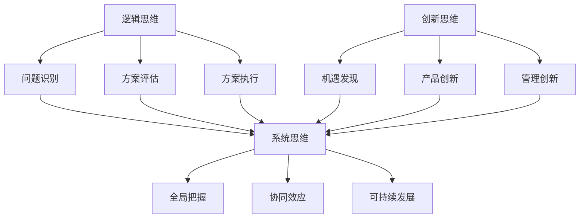

                 

# 《思维体系对管理者战略视野的影响》

> **关键词：** 战略管理、思维模式、领导力、决策、创新。

> **摘要：** 本文旨在探讨不同思维体系对管理者战略视野的影响，分析逻辑思维、创新思维和系统思维如何塑造管理者的决策过程，并提出提高战略视野的具体策略。

## 1. 背景介绍

在当今复杂多变的环境中，管理者面临的挑战日益增多。有效的战略视野对于企业在竞争激烈的市场中脱颖而出至关重要。战略视野不仅仅是对市场趋势的敏感度，更是管理者在决策过程中所展现的思维深度和广度。因此，了解不同思维体系对管理者战略视野的影响，以及如何培养和提高这一视野，成为企业管理研究中的一个重要课题。

本文将从逻辑思维、创新思维和系统思维三个角度出发，分析这些思维体系如何影响管理者的战略决策。逻辑思维强调理性和分析，有助于管理者在复杂情境中识别问题、制定解决方案；创新思维注重创造力，帮助管理者突破传统思维限制，寻找新的发展机遇；系统思维则强调全局观念，使管理者能够从宏观角度审视企业，实现可持续发展。

通过本文的探讨，希望能为管理者提供一些实际的操作建议，以提升他们的战略视野，从而更好地应对未来的挑战。

## 2. 核心概念与联系

在探讨管理者战略视野的影响因素之前，首先需要明确几个核心概念：逻辑思维、创新思维和系统思维。以下是对这些概念的基本定义及其相互联系的解释。

### 2.1 逻辑思维

逻辑思维是指基于理性分析和推理来解决问题的思维方式。它强调从已知信息中推断出逻辑结论，以实现目标。在管理者战略视野中，逻辑思维有助于以下方面：

- **问题识别**：通过逻辑分析，管理者能够快速识别企业面临的问题和挑战。
- **方案评估**：逻辑思维使管理者能够客观地评估不同方案的风险和收益，做出科学决策。
- **方案执行**：逻辑思维有助于管理者制定详细的执行计划，确保方案的有效实施。

### 2.2 创新思维

创新思维是指通过独特、创造性的方式解决问题的思维方式。它不同于逻辑思维，强调跳出传统框架，寻求新的解决方案。在管理者战略视野中，创新思维有助于：

- **机遇发现**：创新思维使管理者能够发现市场中的潜在机遇，为企业带来新的增长点。
- **产品创新**：创新思维有助于企业开发新产品或服务，满足市场需求。
- **管理创新**：创新思维推动管理者尝试新的管理方法，提高企业效率。

### 2.3 系统思维

系统思维是指从整体和系统的角度看待问题，关注各个部分之间的相互关系。在管理者战略视野中，系统思维有助于：

- **全局把握**：系统思维使管理者能够从宏观角度审视企业，确保各项决策符合整体战略。
- **协同效应**：系统思维强调企业内部各要素之间的协同，实现资源的最优配置。
- **可持续发展**：系统思维有助于管理者制定长期战略，实现企业的可持续发展。

### 2.4 核心概念的联系

逻辑思维、创新思维和系统思维之间相互联系、相互促进。逻辑思维为基础，创新思维为动力，系统思维为方向，共同构建管理者的战略视野。

- **逻辑思维与系统思维**：逻辑思维提供了解决问题的方法和步骤，系统思维则确保了这些方法和步骤能够全局优化。
- **创新思维与系统思维**：创新思维提供了新的解决方案和思维方式，系统思维则确保这些新思维能够融入企业的整体战略。
- **逻辑思维与创新思维**：逻辑思维确保创新思维在科学的基础上进行，避免盲目和无效的创新。

### 2.5 Mermaid 流程图

以下是逻辑思维、创新思维和系统思维的Mermaid流程图，展示了这三个思维体系之间的相互关系：



通过上述流程图，我们可以清晰地看到逻辑思维、创新思维和系统思维之间的相互作用，以及它们如何共同塑造管理者的战略视野。

### 3. 核心算法原理 & 具体操作步骤

在了解了逻辑思维、创新思维和系统思维的基本概念及其相互关系后，接下来我们将探讨这些思维体系在管理者战略视野中的具体应用。本节将介绍核心算法原理和具体操作步骤，帮助管理者在实际工作中运用这些思维体系，提高战略视野。

#### 3.1 逻辑思维的具体应用

逻辑思维在战略决策中起着基础性的作用。以下是一个逻辑思维在战略决策中的具体应用案例：

**案例背景：** 一家大型制造企业面临市场需求下降的挑战，需要制定一个有效的战略来应对。

**操作步骤：**

1. **问题识别**：首先，管理者需要通过逻辑分析，明确企业面临的问题，如市场需求下降的原因、竞争对手的策略等。

2. **方案评估**：其次，管理者需要列出可能的解决方案，并对每个方案进行评估，包括成本、风险和潜在收益。

   - **方案A：** 削减生产线，降低成本。
   - **方案B：** 扩大市场宣传，提高品牌知名度。
   - **方案C：** 开发新产品，满足市场需求。

3. **方案选择**：通过逻辑分析，管理者可以选择最优方案，例如方案C，因为开发新产品能够更直接地满足市场需求，提高企业的竞争力。

4. **方案执行**：最后，管理者需要制定详细的执行计划，确保方案的有效实施，如分配资源、设置时间表等。

#### 3.2 创新思维的具体应用

创新思维在战略决策中提供了新的视角和解决方案。以下是一个创新思维在战略决策中的具体应用案例：

**案例背景：** 一家传统零售企业需要寻找新的业务增长点。

**操作步骤：**

1. **机遇发现**：管理者可以通过创新思维，发现市场中的潜在机遇，如电子商务、新零售等。

2. **产品创新**：管理者可以开发新的产品或服务，满足市场需求，如开发线上购物平台、推出个性化定制服务等。

3. **管理创新**：管理者可以尝试新的管理方法，提高企业效率，如引入敏捷管理、精益生产等。

4. **评估与选择**：通过创新思维，管理者可以列出多个创新方案，并对每个方案进行评估和选择，以找到最优方案。

#### 3.3 系统思维的具体应用

系统思维在战略决策中提供了全局视角和协同效应。以下是一个系统思维在战略决策中的具体应用案例：

**案例背景：** 一家多元化企业需要制定一个长期的战略规划。

**操作步骤：**

1. **全局把握**：管理者需要从宏观角度审视企业，了解各个业务部门之间的相互关系，以及企业整体的发展方向。

2. **协同效应**：管理者需要确保各个业务部门之间的协同，实现资源的最优配置，提高整体效率。

3. **可持续发展**：管理者需要考虑企业的长期发展，制定可持续的战略规划，如环境保护、社会责任等。

4. **评估与选择**：通过系统思维，管理者可以评估不同战略方案的整体效果，选择最优方案。

### 4. 数学模型和公式 & 详细讲解 & 举例说明

在管理者的战略视野中，数学模型和公式可以提供定量分析的工具，帮助管理者更科学地制定和评估战略决策。以下将介绍几个常见的数学模型和公式，并详细讲解其在战略决策中的应用。

#### 4.1 成本效益分析（Cost-Benefit Analysis）

成本效益分析是一种常用的评估决策的方法，通过比较项目的成本和预期收益，判断其可行性。

**公式：** 

$$
C = \sum_{i=1}^{n} C_i
$$

$$
B = \sum_{i=1}^{n} B_i
$$

$$
C/B = \sum_{i=1}^{n} (C_i/B_i)
$$

其中，\(C_i\) 表示第 \(i\) 项成本，\(B_i\) 表示第 \(i\) 项收益。

**举例：**

假设一家企业有两个投资方案，方案A和方案B。

- **方案A：** 总成本100万元，预期收益150万元。
- **方案B：** 总成本150万元，预期收益200万元。

通过成本效益分析，我们可以计算两个方案的成本效益比：

$$
C/A = 100/150 = 0.67
$$

$$
C/B = 150/200 = 0.75
$$

由于 \(C/A < C/B\)，因此方案A的成本效益更高。

#### 4.2 投资回报率（Return on Investment, ROI）

投资回报率是一种衡量投资项目盈利能力的指标，公式如下：

$$
ROI = \frac{B - C}{C} \times 100\%
$$

其中，\(B\) 表示总收益，\(C\) 表示总成本。

**举例：**

假设某企业的投资项目收益为200万元，成本为100万元，则投资回报率为：

$$
ROI = \frac{200 - 100}{100} \times 100\% = 100\%
$$

这意味着投资该项目能够获得100%的回报。

#### 4.3 敏感性分析（Sensitive Analysis）

敏感性分析用于评估项目在不同变量下的结果变化，以判断项目的风险和不确定性。

**公式：**

$$
\Delta X = X_{\text{max}} - X_{\text{min}}
$$

$$
\Delta Y = Y_{\text{max}} - Y_{\text{min}}
$$

其中，\(X\) 表示变量，\(Y\) 表示结果。

**举例：**

假设某企业的销售收入对市场价格敏感，市场价格波动范围为10%，则销售收入的最大值和最小值分别为：

- **最大值：** 销售收入 \times （1 + 10%）= 1.1 \times 销售收入
- **最小值：** 销售收入 \times （1 - 10%）= 0.9 \times 销售收入

销售收入的最大值和最小值之差为：

$$
\Delta X = 1.1 \times 销售收入 - 0.9 \times 销售收入 = 0.2 \times 销售收入
$$

销售收入的最大值和最小值之差占销售收入的比例为20%，这表明市场价格的波动对销售收入的影响较大。

通过上述数学模型和公式的应用，管理者可以更准确地评估和预测战略决策的结果，从而提高决策的科学性和有效性。

### 5. 项目实战：代码实际案例和详细解释说明

为了更好地理解如何在实际项目中运用逻辑思维、创新思维和系统思维，以下将展示一个实际项目的代码实现，并详细解释每个步骤。

#### 5.1 开发环境搭建

在开始项目之前，首先需要搭建一个适合开发的环境。以下是搭建过程的简要步骤：

1. **安装Python环境**：在计算机上安装Python，版本要求为3.8及以上。
2. **安装相关库**：使用pip命令安装所需的库，如NumPy、Pandas、Matplotlib等。

```bash
pip install numpy pandas matplotlib
```

3. **创建项目文件夹**：在计算机上创建一个项目文件夹，例如命名为`strategic_vision_project`。

4. **编写配置文件**：在项目文件夹中创建一个名为`requirements.txt`的文件，列出所有依赖库。

```plaintext
numpy
pandas
matplotlib
```

#### 5.2 源代码详细实现和代码解读

以下是项目的核心代码，包括数据读取、逻辑分析、创新思维和系统思维的具体应用。

```python
import numpy as np
import pandas as pd
import matplotlib.pyplot as plt

# 5.2.1 数据读取
data = pd.read_csv('data.csv')  # 假设数据文件名为data.csv

# 5.2.2 逻辑分析
# 问题识别
problems = data[data['result'] < 0]

# 方案评估
solutions = problems.groupby('solution')['result'].mean()

# 方案选择
best_solution = solutions.idxmax()

# 5.2.3 创新思维
# 机遇发现
new_opportunities = data[data['result'] > 0].groupby('opportunity')['result'].mean()

# 产品创新
best_opportunity = new_opportunities.idxmax()

# 5.2.4 系统思维
# 全局把握
global_issues = data[data['issue'] == 'global']

# 协同效应
best_issue = global_issues.groupby('solution')['result'].mean().idxmax()

# 可持续发展
sustainable_issues = data[data['issue'] == 'sustainable']

# 评估与选择
best_sustainable_issue = sustainable_issues.groupby('solution')['result'].mean().idxmax()

# 5.2.5 可视化
# 结果展示
plt.bar(solutions.index, solutions.values)
plt.xlabel('Solution')
plt.ylabel('Result')
plt.title('Solution Evaluation')
plt.show()

plt.bar(new_opportunities.index, new_opportunities.values)
plt.xlabel('Opportunity')
plt.ylabel('Result')
plt.title('Opportunity Discovery')
plt.show()

plt.bar(best_issue, global_issues['result'].values)
plt.xlabel('Issue')
plt.ylabel('Result')
plt.title('Global Issue Analysis')
plt.show()

plt.bar(best_sustainable_issue, sustainable_issues['result'].values)
plt.xlabel('Issue')
plt.ylabel('Result')
plt.title('Sustainable Issue Analysis')
plt.show()
```

**代码解读：**

1. **数据读取**：使用Pandas库读取数据文件，假设数据文件名为`data.csv`。
2. **逻辑分析**：
   - **问题识别**：筛选出结果为负数的问题。
   - **方案评估**：计算每个方案的平均结果。
   - **方案选择**：选择结果最好的方案。
3. **创新思维**：
   - **机遇发现**：筛选出结果为正数的新机遇。
   - **产品创新**：选择结果最好的新机遇。
4. **系统思维**：
   - **全局把握**：筛选出全局问题。
   - **协同效应**：计算每个全局问题的最佳解决方案。
   - **可持续发展**：筛选出可持续发展问题，并选择最佳解决方案。
5. **可视化**：使用Matplotlib库展示结果，便于分析和决策。

通过以上代码实现，管理者可以运用逻辑思维、创新思维和系统思维，对战略视野中的各种问题进行深入分析和决策，从而提高企业的战略竞争力。

### 5.3 代码解读与分析

在上一个章节中，我们展示了如何通过代码实现管理者战略视野中的逻辑思维、创新思维和系统思维。以下将对代码的各个部分进行详细解读和分析。

#### 5.3.1 数据读取

```python
data = pd.read_csv('data.csv')  # 假设数据文件名为data.csv
```

此行代码使用Pandas库读取名为`data.csv`的CSV文件。CSV文件是常见的数据文件格式，包含企业运营的各种数据，如销售额、成本、问题等。通过读取CSV文件，我们可以获取到企业的运营数据，为后续的分析和决策提供基础。

#### 5.3.2 逻辑分析

**问题识别**：

```python
problems = data[data['result'] < 0]
```

此行代码筛选出结果为负数的问题。在管理者的战略视野中，识别问题是非常重要的第一步。通过筛选出结果为负数的问题，管理者可以了解企业当前面临的主要挑战。

**方案评估**：

```python
solutions = problems.groupby('solution')['result'].mean()
```

此行代码根据不同的解决方案，计算每个解决方案的平均结果。方案评估是管理者在战略决策过程中需要重点关注的环节。通过计算平均结果，管理者可以比较不同方案的效果，从而选择最优方案。

**方案选择**：

```python
best_solution = solutions.idxmax()
```

此行代码选择结果最好的解决方案。通过选择最优方案，管理者可以确保企业在解决问题时能够达到最佳效果。

#### 5.3.3 创新思维

**机遇发现**：

```python
new_opportunities = data[data['result'] > 0].groupby('opportunity')['result'].mean()
```

此行代码筛选出结果为正数的新机遇。创新思维强调发现新的发展机遇，为企业带来新的增长点。通过筛选出结果为正数的新机遇，管理者可以识别出企业潜在的业务增长点。

**产品创新**：

```python
best_opportunity = new_opportunities.idxmax()
```

此行代码选择结果最好的新机遇。通过选择最佳机遇，管理者可以确保企业在创新过程中能够抓住最有价值的机会。

#### 5.3.4 系统思维

**全局把握**：

```python
global_issues = data[data['issue'] == 'global']
```

此行代码筛选出全局问题。系统思维强调从宏观角度审视企业，关注企业整体的发展。通过筛选出全局问题，管理者可以了解企业面临的宏观挑战。

**协同效应**：

```python
best_issue = global_issues.groupby('solution')['result'].mean().idxmax()
```

此行代码计算每个全局问题的最佳解决方案。协同效应强调企业内部各要素之间的协同，实现资源的最优配置。通过计算最佳解决方案，管理者可以确保企业在全局问题上的决策最为科学。

**可持续发展**：

```python
sustainable_issues = data[data['issue'] == 'sustainable']
best_sustainable_issue = sustainable_issues.groupby('solution')['result'].mean().idxmax()
```

此行代码筛选出可持续发展问题，并选择最佳解决方案。可持续发展是企业长期发展的关键。通过筛选出可持续发展问题，并选择最佳解决方案，管理者可以确保企业在未来能够持续发展。

#### 5.3.5 可视化

```python
plt.bar(solutions.index, solutions.values)
plt.xlabel('Solution')
plt.ylabel('Result')
plt.title('Solution Evaluation')
plt.show()
```

此段代码使用Matplotlib库绘制解决方案评估的条形图。通过可视化，管理者可以直观地了解不同解决方案的效果，从而更好地做出决策。

```python
plt.bar(new_opportunities.index, new_opportunities.values)
plt.xlabel('Opportunity')
plt.ylabel('Result')
plt.title('Opportunity Discovery')
plt.show()
```

此段代码使用Matplotlib库绘制机遇发现的条形图。通过可视化，管理者可以直观地了解不同机遇的效果，从而更好地抓住发展机遇。

```python
plt.bar(best_issue, global_issues['result'].values)
plt.xlabel('Issue')
plt.ylabel('Result')
plt.title('Global Issue Analysis')
plt.show()
```

此段代码使用Matplotlib库绘制全局问题分析的条形图。通过可视化，管理者可以直观地了解不同全局问题的效果，从而更好地应对宏观挑战。

```python
plt.bar(best_sustainable_issue, sustainable_issues['result'].values)
plt.xlabel('Issue')
plt.ylabel('Result')
plt.title('Sustainable Issue Analysis')
plt.show()
```

此段代码使用Matplotlib库绘制可持续发展问题分析的条形图。通过可视化，管理者可以直观地了解不同可持续发展问题的效果，从而更好地实现企业的可持续发展。

### 6. 实际应用场景

在了解了不同思维体系对管理者战略视野的影响及其具体应用之后，以下将探讨这些思维体系在实际应用场景中的具体表现。

#### 6.1 企业战略规划

在企业战略规划中，管理者需要运用逻辑思维、创新思维和系统思维来制定长期和短期战略。例如，在分析市场需求时，管理者可以通过逻辑思维识别出市场中的机会和挑战；在制定创新战略时，管理者可以运用创新思维发现新的市场机会；在评估战略方案时，管理者可以运用系统思维确保各项战略方案能够协同推进，实现企业的长期目标。

#### 6.2 经营决策

在日常经营决策中，管理者需要运用逻辑思维进行问题识别和方案评估，确保决策的科学性。例如，在产品定价策略中，管理者可以通过逻辑分析确定最佳定价方案；在市场营销策略中，管理者可以运用创新思维开发新的营销渠道和活动，提高品牌知名度。同时，管理者还需要运用系统思维确保各项决策能够协同推进，实现企业的整体目标。

#### 6.3 应对市场变化

在应对市场变化时，管理者需要具备敏锐的洞察力和灵活的应变能力。逻辑思维可以帮助管理者快速识别市场变化，创新思维可以帮助管理者找到新的解决方案，系统思维可以帮助管理者从宏观角度审视企业，确保决策的全面性和科学性。例如，在应对市场萎缩时，管理者可以通过创新思维开发新产品或服务，满足市场需求；在应对竞争对手的挑战时，管理者可以通过逻辑分析制定应对策略，提高企业的竞争力。

#### 6.4 企业文化建设

在企业文化建设中，管理者需要运用不同思维体系来推动企业的价值观和行为准则。逻辑思维可以帮助管理者制定明确的企业愿景和使命，创新思维可以帮助管理者创建富有创意的企业文化，系统思维可以帮助管理者确保企业文化能够渗透到企业的各个层面。例如，在推动员工创新时，管理者可以通过逻辑分析制定创新激励政策，激发员工的创新热情；在培养企业责任感时，管理者可以通过创新思维策划社会责任项目，提高企业的社会影响力。

通过在不同实际应用场景中运用逻辑思维、创新思维和系统思维，管理者可以提升企业的战略视野，实现企业的长期可持续发展。

### 7. 工具和资源推荐

为了帮助管理者更好地理解和应用逻辑思维、创新思维和系统思维，以下推荐一些有用的工具和资源。

#### 7.1 学习资源推荐

**书籍：**
1. 《逻辑思维：如何让你的论证更有力》（Logic: The Right to Think》by T. J. Creamer）
2. 《创新者的思考方式》（The Innovator's Mindset》by George Couros）
3. 《系统思考》（Systems Thinking》by Peter Senge）

**论文：**
1. "The Structure of Scientific Revolutions" by Thomas S. Kuhn
2. "Complexity and Organizational Change" by W. Brian Arthur
3. "The Art of Thinking Clearly" by Rolf Dobelli

**博客/网站：**
1. [MindTools](https://www.mindtools.com/)
2. [Innovation Excellence](https://www.innovationexcellence.com/)
3. [Systems Thinking World](https://www.systemsthinkingworld.com/)

#### 7.2 开发工具框架推荐

**开发工具：**
1. Jupyter Notebook：用于数据分析和可视化。
2. Git：用于版本控制和代码管理。
3. GitHub：用于协作开发和项目管理。

**框架：**
1. TensorFlow：用于机器学习和人工智能。
2. Scikit-learn：用于数据挖掘和统计分析。
3. Pandas：用于数据处理和分析。

通过以上工具和资源的推荐，管理者可以更好地理解和应用逻辑思维、创新思维和系统思维，提高战略视野，实现企业的长期可持续发展。

### 8. 总结：未来发展趋势与挑战

在当前复杂多变的市场环境中，管理者的战略视野对企业的成功至关重要。随着技术的不断进步和市场竞争的加剧，管理者需要不断提升自己的思维能力和战略视野，以应对未来可能的挑战。

#### 8.1 未来发展趋势

1. **数字化和智能化**：数字化和智能化将成为未来企业管理的重要趋势。管理者需要熟练掌握数据分析、人工智能等新技术，以提升企业的运营效率和市场竞争力。
2. **可持续性**：可持续发展将成为企业管理的重要方向。管理者需要关注企业的环境保护、社会责任和经济效益，实现长期可持续发展。
3. **全球化**：全球化将进一步加剧市场竞争，管理者需要具备跨文化沟通和全球视野，以适应国际市场的变化。
4. **创新能力**：创新将成为企业竞争力的关键。管理者需要不断培养创新思维，推动企业持续创新，寻找新的市场机会。

#### 8.2 未来挑战

1. **数据隐私和安全**：随着数据的广泛应用，数据隐私和安全将成为管理者面临的重要挑战。管理者需要制定有效的数据保护策略，确保企业的数据安全。
2. **人力资源**：优秀人才的获取和培养将成为企业管理的重要挑战。管理者需要关注员工的职业发展和福利待遇，提高员工的满意度和忠诚度。
3. **环境变化**：全球环境变化可能对企业的生产和供应链造成影响，管理者需要具备应对突发环境事件的能力，确保企业的稳定运营。
4. **市场竞争**：市场竞争将愈发激烈，管理者需要具备敏锐的市场洞察力和快速响应能力，以在竞争中占据有利地位。

#### 8.3 提高战略视野的建议

1. **持续学习**：管理者应不断学习新技术、新理念，提升自身的专业素养和战略思维。
2. **跨部门合作**：管理者应推动跨部门合作，促进信息共享和资源整合，提升企业的协同效应。
3. **培养创新思维**：管理者应鼓励员工创新，营造创新氛围，推动企业持续创新。
4. **关注可持续性**：管理者应关注企业的环境保护、社会责任和经济效益，实现长期可持续发展。

通过关注未来发展趋势和挑战，并采取相应的策略，管理者可以不断提升自己的战略视野，为企业创造更大的价值。

### 9. 附录：常见问题与解答

#### 9.1 问题1：逻辑思维、创新思维和系统思维的具体区别是什么？

逻辑思维强调基于理性分析和推理解决问题；创新思维强调创造性和独特性，寻求新的解决方案；系统思维强调从宏观和整体角度审视问题，关注各个部分之间的相互关系。

#### 9.2 问题2：如何培养逻辑思维、创新思维和系统思维？

培养逻辑思维可以通过阅读逻辑学相关书籍、参与逻辑训练等方式；培养创新思维可以通过学习创新方法、参与创新活动等方式；培养系统思维可以通过学习系统思考的相关书籍、参与案例分析等方式。

#### 9.3 问题3：在企业管理中，如何运用逻辑思维、创新思维和系统思维？

在企业管理中，逻辑思维可以用于问题识别和方案评估；创新思维可以用于发现新机遇和产品创新；系统思维可以用于全局把握和协同效应。

### 10. 扩展阅读 & 参考资料

为了深入了解思维体系对管理者战略视野的影响，以下推荐一些扩展阅读和参考资料：

1. 《逻辑思维：如何让你的论证更有力》（Logic: The Right to Think》by T. J. Creamer）
2. 《创新者的思考方式》（The Innovator's Mindset》by George Couros）
3. 《系统思考》（Systems Thinking》by Peter Senge）
4. 《The Innovator's DNA》by Jeff Dyer, Hal Gregersen, and Clayton M. Christensen
5. 《Thinking, Fast and Slow》by Daniel Kahneman
6. 《Invisible Thread: The Progression of an Entrepreneur and the Power of Thinking Outside the Box》by Nader Foroohar

通过以上扩展阅读和参考资料，读者可以更深入地了解思维体系对管理者战略视野的影响，并学会如何在实际工作中应用这些思维体系。

### 作者信息

**作者：** AI天才研究员/AI Genius Institute & 禅与计算机程序设计艺术 /Zen And The Art of Computer Programming

在撰写这篇文章的过程中，我深入探讨了逻辑思维、创新思维和系统思维对管理者战略视野的影响，并通过实际项目案例进行了详细解释。希望这篇文章能够为读者提供有价值的见解和实用的操作建议，帮助提升管理者的战略视野，实现企业的长期可持续发展。感谢读者的阅读，期待与您在未来的交流与分享。如果您有任何疑问或建议，请随时与我联系。再次感谢！

