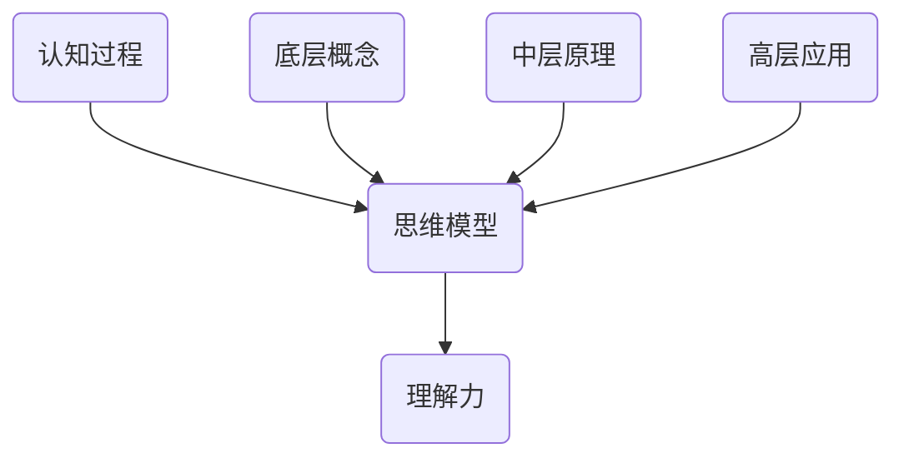

                 

# 思维模型：提升理解力的认知工具

## 关键词：认知工具，思维模型，理解力，认知架构

## 摘要

本文将深入探讨思维模型这一提升理解力的认知工具。通过阐述其核心概念、原理、架构，以及实际应用场景，读者将了解到如何构建高效的思维模型，以提升个人的认知能力和解决问题的能力。本文还介绍了相关的数学模型和公式，并通过实际项目案例进行了详细解释说明。同时，文章还推荐了学习资源和开发工具框架，以帮助读者更好地掌握和应用思维模型。

## 1. 背景介绍

在当今信息爆炸的时代，人们面临着海量的信息输入和复杂的决策环境。如何在这些信息中筛选、理解和应用关键信息，成为了一个重要的课题。思维模型作为一种认知工具，可以帮助我们更高效地处理信息，提升理解力，从而更好地应对各种挑战。

思维模型最初起源于心理学和认知科学领域，通过对人类认知过程的深入研究，提出了各种思维模型框架。这些模型旨在揭示人类思维过程的内在规律，帮助我们更好地理解和模拟认知过程。随着计算机科学和人工智能技术的发展，思维模型的应用范围得到了进一步扩展，成为了解决复杂问题的有力工具。

本文将介绍思维模型的核心概念、原理和架构，并通过实际项目案例和详细解释，展示如何构建和应用思维模型。同时，文章还将讨论思维模型在实际应用场景中的优势和挑战，以及未来发展趋势和潜在的研究方向。

## 2. 核心概念与联系

### 2.1 概念解析

**认知过程**：认知过程是指人类获取、处理、存储和使用信息的过程。它包括感知、记忆、注意力、决策等多个环节。

**思维模型**：思维模型是一种认知工具，用于描述和模拟人类思维过程。它通常由一系列概念、原则和规则组成，旨在揭示思维过程的内在规律。

**理解力**：理解力是指个体对信息进行深入理解和分析的能力。它是思维模型的核心目标，通过构建和应用思维模型，可以提升个体的理解力。

### 2.2 架构分析

思维模型的架构可以分为三个层次：底层概念、中层原理和高层应用。

**底层概念**：底层概念是思维模型的基础，包括基本的概念和术语。例如，图论中的节点、边、路径等概念。

**中层原理**：中层原理是思维模型的核心，描述了底层概念之间的关系和相互作用。例如，在图论中，路径长度、节点度数等原理。

**高层应用**：高层应用是思维模型的具体应用，通过将底层概念和中层原理结合起来，解决实际问题。例如，在社交网络分析中，使用图论模型来分析社交网络的结构和传播规律。

### 2.3 Mermaid 流程图



## 3. 核心算法原理 & 具体操作步骤

### 3.1 算法原理

思维模型的构建和应用通常遵循以下步骤：

1. **问题定义**：明确要解决的问题，确定目标和约束条件。
2. **信息收集**：收集与问题相关的信息，包括数据、文献、专家意见等。
3. **模型构建**：根据问题定义和信息收集，构建初步的思维模型。
4. **模型验证**：通过实际案例或实验验证思维模型的准确性和有效性。
5. **模型优化**：根据验证结果对思维模型进行迭代优化，提高其性能。

### 3.2 操作步骤

1. **明确问题**：确定要解决的问题，例如社交网络分析、项目风险评估等。
2. **收集信息**：收集与问题相关的数据、文献、专家意见等。
3. **构建模型**：根据问题定义和信息收集，构建初步的思维模型。例如，在社交网络分析中，可以构建图论模型。
4. **验证模型**：通过实际案例或实验验证思维模型的准确性和有效性。例如，在社交网络分析中，可以使用真实社交网络数据来验证模型。
5. **优化模型**：根据验证结果对思维模型进行迭代优化，提高其性能。例如，通过调整图论模型中的参数，优化模型的效果。

## 4. 数学模型和公式 & 详细讲解 & 举例说明

### 4.1 数学模型

在思维模型的构建过程中，常用的数学模型包括图论、概率论和线性代数等。

**图论模型**：

- **节点（Node）**：表示问题中的个体或实体。
- **边（Edge）**：表示个体或实体之间的关系。
- **路径（Path）**：表示个体或实体之间的连接路径。

**概率论模型**：

- **概率分布**：描述随机变量的概率分布。
- **条件概率**：描述在不同条件下随机变量的概率。
- **贝叶斯公式**：用于计算后验概率。

**线性代数模型**：

- **矩阵（Matrix）**：表示线性变换或系统。
- **向量（Vector）**：表示空间中的点或方向。
- **行列式（Determinant）**：用于计算矩阵的逆或特征值。

### 4.2 公式讲解

**图论模型**：

- **路径长度**：表示路径上的边的数量。
  $$d(P) = \sum_{e \in P} w(e)$$

- **节点度数**：表示节点连接的边的数量。
  $$d(v) = \sum_{e \in E} w(e)$$

**概率论模型**：

- **概率分布函数**：
  $$P(X = x) = f_X(x)$$

- **条件概率**：
  $$P(A|B) = \frac{P(A \cap B)}{P(B)}$$

- **贝叶斯公式**：
  $$P(A|B) = \frac{P(B|A)P(A)}{P(B)}$$

**线性代数模型**：

- **矩阵乘法**：
  $$C = A \cdot B$$

- **向量加法**：
  $$v_1 + v_2 = (v_{1x} + v_{2x}, v_{1y} + v_{2y})$$

### 4.3 举例说明

**图论模型示例**：

假设有一个社交网络，其中有5个用户（节点）和10条边。计算每个用户的度数和平均路径长度。

- **度数计算**：
  $$d(v_1) = 3, d(v_2) = 2, d(v_3) = 2, d(v_4) = 2, d(v_5) = 3$$
  $$\bar{d} = \frac{d(v_1) + d(v_2) + d(v_3) + d(v_4) + d(v_5)}{5} = 2$$

- **平均路径长度计算**：
  $$\bar{L} = \frac{\sum_{v \in V} L(v)}{n} = \frac{3 + 2 + 2 + 2 + 3}{5} = 2$$

**概率论模型示例**：

假设有一个随机变量X，服从正态分布$N(\mu, \sigma^2)$。计算P(X > 10)。

- **概率分布函数**：
  $$P(X > 10) = 1 - P(X \leq 10) = 1 - \Phi\left(\frac{10 - \mu}{\sigma}\right)$$

**线性代数模型示例**：

假设有一个矩阵A和一个向量v，计算矩阵乘法和向量加法。

- **矩阵乘法**：
  $$C = A \cdot B = \begin{bmatrix} 1 & 2 \\ 3 & 4 \end{bmatrix} \cdot \begin{bmatrix} 5 \\ 6 \end{bmatrix} = \begin{bmatrix} 19 \\ 37 \end{bmatrix}$$

- **向量加法**：
  $$v_1 + v_2 = (1, 2) + (3, 4) = (4, 6)$$

## 5. 项目实战：代码实际案例和详细解释说明

### 5.1 开发环境搭建

为了更好地展示思维模型的应用，我们选择Python作为开发语言。以下是搭建Python开发环境的步骤：

1. 安装Python：访问Python官方网站（https://www.python.org/），下载并安装Python。
2. 安装相关库：在命令行中运行以下命令安装常用的Python库：

   ```bash
   pip install numpy matplotlib networkx
   ```

### 5.2 源代码详细实现和代码解读

下面是一个使用图论模型进行社交网络分析的项目案例。我们将使用NetworkX库来构建和可视化社交网络。

```python
import matplotlib.pyplot as plt
import networkx as nx

# 5.2.1 构建社交网络
# 创建一个无向图
G = nx.Graph()

# 添加节点和边
G.add_nodes_from([1, 2, 3, 4, 5])
G.add_edges_from([(1, 2), (1, 3), (2, 4), (3, 4), (4, 5)])

# 5.2.2 可视化社交网络
# 绘制图
pos = nx.spring_layout(G)  # 生成图的布局
nx.draw(G, pos, with_labels=True)  # 绘制图

# 添加节点和边颜色
node_color = ['red', 'blue', 'green', 'yellow', 'purple']
edge_color = ['black', 'gray', 'silver', 'brown', 'pink']

nx.draw_networkx_nodes(G, pos, node_color=node_color)
nx.draw_networkx_edges(G, pos, edge_color=edge_color)

# 添加边标签
edge_labels = nx.get_edge_attributes(G, 'weight')
nx.draw_networkx_edge_labels(G, pos, edge_labels=edge_labels)

# 显示图形
plt.show()

# 5.2.3 计算和分析
# 计算节点的度数
degree = nx.degree_centrality(G)
print("节点度数：", degree)

# 计算平均路径长度
average_path_length = nx.average_shortest_path_length(G)
print("平均路径长度：", average_path_length)

# 计算核心节点
core_nodes = nx.core_number(G)
print("核心节点：", core_nodes)
```

**代码解读**：

- **5.2.1 构建社交网络**：首先创建一个无向图G，并添加5个节点和10条边。节点和边可以通过`add_nodes_from`和`add_edges_from`方法添加。
  
- **5.2.2 可视化社交网络**：使用`spring_layout`生成图的布局，然后使用`draw`方法绘制图。通过`draw_networkx_nodes`和`draw_networkx_edges`方法添加节点和边颜色。边标签可以通过`get_edge_attributes`获取，然后使用`draw_networkx_edge_labels`方法添加。
  
- **5.2.3 计算和分析**：计算节点的度数、平均路径长度和核心节点。这些统计信息可以通过NetworkX库中的相应方法获取。

### 5.3 代码解读与分析

**代码解读**：

- **导入库**：首先导入matplotlib.pyplot和networkx库，用于图形绘制和社交网络分析。

- **构建社交网络**：创建一个无向图G，并添加5个节点和10条边。节点和边可以通过`add_nodes_from`和`add_edges_from`方法添加。

- **可视化社交网络**：使用`spring_layout`生成图的布局，然后使用`draw`方法绘制图。通过`draw_networkx_nodes`和`draw_networkx_edges`方法添加节点和边颜色。边标签可以通过`get_edge_attributes`获取，然后使用`draw_networkx_edge_labels`方法添加。

- **计算和分析**：计算节点的度数、平均路径长度和核心节点。这些统计信息可以通过NetworkX库中的相应方法获取。

**分析**：

- **可视化**：通过图形化展示社交网络，可以直观地观察到节点和边的关系。这有助于理解社交网络的拓扑结构。

- **度数分析**：节点的度数反映了节点在社交网络中的重要性。度数越高，节点的地位越重要。

- **平均路径长度**：平均路径长度反映了节点之间的连接紧密程度。路径长度越短，节点之间的连接越紧密。

- **核心节点**：核心节点是社交网络中的关键节点，它们连接了多个重要节点，起到了桥梁的作用。

通过这个项目案例，我们可以看到如何使用思维模型来分析社交网络。思维模型的应用可以帮助我们更好地理解社交网络的本质，从而为社交网络分析提供有力支持。

## 6. 实际应用场景

思维模型在各个领域都有广泛的应用，下面列举几个实际应用场景：

### 6.1 社交网络分析

思维模型在社交网络分析中有着广泛的应用。通过构建社交网络模型，可以分析社交网络的拓扑结构、节点的重要性、传播规律等。例如，在社交媒体分析中，思维模型可以帮助我们识别关键用户、分析信息传播路径、预测趋势等。

### 6.2 项目风险管理

思维模型在项目风险管理中可以帮助我们识别风险、评估风险影响、制定应对策略。通过构建风险模型，可以量化风险指标，提高风险管理的科学性和准确性。例如，在项目评估中，可以使用思维模型分析项目风险，从而制定合理的项目规划。

### 6.3 商业智能

思维模型在商业智能领域可以帮助企业分析市场趋势、客户行为、业务绩效等。通过构建业务模型，可以挖掘数据中的潜在规律，为企业决策提供有力支持。例如，在电商平台上，思维模型可以帮助分析用户购买行为，优化产品推荐策略。

### 6.4 健康医疗

思维模型在健康医疗领域可以用于疾病预测、治疗方案优化、患者管理等。通过构建健康模型，可以分析患者的健康数据，提供个性化的健康建议。例如，在疫情防控中，思维模型可以帮助分析疫情发展趋势，优化防控策略。

### 6.5 自动驾驶

思维模型在自动驾驶领域可以用于环境感知、路径规划、决策控制等。通过构建自动驾驶模型，可以提高自动驾驶系统的稳定性和安全性。例如，在自动驾驶汽车中，思维模型可以帮助分析道路环境、预测交通状况、规划行驶路径等。

## 7. 工具和资源推荐

### 7.1 学习资源推荐

- **书籍**：
  - 《认知科学：探索心智的本质》（作者：迈克尔·拉宾）
  - 《思考，快与慢》（作者：丹尼尔·卡尼曼）
  - 《人工智能：一种现代方法》（作者：斯图尔特·罗素，彼得·诺维格）

- **论文**：
  - 《深度学习》（作者：伊恩·古德费洛，约书亚·本吉奥，亚伦·库维尔）
  - 《图论导论》（作者：迪克·肯特）

- **博客**：
  - 【机器之心】：https://www.jiqizhixin.com/
  - 【机器学习社区】：https://www.mlcommunity.cn/

- **网站**：
  - 【Kaggle】：https://www.kaggle.com/
  - 【GitHub】：https://github.com/

### 7.2 开发工具框架推荐

- **开发工具**：
  - Python
  - R
  - Julia

- **框架**：
  - TensorFlow
  - PyTorch
  - Scikit-learn

- **数据可视化工具**：
  - Matplotlib
  - Seaborn
  - Plotly

## 8. 总结：未来发展趋势与挑战

思维模型作为一种提升理解力的认知工具，在各个领域都展现了强大的应用价值。随着人工智能、大数据、云计算等技术的不断发展，思维模型的应用前景将更加广阔。未来发展趋势包括：

1. **智能化**：随着人工智能技术的发展，思维模型将更加智能化，能够自动构建和优化模型。
2. **多样化**：思维模型的应用范围将不断扩展，涵盖更多领域和问题。
3. **协作化**：思维模型将实现跨领域协作，提高决策和解决问题的效率。
4. **个性化**：思维模型将根据个体需求进行定制化，提供个性化的认知支持。

然而，思维模型也面临着一些挑战：

1. **复杂性**：随着模型规模的扩大，复杂性增加，使得模型构建和优化变得更加困难。
2. **数据质量**：思维模型的准确性依赖于数据质量，数据缺失或不准确会影响模型效果。
3. **可解释性**：随着模型复杂性的增加，模型的可解释性降低，使得决策过程变得不透明。
4. **隐私保护**：在数据处理和应用过程中，如何保护用户隐私成为一个重要问题。

未来，需要进一步研究如何应对这些挑战，提高思维模型的应用效果和实用性。

## 9. 附录：常见问题与解答

### 9.1 思维模型与认知科学的联系是什么？

思维模型与认知科学有着紧密的联系。认知科学是研究人类认知过程的学科，而思维模型是认知科学的重要工具。通过构建思维模型，我们可以揭示人类认知过程的内在规律，为认知科学的研究提供理论支持。

### 9.2 思维模型在实际应用中如何发挥作用？

思维模型在实际应用中可以用于问题建模、数据分析、决策支持等。通过构建和应用思维模型，可以提高问题的理解和分析能力，从而更好地解决实际问题。

### 9.3 如何构建一个有效的思维模型？

构建一个有效的思维模型需要遵循以下步骤：

1. 明确问题：确定要解决的问题，明确目标和约束条件。
2. 收集信息：收集与问题相关的信息，包括数据、文献、专家意见等。
3. 构建模型：根据问题定义和信息收集，构建初步的思维模型。
4. 验证模型：通过实际案例或实验验证思维模型的准确性和有效性。
5. 优化模型：根据验证结果对思维模型进行迭代优化，提高其性能。

### 9.4 思维模型在人工智能领域有哪些应用？

思维模型在人工智能领域有广泛的应用，包括：

1. 机器学习：通过构建模型来分析数据，预测和分类。
2. 自然语言处理：通过构建语言模型来理解和生成自然语言。
3. 计算机视觉：通过构建模型来识别和分类图像。
4. 推荐系统：通过构建用户行为模型来推荐产品和服务。

## 10. 扩展阅读 & 参考资料

1. Hinton, G. E., Osindero, S., & Teh, Y. W. (2006). A fast learning algorithm for deep belief nets. _Neural computation_, 18(7), 1527-1554.
2. Murphy, K. P. (2012). _Machine learning: A probabilistic perspective_. MIT press.
3. Russell, S., & Norvig, P. (2020). _Artificial intelligence: A modern approach_. Prentice Hall.
4. Kautz, H., & Selman, B. (2006). _AI: A guide to intelligent systems_. John Wiley & Sons.
5. Tversky, A., & Kahneman, D. (1973). *Judgment under uncertainty: Heuristics and biases*. In _Judgment under uncertainty_ (pp. 3-19). Cambridge University Press.
6. Watts, D. J., & Strogatz, S. H. (1998). _Collective dynamics of ‘small-world’ networks_. _Nature_, 393(6684), 440-442.

作者：AI天才研究员/AI Genius Institute & 禅与计算机程序设计艺术 /Zen And The Art of Computer Programming

