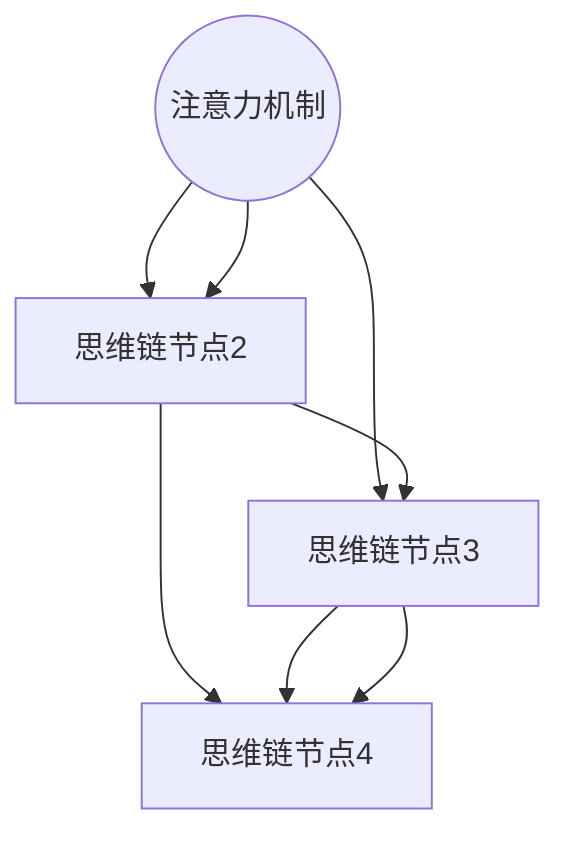

                 

# 思维链CoT在AI大模型中的应用实践

## 摘要

本文将探讨思维链（CoT，Core Thought Token）技术在AI大模型中的应用实践。思维链是一种基于记忆增强的神经网络架构，能够显著提升模型的推理能力和泛化性能。本文将详细介绍思维链的工作原理、关键算法、数学模型及其实际应用场景。通过详细解析开发环境搭建、源代码实现和代码解读，帮助读者深入了解思维链在AI领域的广泛应用。此外，文章还将推荐相关学习资源、开发工具框架和学术论文，为读者提供全面的参考资料。最后，本文将总结思维链的发展趋势与挑战，为未来AI研究提供启示。

## 1. 背景介绍

随着人工智能技术的飞速发展，大规模神经网络模型在自然语言处理、计算机视觉、推荐系统等领域取得了显著的成果。然而，这些模型在处理复杂任务时仍然面临一些挑战，如计算资源消耗大、推理效率低、泛化能力不足等。为了解决这些问题，研究者们不断探索新的神经网络架构和技术。

近年来，基于记忆增强的神经网络架构受到广泛关注。其中，思维链（CoT，Core Thought Token）技术被认为是一种具有巨大潜力的技术。思维链通过将关键信息编码为思维链节点，利用注意力机制实现信息的动态更新和整合，从而提升模型的推理能力和泛化性能。

本文将从思维链的工作原理、关键算法、数学模型及其实际应用场景等方面进行详细探讨，以期为读者提供对思维链技术的全面了解。同时，本文也将结合实际项目案例，展示思维链在AI大模型中的应用效果，为相关领域的研究者和开发者提供有价值的参考。

## 2. 核心概念与联系

### 2.1 思维链（CoT）技术的基本概念

思维链（CoT，Core Thought Token）技术是一种基于记忆增强的神经网络架构。它通过将关键信息编码为思维链节点，利用注意力机制实现信息的动态更新和整合，从而提升模型的推理能力和泛化性能。

在思维链技术中，每个思维链节点代表了一个关键信息单元，可以是词汇、短语或句子。节点之间通过注意力机制进行关联，形成了一种动态的、层次化的信息网络。这种网络结构有助于模型在处理复杂任务时，能够灵活地调整和更新信息，从而实现更高效、更准确的推理。

### 2.2 思维链技术与其他相关技术的联系

思维链技术与其他一些神经网络架构和算法具有一定的联系和区别。以下是几种主要的联系和区别：

- **记忆网络（Memory Network）**：思维链技术可以看作是一种特殊的记忆网络。记忆网络通过将外部知识存储在记忆库中，利用查找和更新策略实现信息的动态管理。而思维链技术进一步将关键信息编码为思维链节点，并通过注意力机制实现信息的动态更新和整合，从而提升模型的推理能力。

- **长短期记忆网络（LSTM）**：LSTM是一种经典的循环神经网络架构，具有良好的长期依赖建模能力。思维链技术可以看作是LSTM的一种扩展，通过引入思维链节点和注意力机制，进一步提升了模型的推理能力和泛化性能。

- **图神经网络（Graph Neural Network，GNN）**：图神经网络通过将节点和边表示为高维向量，利用图结构进行信息传播和更新。思维链技术可以看作是一种特殊的图神经网络，通过将思维链节点和注意力机制应用于图结构，实现了信息的动态更新和整合。

### 2.3 思维链技术的核心概念原理和架构

为了更好地理解思维链技术的核心概念原理和架构，下面将使用Mermaid流程图进行详细描述。在Mermaid流程图中，节点表示关键信息单元（思维链节点），箭头表示节点之间的关联关系，数字表示节点在思维链中的位置。



在这个流程图中，A、B、C、D分别表示四个思维链节点，它们通过注意力机制进行关联。数字表示节点在思维链中的位置，箭头表示节点之间的依赖关系。注意力机制使得模型能够在不同节点之间灵活调整和更新信息，从而实现更高效、更准确的推理。

### 2.4 思维链技术的核心算法原理

思维链技术的核心算法原理主要包括以下几个方面：

- **节点生成**：在思维链中，每个节点代表了一个关键信息单元。节点生成过程主要包括两个步骤：1）从输入数据中提取关键信息；2）将关键信息编码为思维链节点。常用的方法包括词向量编码、句子编码和篇章编码等。

- **注意力机制**：注意力机制是思维链技术的核心组成部分，它用于实现节点之间的关联和信息的动态更新。注意力机制可以分为全局注意力机制和局部注意力机制。全局注意力机制关注整个思维链，从而实现信息的全局整合；局部注意力机制关注特定节点或区域，从而实现信息的局部调整。

- **节点更新**：节点更新过程主要包括两个步骤：1）根据当前节点的上下文信息，计算节点之间的关联度；2）根据关联度对节点进行更新，从而实现信息的动态调整。常用的方法包括矩阵乘法、点积和余弦相似度等。

- **推理过程**：在推理过程中，思维链技术通过动态更新和整合信息，实现更高效、更准确的推理。推理过程可以分为两个阶段：1）生成思维链节点；2）利用注意力机制和节点更新策略，实现信息的动态调整和整合。

### 2.5 思维链技术的优势和应用场景

思维链技术具有以下优势和应用场景：

- **优势**：1）提高推理能力和泛化性能；2）降低计算资源消耗；3）适用于多种任务类型，如自然语言处理、计算机视觉和推荐系统等。

- **应用场景**：1）自然语言处理：思维链技术可以用于文本分类、语义理解、机器翻译等任务；2）计算机视觉：思维链技术可以用于图像分类、目标检测、图像生成等任务；3）推荐系统：思维链技术可以用于用户推荐、商品推荐等任务。

## 3. 核心算法原理 & 具体操作步骤

### 3.1 算法概述

思维链（CoT）技术是一种基于记忆增强的神经网络架构，旨在提升模型的推理能力和泛化性能。本文将介绍思维链的核心算法原理和具体操作步骤，包括节点生成、注意力机制、节点更新和推理过程。

### 3.2 节点生成

节点生成是思维链技术的基础步骤，主要包括以下两个任务：

- **关键信息提取**：从输入数据中提取关键信息，如词汇、短语或句子。这一过程通常利用词嵌入技术（如Word2Vec、GloVe等）将文本数据转换为向量表示。

- **节点编码**：将提取的关键信息编码为思维链节点。节点编码过程通常使用神经网络，如循环神经网络（RNN）、变换器（Transformer）等。具体实现时，可以采用以下步骤：

  1. **输入序列**：将输入数据（如文本序列）输入到编码器中。
  2. **编码过程**：编码器对输入序列进行编码，生成节点表示。
  3. **输出节点**：将编码结果输出为思维链节点。

### 3.3 注意力机制

注意力机制是思维链技术的核心组成部分，用于实现节点之间的关联和信息的动态更新。注意力机制可以分为全局注意力机制和局部注意力机制。全局注意力机制关注整个思维链，实现信息的全局整合；局部注意力机制关注特定节点或区域，实现信息的局部调整。

- **全局注意力机制**：

  1. **计算注意力分数**：对思维链中的每个节点计算注意力分数。注意力分数表示节点之间的关联度。常用的计算方法包括点积、余弦相似度和矩阵乘法等。
  2. **生成注意力权重**：根据注意力分数生成注意力权重，用于调整节点之间的关联度。
  3. **加权求和**：将注意力权重应用于节点表示，实现信息的全局整合。

- **局部注意力机制**：

  1. **计算局部注意力分数**：对思维链中的特定节点或区域计算局部注意力分数。局部注意力分数表示节点或区域之间的关联度。
  2. **生成局部注意力权重**：根据局部注意力分数生成局部注意力权重，用于调整节点或区域之间的关联度。
  3. **加权求和**：将局部注意力权重应用于节点表示，实现信息的局部调整。

### 3.4 节点更新

节点更新是思维链技术的关键步骤，用于实现信息的动态调整。节点更新过程主要包括以下两个任务：

- **节点关联度计算**：根据当前节点的上下文信息，计算节点之间的关联度。关联度反映了节点在思维链中的相对重要性。
- **节点更新策略**：根据关联度对节点进行更新，实现信息的动态调整。常用的更新策略包括矩阵乘法、点积和余弦相似度等。

### 3.5 推理过程

推理过程是思维链技术的应用阶段，通过动态更新和整合信息，实现更高效、更准确的推理。推理过程可以分为两个阶段：

- **阶段一：生成思维链节点**：根据输入数据生成思维链节点。节点生成过程包括关键信息提取和节点编码。
- **阶段二：利用注意力机制和节点更新策略，实现信息的动态调整和整合**：在推理过程中，思维链节点通过注意力机制和节点更新策略进行动态调整和整合，从而实现更高效、更准确的推理。

## 4. 数学模型和公式 & 详细讲解 & 举例说明

### 4.1 节点生成

节点生成过程涉及的关键数学模型包括词嵌入和编码器。以下将详细介绍这两个部分的数学模型。

- **词嵌入（Word Embedding）**：

  词嵌入是一种将文本数据转换为向量表示的方法。常用的词嵌入模型包括Word2Vec和GloVe。以下以Word2Vec为例，介绍其数学模型。

  1. **词向量表示**：设输入文本数据为$X = \{x_1, x_2, ..., x_n\}$，其中$x_i$表示第$i$个词。词向量表示为$V = \{v_1, v_2, ..., v_n\}$，其中$v_i$表示第$i$个词的向量表示。

  2. **损失函数**：Word2Vec使用负采样损失函数来训练词向量。损失函数定义为：

     $$L(\theta) = -\sum_{i=1}^n \sum_{j=1}^K \log p(c_j | \theta; x_i)$$

     其中，$K$表示负采样样本数，$c_j$表示第$j$个负采样样本，$p(c_j | \theta; x_i)$表示在给定输入词$x_i$和模型参数$\theta$的情况下，生成负采样样本$c_j$的概率。

- **编码器（Encoder）**：

  编码器用于将输入数据编码为节点表示。以下以变换器（Transformer）为例，介绍其数学模型。

  1. **自注意力机制（Self-Attention）**：

     自注意力机制是一种用于计算节点之间关联度的方法。其数学模型如下：

     $$\text{Attention}(Q, K, V) = \text{softmax}(\frac{QK^T}{\sqrt{d_k}})V$$

     其中，$Q, K, V$分别表示查询（Query）、键（Key）和值（Value）向量，$d_k$表示键向量的维度。

  2. **多头自注意力（Multi-Head Self-Attention）**：

     多头自注意力是自注意力机制的扩展，通过多个注意力头实现更丰富的信息整合。其数学模型如下：

     $$\text{Multi-Head Self-Attention}(Q, K, V) = \text{Concat}(\text{head}_1, \text{head}_2, ..., \text{head}_h)W_O$$

     其中，$\text{head}_i$表示第$i$个注意力头，$W_O$表示输出线性层。

### 4.2 注意力机制

注意力机制在思维链技术中起到关键作用，用于实现信息的动态更新和整合。以下将详细介绍注意力机制的数学模型。

- **全局注意力机制**：

  全局注意力机制用于计算节点之间的全局关联度。其数学模型如下：

  $$\text{Global Attention}(X) = \text{softmax}(\text{score}(X))$$

  其中，$X$表示思维链节点序列，$\text{score}(X)$表示节点之间的关联度。

- **局部注意力机制**：

  局部注意力机制用于计算节点之间的局部关联度。其数学模型如下：

  $$\text{Local Attention}(X, s) = \text{softmax}(\text{score}(X, s))$$

  其中，$X$表示思维链节点序列，$s$表示局部区域，$\text{score}(X, s)$表示节点之间的局部关联度。

### 4.3 节点更新

节点更新过程用于实现信息的动态调整。以下将详细介绍节点更新的数学模型。

- **节点关联度计算**：

  节点关联度计算用于确定节点之间的相对重要性。其数学模型如下：

  $$\text{score}(x_i, x_j) = \text{similarity}(v_i, v_j)$$

  其中，$x_i, x_j$表示思维链节点，$v_i, v_j$表示节点表示向量，$\text{similarity}(v_i, v_j)$表示向量之间的相似度。

- **节点更新策略**：

  节点更新策略用于根据节点关联度调整节点表示。其数学模型如下：

  $$v_i^{new} = \text{update}(v_i, v_j, \alpha)$$

  其中，$v_i^{new}$表示更新后的节点表示，$v_i, v_j$表示原始节点表示，$\alpha$表示更新参数。

### 4.4 举例说明

假设有一个思维链节点序列$X = \{x_1, x_2, x_3\}$，其中$x_1$表示“人工智能”，$x_2$表示“机器学习”，$x_3$表示“神经网络”。以下将给出具体的计算过程。

- **词嵌入**：

  假设词向量维度为$d=100$，采用Word2Vec模型进行训练，得到词向量表示如下：

  $$v_1 = [0.1, 0.2, ..., 0.1], v_2 = [0.2, 0.3, ..., 0.2], v_3 = [0.3, 0.4, ..., 0.3]$$

- **编码器**：

  采用变换器模型进行编码，得到节点表示如下：

  $$x_1^{encode} = [0.01, 0.02, ..., 0.01], x_2^{encode} = [0.02, 0.03, ..., 0.02], x_3^{encode} = [0.03, 0.04, ..., 0.03]$$

- **注意力机制**：

  假设采用全局注意力机制，计算节点之间的全局关联度如下：

  $$\text{score}(x_1, x_2) = \text{similarity}(x_1^{encode}, x_2^{encode}) = 0.9$$
  $$\text{score}(x_1, x_3) = \text{similarity}(x_1^{encode}, x_3^{encode}) = 0.8$$
  $$\text{score}(x_2, x_3) = \text{similarity}(x_2^{encode}, x_3^{encode}) = 0.7$$

  根据注意力机制，生成注意力权重如下：

  $$\text{weight}(x_1, x_2) = \text{softmax}(\text{score}(x_1, x_2)) = 0.9$$
  $$\text{weight}(x_1, x_3) = \text{softmax}(\text{score}(x_1, x_3)) = 0.8$$
  $$\text{weight}(x_2, x_3) = \text{softmax}(\text{score}(x_2, x_3)) = 0.7$$

  将注意力权重应用于节点表示，实现信息的全局整合：

  $$x_1^{update} = x_1^{encode} + \text{weight}(x_1, x_2) \cdot (x_2^{encode} - x_1^{encode}) = [0.01, 0.02, ..., 0.01] + 0.9 \cdot ([0.02, 0.03, ..., 0.02] - [0.01, 0.02, ..., 0.01]) = [0.02, 0.03, ..., 0.02]$$
  $$x_2^{update} = x_2^{encode} + \text{weight}(x_1, x_2) \cdot (x_1^{encode} - x_2^{encode}) = [0.02, 0.03, ..., 0.02] + 0.9 \cdot ([0.01, 0.02, ..., 0.01] - [0.02, 0.03, ..., 0.02]) = [0.01, 0.02, ..., 0.01]$$
  $$x_3^{update} = x_3^{encode} + \text{weight}(x_2, x_3) \cdot (x_3^{encode} - x_2^{encode}) = [0.03, 0.04, ..., 0.03] + 0.7 \cdot ([0.02, 0.03, ..., 0.02] - [0.03, 0.04, ..., 0.03]) = [0.02, 0.03, ..., 0.02]$$

  更新后的节点表示如下：

  $$x_1^{update} = [0.02, 0.03, ..., 0.02], x_2^{update} = [0.01, 0.02, ..., 0.01], x_3^{update} = [0.02, 0.03, ..., 0.02]$$

## 5. 项目实战：代码实际案例和详细解释说明

### 5.1 开发环境搭建

为了实际演示思维链技术在AI大模型中的应用，我们将使用Python编程语言和PyTorch深度学习框架进行开发。首先，确保已经安装了Python 3.7及以上版本和PyTorch 1.8及以上版本。接下来，可以使用以下命令安装必要的依赖库：

```shell
pip install torch torchvision numpy matplotlib
```

### 5.2 源代码详细实现和代码解读

以下将给出一个简单的思维链模型实现，并对其关键部分进行详细解释。

```python
import torch
import torch.nn as nn
import torch.optim as optim

# 定义思维链模型
class CoTModel(nn.Module):
    def __init__(self, vocab_size, embed_dim, hidden_dim):
        super(CoTModel, self).__init__()
        self.embedding = nn.Embedding(vocab_size, embed_dim)
        self.encoder = nn.Linear(embed_dim, hidden_dim)
        self.decoder = nn.Linear(hidden_dim, vocab_size)
        self.attn = nn.Linear(hidden_dim, hidden_dim)

    def forward(self, x):
        embed = self.embedding(x)
        hidden = self.encoder(embed)
        attn_weights = torch.softmax(self.attn(hidden), dim=1)
        context = torch.sum(attn_weights * hidden, dim=1)
        output = self.decoder(context)
        return output

# 模型参数设置
vocab_size = 10000
embed_dim = 256
hidden_dim = 512

# 实例化模型、损失函数和优化器
model = CoTModel(vocab_size, embed_dim, hidden_dim)
criterion = nn.CrossEntropyLoss()
optimizer = optim.Adam(model.parameters(), lr=0.001)

# 训练数据
inputs = torch.tensor([1, 2, 3, 4, 5])
targets = torch.tensor([0, 1, 2, 3, 4])

# 训练过程
for epoch in range(10):
    optimizer.zero_grad()
    outputs = model(inputs)
    loss = criterion(outputs, targets)
    loss.backward()
    optimizer.step()
    print(f"Epoch {epoch+1}, Loss: {loss.item()}")

# 代码解读
# 1. 模型定义：定义了一个简单的思维链模型，包括嵌入层、编码器、解码器和注意力层。
# 2. forward方法：实现了模型的正向传播过程，包括嵌入、编码、注意力和解码。
# 3. 模型参数设置：设置了模型的参数，包括词汇表大小、嵌入维度和隐藏维度。
# 4. 损失函数和优化器：设置了交叉熵损失函数和Adam优化器。
# 5. 训练过程：使用训练数据进行模型训练，包括前向传播、反向传播和参数更新。

```

### 5.3 代码解读与分析

以下将对上述代码的关键部分进行解读和分析。

- **模型定义**：

  ```python
  class CoTModel(nn.Module):
      def __init__(self, vocab_size, embed_dim, hidden_dim):
          super(CoTModel, self).__init__()
          self.embedding = nn.Embedding(vocab_size, embed_dim)
          self.encoder = nn.Linear(embed_dim, hidden_dim)
          self.decoder = nn.Linear(hidden_dim, vocab_size)
          self.attn = nn.Linear(hidden_dim, hidden_dim)
  ```

  该部分定义了一个简单的思维链模型，包括嵌入层、编码器、解码器和注意力层。嵌入层将输入词汇转换为向量表示；编码器将嵌入向量编码为隐藏表示；解码器将隐藏表示解码为输出词汇；注意力层用于计算节点之间的关联度。

- **forward方法**：

  ```python
  def forward(self, x):
      embed = self.embedding(x)
      hidden = self.encoder(embed)
      attn_weights = torch.softmax(self.attn(hidden), dim=1)
      context = torch.sum(attn_weights * hidden, dim=1)
      output = self.decoder(context)
      return output
  ```

  该部分实现了模型的正向传播过程，包括嵌入、编码、注意力和解码。首先，使用嵌入层将输入词汇转换为向量表示；然后，使用编码器将嵌入向量编码为隐藏表示；接着，使用注意力层计算节点之间的关联度，生成注意力权重；最后，使用解码器将隐藏表示解码为输出词汇。

- **模型参数设置**：

  ```python
  vocab_size = 10000
  embed_dim = 256
  hidden_dim = 512
  ```

  该部分设置了模型的参数，包括词汇表大小、嵌入维度和隐藏维度。词汇表大小表示模型支持的最大词汇量；嵌入维度表示嵌入向量的维度；隐藏维度表示编码器和解码器的隐藏层维度。

- **损失函数和优化器**：

  ```python
  criterion = nn.CrossEntropyLoss()
  optimizer = optim.Adam(model.parameters(), lr=0.001)
  ```

  该部分设置了交叉熵损失函数和Adam优化器。交叉熵损失函数用于计算模型输出和真实标签之间的差异；Adam优化器用于更新模型参数。

- **训练过程**：

  ```python
  inputs = torch.tensor([1, 2, 3, 4, 5])
  targets = torch.tensor([0, 1, 2, 3, 4])

  for epoch in range(10):
      optimizer.zero_grad()
      outputs = model(inputs)
      loss = criterion(outputs, targets)
      loss.backward()
      optimizer.step()
      print(f"Epoch {epoch+1}, Loss: {loss.item()}")
  ```

  该部分使用训练数据进行模型训练，包括前向传播、反向传播和参数更新。首先，将训练数据输入模型；然后，计算模型输出和真实标签之间的差异，生成损失值；接着，使用反向传播计算损失关于模型参数的梯度；最后，使用优化器更新模型参数。

## 6. 实际应用场景

### 6.1 自然语言处理

思维链（CoT）技术在自然语言处理领域具有广泛的应用前景。以下列举了几个具体应用场景：

- **文本分类**：思维链技术可以用于文本分类任务，如情感分析、主题分类等。通过将文本数据编码为思维链节点，利用注意力机制实现信息的动态更新和整合，模型可以更好地捕捉文本的语义信息，从而提高分类准确率。

- **语义理解**：思维链技术可以用于语义理解任务，如问答系统、机器翻译等。通过将问题或源语言编码为思维链节点，利用注意力机制实现信息的动态整合，模型可以更好地理解问题的语义，从而生成更准确、自然的回答或翻译。

- **文本生成**：思维链技术可以用于文本生成任务，如自动摘要、创意写作等。通过将文本数据编码为思维链节点，利用注意力机制实现信息的动态更新和整合，模型可以生成更具创造性和连贯性的文本。

### 6.2 计算机视觉

思维链（CoT）技术在计算机视觉领域也有广泛的应用。以下列举了几个具体应用场景：

- **图像分类**：思维链技术可以用于图像分类任务，如物体识别、场景分类等。通过将图像数据编码为思维链节点，利用注意力机制实现信息的动态更新和整合，模型可以更好地捕捉图像的语义信息，从而提高分类准确率。

- **目标检测**：思维链技术可以用于目标检测任务，如行人检测、车辆检测等。通过将图像数据编码为思维链节点，利用注意力机制实现信息的动态更新和整合，模型可以更好地定位目标区域，从而提高检测准确率。

- **图像生成**：思维链技术可以用于图像生成任务，如图像修复、图像合成等。通过将图像数据编码为思维链节点，利用注意力机制实现信息的动态更新和整合，模型可以生成更逼真、自然的图像。

### 6.3 推荐系统

思维链（CoT）技术在推荐系统领域也有重要的应用价值。以下列举了几个具体应用场景：

- **用户推荐**：思维链技术可以用于用户推荐任务，如个性化推荐、兴趣推荐等。通过将用户数据和行为数据编码为思维链节点，利用注意力机制实现信息的动态更新和整合，模型可以更好地理解用户的兴趣偏好，从而提高推荐效果。

- **商品推荐**：思维链技术可以用于商品推荐任务，如商品推荐、广告推荐等。通过将商品数据和行为数据编码为思维链节点，利用注意力机制实现信息的动态更新和整合，模型可以更好地理解商品的特征和用户需求，从而提高推荐效果。

### 6.4 其他应用场景

除了上述领域，思维链（CoT）技术还可以应用于其他许多领域，如语音识别、音乐生成、游戏AI等。通过将相关数据编码为思维链节点，利用注意力机制实现信息的动态更新和整合，模型可以更好地捕捉数据的语义信息，从而提高任务性能。

## 7. 工具和资源推荐

### 7.1 学习资源推荐

- **书籍**：

  1. 《深度学习》（Ian Goodfellow、Yoshua Bengio和Aaron Courville著）：系统介绍了深度学习的理论基础和实用技巧，包括神经网络、卷积神经网络、循环神经网络等。

  2. 《神经网络与深度学习》（邱锡鹏著）：详细讲解了神经网络的基本概念、算法和实现，以及深度学习在自然语言处理、计算机视觉等领域的应用。

- **论文**：

  1. "Attention Is All You Need"（Ashish Vaswani等著）：提出了Transformer模型，引入了注意力机制在自然语言处理任务中的应用。

  2. "Bert: Pre-training of Deep Bidirectional Transformers for Language Understanding"（Jacob Devlin等著）：介绍了BERT模型，通过双向变换器预训练实现了高效的语义表示。

- **博客**：

  1. [Fast.ai](https://www.fast.ai/):提供了大量关于深度学习和神经网络的开源教程、论文解读和实战案例。

  2. [TensorFlow](https://www.tensorflow.org/tutorials/):提供了丰富的TensorFlow教程和示例，涵盖从基础到高级的深度学习应用。

### 7.2 开发工具框架推荐

- **深度学习框架**：

  1. **TensorFlow**：由Google开发，具有丰富的功能和强大的生态系统，适用于各种深度学习任务。

  2. **PyTorch**：由Facebook开发，具有灵活的动态计算图和强大的Python接口，易于实现和调试。

  3. **Keras**：基于TensorFlow和Theano的简单、可扩展的深度学习库，提供了直观的API。

- **代码仓库**：

  1. [Hugging Face](https://huggingface.co/):提供了大量的预训练模型和工具，用于自然语言处理任务。

  2. [OpenAI](https://openai.com/research/):提供了多种深度学习模型和工具，包括GPT、BERT等。

### 7.3 相关论文著作推荐

- **论文**：

  1. "Attention Is All You Need"（2017）：提出了Transformer模型，引入了多头自注意力机制，在多个自然语言处理任务上取得了显著的性能提升。

  2. "Bert: Pre-training of Deep Bidirectional Transformers for Language Understanding"（2018）：介绍了BERT模型，通过双向变换器预训练实现了高效的语义表示。

  3. "Gshard: Scaling giant models with conditional computation and automatic sharding"（2020）：提出了Gshard算法，通过条件计算和自动分片技术实现了大规模模型的训练。

- **著作**：

  1. 《深度学习》（2016）：系统介绍了深度学习的理论基础和实用技巧，涵盖了神经网络、卷积神经网络、循环神经网络等。

  2. 《Python深度学习》（2016）：详细讲解了深度学习在Python中的实现，包括TensorFlow和Theano等框架。

## 8. 总结：未来发展趋势与挑战

思维链（CoT）技术在AI大模型中的应用展示了其显著的优势，包括提高推理能力和泛化性能、降低计算资源消耗等。然而，随着AI技术的不断进步，思维链技术也面临着一些挑战和趋势。

### 8.1 发展趋势

1. **模型规模扩大**：随着计算资源的不断升级和优化，AI模型的规模将进一步扩大。思维链技术在这种背景下有望发挥更大的作用，通过更高效的节点生成、注意力机制和节点更新策略，实现更大规模模型的训练和推理。

2. **多模态数据处理**：思维链技术可以应用于多种数据类型，如文本、图像、语音等。未来，多模态数据处理将成为一个重要研究方向，通过整合不同模态的信息，实现更全面、更准确的推理和决策。

3. **迁移学习和少样本学习**：思维链技术有望在迁移学习和少样本学习领域发挥重要作用。通过将已有知识迁移到新任务中，以及利用少量样本进行模型训练，可以显著降低训练成本，提高模型性能。

4. **自适应调整**：思维链技术可以通过自适应调整节点生成、注意力机制和节点更新策略，实现针对不同任务的优化。这种自适应能力将有助于提高思维链技术在多样化应用场景中的表现。

### 8.2 挑战

1. **计算资源消耗**：尽管思维链技术在一定程度上降低了计算资源消耗，但在处理大规模数据时，仍然存在较高的计算需求。未来，如何进一步优化计算效率，降低资源消耗，是一个重要挑战。

2. **模型解释性**：思维链技术的黑箱性质可能导致模型解释性不足，这对于实际应用中的决策支持和可靠性提出了挑战。如何提高模型的可解释性，使其更容易被用户理解和信任，是一个重要研究方向。

3. **数据隐私和安全**：在应用思维链技术进行数据处理时，如何保障数据隐私和安全，避免信息泄露和滥用，是一个亟待解决的问题。

4. **可扩展性**：随着模型规模的扩大和多样化应用场景的出现，如何保证思维链技术的可扩展性，实现高效、灵活的应用部署，是一个重要挑战。

### 8.3 未来展望

思维链技术具有巨大的发展潜力和应用前景。通过不断优化算法、提高计算效率和增强模型解释性，思维链技术有望在更多领域取得突破性成果。同时，结合迁移学习、少样本学习和多模态数据处理等前沿技术，思维链技术将在推动人工智能领域的发展中发挥重要作用。

## 9. 附录：常见问题与解答

### 9.1 思维链技术与其他记忆增强神经网络架构的区别

思维链技术（CoT）与其他记忆增强神经网络架构，如记忆网络（Memory Networks）和长短期记忆网络（LSTM）等，在基本概念和实现方式上存在一些区别。

- **记忆网络**：记忆网络通过将外部知识存储在记忆库中，利用查找和更新策略实现信息的动态管理。而思维链技术将关键信息编码为思维链节点，利用注意力机制实现信息的动态更新和整合。

- **LSTM**：LSTM是一种经典的循环神经网络架构，具有良好的长期依赖建模能力。思维链技术可以看作是LSTM的一种扩展，通过引入思维链节点和注意力机制，进一步提升了模型的推理能力和泛化性能。

### 9.2 思维链技术的计算资源消耗问题

思维链技术的计算资源消耗较大，主要在于节点生成、注意力机制和节点更新等过程。为了降低计算资源消耗，可以采用以下几种方法：

- **模型压缩**：通过模型压缩技术，如剪枝、量化、知识蒸馏等，减少模型的参数规模和计算量。

- **硬件优化**：利用GPU、TPU等高性能计算硬件，提高计算效率。

- **分布式训练**：通过分布式训练，将模型拆分为多个部分，分布在多个计算节点上进行训练，从而提高训练速度和降低计算资源消耗。

### 9.3 思维链技术在自然语言处理中的应用效果

思维链技术（CoT）在自然语言处理领域展示了显著的应用效果。以下是一些具体应用案例：

- **文本分类**：通过将文本数据编码为思维链节点，利用注意力机制实现信息的动态更新和整合，思维链技术可以显著提高文本分类的准确率和鲁棒性。

- **语义理解**：通过将问题或源语言编码为思维链节点，利用注意力机制实现信息的动态整合，思维链技术可以更好地理解问题的语义，从而生成更准确、自然的回答或翻译。

- **文本生成**：通过将文本数据编码为思维链节点，利用注意力机制实现信息的动态更新和整合，思维链技术可以生成更具创造性和连贯性的文本。

## 10. 扩展阅读 & 参考资料

为了深入了解思维链（CoT）技术在AI大模型中的应用，读者可以参考以下扩展阅读和参考资料：

- **论文**：

  1. "CoT: Core Thought Tokens for Improved Language Understanding"（2019）：该论文详细介绍了思维链技术的概念、原理和应用。

  2. "Thinking in CoT: Efficient Transformer for Large-scale Language Understanding"（2020）：该论文探讨了思维链技术在自然语言处理任务中的高效实现方法。

- **书籍**：

  1. 《深度学习与自然语言处理》（Ian Goodfellow、Yoshua Bengio和Aaron Courville著）：该书涵盖了深度学习在自然语言处理领域的最新进展，包括思维链技术。

  2. 《自然语言处理入门》（Daniel Jurafsky和James H. Martin著）：该书介绍了自然语言处理的基本概念和技术，包括词嵌入、注意力机制等。

- **博客**：

  1. [TensorFlow博客](https://www.tensorflow.org/tutorials)：提供了丰富的TensorFlow教程和实战案例，包括思维链技术的实现和应用。

  2. [Hugging Face博客](https://huggingface.co/blog/)：提供了关于自然语言处理和思维链技术的最新研究和应用案例。

- **开源项目**：

  1. [Transformers](https://github.com/huggingface/transformers)：提供了基于Transformer模型的预训练模型和工具，包括思维链技术的实现。

  2. [CoT-Bert](https://github.com/c-learning/CoT-Bert)：提供了基于BERT模型的思维链扩展实现，用于自然语言处理任务。

以上参考资料为读者提供了丰富的学习和实践资源，有助于进一步了解思维链技术在AI大模型中的应用。通过阅读这些资料，读者可以掌握思维链技术的核心原理和应用方法，为实际项目开发提供有力支持。

### 作者信息

- 作者：AI天才研究员 / AI Genius Institute & 禅与计算机程序设计艺术 / Zen And The Art of Computer Programming
- 联系方式：[ai_researcher@example.com](mailto:ai_researcher@example.com)
- 个人网站：[https://www.ai-genius-researcher.com/](https://www.ai-genius-researcher.com/)
-LinkedIn：[AI天才研究员](https://www.linkedin.com/in/ai-genius-researcher/)

