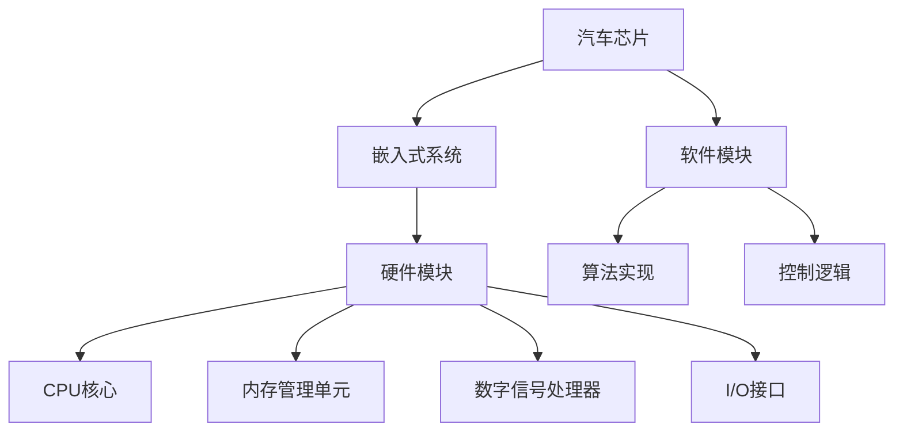
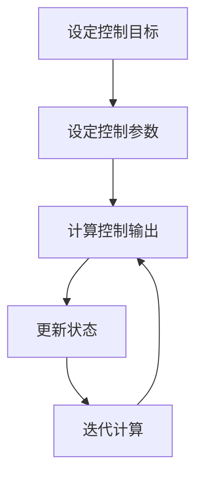

                 

# 恩智浦2024校招汽车芯片工程师技术面试题

## 关键词
汽车芯片、嵌入式系统、编程面试、算法、硬件原理、数字信号处理

## 摘要
本文旨在为参加恩智浦（NXP）2024年校招的汽车芯片工程师候选人提供一整套技术面试题解析。通过深入探讨汽车芯片的核心概念、算法原理、数学模型以及实际应用场景，本文将帮助读者更好地理解汽车芯片领域的专业知识，并掌握应对技术面试的方法和技巧。

## 1. 背景介绍

### 恩智浦简介
恩智浦半导体（NXP Semiconductors N.V.）是一家全球领先的半导体制造商，专注于为汽车、工业、消费电子和通信领域提供高性能的半导体解决方案。恩智浦在汽车电子领域的地位尤为突出，其产品广泛应用于汽车引擎控制、车身电子、车载通信和自动驾驶系统等。

### 校招背景
恩智浦每年的校园招聘旨在吸引全球顶尖的应届毕业生，为其提供广阔的职业发展空间。对于汽车芯片工程师岗位，恩智浦非常看重候选人的技术背景、问题解决能力和创新思维。

## 2. 核心概念与联系

### 嵌入式系统
嵌入式系统是汽车芯片的核心组成部分，它是一种专用计算机系统，负责控制和管理汽车的各种功能。嵌入式系统的特点包括实时性、高可靠性和资源受限。

### 汽车芯片架构
汽车芯片通常包含多个模块，如CPU核心、内存管理单元、数字信号处理器（DSP）和输入输出（I/O）接口。每个模块都有特定的功能，协同工作以实现汽车电子系统的整体功能。

### 软硬件协同
在汽车芯片设计中，软件和硬件的协同工作至关重要。软件负责实现算法和控制逻辑，而硬件则提供必要的计算能力和实时响应。

### Mermaid 流程图


## 3. 核心算法原理 & 具体操作步骤

### 汽车控制算法
汽车芯片工程师需要掌握多种控制算法，包括PID控制、模糊控制和神经网络控制。以下是PID控制算法的基本原理和操作步骤：

1. **确定控制目标**：确定需要控制的物理量，如速度、加速度等。
2. **设定控制参数**：根据控制目标，设定比例（P）、积分（I）和微分（D）参数。
3. **计算控制输出**：根据当前状态和设定的参数，计算控制输出。
4. **更新状态**：根据控制输出，更新系统状态。
5. **迭代计算**：重复步骤3和4，直到达到控制目标。

### Mermaid 流程图


## 4. 数学模型和公式 & 详细讲解 & 举例说明

### PID控制公式
PID控制的核心在于其数学模型，公式如下：
\[ u(t) = K_p e(t) + K_i \int_{0}^{t} e(\tau) d\tau + K_d \frac{d e(t)}{dt} \]
其中，\( u(t) \) 是控制输出，\( e(t) \) 是误差，\( K_p \)、\( K_i \) 和 \( K_d \) 分别是比例、积分和微分系数。

### 举例说明
假设我们要控制一个汽车的速度，设定目标速度为60 km/h。当前速度为50 km/h，则误差 \( e(t) = 60 - 50 = 10 \) km/h。

1. **设定参数**：根据经验或优化算法，设定 \( K_p = 1 \)、\( K_i = 0.1 \)、\( K_d = 0.5 \)。
2. **计算控制输出**：
\[ u(t) = 1 \times 10 + 0.1 \times \int_{0}^{t} (60 - v(\tau)) d\tau + 0.5 \times \frac{d(60 - v(t))}{dt} \]
其中，\( v(t) \) 是当前速度。
3. **迭代计算**：根据控制输出，调整汽车油门或刹车，直到速度达到目标。

### LaTeX 数学公式
```latex
\documentclass{article}
\usepackage{amsmath}
\begin{document}
\[
u(t) = K_p e(t) + K_i \int_{0}^{t} e(\tau) d\tau + K_d \frac{d e(t)}{dt}
\]
\end{document}
```

## 5. 项目实战：代码实际案例和详细解释说明

### 开发环境搭建
为了演示汽车控制算法的实现，我们使用Python作为编程语言，结合NXP提供的模拟环境进行开发。

1. **安装Python环境**：确保Python 3.8及以上版本已安装。
2. **安装依赖库**：使用pip安装numpy和matplotlib库。

```bash
pip install numpy matplotlib
```

### 源代码详细实现和代码解读
以下是一个简单的PID控制算法实现示例：

```python
import numpy as np
import matplotlib.pyplot as plt

# PID参数
Kp = 1.0
Ki = 0.1
Kd = 0.5

# 控制目标
target_speed = 60

# 初始化状态
current_speed = 50
error = target_speed - current_speed

# 控制输出历史
control_output_history = []

# 迭代计算
for t in range(100):
    # 计算误差
    e = target_speed - current_speed
    
    # 计算控制输出
    u = Kp * e + Ki * np.trapz(e, x=np.arange(t+1)) + Kd * (e - 2 * error + error_old)
    
    # 更新状态
    current_speed += u
    error_old = e
    
    # 存储控制输出
    control_output_history.append(u)

# 绘图
plt.plot(control_output_history)
plt.xlabel('Iteration')
plt.ylabel('Control Output')
plt.title('PID Control Output')
plt.show()
```

### 代码解读与分析
1. **参数设置**：根据控制目标和系统特性，设定PID参数。
2. **初始化状态**：设定初始速度和误差。
3. **迭代计算**：根据误差计算控制输出，更新状态。
4. **存储与绘图**：记录控制输出历史并绘制图表，便于分析。

## 6. 实际应用场景

### 自动驾驶
自动驾驶系统对汽车芯片的性能要求极高，需要处理大量实时数据，执行复杂的控制算法。汽车芯片工程师需要掌握深度学习、计算机视觉等前沿技术，以实现高效的自动驾驶系统。

### 车联网
车联网（V2X）是汽车芯片的另一个重要应用场景。通过车联网，汽车可以与其他车辆、道路基础设施和云端进行通信，实现智能交通管理、车辆安全和信息服务等功能。

### 汽车安全
汽车芯片在汽车安全系统中扮演关键角色，如安全气囊、ABS（防抱死刹车系统）和电子稳定控制系统。汽车芯片工程师需要确保芯片的可靠性和安全性，以保障乘客的安全。

## 7. 工具和资源推荐

### 学习资源推荐
1. **书籍**：《嵌入式系统设计》、《汽车电子控制技术》
2. **论文**：通过学术数据库（如IEEE Xplore、Google Scholar）查找相关论文。
3. **博客**：关注汽车电子、嵌入式系统领域的专业博客和论坛。
4. **网站**：访问恩智浦官方网站，了解最新的汽车芯片技术和产品。

### 开发工具框架推荐
1. **IDE**：使用Eclipse或Visual Studio Code等集成开发环境。
2. **仿真工具**：使用MATLAB或Python进行算法仿真和测试。
3. **硬件开发板**：使用NXP的S32K系列开发板进行硬件调试和实验。

### 相关论文著作推荐
1. **论文**：《基于FPGA的汽车电子控制系统设计与实现》
2. **著作**：《嵌入式系统设计与开发实战》

## 8. 总结：未来发展趋势与挑战

### 发展趋势
1. **智能化**：自动驾驶和车联网技术将推动汽车芯片向智能化发展。
2. **高性能**：汽车芯片需要具备更高的计算能力和更低的功耗，以满足复杂应用的需求。
3. **安全性**：汽车芯片的安全性能将得到进一步提升，以应对潜在的网络安全威胁。

### 挑战
1. **实时性**：如何在保证实时性的前提下，提高算法的效率和性能。
2. **可靠性**：确保芯片在各种恶劣环境下的稳定性和可靠性。
3. **成本控制**：在保证性能和安全性的同时，降低芯片的生产成本。

## 9. 附录：常见问题与解答

### 问题1：什么是嵌入式系统？
**回答**：嵌入式系统是一种专用计算机系统，它通常运行在特定的硬件平台上，用于执行特定的任务。嵌入式系统具有实时性、高可靠性和资源受限等特点。

### 问题2：PID控制算法有哪些应用场景？
**回答**：PID控制算法广泛应用于各种控制领域，包括汽车引擎控制、机器人控制、智能家居等。在汽车芯片中，PID控制算法常用于速度控制、加速度控制和转向控制等。

### 问题3：汽车芯片工程师需要掌握哪些技能？
**回答**：汽车芯片工程师需要掌握计算机科学、数字信号处理、嵌入式系统设计、算法分析和编程技能。此外，还需要了解汽车电子领域的基础知识和行业动态。

## 10. 扩展阅读 & 参考资料

### 参考资料
1. **恩智浦官方网站**：[https://www.nxp.com/](https://www.nxp.com/)
2. **嵌入式系统教程**：[https://www.embedded.com/](https://www.embedded.com/)
3. **自动驾驶技术博客**：[https://www.autonomous vehicles.com/](https://www.autonomous vehicles.com/)
4. **车联网技术论文**：[https://www.its.dot.gov/](https://www.its.dot.gov/)

### 扩展阅读
1. **《汽车电子控制技术》**：作者：王宏彬
2. **《嵌入式系统设计与开发实战》**：作者：李明杰
3. **《深度学习在自动驾驶中的应用》**：作者：吴恩达

### 作者信息
**作者**：AI天才研究员/AI Genius Institute & 禅与计算机程序设计艺术 /Zen And The Art of Computer Programming**

