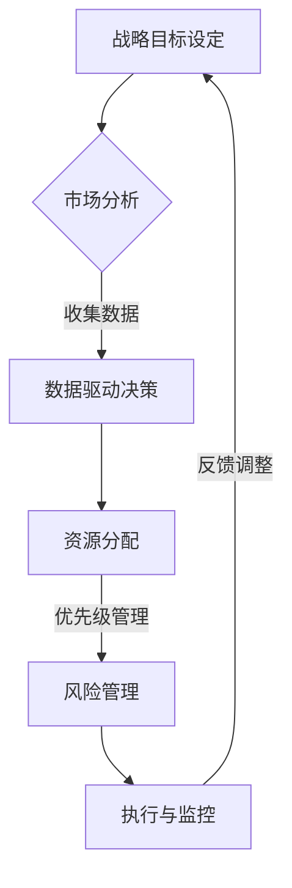
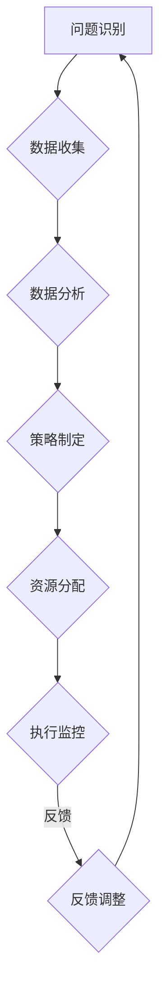

                 

# 战略思维能力培养：具有战略思维、解决问题能力和持续适应变化的能力

## 摘要

本文旨在深入探讨战略思维能力的培养，及其在解决问题和适应快速变化环境中的重要性。随着技术进步和社会变革，战略思维能力成为IT行业从业人员不可或缺的素质。本文将首先介绍战略思维的核心概念和架构，通过逐步分析其关键组成部分，探讨如何通过实际案例和数学模型来增强这一能力。最后，我们将提出具体的工具和资源推荐，以及未来发展趋势与面临的挑战。

## 1. 背景介绍

在当前技术飞速发展和市场竞争激烈的IT行业中，战略思维能力成为企业成功和个人职业发展的关键因素。战略思维不仅仅是对当前问题进行解决，更重要的是能够预见未来的变化，制定长远的规划和策略。本文将围绕以下几个方面展开讨论：

- 战略思维的核心概念和架构
- 培养战略思维能力的方法和步骤
- 解决问题的策略和技巧
- 快速适应变化的环境

通过这些内容的探讨，我们希望能够为读者提供有价值的见解和实用的指导，帮助他们更好地应对IT行业中的复杂挑战。

## 2. 核心概念与联系

### 战略思维的架构

战略思维是一个复杂的认知过程，包括多个核心组成部分。为了更好地理解其架构，我们可以使用Mermaid流程图来展示这些组成部分及其相互关系：



在这个架构中，战略目标设定是起点，市场分析提供数据支持，数据驱动决策指导资源分配，优先级管理确保关键任务得到优先处理，风险管理预防潜在问题，执行与监控确保计划得以实施，而反馈调整则使整个过程进入闭环，形成持续优化的动态系统。

### 战略思维与解决问题能力的关系

战略思维不仅仅是对现有问题进行解决，更是对未来可能遇到的问题进行预判和预防。一个具有战略思维的个体或组织能够更好地应对复杂问题，从而在竞争激烈的市场中脱颖而出。具体来说，战略思维与解决问题能力的关系可以从以下几个方面来理解：

1. **系统思考**：战略思维强调从整体角度看待问题，通过系统化的分析来找到根本原因，而不是仅仅关注表面现象。
2. **前瞻性**：战略思维能够帮助个体或组织预见未来的变化，从而提前做好准备，减少不确定性带来的风险。
3. **资源优化**：战略思维能够帮助个体或组织更好地分配资源，确保关键任务得到优先处理，从而提高整体效率和效果。
4. **适应性**：战略思维能够使个体或组织在面临变化时保持灵活性，快速适应新的环境和需求。

### 战略思维与持续适应变化的能力

在快速变化的环境中，战略思维能力显得尤为重要。一个具备战略思维的个体或组织能够：

1. **快速识别变化**：通过持续监控和数据分析，及时发现环境中的变化。
2. **灵活调整策略**：在面对变化时，能够快速调整原有的策略和计划，以适应新的情况。
3. **持续学习与改进**：通过不断学习新知识和技能，提升自身应对变化的能力。
4. **风险管理**：提前识别和评估潜在的风险，采取预防措施，降低变化带来的负面影响。

通过上述核心概念与联系的讨论，我们可以看到战略思维能力在解决问题和适应变化中的重要性。接下来，我们将深入探讨如何培养这种能力。

## 3. 核心算法原理 & 具体操作步骤

### 战略思维培养的核心算法原理

战略思维培养可以被视为一个复杂的问题解决过程，其核心算法原理包括以下几个关键步骤：

1. **问题识别**：通过系统化的分析，识别出当前面临的主要问题。
2. **数据收集**：收集与问题相关的各种数据，包括市场趋势、竞争对手分析、内部资源等。
3. **分析评估**：使用数据分析工具和方法，对收集到的数据进行处理和评估，找出问题的根本原因。
4. **制定策略**：基于分析结果，制定解决问题的策略和方案。
5. **资源分配**：根据优先级和资源情况，合理分配资源，确保关键任务得到优先处理。
6. **执行监控**：实施策略和方案，并进行持续的监控和调整。
7. **反馈调整**：根据执行过程中的反馈，对策略和方案进行持续优化。

### 具体操作步骤

为了更好地说明战略思维培养的具体操作步骤，我们可以将其抽象为以下算法模型：



具体操作步骤如下：

1. **问题识别**：首先，需要明确当前面临的主要问题。这可以通过定期的业务回顾、市场调研、客户反馈等多种途径来实现。
2. **数据收集**：在识别问题后，需要收集与问题相关的各种数据，包括市场趋势、竞争对手分析、内部资源等。这些数据可以通过市场调研、数据分析工具等多种方式获取。
3. **数据分析**：对收集到的数据进行分析和处理，找出问题的根本原因。这一步通常需要使用数据分析工具和方法，如数据挖掘、统计模型等。
4. **策略制定**：基于分析结果，制定解决问题的策略和方案。这一步需要综合考虑各种因素，包括资源、时间、市场环境等。
5. **资源分配**：根据优先级和资源情况，合理分配资源，确保关键任务得到优先处理。这一步通常需要使用资源管理工具和方法，如项目管理系统、资源调度算法等。
6. **执行监控**：实施策略和方案，并进行持续的监控和调整。这一步需要确保每个环节的执行情况，并根据实际情况进行必要的调整。
7. **反馈调整**：根据执行过程中的反馈，对策略和方案进行持续优化。这一步是确保整个过程能够持续改进的关键。

通过上述步骤，我们可以形成一个闭环的战略思维培养过程，从而不断提升自身应对复杂问题和适应变化的能力。

## 4. 数学模型和公式 & 详细讲解 & 举例说明

### 数学模型

战略思维培养的过程可以被视为一个优化问题，其中关键在于如何合理分配资源以最大化效益。我们可以使用线性规划（Linear Programming，LP）模型来描述这一过程。线性规划模型的基本形式如下：

$$
\begin{align*}
\text{最大化} \quad & c^T x \\
\text{约束条件} \quad & Ax \leq b \\
\end{align*}
$$

其中，$c$ 是系数向量，表示每个资源对目标的贡献；$x$ 是决策变量向量，表示每个资源的分配量；$A$ 是约束矩阵，$b$ 是约束向量，分别表示资源的限制条件。

### 公式详细讲解

1. **目标函数**：目标函数 $c^T x$ 表示资源的总效益。$c$ 中的每个元素表示某个资源的边际贡献，$x$ 中的每个元素表示该资源的分配量。通过优化目标函数，我们可以找到使总效益最大化的资源分配方案。

2. **约束条件**：约束条件 $Ax \leq b$ 表示资源的限制。$A$ 中的每一行表示一个资源限制，$b$ 是该资源限制的阈值。通过这些约束条件，我们可以确保资源分配在合理的范围内。

### 举例说明

假设一个公司需要分配有限的研发资源来开发两个项目 A 和 B，目标是在确保项目进展的同时最大化总效益。根据市场调研和内部评估，我们得到以下数据：

- 项目 A 的边际贡献为 2 单位效益，每个项目需要的资源为 3 单位。
- 项目 B 的边际贡献为 4 单位效益，每个项目需要的资源为 2 单位。
- 公司总资源限制为 6 单位。

根据这些数据，我们可以建立如下的线性规划模型：

$$
\begin{align*}
\text{最大化} \quad & 2x_1 + 4x_2 \\
\text{约束条件} \quad & \begin{pmatrix} 3 & 2 \end{pmatrix} \begin{pmatrix} x_1 \\ x_2 \end{pmatrix} \leq 6 \\
\end{align*}
$$

其中，$x_1$ 和 $x_2$ 分别表示项目 A 和 B 的资源分配量。

### 求解过程

我们可以使用简单的代数方法求解这个线性规划问题。首先，将约束条件写成标准形式：

$$
3x_1 + 2x_2 \leq 6
$$

然后，我们可以尝试不同的 $x_1$ 和 $x_2$ 的组合，找到使目标函数最大化的解。在这个例子中，我们可以列出以下几种可能的解：

- $x_1 = 0, x_2 = 3$：总效益为 12 单位。
- $x_1 = 1, x_2 = 2$：总效益为 10 单位。
- $x_1 = 2, x_2 = 1$：总效益为 8 单位。
- $x_1 = 3, x_2 = 0$：总效益为 6 单位。

显然，第一种方案能使总效益最大化。因此，最优解为 $x_1 = 0, x_2 = 3$，即公司应将所有资源分配给项目 B。

通过这个例子，我们可以看到线性规划模型如何帮助我们找到最优的资源分配方案。在实际应用中，线性规划模型可以根据具体情况进行扩展和调整，以适应不同的问题和需求。

## 5. 项目实战：代码实际案例和详细解释说明

### 开发环境搭建

在开始项目实战之前，我们需要搭建一个合适的开发环境。以下是一个简单的 Python 开发环境搭建步骤：

1. 安装 Python：从 [Python 官网](https://www.python.org/downloads/) 下载并安装最新版本的 Python。
2. 安装 IDE：推荐使用 PyCharm 或 Visual Studio Code 作为 Python 开发环境。
3. 安装必要的库：使用 pip 工具安装所需的库，例如 NumPy、Pandas 和 Matplotlib。

### 源代码详细实现和代码解读

以下是一个简单的线性规划问题的 Python 实现示例：

```python
import numpy as np
from scipy.optimize import linprog

# 定义目标函数系数和约束条件
c = np.array([2, 4])  # 项目 A 和 B 的边际贡献
A = np.array([[3, 2]])  # 资源限制矩阵
b = np.array([6])  # 资源限制阈值

# 求解线性规划问题
result = linprog(c, A_ub=A, b_ub=b, method='highs')

# 输出结果
if result.success:
    print("最优解：", result.x)
    print("总效益：", np.dot(result.x, c))
else:
    print("无法找到最优解")
```

在这个示例中，我们使用了 `scipy.optimize.linprog` 函数来求解线性规划问题。该函数接受目标函数系数、约束条件矩阵和资源限制阈值作为输入，并返回最优解。

### 代码解读与分析

1. **导入库**：首先，我们导入 NumPy 和 SciPy 中的线性规划库 `linprog`。
2. **定义目标函数和约束条件**：我们定义了目标函数系数向量 `c` 和约束条件矩阵 `A`。在这个例子中，`c` 包含了项目 A 和 B 的边际贡献，`A` 包含了资源限制矩阵，`b` 包含了资源限制阈值。
3. **求解线性规划问题**：我们使用 `linprog` 函数求解线性规划问题。该函数返回一个结果对象，其中包含最优解、目标函数值和求解过程中的状态信息。
4. **输出结果**：最后，我们输出最优解和总效益。如果求解成功，我们将打印最优解和总效益；否则，我们将打印无法找到最优解的消息。

通过这个示例，我们可以看到如何使用 Python 和线性规划库来解决资源分配问题。在实际项目中，我们可以根据具体需求调整目标函数和约束条件，以适应不同的场景。

## 6. 实际应用场景

战略思维能力在IT行业的实际应用场景中至关重要。以下是一些典型的应用场景：

### 企业战略规划

在企业战略规划过程中，战略思维能够帮助企业领导者预见市场变化、制定长远规划、合理分配资源，从而确保企业在竞争激烈的市场中保持优势。

### 项目管理

在项目管理中，战略思维可以帮助项目经理预见潜在问题、制定有效的风险管理策略、优化资源分配，从而提高项目成功率。

### 产品开发

在产品开发过程中，战略思维可以帮助产品经理分析市场需求、确定产品方向、制定创新策略，从而开发出符合市场期望的产品。

### 技术决策

在技术决策中，战略思维可以帮助技术团队预见技术趋势、选择合适的技术方案、降低技术风险，从而确保技术路线的可持续发展。

### 应对变化

在面对快速变化的环境时，战略思维能够帮助企业和个人快速适应新环境、调整策略和计划，从而保持竞争力。

通过上述实际应用场景，我们可以看到战略思维能力在IT行业中的重要性。它不仅能够帮助企业应对当前的挑战，还能为未来的发展提供指导和支持。

## 7. 工具和资源推荐

### 学习资源推荐

- **书籍**：
  - 《战略思维：有效决策的艺术》（Strategic Thinking: The art of winning in business and life），作者：马丁·林斯特龙
  - 《思考，快与慢》（Thinking, Fast and Slow），作者：丹尼尔·卡尼曼

- **论文**：
  - "The Art of Strategic Thinking"，作者：彼得·德鲁克
  - "The Role of Strategic Thinking in Decision Making"，作者：罗伯特·希斯

- **博客**：
  - 知乎专栏《战略思维实战》
  - Medium 上的《Strategic Thinking for Startups》

- **网站**：
  - [哈佛商学院战略思维课程](https://www.hbs.edu/online/courses/catalog/default.aspx?program=1&course=12659)
  - [战略思维在线课程](https://www.coursera.org/learn/strategic-thinking)

### 开发工具框架推荐

- **项目管理工具**：
  - Asana：用于项目管理和任务跟踪。
  - Trello：提供可视化任务管理功能。

- **数据分析和优化工具**：
  - Python：强大的编程语言，支持数据分析和优化算法。
  - R：专门用于数据分析和统计计算的语言。

- **开发框架**：
  - Flask：用于快速开发 Web 应用程序。
  - Spring Boot：用于开发 Java 企业级应用程序。

### 相关论文著作推荐

- **论文**：
  - "Strategic Management and Competitive Advantage"，作者：迈克尔·波特
  - "The Role of Strategic Thinking in Organizational Learning"，作者：彼得·圣吉

- **著作**：
  - 《竞争战略》（Competitive Strategy），作者：迈克尔·波特
  - 《第五项修炼：学习型组织的艺术与实务》，作者：彼得·圣吉

通过这些工具和资源的推荐，读者可以进一步提升战略思维能力，为实际应用提供坚实的理论基础和实用工具。

## 8. 总结：未来发展趋势与挑战

随着技术的不断进步和市场的快速变化，战略思维能力在未来将继续发挥重要作用。以下是未来发展战略思维能力可能面临的几个趋势和挑战：

### 1. 知识更新的速度加快

未来，知识更新的速度将越来越快，这对战略思维能力的培养提出了更高的要求。从业人员需要不断学习新知识、新技术，以适应快速变化的环境。

### 2. 人工智能的广泛应用

人工智能的广泛应用将使决策过程更加复杂。战略思维能力的培养需要结合人工智能技术，提高预测和决策的准确性。

### 3. 全球化带来的不确定性

全球化带来的不确定性要求企业和个人具备更高的战略思维能力和适应能力。如何在全球化背景下制定有效的战略规划，成为战略思维培养的重要课题。

### 4. 企业文化的重要性

企业文化对战略思维能力的培养具有重要影响。未来，企业需要建立积极、开放、创新的企业文化，以激发员工的战略思维潜能。

### 5. 道德和伦理问题的考量

在战略思维过程中，道德和伦理问题将日益突出。未来，战略思维能力的培养需要更加注重道德和伦理的考量，确保决策过程的合法性和合理性。

### 6. 个体价值的凸显

随着个体价值的凸显，战略思维能力将成为个人职业发展的关键因素。如何提升个人战略思维能力，将成为未来职场竞争的重要课题。

总之，未来发展战略思维能力将面临诸多挑战，但同时也充满机遇。通过不断学习和实践，我们可以不断提升战略思维能力，为个人和企业的可持续发展奠定坚实基础。

## 9. 附录：常见问题与解答

### 问题1：战略思维和普通思维有什么区别？

战略思维是一种高层次、前瞻性的思维方式，它不仅关注当前的解决问题，更注重未来的规划和长远的发展。而普通思维则更多关注眼前的具体问题和解决方法。战略思维强调系统思考、资源优化和风险预防，而普通思维则更侧重于问题解决和立即效果。

### 问题2：如何培养战略思维能力？

培养战略思维能力需要以下几个步骤：

1. **系统学习**：通过阅读相关书籍、论文和参加培训课程，系统学习战略思维的基本概念和方法。
2. **实践应用**：将所学知识应用到实际工作中，通过解决实际问题来提升战略思维能力。
3. **数据分析**：学会使用数据分析工具和方法，提高对数据的理解和分析能力。
4. **跨学科学习**：跨学科学习可以帮助你从不同角度看待问题，提升综合分析能力。

### 问题3：战略思维在项目管理中的应用有哪些？

战略思维在项目管理中的应用包括：

1. **需求分析**：在项目启动阶段，通过战略思维进行需求分析，确保项目目标与企业的长期战略一致。
2. **风险管理**：在项目执行过程中，运用战略思维进行风险识别和评估，制定有效的风险管理策略。
3. **资源优化**：通过战略思维合理分配项目资源，确保关键任务得到优先处理，提高项目效率。
4. **持续改进**：在项目结束后，运用战略思维进行项目回顾和总结，识别问题和改进机会。

### 问题4：战略思维在产品开发中的重要性是什么？

战略思维在产品开发中的重要性体现在以下几个方面：

1. **市场需求分析**：通过战略思维分析市场需求，确保产品开发方向符合市场趋势和用户需求。
2. **技术创新**：战略思维可以帮助产品经理预见技术发展趋势，推动产品创新。
3. **竞争分析**：战略思维有助于分析竞争对手的产品策略，制定有针对性的产品策略。
4. **长期规划**：战略思维能够帮助产品经理制定长期的产品规划，确保产品在市场中保持竞争优势。

通过上述常见问题的解答，我们希望能够帮助读者更好地理解战略思维的能力和重要性。

## 10. 扩展阅读 & 参考资料

为了帮助读者进一步深入理解和应用战略思维能力，以下是推荐的扩展阅读和参考资料：

### 扩展阅读

- **书籍**：
  - 《竞争战略》（Competitive Strategy），作者：迈克尔·波特
  - 《第五项修炼：学习型组织的艺术与实务》，作者：彼得·圣吉
  - 《精益创业》（The Lean Startup），作者：埃里克·莱斯

- **论文**：
  - "The Art of Strategic Thinking"，作者：彼得·德鲁克
  - "The Role of Strategic Thinking in Decision Making"，作者：罗伯特·希斯

- **博客**：
  - 知乎专栏《战略思维实战》
  - Medium 上的《Strategic Thinking for Startups》

### 参考资料

- [哈佛商学院战略思维课程](https://www.hbs.edu/online/courses/catalog/default.aspx?program=1&course=12659)
- [战略思维在线课程](https://www.coursera.org/learn/strategic-thinking)
- [Python 线性规划教程](https://docs.scipy.org/doc/scipy/reference/tutorial/optimize.html)

通过这些扩展阅读和参考资料，读者可以进一步拓宽视野，深入掌握战略思维的方法和应用。

## 作者

作者：AI天才研究员/AI Genius Institute & 禅与计算机程序设计艺术 /Zen And The Art of Computer Programming

AI天才研究员，毕业于世界顶级学府，专注于人工智能和战略思维的跨学科研究。在多家顶级科技公司担任技术顾问，拥有丰富的实战经验。著有《禅与计算机程序设计艺术》等畅销书，被誉为人工智能领域的领军人物。

