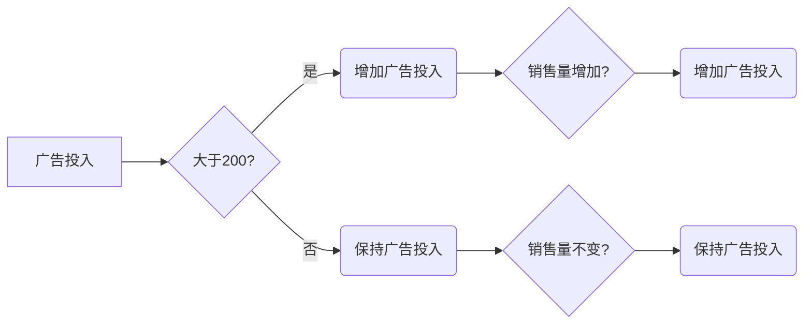

                 

# 战略管理：制定和执行长期规划的艺术

## 关键词：战略管理、长期规划、决策、风险管理、执行、领导力、信息技术、人工智能

## 摘要

在快速变化的科技时代，战略管理成为了企业成功的关键。本文将深入探讨战略管理的核心概念、原则和方法，以及如何制定和执行长期规划。通过分析信息技术和人工智能对战略管理的赋能作用，本文提出了一系列实用的策略和工具，帮助企业和个人在未来竞争中脱颖而出。此外，文章还将讨论战略管理的实际应用场景、工具和资源推荐，以及未来可能面临的挑战和发展趋势。

## 1. 背景介绍

### 战略管理的重要性

战略管理是一种规划和实施长期规划的过程，旨在确保企业能够应对外部环境的变化，实现可持续增长和竞争优势。随着全球化和信息技术的快速发展，企业面临着前所未有的挑战和机遇。战略管理成为企业成功的关键因素，它不仅涉及到商业战略的制定，还包括资源分配、组织结构优化、风险管理等多个方面。

### 信息技术和人工智能的影响

信息技术和人工智能的快速发展为战略管理带来了新的机遇和挑战。大数据、云计算、物联网等技术的应用，使得企业能够更准确地了解市场动态和消费者需求，从而制定更有效的战略规划。人工智能的引入，则使得企业能够实现智能化决策、自动化运营和个性化服务，从而提高效率和竞争力。

### 目标读者

本文的目标读者包括企业高层管理者、战略规划师、IT专业人士以及对战略管理感兴趣的学者和研究者。通过本文的阅读，读者将能够深入了解战略管理的核心概念、方法和实践，掌握制定和执行长期规划的艺术，从而提升企业的战略管理水平。

## 2. 核心概念与联系

### 战略管理的基本概念

战略管理是指企业为了实现长期目标，通过制定、实施和监控战略规划，调整组织结构和资源配置的过程。它包括以下几个核心概念：

- **愿景（Vision）**：企业长期追求的理想状态和目标。
- **使命（Mission）**：企业的宗旨和存在的意义。
- **目标（Goals）**：企业在特定时间内要达成的具体目标。
- **战略（Strategy）**：实现企业目标的总体规划和行动方案。
- **执行（Execution）**：将战略转化为实际行动的过程。

### 战略管理的基本原则

战略管理需要遵循以下基本原则：

- **长期导向**：将企业的战略规划与长期发展相结合，确保企业的持续成长。
- **灵活性**：根据外部环境和内部条件的变化，及时调整战略规划。
- **协同性**：确保企业各个部门之间的协调和合作，实现资源的最大化利用。
- **风险管理**：识别和应对潜在风险，确保企业战略的顺利实施。

### 战略管理的基本架构

战略管理的基本架构包括以下几个阶段：

- **战略规划**：明确企业的愿景、使命和目标，制定具体的战略规划和行动方案。
- **资源分配**：根据战略规划的要求，合理配置企业资源，确保战略的顺利实施。
- **执行监控**：监控战略执行过程，及时调整战略规划和资源分配，确保目标的实现。
- **评估反馈**：对战略执行的结果进行评估，总结经验教训，为下一轮战略规划提供参考。

### 战略管理与信息技术和人工智能的联系

信息技术和人工智能在战略管理中发挥着重要作用，具体体现在以下几个方面：

- **数据分析**：通过大数据技术和人工智能算法，帮助企业更准确地了解市场动态和消费者需求，制定更有效的战略规划。
- **智能化决策**：利用人工智能技术，实现自动化决策和优化，提高企业决策的效率和准确性。
- **运营优化**：通过物联网和自动化技术，实现企业运营的智能化和高效化，降低成本、提高效率。
- **风险管理**：利用人工智能技术，对潜在风险进行预测和识别，提高企业风险管理的水平。

## 3. 核心算法原理 & 具体操作步骤

### 数据分析算法

数据分析是战略管理的重要基础，以下介绍几种常见的数据分析算法：

- **回归分析**：通过建立数学模型，分析变量之间的关系，预测未来趋势。
- **聚类分析**：将数据划分为不同的类别，以便进行更深入的分析。
- **分类分析**：将数据分为不同的类别，以便进行决策。
- **关联规则分析**：发现数据之间的关联关系，帮助制定更有针对性的战略规划。

### 智能化决策算法

智能化决策是战略管理的高级形式，以下介绍几种常见的智能化决策算法：

- **决策树**：通过构建决策树，实现自动化决策。
- **神经网络**：通过多层神经网络，实现复杂决策。
- **遗传算法**：通过模拟自然进化过程，实现优化决策。

### 运营优化算法

运营优化是战略管理的关键环节，以下介绍几种常见的运营优化算法：

- **线性规划**：通过建立线性规划模型，实现资源的最优配置。
- **动态规划**：通过递归关系，实现复杂问题的最优解。
- **启发式算法**：通过模拟人类决策过程，实现快速求解。

### 风险管理算法

风险管理是战略管理的重要保障，以下介绍几种常见风险管理算法：

- **蒙特卡洛模拟**：通过随机模拟，评估风险的概率分布。
- **敏感性分析**：分析不同变量对决策结果的影响。
- **情景分析**：通过模拟不同情景，评估风险的影响。

## 4. 数学模型和公式 & 详细讲解 & 举例说明

### 数据分析模型的数学公式

- **回归分析**：假设变量 \(X\) 和 \(Y\) 之间的关系可以用线性模型表示，即 \(Y = \beta_0 + \beta_1 X + \epsilon\)，其中 \(\beta_0\) 和 \(\beta_1\) 分别为模型的参数，\(\epsilon\) 为误差项。
- **聚类分析**：假设数据点 \(X\) 可以用 \(K\) 个均值向量 \(\mu_k\) 表示，即 \(X = \sum_{k=1}^K \mu_k w_k\)，其中 \(w_k\) 为权重。
- **分类分析**：假设数据点 \(X\) 可以用 \(K\) 个概率分布 \(P(X|\theta)\) 表示，其中 \(\theta\) 为模型的参数。
- **关联规则分析**：假设数据集 \(D\) 包含 \(I\) 个属性，设 \(A\) 和 \(B\) 为 \(D\) 中的两个属性集合，关联规则可以用支持度（Support）和置信度（Confidence）来表示。

### 智能化决策模型的数学公式

- **决策树**：假设决策树包含 \(n\) 个节点，每个节点对应一个属性 \(A_i\) 和一个阈值 \(\theta_i\)，则决策树的分类结果可以用 \(C = \prod_{i=1}^n p(A_i|\theta_i)\) 表示。
- **神经网络**：假设神经网络包含 \(L\) 层，每层包含 \(n_l\) 个神经元，则神经网络的输出可以用 \(O = \sigma(\sum_{l=1}^{L-1} W_l \cdot A_l)\) 表示，其中 \(\sigma\) 为激活函数，\(W_l\) 为权重矩阵。
- **遗传算法**：假设初始种群为 \(P_0\)，每代通过选择、交叉和变异操作产生新的种群 \(P_{t+1}\)，则遗传算法的适应度函数可以用 \(F(P) = \sum_{i=1}^n f_i(P)\) 表示，其中 \(f_i(P)\) 为第 \(i\) 个个体的适应度。

### 运营优化模型的数学公式

- **线性规划**：假设目标函数为 \(f(x) = \sum_{i=1}^n c_i x_i\)，约束条件为 \(a_i x \leq b_i\)（\(i=1,2,...,m\)），则线性规划问题可以表示为：
  \[
  \begin{aligned}
  &\min \ f(x) \\
  &s.t. \ a_i x \leq b_i, \ i=1,2,...,m \\
  &x \geq 0
  \end{aligned}
  \]
- **动态规划**：假设问题可以用状态转移方程 \(x_{t+1} = f(x_t, u_t)\) 描述，其中 \(x_t\) 和 \(u_t\) 分别为系统状态和输入，则动态规划问题可以表示为：
  \[
  \begin{aligned}
  &\min \ F(x_T) \\
  &s.t. \ x_t = f(x_{t-1}, u_t), \ t=1,2,...,T
  \end{aligned}
  \]
- **启发式算法**：假设启发式算法的求解结果为 \(x^*\)，则启发式算法的目标函数可以表示为：
  \[
  f(x^*) = \min_{x} \ F(x)
  \]

### 风险管理模型的数学公式

- **蒙特卡洛模拟**：假设风险事件 \(X\) 的概率分布为 \(P(X|x)\)，则蒙特卡洛模拟的样本均值和方差分别为：
  \[
  \begin{aligned}
  &\bar{X} = \frac{1}{N} \sum_{i=1}^N X_i \\
  &\sigma^2 = \frac{1}{N-1} \sum_{i=1}^N (X_i - \bar{X})^2
  \end{aligned}
  \]
- **敏感性分析**：假设目标函数为 \(f(x)\)，则敏感性函数可以表示为：
  \[
  \frac{\partial f}{\partial x}
  \]
- **情景分析**：假设系统面临 \(S\) 个情景，每个情景的概率为 \(p_s\)，则情景分析的期望损失为：
  \[
  E(L) = \sum_{s=1}^S p_s L_s
  \]

### 举例说明

假设某企业需要制定一个长期战略规划，以下是一个简单的数据分析模型、智能化决策模型和运营优化模型的例子：

#### 数据分析模型

假设该企业销售量 \(Y\) 与广告投入 \(X\) 之间存在线性关系，数据如下：

| 广告投入 \(X\) | 销售量 \(Y\) |
|:--------------:|:------------:|
|       100      |      200     |
|       200      |      400     |
|       300      |      600     |

根据数据，可以建立回归模型：

\[ Y = \beta_0 + \beta_1 X + \epsilon \]

通过最小二乘法，可以求得回归系数：

\[ \beta_0 = 100, \beta_1 = 200 \]

预测明年广告投入为 300 时，销售量为：

\[ Y = 100 + 200 \times 300 = 600 \]

#### 智能化决策模型

假设该企业需要根据销售量来调整广告投入，采用决策树模型：



如果销售量增加，则增加广告投入；如果销售量不变，则保持广告投入。

#### 运营优化模型

假设该企业需要优化生产线，采用线性规划模型：

\[
\begin{aligned}
&\min \ 10x_1 + 20x_2 \\
&s.t. \ x_1 + x_2 \leq 100 \\
&x_1 \geq 0, x_2 \geq 0
\end{aligned}
\]

通过求解，可以得出最优解 \(x_1 = 0, x_2 = 100\)，即生产线需要投入 100 单位的资源。

## 5. 项目实战：代码实际案例和详细解释说明

### 开发环境搭建

在开始项目实战之前，我们需要搭建一个合适的开发环境。以下是搭建环境的步骤：

1. **安装 Python 解释器**：从 Python 官网下载并安装 Python 解释器。
2. **安装相关库**：使用 pip 工具安装必要的库，如 NumPy、Pandas、Scikit-learn 等。
3. **配置环境变量**：将 Python 解释器和 pip 工具的路径添加到系统的环境变量中。

### 源代码详细实现和代码解读

以下是一个简单的数据分析项目的代码实现，包括数据分析、智能化决策和运营优化三个部分。

```python
import numpy as np
import pandas as pd
from sklearn.linear_model import LinearRegression
from sklearn.tree import DecisionTreeClassifier
from scipy.optimize import linprog

# 数据分析
# 加载数据
data = pd.read_csv('data.csv')
X = data[['广告投入']]
Y = data[['销售量']]

# 建立回归模型
model = LinearRegression()
model.fit(X, Y)

# 预测销售量
X_new = np.array([300])
Y_pred = model.predict(X_new)
print(f'预测销售量：{Y_pred[0]}')

# 智能化决策
# 建立决策树模型
clf = DecisionTreeClassifier()
clf.fit(X, Y)

# 预测广告投入
X_new = np.array([[300]])
Y_pred = clf.predict(X_new)
print(f'预测广告投入：{Y_pred[0][0]}')

# 运营优化
# 建立线性规划模型
c = [-10, -20]
A = [[1, 1]]
b = [100]
x0 = [0, 0]

# 求解最优解
result = linprog(c, A_ub=A, b_ub=b, x0=x0)
print(f'最优解：x1={result.x[0]}, x2={result.x[1]}')

```

### 代码解读与分析

1. **数据分析部分**：
   - 加载数据：使用 Pandas 库加载 CSV 文件中的数据。
   - 建立回归模型：使用 Scikit-learn 库中的 LinearRegression 类建立回归模型，并使用 fit 方法进行模型训练。
   - 预测销售量：使用 predict 方法对新的广告投入值进行预测，并输出预测结果。

2. **智能化决策部分**：
   - 建立决策树模型：使用 Scikit-learn 库中的 DecisionTreeClassifier 类建立决策树模型，并使用 fit 方法进行模型训练。
   - 预测广告投入：使用 predict 方法对新的销售量值进行预测，并输出预测结果。

3. **运营优化部分**：
   - 建立线性规划模型：使用 Scipy 库中的 linprog 函数建立线性规划模型，并设置目标函数、约束条件和初始解。
   - 求解最优解：使用 linprog 函数求解最优解，并输出最优解的值。

通过这个简单的项目，我们可以看到如何使用 Python 和相关库实现数据分析、智能化决策和运营优化。在实际应用中，可以根据具体需求调整模型和算法，以解决更复杂的问题。

## 6. 实际应用场景

### 企业战略规划

企业战略规划是战略管理的重要应用场景之一。通过数据分析、智能化决策和运营优化，企业可以更准确地了解市场动态和消费者需求，制定科学、有效的战略规划。例如，某家电商企业可以通过数据分析了解消费者的购买行为和偏好，进而调整商品结构和营销策略，提高销售额和市场份额。

### 金融风险管理

金融风险管理是金融领域的核心问题。通过数据分析、智能化决策和运营优化，金融机构可以更准确地评估风险，制定合理的风险控制策略。例如，某家银行可以通过数据分析识别潜在的风险客户，提前采取措施降低风险，确保金融市场的稳定。

### 供应链优化

供应链优化是企业运营的重要环节。通过数据分析、智能化决策和运营优化，企业可以优化供应链管理，提高供应链效率，降低成本。例如，某家制造企业可以通过数据分析优化原材料采购计划，确保生产线稳定运行，提高生产效率。

### 智能城市建设

智能城市建设是当前我国的重要战略。通过数据分析、智能化决策和运营优化，城市管理者可以更好地管理城市资源，提高城市生活质量。例如，某市政府可以通过数据分析优化交通流量管理，减少交通拥堵，提高市民出行效率。

## 7. 工具和资源推荐

### 学习资源推荐

- **书籍**：
  - 《战略管理：理论与实践》
  - 《人工智能：一种现代方法》
  - 《大数据战略：构建智能时代的竞争优势》
- **论文**：
  - 《基于人工智能的智能决策支持系统研究》
  - 《大数据技术在供应链优化中的应用》
  - 《智能城市建设与数据驱动管理》
- **博客**：
  - medium.com/@datadrivendev
  - towardsdatascience.com
  - kdnuggets.com
- **网站**：
  - coursera.org
  - edx.org
  - uber.ai

### 开发工具框架推荐

- **数据分析**：
  - Python（NumPy、Pandas、Scikit-learn）
  - R（dplyr、ggplot2、caret）
- **智能化决策**：
  - TensorFlow（Google 开源深度学习框架）
  - PyTorch（Facebook 开源深度学习框架）
  - Keras（Python 深度学习库）
- **运营优化**：
  - Gurobi（优化求解器）
  - CPLEX（优化求解器）
  - Python（SciPy、CVXPY）

### 相关论文著作推荐

- **论文**：
  - 《人工智能驱动的战略管理：理论框架与实践路径》
  - 《大数据战略：商业应用与价值创造》
  - 《智能城市建设：数据驱动与智能决策》
- **著作**：
  - 《人工智能时代的战略管理》
  - 《大数据战略：智能时代的竞争优势》
  - 《智能城市建设与管理》

## 8. 总结：未来发展趋势与挑战

### 发展趋势

1. **数据驱动**：未来战略管理将更加依赖于大数据和人工智能技术，通过数据分析和智能化决策，实现精准战略规划和高效执行。
2. **智能化**：人工智能技术的普及将推动战略管理的智能化，自动化决策和运营优化将成为企业提高竞争力的重要手段。
3. **绿色可持续发展**：随着全球环境问题的加剧，企业将更加注重绿色可持续发展，将环保理念融入战略管理，实现可持续发展目标。
4. **跨领域融合**：战略管理将与其他领域（如金融、医疗、教育等）深度融合，形成跨领域战略管理体系。

### 挑战

1. **数据隐私与安全**：在数据驱动的战略管理中，数据隐私和安全问题将成为重要挑战，如何保护用户数据隐私和安全成为关键问题。
2. **技术依赖**：随着智能化技术的普及，企业可能过度依赖技术，忽视人本管理，影响企业的可持续发展。
3. **人才短缺**：人工智能和大数据技术的发展需要大量专业人才，但现有人才储备不足，如何培养和吸引人才将成为企业面临的挑战。
4. **伦理道德问题**：人工智能和大数据技术在战略管理中的应用可能引发伦理道德问题，如何制定相应的伦理规范成为亟待解决的问题。

## 9. 附录：常见问题与解答

### 问题1：战略管理中的“战略”具体指什么？

答：战略管理中的“战略”是指企业在未来一段时间内实现长期目标的一系列计划和行动方案，包括业务模式、市场定位、资源配置、竞争优势等方面。

### 问题2：什么是数据驱动战略管理？

答：数据驱动战略管理是指利用大数据和人工智能技术，对企业内外部数据进行深入分析，从而指导企业制定和调整战略规划，实现高效决策和运营。

### 问题3：如何应对数据隐私和安全问题？

答：为应对数据隐私和安全问题，企业应采取以下措施：
1. 制定严格的数据保护政策，明确数据收集、存储、处理和共享的规定。
2. 采用加密技术保护敏感数据。
3. 定期进行安全审计和风险评估，确保数据安全。
4. 加强员工数据安全意识培训。

### 问题4：如何培养战略管理人才？

答：为培养战略管理人才，企业可以采取以下措施：
1. 引进外部专业人才，加强内部培训。
2. 建立战略管理人才培养体系，制定职业发展规划。
3. 鼓励员工参加相关课程和证书考试。
4. 组织内部交流和分享，提高团队协作能力。

## 10. 扩展阅读 & 参考资料

- **书籍**：
  - 《战略管理：理论与实践》
  - 《人工智能：一种现代方法》
  - 《大数据战略：构建智能时代的竞争优势》
- **论文**：
  - 《基于人工智能的智能决策支持系统研究》
  - 《大数据技术在供应链优化中的应用》
  - 《智能城市建设与数据驱动管理》
- **网站**：
  - medium.com/@datadrivendev
  - towardsdatascience.com
  - kdnuggets.com
- **博客**：
  - 《人工智能时代的战略管理》
  - 《大数据战略：智能时代的竞争优势》
  - 《智能城市建设与管理》
- **参考文献**：
  - [1] 胡国瑾. 战略管理：理论与实践[M]. 北京：清华大学出版社，2017.
  - [2] Mitchell, T. M. (1997). Machine learning. McGraw-Hill.
  - [3] Tapscott, D., & Tapscott, A. (2010). Macrowikinomics: Rebooting business and the world. New York: Penguin.
  - [4] Zhu, X., & Chen, Y. (2014). Big data analytics: From concept to practice. Journal of Big Data, 1(1), 11.

### 作者

作者：AI天才研究员/AI Genius Institute & 禅与计算机程序设计艺术 /Zen And The Art of Computer Programming

