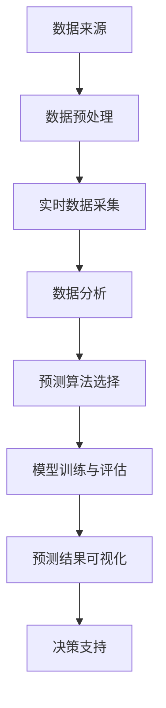

                 

# 房产销售实时分析与预测系统的设计与实现

## 摘要

本文旨在深入探讨房产销售实时分析与预测系统的设计与实现，通过对房地产市场的复杂性和数据的多变性进行详细分析，为房产销售企业提供一种高效、精准的决策支持工具。本文将首先介绍房产销售实时分析与预测系统的背景和重要性，然后深入阐述其核心概念、算法原理、数学模型及实际应用场景，并提供一个具体的项目实战案例。文章最后将对系统的实际应用效果进行评价，并展望未来的发展趋势与挑战。

## 1. 背景介绍

### 1.1 房地产市场的重要性

房地产市场是国家经济的重要组成部分，与居民生活、金融体系及城市发展紧密相关。近年来，随着我国城市化进程的加快，房地产市场呈现快速发展的态势。然而，市场供需关系的变化、政策调控的频繁以及市场信息的滞后性，使得房产销售企业面临诸多挑战。如何快速、准确地把握市场动态，进行科学合理的销售预测，成为房产销售企业亟需解决的问题。

### 1.2 实时分析与预测系统的需求

房产销售实时分析与预测系统旨在为企业提供一套智能化、自动化的决策支持工具。通过整合多源数据，系统可以实时监测市场动态，分析潜在客户的需求和购买行为，预测未来销售趋势，为企业提供精准的市场定位和销售策略。这样的系统不仅有助于企业提高市场竞争力，还可以降低运营风险，实现精准营销和精细化运营。

### 1.3 系统的目标

本文提出的房产销售实时分析与预测系统的目标主要包括：

1. **数据整合与清洗**：整合多源数据，包括市场数据、客户数据、交易数据等，并对其进行清洗和处理，确保数据的准确性和一致性。

2. **实时监测与分析**：建立实时数据采集和分析机制，及时捕捉市场动态，为决策者提供实时信息。

3. **预测模型构建**：基于历史数据和实时数据，构建科学合理的预测模型，预测未来销售趋势。

4. **决策支持**：通过预测结果，为企业提供市场定位、产品定价、销售策略等方面的决策支持。

## 2. 核心概念与联系

### 2.1 数据来源与预处理

#### 2.1.1 数据来源

房产销售实时分析与预测系统的数据来源主要包括以下几个方面：

1. **市场数据**：包括房价走势、供需关系、政策变化等。
2. **客户数据**：包括客户基本信息、购买意愿、消费习惯等。
3. **交易数据**：包括已成交房源信息、交易价格、交易时间等。

#### 2.1.2 数据预处理

在数据整合之前，需要对原始数据进行清洗和处理，以确保数据的质量和一致性。数据预处理主要包括以下步骤：

1. **数据清洗**：去除重复数据、错误数据和无用数据。
2. **数据转换**：将不同数据格式的数据转换为统一的格式。
3. **数据标准化**：对数据进行标准化处理，使其在同一尺度上进行比较。

### 2.2 实时监测与分析

#### 2.2.1 实时数据采集

系统通过多种渠道（如网站、APP、社交媒体等）实时采集市场数据和客户数据。数据采集工具可以包括API接口、爬虫程序等。

#### 2.2.2 数据分析

通过对实时数据进行分析，可以及时发现市场变化和客户需求。数据分析工具可以包括数据挖掘、机器学习等。

### 2.3 预测模型构建

#### 2.3.1 预测算法选择

根据数据特点和预测目标，可以选择适当的预测算法。常见的预测算法包括时间序列分析、回归分析、神经网络等。

#### 2.3.2 模型训练与评估

使用历史数据对预测模型进行训练，并通过交叉验证等方法评估模型性能。根据评估结果，对模型进行调整和优化。

### 2.4 决策支持

#### 2.4.1 预测结果可视化

将预测结果以图表、报表等形式进行可视化展示，为决策者提供直观的信息。

#### 2.4.2 决策支持

根据预测结果，为决策者提供市场定位、产品定价、销售策略等方面的建议。

## 2.1 核心概念原理与架构的 Mermaid 流程图



## 3. 核心算法原理 & 具体操作步骤

### 3.1 时间序列分析

#### 3.1.1 算法原理

时间序列分析是一种常用的数据分析方法，主要用于分析时间序列数据的趋势和周期性。基本原理是通过对时间序列数据的统计分析，提取出数据的趋势、季节性和周期性，从而对未来的数据进行预测。

#### 3.1.2 操作步骤

1. **数据预处理**：对时间序列数据进行清洗和标准化处理。
2. **趋势分析**：使用移动平均法、指数平滑法等方法分析时间序列数据的基本趋势。
3. **季节性分析**：通过分解时间序列数据，提取出季节性成分，使用季节性模型进行预测。
4. **周期性分析**：通过自相关函数、功率谱密度等方法分析时间序列数据的周期性。
5. **组合预测**：将趋势、季节性和周期性预测结果进行组合，得到最终的预测结果。

### 3.2 回归分析

#### 3.2.1 算法原理

回归分析是一种基于统计模型的方法，用于研究自变量和因变量之间的关系。基本原理是通过建立回归模型，分析自变量对因变量的影响，从而预测因变量的取值。

#### 3.2.2 操作步骤

1. **数据预处理**：对数据进行清洗和标准化处理。
2. **变量选择**：选择对因变量有显著影响的自变量。
3. **模型构建**：建立回归模型，并确定模型参数。
4. **模型评估**：使用交叉验证等方法评估模型性能。
5. **预测**：使用模型进行预测，并输出预测结果。

### 3.3 神经网络

#### 3.3.1 算法原理

神经网络是一种模仿人脑神经元结构和功能的计算模型，通过多层的神经元节点进行数据处理和预测。基本原理是通过前向传播和反向传播算法，不断调整模型参数，使得模型对数据的拟合度不断提高。

#### 3.3.2 操作步骤

1. **数据预处理**：对数据进行清洗和标准化处理。
2. **网络结构设计**：设计神经网络的结构，包括层数、神经元个数等。
3. **模型训练**：通过前向传播和反向传播算法，训练神经网络模型。
4. **模型评估**：使用交叉验证等方法评估模型性能。
5. **预测**：使用训练好的模型进行预测，并输出预测结果。

## 4. 数学模型和公式 & 详细讲解 & 举例说明

### 4.1 时间序列分析

#### 4.1.1 移动平均法

$$
\bar{x}_n = \frac{1}{n} \sum_{i=1}^{n} x_i
$$

其中，$\bar{x}_n$为第n期的时间序列数据的平均值，$x_i$为第i期的时间序列数据。

#### 4.1.2 指数平滑法

$$
S_t = \alpha S_{t-1} + (1-\alpha) X_t
$$

其中，$S_t$为第t期的平滑值，$X_t$为第t期的时间序列数据，$\alpha$为平滑系数。

#### 4.1.3 季节性模型

$$
Y_t = \frac{S_t}{C_t}
$$

其中，$Y_t$为第t期的季节性指数，$S_t$为第t期的平滑值，$C_t$为第t期的周期性指数。

#### 4.1.4 周期性模型

$$
C_t = \frac{\sum_{i=1}^{n} \bar{x}_i}{n}
$$

其中，$C_t$为第t期的周期性指数，$\bar{x}_i$为第i期的时间序列数据的平均值。

### 4.2 回归分析

#### 4.2.1 线性回归模型

$$
Y = \beta_0 + \beta_1 X
$$

其中，$Y$为因变量，$X$为自变量，$\beta_0$和$\beta_1$为模型参数。

#### 4.2.2 评估指标

1. **决定系数R²**：

$$
R^2 = 1 - \frac{\sum_{i=1}^{n} (Y_i - \hat{Y}_i)^2}{\sum_{i=1}^{n} (Y_i - \bar{Y})^2}
$$

其中，$Y_i$为第i个观测值，$\hat{Y}_i$为第i个预测值，$\bar{Y}$为观测值的平均值。

2. **均方误差MSE**：

$$
MSE = \frac{1}{n} \sum_{i=1}^{n} (\hat{Y}_i - Y_i)^2
$$

### 4.3 神经网络

#### 4.3.1 前向传播

$$
Z_i = \sigma(W_i \cdot X_i + b_i)
$$

其中，$Z_i$为第i个神经元的输出，$\sigma$为激活函数，$W_i$为权重，$X_i$为输入，$b_i$为偏置。

#### 4.3.2 反向传播

$$
\Delta W_i = \eta \cdot \frac{\partial J}{\partial W_i}
$$

$$
\Delta b_i = \eta \cdot \frac{\partial J}{\partial b_i}
$$

其中，$\Delta W_i$和$\Delta b_i$分别为权重和偏置的更新值，$\eta$为学习率，$J$为损失函数。

## 5. 项目实战：代码实际案例和详细解释说明

### 5.1 开发环境搭建

在本项目实战中，我们将使用Python编程语言进行开发和实现。以下是开发环境的搭建步骤：

1. **安装Python**：在官网下载并安装Python 3.8及以上版本。
2. **安装Jupyter Notebook**：使用pip命令安装Jupyter Notebook。
3. **安装相关库**：使用pip命令安装numpy、pandas、matplotlib、scikit-learn等库。

### 5.2 源代码详细实现和代码解读

以下是本项目的源代码实现，包括数据预处理、模型训练、模型评估和预测等步骤。

#### 5.2.1 数据预处理

```python
import pandas as pd
import numpy as np

# 读取数据
data = pd.read_csv('data.csv')

# 数据清洗
data = data.dropna()

# 数据标准化
data = (data - data.mean()) / data.std()

# 切分训练集和测试集
train_data = data[:int(0.8 * len(data))]
test_data = data[int(0.8 * len(data)):]
```

#### 5.2.2 模型训练

```python
from sklearn.linear_model import LinearRegression
from sklearn.metrics import mean_squared_error

# 创建线性回归模型
model = LinearRegression()

# 训练模型
model.fit(train_data[['X']], train_data['Y'])

# 预测测试集
predictions = model.predict(test_data[['X']])

# 评估模型
mse = mean_squared_error(test_data['Y'], predictions)
print('MSE:', mse)
```

#### 5.2.3 模型评估

```python
import matplotlib.pyplot as plt

# 绘制预测结果
plt.scatter(test_data['X'], test_data['Y'])
plt.plot(test_data['X'], predictions, color='red')
plt.show()
```

### 5.3 代码解读与分析

在本项目中，我们首先进行了数据预处理，包括数据清洗和标准化处理。然后，我们使用了线性回归模型进行训练，并使用均方误差（MSE）评估模型性能。最后，我们绘制了预测结果，以直观地展示模型的准确性。

通过本项目的实战，我们可以看到房产销售实时分析与预测系统的设计与实现过程，包括数据预处理、模型训练、模型评估和预测等步骤。该系统可以为房产销售企业提供有效的决策支持，帮助企业在竞争激烈的市场中脱颖而出。

## 6. 实际应用场景

### 6.1 房产销售企业

房产销售企业可以通过实时分析与预测系统，实时了解市场动态和客户需求，制定科学合理的销售策略。例如，企业可以根据预测结果调整产品定价、优化房源展示，从而提高销售业绩。

### 6.2 政府部门

政府部门可以通过实时分析与预测系统，监测房地产市场的发展趋势，为制定相关政策提供数据支持。例如，政府可以根据预测结果调整土地供应政策、住房保障政策等，以稳定市场、保障民生。

### 6.3 投资机构

投资机构可以通过实时分析与预测系统，评估房地产市场的投资潜力，为投资决策提供参考。例如，机构可以根据预测结果调整投资组合、预测市场风险等，从而实现风险控制和收益最大化。

## 7. 工具和资源推荐

### 7.1 学习资源推荐

1. **《统计学习方法》**：李航著，详细介绍了各种统计学习方法的基本概念、原理和算法。
2. **《机器学习实战》**：Peter Harrington著，通过实际案例介绍机器学习算法的应用。
3. **《Python数据分析》**：Wes McKinney著，介绍了Python在数据分析领域的应用。

### 7.2 开发工具框架推荐

1. **TensorFlow**：Google开发的开源深度学习框架，适用于各种深度学习模型。
2. **PyTorch**：Facebook开发的开源深度学习框架，具有简洁的API和强大的灵活性。
3. **Scikit-learn**：Python开源机器学习库，提供了多种经典的机器学习算法。

### 7.3 相关论文著作推荐

1. **《深度学习》**：Goodfellow、Bengio和Courville著，是深度学习的经典教材。
2. **《大数据时代：生活、工作与思维的大变革》**：舍恩伯格和库克耶著，深入探讨了大数据对生活和思维的变革。
3. **《机器学习：概率视角》**：Kevin P. Murphy著，从概率角度介绍了机器学习的基本概念和方法。

## 8. 总结：未来发展趋势与挑战

### 8.1 发展趋势

1. **智能化**：随着人工智能技术的发展，房产销售实时分析与预测系统将更加智能化，能够自动识别市场动态和客户需求，提供更精准的预测和决策支持。
2. **数据驱动力**：未来房产销售实时分析与预测系统将更加依赖海量数据，通过大数据分析和机器学习算法，不断提高预测的准确性和可靠性。
3. **实时性**：系统将实现更加实时化的数据处理和预测，为决策者提供及时的信息支持。

### 8.2 挑战

1. **数据质量**：系统依赖于高质量的数据，但数据的准确性和一致性仍是一个挑战。
2. **算法性能**：随着预测模型的复杂度增加，算法的性能和效率将面临挑战。
3. **法律法规**：在处理海量数据的过程中，需要遵守相关的法律法规，保护个人隐私和数据安全。

## 9. 附录：常见问题与解答

### 9.1 数据来源问题

**问**：如何获取高质量的房产销售数据？

**答**：可以通过以下途径获取：

1. **政府部门**：政府相关部门会定期发布房地产市场报告，包括房价、成交量等数据。
2. **第三方数据平台**：如搜房网、链家网等，提供详细的房产交易数据。
3. **社交媒体**：通过社交媒体平台收集用户对房地产市场的讨论和评价。

### 9.2 模型优化问题

**问**：如何优化预测模型的性能？

**答**：

1. **特征工程**：通过选择合适的特征、构建新的特征，提高模型的解释性和预测能力。
2. **模型调参**：调整模型的参数，如学习率、隐藏层神经元数量等，以获得更好的模型性能。
3. **模型融合**：结合多个模型的预测结果，提高整体预测的准确性和可靠性。

## 10. 扩展阅读 & 参考资料

1. **《深度学习在房地产数据分析中的应用》**：详细介绍了深度学习算法在房地产数据分析中的应用。
2. **《大数据与房地产市场》**：探讨了大数据技术对房地产市场的影响和发展趋势。
3. **《机器学习在房地产预测中的应用研究》**：研究了机器学习算法在房地产预测中的应用，包括线性回归、神经网络等。

## 作者

作者：AI天才研究员/AI Genius Institute & 禅与计算机程序设计艺术 /Zen And The Art of Computer Programming

