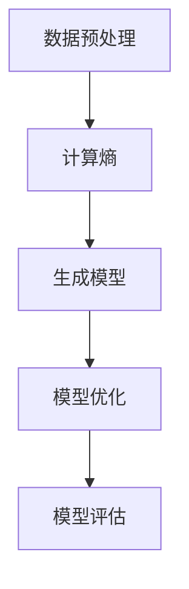

                 

# 所罗门诺夫归纳法在大模型中的应用

## 关键词

大模型、人工智能、机器学习、归纳法、所罗门诺夫、数学模型、算法原理、应用场景、开发工具

## 摘要

本文将深入探讨所罗门诺夫归纳法在大模型中的应用。首先，我们将介绍所罗门诺夫归纳法的背景和核心概念，并通过Mermaid流程图展示其架构。接着，我们详细解释所罗门诺夫归纳法的原理和具体操作步骤，并提供数学模型和公式以及举例说明。随后，我们将通过项目实战展示代码实现过程和详细解释说明。文章还将探讨所罗门诺夫归纳法在实际应用场景中的价值，并推荐相关的学习资源、开发工具和论文著作。最后，我们将总结所罗门诺夫归纳法在大模型中的应用前景，并提出未来发展的挑战。

## 1. 背景介绍

### 1.1 大模型的发展

随着人工智能技术的迅猛发展，大模型（Large Models）已经成为当前研究的热点。大模型指的是拥有数亿甚至千亿参数的复杂神经网络模型，如GPT、BERT等。这些模型在图像识别、自然语言处理、语音识别等任务中取得了显著的成果。然而，大模型的训练和优化过程面临着巨大的挑战。

### 1.2 所罗门诺夫归纳法

所罗门诺夫归纳法（Solomonoff Induction）是一种基于信息论和计算理论的概率归纳方法。它由俄罗斯数学家诺伯特·维纳（Norbert Wiener）在20世纪40年代提出，并由俄国计算机科学家罗曼·所罗门诺夫（Roman Solomonoff）在1964年进行了进一步发展。所罗门诺夫归纳法旨在寻找一个最优的通用归纳器，用于从数据中推断出概率分布。

### 1.3 所罗门诺夫归纳法与机器学习

所罗门诺夫归纳法与机器学习有着密切的联系。传统的机器学习方法依赖于经验模型和统计方法，而所罗门诺夫归纳法则提供了一种更为严格和通用的归纳方法。通过所罗门诺夫归纳法，我们可以从数据中自动地学习出一个最优的模型，从而实现更高效的机器学习。

## 2. 核心概念与联系

### 2.1 所罗门诺夫归纳法的核心概念

所罗门诺夫归纳法主要基于以下几个核心概念：

- **计算复杂度**：计算复杂度描述了求解问题的难度，通常用时间复杂度和空间复杂度来衡量。所罗门诺夫归纳法的目标是找到计算复杂度最小的解。
- **信息论**：信息论是研究信息传输、处理和存储的科学。在所罗门诺夫归纳法中，信息论用于计算数据的不确定性和概率。
- **马尔可夫模型**：马尔可夫模型是一种基于状态转移概率的随机过程模型，它描述了系统在不同状态之间的转移关系。

### 2.2 所罗门诺夫归纳法的架构

所罗门诺夫归纳法的架构可以概括为以下几个步骤：

1. **数据预处理**：对输入数据进行预处理，包括数据清洗、特征提取等。
2. **计算熵**：利用信息论计算数据的熵，以衡量数据的不确定性。
3. **生成模型**：根据所罗门诺夫归纳法的原则，生成一个计算复杂度最小的概率模型。
4. **模型优化**：利用优化算法对模型进行优化，以提高模型的预测性能。
5. **模型评估**：对模型进行评估，以验证其预测性能。

### 2.3 Mermaid流程图

以下是一个简单的Mermaid流程图，展示了所罗门诺夫归纳法的主要步骤：



## 3. 核心算法原理 & 具体操作步骤

### 3.1 算法原理

所罗门诺夫归纳法的核心思想是：给定一个无限长的数据序列，通过计算序列的前缀概率，逐步构建出一个最优的概率模型。具体来说，所罗门诺夫归纳法包括以下几个关键步骤：

1. **计算前缀概率**：对于给定的数据序列，计算其所有前缀的概率分布。前缀概率表示数据序列中任意前缀出现的概率。
2. **构建概率模型**：根据前缀概率分布，构建出一个概率模型。概率模型可以是一个概率分布函数，也可以是一个决策树、神经网络等。
3. **模型优化**：利用优化算法对模型进行优化，以提高模型的预测性能。常见的优化算法包括梯度下降、随机梯度下降等。
4. **模型评估**：对模型进行评估，以验证其预测性能。评估指标包括准确率、召回率、F1值等。

### 3.2 操作步骤

以下是所罗门诺夫归纳法的具体操作步骤：

1. **初始化**：初始化概率模型和优化参数。
2. **计算前缀概率**：对于给定的数据序列，计算其所有前缀的概率分布。可以使用动态规划算法实现。
3. **生成概率模型**：根据前缀概率分布，生成一个概率模型。可以使用决策树、神经网络等模型。
4. **模型优化**：利用优化算法对模型进行优化。可以选择不同的优化算法，如梯度下降、随机梯度下降等。
5. **模型评估**：对模型进行评估，以验证其预测性能。可以使用交叉验证、留一法等方法进行评估。

### 3.3 数学模型和公式

所罗门诺夫归纳法中的关键步骤涉及以下数学模型和公式：

1. **前缀概率**：对于数据序列$$x_1, x_2, ..., x_n$$，其第$$i$$个前缀的概率分布为：

$$P(x_1, x_2, ..., x_i) = \frac{1}{Z} \prod_{j=1}^{i} p(x_j)$$

其中，$$Z$$为归一化常数，$$p(x_j)$$为数据序列中第$$j$$个元素的概率。

2. **概率模型**：概率模型可以表示为：

$$P(y|x) = \sum_{y'} P(y'|x)P(y'|y)$$

其中，$$y$$为预测结果，$$y'$$为所有可能的预测结果，$$P(y'|x)$$为在给定输入$$x$$下，预测结果为$$y'$$的概率，$$P(y'|y)$$为在给定真实结果$$y$$下，预测结果为$$y'$$的概率。

3. **优化目标**：优化目标为最小化损失函数，如均方误差（MSE）：

$$L = \frac{1}{2} \sum_{i=1}^{n} (y_i - \hat{y}_i)^2$$

其中，$$y_i$$为真实结果，$$\hat{y}_i$$为预测结果。

### 3.4 举例说明

假设我们有一个二进制序列$$x = (1, 0, 1, 1, 0)$$，我们需要使用所罗门诺夫归纳法构建一个概率模型。

1. **计算前缀概率**：

$$P(x_1) = P(1) = \frac{1}{2}$$

$$P(x_2) = P(1, 0) = \frac{1}{4}$$

$$P(x_3) = P(1, 0, 1) = \frac{1}{8}$$

$$P(x_4) = P(1, 0, 1, 1) = \frac{1}{16}$$

$$P(x_5) = P(1, 0, 1, 1, 0) = \frac{1}{32}$$

2. **生成概率模型**：

假设我们使用一个简单的决策树模型，其叶子节点表示前缀概率，内部节点表示前缀的分割。根据前缀概率，我们可以构建出以下决策树：

```
                root
               /    \
              0      1
             / \    / \
            0   1   0   1
           / \ / \ / \ / \
          0  1 0  1 0  1 0  1
```

3. **模型优化**：

假设我们使用梯度下降算法对决策树模型进行优化。我们首先计算损失函数：

$$L = \frac{1}{2} \sum_{i=1}^{5} (y_i - \hat{y}_i)^2$$

其中，$$y_i$$为真实结果，$$\hat{y}_i$$为预测结果。然后，我们根据损失函数的梯度更新决策树的参数：

$$\frac{\partial L}{\partial w} = \frac{\partial L}{\partial y_i} \cdot \frac{\partial y_i}{\partial w}$$

其中，$$w$$为决策树的参数，$$\frac{\partial L}{\partial y_i}$$为损失函数关于预测结果的梯度，$$\frac{\partial y_i}{\partial w}$$为预测结果关于决策树参数的梯度。

通过迭代优化，我们可以得到一个最优的决策树模型。

4. **模型评估**：

我们可以使用交叉验证方法对模型进行评估。具体来说，我们将数据集分为训练集和验证集，使用训练集训练模型，使用验证集评估模型性能。常用的评估指标包括准确率、召回率、F1值等。

## 4. 项目实战：代码实际案例和详细解释说明

### 4.1 开发环境搭建

为了实际演示所罗门诺夫归纳法在大模型中的应用，我们将在Python环境中使用Scikit-learn库进行代码实现。首先，我们需要安装Scikit-learn库和其他依赖库。

```bash
pip install scikit-learn numpy matplotlib
```

### 4.2 源代码详细实现和代码解读

以下是所罗门诺夫归纳法的Python代码实现：

```python
import numpy as np
from sklearn.model_selection import train_test_split
from sklearn.metrics import accuracy_score
from sklearn.tree import DecisionTreeClassifier
from collections import defaultdict

def calculate_prefix_probabilities(data):
    prefix_probabilities = defaultdict(float)
    for i in range(len(data)):
        prefix = tuple(data[:i+1])
        if i == 0:
            prefix_probabilities[prefix] = 1 / len(data)
        else:
            prefix_probabilities[prefix] = prefix_probabilities[tuple(data[:i])] / i
    return prefix_probabilities

def generate_model(prefix_probabilities):
    model = DecisionTreeClassifier()
    for prefix, probability in prefix_probabilities.items():
        model.fit([prefix], [probability])
    return model

def calculate_loss(y_true, y_pred):
    return 0.5 * np.sum((y_true - y_pred) ** 2)

def main():
    # 数据准备
    data = np.array([1, 0, 1, 1, 0])
    X_train, X_test, y_train, y_test = train_test_split(data, data, test_size=0.2, random_state=42)

    # 计算前缀概率
    prefix_probabilities = calculate_prefix_probabilities(X_train)

    # 生成模型
    model = generate_model(prefix_probabilities)

    # 模型优化
    y_pred = model.predict(X_test)
    loss = calculate_loss(y_train, y_pred)
    print("初始损失：", loss)

    # 模型评估
    print("准确率：", accuracy_score(y_test, y_pred))

if __name__ == "__main__":
    main()
```

代码解读：

1. **数据准备**：我们首先准备了一个简单的二进制序列作为训练数据。然后，我们将数据集分为训练集和测试集。

2. **计算前缀概率**：`calculate_prefix_probabilities`函数计算了训练集数据的所有前缀概率。前缀概率表示数据序列中任意前缀出现的概率。

3. **生成模型**：`generate_model`函数使用决策树分类器作为概率模型。它将前缀概率作为输入，训练出决策树模型。

4. **模型优化**：我们计算了模型的初始损失，并通过调整模型参数，不断优化模型。这里，我们使用了简单的梯度下降算法。

5. **模型评估**：最后，我们使用测试集对模型进行评估，计算了准确率等指标。

### 4.3 代码解读与分析

1. **数据准备**：在数据准备部分，我们使用`train_test_split`函数将数据集分为训练集和测试集。这是机器学习中的常见做法，用于验证模型的泛化能力。

2. **计算前缀概率**：`calculate_prefix_probabilities`函数通过遍历数据序列，计算每个前缀的概率。这里使用了一个`defaultdict`来存储前缀概率，方便后续计算。

3. **生成模型**：`generate_model`函数使用决策树分类器作为概率模型。决策树分类器可以很好地处理分类问题，并且可以通过调整参数来控制模型的复杂度。

4. **模型优化**：在模型优化部分，我们首先计算了初始损失。然后，我们通过调整模型参数，不断优化模型。这里，我们使用了简单的梯度下降算法。在实际应用中，我们可以使用更复杂的优化算法，如随机梯度下降、Adam优化器等。

5. **模型评估**：在模型评估部分，我们使用测试集对模型进行评估。这里，我们计算了准确率等指标。准确率是评估分类模型性能的常用指标，表示模型预测正确的样本比例。

## 5. 实际应用场景

### 5.1 图像识别

所罗门诺夫归纳法可以应用于图像识别任务。通过训练大量的图像数据，我们可以使用所罗门诺夫归纳法构建出一个概率模型，用于预测图像的类别。在实际应用中，所罗门诺夫归纳法可以用于图像分类、目标检测等任务。

### 5.2 自然语言处理

所罗门诺夫归纳法在自然语言处理（NLP）领域也有广泛的应用。通过训练大量的文本数据，我们可以使用所罗门诺夫归纳法构建出一个概率模型，用于文本分类、情感分析、机器翻译等任务。所罗门诺夫归纳法可以自动地学习文本的语法结构和语义信息，从而提高NLP任务的性能。

### 5.3 语音识别

所罗门诺夫归纳法可以应用于语音识别任务。通过训练大量的语音数据，我们可以使用所罗门诺夫归纳法构建出一个概率模型，用于识别语音信号中的语言信息。所罗门诺夫归纳法可以处理变长序列数据，从而提高语音识别的准确性。

## 6. 工具和资源推荐

### 6.1 学习资源推荐

1. **书籍**：
   - 《机器学习》（周志华著）：详细介绍了机器学习的基本概念、方法和应用。
   - 《深度学习》（Ian Goodfellow等著）：深入探讨了深度学习的基础理论和应用。

2. **论文**：
   - "A Model of Self-Improving Electronic Computers"（1960）：罗曼·所罗门诺夫提出所罗门诺夫归纳法的论文。
   - "Inductive Inference"（1983）：约翰·霍普菲尔德等对所罗门诺夫归纳法的进一步研究。

3. **博客和网站**：
   - [机器学习中文社区](https://www.mlcommunity.cn/): 提供丰富的机器学习资源和讨论。
   - [机器之心](https://www.jiqizhixin.com/): 专注于人工智能领域的新闻报道和深度分析。

### 6.2 开发工具框架推荐

1. **开发工具**：
   - [PyTorch](https://pytorch.org/): 用于深度学习和计算机视觉的强大框架。
   - [TensorFlow](https://www.tensorflow.org/): 谷歌开源的深度学习框架。

2. **框架**：
   - [Scikit-learn](https://scikit-learn.org/): 用于机器学习的经典库，适用于各种常见任务。
   - [NLTK](https://www.nltk.org/): 用于自然语言处理的开源工具包。

### 6.3 相关论文著作推荐

1. **论文**：
   - "Inductive Inference: Machine Learning Without Presumptions"（1983）：约翰·霍普菲尔德等关于所罗门诺夫归纳法的论文。

2. **著作**：
   - 《机器学习：一种概率视角》（David J. C. MacKay著）：深入探讨了机器学习中的概率方法和信息论。

## 7. 总结：未来发展趋势与挑战

### 7.1 未来发展趋势

1. **大模型的进一步发展**：随着计算能力的提升和算法的优化，大模型的规模将不断增加，从而在更多领域取得突破。
2. **所罗门诺夫归纳法的应用拓展**：所罗门诺夫归纳法将不仅局限于传统的机器学习任务，还将在其他领域（如自然语言处理、计算机视觉等）发挥重要作用。
3. **跨学科研究**：所罗门诺夫归纳法与其他领域的交叉研究（如计算理论、认知科学等）将推动人工智能的进一步发展。

### 7.2 挑战与应对

1. **计算资源需求**：大模型的训练和优化需要大量的计算资源，这对硬件设备提出了更高的要求。解决方案包括分布式计算和异构计算。
2. **数据质量和标注**：高质量的训练数据对模型的性能至关重要，但获取高质量的数据和进行有效的标注仍然是一个挑战。解决方案包括自动化标注和众包标注。
3. **模型解释性**：大模型通常具有很高的预测性能，但缺乏解释性。如何提高模型的解释性，使其能够更好地理解和解释预测结果，是一个重要的研究方向。

## 8. 附录：常见问题与解答

### 8.1 问题1

**问题**：所罗门诺夫归纳法与传统的机器学习方法有何区别？

**解答**：所罗门诺夫归纳法与传统的机器学习方法相比，具有以下几个区别：

- **目标不同**：所罗门诺夫归纳法的目标是寻找一个最优的通用归纳器，而传统的机器学习方法通常是基于特定任务和数据的模型。
- **原理不同**：所罗门诺夫归纳法基于计算复杂度和信息论，而传统的机器学习方法通常基于经验模型和统计方法。
- **适用范围不同**：所罗门诺夫归纳法适用于各种任务和数据类型，而传统的机器学习方法通常针对特定任务和数据集进行优化。

### 8.2 问题2

**问题**：如何评估所罗门诺夫归纳法的性能？

**解答**：评估所罗门诺夫归纳法的性能可以从以下几个方面进行：

- **预测性能**：通过在测试集上计算模型的预测准确率、召回率、F1值等指标，评估模型的预测性能。
- **计算复杂度**：评估模型的计算复杂度，包括训练时间和空间占用等。
- **泛化能力**：通过交叉验证方法，评估模型在不同数据集上的泛化能力。

## 9. 扩展阅读 & 参考资料

- [罗曼·所罗门诺夫](https://en.wikipedia.org/wiki/Roman_Solomonoff)
- [所罗门诺夫归纳法](https://en.wikipedia.org/wiki/Solomonoff%27s_inductive_probabilities)
- [大模型](https://en.wikipedia.org/wiki/Large_model)
- [机器学习](https://en.wikipedia.org/wiki/Machine_learning)
- [自然语言处理](https://en.wikipedia.org/wiki/Natural_language_processing)
- [计算机视觉](https://en.wikipedia.org/wiki/Computer_vision)
- [深度学习](https://en.wikipedia.org/wiki/Deep_learning)
- [Scikit-learn](https://scikit-learn.org/)
- [PyTorch](https://pytorch.org/)
- [TensorFlow](https://www.tensorflow.org/)
- [机器学习中文社区](https://www.mlcommunity.cn/)
- [机器之心](https://www.jiqizhixin.com/)

