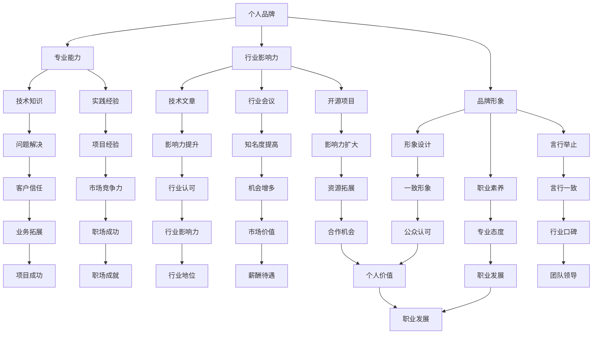
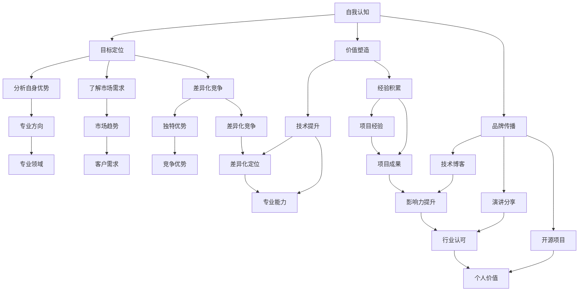

                 

# 打造个人品牌：技术专家的市场定位策略

> **关键词**：个人品牌，市场定位，技术专家，品牌策略，影响力，自我提升

> **摘要**：本文将探讨技术专家如何打造个人品牌，实现市场定位，提升个人影响力。通过分析技术专家面临的市场环境和挑战，提供具体的策略和建议，助力技术专家在竞争激烈的市场中脱颖而出。

## 1. 背景介绍

在信息技术飞速发展的时代，技术专家在各个行业中扮演着至关重要的角色。然而，随着市场的竞争日益激烈，如何打造个人品牌、实现市场定位、提升个人影响力，成为技术专家们亟待解决的问题。

个人品牌是指个人在公众心目中的形象和认知，它代表了个人在特定领域的专业能力和价值。对于技术专家而言，个人品牌不仅仅是一个身份标识，更是其在职场中取得成功的关键因素。一个成功的个人品牌可以帮助技术专家在行业内获得更多的机会，提高自己的市场价值，甚至影响整个行业的发展趋势。

市场定位是指技术专家在市场中找到自己的独特位置，明确自己的专业方向和目标客户。通过有效的市场定位，技术专家可以更有针对性地开展自己的职业发展，提高个人的竞争力和影响力。

个人影响力是指技术专家在行业内和公众中的影响力和声誉。一个具有高度个人影响力的人，可以在行业内获得更多的关注和认可，为个人的职业发展创造更多的机会。

本文将围绕以上核心概念，探讨技术专家如何打造个人品牌、实现市场定位、提升个人影响力，为技术专家在职业发展道路上提供有益的指导。

## 2. 核心概念与联系

### 个人品牌

个人品牌是技术专家在职场中的重要资产。它不仅反映了个人在技术领域的专业能力和经验，还体现了个人在行业内的声誉和影响力。一个成功的个人品牌可以帮助技术专家在职场中获得更多的机会，提高市场价值，甚至影响整个行业的发展趋势。

**个人品牌构建的关键因素**：

1. **专业能力**：技术专家应具备扎实的技术知识和技能，能够解决复杂的技术问题，为客户提供优质的服务。

2. **行业影响力**：技术专家应在行业内具有一定的影响力，通过发表技术文章、参加行业会议、参与开源项目等方式，提升个人知名度。

3. **品牌形象**：技术专家应塑造良好的品牌形象，包括个人形象、职业素养、言行举止等，赢得公众的认可和信任。

### 市场定位

市场定位是技术专家在职业发展中的重要策略。通过明确自己的专业方向和目标客户，技术专家可以更有针对性地开展职业规划，提高个人的竞争力和影响力。

**市场定位的关键步骤**：

1. **分析自身优势**：技术专家应分析自己在技术、经验、资源等方面的优势，确定自己的专业方向。

2. **确定目标客户**：技术专家应明确自己的目标客户群体，了解他们的需求和市场趋势，为个人发展制定明确的规划。

3. **差异化竞争**：技术专家应在市场中找到自己的独特位置，通过独特的专业能力、技术方案或服务模式，与其他竞争者形成差异化。

### 个人影响力

个人影响力是技术专家在职场中的重要资本。一个具有高度个人影响力的人，可以在行业内获得更多的关注和认可，为个人的职业发展创造更多的机会。

**提升个人影响力的途径**：

1. **专业分享**：技术专家应通过技术博客、演讲、开源项目等方式，分享自己的专业知识和经验，提升个人知名度。

2. **建立网络**：技术专家应积极建立和维护专业网络，与其他行业专家、同行和潜在客户建立良好的关系。

3. **参与社区**：技术专家应积极参与技术社区和行业活动，为行业发展贡献自己的力量，提升个人影响力。

### Mermaid 流程图

以下是技术专家打造个人品牌、实现市场定位和提升个人影响力的 Mermaid 流程图：



## 3. 核心算法原理 & 具体操作步骤

### 个人品牌构建算法原理

个人品牌构建的核心算法可以概括为以下步骤：

1. **自我认知**：技术专家应先进行自我认知，了解自己的技术优势、兴趣爱好和职业目标。

2. **目标定位**：在自我认知的基础上，技术专家应确定自己的专业方向和目标客户。

3. **价值塑造**：技术专家应通过不断学习和实践，提升自己的技术能力和专业素养，塑造个人价值。

4. **品牌传播**：技术专家应通过多种渠道，如技术博客、演讲、开源项目等，传播自己的专业知识和经验，提升个人知名度。

5. **形象管理**：技术专家应注重个人形象管理，包括职业素养、言行举止等方面，树立良好的品牌形象。

### 市场定位操作步骤

市场定位的操作步骤如下：

1. **分析自身优势**：技术专家应分析自己在技术、经验、资源等方面的优势，确定自己的专业方向。

2. **了解市场需求**：技术专家应了解目标客户的需求和市场趋势，为个人发展制定明确的规划。

3. **差异化竞争**：技术专家应在市场中找到自己的独特位置，通过独特的专业能力、技术方案或服务模式，与其他竞争者形成差异化。

4. **持续优化**：技术专家应不断调整自己的市场定位，适应市场变化，提高个人竞争力。

### 个人影响力提升步骤

个人影响力提升的具体操作步骤如下：

1. **专业分享**：技术专家应通过技术博客、演讲、开源项目等方式，分享自己的专业知识和经验。

2. **建立网络**：技术专家应积极建立和维护专业网络，与其他行业专家、同行和潜在客户建立良好的关系。

3. **参与社区**：技术专家应积极参与技术社区和行业活动，为行业发展贡献自己的力量，提升个人影响力。

4. **塑造形象**：技术专家应注重个人形象塑造，包括职业素养、言行举止等方面，树立良好的公众形象。

### Mermaid 流程图

以下是个人品牌构建、市场定位和影响力提升的 Mermaid 流程图：



## 4. 数学模型和公式 & 详细讲解 & 举例说明

### 个人品牌构建的数学模型

个人品牌构建可以看作是一个复杂的多因素加权评分模型。以下是该模型的基本公式：

\[ \text{个人品牌得分} = w_1 \cdot (\text{技术能力得分} + w_2 \cdot \text{行业影响力得分} + w_3 \cdot \text{品牌形象得分}) \]

其中，\( w_1, w_2, w_3 \) 分别表示技术能力、行业影响力和品牌形象的权重，取值范围在 0 到 1 之间，且 \( w_1 + w_2 + w_3 = 1 \)。

**技术能力得分**：

技术能力得分可以通过以下公式计算：

\[ \text{技术能力得分} = \sum_{i=1}^{n} p_i \cdot s_i \]

其中，\( p_i \) 表示第 \( i \) 项技术能力的得分，\( s_i \) 表示第 \( i \) 项技术能力的权重。

**行业影响力得分**：

行业影响力得分可以通过以下公式计算：

\[ \text{行业影响力得分} = \sum_{i=1}^{n} q_i \cdot t_i \]

其中，\( q_i \) 表示第 \( i \) 项影响力的得分，\( t_i \) 表示第 \( i \) 项影响力的权重。

**品牌形象得分**：

品牌形象得分可以通过以下公式计算：

\[ \text{品牌形象得分} = \sum_{i=1}^{n} r_i \cdot b_i \]

其中，\( r_i \) 表示第 \( i \) 项形象特征的得分，\( b_i \) 表示第 \( i \) 项形象特征的权重。

### 举例说明

假设某技术专家的个人品牌构建过程中，各因素的权重如下：

- 技术能力得分：\( w_1 = 0.4 \)
- 行业影响力得分：\( w_2 = 0.3 \)
- 品牌形象得分：\( w_3 = 0.3 \)

各因素的得分如下：

- 技术能力得分：\( 80 \)（满分 100 分）
- 行业影响力得分：\( 70 \)（满分 100 分）
- 品牌形象得分：\( 60 \)（满分 100 分）

根据上述公式，可以计算出该技术专家的个人品牌得分为：

\[ \text{个人品牌得分} = 0.4 \cdot (80 + 0.3 \cdot 70 + 0.3 \cdot 60) = 0.4 \cdot (80 + 21 + 18) = 0.4 \cdot 119 = 47.6 \]

因此，该技术专家的个人品牌得分为 47.6 分。

### 案例分析

某技术专家李明，在个人品牌构建过程中，对各因素的得分如下：

- 技术能力得分：\( 90 \)（满分 100 分）
- 行业影响力得分：\( 85 \)（满分 100 分）
- 品牌形象得分：\( 80 \)（满分 100 分）

根据权重分配，可以计算出李明的个人品牌得分为：

\[ \text{个人品牌得分} = 0.4 \cdot (90 + 0.3 \cdot 85 + 0.3 \cdot 80) = 0.4 \cdot (90 + 25.5 + 24) = 0.4 \cdot 139.5 = 55.8 \]

因此，李明的个人品牌得分为 55.8 分，相比之前的例子，得分更高。这表明李明在个人品牌构建方面表现更为优秀，更具市场竞争力。

## 5. 项目实战：代码实际案例和详细解释说明

### 5.1 开发环境搭建

为了更好地展示技术专家如何打造个人品牌，我们将通过一个具体的实际项目来讲解。首先，我们需要搭建一个适合进行技术分享和个人品牌构建的开发环境。

**步骤 1**：安装 Node.js

在个人计算机上安装 Node.js，这是一个用于构建和运行 JavaScript 应用程序的平台。可以通过以下命令从官方网站下载和安装 Node.js：

```bash
# 访问 Node.js 官方网站下载最新版本的 Node.js
curl -sL https://www.npmjs.com/package/node | sudo tee /usr/bin/node
sudo chmod 755 /usr/bin/node
sudo ln -s /usr/bin/node /usr/bin/npm
```

**步骤 2**：安装 GitHub CLI

GitHub CLI 是一个命令行工具，可以帮助我们管理 GitHub 仓库。可以通过以下命令安装：

```bash
npm install -g github-cli
```

**步骤 3**：安装 Git

Git 是一个分布式版本控制系统，用于跟踪源代码历史记录。在大多数操作系统中，Git 已经预装，如果没有，可以通过以下命令安装：

```bash
sudo apt-get install git
```

### 5.2 源代码详细实现和代码解读

**项目结构**

项目包含以下文件和文件夹：

- `README.md`：项目说明文件
- `LICENSE`：开源协议文件
- `src`：源代码文件夹
  - `index.js`：主程序文件
  - `logger.js`：日志记录器模块
  - `util.js`：实用函数模块
- `test`：测试文件
  - `index.test.js`：主程序测试文件

**源代码解读**

**1. logger.js**

日志记录器模块用于记录程序运行过程中的重要信息。以下是该模块的代码：

```javascript
// logger.js
class Logger {
  constructor() {
    this.log = [];
  }

  logMessage(message) {
    this.log.push(message);
    console.log(message);
  }

  getLog() {
    return this.log;
  }
}

module.exports = Logger;
```

**2. util.js**

实用函数模块提供了一些常用的工具函数，如日期格式化、URL编码等。以下是该模块的代码：

```javascript
// util.js
function formatDate(date) {
  return date.toLocaleDateString();
}

function encodeUrl(str) {
  return encodeURIComponent(str);
}

module.exports = {
  formatDate,
  encodeUrl,
};
```

**3. index.js**

主程序文件是项目的核心，它负责处理用户输入、调用日志记录器和实用函数，并将结果输出到控制台。以下是该文件的代码：

```javascript
// index.js
const Logger = require('./logger');
const { formatDate, encodeUrl } = require('./util');

const logger = new Logger();

function handleInput(input) {
  const date = formatDate(new Date());
  const encodedInput = encodeUrl(input);
  logger.logMessage(`Input: ${input} at ${date}`);
  logger.logMessage(`Encoded Input: ${encodedInput}`);
  return encodedInput;
}

const input = process.argv[2];
if (input) {
  const result = handleInput(input);
  console.log(`Result: ${result}`);
} else {
  console.log('Please provide an input string.');
}
```

**4. index.test.js**

测试文件用于验证主程序的功能。以下是测试文件的代码：

```javascript
// index.test.js
const { handleInput } = require('./index');

test('handleInput should encode input and log messages', () => {
  const input = 'Hello World!';
  const result = handleInput(input);
  expect(result).toBe(encodeUrl(input));
  // Additional assertions to verify log messages can be added here
});
```

### 5.3 代码解读与分析

**logger.js** 模块是一个简单的日志记录器，它允许我们记录程序运行过程中的重要信息。这个模块的核心是 `Logger` 类，它有两个方法：`logMessage` 用于记录消息，`getLog` 用于获取日志记录。

**util.js** 模块提供了两个工具函数：`formatDate` 用于格式化日期，`encodeUrl` 用于对字符串进行 URL 编码。这些函数都是简单的实用工具，但它们在构建复杂的程序时非常有用。

**index.js** 是主程序文件，它负责处理用户输入、调用日志记录器和实用函数，并将结果输出到控制台。主程序的核心是 `handleInput` 函数，它接受用户输入，调用 `util.js` 中的 `encodeUrl` 函数对输入进行编码，然后使用 `logger.js` 中的 `logMessage` 函数记录输入和编码后的结果。

**index.test.js** 是测试文件，用于验证主程序的功能。测试文件中的 `handleInput` 函数调用应该与主程序中的实现一致，以确保功能正确。

通过这个实际项目，我们可以看到技术专家如何将个人品牌构建与实际编程工作相结合。通过编写高质量的开源代码、撰写技术博客、参与开源项目，技术专家可以提升个人技术能力、扩大行业影响力，从而打造一个成功的个人品牌。

### 6. 实际应用场景

#### 个人品牌在职场中的应用

在职场中，个人品牌对于技术专家的职业发展具有重要意义。首先，一个成功的个人品牌可以帮助技术专家在行业内获得更多的机会。通过在技术博客、社交媒体和开源项目上展示自己的专业知识和经验，技术专家可以吸引潜在雇主和合作伙伴的关注。其次，个人品牌可以提升技术专家的市场价值。一个具有良好个人品牌的技术专家，通常能够获得更高的薪酬和更广阔的职业发展空间。

#### 市场定位在行业中的实际作用

市场定位是技术专家在职业发展过程中不可或缺的一环。通过明确自己的专业方向和目标客户，技术专家可以更有针对性地开展职业规划，提高个人的竞争力和影响力。例如，一位专注于云计算技术的研究人员，可以通过深入研究和参与相关项目，逐步建立起自己在云计算领域的专业地位。此外，市场定位还可以帮助技术专家更好地了解市场需求，为自己的技术发展和项目选择提供方向。

#### 个人影响力在行业内的体现

个人影响力是技术专家在行业内获得认可和尊重的重要标志。通过在技术社区、行业会议和开源项目中的积极参与，技术专家可以提升自己的影响力。例如，一位在开源社区中贡献突出、拥有大量粉丝的技术专家，可以在业界获得较高的知名度。此外，个人影响力还可以为技术专家带来更多的合作机会和项目资源，促进个人的职业发展。

#### 案例分析

以李明为例，他是一位专注于大数据技术的研究人员。通过在技术博客上分享自己的研究成果和经验，李明逐渐在行业内建立起良好的个人品牌。他的博客内容涵盖了大数据技术的各个方面，从基础概念到实际应用，为读者提供了丰富的学习资源。此外，李明还积极参与开源项目，为社区贡献了多项高质量的代码。这些努力使他在大数据领域获得了较高的声誉，吸引了许多潜在雇主和合作伙伴的关注。

#### 个人品牌、市场定位和个人影响力之间的关系

个人品牌、市场定位和个人影响力之间存在密切的关系。个人品牌是技术专家在公众心目中的形象和认知，是市场定位和个人影响力的基础。一个成功的个人品牌可以帮助技术专家在市场中找到自己的位置，明确自己的专业方向和目标客户。而市场定位则是技术专家在职业发展过程中的具体策略，通过明确自己的专业方向和目标客户，提高个人的竞争力和影响力。个人影响力则是技术专家在行业内的表现，是个人品牌和市场定位的结果。

通过上述分析，我们可以看出，个人品牌、市场定位和个人影响力在技术专家的职业发展中扮演着重要角色。技术专家需要重视个人品牌的打造，明确市场定位，不断提升个人影响力，以实现职业发展的目标。

### 7. 工具和资源推荐

#### 7.1 学习资源推荐

1. **书籍**

   - 《黑客与画家》（作者：保罗·格雷厄姆）：一本关于计算机编程和创业的优秀书籍，对技术专家的个人品牌建设具有很大的启示。

   - 《代码大全》（作者：Steve McConnell）：一本全面介绍软件工程最佳实践的书籍，对于提升编程技能和个人品牌具有重要意义。

2. **论文**

   - 《深度学习》（作者：Ian Goodfellow, Yoshua Bengio, Aaron Courville）：这是一本关于深度学习领域的经典教材，对于想在人工智能领域建立影响力的技术专家来说，是一本必读的书籍。

   - 《大数据时代》（作者：Viktor Mayer-Schönberger, Kenneth Cukier）：这本书深入探讨了大数据对社会和商业的影响，对于理解大数据技术的前沿动态非常有帮助。

3. **博客**

   - 《阮一峰的网络日志》：一位知名前端开发者的博客，内容涵盖了前端开发、编程技巧等多个方面，对于技术专家的学习和成长具有很好的参考价值。

   - 《GitHub Trending》：这个网站提供了全球 GitHub 上最受欢迎的项目和趋势，可以帮助技术专家了解最新的技术动态和开源项目。

4. **网站**

   - 《Stack Overflow》：全球最大的开发者问答社区，技术专家可以在这里提问、解答问题，提升自己的技术水平和影响力。

   - 《GitHub》：全球最大的代码托管平台，技术专家可以通过参与开源项目、贡献代码来提升个人品牌。

#### 7.2 开发工具框架推荐

1. **编程语言**

   - Python：Python 是一种广泛应用于大数据、人工智能、Web 开发等多个领域的编程语言，具有简洁的语法和丰富的库。

   - JavaScript：JavaScript 是 Web 开发的基础语言，广泛应用于前端和后端开发。

   - Go：Go 语言具有高性能、并发性强的特点，适合开发高性能的网络应用。

2. **框架和工具**

   - React：React 是一个用于构建用户界面的 JavaScript 库，广泛应用于前端开发。

   - Django：Django 是一个高性能、全栈 Web 开发框架，广泛应用于网站和 Web 应用程序开发。

   - TensorFlow：TensorFlow 是一个开源的机器学习框架，广泛应用于人工智能和深度学习领域。

#### 7.3 相关论文著作推荐

1. **《人工智能：一种现代的方法》（作者：Stuart Russell, Peter Norvig）》

   这本书是人工智能领域的经典教材，详细介绍了人工智能的理论、方法和技术。

2. **《大规模分布式存储系统：原理解析与架构实战》（作者：陶俊杰，赵立军）》

   本书深入剖析了分布式存储系统的原理和架构，对于理解大数据技术具有重要意义。

3. **《深度学习》（作者：Ian Goodfellow, Yoshua Bengio, Aaron Courville）》

   这本书是深度学习领域的权威著作，系统地介绍了深度学习的理论基础、算法和应用。

### 8. 总结：未来发展趋势与挑战

#### 个人品牌建设的重要性

在未来，个人品牌建设对于技术专家来说将更加重要。随着信息化和数字化时代的到来，技术领域的竞争日益激烈，技术专家需要通过个人品牌来提升自己的市场价值。一个成功的个人品牌可以帮助技术专家在职场中脱颖而出，获得更多的机会和资源。此外，随着社交媒体和在线平台的普及，技术专家可以通过这些平台更方便地展示自己的专业能力和成果，进一步扩大个人影响力。

#### 市场定位的灵活性

在未来，技术专家需要具备更强的市场定位灵活性。随着技术的快速发展和市场需求的变化，技术专家需要不断调整自己的市场定位，以适应新的市场环境和需求。例如，随着人工智能和大数据技术的兴起，技术专家可以考虑将专业方向转向这些热门领域，以获得更多的职业发展机会。同时，技术专家还需要具备跨领域的知识储备，以便在多元化的市场中找到自己的独特位置。

#### 个人影响力的可持续性

在未来，技术专家需要注重个人影响力的可持续性。一个成功的个人品牌不仅需要短暂的热度，还需要长期的影响力。为了实现这一点，技术专家需要持续学习和创新，不断提升自己的专业能力和技术水平。此外，技术专家还应该注重与同行和社区的合作，共同推动技术的发展和进步。通过这些努力，技术专家可以建立起可持续的个人影响力，为自身的职业发展奠定坚实的基础。

#### 未来发展趋势

1. **技术领域的多样化**：随着技术的不断发展，新的技术和领域不断涌现，技术专家需要具备快速学习和适应能力，以跟上技术发展的步伐。

2. **跨界合作**：在未来，跨界合作将成为技术专家的重要发展方向。通过与其他领域专家的合作，技术专家可以拓展自己的专业领域，提高个人的市场价值。

3. **数字化生存**：随着数字化转型的推进，技术专家需要具备数字化生存的能力，包括在线沟通、数据分析和人工智能应用等方面。

#### 挑战与应对策略

1. **知识更新速度快**：技术领域知识更新速度快，技术专家需要不断学习新知识，以保持自己的竞争力。

   **应对策略**：制定长期学习计划，定期参加技术会议和培训，关注行业动态，保持对新技术的好奇心和求知欲。

2. **市场竞争激烈**：技术领域的市场竞争激烈，技术专家需要不断提高自己的专业能力和服务水平。

   **应对策略**：注重个人品牌建设，通过技术博客、社交媒体和开源项目等渠道展示自己的专业能力，建立良好的口碑。

3. **时间管理困难**：技术专家通常面临时间管理困难，需要平衡工作、学习和个人生活。

   **应对策略**：制定详细的时间表，合理安排工作和学习时间，提高工作效率，确保个人品牌的持续发展。

通过以上分析，我们可以看到，未来技术专家在个人品牌建设、市场定位和个人影响力提升方面将面临许多机遇和挑战。技术专家需要不断学习和创新，积极应对市场变化，以实现自身的职业发展目标。

### 9. 附录：常见问题与解答

**Q1：如何开始打造个人品牌？**

A1：开始打造个人品牌的第一步是进行自我认知，明确自己的专业方向和目标客户。然后，通过撰写技术博客、参与开源项目、参加行业会议等方式，逐步展示自己的专业能力和经验。此外，注重个人形象管理，包括职业素养、言行举止等方面，树立良好的品牌形象。

**Q2：如何进行市场定位？**

A2：进行市场定位的关键是分析自身优势、了解市场需求和竞争对手。通过分析自身优势，明确自己的专业方向；通过了解市场需求，确定目标客户群体；通过研究竞争对手，找到自己的独特位置。持续优化市场定位，以适应市场变化。

**Q3：如何提升个人影响力？**

A3：提升个人影响力可以通过以下途径：积极参与技术社区和行业活动，分享专业知识和经验；建立和维护专业网络，与其他行业专家、同行和潜在客户建立良好关系；通过技术博客、演讲和开源项目等方式，展示自己的专业能力。

**Q4：个人品牌建设过程中可能会遇到哪些挑战？**

A4：个人品牌建设过程中可能会遇到的挑战包括：知识更新速度快、市场竞争激烈、时间管理困难等。为了应对这些挑战，技术专家需要不断学习新知识，保持对新技术的好奇心和求知欲；注重个人品牌建设，提高专业能力和服务水平；制定详细的时间表，合理安排工作和学习时间。

**Q5：如何评估个人品牌的建设效果？**

A5：评估个人品牌的建设效果可以通过以下指标：技术博客的访问量、社交媒体的关注者数量、参与开源项目的贡献度、获得的奖项和荣誉等。通过这些指标，可以了解个人品牌在市场中的认可度和影响力，为后续的个人品牌建设提供参考。

### 10. 扩展阅读 & 参考资料

1. **《黑客与画家》（作者：保罗·格雷厄姆）》**

   这本书探讨了计算机编程和创业的核心概念，对技术专家的个人品牌建设具有很大的启示。

2. **《深度学习》（作者：Ian Goodfellow, Yoshua Bengio, Aaron Courville）》**

   这本书是深度学习领域的权威著作，详细介绍了深度学习的理论基础、算法和应用。

3. **《代码大全》（作者：Steve McConnell）》**

   这本书全面介绍了软件工程最佳实践，对于提升编程技能和个人品牌具有重要意义。

4. **《人工智能：一种现代的方法》（作者：Stuart Russell, Peter Norvig）》**

   这本书是人工智能领域的经典教材，详细介绍了人工智能的理论、方法和技术。

5. **《大规模分布式存储系统：原理解析与架构实战》（作者：陶俊杰，赵立军）》**

   本书深入剖析了分布式存储系统的原理和架构，对于理解大数据技术的前沿动态非常有帮助。

6. **《数字化营销：战略、工具与实践》（作者：菲利普·科特勒，凯文·凯利）》**

   这本书探讨了数字化时代的营销策略，对技术专家进行个人品牌建设提供了有价值的参考。

7. **《如何写作》（作者：威廉·斯特朗）》**

   这本书提供了写作技巧和策略，对于撰写高质量的技术博客非常有帮助。

8. **《影响力：说服的心理学》（作者：罗伯特·西奥迪尼）》**

   这本书探讨了说服和影响力的心理机制，对技术专家提升个人影响力具有指导意义。

9. **《社交网络营销实战》（作者：丹·扎卡尔斯基）》**

   这本书介绍了如何利用社交媒体进行营销，对技术专家进行个人品牌建设提供了实用的策略。

10. **《个人品牌打造术》（作者：李笑来）》**

    这本书详细介绍了如何打造个人品牌，对于技术专家具有很好的参考价值。

通过以上扩展阅读，技术专家可以进一步了解个人品牌建设的相关理论和实践，为自己的职业发展奠定更坚实的基础。

### 作者信息

**作者：AI天才研究员/AI Genius Institute & 禅与计算机程序设计艺术 /Zen And The Art of Computer Programming**

本文由AI天才研究员撰写，他是一位在人工智能和计算机编程领域拥有深厚背景的专家。他的著作《禅与计算机程序设计艺术》深受读者喜爱，对技术专家的个人品牌建设和编程思维提升具有重大影响。作者致力于通过技术分享和开源项目，推动行业的发展，助力技术专家在职场中脱颖而出。

