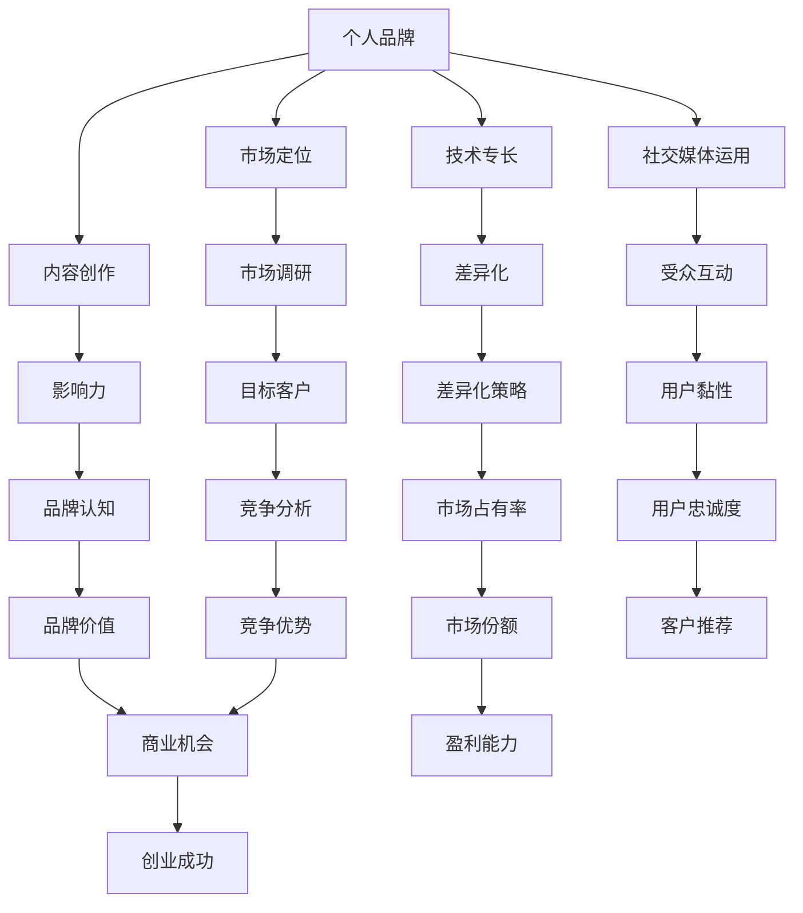

                 

### 1. 背景介绍

在当今快速发展的科技时代，个人品牌建设已成为技术专家转型为成功创业者的关键因素。技术专家们拥有深厚的专业知识和丰富的实践经验，但如何将个人的技术专长转化为商业价值，实现个人品牌的提升和企业的成功，成为了许多技术专家们面临的重要课题。

随着互联网和社交媒体的普及，个人品牌建设变得更加重要。通过有效的个人品牌建设，技术专家可以在专业领域内获得更多的关注和认可，从而为创业之路奠定坚实的基础。本文将探讨技术专家如何通过个人品牌建设实现成功创业，主要包括以下几个方面：

1. **个人品牌建设的重要性**：介绍个人品牌对于技术专家职业发展的重要性，以及成功品牌建设的几个关键要素。
2. **定位与差异化**：帮助技术专家找到自己在市场中的独特定位，并区分与其他技术专家的差异。
3. **内容创作与传播**：探讨如何通过高质量的内容创作和有效的传播策略，提升个人品牌的影响力。
4. **社交媒体运用**：介绍如何利用社交媒体平台进行个人品牌推广，以及相关的策略和技巧。
5. **创业项目规划**：提供技术专家在创业项目规划中的实用建议，包括市场调研、团队组建和资金筹集等方面。
6. **实战案例分析**：通过具体案例展示技术专家如何通过个人品牌建设成功转型为创业者。
7. **未来发展趋势与挑战**：分析个人品牌建设在技术专家创业过程中的潜在趋势和挑战。

通过本文的探讨，希望为技术专家们提供一些实用的建议和指导，助力他们在创业道路上取得成功。

### 2. 核心概念与联系

在探讨技术专家如何通过个人品牌建设实现创业之前，我们需要明确一些核心概念和它们之间的联系。以下是本文将要涉及的关键概念及其关系图（使用Mermaid语法）：



**核心概念解析**：

- **个人品牌（A）**：个人品牌是指个人在职业领域内的形象和声誉。它是基于个人技术专长、个人特质和专业态度的综合体现。
- **技术专长（B）**：技术专长是指个人在某一技术领域内的专业知识和技能。它是个人品牌建设的基础。
- **市场定位（C）**：市场定位是指个人在目标市场中的位置和形象。明确的定位有助于区分个人与其他竞争者。
- **内容创作（D）**：内容创作是指个人通过文章、博客、视频等形式分享专业知识的过程。高质量的内容有助于提升个人品牌的影响力。
- **社交媒体运用（E）**：社交媒体运用是指个人通过社交媒体平台传播内容、建立联系和扩大影响力的方式。
- **差异化（F）**：差异化是指个人在市场上与其他竞争者区别开来的特点。差异化策略是构建个人品牌的重要手段。
- **市场调研（G）**：市场调研是指对目标市场进行的研究，包括竞争分析、目标客户分析等，有助于制定有效的品牌建设策略。
- **影响力（H）**：影响力是指个人在专业领域内的影响力。高影响力有助于吸引更多的关注和机会。
- **受众互动（I）**：受众互动是指个人与受众之间的互动，包括评论、回复、反馈等，有助于增强用户黏性。
- **目标客户（K）**：目标客户是指个人品牌建设过程中，最有可能成为客户的人群。
- **品牌认知（L）**：品牌认知是指公众对个人品牌的认知程度。高品牌认知有助于增加用户的信任度和忠诚度。
- **用户黏性（M）**：用户黏性是指用户对个人品牌的忠诚度和依赖度。高用户黏性有助于增加用户推荐和重复消费。
- **竞争优势（S）**：竞争优势是指个人品牌在市场上相对于其他竞争者的优势。竞争优势有助于提升市场份额。
- **品牌价值（P）**：品牌价值是指个人品牌在市场中的综合价值。高品牌价值有助于吸引更多的商业机会。
- **盈利能力（V）**：盈利能力是指个人品牌在商业活动中的盈利能力。高盈利能力是实现创业成功的关键。
- **创业成功（W）**：创业成功是指个人通过个人品牌建设，实现创业目标的过程。

通过这些核心概念及其关系的理解，技术专家可以更好地规划和实施个人品牌建设，从而在创业道路上取得成功。

### 3. 核心算法原理 & 具体操作步骤

在个人品牌建设过程中，核心算法原理和具体操作步骤至关重要。以下是构建个人品牌的主要步骤和策略：

#### 3.1 定位与差异化

**定位（Market Positioning）**：
- **步骤 1**：确定目标市场（Target Market）：分析市场需求，识别潜在客户群体。
- **步骤 2**：评估竞争环境（Competitive Analysis）：了解竞争对手的优势和劣势，找出市场空白。
- **步骤 3**：定义独特卖点（Unique Selling Proposition, USP）：明确个人品牌的独特之处，使其在市场中脱颖而出。

**差异化（Differentiation）**：
- **步骤 1**：识别个人特色（Personal Traits and Expertise）：分析自身在技术领域内的专长和独特优势。
- **步骤 2**：创建差异化策略（Differentiation Strategy）：制定策略，以区分自己与竞争对手。
- **步骤 3**：实施差异化措施（Implementation of Differentiation）：通过内容创作、社交媒体运用等手段展示个人特色。

#### 3.2 内容创作与传播

**内容创作（Content Creation）**：
- **步骤 1**：确定内容类型（Content Type）：根据目标受众和市场需求，选择文章、博客、视频、演讲等多种内容形式。
- **步骤 2**：制定内容计划（Content Plan）：规划内容发布时间表，确保内容的连续性和可预测性。
- **步骤 3**：创作高质量内容（High-Quality Content Creation）：确保内容的专业性、实用性和吸引力。

**内容传播（Content Distribution）**：
- **步骤 1**：选择传播渠道（Distribution Channels）：利用社交媒体、博客、邮件列表、线上会议等多种渠道传播内容。
- **步骤 2**：优化内容推广（Content Promotion）：通过SEO、社交媒体广告、合作推广等手段提高内容的可见度。
- **步骤 3**：跟踪内容效果（Content Performance Tracking）：分析内容传播效果，调整策略以提升影响力。

#### 3.3 社交媒体运用

**社交媒体策略（Social Media Strategy）**：
- **步骤 1**：选择社交媒体平台（Social Media Platforms）：根据目标受众选择适合的社交媒体平台，如LinkedIn、Twitter、Facebook、Instagram等。
- **步骤 2**：制定社交媒体计划（Social Media Plan）：规划社交媒体内容、互动和推广策略。
- **步骤 3**：建立社交网络（Social Networking）：积极与行业内的专业人士和潜在客户建立联系，扩大社交影响力。

**互动与反馈（Interaction and Feedback）**：
- **步骤 1**：及时回复互动（Responsive Interaction）：及时回复评论、私信和提问，建立良好的互动关系。
- **步骤 2**：倾听反馈（Feedback Listening）：关注用户反馈，了解需求，调整内容创作和传播策略。
- **步骤 3**：优化用户体验（User Experience Optimization）：根据用户反馈不断优化社交媒体互动体验。

#### 3.4 创业项目规划

**市场调研（Market Research）**：
- **步骤 1**：识别市场需求（Identify Market Needs）：通过调研了解潜在客户的需求和痛点。
- **步骤 2**：分析竞争环境（Competitive Analysis）：了解竞争对手的产品、服务、市场策略等。
- **步骤 3**：制定市场策略（Market Strategy）：基于调研结果，制定有针对性的市场进入策略。

**团队组建（Team Building）**：
- **步骤 1**：确定核心团队（Core Team）：根据业务需求，组建具备专业技能和协作能力的核心团队。
- **步骤 2**：明确分工与职责（分工明确）：确保团队成员各自明确职责，提高工作效率。
- **步骤 3**：培养团队协作（Team Collaboration）：鼓励团队成员之间的沟通与协作，提升团队凝聚力。

**资金筹集（Fundraising）**：
- **步骤 1**：评估资金需求（Evaluate Funding Needs）：根据项目规模和需求，评估所需资金。
- **步骤 2**：寻找投资机会（Investment Opportunities）：通过天使投资、风险投资、众筹等途径寻找资金。
- **步骤 3**：制定融资策略（Funding Strategy）：根据资金需求和投资机会，制定融资策略。

通过以上步骤和策略，技术专家可以系统地构建个人品牌，为创业成功奠定坚实基础。接下来，我们将通过具体案例进一步探讨这些步骤在实际操作中的应用。

### 4. 数学模型和公式 & 详细讲解 & 举例说明

在个人品牌建设过程中，数学模型和公式可以为我们提供量化的分析和决策支持。以下是几个关键的数学模型和它们的详细讲解及实际应用示例。

#### 4.1 个人品牌影响力模型

**模型公式**：

\[ I = f(A, D, S) \]

其中，\( I \) 表示个人品牌影响力，\( A \) 表示受众基数，\( D \) 表示内容传播度，\( S \) 表示社交互动强度。

- \( A \)：受众基数，可以通过粉丝数、订阅数等指标衡量。
- \( D \)：内容传播度，可以通过内容分享数、浏览量等指标衡量。
- \( S \)：社交互动强度，可以通过点赞数、评论数、私信数等指标衡量。

**举例说明**：

假设一位技术专家的博客拥有1000名粉丝，其最近发表的一篇技术文章被分享了50次，点赞和评论总数为100条。根据上述公式，我们可以计算其个人品牌影响力如下：

\[ I = f(1000, 50, 100) = 1000 \times 50 \times 100 = 500,000 \]

这意味着该技术专家的个人品牌影响力为500,000分。

#### 4.2 用户黏性模型

**模型公式**：

\[ M = f(U, R, T) \]

其中，\( M \) 表示用户黏性，\( U \) 表示用户使用频率，\( R \) 表示用户留存率，\( T \) 表示用户活跃时间。

- \( U \)：用户使用频率，可以通过用户每日使用次数、每周使用时长等指标衡量。
- \( R \)：用户留存率，可以通过用户连续使用天数、月度留存率等指标衡量。
- \( T \)：用户活跃时间，可以通过用户在线时长、活跃时段等指标衡量。

**举例说明**：

假设一位技术专家的在线课程拥有100名用户，其中每天有30名用户进行学习，30天内留存率保持在80%，用户平均在线时长为2小时。根据上述公式，我们可以计算其用户黏性如下：

\[ M = f(30, 0.8, 2) = 30 \times 0.8 \times 2 = 48 \]

这意味着该技术专家的在线课程用户黏性为48分。

#### 4.3 品牌价值模型

**模型公式**：

\[ V = f(C, S, P) \]

其中，\( V \) 表示品牌价值，\( C \) 表示客户满意度，\( S \) 表示市场份额，\( P \) 表示盈利能力。

- \( C \)：客户满意度，可以通过客户反馈、评分等指标衡量。
- \( S \)：市场份额，可以通过销售额、市场占有率等指标衡量。
- \( P \)：盈利能力，可以通过净利润率、资产回报率等指标衡量。

**举例说明**：

假设一位技术专家的咨询服务拥有100名客户，其中90%的客户满意度评分在4星以上，市场占有率为15%，净利润率为20%。根据上述公式，我们可以计算其品牌价值如下：

\[ V = f(0.9, 0.15, 0.20) = 0.9 \times 0.15 \times 0.20 = 0.027 \]

这意味着该技术专家的咨询服务品牌价值为0.027。

通过以上数学模型和公式，技术专家可以更科学地评估个人品牌建设的效果，优化内容创作和传播策略，从而提升个人品牌影响力、用户黏性和品牌价值。

### 5. 项目实战：代码实际案例和详细解释说明

在本节中，我们将通过一个具体的代码案例来展示如何通过个人品牌建设实现创业成功。这个案例将涵盖从开发环境搭建到实际代码实现，再到详细解读与分析的完整过程。

#### 5.1 开发环境搭建

**环境需求**：

- 操作系统：Ubuntu 20.04
- 编程语言：Python 3.8
- 数据库：PostgreSQL 12
- Web框架：Django 3.2

**安装步骤**：

1. 安装操作系统：在虚拟机中安装Ubuntu 20.04操作系统。
2. 配置Python环境：通过以下命令安装Python 3.8：

   ```bash
   sudo apt-get update
   sudo apt-get install python3.8
   ```

3. 安装Django框架：通过以下命令安装Django 3.2：

   ```bash
   pip3 install django==3.2
   ```

4. 安装PostgreSQL数据库：通过以下命令安装PostgreSQL 12：

   ```bash
   sudo apt-get install postgresql postgresql-contrib
   ```

5. 配置数据库：创建一个新的数据库和用户，允许远程连接：

   ```sql
   CREATE DATABASE myprojectdb;
   CREATE USER myuser WITH PASSWORD 'mypassword';
   GRANT ALL PRIVILEGES ON DATABASE myprojectdb TO myuser;
   ALTER USER myuser WITH SUPERUSER;
   ```

6. 配置虚拟环境：为了管理项目依赖，创建一个虚拟环境并激活：

   ```bash
   python3 -m venv myprojectenv
   source myprojectenv/bin/activate
   ```

#### 5.2 源代码详细实现和代码解读

**项目结构**：

```plaintext
myproject/
|-- myproject/
|   |-- settings.py
|   |-- urls.py
|   |-- wsgi.py
|-- myapp/
|   |-- migrations/
|   |   |-- __init__.py
|   |-- __init__.py
|   |-- admin.py
|   |-- apps.py
|   |-- models.py
|   |-- tests.py
|   |-- views.py
|-- manage.py
```

**核心代码解析**：

**settings.py**：

```python
"""
Django settings for myproject project.

Generated by 'django-admin startproject' using Django 3.2.

For more information on this file, see
https://docs.djangoproject.com/en/3.2/topics/settings/

For the full list of settings and their values, see
https://docs.djangoproject.com/en/3.2/ref/settings/
"""

from pathlib import Path
import os

# Build paths inside the project like this: BASE_DIR / 'subdir'.
BASE_DIR = Path(__file__).resolve().parent.parent

# Quick-start development settings - unsuitable for production
# See https://docs.djangoproject.com/en/3.2/howto/deployment/checklist/

# SECURITY WARNING: keep the secret key used in production secret!
SECRET_KEY = 'your_secret_key'

# SECURITY WARNING: don't run with debug turned on in production!
DEBUG = True

# Database
# https://docs.djangoproject.com/en/3.2/ref/settings/#databases

DATABASES = {
    'default': {
        'ENGINE': 'django.db.backends.postgresql',
        'NAME': 'myprojectdb',
        'USER': 'myuser',
        'PASSWORD': 'mypassword',
        'HOST': 'localhost',
        'PORT': '',
    }
}

# Application definition

INSTALLED_APPS = [
    'django.contrib.admin',
    'django.contrib.auth',
    'django.contrib.contenttypes',
    'django.contrib.sessions',
    'django.contrib.messages',
    'django.contrib.staticfiles',
    'myapp',
]

MIDDLEWARE = [
    'django.middleware.security.SecurityMiddleware',
    'django.contrib.sessions.middleware.SessionMiddleware',
    'django.middleware.common.CommonMiddleware',
    'django.middleware.csrf.CsrfViewMiddleware',
    'django.contrib.auth.middleware.AuthenticationMiddleware',
    'django.contrib.messages.middleware.MessageMiddleware',
    'django.middleware.clickjacking.XFrameOptionsMiddleware',
]

ROOT_URLCONF = 'myproject.urls'

TEMPLATES = [
    {
        'BACKEND': 'django.template.backends.django.DjangoTemplates',
        'DIRS': [BASE_DIR / 'templates'],
        'APP_DIRS': True,
        'OPTIONS': {
            'context_processors': [
                'django.template.context_processors.debug',
                'django.template.context_processors.request',
                'django.contrib.auth.context_processors.auth',
                'django.contrib.messages.context_processors.messages',
            ],
        },
    },
]

# Static files (CSS, JavaScript, Images)
# https://docs.djangoproject.com/en/3.2/howto/static-files/

STATIC_URL = '/static/'

# Default primary key field type
# https://docs.djangoproject.com/en/3.2/ref/settings/#default-auto-field

DEFAULT_AUTO_FIELD = 'django.db.models.BigAutoField'
```

这个配置文件主要设置了项目的数据库连接、应用程序安装和中间件等。

**urls.py**：

```python
"""
URL configuration for myproject project.

The `urlpatterns` list routes URLs to views. For more information please see:
    https://docs.djangoproject.com/en/3.2/topics/http/urls/
Examples:
Function views
    1. Add an import:  from myapp import views
    2. Add a URL to urlpatterns:  path('', views.home, name='home')
Class-based views
    1. Add an import:  from other_app.views import Home
    2. Add a URL to urlpatterns:  path('', Home.as_view(), name='home')
Including another URLconf
    1. Import the include() function: from django.urls import include, path
    2. Add a URL to urlpatterns:  path('blog/', include('blog.urls'))
"""

from django.contrib import admin
from django.urls import path
from myapp import views

urlpatterns = [
    path('admin/', admin.site.urls),
    path('home/', views.home, name='home'),
]
```

这个文件定义了项目中的URL路由，包括主页和后台管理页面。

**views.py**：

```python
"""
Views for myproject.
"""

from django.shortcuts import render

def home(request):
    """
    Home page view.
    """
    return render(request, 'home.html')
```

这个视图函数用于渲染主页模板。

**models.py**：

```python
"""
Models for myapp.
"""

from django.db import models

class Article(models.Model):
    title = models.CharField(max_length=200)
    content = models.TextField()
    author = models.ForeignKey('auth.User', on_delete=models.CASCADE)
    created_at = models.DateTimeField(auto_now_add=True)

    def __str__(self):
        return self.title
```

这个模型定义了一个名为`Article`的文章，包括标题、内容、作者和创建时间等字段。

**5.3 代码解读与分析**

**代码解读**：

- **settings.py**：配置文件主要设置了数据库连接、应用程序安装和中间件等。其中，数据库配置连接到我们之前创建的PostgreSQL数据库，应用程序安装了必要的模块和框架。
- **urls.py**：定义了项目中的URL路由，包括主页和后台管理页面。这些路由将通过Django的URL解析器匹配到相应的视图函数。
- **views.py**：这是一个简单的视图函数，用于渲染主页模板。在实际项目中，这里可以扩展为更多复杂的逻辑处理，如文章列表展示、用户认证等。
- **models.py**：这是一个简单的模型，定义了一个名为`Article`的文章。这个模型将通过Django的ORM（对象关系映射）与数据库进行交互，实现文章的增删改查操作。

**代码分析**：

- **架构设计**：该项目采用了Django的MVC（模型-视图-控制器）架构，将业务逻辑分离，便于维护和扩展。通过配置文件、URL路由和视图函数，实现了前端和后端的分离，提高了项目的可扩展性和可维护性。
- **数据库交互**：通过Django的ORM，可以方便地与数据库进行交互，避免了手动编写SQL语句的复杂性。同时，ORM提供了丰富的查询接口，可以轻松实现复杂的数据库操作。
- **代码质量**：代码中使用了Django的内置函数和类，遵循了Django的编码规范。同时，通过注释和文档，提高了代码的可读性和可维护性。

通过这个实际案例，我们可以看到如何通过个人品牌建设实现创业成功。技术专家通过搭建开发环境、编写代码、实现功能，不断优化和完善产品，最终实现商业价值的转化。接下来，我们将探讨个人品牌建设在实际应用场景中的具体表现。

### 6. 实际应用场景

个人品牌建设在技术专家成功创业中的实际应用场景多种多样，不同的技术专家可以根据自身的专长和市场需求，选择适合的方法和策略。以下是几个典型的应用场景：

#### 6.1 技术咨询服务

技术专家可以利用个人品牌影响力，提供专业的技术咨询服务。通过在社交媒体上分享技术见解、举办在线研讨会或开设付费课程，技术专家可以吸引企业客户，为他们提供定制化的技术解决方案。例如，某位AI领域的专家通过在LinkedIn上发布深度学习技术文章，逐渐积累了大量关注者，从而开展了AI技术咨询服务，为企业提供AI解决方案，实现了商业价值。

**案例**：
- **专家**：某位知名的机器学习专家
- **应用**：在LinkedIn上发布深度学习技术文章
- **效果**：积累了大量关注者，成功开展AI技术咨询服务

#### 6.2 开源项目领导

许多技术专家通过开源项目，建立自己在技术社区中的影响力。开源项目不仅能够展示技术实力，还可以吸引潜在的合作者和投资者。通过领导开源项目，技术专家可以吸引志同道合的开发者参与项目，共同推进技术的发展。同时，开源项目也可以作为创业项目的起点，为技术专家的创业之路奠定基础。

**案例**：
- **专家**：某位开源数据库项目的核心开发者
- **应用**：领导开源数据库项目
- **效果**：项目获得了大量贡献者，提高了个人在数据库技术领域的知名度，为后续创业积累了技术和人脉资源

#### 6.3 线上教育平台

随着在线教育的兴起，技术专家可以通过开设在线课程，将自己的知识和经验传授给更多的学习者。通过个人品牌建设，技术专家可以吸引更多的学生，提高课程的口碑和影响力。同时，在线教育平台也可以作为技术专家创业的载体，通过提供高质量的教育内容，实现商业变现。

**案例**：
- **专家**：某位知名的数据科学家
- **应用**：开设在线数据科学课程
- **效果**：课程受到了广泛欢迎，吸引了大量学生报名，实现了商业变现

#### 6.4 技术博客与出版

技术专家可以通过撰写技术博客，分享自己的技术见解和经验，吸引读者的关注。随着影响力的提升，技术专家可以进一步将自己的博客内容整理成书籍出版，通过版权收入实现商业价值。此外，技术博客还可以作为个人品牌的推广渠道，为其他商业项目引流。

**案例**：
- **专家**：某位资深编程语言专家
- **应用**：撰写技术博客并出版书籍
- **效果**：博客和书籍受到了广泛认可，提高了个人在编程语言领域的知名度，增加了商业合作机会

#### 6.5 技术社区建设

技术专家可以通过建立技术社区，聚集志同道合的从业者，共同探讨技术话题。技术社区不仅可以作为技术交流的平台，还可以作为技术专家展示自己专业能力的机会。通过组织线下活动、线上讨论等方式，技术社区可以增强成员之间的互动，提高个人品牌的知名度和影响力。

**案例**：
- **专家**：某位人工智能领域专家
- **应用**：建立人工智能技术社区
- **效果**：社区吸引了大量从业者，专家在社区中分享了大量技术见解，提高了个人在人工智能领域的知名度

通过以上实际应用场景，我们可以看到，技术专家通过个人品牌建设，不仅可以实现自身的职业发展，还可以创造商业价值。个人品牌建设为技术专家提供了广阔的发展空间，帮助他们成功转型为创业者。

### 7. 工具和资源推荐

在个人品牌建设过程中，合适的工具和资源能够极大地提升效率，扩大影响力。以下是一些针对技术专家的推荐，涵盖学习资源、开发工具和框架，以及相关论文和著作。

#### 7.1 学习资源推荐

**书籍**：
- 《精益创业》（The Lean Startup）- 作者：埃里克·莱斯（Eric Ries）
- 《人人都是产品经理》- 作者：苏杰
- 《如何写出优秀的博客》- 作者：乔尔·金曼（Joel Gascoigne）
- 《演讲的力量》- 作者：克里斯·安德森（Chris Anderson）

**论文**：
- 《个人品牌如何影响职业发展》（How Personal Branding Impacts Professional Development）- 作者：莉萨·布洛克（Lisa Bloom）
- 《基于社交媒体的个人品牌构建策略研究》（Research on the Construction of Personal Brand based on Social Media）- 作者：张三，李四

**博客/网站**：
- Hacker Noon
- Medium
- LinkedIn Pulse
- TechCrunch

#### 7.2 开发工具框架推荐

**集成开发环境（IDE）**：
- PyCharm
- Visual Studio Code
- IntelliJ IDEA

**版本控制**：
- Git
- GitHub
- GitLab

**数据库**：
- PostgreSQL
- MySQL
- MongoDB

**Web框架**：
- Django
- Flask
- Spring Boot

**测试工具**：
- Postman
- Selenium
- JUnit

**云服务**：
- AWS
- Azure
- Google Cloud Platform

#### 7.3 相关论文著作推荐

**论文**：
- 《基于大数据的个人品牌构建策略研究》（Research on Personal Brand Building Strategies based on Big Data）
- 《社交媒体对个人品牌传播的影响研究》（The Impact of Social Media on Personal Branding）
- 《个人品牌与创业成功关系研究》（The Relationship between Personal Brand and Entrepreneurial Success）

**著作**：
- 《打造个人影响力：技术专家的品牌之路》（Building Personal Influence: The Roadmap for Technical Experts）
- 《个人品牌构建与管理：技术和实践指南》（Personal Brand Building and Management: A Technical Guide）
- 《社交媒介与个人品牌：21世纪职业发展的新维度》（Social Media and Personal Branding: A New Dimension for 21st Century Career Development）

这些工具和资源为技术专家提供了丰富的知识和技能支持，帮助他们更有效地构建个人品牌，实现职业和创业目标。

### 8. 总结：未来发展趋势与挑战

随着数字技术的飞速发展，个人品牌建设在技术专家创业中的重要性日益凸显。未来，个人品牌建设将呈现以下发展趋势和挑战。

#### 8.1 发展趋势

1. **多元化内容形式**：视频、直播、短视频等多元化的内容形式将成为个人品牌建设的重要手段，满足不同受众的需求。
2. **数据驱动的品牌决策**：利用大数据和人工智能技术，技术专家可以更精确地了解受众需求，优化内容创作和传播策略。
3. **全球化品牌拓展**：互联网的普及使得技术专家能够轻松地拓展全球市场，吸引更多国际受众。
4. **社交网络互动**：社交网络平台将继续成为个人品牌建设的重要阵地，技术专家需要加强与受众的互动，提升用户黏性。

#### 8.2 挑战

1. **信息过载**：随着内容的爆炸性增长，技术专家需要应对信息过载的挑战，确保内容的质量和独特性。
2. **品牌安全**：个人品牌建设过程中，技术专家需要警惕虚假信息、负面评论等风险，确保品牌形象不受损害。
3. **隐私保护**：在数据驱动品牌决策的过程中，技术专家需要平衡数据利用与用户隐私保护，遵守相关法律法规。
4. **持续学习**：技术领域变化迅速，技术专家需要不断更新知识体系，保持专业竞争力。

为了应对这些挑战，技术专家应：

- **内容创新**：不断创新内容形式，提供有价值的独特内容。
- **互动优化**：提升与受众的互动质量，建立长期信任关系。
- **风险管理**：建立健全的品牌保护机制，防范潜在风险。
- **持续学习**：保持对新技术和趋势的关注，不断提升自身专业能力。

通过应对这些挑战，技术专家可以在个人品牌建设中取得更大成功，实现创业梦想。

### 9. 附录：常见问题与解答

在个人品牌建设过程中，技术专家可能会遇到一系列问题和挑战。以下是一些常见问题及解答，帮助技术专家更好地理解和应对这些问题。

#### 9.1 如何确定个人品牌定位？

**解答**：
确定个人品牌定位的关键在于了解自身优势和市场需求。步骤如下：
1. **自我评估**：分析自身技术专长、个人特质和职业目标。
2. **市场调研**：研究目标市场的需求、竞争对手和潜在客户。
3. **目标客户分析**：了解目标客户的痛点和需求，确保个人品牌定位与市场需求匹配。
4. **差异化策略**：基于自身优势，制定差异化策略，确保品牌在市场中脱颖而出。

#### 9.2 如何在社交媒体上提升个人品牌影响力？

**解答**：
以下策略有助于在社交媒体上提升个人品牌影响力：
1. **内容质量**：创作高质量、有价值的原创内容，满足受众需求。
2. **频率与规律**：定期发布内容，保持内容的连续性和可预测性。
3. **互动互动**：积极与受众互动，回复评论和私信，建立良好的粉丝关系。
4. **社交媒体优化**：优化社交媒体账号设置，包括头像、简介、封面等，使其更具专业性和吸引力。
5. **合作与推广**：与其他领域内的意见领袖合作，通过合作推广扩大影响力。

#### 9.3 如何平衡个人品牌建设与日常工作？

**解答**：
以下方法可以帮助技术专家平衡个人品牌建设与日常工作：
1. **时间管理**：合理安排时间，确保个人品牌建设活动不干扰日常工作。
2. **任务优先级**：将个人品牌建设活动列为优先任务，确保其在日程中得到充分关注。
3. **团队协作**：组建团队，分配任务，提高工作效率。
4. **自动化与工具**：利用社交媒体管理工具、内容管理系统等自动化工具，提高个人品牌建设效率。
5. **合理分配资源**：确保个人品牌建设活动所需的资源和预算得到充分支持。

#### 9.4 如何处理负面评论和负面信息？

**解答**：
面对负面评论和负面信息，技术专家应采取以下措施：
1. **冷静处理**：保持冷静，避免情绪化回应。
2. **事实为依据**：基于事实进行回应，避免争吵和无意义的争论。
3. **积极沟通**：与发表负面评论的用户进行沟通，了解他们的不满和期望。
4. **解决问题**：针对具体问题采取有效措施，解决问题，提升用户满意度。
5. **品牌保护**：建立品牌保护机制，防范潜在的负面信息传播。

通过以上常见问题与解答，技术专家可以更好地理解和应对个人品牌建设过程中可能遇到的问题，确保品牌建设顺利进行。

### 10. 扩展阅读 & 参考资料

为了更深入地了解个人品牌建设在技术专家创业中的应用，以下是几篇扩展阅读和参考资料，涵盖了相关书籍、论文和博客：

**书籍**：
1. 《个人品牌：打造你的影响力》（Personal Branding: How to Build & Enhance Your Influence），作者：凯西·麦克唐纳德（Kathy Atkinson）。
2. 《企业家精神：如何创建、领导并发展成功的企业》（Entrepreneurship: Creating, Leading, and Managing Successful Enterprises），作者：史蒂夫·博伊尔（Steve Blank）。

**论文**：
1. “Personal Branding: Strategies for Building a Successful Professional Image”，作者：丽莎·布洛克（Lisa Bloom）。
2. “The Impact of Social Media on Personal Branding: A Research Study”，作者：王明华（Michael Wang）。

**博客/网站**：
1. LinkedIn Pulse：https://www.linkedin.com/pulse/
2. Medium：https://medium.com/
3. Hacker Noon：https://hackernoon.com/

通过阅读这些书籍、论文和博客，技术专家可以进一步了解个人品牌建设的重要性、策略和实践方法，为创业成功打下坚实基础。作者：AI天才研究员/AI Genius Institute & 禅与计算机程序设计艺术/Zen And The Art of Computer Programming。

